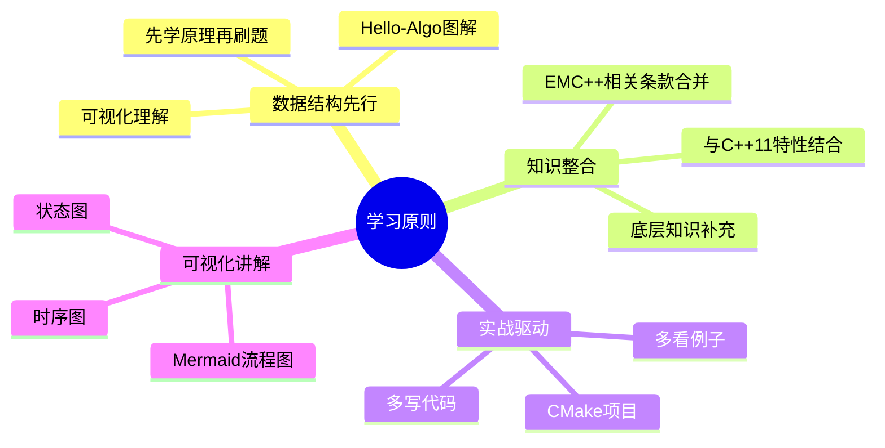

# C++ 35天科学学习规划（最终版）

> 📚 参考：Hello-Algo 数据结构教程、LeetCode 科学刷题方法、Effective Modern C++、C++并发编程实战

---

## 🎯 规划设计理念

### 核心原则



---

## 📁 项目文件结构

```
cpp_35days_learning/
│
├── README.md                           # 项目总览
├── CMakeLists.txt                      # 根CMake配置
├── build.sh                            # 一键编译脚本
│
├── week_01/                            # 第一周：基础入门 + 数组专题
│   ├── README.md                       # 本周学习总结
│   │
│   ├── day_01/                         # Day 1
│   │   ├── README.md                   # 📖 当天学习文档
│   │   ├── CMakeLists.txt              # 🔧 CMake配置
│   │   ├── build_and_run.sh            # 🚀 编译运行脚本
│   │   │
│   │   └── code/                       # 💻 代码目录
│   │       ├── main.cpp                # 主程序入口
│   │       │
│   │       ├── data_structure/         # 数据结构代码
│   │       │   ├── complexity.cpp      # 复杂度分析示例
│   │       │   └── CMakeLists.txt
│   │       │
│   │       ├── cpp11_features/         # C++11特性代码
│   │       │   ├── auto_demo.cpp       # auto演示
│   │       │   ├── auto_rules.cpp      # auto推导规则
│   │       │   └── CMakeLists.txt
│   │       │
│   │       ├── emcpp/                  # Effective Modern C++
│   │       │   ├── item01_template_deduction.cpp
│   │       │   ├── item02_auto_deduction.cpp
│   │       │   ├── item03_decltype.cpp
│   │       │   ├── item04_see_types.cpp
│   │       │   ├── item05_prefer_auto.cpp
│   │       │   └── CMakeLists.txt
│   │       │
│   │       └── leetcode/               # LeetCode刷题
│   │           ├── 0001_two_sum/
│   │           │   ├── solution.h
│   │           │   ├── solution.cpp
│   │           │   ├── test.cpp
│   │           │   └── README.md       # 题目讲解
│   │           │
│   │           ├── 0167_two_sum_ii/
│   │           │   ├── solution.h
│   │           │   ├── solution.cpp
│   │           │   ├── test.cpp
│   │           │   └── README.md
│   │           │
│   │           └── CMakeLists.txt
│   │
│   ├── day_02/                         # Day 2
│   │   ├── README.md
│   │   ├── CMakeLists.txt
│   │   ├── build_and_run.sh
│   │   └── code/
│   │       ├── main.cpp
│   │       ├── data_structure/
│   │       ├── cpp11_features/
│   │       ├── emcpp/
│   │       └── leetcode/
│   │
│   ├── day_03/ ... day_07/             # Day 3-7
│   │
│   └── week_summary/                   # 本周总结
│       ├── README.md                   # 知识图谱
│       ├── exercises/                  # 综合练习
│       └── project/                    # 综合项目
│
├── week_02/                            # 第二周：链表 + 智能指针
│   ├── README.md
│   ├── day_08/
│   ├── day_09/
│   ...
│   └── day_14/
│
├── week_03/                            # 第三周：栈队列 + Lambda
│   ├── README.md
│   ├── day_15/
│   ...
│   └── day_21/
│
├── week_04/                            # 第四周：哈希表 + 移动语义
│   ├── README.md
│   ├── day_22/
│   ...
│   └── day_28/
│
├── week_05/                            # 第五周：树 + 并发编程
│   ├── README.md
│   ├── day_29/
│   ...
│   └── day_35/
│
├── common/                             # 公共代码
│   ├── include/
│   │   ├── list_node.h                 # 链表节点定义
│   │   ├── tree_node.h                 # 树节点定义
│   │   └── test_utils.h                # 测试工具
│   └── CMakeLists.txt
│
└── docs/                               # 文档资源
    ├── images/                         # 图片资源
    └── references/                     # 参考资料
```

---

## 📄 每天文档模板 (README.md)

```markdown
# Day XX：[主题名称]

## 📅 学习目标

- [ ] 掌握XX数据结构原理
- [ ] 理解C++11 XX特性
- [ ] 学习EMC++条款X-X
- [ ] 完成LeetCode题目

---

## 📖 知识点一：[数据结构名称]

### 概念定义

[定义内容]

### 专业介绍

[专业内容]

### 通俗解释

[类比解释]

### 图示


### 代码示例

[代码位置：`code/data_structure/xxx.cpp`]

---

## 📖 知识点二：[C++11特性名称]

### 概念定义

[定义内容]

### EMC++条款X要点

[条款内容]

### 代码示例

[代码位置：`code/cpp11_features/xxx.cpp`]

---

## 🎯 LeetCode 刷题

### 讲解题：LC XXXX [题目名称]

#### 题目描述

[题目描述]

#### 解题思路

[思路分析]

#### 代码实现

[代码位置：`code/leetcode/xxxx_xxx/`]

#### 复杂度分析

- 时间复杂度：O(n)
- 空间复杂度：O(n)

---

### 实战题：LC XXXX [题目名称]

#### 题目链接

[LeetCode链接]

#### 提示

[解题提示]

---

## 🚀 运行代码

```bash
# 编译并运行当天所有代码
./build_and_run.sh

# 或者手动编译
mkdir build && cd build
cmake ..
make
./day_xx_main
```

---

## 📚 相关术语

| 术语 | 英文 | 定义 |
|------|------|------|
| ... | ... | ... |

---

## 💡 学习提示

[注意事项和常见陷阱]

---

## 🔗 参考资料

1. [Hello-Algo - XX章节](https://www.hello-algo.com/)
2. [cppreference - XX](https://en.cppreference.com/)
```

---

## 🔧 CMake配置模板

### 根目录 CMakeLists.txt

```cmake
cmake_minimum_required(VERSION 3.14)
project(cpp_35days_learning VERSION 1.0.0 LANGUAGES CXX)

# C++11 标准
set(CMAKE_CXX_STANDARD 11)
set(CMAKE_CXX_STANDARD_REQUIRED ON)
set(CMAKE_CXX_EXTENSIONS OFF)

# 编译选项
set(CMAKE_CXX_FLAGS "${CMAKE_CXX_FLAGS} -Wall -Wextra -g")
set(CMAKE_CXX_FLAGS_DEBUG "-g -O0")
set(CMAKE_CXX_FLAGS_RELEASE "-O3")

# 公共头文件
include_directories(${CMAKE_SOURCE_DIR}/common/include)

# 公共库
add_subdirectory(common)

# 每周学习
option(BUILD_WEEK_01 "Build Week 01" ON)
option(BUILD_WEEK_02 "Build Week 02" ON)
option(BUILD_WEEK_03 "Build Week 03" ON)
option(BUILD_WEEK_04 "Build Week 04" ON)
option(BUILD_WEEK_05 "Build Week 05" ON)

if(BUILD_WEEK_01)
    add_subdirectory(week_01/day_01)
    add_subdirectory(week_01/day_02)
    add_subdirectory(week_01/day_03)
    add_subdirectory(week_01/day_04)
    add_subdirectory(week_01/day_05)
    add_subdirectory(week_01/day_06)
    add_subdirectory(week_01/day_07)
endif()

# ... 其他周类似

# 线程支持（第五周需要）
find_package(Threads REQUIRED)
```

### 每天目录 CMakeLists.txt (示例：day_01)

```cmake
cmake_minimum_required(VERSION 3.14)

# Day 01 项目
project(day_01_learning LANGUAGES CXX)

# 数据结构示例
add_executable(day01_complexity 
    code/main.cpp
    code/data_structure/complexity.cpp
)
target_link_libraries(day01_complexity PRIVATE common_utils)

# C++11特性示例
add_executable(day01_auto_demo 
    code/cpp11_features/auto_demo.cpp
)

add_executable(day01_auto_rules 
    code/cpp11_features/auto_rules.cpp
)

# EMC++条款示例
add_executable(day01_item01 
    code/emcpp/item01_template_deduction.cpp
)

add_executable(day01_item02 
    code/emcpp/item02_auto_deduction.cpp
)

# LeetCode题目
add_executable(day01_lc0001 
    code/leetcode/0001_two_sum/solution.cpp
    code/leetcode/0001_two_sum/test.cpp
)

add_executable(day01_lc0167 
    code/leetcode/0167_two_sum_ii/solution.cpp
    code/leetcode/0167_two_sum_ii/test.cpp
)

# 综合主程序
add_executable(day01_main 
    code/main.cpp
    code/data_structure/complexity.cpp
    code/cpp11_features/auto_demo.cpp
    code/emcpp/item01_template_deduction.cpp
    code/leetcode/0001_two_sum/solution.cpp
    code/leetcode/0001_two_sum/test.cpp
)
```

---

## 🚀 编译运行脚本模板

### build_and_run.sh（每天目录下）

```bash
#!/bin/bash

# ========================================
# Day XX 编译运行脚本
# ========================================

set -e  # 遇错即停

# 颜色定义
RED='\033[0;31m'
GREEN='\033[0;32m'
YELLOW='\033[1;33m'
BLUE='\033[0;34m'
NC='\033[0m' # No Color

# 项目目录
SCRIPT_DIR="$(cd "$(dirname "${BASH_SOURCE[0]}")" && pwd)"
BUILD_DIR="${SCRIPT_DIR}/build"

echo -e "${BLUE}========================================${NC}"
echo -e "${BLUE}  Day XX: [主题名称] 编译运行${NC}"
echo -e "${BLUE}========================================${NC}"

# 清理旧的build目录
echo -e "${YELLOW}[1/4] 清理构建目录...${NC}"
rm -rf "${BUILD_DIR}"
mkdir -p "${BUILD_DIR}"

# CMake配置
echo -e "${YELLOW}[2/4] CMake 配置...${NC}"
cd "${BUILD_DIR}"
cmake .. 

# 编译
echo -e "${YELLOW}[3/4] 编译项目...${NC}"
make -j$(nproc)

# 运行
echo -e "${YELLOW}[4/4] 运行程序...${NC}"
echo -e "${GREEN}----------------------------------------${NC}"
echo -e "${GREEN}  运行主程序${NC}"
echo -e "${GREEN}----------------------------------------${NC}"
./day_xx_main

echo -e "${GREEN}========================================${NC}"
echo -e "${GREEN}  所有程序运行完成！${NC}"
echo -e "${GREEN}========================================${NC}"

# 可选：运行LeetCode测试
echo -e "${BLUE}----------------------------------------${NC}"
echo -e "${BLUE}  LeetCode 测试结果${NC}"
echo -e "${BLUE}----------------------------------------${NC}"
./day01_lc0001
./day01_lc0167
```

### 根目录 build.sh（一键编译所有）

```bash
#!/bin/bash

# ========================================
# C++ 35天学习 一键编译脚本
# ========================================

set -e

RED='\033[0;31m'
GREEN='\033[0;32m'
YELLOW='\033[1;33m'
BLUE='\033[0;34m'
NC='\033[0m'

ROOT_DIR="$(cd "$(dirname "${BASH_SOURCE[0]}")" && pwd)"
BUILD_DIR="${ROOT_DIR}/build"

echo -e "${BLUE}========================================${NC}"
echo -e "${BLUE}  C++ 35天学习 - 全量编译${NC}"
echo -e "${BLUE}========================================${NC}"

# 清理
rm -rf "${BUILD_DIR}"
mkdir -p "${BUILD_DIR}"

# CMake
cd "${BUILD_DIR}"
cmake .. -DCMAKE_BUILD_TYPE=Debug

# 编译
make -j$(nproc)

echo -e "${GREEN}========================================${NC}"
echo -e "${GREEN}  编译完成！${NC}"
echo -e "${GREEN}  可执行文件位于: ${BUILD_DIR}${NC}"
echo -e "${GREEN}========================================${NC}"

# 列出所有可执行文件
echo -e "${YELLOW}可执行文件列表:${NC}"
find "${BUILD_DIR}" -type f -executable -name "day*" | sort
```

---

## 📅 整体规划总览

| 周次 | 数据结构 | C++11特性 | EMC++条款 | 底层知识 | LeetCode专题 |
|------|---------|-----------|----------|---------|-------------|
| 第1周 | 复杂度、数组 | auto/decltype/nullptr/constexpr/初始化 | 1-8 | 编译流程、内存模型 | 数组、双指针、二分 |
| 第2周 | 链表 | 智能指针(unique/shared/weak)、Pimpl | 17-22 | 堆内存管理、RAII | 链表、快慢指针 |
| 第3周 | 栈、队列 | Lambda/function/bind/enum class | 31-34, 10 | 函数调用栈、栈帧 | 栈队列、单调栈、BFS |
| 第4周 | 哈希表 | 右值引用/移动语义/完美转发/类型别名 | 9, 23-30 | CPU缓存、内存对齐 | 哈希表、字符串 |
| 第5周 | 二叉树、BST | 并发库(thread/mutex/atomic/条件变量) | 35-40, 11-16 | 进程线程、同步机制 | 二叉树、DFS/BFS |

---

## 📋 每周详细规划

### 第一周：基础入门 + 数组专题

| Day | 主题 | 数据结构 | C++11特性 | EMC++条款 | LeetCode |
|-----|------|---------|-----------|----------|----------|
| 01 | 开发环境搭建 | 复杂度分析 | auto类型推导 | 1-5 | 1, 167 |
| 02 | 数组基础 | 数组数据结构 | decltype详解 | 6 | 26, 27 |
| 03 | 初始化专题 | - | 统一初始化 | 7 | 88, 283 |
| 04 | 空指针专题 | - | nullptr详解 | 8 | 11, 15 |
| 05 | 编译期计算 | - | constexpr详解 | - | 209, 3 |
| 06 | 二分查找 | 二分查找算法 | - | - | 704, 34 |
| 07 | 周复习 | 综合复习 | 综合复习 | 1-8复习 | 42, 189 |

---

### 第二周：链表 + 智能指针

| Day | 主题 | 数据结构 | C++11特性 | EMC++条款 | LeetCode |
|-----|------|---------|-----------|----------|----------|
| 08 | 链表入门 | 链表数据结构 | unique_ptr | 17-18 | 203, 206 |
| 09 | 链表操作 | 快慢指针 | shared_ptr | 19-20 | 21, 141 |
| 10 | 循环引用 | - | weak_ptr | 21 | 142, 19 |
| 11 | Pimpl模式 | - | Pimpl模式 | 22 | 23, 61 |
| 12 | 智能指针总结 | - | 智能指针选择 | 17-22复习 | 24, 25 |
| 13 | 堆内存管理 | - | 内存管理 | - | 160, 148 |
| 14 | 周复习 | 链表综合 | 智能指针综合 | 17-22复习 | 234, 138 |

---

### 第三周：栈队列 + Lambda

| Day | 主题 | 数据结构 | C++11特性 | EMC++条款 | LeetCode |
|-----|------|---------|-----------|----------|----------|
| 15 | 栈入门 | 栈数据结构 | Lambda入门 | 31 | 20, 1047 |
| 16 | 队列入门 | 队列数据结构 | Lambda进阶 | 32-33 | 232, 225 |
| 17 | 单调栈 | 单调栈算法 | function/bind | 34 | 739, 496 |
| 18 | 函数调用栈 | 函数调用栈 | enum class | 10 | 84, 42 |
| 19 | 优先队列 | 堆/优先队列 | - | - | 215, 347 |
| 20 | BFS基础 | BFS算法 | - | - | 102, 107 |
| 21 | 周复习 | 栈队列综合 | Lambda综合 | 31-34复习 | 155, 150 |

---

### 第四周：哈希表 + 移动语义

| Day | 主题 | 数据结构 | C++11特性 | EMC++条款 | LeetCode |
|-----|------|---------|-----------|----------|----------|
| 22 | 哈希表入门 | 哈希表数据结构 | 右值引用 | 9 | 242, 383 |
| 23 | 移动语义 | - | 移动语义 | 23-25 | 1, 454 |
| 24 | 通用引用 | - | 通用引用 | 26-28 | 49, 128 |
| 25 | 完美转发 | - | 完美转发 | 29-30 | 3, 438 |
| 26 | CPU缓存 | CPU缓存/对齐 | - | - | 5, 647 |
| 27 | 字符串专题 | 字符串处理 | - | - | 76, 567 |
| 28 | 周复习 | 哈希表综合 | 移动语义综合 | 9,23-30复习 | 146, 460 |

---

### 第五周：树 + 并发编程

| Day | 主题 | 数据结构 | C++11特性 | EMC++条款 | LeetCode |
|-----|------|---------|-----------|----------|----------|
| 29 | 二叉树入门 | 二叉树数据结构 | std::thread | 35 | 144, 145 |
| 30 | 树遍历 | 二叉树遍历 | mutex | 36-37 | 94, 102 |
| 31 | BST | 二叉搜索树 | 条件变量 | 38 | 98, 700 |
| 32 | DFS | DFS算法 | atomic | 39-40 | 104, 111 |
| 33 | 树路径 | 路径问题 | 线程池 | 11-16 | 257, 113 |
| 34 | 并发综合 | 进程线程模型 | 并发综合 | 35-40复习 | 236, 105 |
| 35 | 总结 | 知识体系 | 综合项目 | 全部复习 | 297, 124 |

---

## 📚 代码文件命名规范

### 文件命名

| 类型 | 命名规则 | 示例 |
|------|---------|------|
| 数据结构 | `{结构名}_{操作}.cpp` | `array_operations.cpp` |
| C++11特性 | `{特性名}_demo.cpp` | `auto_demo.cpp` |
| EMC++条款 | `item{条款号}_{主题}.cpp` | `item01_template_deduction.cpp` |
| LeetCode | `{题号}_{题目名}/solution.cpp` | `0001_two_sum/solution.cpp` |
| 测试文件 | `test_{功能}.cpp` | `test_two_sum.cpp` |

### 类/函数命名

```cpp
// 类名：大驼峰
class MyLinkedList { ... };

// 函数名：小驼峰 或 下划线
void reverseList();      // 小驼峰
void reverse_list();     // 下划线风格

// 常量：全大写下划线
const int MAX_SIZE = 100;

// 成员变量：下划线后缀
class Solution {
private:
    int size_;
    ListNode* head_;
};

// LeetCode题解类
class Solution {
public:
    vector<int> twoSum(vector<int>& nums, int target) {
        // ...
    }
};
```

---

## 🧪 公共代码库 (common/)

### list_node.h（链表节点）

```cpp
#ifndef COMMON_LIST_NODE_H
#define COMMON_LIST_NODE_H

// 单链表节点
struct ListNode {
    int val;
    ListNode *next;
    ListNode() : val(0), next(nullptr) {}
    ListNode(int x) : val(x), next(nullptr) {}
    ListNode(int x, ListNode *next) : val(x), next(next) {}
};

// 双向链表节点
struct DoublyListNode {
    int val;
    DoublyListNode *prev;
    DoublyListNode *next;
    DoublyListNode() : val(0), prev(nullptr), next(nullptr) {}
    DoublyListNode(int x) : val(x), prev(nullptr), next(nullptr) {}
};

// 链表工具函数
namespace list_utils {
    // 从数组创建链表
    ListNode* createList(const std::vector<int>& nums);
    
    // 打印链表
    void printList(ListNode* head);
    
    // 释放链表内存
    void deleteList(ListNode* head);
    
    // 链表转数组
    std::vector<int> listToArray(ListNode* head);
}

#endif // COMMON_LIST_NODE_H
```

### tree_node.h（树节点）

```cpp
#ifndef COMMON_TREE_NODE_H
#define COMMON_TREE_NODE_H

// 二叉树节点
struct TreeNode {
    int val;
    TreeNode *left;
    TreeNode *right;
    TreeNode() : val(0), left(nullptr), right(nullptr) {}
    TreeNode(int x) : val(x), left(nullptr), right(nullptr) {}
    TreeNode(int x, TreeNode *left, TreeNode *right) 
        : val(x), left(left), right(right) {}
};

// 树工具函数
namespace tree_utils {
    // 从数组创建树（层序）
    TreeNode* createTree(const std::vector<int>& nums);
    
    // 打印树（层序）
    void printTree(TreeNode* root);
    
    // 释放树内存
    void deleteTree(TreeNode* root);
    
    // 前序遍历
    std::vector<int> preorderTraversal(TreeNode* root);
    
    // 中序遍历
    std::vector<int> inorderTraversal(TreeNode* root);
    
    // 后序遍历
    std::vector<int> postorderTraversal(TreeNode* root);
}

#endif // COMMON_TREE_NODE_H
```

### test_utils.h（测试工具）

```cpp
#ifndef COMMON_TEST_UTILS_H
#define COMMON_TEST_UTILS_H

#include <iostream>
#include <vector>
#include <string>
#include <functional>

// 测试框架
namespace test {

// 颜色输出
constexpr const char* RED = "\033[0;31m";
constexpr const char* GREEN = "\033[0;32m";
constexpr const char* YELLOW = "\033[1;33m";
constexpr const char* RESET = "\033[0m";

// 断言相等
template<typename T>
void assertEqual(const T& expected, const T& actual, const std::string& name = "") {
    if (expected == actual) {
        std::cout << GREEN << "[PASS] " << RESET << name << std::endl;
    } else {
        std::cout << RED << "[FAIL] " << RESET << name 
                  << " - Expected: " << expected 
                  << ", Got: " << actual << std::endl;
    }
}

// 断言向量相等
template<typename T>
void assertVectorEqual(const std::vector<T>& expected, 
                       const std::vector<T>& actual, 
                       const std::string& name = "") {
    bool pass = (expected.size() == actual.size());
    if (pass) {
        for (size_t i = 0; i < expected.size(); ++i) {
            if (expected[i] != actual[i]) {
                pass = false;
                break;
            }
        }
    }
    
    if (pass) {
        std::cout << GREEN << "[PASS] " << RESET << name << std::endl;
    } else {
        std::cout << RED << "[FAIL] " << RESET << name << std::endl;
        std::cout << "  Expected: [";
        for (size_t i = 0; i < expected.size(); ++i) {
            std::cout << expected[i] << (i < expected.size()-1 ? ", " : "");
        }
        std::cout << "]" << std::endl;
        std::cout << "  Got:      [";
        for (size_t i = 0; i < actual.size(); ++i) {
            std::cout << actual[i] << (i < actual.size()-1 ? ", " : "");
        }
        std::cout << "]" << std::endl;
    }
}

// 打印分隔线
void printSeparator(const std::string& title = "") {
    std::cout << YELLOW << "======== " << title << " ========" << RESET << std::endl;
}

// 测试用例结构
struct TestCase {
    std::string name;
    std::function<void()> func;
};

// 运行测试套件
void runTestSuite(const std::vector<TestCase>& tests) {
    int passed = 0;
    for (const auto& test : tests) {
        test.func();
        passed++;
    }
    std::cout << std::endl;
    std::cout << "Total: " << tests.size() << " tests" << std::endl;
}

} // namespace test

#endif // COMMON_TEST_UTILS_H
```

---

## 📚 附录

### A. EMC++ 42条款总索引

| 章节 | 条款 | 内容 | 学习日期 |
|------|------|------|----------|
| 类型推导 | 1-6 | 模板推导、auto、decltype | Day 1-2 |
| 初始化 | 7 | 区分()和{} | Day 3 |
| 空指针 | 8 | 优先使用nullptr | Day 4 |
| 类型别名 | 9 | using vs typedef | Day 22 |
| 枚举 | 10 | enum class | Day 18 |
| 杂项 | 11-16 | delete、const_iterator、noexcept等 | Day 33 |
| 特殊成员 | 17 | 移动构造/赋值生成规则 | Day 8 |
| 智能指针 | 18-22 | unique_ptr、shared_ptr、weak_ptr、Pimpl | Day 8-11 |
| 移动语义 | 23-30 | move、forward、通用引用、引用折叠 | Day 23-25 |
| Lambda | 31-34 | 捕获、初始化捕获、bind | Day 15-17 |
| 并发 | 35-40 | 任务、线程、事件循环、volatile | Day 29-33 |

### B. 推荐学习资源

1. **Hello-Algo**: https://www.hello-algo.com/
2. **LeetCode刷题指南**: https://leetcode.cn/discuss/post/RvFUtj/
3. **cppreference**: https://en.cppreference.com/
4. **Effective Modern C++**: Scott Meyers
5. **C++ Concurrency in Action**: Anthony Williams

### C. 快速开始

```bash
# 克隆项目（假设）
git clone https://github.com/xxx/cpp_35days_learning.git
cd cpp_35days_learning

# 一键编译所有代码
./build.sh

# 运行某天的程序
./build/day01_main

# 或者进入某天目录单独编译
cd week_01/day_01
./build_and_run.sh
```

---

> 🎉 祝学习顺利！35天后你将掌握现代C++核心特性、数据结构与算法、并发编程基础！
