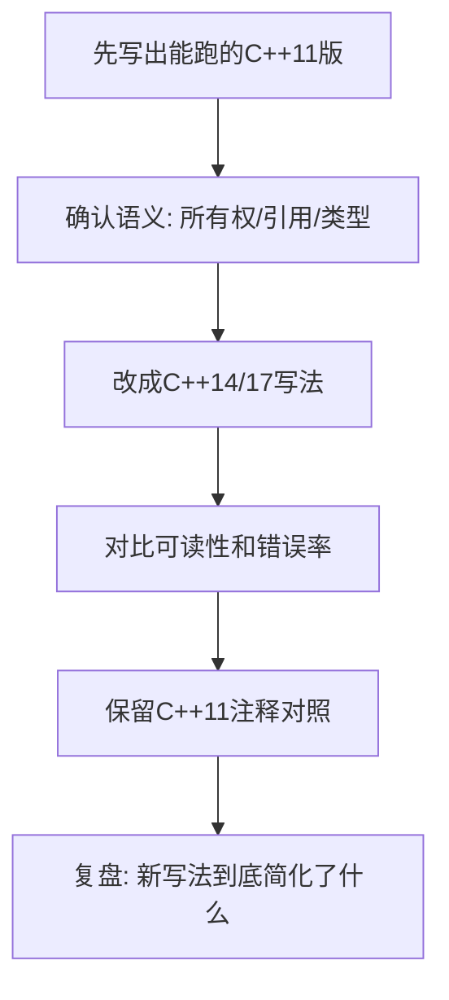
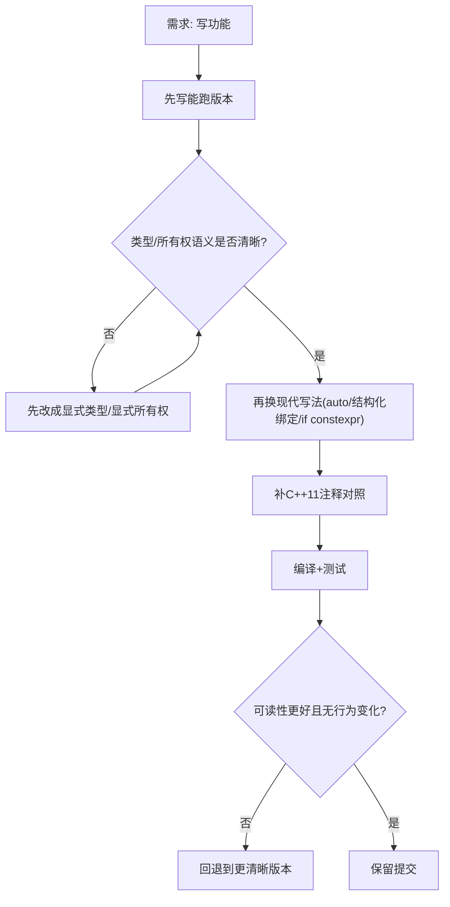
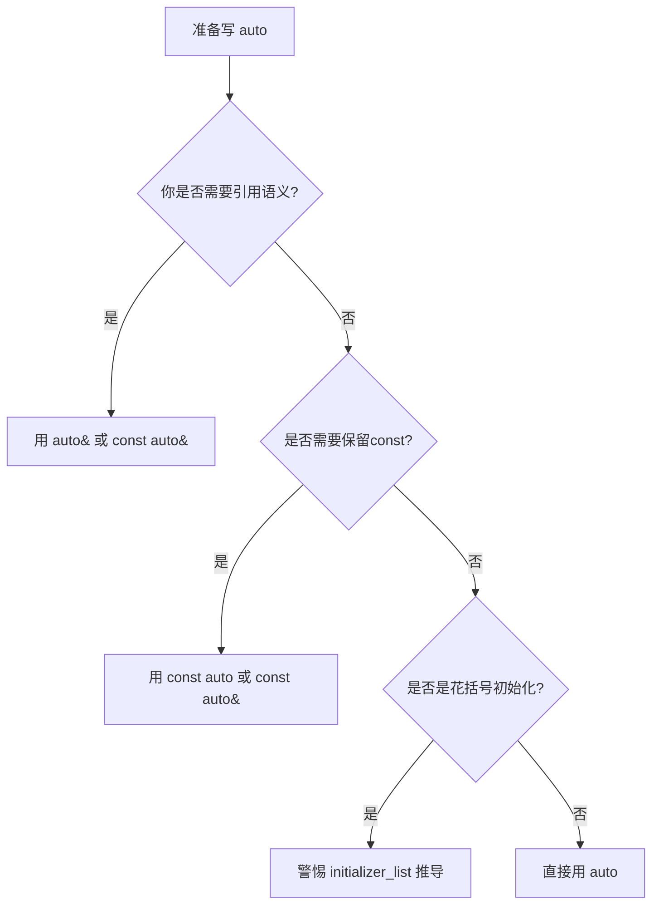
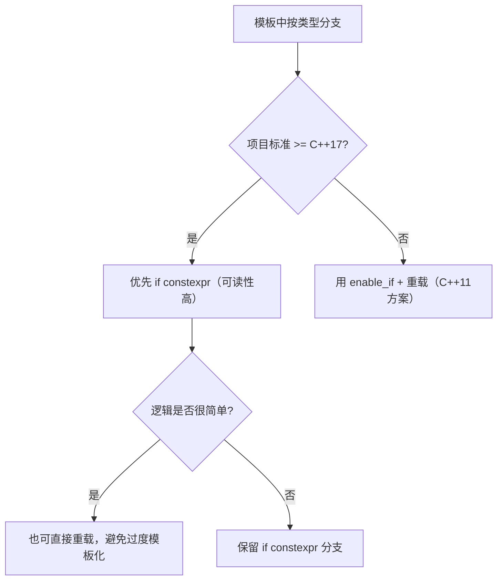

# C++ 新特性超详细入门手册（给小白）

> 目标：你不用背语法，先把“为什么有这个特性、它解决了什么痛点、旧写法怎么对应”真正弄懂。

---

## 0. 先说人话：什么是“新特性”？

你可以把 C++ 语言想成一套“工具箱”：

- C++11：第一次大升级，加入了智能指针、`auto`、`nullptr`、lambda 等
- C++14：在 C++11 上优化易用性（比如 `make_unique`、`decltype(auto)`）
- C++17：继续提升可读性（比如结构化绑定、`if constexpr`、`_v/_t`）

**重点理解**：  
很多新特性不是“能做全新事情”，而是“更安全、更不容易写错、更好读”。

---

## 1. 学习路线（建议顺序）

如果你是小白，按这个顺序最稳：

1. `auto`（类型推导）
2. `decltype` / `decltype(auto)`（精确类型）
3. `make_unique`（智能指针安全构造）
4. 结构化绑定（拆 pair/tuple）
5. `if constexpr`（模板编译期分支）
6. `_v/_t`（语法糖）
7. `std::exchange`（移动语义常用）

---

## 2. `auto`：让编译器帮你写类型

## 2.1 你会遇到的痛点

老写法经常很长：

```cpp
std::vector<std::pair<std::string, int>>::iterator it = v.begin();
```

新写法：

```cpp
auto it = v.begin();
```

更短、更清晰。

## 2.2 `auto` 的核心规则（最重要）

`auto` 会“推导类型”，但有几个坑：

1. 会丢掉顶层 `const`
2. 会丢掉引用（除非你写 `auto&`）
3. 花括号时可能推成 `initializer_list`

### 例子

```cpp
int x = 10;
const int cx = x;
int& rx = x;

auto a = cx;   // a 是 int，不是 const int
auto b = rx;   // b 是 int，不是 int&
auto& c = rx;  // c 是 int&
```

## 2.3 小白版建议

- 你想“保留引用”，就写 `auto&`
- 你想“保留常量引用”，就写 `const auto&`
- 避免 `auto x = {1,2,3}` 这种容易误解的写法

---

## 3. `decltype` 和 `decltype(auto)`：比 `auto` 更精确

## 3.1 `decltype` 是干嘛的

一句话：**拿到表达式“真实类型”**。

```cpp
int x = 0;
decltype(x) a = 1;   // int
decltype((x)) b = x; // int&（注意双括号）
```

为什么会这样？  
因为 `decltype((x))` 看的是“表达式”，`(x)` 是左值表达式，所以得到引用。

## 3.2 `decltype(auto)`（C++14）

它可以让函数返回值“自动但精确”：

```cpp
template<typename C, typename I>
decltype(auto) get(C&& c, I i) {
    return std::forward<C>(c)[i];
}
```

如果 `operator[]` 返回引用，它就返回引用；返回值类型不会被误改。

## 3.3 C++11 对照写法

```cpp
template<typename C, typename I>
auto get(C&& c, I i) -> decltype(std::forward<C>(c)[i]) {
    return std::forward<C>(c)[i];
}
```

---

## 4. `std::make_unique`（C++14）：`unique_ptr` 推荐写法

## 4.1 先理解 `unique_ptr`

`unique_ptr<T>` 表示“独占拥有一个对象”，离开作用域自动释放，防止内存泄漏。

## 4.2 为什么推荐 `make_unique`

```cpp
auto p = std::make_unique<Foo>(1, 2, 3);
```

优点：

1. 不手写 `new`
2. 异常安全更好
3. 可读性高

## 4.3 C++11 对照写法

```cpp
std::unique_ptr<Foo> p(new Foo(1, 2, 3));
```

这两者本质一样，`make_unique` 是更现代更稳的外壳。

---

## 5. 结构化绑定（C++17）：把 `first/second` 拆成可读变量

## 5.1 没有结构化绑定时

```cpp
auto cur = q.front();
TreeNode* node = cur.first;
std::string path = cur.second;
```

## 5.2 有结构化绑定时

```cpp
auto [node, path] = q.front();
```

更直观，一眼就知道变量意义。

## 5.3 你要注意的点

- 默认是“拷贝绑定”
- 如果对象很大，可能想用引用（`auto& [a,b] = obj;`）

---

## 6. `if constexpr`（C++17）：模板里真正好用的“编译期 if”

## 6.1 普通 `if` 为什么不够

模板代码里，普通 `if` 的两边很多时候都会被编译检查。  
即使某条分支永远不会运行，也可能编译报错。

## 6.2 `if constexpr` 的核心价值

未选中的分支会在编译期丢弃，不参与实例化。

```cpp
template<typename T>
void f(T x) {
    if constexpr (std::is_pointer_v<T>) {
        std::cout << *x << "\n";
    } else {
        std::cout << x << "\n";
    }
}
```

## 6.3 C++11 对照思路

用函数重载 + `std::enable_if`（SFINAE）做类型分派。  
能做到同样效果，但代码更绕。

---

## 7. `_v` 和 `_t` 到底是什么？

你常见这些：

- `std::is_same_v<A, B>`
- `std::remove_reference_t<T>`
- `std::enable_if_t<cond, T>`

它们只是“更短写法”：

- `is_same_v<A, B>` = `is_same<A, B>::value`
- `remove_reference_t<T>` = `typename remove_reference<T>::type`
- `enable_if_t<...>` = `typename enable_if<...>::type`

**本质没有变，只是少敲字。**

---

## 8. `std::exchange`（C++14）：移动语义常用小工具

常见于移动构造/移动赋值：

```cpp
ptr_ = std::exchange(other.ptr_, nullptr);
```

含义是：

1. 先拿到 `other.ptr_` 旧值
2. 再把 `other.ptr_` 设为 `nullptr`

## 8.1 C++11 对照写法

```cpp
ptr_ = other.ptr_;
other.ptr_ = nullptr;
```

---

## 9. 最常见报错怎么读（新手友好）

## 9.1 “no member named make_unique in namespace std”

原因：你在 C++11 编译器下用了 C++14 特性。  
解决：升级标准到 C++14+，或改 C++11 写法 `unique_ptr(new T(...))`。

## 9.2 “is_same_v / remove_reference_t not found”

原因：这些是 C++14/17 语法糖。  
解决：用旧写法 `::value` / `::type`。

## 9.3 “if constexpr is a C++17 extension”

原因：编译标准低于 C++17。  
解决：改 CMake 标准，或改为 SFINAE/重载分派。

## 9.4 “auto [a,b] requires C++17”

原因：结构化绑定仅 C++17+。  
解决：回退为 `.first/.second`。

---

## 10. 你现在项目里的实践建议

因为你当前决定“整体按 C++17”：

1. 主业务和练习代码用 C++17 写法（可读性好）
2. 在关键位置保留 C++11 注释对照（你正在做的事情）
3. 新手训练时可先看注释版，再看现代版

---

## 11. 一组“从旧到新”的对照清单

| 场景 | 现代写法 | C++11 对照 |
|---|---|---|
| 独占智能指针 | `auto p = std::make_unique<T>(...)` | `std::unique_ptr<T> p(new T(...))` |
| pair 拆包 | `auto [a, b] = p;` | `auto tmp = p; a=tmp.first; b=tmp.second;` |
| 模板类型分支 | `if constexpr (cond)` | `enable_if + overload` |
| traits 值 | `is_same_v<A,B>` | `is_same<A,B>::value` |
| traits 类型 | `remove_reference_t<T>` | `typename remove_reference<T>::type` |
| 精确返回 | `decltype(auto)` | `auto -> decltype(expr)` |
| 移交并置空 | `exchange(x, nv)` | `tmp=x; x=nv; return tmp;` |

---

## 12. 新手练习（强烈建议）

每个题目都做两版：现代版 + C++11 对照版。

1. 写一个函数返回 `vector` 第 `i` 个元素：先 `auto`，再 `decltype(auto)`。
2. 用 `queue<pair<Node*, string>>` 做 BFS：先 `.first/.second`，再结构化绑定。
3. 写一个模板 `printValue(T)`：先 `if constexpr`，再改 SFINAE。
4. 写一个小类实现移动构造：先 `std::exchange`，再手动三行版本。
5. 把 `make_unique` 全部替换成 C++11 写法，再替换回来，体会可读性差异。

---

## 13. 你真正要记住的 5 句话

1. 新特性大多数是“减少出错成本”，不是“炫技”。
2. 先理解旧写法，再用新写法，理解会更深。
3. 模板代码里 `if constexpr` 是生产力工具。
4. `_v/_t` 只是语法糖，本质是 `::value / ::type`。
5. 写代码优先“团队可读性”，不是“语法越新越好”。

---

如果你希望，我下一步可以在这份文档后面再加一章：  
“把你仓库中的 10 个真实文件逐行讲解（现代写法 vs C++11 对照）”，直接对应你现在改过的那些文件，学习效果会更好。

---

## 14. 真实项目逐文件讲解（你仓库里的例子）

下面这些都是你仓库里真实存在的代码场景，我用“小白视角”解释。

## 14.1 `week_01/day_01/code/cpp11_features/auto_demo.cpp`

场景：智能指针示例中用到 `std::make_unique`。

现代写法：

```cpp
auto uptr = std::make_unique<int>(42);
```

对应旧写法（你已经在代码里加了注释版）：

```cpp
std::unique_ptr<int> uptr(new int(42));
```

你要真正理解的是：

1. 都是在堆上创建 `int`
2. 都让 `unique_ptr` 独占管理
3. 差别是现代写法更安全更简洁

---

## 14.2 `week_01/day_01/code/leetcode/0001_two_sum/solution.cpp`

场景：`unordered_map::insert` 返回 pair，被结构化绑定拆开。

现代写法：

```cpp
auto [it, inserted] = map.insert(...);
```

小白常见困惑：

- `it` 是什么？  
  答：插入位置的迭代器。
- `inserted` 是什么？  
  答：是否真的插入成功（键是否重复）。

旧写法：

```cpp
auto ret = map.insert(...);
auto it = ret.first;
bool inserted = ret.second;
```

---

## 14.3 `week_01/day_01/code/emcpp/type_deduction_items.cpp`

场景：`decltype(auto)` + 完美转发。

这块最容易“看懂但不会用”。

最重要一句话：  
**当你写“转发包装器函数”时，返回类型不能乱写，否则会丢引用语义。**

所以现代写法用 `decltype(auto)`；  
C++11 则用尾置返回类型 `auto -> decltype(...)`。

---

## 14.4 `week_01/day_02/code/cpp11_features/decltype_demo.cpp`

场景：大量 `is_xxx_v`、`remove_reference_t`。

这些都只是简写：

- `is_xxx_v<T>` 等价 `is_xxx<T>::value`
- `remove_reference_t<T>` 等价 `typename remove_reference<T>::type`

你如果记不住，先全部手动写回旧写法，理解后再缩回新写法。

---

## 14.5 `week_01/day_04/code/cpp11_features/nullptr_overload.cpp`

场景：模板可变参数里 `if constexpr` 分支处理不同类型。

为什么用 `if constexpr`？  
因为模板里不同类型行为不同，不想写一堆重载。

什么时候不用 `if constexpr`？  
如果逻辑很简单，直接重载函数可能更清晰。

---

## 14.6 `week_01/day_07/code/project/dynamic_array.cpp/.h`

场景 A：`std::exchange` 用于移动构造/移动赋值。  
场景 B：`enable_if_t` + `is_convertible_v` 限制模板构造。

这两个点都偏“工程型 C++”，你可以先记套路：

1. 移动构造要“接管资源 + 把源对象置空”
2. 模板构造要“限制合法类型，防止误匹配”

---

## 14.7 `week_05/day_33/code/leetcode/0257_binary_tree_paths/solution.cpp`

场景：BFS 里 `auto [node, path] = q.front();`

初学者建议：

1. 先写 `.first/.second` 版跑通
2. 再换成结构化绑定
3. 看可读性变化

---

## 14.8 `week_05/day_35/code/main.cpp`

场景：综合示例里 `make_unique`。

这里是非常典型的“教学代码现代化”：

- 你保留注释版 C++11 写法
- 运行用 C++17 写法

这是非常好的学习方式。

---

## 15. 一张脑图：你该怎么想“新写法 vs 旧写法”



---

## 16. 小白常见误解清单（非常重要）

## 16.1 误解：`auto` 会“自动推对我想要的类型”

现实：`auto` 按规则推导，不按你的“意图”推导。  
你要主动用 `auto&` / `const auto&` 控制语义。

## 16.2 误解：`decltype(auto)` 比 `auto` 高级，所以都用它

现实：`decltype(auto)` 更敏感，容易带来引用语义，滥用会让代码变难读。

## 16.3 误解：`if constexpr` 一定比重载高级

现实：简单逻辑用重载更清楚；复杂模板分支才用 `if constexpr`。

## 16.4 误解：`make_unique` 只是少打字

现实：它同时提升了异常安全和一致性，不只是“省几字符”。

## 16.5 误解：结构化绑定没有成本

现实：默认是拷贝绑定；对象大时要考虑 `auto& [a,b]`。

---

## 17. 分阶段训练计划（7天）

## Day 1：只练 `auto`

- 把 20 个显式类型改为 `auto`
- 再把不该用 `auto` 的改回显式类型

目标：理解“什么时候该用，什么时候不该用”。

## Day 2：练 `decltype` / `decltype(auto)`

- 写 5 个返回引用的函数包装器
- 验证有没有误拷贝

目标：搞清“值 vs 引用”。

## Day 3：练智能指针

- 同一逻辑写两版：`new + unique_ptr` vs `make_unique`

目标：理解所有权转移和异常安全。

## Day 4：练结构化绑定

- 把 10 个 `.first/.second` 改成 `auto [a,b]`
- 对大对象改成 `auto& [a,b]`

目标：掌握可读性与性能平衡。

## Day 5：练 `if constexpr`

- 写模板分支：整数/浮点/指针三种路径
- 再用 SFINAE 重写一遍

目标：理解编译期分派。

## Day 6：练 `_v/_t`

- 把 `_v/_t` 全改回旧写法，再改回来

目标：彻底吃透“语法糖本质”。

## Day 7：项目实战复盘

- 随机选你仓库 10 处新特性点
- 每处说清楚：语义、替代、风险

目标：形成“解释能力”，而不是只会照抄。

---

## 18. 一页速背（面试/复盘用）

1. `auto`：简洁，但会丢顶层 const 和引用。
2. `decltype((x))`：常得到引用类型。
3. `decltype(auto)`：适合包装器返回，别滥用。
4. `make_unique`：`unique_ptr(new T)` 的现代安全版。
5. 结构化绑定：提高可读性，注意拷贝/引用。
6. `if constexpr`：模板里按类型分支，未选分支不实例化。
7. `_v/_t`：只是 `::value / ::type` 的简写。
8. `exchange`：拿旧值并重置，移动语义常用。

---

如果你继续，我可以再给你做一个文件：  
`Modern_CPP_Features_Quiz.md`（30道带答案的练习，按你仓库代码出题）。  
你每天做 10 题，理解会非常扎实。

---

## 19. 配图版：学习流程图

## 19.1 总学习路径图


## 19.2 代码迁移流程图（写代码时照着走）



## 19.3 `auto` 推导决策图



## 19.4 模板分派选择图（`if constexpr` vs SFINAE）



---

## 20. 配图版：记忆表（高频速查）

## 20.1 特性速查总表

| 特性 | 关键词 | 解决的痛点 | 版本 | 记忆口诀 |
|---|---|---|---|---|
| `auto` | 类型推导 | 类型太长、重复书写 | C++11 | “能看懂就 auto，看不懂就显式” |
| `decltype` | 精确类型 | 获取表达式真实类型 | C++11 | “双括号更容易出引用” |
| `decltype(auto)` | 精确自动返回 | 包装函数不丢引用 | C++14 | “转发返回用它，不要乱用” |
| `make_unique` | 智能构造 | 手写 `new` 易错 | C++14 | “独占资源先想到 make_unique” |
| 结构化绑定 | `auto [a,b]` | `.first/.second` 难读 | C++17 | “先拆名字，再读语义” |
| `if constexpr` | 编译期分支 | 模板分支难写且易报错 | C++17 | “模板分支优先它” |
| `_v/_t` | 语法糖 | `::value/::type` 太啰嗦 | C++14/17 | “只是短写，不是新能力” |
| `std::exchange` | 取旧赋新 | 移动构造写法冗余 | C++14 | “接管资源+源对象置空” |

## 20.2 C++17 到 C++11 对照记忆表

| C++17/14 写法 | C++11 对照 | 本质差异 |
|---|---|---|
| `std::is_same_v<A,B>` | `std::is_same<A,B>::value` | 无能力差异，仅语法糖 |
| `std::remove_reference_t<T>` | `typename std::remove_reference<T>::type` | 同上 |
| `std::enable_if_t<C, T>` | `typename std::enable_if<C, T>::type` | 同上 |
| `auto [x,y] = p;` | `auto t=p; x=t.first; y=t.second;` | 结构化绑定更可读 |
| `if constexpr (cond)` | `enable_if + overload` | C++17 更直观 |
| `std::make_unique<T>(...)` | `std::unique_ptr<T>(new T(...))` | 现代写法更安全 |
| `std::exchange(x, nv)` | `tmp=x; x=nv;` | 现代写法更简洁 |
| `decltype(auto) f()` | `auto f()->decltype(expr)` | C++14 语法更简短 |

## 20.3 报错 -> 定位 -> 修复 记忆表

| 报错关键词 | 可能原因 | 快速修复 |
|---|---|---|
| `no member named make_unique` | 标准低于 C++14 | 升级标准或改 `unique_ptr(new ...)` |
| `is_same_v not found` | 标准低于 C++17 | 改 `is_same<...>::value` |
| `remove_reference_t not found` | 标准低于 C++14 | 改 `typename remove_reference<...>::type` |
| `if constexpr is a C++17 extension` | 标准低于 C++17 | 用 `enable_if + overload` |
| `auto [a,b] requires C++17` | 结构化绑定仅 C++17 | 改 `.first/.second` |
| `decltype(auto) not allowed` | 标准低于 C++14 | 用尾置返回类型 |

## 20.4 选型记忆表（实战）

| 你现在遇到的场景 | 优先写法（C++17项目） | 何时退回旧写法 |
|---|---|---|
| 容器迭代、lambda | `auto` / `const auto&` | 类型本身表达业务语义时 |
| 拆 `pair/tuple` | 结构化绑定 | 需要兼容 C++11 时 |
| 模板里按类型分支 | `if constexpr` | 标准受限或逻辑很简单 |
| 独占资源创建 | `make_unique` | 教学演示 C++11 对照 |
| 移动构造实现 | `std::exchange` | 想显式展示每步动作时 |

## 20.5 “一句话记忆卡”

| 特性 | 一句话记忆 |
|---|---|
| `auto` | 少写类型，但别丢语义 |
| `decltype` | 表达式类型照妖镜 |
| `decltype(auto)` | 包装返回不丢引用 |
| `make_unique` | 独占资源最推荐入口 |
| 结构化绑定 | 给 `.first/.second` 起真名 |
| `if constexpr` | 模板分支编译期裁剪 |
| `_v/_t` | `::value/::type` 的短名 |
| `exchange` | 拿旧值并顺手重置 |

---

## 21. 可打印记忆页（复习用）

建议你把这一节单独截图/打印，代码前看 1 分钟：

1. “我这段代码的核心语义是什么（值、引用、所有权）？”
2. “现代写法有没有隐藏语义？”
3. “如果同事只懂 C++11，他能不能看懂我写的注释对照？”
4. “我是否给关键高版本语法写了 C++11 注释版？”
5. “改完后是否已跑构建+测试？”
