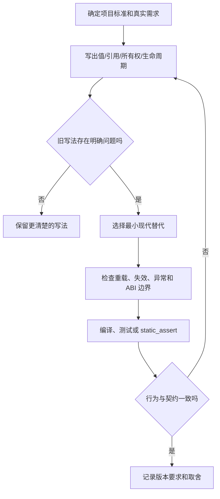

# 现代 C++ 特性学习地图与迁移手册

> 本手册不再重复讲一遍基础语法。它帮助你回答三个工程问题：某个写法从哪个标准开始可用、它改变了什么语义、在本仓库应该去哪里深入学习。

仓库统一使用 C++17 构建。C++11/14/17 标签表示特性的首次标准版本，不表示需要分别维护三套业务代码。

## 1. 这份手册与其他教程怎样分工

| 你现在需要什么 | 首选文档 |
|---|---|
| 第一次学习变量、引用、类、容器和现代语法 | [C++ 基础学习教程](tutorials/CPP基础学习教程.md) |
| 理解类型推导、智能指针、移动、Lambda 的工程边界 | [Effective Modern C++ 教程](tutorials/Effective_Modern_CPP教程.md) |
| 学习线程、同步、内存模型和关闭协议 | [C++ 并发编程教程](tutorials/CPP并发编程教程.md) |
| 把知识放回 Day 1-35 的顺序 | [35 天学习规划](CPP_35天科学学习规划_最终版.md) |
| 从需求、接口、所有权和测试组织项目 | [C++ 项目组织与设计教程](tutorials/C++项目组织与设计教程.md) |
| 快速判断版本、选型、迁移路径和仓库落点 | 本手册 |

遇到一个概念时，按“本手册定位 → 主教程学习机制 → 当日 README 完成练习”的顺序使用，避免在多份文档间重复通读同一段内容。

## 2. C++11、C++14、C++17 各自解决什么问题

| 标准 | 本课程关注的代表能力 | 主要价值 |
|---|---|---|
| C++11 | `auto`、`decltype`、右值引用、移动语义、Lambda、智能指针、`nullptr`、`constexpr`、标准线程库 | 建立现代类型、所有权和并发基础 |
| C++14 | `std::make_unique`、`decltype(auto)`、初始化捕获、泛型 Lambda、`std::exchange`、`_t` 别名 | 补齐易用性和泛型表达能力 |
| C++17 | 结构化绑定、`if constexpr`、`_v` 变量模板、`std::optional`、`std::variant`、`std::string_view`、并行算法等 | 减少模板样板，改善接口和数据表达 |

“新”不等于“总是更好”。选型顺序应是：

1. 先明确值、引用、所有权和生命周期。
2. 再选择最能暴露这些语义的写法。
3. 最后考虑减少样板、兼容标准和性能。
4. 用编译器、`static_assert`、测试或基准验证，不靠语法外观猜测。

## 3. 四条必须先打通的语义主线

### 3.1 类型推导主线

`auto`、模板参数推导、`decltype` 和 `decltype(auto)` 共享部分规则，但不是同一套语法糖。

```text
调用表达式
  → 表达式的类型和值类别
  → 模板参数或 auto 占位符推导
  → 引用折叠、cv 限定调整
  → 最终声明类型
```

分析时分开写：

- 表达式本身的类型和值类别。
- 被推导的模板参数 `T`。
- 把 `T` 代回后得到的最终变量或形参类型。
- 结果是复制值、绑定引用，还是返回可能悬空的引用。

不要用“编译器会自动推成我想要的类型”替代规则。

### 3.2 所有权主线

先画所有者，再选择智能指针：

```text
唯一所有者 ──移动──> 新的唯一所有者       → unique_ptr
多个长期所有者 ──共享控制块──> 最后一个释放 → shared_ptr
只观察、不延长寿命 ──lock 检查──> 临时共享  → weak_ptr
不拥有资源，只在调用期间使用               → 引用或观察指针
```

`std::make_unique` 的核心价值不是少写 `new`，而是把对象构造和所有权建立放进一个清晰表达式。`shared_ptr` 的控制块操作可在线程间协调，不等于所指对象自动线程安全。

### 3.3 值类别与移动主线

`std::move(x)` 不移动任何字节；它把表达式转换成可匹配右值重载的形式。是否真的发生移动，取决于：

- 目标类型是否有可用的移动操作。
- 源表达式的 `const` 限定是否允许匹配该操作。
- 重载决议最终选择了移动还是复制。
- 类型的移动实现是否真的比复制便宜。

移动后的对象仍可析构和重新赋值；除此之外能做什么要看具体类型契约。不要统一写成“必然为空”，也不要在没有契约时读取并依赖旧值。

### 3.4 编译期分派主线

`if constexpr` 适合在同一模板结构内按编译期条件选择实现；重载、约束和标签分派仍然有独立价值。

```text
调用者面对的是不同接口吗？
  ├─ 是：优先重载或独立函数
  └─ 否：同一算法内部是否按类型选择有效语句？
       ├─ 是：C++17 可考虑 if constexpr
       └─ 否：普通 if 或普通函数通常更清楚
```

未选中的 `if constexpr` 分支会被丢弃，但它仍必须满足模板外层可解析等规则；“不实例化”不等于可以写任意无效文本。

## 4. 高频特性的选型卡

本节代码是用于突出类型与接口决策的上下文片段，不重复主教程中的完整程序；所需头文件、示例类型和可运行验证请沿每节“仓库落点”进入对应教程。阅读片段时先判断值、引用和所有权，不要把它们直接拼成一个翻译单元。

### 4.1 `auto`：减少重复类型，不隐藏业务语义

```cpp
const std::vector<int> values{1, 2, 3};

auto count = values.size();          // 值
const auto& view = values;           // 只读别名，不复制容器
for (const auto& value : values) {   // 元素只读引用
    // 使用 value
}
```

检查清单：

- 需要修改原对象吗？用 `auto&`。
- 只读且对象较大吗？考虑 `const auto&`。
- 需要把值独立保存吗？使用按值 `auto`。
- 类型本身是否表达单位、范围或所有权？若是，显式类型可能更清楚。
- 花括号初始化是否触发了与预期不同的推导？不要凭外观猜。

详见基础教程的“类型推导”和 EMC++ Item 1-6。

### 4.2 `decltype` 与 `decltype(auto)`：精确保留表达式类型

```cpp
template <typename Container>
decltype(auto) first(Container& container) {
    return container[0];
}
```

这里使用 `Container&` 是生命周期约束：如果允许临时容器，返回的元素引用可能在完整表达式结束后悬空。

关键区别：

- `decltype(name)` 对未加括号的名字使用声明类型规则。
- `decltype((name))` 按表达式值类别推导，左值通常得到左值引用。
- `decltype(auto)` 适合确实需要保留表达式引用性的返回或变量，不是“更高级的 auto”。
- 返回局部变量引用、临时对象内部引用或已失效容器元素都可能悬空；精确推导不会自动修复生命周期。

仓库落点：[Day 2](week_01/day_02/README.md) 和 [EMC++ Item 3](tutorials/Effective_Modern_CPP教程.md#item-3-理解-decltype)。

### 4.3 `std::make_unique`：建立独占所有权

```cpp
auto node = std::make_unique<Node>(42);
```

优先使用它是因为所有权立即明确，并避免裸 `new` 在复杂表达式中暴露资源。以下情况仍需单独判断：

- 数组与自定义删除器的接口是否匹配。
- 返回给调用者的是所有权，还是仅供观察。
- 是否需要多态删除；通过基类指针删除派生对象时，基类析构契约必须正确。
- 是否真的需要共享所有权；“以后也许会共享”不是先用 `shared_ptr` 的充分理由。

仓库落点：[Day 8](week_02/day_08/README.md) 至 [Day 12](week_02/day_12/README.md)。

### 4.4 结构化绑定：给组成部分起业务名字

```cpp
const auto [iterator, inserted] = table.insert({key, value});
```

先判断绑定方式：

- `auto [a, b] = object`：通常创建一个承载对象并按值绑定，可能发生复制或移动。
- `auto& [a, b] = object`：绑定可修改左值，生命周期由原对象决定。
- `const auto& [a, b] = object`：只读引用，可避免大对象复制，并可按引用延长某些临时对象的生命周期。
- 容器元素重分配、擦除或对象销毁后，引用绑定同样可能失效。

结构化绑定改善名字，不改变底层对象的所有权、失效规则或线程安全。

### 4.5 `if constexpr`、`_v` 和 `_t`：减少模板样板

```cpp
template <typename T>
void print(const T& value) {
    if constexpr (std::is_pointer_v<T>) {
        if (value != nullptr) {
            std::cout << *value;
        }
    } else {
        std::cout << value;
    }
}
```

`std::is_pointer_v<T>` 是 `std::is_pointer<T>::value` 的 C++17 简写；`std::remove_reference_t<T>` 是 `typename std::remove_reference<T>::type` 的 C++14 简写。简写不改变 trait 的含义。

如果两个分支代表不同接口、需要独立文档或不同错误信息，重载往往比在一个巨大 `if constexpr` 中堆分支更清楚。

### 4.6 `std::exchange`：取旧值并写入新值

```cpp
Resource(Resource&& other) noexcept
    : handle_(std::exchange(other.handle_, invalid_handle)) {}
```

`exchange` 做两件事：保存旧值，再把对象赋成新值。它常用于句柄转移，但不是移动构造模板：

- 新状态必须满足源对象的不变量。
- 被交换成员的赋值可能抛异常，`noexcept` 要按真实表达式判断。
- 一个类有多个相互约束的成员时，逐个 `exchange` 可能在异常中留下破坏的不变量。
- Rule of Zero 通常优于手写资源管理；只有直接拥有底层资源时才需要实现完整特殊成员语义。

仓库落点：[Day 23](week_04/day_23/README.md) 至 [Day 25](week_04/day_25/README.md)。

## 5. 按仓库真实路径学习

| 阶段 | 先读 | 再做 | 要回答的问题 |
|---|---|---|---|
| 类型推导 | [基础教程](tutorials/CPP基础学习教程.md#2-类型推导auto-与-decltype) | [Day 1](week_01/day_01/README.md)、[Day 2](week_01/day_02/README.md) | 发生复制还是引用绑定？ |
| 初始化与空值 | [基础教程](tutorials/CPP基础学习教程.md#6-统一初始化与-initializer_list) | [Day 3](week_01/day_03/README.md)、[Day 4](week_01/day_04/README.md) | 选中了哪个构造或重载？ |
| 所有权 | [基础教程](tutorials/CPP基础学习教程.md#3-智能指针现代内存管理) | [Week 2](week_02/README.md) | 谁负责销毁？观察者如何知道失效？ |
| Lambda | [EMC++ Item 31-34](tutorials/Effective_Modern_CPP教程.md#6-lambda-表达式) | [Week 3](week_03/README.md) | 闭包保存了值、引用还是 `this`？ |
| 移动与转发 | [EMC++ Item 23-30](tutorials/Effective_Modern_CPP教程.md#5-右值引用与移动语义) | [Week 4](week_04/README.md) | 是否有类型推导？最终选中哪个重载？ |
| 并发 | [并发教程](tutorials/CPP并发编程教程.md) | [Week 5](week_05/README.md) | 共享状态、同步边和关闭协议是什么？ |

学习真实文件时不要把“换成新语法”当目标。每处修改前写出：

1. 原代码表达的类型、所有权和生命周期。
2. 新写法是否保持相同行为。
3. 错误信息、可读性或异常安全具体改善了什么。
4. 哪些调用者可能受到影响。
5. 用什么构建或测试证明没有改变可观察行为。

## 6. 迁移旧写法的固定流程


```mermaid
flowchart TD
    A[确定项目标准和真实需求] --> B[写出值/引用/所有权/生命周期]
    B --> C{旧写法存在明确问题吗}
    C -- 否 --> D[保留更清楚的写法]
    C -- 是 --> E[选择最小现代替代]
    E --> F[检查重载、失效、异常和 ABI 边界]
    F --> G[编译、测试或 static_assert]
    G --> H{行为与契约一致吗}
    H -- 否 --> B
    H -- 是 --> I[记录版本要求和取舍]
```

不要机械执行“全部改成 `auto`”“全部改成 `emplace`”或“全部改成智能指针”。现代 C++ 的目标是让契约更清楚，而不是让关键词更新。

## 7. 常见诊断如何定位

| 诊断关键词 | 先检查 | C++17 主线的处理 |
|---|---|---|
| `make_unique` 不存在 | 编译标准、`<memory>` | 启用 C++14+；本仓库应为 C++17 |
| `is_same_v` 不存在 | 编译标准、`<type_traits>` | C++17 使用 `_v`；低版本写 `::value` |
| `remove_reference_t` 不存在 | 编译标准、`<type_traits>` | C++14+ 使用 `_t` |
| structured bindings require C++17 | 编译标准 | 本仓库检查 CMake 的 C++17 要求 |
| 返回引用后出现 ASan 报错 | 被引用对象寿命、容器失效 | 不要只改返回类型，先修生命周期契约 |
| “use of deleted function” | 特殊成员生成、成员可复制/移动性 | 画出资源所有权并检查 Rule of Zero/Five |
| `std::function` 拒绝闭包 | C++17 目标必须可复制 | move-only 任务使用合适的 move-only 边界 |
| `const T` 无法移动 | 移动构造通常需要修改源对象 | 检查是否只能复制，不要强制 cast away const |

诊断是证据，不是结论。模板错误通常要从“第一个与自己代码相关的位置”开始读，再沿实例化链定位。

## 8. 分层练习

### 基础层：预测类型

为下列表达式先写出类型和值类别，再用 `static_assert` 或编译器验证：

- `auto`、`auto&`、`const auto&` 接收同一个 `const int`。
- `decltype(x)` 与 `decltype((x))`。
- 模板 `T&`、`const T&`、`T&&` 接收左值和右值。
- 结构化绑定按值、按引用、按 const 引用。

### 所有权层：画对象图

对 `unique_ptr` 移动、`shared_ptr` 复制、`weak_ptr::lock` 和 Pimpl 分别画：

- 对象在哪里。
- 谁是所有者。
- 控制块或删除器在哪里。
- 哪一步销毁对象。
- 哪些观察句柄会失效。

### 迁移层：只改变一种语义

从仓库选择一处真实代码，每次只做一种对照：

1. 显式迭代器类型与 `auto`。
2. `.first/.second` 与结构化绑定。
3. 重载与 `if constexpr`。
4. 手动句柄转移与 `std::exchange`。
5. `unique_ptr(new T)` 与 `make_unique`。

每次记录“原判断—编译/测试证据—修正规则”，不要只记录最终代码。

## 9. 阶段验收

学完本手册后，应能准确回答：

1. C++17 构建基线与特性首次标准版本有什么区别？
2. `auto` 为什么可能复制，而 `auto&` 可能悬空？
3. `decltype((x))` 为什么常得到引用？
4. `std::move` 为什么可能调用复制？
5. 移动后对象有哪些标准级最低保证，哪些要查具体类型？
6. `shared_ptr` 的线程安全边界在哪里？
7. 结构化绑定按值和按引用分别影响什么？
8. `if constexpr`、重载和 SFINAE 各自适合什么接口形态？
9. `std::exchange` 为什么不能替代类不变量设计？
10. 怎样证明一次“现代化改写”没有改变可观察行为？

如果只能背出关键词，但不能说明生命周期、前提和验证方式，应回到对应主教程，而不是继续收集更多速查表。

## 10. 参考资料与阅读对应

| 本手册主题 | 标准草案定位 | 教材式深化 |
|---|---|---|
| `auto` 占位类型推导 | [`[dcl.spec.auto]`](https://eel.is/c++draft/dcl.spec.auto) | *C++ Primer* 的类型与声明；EMC++ Item 1-6 |
| `decltype` | [`[dcl.type.decltype]`](https://eel.is/c++draft/dcl.type.decltype) | EMC++ Item 3 |
| 结构化绑定 | [`[dcl.struct.bind]`](https://eel.is/c++draft/dcl.struct.bind) | *A Tour of C++* 的 C++17 语言概览 |
| `if constexpr` | [`[stmt.if]`](https://eel.is/c++draft/stmt.if) | 泛型编程章节与 EMC++ 的类型推导主线 |
| `unique_ptr` | [`[unique.ptr]`](https://eel.is/c++draft/unique.ptr) | *C++ Primer* 智能指针；EMC++ Item 18、21 |
| `std::exchange` | [`[utility.exchange]`](https://eel.is/c++draft/utility.exchange) | 结合 Rule of Zero/Five 与类不变量学习 |
| 数据竞争与 happens-before | [`[intro.races]`](https://eel.is/c++draft/intro.races) | *C++ Concurrency in Action* |

条款链接用于定位规范定义，正文中的直觉模型和练习来自对教材组织方式的消化，不是规范原文的翻译。

- C++ working draft：<https://eel.is/c++draft/>
- cppreference language：<https://en.cppreference.com/w/cpp/language>
- cppreference utilities：<https://en.cppreference.com/w/cpp/utility>
- ISO C++ Core Guidelines：<https://isocpp.github.io/CppCoreGuidelines/>
- Bjarne Stroustrup, *A Tour of C++*：建立现代 C++ 全局地图。
- Stanley B. Lippman 等，*C++ Primer*：补语言规则、类和标准库基础。
- Scott Meyers, *Effective Modern C++*：深化类型推导、所有权、移动、Lambda 和并发 API。
- Anthony Williams, *C++ Concurrency in Action*：深化 C++ 内存模型与同步设计。

阅读参考资料时区分三类陈述：标准必须保证、某个标准库实现的行为、作者基于经验给出的设计建议。三者都可能有价值，但不能互相替代。
