# Day 2: 数组数据结构与decltype详解

## 📚 今日学习内容

| 模块 | 内容 | 难度 |
|------|------|------|
| 数据结构 | 数组数据结构详解 | ⭐⭐ |
| C++11特性 | decltype关键字 | ⭐⭐⭐ |
| EMC++条款 | 条款6：auto推导陷阱 | ⭐⭐⭐ |
| LeetCode | 26题、27题 | ⭐⭐ |

---

## 1. 数组数据结构

### 1.1 数组基本概念

数组是一种**线性数据结构**，使用**连续的内存空间**存储相同类型的元素。

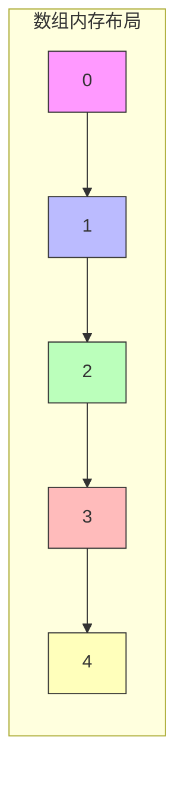

### 1.2 数组的特点

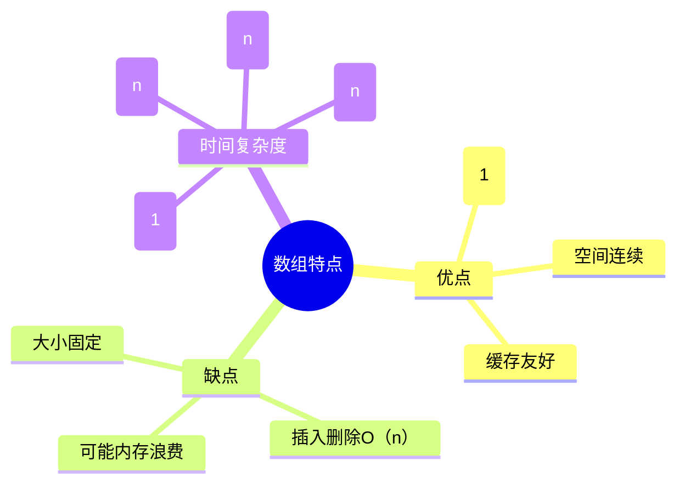

### 1.3 数组操作示意图

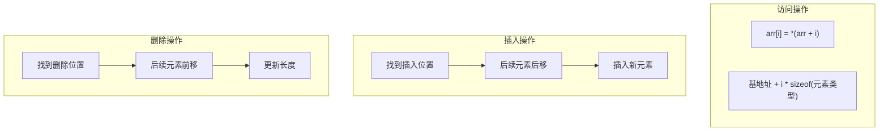

### 1.4 C++数组类型对比

| 特性 | C风格数组 | std::array | std::vector |
|------|----------|------------|-------------|
| 大小 | 固定 | 固定 | 动态 |
| 边界检查 | 无 | at()有 | at()有 |
| 传递方式 | 退化为指针 | 值传递 | 值传递 |
| 推荐程度 | ❌ | ✅ | ✅✅ |

---

## 2. decltype关键字详解

### 2.1 基本语法

```cpp
decltype(expression) variable;
```

### 2.2 decltype推导规则

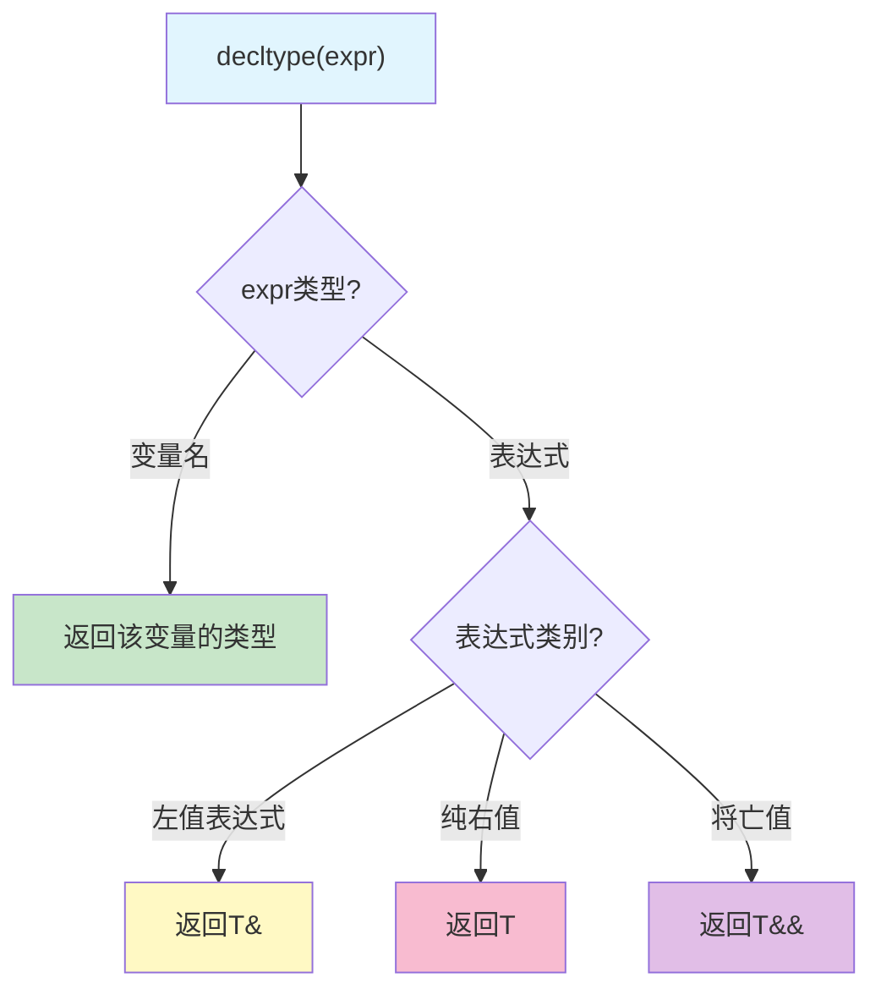

### 2.3 decltype vs auto 对比

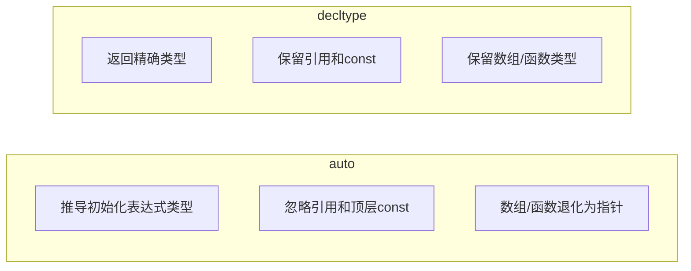

### 2.4 典型应用场景

```cpp
// 1. 返回类型尾置语法
template<typename T, typename U>
auto add(T t, U u) -> decltype(t + u) {
    return t + u;
}

// 2. 保留表达式的精确类型
int x = 10;
decltype((x)) y = x;  // y是int&，因为(x)是左值表达式

// 3. 用于类型别名
template<typename Container>
using ValueType = decltype(std::declval<Container>()[0]);
```

---

## 3. EMC++ 条款6：auto推导陷阱

### 3.1 主要陷阱总结

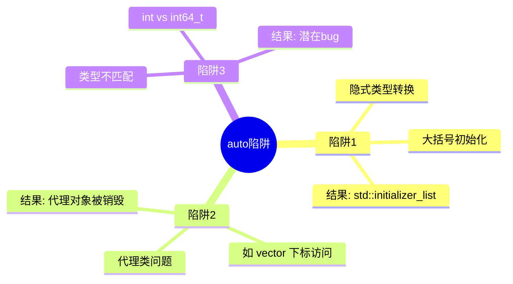

### 3.2 典型陷阱示例

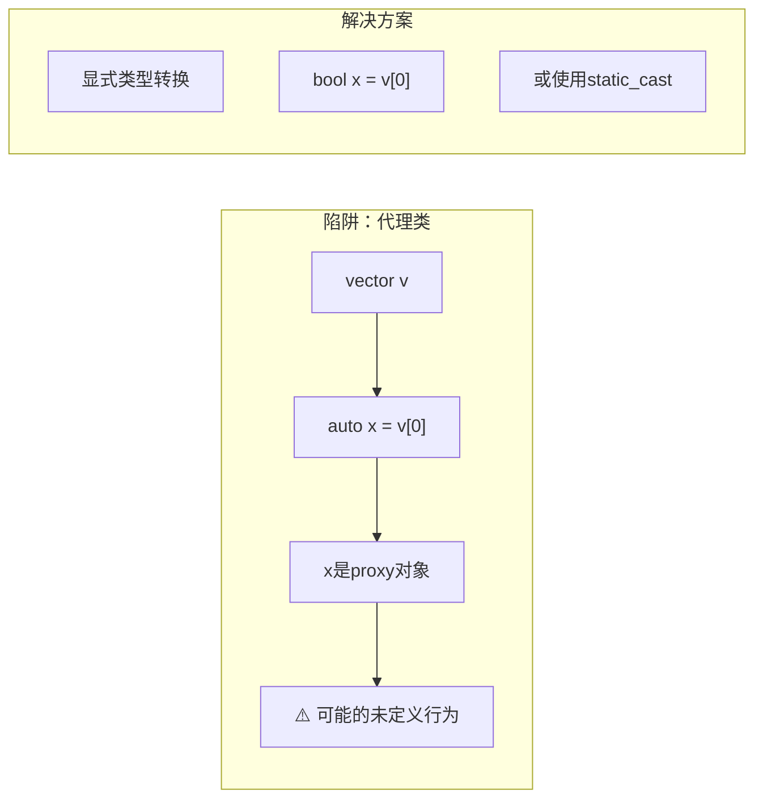

### 3.3 最佳实践

| 场景 | 推荐 | 避免 |
|------|------|------|
| 简单类型推导 | `auto x = 10;` | - |
| 容器迭代器 | `auto it = v.begin();` | - |
| 大括号初始化 | `auto x = 42;` | `auto x{42};` |
| vector\<bool\> | `bool x = v[0];` | `auto x = v[0];` |

---

## 4. LeetCode题目详解

### 4.1 第26题：删除有序数组中的重复项

#### 题目描述
给定一个**升序排列**的数组 `nums`，请**原地**删除重复元素，使每个元素只出现一次，返回删除后数组的新长度。

#### 算法思路：快慢指针

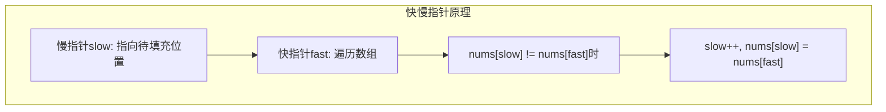

#### 执行过程示意

```mermaid
gantt
    title 快慢指针执行过程
    dateFormat X
    axisFormat %s
    
    section 初始状态
    数组: [0,0,1,1,1,2,2,3,3,4] :0, 10
    
    section 第一步
    fast=1, nums[0]==nums[1] :1, 2
    
    section 第二步
    fast=2, nums[0]!=nums[2], slow++ :2, 3
    
    section 结果
    前slow+1个元素唯一 :5, 6
```

#### 复杂度分析
- **时间复杂度**: O(n) - 只需遍历一次
- **空间复杂度**: O(1) - 原地修改

---

### 4.2 第27题：移除元素

#### 题目描述
给定数组 `nums` 和值 `val`，**原地**移除所有数值等于 `val` 的元素，返回新长度。

#### 算法思路：双指针

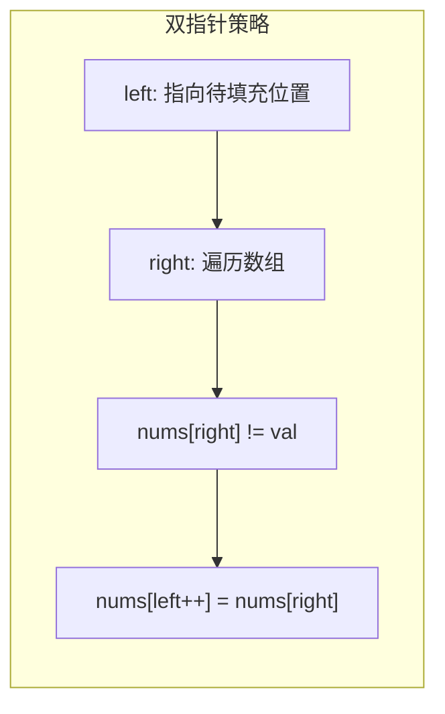

#### 执行过程图解

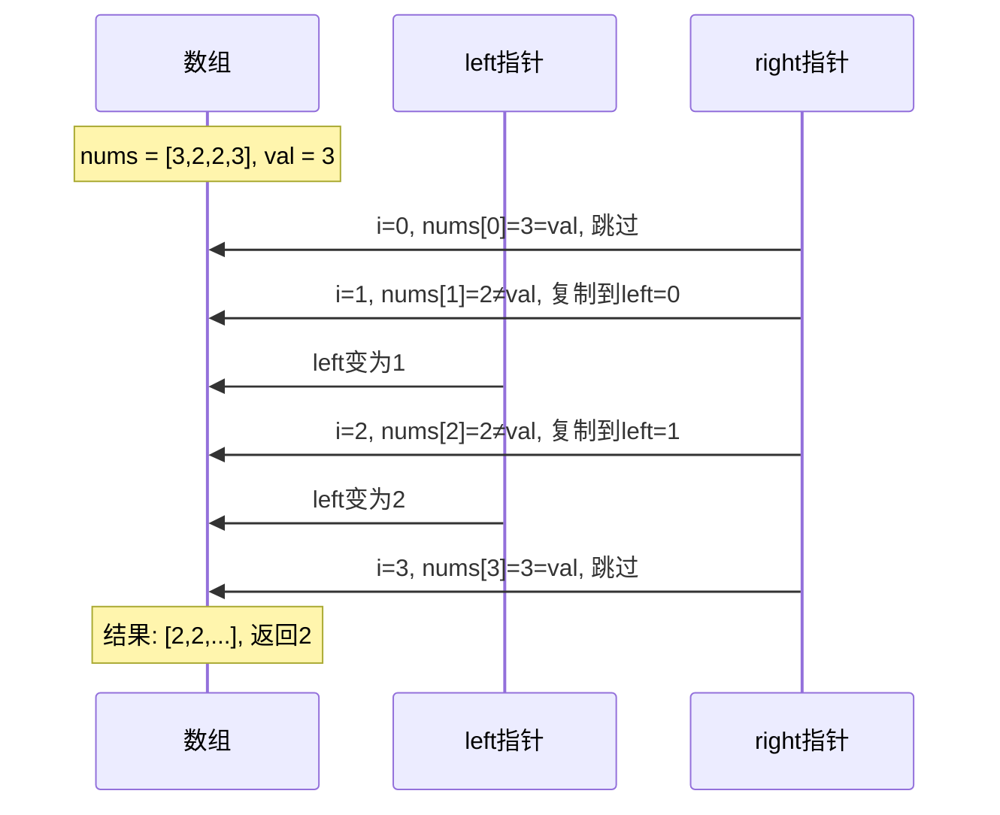

#### 复杂度分析
- **时间复杂度**: O(n)
- **空间复杂度**: O(1)

---

## 5. 编译运行指南

### 5.1 目录结构

```
day_02/
├── README.md
├── CMakeLists.txt
├── build_and_run.sh
└── code/
    ├── main.cpp
    ├── data_structure/
    │   └── array_structure.cpp
    ├── cpp11_features/
    │   └── decltype_demo.cpp
    ├── emcpp/
    │   └── item06_auto_traps.cpp
    └── leetcode/
        ├── 0026_remove_duplicates/
        │   └── solution.cpp
        └── 0027_remove_element/
            └── solution.cpp
```

### 5.2 编译运行

```bash
# 添加执行权限
chmod +x build_and_run.sh

# 编译并运行
./build_and_run.sh
```

### 5.3 预期输出

```
========================================
Day 2: 数组与decltype学习演示
========================================

[1] 数组数据结构演示
====================
数组遍历: 1 2 3 4 5 
数组随机访问: nums[2] = 3
二维数组访问: matrix[1][1] = 5
std::array大小: 5
std::array元素: 10 20 30 40 50 

[2] decltype演示
================
decltype(x) = int
decltype((x)) = int&
decltype(ptr) = int*
decltype(arr) = int[5]
decltype返回类型推导成功: add(1, 2.5) = 3.5

[3] EMC++ 条款6：auto推导陷阱
=============================
陷阱1 - 大括号初始化: type = St16initializer_listIiE
陷阱2 - vector<bool>代理类问题:
  直接使用auto可能产生悬垂引用
  正确做法: bool val = vec[0];
陷阱3 - 数组退化为指针:
  auto数组推导: type = Pi (指针)
  decltype数组推导: type = A5_i (数组)

[4] LeetCode 26题：删除有序数组中的重复项
=========================================
测试用例: {1,1,2}
去重后长度: 2
结果数组: 1 2 
测试用例: {0,0,1,1,1,2,2,3,3,4}
去重后长度: 5
结果数组: 0 1 2 3 4 

[5] LeetCode 27题：移除元素
===========================
测试用例: {3,2,2,3}, val=3
移除后长度: 2
结果数组: 2 2 
测试用例: {0,1,2,2,3,0,4,2}, val=2
移除后长度: 5
结果数组: 0 1 3 0 4 

========================================
Day 2 学习完成！
========================================
```

---

## 6. 学习要点总结

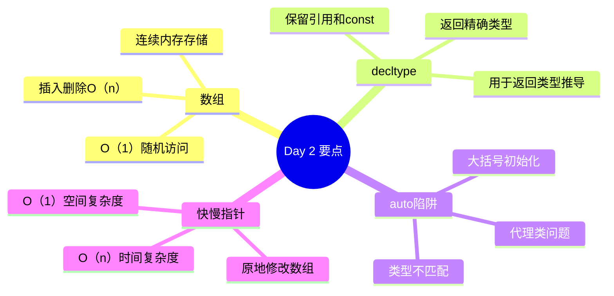

---

## 7. 练习建议

1. **数组操作**: 手动实现数组的插入、删除、查找操作
2. **decltype**: 尝试推导各种复杂表达式的类型
3. **auto陷阱**: 收集并分析实际项目中的auto使用问题
4. **LeetCode**: 完成相关数组题目（26、27、80、283等）

---

> 💡 **提示**: 数组是最基础的数据结构，理解其内存布局对后续学习指针、链表等至关重要。
