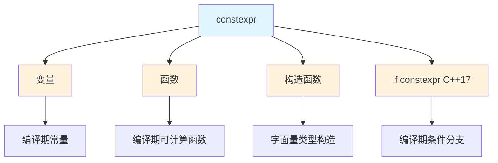
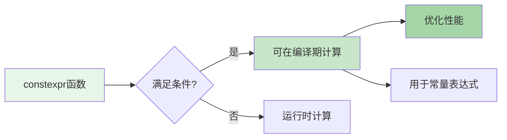
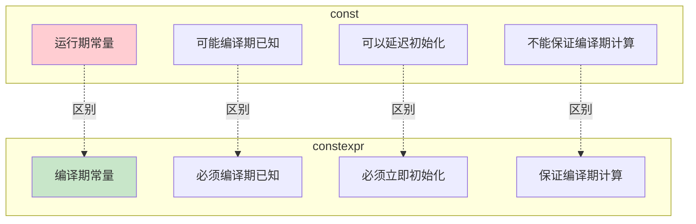
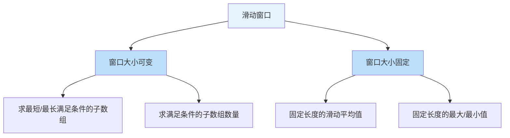
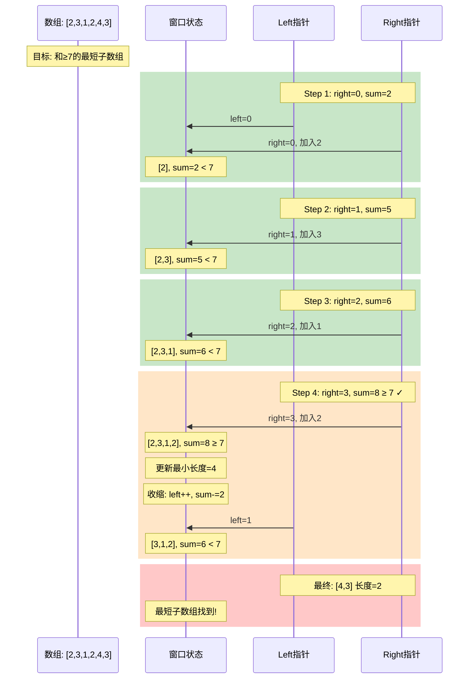
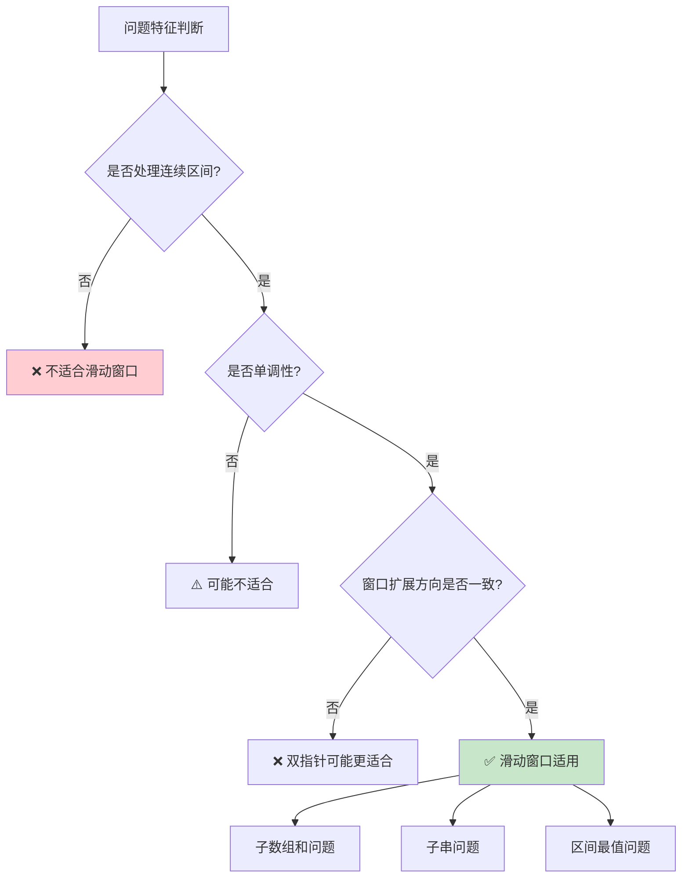
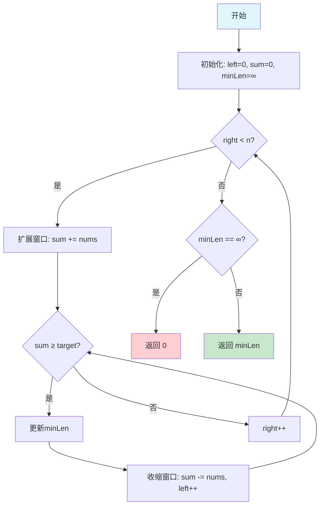
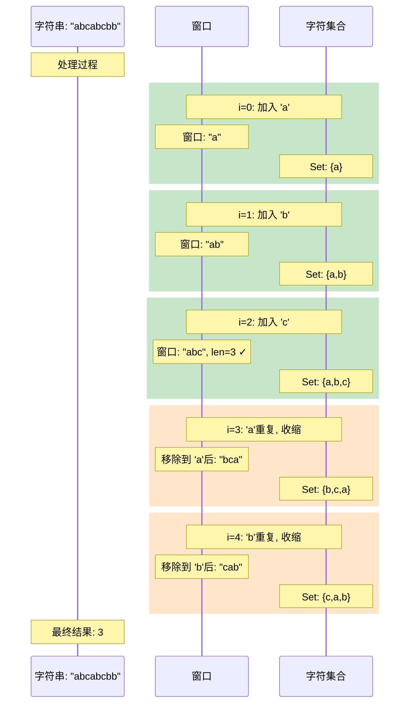

# Day 5: constexpr详解与滑动窗口算法

## 📚 学习目标

1. **深入理解constexpr**：掌握编译期计算的核心技术
2. **区分const与constexpr**：理解两者的本质区别
3. **掌握滑动窗口算法**：学会使用滑动窗口解决子数组/子串问题
4. **LeetCode实战**：209题和3题的滑动窗口解法

---

## 🎯 Part 1: constexpr详解

### 1.1 constexpr概述

`constexpr`是C++11引入的关键字，用于指定**编译期常量**。它告诉编译器："这个值或函数的结果可以在编译时计算出来"。



### 1.2 constexpr变量

```cpp
// constexpr变量必须在编译期确定值
constexpr int max_size = 100;           // 编译期常量
constexpr double pi = 3.14159265359;    // 编译期常量
constexpr int arr_size = max_size * 2;  // 编译期计算

// 用作数组大小（必须是编译期常量）
int data[max_size];                     // ✅ 合法
int data2[arr_size];                    // ✅ 合法

// constexpr变量的特点
// 1. 必须立即初始化
// 2. 初始化必须由常量表达式完成
// 3. 一旦初始化就不能修改
// 4. 可以用于需要编译期常量的场景
```

### 1.3 constexpr函数

**constexpr函数的规则（C++11）：**



**C++11 constexpr函数限制：**
- 函数体必须是单一的return语句
- 必须有返回值（不能是void）
- 参数和返回类型必须是字面量类型
- 函数调用前必须已定义

```cpp
// C++11风格：必须单一return
constexpr int square(int x) {
    return x * x;
}

constexpr int factorial(int n) {
    return n <= 1 ? 1 : n * factorial(n - 1);
}

// C++14放宽限制：可以有多条语句
constexpr int sum(int n) {
    int result = 0;
    for (int i = 1; i <= n; ++i) {
        result += i;
    }
    return result;
}

// 使用示例
constexpr int sq = square(5);          // 编译期计算：25
constexpr int fact = factorial(5);     // 编译期计算：120
constexpr int s = sum(10);             // C++14：编译期计算：55
int arr[factorial(3)];                 // 编译期计算数组大小：6

// 运行时调用
int n;
std::cin >> n;
int runtime_result = factorial(n);     // 运行时计算
```

### 1.4 constexpr构造函数

```cpp
class Point {
private:
    int x_, y_;
    
public:
    // constexpr构造函数
    constexpr Point(int x, int y) : x_(x), y_(y) {}
    
    constexpr int x() const { return x_; }
    constexpr int y() const { return y_; }
    
    constexpr int distance_squared() const {
        return x_ * x_ + y_ * y_;
    }
};

// 编译期创建对象
constexpr Point p1(3, 4);
constexpr int dist = p1.distance_squared();  // 编译期计算：25

// 用作模板参数（C++20前需要）
template <int X, int Y>
struct PointTemplate {
    static constexpr Point value{X, Y};
};
```

### 1.5 if constexpr（C++17）

```cpp
// if constexpr：编译期条件判断
template <typename T>
auto get_value(T t) {
    if constexpr (std::is_pointer_v<T>) {
        return *t;  // 解引用
    } else {
        return t;   // 直接返回
    }
}

// 编译期类型判断
template <typename T>
void process(T value) {
    if constexpr (std::is_integral_v<T>) {
        std::cout << "Integer: " << value << "\n";
    } else if constexpr (std::is_floating_point_v<T>) {
        std::cout << "Float: " << value << "\n";
    } else if constexpr (std::is_same_v<T, std::string>) {
        std::cout << "String: " << value << "\n";
    } else {
        std::cout << "Unknown type\n";
    }
}

// 递归展开
template <int N>
constexpr int fibonacci() {
    if constexpr (N <= 1) {
        return N;
    } else {
        return fibonacci<N-1>() + fibonacci<N-2>();
    }
}
```

### 1.6 const vs constexpr



```cpp
// 对比示例

// ============== const ==============
const int runtime_const = get_runtime_value();  // ✅ 运行时初始化
const int const_arr_size = 100;                  // ✅ 编译期已知，但不能用作数组大小（某些编译器）
const int* ptr1 = &some_var;                     // ✅ 指针本身是const

// ============== constexpr ==============
constexpr int compile_const = 100;              // ✅ 编译期常量
// constexpr int runtime_init = get_runtime_value();  // ❌ 编译错误！
constexpr int* ptr2 = nullptr;                  // ✅ constexpr指针

// ============== 关键区别 ==============
// 1. 数组大小
int arr1[const_arr_size];     // ⚠️ 非标准，某些编译器允许
int arr2[compile_const];      // ✅ 标准保证

// 2. 模板参数
template <int N>
struct Array {};
Array<const_arr_size> a1;     // ⚠️ 可能失败
Array<compile_const> a2;      // ✅ 保证成功

// 3. 函数参数
void func(const int n);       // ✅ 运行时参数
// void func2(constexpr int n); // ❌ 不允许！constexpr不能用于参数
```

### 1.7 constexpr函数限制总结

| 限制项 | C++11 | C++14 | C++17 | C++20 |
|--------|-------|-------|-------|-------|
| 单一return | ✓ | ✗ | ✗ | ✗ |
| 局部变量 | ✗ | ✓ | ✓ | ✓ |
| 循环语句 | ✗ | ✓ | ✓ | ✓ |
| 条件语句 | ✗ | ✓ | ✓ | ✓ |
| 动态内存 | ✗ | ✗ | ✗ | ✓ |
| 虚函数 | ✗ | ✗ | ✗ | ✓ |
| try-catch | ✗ | ✗ | ✗ | ✓ |

---

## 🔧 Part 2: 滑动窗口算法

### 2.1 算法概述

滑动窗口是一种处理**连续区间问题**的高效技术，可以将O(n²)暴力解法优化到O(n)。



### 2.2 通用模板

```cpp
// ========== 可变窗口大小模板 ==========
int slidingWindowTemplate(vector<int>& nums, int target) {
    int left = 0;                    // 窗口左边界
    int result = /* 初始值 */;
    int current = 0;                 // 当前窗口状态
    
    for (int right = 0; right < nums.size(); ++right) {
        // Step 1: 扩展窗口（加入右边界元素）
        current += nums[right];
        
        // Step 2: 收缩窗口（当条件满足时移动左边界）
        while (/* 需要收缩的条件 */) {
            // 移除左边界元素
            current -= nums[left];
            ++left;
        }
        
        // Step 3: 更新结果（在合法窗口时）
        if (/* 合法窗口条件 */) {
            result = /* 更新结果 */;
        }
    }
    
    return result;
}

// ========== 固定窗口大小模板 ==========
int fixedSizeWindow(vector<int>& nums, int k) {
    int current = 0;
    
    // 初始化窗口
    for (int i = 0; i < k; ++i) {
        current += nums[i];
    }
    
    int result = current;
    
    // 滑动窗口
    for (int i = k; i < nums.size(); ++i) {
        current += nums[i] - nums[i - k];  // 加入新元素，移除旧元素
        result = max(result, current);
    }
    
    return result;
}
```

### 2.3 滑动窗口动画演示



### 2.4 适用场景判断



**典型适用场景：**
1. ✅ **连续子数组和**：求和满足条件的子数组
2. ✅ **无重复子串**：最长无重复字符子串
3. ✅ **区间覆盖**：最小覆盖子串
4. ✅ **滑动平均/最值**：固定窗口统计

**不适用场景：**
1. ❌ 非连续子序列
2. ❌ 窗口扩展方向不固定
3. ❌ 需要回退的情况

---

## 📝 Part 3: LeetCode实战

### 3.1 LeetCode 209: 长度最小的子数组

**题目描述：**
给定一个含有 n 个正整数的数组和一个正整数 target。找出该数组中满足其和 ≥ target 的长度最小的连续子数组，并返回其长度。

**示例：**
```
输入: target = 7, nums = [2,3,1,2,4,3]
输出: 2
解释: 子数组 [4,3] 是该条件下的长度最小的子数组
```

**解题思路：**



**代码实现：**

```cpp
class Solution {
public:
    int minSubArrayLen(int target, vector<int>& nums) {
        int left = 0;
        int sum = 0;
        int minLen = INT_MAX;
        
        for (int right = 0; right < nums.size(); ++right) {
            sum += nums[right];  // 扩展窗口
            
            while (sum >= target) {  // 收缩条件
                minLen = min(minLen, right - left + 1);
                sum -= nums[left++];
            }
        }
        
        return minLen == INT_MAX ? 0 : minLen;
    }
};
```

**复杂度分析：**
- 时间复杂度：O(n)，每个元素最多被访问两次（加入和移除）
- 空间复杂度：O(1)，只使用常数额外空间

### 3.2 LeetCode 3: 无重复字符的最长子串

**题目描述：**
给定一个字符串 s，找出其中不含有重复字符的最长子串的长度。

**示例：**
```
输入: s = "abcabcbb"
输出: 3
解释: 因为无重复字符的最长子串是 "abc"，所以其长度为 3
```

**解题思路：**



**代码实现：**

```cpp
class Solution {
public:
    int lengthOfLongestSubstring(string s) {
        unordered_set<char> window;  // 窗口内的字符集合
        int left = 0;
        int maxLen = 0;
        
        for (int right = 0; right < s.size(); ++right) {
            // 收缩窗口直到无重复
            while (window.count(s[right])) {
                window.erase(s[left++]);
            }
            
            // 扩展窗口
            window.insert(s[right]);
            maxLen = max(maxLen, right - left + 1);
        }
        
        return maxLen;
    }
};

// 优化版本：使用数组代替哈希表
class SolutionOptimized {
public:
    int lengthOfLongestSubstring(string s) {
        int charIndex[128] = {0};  // 记录字符最后出现的位置
        int left = 0;
        int maxLen = 0;
        
        for (int right = 0; right < s.size(); ++right) {
            // 如果字符出现过且在窗口内，更新左边界
            if (charIndex[s[right]] > left) {
                left = charIndex[s[right]];
            }
            
            charIndex[s[right]] = right + 1;  // 记录位置+1（避免0的歧义）
            maxLen = max(maxLen, right - left + 1);
        }
        
        return maxLen;
    }
};
```

**复杂度分析：**
| 方法 | 时间复杂度 | 空间复杂度 |
|------|-----------|-----------|
| 哈希表法 | O(n) | O(min(m,n))，m为字符集大小 |
| 数组法 | O(n) | O(m)，m=128 |

---

## 📊 Part 4: 知识总结

### 4.1 constexpr要点总结

| 特性 | 说明 |
|------|------|
| **变量** | 必须编译期可计算，立即初始化 |
| **函数** | 可编译期求值，也可运行时调用 |
| **构造函数** | 使类成为字面量类型 |
| **if constexpr** | 编译期条件分支（C++17） |

### 4.2 滑动窗口要点总结

| 要点 | 说明 |
|------|------|
| **双指针** | left和right定义窗口边界 |
| **单调性** | right单调递增，left单调不减 |
| **时间复杂度** | O(n)，每个元素最多处理两次 |
| **适用场景** | 连续区间、子数组、子串问题 |

### 4.3 练习建议

1. **constexpr练习**：
   - 实现编译期斐波那契数列
   - 实现编译期字符串哈希
   - 用constexpr实现类型安全的数组

2. **滑动窗口练习**：
   - LeetCode 76: 最小覆盖子串
   - LeetCode 438: 找到字符串中所有字母异位词
   - LeetCode 567: 字符串的排列

---

## 🚀 运行代码

```bash
# 进入目录
cd /home/z/my-project/download/week_01/day_05

# 运行构建脚本
chmod +x build_and_run.sh
./build_and_run.sh
```

---

## 📚 扩展阅读

1. [cppreference: constexpr](https://en.cppreference.com/w/cpp/language/constexpr)
2. [C++11 FAQ: constexpr](https://www.stroustrup.com/C++11FAQ.html#constexpr)
3. [滑动窗口算法详解](https://leetcode.cn/problems/minimum-window-substring/solution/hua-dong-chuang-kou-suan-fa-tong-yong-si-xiang-by-/)
