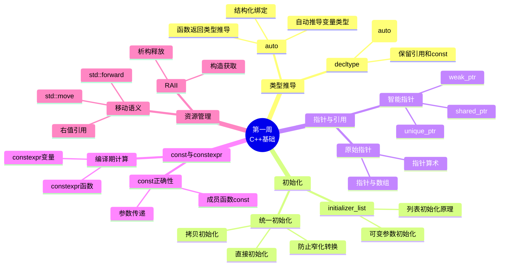

# Day 7: 第一周复习与综合练习

> 📅 **学习目标**: 巩固第一周所学知识，完成综合项目，掌握经典LeetCode题目

---

## 📖 第一周学习目标回顾

恭喜你完成了C++学习计划的第一周！让我们回顾一下本周的学习成果：

### 本周核心内容

| 天数 | 主题 | 核心知识点 |
|------|------|-----------|
| Day 1 | 开发环境搭建 | CMake、编译器选项、现代C++开发流程 |
| Day 2 | 类型推导 | `auto`、`decltype`、返回类型推导 |
| Day 3 | 初始化方式 | 统一初始化、初始化列表、`std::initializer_list` |
| Day 4 | 指针与引用 | 智能指针、原始指针最佳实践、引用折叠 |
| Day 5 | const与constexpr | 编译期计算、常量表达式、`const`正确性 |
| Day 6 | 资源管理 | RAII、移动语义、`std::move`、`std::forward` |

### 能力自检清单

- [ ] 能够正确使用`auto`进行类型推导
- [ ] 理解`auto`与`decltype`的区别
- [ ] 掌握统一初始化语法`{}`的使用
- [ ] 理解`std::initializer_list`的工作原理
- [ ] 能够正确使用智能指针管理资源
- [ ] 理解RAII原则
- [ ] 掌握移动语义的基本概念
- [ ] 能够编写`const`正确的代码

---

## 🧠 知识图谱



---

## 📚 EMC++ 条款 1-8 要点总结

### 条款1: 理解模板类型推导

```cpp
template<typename T>
void f(ParamType param);

f(expr);  // 从expr推导T和ParamType
```

**三种情况：**
1. **ParamType是指针或引用**：忽略expr的引用，模式匹配
2. **ParamType是通用引用**：保留expr的左值/右值性
3. **ParamType既非指针也非引用**：按值传递，忽略const/volatile

### 条款2: 理解auto类型推导

```cpp
auto x = 27;          // int
auto& rx = x;         // int&
auto&& uref = x;      // int& (左值 -> 引用)
auto&& uref2 = 27;    // int&& (右值 -> 右值引用)
```

**特殊规则**：`auto`使用`{}`推导为`std::initializer_list`

### 条款3: 理解decltype

```cpp
decltype(auto) f() {
    int x = 0;
    return (x);  // 返回int&，悬垂引用警告！
}
```

### 条款4: 学会查看推导类型

- **编译时诊断**：`static_assert`, `typeid`
- **IDE提示**：鼠标悬停
- **编译器错误信息**：故意触发错误

### 条款5: 优先使用auto而非显式类型声明

```cpp
// ✅ 推荐
auto iter = m.find(key);

// ❌ 可能的性能问题
std::unordered_map<std::string, int> m;
for (const std::pair<std::string, int>& p : m) {
    // 错误！实际类型是pair<const string, int>
    // 会产生临时对象拷贝
}
```

### 条款6: auto推导异常情况

```cpp
std::vector<bool> v{true, false, true};
auto x = v[0];  // x不是bool，是std::vector<bool>::reference
```

**注意代理类型**：需要显式类型声明或使用`static_cast`

### 条款7: 区分()和{}创建对象

```cpp
int x(0);      // 函数式初始化
int y{0};      // 统一初始化
int z = 0;     // 拷贝初始化

// {}的优点：防止窄化转换
double d = 3.14;
int i{d};      // 编译错误！窄化转换
int j(d);      // 警告但编译通过
```

### 条款8: 优先使用nullptr而非0或NULL

```cpp
void f(int);
void f(int*);

f(0);       // 调用f(int)
f(NULL);    // 可能有歧义
f(nullptr); // 清晰调用f(int*)
```

---

## 💪 综合练习题

### 选择题

**1. 以下代码中，`x`的类型是什么？**
```cpp
const int& foo();
auto x = foo();
```
- A. `int`
- B. `const int`
- C. `const int&`
- D. `int&`

<details>
<summary>点击查看答案</summary>
答案：B

解析：当使用`auto`进行类型推导时，引用会被忽略，顶层const也会被忽略。
`foo()`返回`const int&`，但`auto`推导时会忽略引用和const，得到`int`。
但因为初始化表达式是`const int&`，所以`x`的类型是`int`。

正确答案是A。因为`auto x = foo()`中，`auto`推导为`int`（忽略引用和顶层const）。
</details>

**2. 以下哪个初始化会导致编译错误？**
```cpp
double d = 3.14;
int a = d;    // (1)
int b(d);     // (2)
int c{d};     // (3)
```
- A. 只有(1)
- B. 只有(3)
- C. (1)和(3)
- D. 都不会

<details>
<summary>点击查看答案</summary>
答案：B

解析：统一初始化`{}`会检查窄化转换，double到int是窄化转换，因此(3)会编译错误。
(1)和(2)会有警告但可以编译通过。
</details>

**3. 关于`decltype(auto)`，以下说法正确的是？**
```cpp
decltype(auto) f() {
    int x = 42;
    return (x);
}
```
- A. 返回类型是`int`
- B. 返回类型是`int&`
- C. 返回类型是`int&&`
- D. 编译错误

<details>
<summary>点击查看答案</summary>
答案：B

解析：`decltype((x))`对于带括号的变量名，结果是引用类型。
因此`decltype(auto)`推导为`int&`，返回的是局部变量的引用，这是悬垂引用！
</details>

**4. 以下代码的输出是什么？**
```cpp
int x = 10;
auto&& r1 = x;
auto&& r2 = 10;
std::cout << std::is_lvalue_reference_v<decltype(r1)>
          << std::is_rvalue_reference_v<decltype(r2)>;
```
- A. `00`
- B. `10`
- C. `01`
- D. `11`

<details>
<summary>点击查看答案</summary>
答案：B

解析：`auto&&`是通用引用。
- `x`是左值，所以`r1`推导为`int&`（左值引用）
- `10`是右值，所以`r2`推导为`int&&`（右值引用）

`is_lvalue_reference_v<decltype(r1)>` = 1
`is_rvalue_reference_v<decltype(r2)>` = 1
</details>

**5. 关于智能指针，以下哪个说法是错误的？**
- A. `unique_ptr`不能拷贝，但可以移动
- B. `shared_ptr`使用引用计数管理生命周期
- C. `weak_ptr`可以延长对象的生命周期
- D. `make_unique`比直接`new`更安全

<details>
<summary>点击查看答案</summary>
答案：C

解析：`weak_ptr`设计目的就是不增加引用计数，不延长对象生命周期。
它用于观察`shared_ptr`管理的对象，避免循环引用。
</details>

### 编程题

**编程题1: 实现一个安全的类型转换函数**

实现一个函数`safe_cast<T, U>`，能够在编译时检查窄化转换：

```cpp
template<typename T, typename U>
constexpr T safe_cast(U u) {
    // TODO: 实现安全的类型转换
    // 如果U到T是窄化转换，应该编译失败
}

// 测试用例
static_assert(safe_cast<int>(3.0) == 3);     // OK: 3.0可以精确转换为int
// static_assert(safe_cast<int>(3.14), "!");  // 编译错误：窄化转换
```

<details>
<summary>点击查看答案</summary>

```cpp
template<typename T, typename U>
constexpr T safe_cast(U u) {
    constexpr bool is_narrowing = 
        (std::is_integral_v<T> && std::is_floating_point_v<U>) ||
        (std::is_integral_v<T> && std::is_integral_v<U> && 
         sizeof(T) < sizeof(U));
    
    static_assert(!is_narrowing, "Narrowing conversion detected");
    return static_cast<T>(u);
}
```
</details>

**编程题2: 实现一个移动感知的容器包装器**

实现一个`Container<T>`类模板，支持以下功能：
- 从`std::vector<T>`构造（支持移动语义）
- 提供`begin()`和`end()`迭代器
- 实现`size()`和`empty()`
- 支持范围for循环

```cpp
Container<int> c(std::vector<int>{1, 2, 3});
for (auto& x : c) { /* ... */ }
```

<details>
<summary>点击查看答案</summary>

```cpp
template<typename T>
class Container {
public:
    Container() = default;
    
    // 移动构造
    Container(std::vector<T>&& v) : data_(std::move(v)) {}
    
    // 拷贝构造
    Container(const std::vector<T>& v) : data_(v) {}
    
    // 迭代器
    auto begin() { return data_.begin(); }
    auto end() { return data_.end(); }
    auto begin() const { return data_.begin(); }
    auto end() const { return data_.end(); }
    
    // 容量
    auto size() const { return data_.size(); }
    auto empty() const { return data_.empty(); }
    
private:
    std::vector<T> data_;
};
```
</details>

---

## 🚀 综合项目：DynamicArray类

### 设计说明

`DynamicArray`是一个自定义的动态数组类，类似于简化版的`std::vector`。通过实现这个类，我们将复习以下知识点：

- **RAII**: 构造函数获取资源，析构函数释放资源
- **移动语义**: 实现移动构造和移动赋值
- **模板编程**: 类模板的设计
- **异常安全**: 强异常安全保证
- **现代C++特性**: `auto`、`decltype`、`constexpr`

### 类设计

```cpp
template<typename T>
class DynamicArray {
public:
    // 类型别名
    using value_type = T;
    using size_type = std::size_t;
    using reference = T&;
    using const_reference = const T&;
    using pointer = T*;
    using const_pointer = const T*;
    using iterator = T*;
    using const_iterator = const T*;
    
    // 构造与析构
    DynamicArray() noexcept;
    explicit DynamicArray(size_type count);
    DynamicArray(size_type count, const T& value);
    DynamicArray(std::initializer_list<T> init);
    DynamicArray(const DynamicArray& other);
    DynamicArray(DynamicArray&& other) noexcept;
    ~DynamicArray();
    
    // 赋值操作
    DynamicArray& operator=(const DynamicArray& other);
    DynamicArray& operator=(DynamicArray&& other) noexcept;
    
    // 元素访问
    reference operator[](size_type pos);
    const_reference operator[](size_type pos) const;
    reference at(size_type pos);  // 带边界检查
    reference front();
    reference back();
    pointer data() noexcept;
    
    // 容量
    bool empty() const noexcept;
    size_type size() const noexcept;
    size_type capacity() const noexcept;
    void reserve(size_type new_cap);
    
    // 修改操作
    void push_back(const T& value);
    void push_back(T&& value);
    void pop_back();
    void clear() noexcept;
    void resize(size_type count);
    
    // 迭代器
    iterator begin() noexcept;
    iterator end() noexcept;
    const_iterator begin() const noexcept;
    const_iterator end() const noexcept;
    
private:
    T* data_ = nullptr;
    size_type size_ = 0;
    size_type capacity_ = 0;
    
    void reallocate(size_type new_cap);
};
```

### 核心实现要点

#### 1. RAII 内存管理

```cpp
template<typename T>
DynamicArray<T>::DynamicArray(size_type count) 
    : data_(count > 0 ? static_cast<T*>(::operator new(count * sizeof(T))) : nullptr),
      size_(count), 
      capacity_(count) {
    for (size_type i = 0; i < count; ++i) {
        new (data_ + i) T();  // placement new
    }
}

template<typename T>
DynamicArray<T>::~DynamicArray() {
    clear();
    ::operator delete(data_);
}
```

#### 2. 移动语义

```cpp
template<typename T>
DynamicArray<T>::DynamicArray(DynamicArray&& other) noexcept
    : data_(std::exchange(other.data_, nullptr)),
      size_(std::exchange(other.size_, 0)),
      capacity_(std::exchange(other.capacity_, 0)) {}

template<typename T>
DynamicArray<T>& DynamicArray<T>::operator=(DynamicArray&& other) noexcept {
    if (this != &other) {
        clear();
        ::operator delete(data_);
        data_ = std::exchange(other.data_, nullptr);
        size_ = std::exchange(other.size_, 0);
        capacity_ = std::exchange(other.capacity_, 0);
    }
    return *this;
}
```

#### 3. 扩容策略

```cpp
template<typename T>
void DynamicArray<T>::push_back(const T& value) {
    if (size_ == capacity_) {
        reserve(capacity_ == 0 ? 1 : capacity_ * 2);  // 2倍扩容
    }
    new (data_ + size_) T(value);  // placement new
    ++size_;
}
```

---

## 🌧️ LeetCode 42: 接雨水

### 问题描述

给定 `n` 个非负整数表示每个宽度为 `1` 的柱子的高度图，计算按此排列的柱子，下雨之后能接多少雨水。

```
输入: height = [0,1,0,2,1,0,1,3,2,1,2,1]
输出: 6
```

```
        ■
    ■   ■ ■   ■
■   ■ ■ ■ ■ ■ ■ ■
0 1 0 2 1 0 1 3 2 1 2 1
```

### 解法一：双指针法（推荐）

```cpp
int trap(vector<int>& height) {
    int left = 0, right = height.size() - 1;
    int left_max = 0, right_max = 0;
    int water = 0;
    
    while (left < right) {
        if (height[left] < height[right]) {
            if (height[left] >= left_max) {
                left_max = height[left];
            } else {
                water += left_max - height[left];
            }
            ++left;
        } else {
            if (height[right] >= right_max) {
                right_max = height[right];
            } else {
                water += right_max - height[right];
            }
            --right;
        }
    }
    return water;
}
```

**时间复杂度**: O(n)  
**空间复杂度**: O(1)

### 解法二：动态规划

```cpp
int trap(vector<int>& height) {
    int n = height.size();
    if (n == 0) return 0;
    
    vector<int> left_max(n), right_max(n);
    
    left_max[0] = height[0];
    for (int i = 1; i < n; ++i) {
        left_max[i] = max(left_max[i - 1], height[i]);
    }
    
    right_max[n - 1] = height[n - 1];
    for (int i = n - 2; i >= 0; --i) {
        right_max[i] = max(right_max[i + 1], height[i]);
    }
    
    int water = 0;
    for (int i = 0; i < n; ++i) {
        water += min(left_max[i], right_max[i]) - height[i];
    }
    return water;
}
```

**时间复杂度**: O(n)  
**空间复杂度**: O(n)

### 解法三：单调栈（预览）

```cpp
int trap(vector<int>& height) {
    stack<int> st;  // 存储下标
    int water = 0;
    
    for (int i = 0; i < height.size(); ++i) {
        while (!st.empty() && height[i] > height[st.top()]) {
            int bottom = st.top();
            st.pop();
            if (st.empty()) break;
            
            int distance = i - st.top() - 1;
            int bounded_height = min(height[i], height[st.top()]) - height[bottom];
            water += distance * bounded_height;
        }
        st.push(i);
    }
    return water;
}
```

**时间复杂度**: O(n)  
**空间复杂度**: O(n)

### 解法对比

| 解法 | 时间复杂度 | 空间复杂度 | 难度 | 特点 |
|------|-----------|-----------|------|------|
| 双指针 | O(n) | O(1) | ⭐⭐ | 最优解，面试首选 |
| 动态规划 | O(n) | O(n) | ⭐⭐ | 思路直观，易于理解 |
| 单调栈 | O(n) | O(n) | ⭐⭐⭐ | 按行计算，扩展性好 |

---

## 🔄 LeetCode 189: 轮转数组

### 问题描述

给定一个整数数组 `nums`，将数组中的元素向右轮转 `k` 个位置。

```
输入: nums = [1,2,3,4,5,6,7], k = 3
输出: [5,6,7,1,2,3,4]
```

### 解法一：数组翻转

```cpp
void rotate(vector<int>& nums, int k) {
    int n = nums.size();
    k %= n;
    
    // 翻转整个数组
    reverse(nums.begin(), nums.end());
    // 翻转前k个
    reverse(nums.begin(), nums.begin() + k);
    // 翻转剩余部分
    reverse(nums.begin() + k, nums.end());
}
```

**时间复杂度**: O(n)  
**空间复杂度**: O(1)

### 解法二：额外数组

```cpp
void rotate(vector<int>& nums, int k) {
    int n = nums.size();
    k %= n;
    vector<int> temp(n);
    
    for (int i = 0; i < n; ++i) {
        temp[(i + k) % n] = nums[i];
    }
    nums = std::move(temp);
}
```

**时间复杂度**: O(n)  
**空间复杂度**: O(n)

---

## 📁 项目结构

```
day_07/
├── README.md                    # 本教程文件
├── CMakeLists.txt              # CMake配置
├── build_and_run.sh            # 编译运行脚本
└── code/
    ├── main.cpp                # 主程序入口
    ├── review/                 # 复习代码
    │   ├── type_deduction_review.cpp
    │   ├── init_review.cpp
    │   └── pointer_review.cpp
    ├── project/                # 综合项目
    │   ├── dynamic_array.h
    │   ├── dynamic_array.cpp
    │   └── dynamic_array_test.cpp
    └── leetcode/               # LeetCode题目
        ├── 0042_trapping_rain_water/
        │   ├── solution.h
        │   ├── solution.cpp
        │   ├── test.cpp
        │   └── README.md
        └── 0189_rotate_array/
            ├── solution.h
            ├── solution.cpp
            ├── test.cpp
            └── README.md
```

---

## 🔨 编译与运行

```bash
# 进入项目目录
cd day_07

# 添加执行权限
chmod +x build_and_run.sh

# 编译并运行
./build_and_run.sh
```

---

## 📚 参考资料

- [Effective Modern C++](https://www.aristeia.com/EMC++.html) - Scott Meyers
- [C++ Core Guidelines](https://isocpp.github.io/CppCoreGuidelines/)
- [LeetCode 42. 接雨水](https://leetcode.cn/problems/trapping-rain-water/)
- [LeetCode 189. 轮转数组](https://leetcode.cn/problems/rotate-array/)

---

## 🎯 下周预告

第二周我们将深入学习：

- **Day 8**: lambda表达式与函数对象
- **Day 9**: 并发编程基础
- **Day 10**: 智能指针深入
- **Day 11**: 右值引用与移动语义深入
- **Day 12**: 模板基础
- **Day 13**: STL容器与算法

---

*Happy Coding! 🚀*
