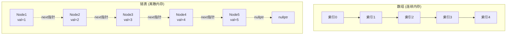
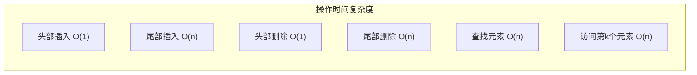
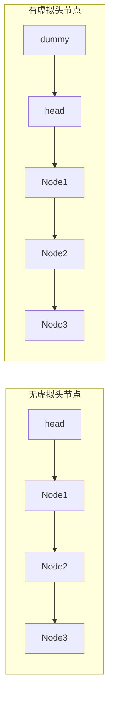
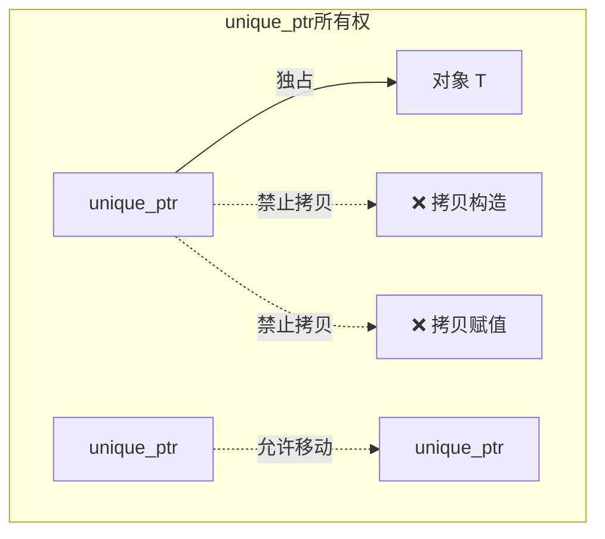
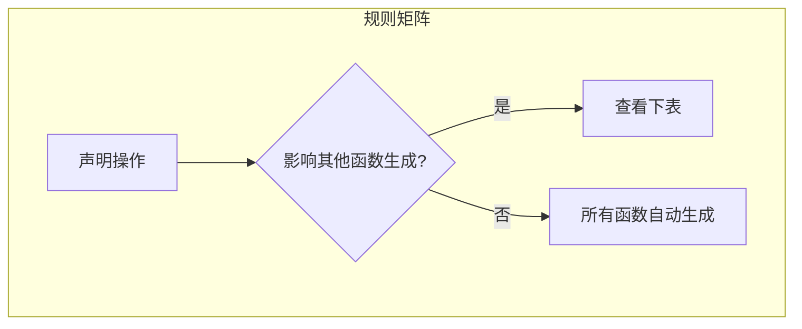
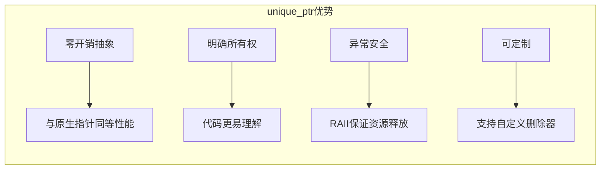
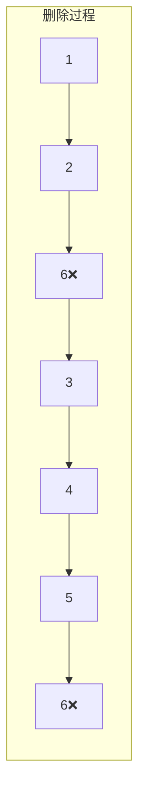
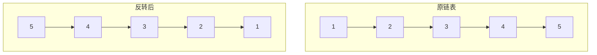
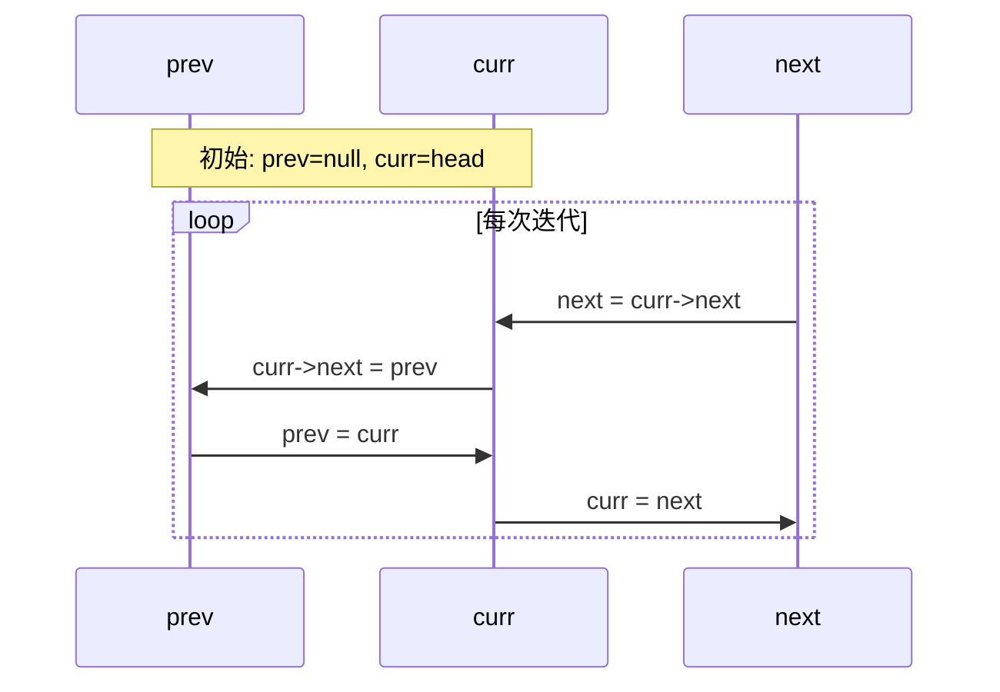

# Day 8: 链表数据结构与unique_ptr智能指针

## 📚 今日学习目标

1. **数据结构**：掌握链表的内存布局、节点设计与基本操作
2. **C++11特性**：深入理解`unique_ptr`的独占所有权语义
3. **EMC++条款**：学习特殊成员函数生成规则与资源管理
4. **算法实践**：解决链表经典问题，掌握虚拟头节点技巧

---

## 1️⃣ 链表数据结构详解

### 1.1 链表与数组的内存布局对比



### 1.2 特性对比表

| 特性 | 数组 | 链表 |
|------|------|------|
| 内存布局 | 连续 | 离散 |
| 随机访问 | O(1) | O(n) |
| 插入/删除 | O(n) 需移动元素 | O(1) 只需改指针 |
| 内存预分配 | 需要 | 不需要 |
| 缓存友好性 | 高 | 低 |
| 空间开销 | 仅数据 | 数据+指针 |

### 1.3 链表节点设计

```cpp
// 单链表节点
struct ListNode {
    int val;           // 数据域
    ListNode* next;    // 指针域
    ListNode(int x) : val(x), next(nullptr) {}
};

// 双链表节点
struct DoublyListNode {
    int val;
    DoublyListNode* prev;  // 前驱指针
    DoublyListNode* next;  // 后继指针
    DoublyListNode(int x) : val(x), prev(nullptr), next(nullptr) {}
};
```

### 1.4 链表基本操作时间复杂度



### 1.5 虚拟头节点技巧



**优势**：
- 统一头节点和其他节点的操作逻辑
- 避免删除头节点时的特殊情况处理
- 简化代码逻辑

---

## 2️⃣ unique_ptr智能指针详解

### 2.1 独占所有权模型



### 2.2 核心特性

| 特性 | 说明 |
|------|------|
| 独占所有权 | 同一时刻只能有一个unique_ptr指向对象 |
| 零开销 | 与原生指针性能相当 |
| 自动释放 | 离开作用域自动delete |
| 不可拷贝 | 禁用拷贝构造和拷贝赋值 |
| 可移动 | 支持移动语义，转移所有权 |

### 2.3 基本用法

```cpp
// 创建方式
std::unique_ptr<int> p1(new int(42));        // 直接构造
auto p2 = std::make_unique<int>(42);         // 推荐方式 (C++14)

// 访问对象
*p1 = 100;           // 解引用
int* raw = p1.get(); // 获取原生指针

// 释放所有权
int* raw2 = p1.release();  // 释放所有权，返回原生指针
delete raw2;               // 需要手动删除

// 重置
p1.reset(new int(200));    // 删除旧对象，管理新对象
p1.reset();                // 删除对象，变为空
```

### 2.4 移动语义

```cpp
// 所有权转移
std::unique_ptr<int> p1 = std::make_unique<int>(42);
std::unique_ptr<int> p2 = std::move(p1);  // p1变为nullptr

// 函数返回
std::unique_ptr<int> createInt() {
    return std::make_unique<int>(42);  // 隐式移动
}

// 函数参数
void process(std::unique_ptr<int> p);  // 移动所有权进入函数
void process(const std::unique_ptr<int>& p);  // 借用，不转移所有权
```

### 2.5 自定义删除器

```cpp
// 数组删除器
std::unique_ptr<int[]> arr(new int[10]);

// 文件句柄删除器
auto fileDeleter = [](FILE* f) { 
    if (f) fclose(f); 
};
std::unique_ptr<FILE, decltype(fileDeleter)> file(fopen("test.txt", "r"), fileDeleter);

// 函数指针删除器
std::unique_ptr<int, void(*)(int*)> p(new int(42), [](int* p) {
    delete p;
    std::cout << "Custom delete\n";
});
```

---

## 3️⃣ EMC++条款17：特殊成员函数生成规则

### 3.1 特殊成员函数概览

C++中的特殊成员函数包括：
- 默认构造函数
- 析构函数
- 拷贝构造函数
- 拷贝赋值运算符
- 移动构造函数 (C++11)
- 移动赋值运算符 (C++11)

### 3.2 生成规则表



| 声明的操作 | 默认构造 | 析构 | 拷贝构造 | 拷贝赋值 | 移动构造 | 移动赋值 |
|-----------|---------|------|---------|---------|---------|---------|
| 无 | ✅ | ✅ | ✅ | ✅ | ✅ | ✅ |
| 任何构造函数 | ❌ | ✅ | ✅ | ✅ | ✅ | ✅ |
| 析构函数 | ✅ | - | ✅ | ✅ | ❌ | ❌ |
| 拷贝构造 | ✅ | ✅ | - | ✅ | ❌ | ❌ |
| 拷贝赋值 | ✅ | ✅ | ✅ | - | ❌ | ❌ |
| 移动构造 | ❌ | ✅ | ❌ | ❌ | - | ❌ |
| 移动赋值 | ✅ | ✅ | ❌ | ❌ | ❌ | - |

### 3.3 核心规则

1. **移动操作只在类完全无拷贝操作时生成**
   - 如果声明了拷贝构造或拷贝赋值，移动操作不生成
   - 如果声明了移动操作，拷贝操作不生成

2. **析构函数影响移动操作**
   - 声明析构函数后，移动操作不自动生成

3. **Rule of Zero/Three/Five**
   - **Rule of Zero**：尽量不声明任何特殊成员函数
   - **Rule of Three**：如果需要析构、拷贝构造、拷贝赋值中的一个，通常需要全部三个
   - **Rule of Five**：在Three基础上加上移动操作

---

## 4️⃣ EMC++条款18：使用unique_ptr管理资源

### 4.1 条款核心思想

> 使用`std::unique_ptr`进行独占所有权的资源管理，它是开销最小的智能指针。

### 4.2 unique_ptr的优势



### 4.3 适用场景

1. **工厂函数返回值**
```cpp
std::unique_ptr<Investment> makeInvestment(InvestmentType type) {
    std::unique_ptr<Investment> pInv;
    switch (type) {
        case InvestmentType::Stock:
            pInv = std::make_unique<Stock>();
            break;
        case InvestmentType::Bond:
            pInv = std::make_unique<Bond>();
            break;
    }
    return pInv;  // 编译器优化为RVO或移动
}
```

2. **Pimpl惯用法**
```cpp
// Widget.h
class Widget {
public:
    Widget();
    ~Widget();
private:
    struct Impl;
    std::unique_ptr<Impl> pImpl;
};

// Widget.cpp
struct Widget::Impl {
    // 私有实现细节
};
```

3. **管理数组**
```cpp
std::unique_ptr<int[]> arr = std::make_unique<int[]>(10);
arr[0] = 42;  // 支持下标访问
```

### 4.4 与shared_ptr对比

| 特性 | unique_ptr | shared_ptr |
|------|-----------|------------|
| 所有权模型 | 独占 | 共享 |
| 内存开销 | 与原生指针相同 | 控制块额外开销 |
| 线程安全 | 指针本身安全 | 引用计数原子操作 |
| 适用场景 | 明确唯一所有者 | 共享所有权场景 |
| 性能 | 最优 | 略有开销 |

---

## 5️⃣ LeetCode题目详解

### 5.1 LeetCode 203：移除链表元素

**题目**：删除链表中等于给定值的所有节点

**示例**：
```
输入: head = [1,2,6,3,4,5,6], val = 6
输出: [1,2,3,4,5]
```



**核心思路**：
1. 使用虚拟头节点简化头节点删除
2. 遍历链表，跳过目标值节点
3. 正确释放被删除节点的内存

**时间复杂度**：O(n)  
**空间复杂度**：O(1)

---

### 5.2 LeetCode 206：反转链表

**题目**：反转单链表

**示例**：
```
输入: 1->2->3->4->5->NULL
输出: 5->4->3->2->1->NULL
```



**方法一：迭代法**
```cpp
ListNode* reverseList(ListNode* head) {
    ListNode* prev = nullptr;
    ListNode* curr = head;
    while (curr) {
        ListNode* next = curr->next;
        curr->next = prev;
        prev = curr;
        curr = next;
    }
    return prev;
}
```

**方法二：递归法**
```cpp
ListNode* reverseList(ListNode* head) {
    if (!head || !head->next) return head;
    ListNode* newHead = reverseList(head->next);
    head->next->next = head;
    head->next = nullptr;
    return newHead;
}
```

**迭代法执行过程**：



**时间复杂度**：O(n)  
**空间复杂度**：迭代O(1)，递归O(n)栈空间

---

## 6️⃣ 今日实践要点

### 代码结构

```
day_08/
├── README.md                    # 本文档
├── CMakeLists.txt               # 构建配置
├── build_and_run.sh             # 构建脚本
└── code/
    ├── main.cpp                 # 主程序入口
    ├── data_structure/          # 链表数据结构
    │   ├── list_node.h          # 节点定义
    │   ├── list_operations.cpp  # 基本操作
    │   └── list_demo.cpp        # 演示代码
    ├── cpp11_features/          # unique_ptr演示
    │   ├── unique_ptr_demo.cpp
    │   ├── unique_ptr_advanced.cpp
    │   └── make_unique.cpp
    ├── emcpp/                   # EMC++条款
    │   ├── item17_special_members.cpp
    │   └── item18_unique_ptr.cpp
    └── leetcode/                # LeetCode题目
        ├── 0203_remove_elements/
        └── 0206_reverse_list/
```

### 编译运行

```bash
cd /home/z/my-project/download/week_02/day_08
./build_and_run.sh
```

---

## 7️⃣ 扩展阅读

1. **链表高级变种**
   - 跳表 (Skip List)：O(log n)查找
   - 环形链表：检测环的Floyd算法
   - 双向链表：STL的`std::list`

2. **智能指针最佳实践**
   - 优先使用`make_unique`/`make_shared`
   - 避免从原生指针创建多个智能指针
   - 使用`unique_ptr`作为工厂函数返回类型

3. **EMC++相关条款**
   - 条款21：优先使用`std::make_unique`和`std::make_shared`
   - 条款22：使用Pimpl惯用法时，在实现文件中定义特殊成员函数

---

## 📝 今日总结

| 主题 | 核心要点 |
|------|---------|
| 链表 | 离散内存、O(1)插入删除、虚拟头节点技巧 |
| unique_ptr | 独占所有权、零开销、支持移动语义、自定义删除器 |
| 条款17 | 特殊成员函数生成规则、Rule of Zero/Three/Five |
| 条款18 | 用unique_ptr管理独占资源、工厂函数、Pimpl惯用法 |
| LeetCode 203 | 虚拟头节点简化删除逻辑 |
| LeetCode 206 | 迭代/递归两种反转方法 |

---

**下一步**：Day 9 将学习双向链表与`shared_ptr`智能指针！
