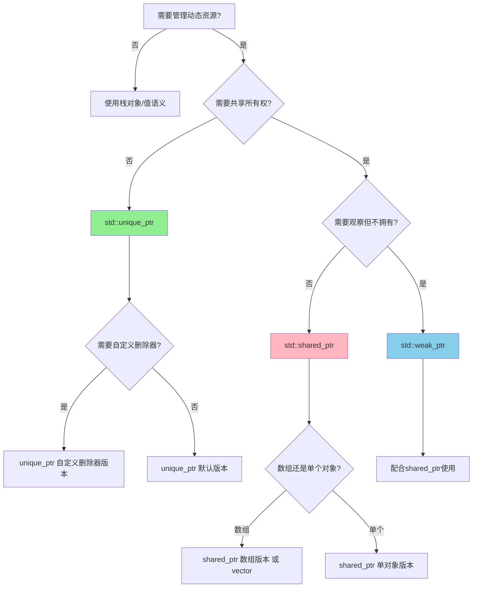

# Day 12: 智能指针总结与选择指南 & 底层内存管理

## 📚 今日概览

今天是C++内存管理的集大成篇，我们将：
1. **总结三种智能指针**：对比分析、选择策略
2. **深入底层原理**：堆内存管理、RAII原则
3. **LeetCode链表实战**：24题、25题

---

## 一、三种智能指针全面对比

### 1.1 对比表格

| 特性 | `std::unique_ptr` | `std::shared_ptr` | `std::weak_ptr` |
|------|-------------------|-------------------|-----------------|
| **所有权** | 独占所有权 | 共享所有权 | 无所有权（观察者） |
| **拷贝** | ❌ 禁止 | ✅ 允许（引用计数+1） | ✅ 允许 |
| **移动** | ✅ 允许 | ✅ 允许 | ✅ 允许 |
| **引用计数** | 无 | 有（原子操作） | 无（访问控制块） |
| **内存开销** | 与裸指针相同 | 控制块 + 原子操作 | 控制块指针 |
| **性能** | 最优 | 中等 | 最轻（仅指针） |
| **典型用途** | 资源独占、工厂模式 | 共享资源、缓存 | 打破循环引用、观察者 |
| **线程安全** | 否（需同步） | 引用计数安全 | 引用计数安全 |

### 1.2 智能指针选择决策树



### 1.3 选择指南

```cpp
// 场景1: 独占资源 - unique_ptr
std::unique_ptr<File> file = std::make_unique<File>("data.txt");

// 场景2: 共享资源 - shared_ptr
auto texture = std::make_shared<Texture>("sprite.png");
auto sprite1 = texture;  // 共享
auto sprite2 = texture;  // 引用计数 = 3

// 场景3: 打破循环引用 - weak_ptr
class Node {
    std::shared_ptr<Node> next;
    std::weak_ptr<Node> prev;  // 防止循环引用
};

// 场景4: 自定义删除器 - unique_ptr<T, Deleter>
auto fileDeleter = [](FILE* f) { fclose(f); };
std::unique_ptr<FILE, decltype(fileDeleter)> file(fopen("test.txt", "r"), fileDeleter);
```

---

## 二、RAII原则详解

### 2.1 RAII核心思想

**RAII (Resource Acquisition Is Initialization)**：资源获取即初始化

核心原则：
1. **资源获取**：在对象构造时完成
2. **资源释放**：在对象析构时自动完成
3. **异常安全**：栈展开保证析构函数被调用

### 2.2 RAII 的四大支柱

```cpp
// 1. 构造时获取资源
class Resource {
    Resource() { /* 获取资源 */ }
    
    // 2. 析构时释放资源
    ~Resource() { /* 释放资源 */ }
    
    // 3. 禁止拷贝（或实现深拷贝）
    Resource(const Resource&) = delete;
    Resource& operator=(const Resource&) = delete;
    
    // 4. 支持移动（转移所有权）
    Resource(Resource&&) noexcept;
    Resource& operator=(Resource&&) noexcept;
};
```

### 2.3 RAII 实现示例

```cpp
// 简单的文件句柄 RAII 封装
class FileHandle {
    FILE* file_;
public:
    explicit FileHandle(const char* filename, const char* mode)
        : file_(fopen(filename, mode)) {
        if (!file_) throw std::runtime_error("Failed to open file");
    }
    
    ~FileHandle() {
        if (file_) fclose(file_);
    }
    
    // 禁止拷贝
    FileHandle(const FileHandle&) = delete;
    FileHandle& operator=(const FileHandle&) = delete;
    
    // 支持移动
    FileHandle(FileHandle&& other) noexcept : file_(other.file_) {
        other.file_ = nullptr;
    }
    
    FILE* get() const { return file_; }
};
```

---

## 三、堆内存管理

### 3.1 new/delete vs malloc/free

| 方面 | new/delete | malloc/free |
|------|------------|-------------|
| **来源** | C++运算符 | C标准库函数 |
| **类型安全** | 类型安全，返回具体类型指针 | 返回 void*，需强制转换 |
| **构造/析构** | 自动调用构造/析构函数 | 仅分配内存 |
| **错误处理** | 抛出 `bad_alloc` 异常 | 返回 `nullptr` |
| **内存大小** | 自动计算 | 需手动计算 |
| **重载** | 可在类/全局重载 | 不可重载 |
| **底层** | 可基于 malloc 实现 | 系统调用 |

### 3.2 内存分配流程

```
new 表达式:
┌─────────────────────────────────────────┐
│ 1. operator new 分配原始内存            │
│ 2. 构造函数在内存上构造对象              │
│ 3. 返回类型化指针                        │
└─────────────────────────────────────────┘

delete 表达式:
┌─────────────────────────────────────────┐
│ 1. 调用析构函数清理资源                  │
│ 2. operator delete 释放内存              │
└─────────────────────────────────────────┘
```

### 3.3 内存泄漏检测方法

```cpp
// 方法1: 自定义 new/delete 追踪
void* operator new(size_t size) {
    void* p = malloc(size);
    std::cout << "Allocated " << size << " bytes at " << p << "\n";
    return p;
}

// 方法2: 使用 RAII 确保释放
void process() {
    auto data = std::make_unique<Data>();  // 自动释放
    // 即使抛出异常也能正确释放
}

// 方法3: 使用工具检测
// - Valgrind (Linux)
// - AddressSanitizer (编译器)
// - Visual Studio 内存检测器
```

---

## 四、LeetCode 链表专题

### 4.1 24题 - 两两交换链表中的节点

**题目**：给定链表，两两交换相邻节点，返回交换后的链表。

**示例**：
```
输入: 1->2->3->4
输出: 2->1->4->3
```

**解题思路**：

1. **递归法**：
   - 交换前两个节点
   - 递归处理后续链表
   - 时间: O(n), 空间: O(n) 递归栈

2. **迭代法**：
   - 使用虚拟头节点
   - 成对交换节点
   - 时间: O(n), 空间: O(1)

### 4.2 25题 - K个一组翻转链表

**题目**：每k个节点一组进行翻转，返回修改后的链表。

**示例**：
```
输入: 1->2->3->4->5, k = 2
输出: 2->1->4->3->5
```

**解题思路**：

1. **分组翻转**：
   - 先统计链表长度
   - 每k个节点进行翻转
   - 不足k个保持原序

2. **关键操作**：
   - 找到待翻转的k个节点
   - 翻转该组节点
   - 连接前后链表

---

## 五、代码结构

```
day_12/
├── README.md                    # 本文件
├── CMakeLists.txt              # 构建配置
├── build_and_run.sh            # 编译运行脚本
└── code/
    ├── main.cpp                # 主入口
    ├── cpp11_features/
    │   ├── smart_ptr_guide.cpp # 智能指针选择指南
    │   ├── raw_vs_smart.cpp    # 裸指针vs智能指针对比
    │   └── custom_deleter.cpp  # 自定义删除器汇总
    ├── low_level/
    │   ├── heap_memory.cpp     # 堆内存管理详解
    │   ├── raii_demo.cpp       # RAII原则演示
    │   └── memory_leak.cpp     # 内存泄漏检测
    └── leetcode/
        ├── 0024_swap_pairs/    # LeetCode 24题
        └── 0025_reverse_k_group/ # LeetCode 25题
```

---

## 六、编译运行

```bash
# 进入目录
cd /home/z/my-project/download/week_02/day_12

# 一键编译运行
chmod +x build_and_run.sh
./build_and_run.sh

# 或手动编译
mkdir build && cd build
cmake ..
make
./day_12
```

---

## 七、学习检查清单

- [ ] 理解三种智能指针的区别和适用场景
- [ ] 掌握智能指针选择决策树
- [ ] 理解 RAII 原则的核心思想
- [ ] 了解 new/delete 与 malloc/free 的区别
- [ ] 掌握链表的两两交换操作
- [ ] 掌握 K 个一组翻转链表的方法
- [ ] 理解递归和迭代两种解题思路

---

## 八、扩展阅读

1. **智能指针最佳实践**
   - [C++ Core Guidelines - Smart Pointers](https://isocpp.github.io/CppCoreGuidelines/)
   - Scott Meyers - "Effective Modern C++" 第4章

2. **内存管理**
   - "The C++ Programming Language" - 内存管理章节
   - Understanding Memory Leaks in C++

3. **RAII 设计模式**
   - "Modern C++ Design" - Andrei Alexandrescu

---

**上一节**：[Day 11 - weak_ptr深入](../day_11/)  
**下一节**：[Day 13 - 动态数组](../day_13/)
