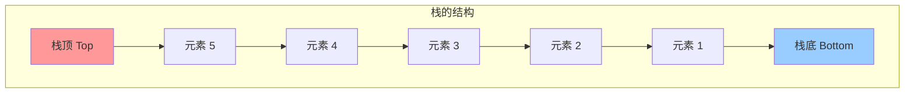
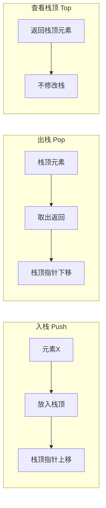
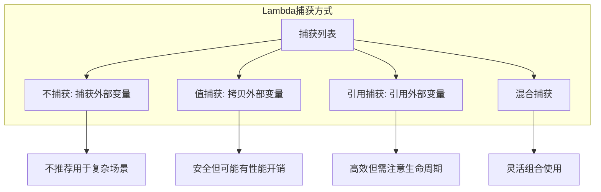
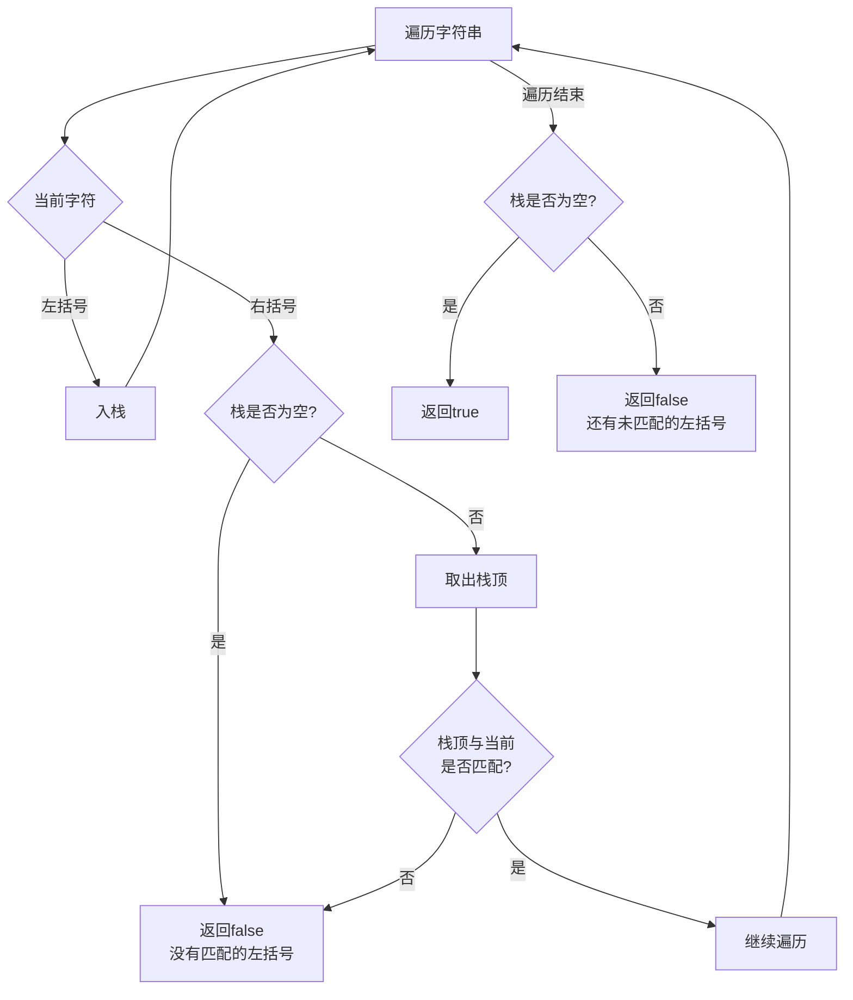
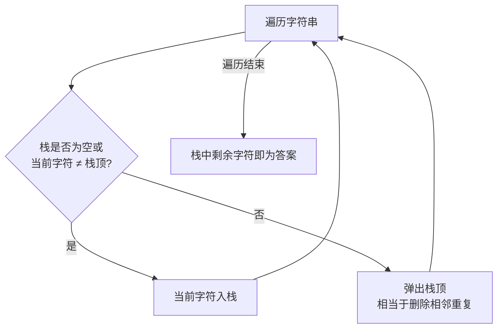

# Day 15：栈入门与Lambda表达式

## 📅 学习目标

- [ ] 理解栈数据结构的后进先出(LIFO)原理
- [ ] 掌握栈的基本操作：入栈、出栈、查看栈顶
- [ ] 学会使用C++ STL的stack容器
- [ ] 掌握Lambda表达式的基本语法
- [ ] 理解Lambda的捕获方式（值捕获、引用捕获）
- [ ] 学习EMC++ Item 31：避免默认捕获模式
- [ ] 完成LeetCode 20、1047

---

## 📖 知识点一：栈数据结构

### 概念定义

**栈(Stack)** 是一种**后进先出**(LIFO, Last In First Out)的线性数据结构。它只允许在一端（称为栈顶）进行插入和删除操作。

### 专业介绍

栈是一种抽象数据类型(ADT)，其核心特性体现在以下方面：

**操作约束**：栈只允许在表尾（栈顶）进行插入和删除操作，这种限制带来了操作的确定性——总是能确定哪个元素会被访问或删除。栈顶指针(top)指向最后一个入栈的元素位置。

**实现方式**：栈可以使用数组（顺序栈）或链表（链式栈）实现。顺序栈需要预分配连续内存空间，存在容量限制但访问效率高；链式栈动态分配内存，空间利用率高但需要额外的指针开销。

**应用原理**：栈的LIFO特性使其天然适合处理具有递归结构或嵌套关系的问题，如函数调用、括号匹配、表达式求值等。编译器使用栈来管理函数调用栈帧，维护返回地址和局部变量。



### 形象化比喻

想象一摞盘子：

```
🍽️ ← 栈顶（最后放的盘子，最先拿走）
🍽️
🍽️
🍽️
🍽️ ← 栈底（最先放的盘子，最后拿走）
```

**生活中的例子**：
- **洗盘子**：最后放上去的盘子，最先被洗
- **浏览器的后退按钮**：最后访问的页面，最先后退回去
- **撤销操作**：最后的操作最先被撤销
- **函数调用**：最后调用的函数最先返回

### 栈的基本操作



### 时间复杂度

| 操作 | 时间复杂度 | 说明 |
|------|-----------|------|
| push(x) | O(1) | 入栈 |
| pop() | O(1) | 出栈 |
| top() | O(1) | 查看栈顶 |
| empty() | O(1) | 判空 |
| size() | O(1) | 获取大小 |

### C++ STL stack 使用

```cpp
#include <stack>
#include <iostream>

void stackDemo() {
    std::stack<int> s;
    
    // 入栈
    s.push(1);
    s.push(2);
    s.push(3);
    
    // 查看栈顶
    std::cout << "栈顶: " << s.top() << std::endl;  // 3
    
    // 出栈
    s.pop();  // 移除栈顶元素 3
    
    // 大小
    std::cout << "大小: " << s.size() << std::endl;  // 2
    
    // 判空
    while (!s.empty()) {
        std::cout << s.top() << " ";  // 2 1
        s.pop();
    }
}
```

---

## 📖 知识点二：Lambda表达式入门

### 概念定义

**Lambda表达式** 是C++11引入的一种匿名函数机制，允许在代码中直接定义函数对象，无需单独声明命名函数。Lambda表达式可以捕获外部作用域的变量，实现闭包(closure)功能。

### 专业介绍

Lambda表达式在编译时会生成一个唯一的函数对象类（闭包类型），捕获的变量成为该类的成员变量。这种机制使得Lambda可以像普通函数一样调用，同时保持对外部状态的访问能力。

**类型推导**：Lambda表达式的类型由编译器自动推导，是一个唯一的、未命名的函数对象类型。可以使用auto关键字存储Lambda，或使用std::function封装。

**捕获机制**：捕获是Lambda的核心特性，分为值捕获（拷贝）和引用捕获（别名）。值捕获的变量在Lambda创建时拷贝，引用捕获则绑定到原变量。mutable关键字允许修改值捕获的变量（修改的是拷贝）。

**性能优势**：Lambda是编译期展开的内联代码，没有传统函数调用的开销。编译器可以对Lambda进行激进的优化，包括内联展开、消除冗余代码等。

### 基本语法

```cpp
[capture](parameters) -> return_type { body }
   ↑         ↑              ↑           ↑
 捕获列表   参数列表      返回类型     函数体
```

### 最简单的Lambda

```cpp
auto greet = []() { std::cout << "Hello, Lambda!" << std::endl; };
greet();  // 调用Lambda
```

### 带参数的Lambda

```cpp
auto add = [](int a, int b) { return a + b; };
std::cout << add(3, 4) << std::endl;  // 7
```

### 显式指定返回类型

```cpp
auto divide = [](double a, double b) -> double {
    if (b == 0) return 0;
    return a / b;
};
```

### 捕获方式详解



#### 1. 值捕获

```cpp
int x = 10;
auto f = [x]() {  // 拷贝x的值
    std::cout << x << std::endl;  // 10
    // x = 20;  // 错误：不能修改值捕获的变量
};

// 如果想修改拷贝的值，使用mutable
auto f2 = [x]() mutable {
    x = 20;  // OK，但只修改拷贝
    std::cout << x << std::endl;  // 20
};
```

#### 2. 引用捕获

```cpp
int x = 10;
auto f = [&x]() {  // 引用x
    x = 20;  // OK，修改原变量
};
f();
std::cout << x << std::endl;  // 20
```

#### 3. 隐式捕获

```cpp
int a = 1, b = 2, c = 3;

// 全部值捕获
auto f1 = [=]() { return a + b + c; };

// 全部引用捕获
auto f2 = [&]() { a = 10; b = 20; c = 30; };

// 混合捕获：a值捕获，b引用捕获，其他值捕获
auto f3 = [=, &b]() { b = a + c; };
```

### EMC++ Item 31：避免默认捕获模式

**问题**：默认捕获（`[=]`或`[&]`）可能导致意外行为。

#### 危险示例

```cpp
// 危险：引用捕获可能导致悬空引用
std::function<void()> createCallback() {
    int local = 42;
    return [&]() {  // 危险！local会被销毁
        std::cout << local << std::endl;  // 未定义行为
    };
}

// 安全：显式值捕获或使用init捕获
std::function<void()> createCallbackSafe() {
    int local = 42;
    return [local]() {  // 安全：拷贝值
        std::cout << local << std::endl;
    };
}
```

#### 最佳实践

```cpp
// ✅ 推荐：显式列出要捕获的变量
int x = 10, y = 20;
auto f = [x, &y]() {  // 清晰明了
    y = x + 1;
};

// ❌ 避免：默认捕获
auto f2 = [=, &]() {  // 不清晰，容易出错
    // ...
};
```

---

## 🎯 LeetCode 刷题

### 讲解题：LC 20. 有效的括号

#### 题目链接

[LeetCode 20](https://leetcode.cn/problems/valid-parentheses/)

#### 题目描述

给定一个只包括 `'('`，`')'`，`'{'`，`'}'`，`'['`，`']'` 的字符串 `s`，判断字符串是否有效。

有效字符串需满足：
1. 左括号必须用相同类型的右括号闭合
2. 左括号必须以正确的顺序闭合

#### 形象化理解

想象你在叠积木，每种括号是一种形状的积木：

```
输入: "{[()]}"  → 有效 ✓

叠积木过程：
  { [ (         先放左括号（像盖房子从下往上）
  { [ ( )       遇到)匹配最近的(，移除
  { [ ]         遇到]匹配最近的[，移除  
  { }           遇到}匹配最近的{，移除
  空            全部匹配成功！
```

```
输入: "{[(])}"  → 无效 ✗

叠积木过程：
  { [ (         放入 { [ (
  { [ ( ]       遇到]，但最近的是(，不匹配！
                匹配失败
```

#### 解题思路



#### 代码实现

```cpp
class Solution {
public:
    bool isValid(string s) {
        std::stack<char> stk;
        
        // 括号匹配映射：右括号 -> 左括号
        std::unordered_map<char, char> pairs = {
            {')', '('},
            {']', '['},
            {'}', '{'}
        };
        
        for (char c : s) {
            if (pairs.count(c)) {
                // 当前是右括号
                if (stk.empty() || stk.top() != pairs[c]) {
                    return false;  // 没有匹配的左括号
                }
                stk.pop();  // 匹配成功，移除栈顶
            } else {
                // 当前是左括号，入栈
                stk.push(c);
            }
        }
        
        return stk.empty();  // 栈空则全部匹配
    }
};
```

#### 复杂度分析

- **时间复杂度**：O(n)，遍历一次字符串
- **空间复杂度**：O(n)，最坏情况栈存储所有左括号

---

### 实战题：LC 1047. 删除字符串中的所有相邻重复项

#### 题目链接

[LeetCode 1047](https://leetcode.cn/problems/remove-all-adjacent-duplicates-in-string/)

#### 提示

1. 使用栈来模拟"消消乐"的过程
2. 遍历字符串，如果当前字符与栈顶相同，则弹出栈顶（消除）
3. 否则将当前字符入栈
4. 最后栈中剩余的字符就是答案

#### 题目描述

给出由小写字母组成的字符串 `s`，重复项删除操作会选择两个相邻且相同的字母并删除它们。反复执行这一操作，直到无法继续删除。

#### 形象化理解

想象**消消乐游戏**，相同的字母相邻就会消失：

```
输入: "abbaca"

步骤演示：
  a b b a c a   初始
    ↑↑
  a   b b   a c a   发现bb相邻相同，删除
  a     a c a       变成aa相邻
    ↑↑
      c a           删除aa，得到结果"ca"
```

这就像**栈弹球**：
- 新球与栈顶球相同？两个都消失！
- 不同？新球入栈！

#### 解题思路



#### 代码实现

```cpp
class Solution {
public:
    string removeDuplicates(string s) {
        std::stack<char> stk;
        
        for (char c : s) {
            if (stk.empty() || stk.top() != c) {
                // 栈空或不重复，入栈
                stk.push(c);
            } else {
                // 与栈顶相同，消除
                stk.pop();
            }
        }
        
        // 构建结果字符串
        string result;
        while (!stk.empty()) {
            result = stk.top() + result;  // 注意顺序
            stk.pop();
        }
        
        return result;
    }
};
```

#### 优化版本（使用string作为栈）

```cpp
class Solution {
public:
    string removeDuplicates(string s) {
        string result;  // string本身可以作为栈使用
        
        for (char c : s) {
            if (!result.empty() && result.back() == c) {
                result.pop_back();  // 消除
            } else {
                result.push_back(c);  // 入栈
            }
        }
        
        return result;
    }
};
```

#### 复杂度分析

- **时间复杂度**：O(n)
- **空间复杂度**：O(n)

---

## 🚀 运行代码

```bash
# 编译并运行当天所有代码
./build_and_run.sh

# 或者手动编译
mkdir build && cd build
cmake ..
make
./day15_main
```

---

## 📚 相关术语

| 术语 | 英文 | 定义 |
|------|------|------|
| 栈 | Stack | 后进先出的数据结构 |
| LIFO | Last In First Out | 后进先出 |
| 入栈 | Push | 将元素添加到栈顶 |
| 出栈 | Pop | 移除栈顶元素 |
| 栈顶 | Top | 栈中最后入栈的元素 |
| Lambda | Lambda Expression | 匿名函数 |
| 捕获 | Capture | Lambda访问外部变量 |
| 闭包 | Closure | Lambda及其捕获的环境 |

---

## 💡 学习提示

### 栈的使用场景

1. **括号匹配**：检查括号是否成对出现
2. **表达式求值**：中缀转后缀、计算后缀表达式
3. **函数调用**：保存函数返回地址和局部变量
4. **撤销操作**：保存历史状态
5. **浏览器历史**：后退功能

### Lambda使用建议

1. ✅ 显式列出要捕获的变量
2. ✅ 理解值捕获和引用捕获的区别
3. ✅ 注意引用捕获的生命周期问题
4. ❌ 避免使用默认捕获 `[=]` 或 `[&]`
5. ❌ 避免返回引用捕获的Lambda

---

## 🔗 参考资料

1. [Hello-Algo - 栈](https://www.hello-algo.com/chapter_stack_and_queue/stack/)
2. [cppreference - stack](https://en.cppreference.com/w/cpp/container/stack)
3. [cppreference - Lambda](https://en.cppreference.com/w/cpp/language/lambda)
4. [Effective Modern C++ - Item 31](https://www.aristeia.com/EMC++.html)
