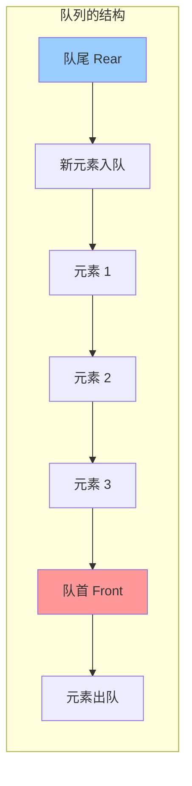
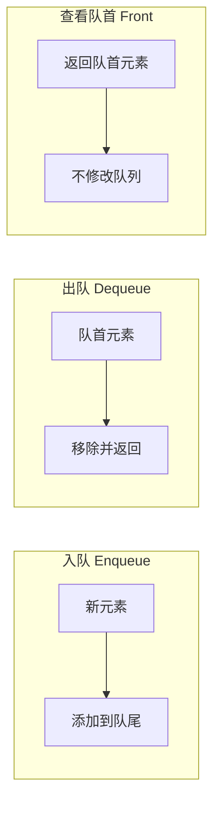
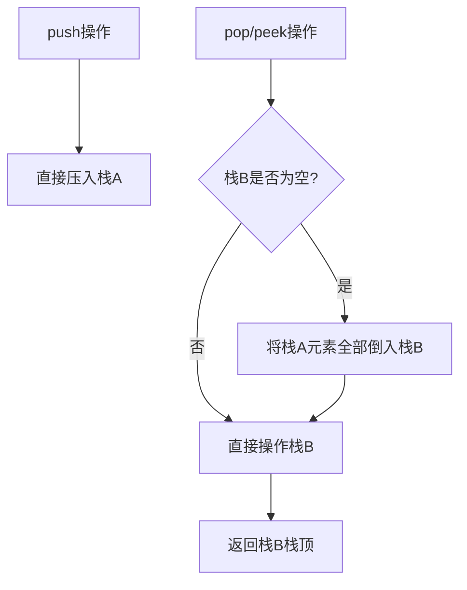
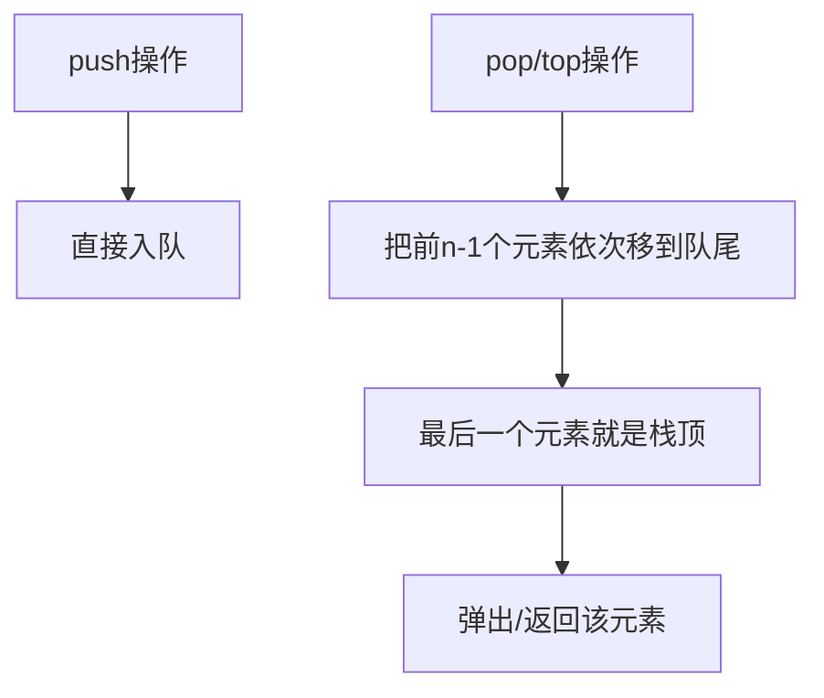
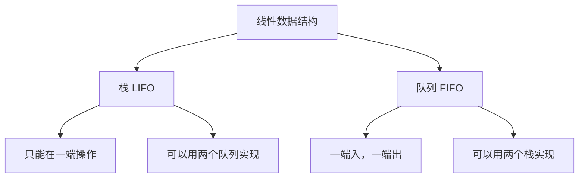

# Day 16：队列入门与Lambda进阶

## 📅 学习目标

- [ ] 理解队列数据结构的先进先出(FIFO)原理
- [ ] 掌握队列的基本操作：入队、出队、查看队首
- [ ] 学会使用C++ STL的queue容器
- [ ] 掌握Lambda的高级用法：泛型Lambda、初始化捕获
- [ ] 学习EMC++ Item 32-33
- [ ] 完成LeetCode 232、225

---

## 📖 知识点一：队列数据结构

### 概念定义

**队列(Queue)** 是一种**先进先出**(FIFO, First In First Out)的线性数据结构。它只允许在一端（队尾）插入，在另一端（队首）删除。

### 专业介绍

队列是一种抽象数据类型(ADT)，其核心特性体现在以下方面：

**操作约束**：队列允许在表尾（rear）插入元素，在表头（front）删除元素。这种双端操作限制保证了元素的处理顺序与到达顺序一致。队头指针和队尾指针分别指向第一个和最后一个元素位置。

**实现方式**：队列可以用数组（循环队列）或链表实现。循环队列通过取模运算解决"假溢出"问题，空间利用率高；链式队列动态分配内存，容量灵活但需要指针开销。双端队列(deque)允许两端都进行插入删除。

**应用场景**：队列的FIFO特性使其成为处理"先来先服务"场景的理想选择。操作系统使用队列管理进程调度，网络路由器使用队列缓冲数据包，消息队列实现异步通信和解耦。



### 形象化比喻

想象排队买票的场景：

```
[票窗口] ← [小明] ← [小红] ← [小刚] ← [小华]
  ↑                              ↑
 队首                          队尾
(最先到的人先买票)          (最后到的人排在最后)
```

**生活中的例子**：
- **排队买票**：先来的先买
- **打印机任务**：先提交的任务先打印
- **客服热线**：按顺序接听
- **消息队列**：先发送的消息先处理

### 队列的基本操作



### 时间复杂度

| 操作 | 时间复杂度 | 说明 |
|------|-----------|------|
| push(x) / enqueue | O(1) | 入队 |
| pop() / dequeue | O(1) | 出队 |
| front() | O(1) | 查看队首 |
| back() | O(1) | 查看队尾 |
| empty() | O(1) | 判空 |
| size() | O(1) | 获取大小 |

### C++ STL queue 使用

```cpp
#include <queue>
#include <iostream>

void queueDemo() {
    std::queue<int> q;
    
    // 入队
    q.push(1);
    q.push(2);
    q.push(3);
    
    // 查看队首和队尾
    std::cout << "队首: " << q.front() << std::endl;  // 1
    std::cout << "队尾: " << q.back() << std::endl;    // 3
    
    // 出队
    q.pop();  // 移除队首元素 1
    
    // 大小
    std::cout << "大小: " << q.size() << std::endl;  // 2
    
    // 遍历并清空
    while (!q.empty()) {
        std::cout << q.front() << " ";  // 2 3
        q.pop();
    }
}
```

---

## 📖 知识点二：Lambda进阶

### 泛型Lambda（C++14）

C++14允许Lambda参数使用`auto`，实现泛型Lambda：

```cpp
// 泛型Lambda：可以接受任意类型
auto add = [](auto a, auto b) {
    return a + b;
};

add(1, 2);        // int + int
add(1.5, 2.5);    // double + double
add(std::string("Hello"), std::string(" World"));  // string + string
```

### 初始化捕获（C++14）

C++14允许在捕获列表中初始化新变量：

```cpp
auto ptr = std::make_unique<int>(42);

// C++14: 移动捕获
auto f = [p = std::move(ptr)]() {
    std::cout << *p << std::endl;
};

// 也可以创建新变量
auto g = [x = 10, y = x + 5]() {
    return x + y;  // 15
};
```

### EMC++ Item 32：使用初始化捕获将对象移入闭包

**问题**：C++11只能拷贝捕获，无法移动捕获。

**C++11变通方案**：

```cpp
std::vector<int> data = {1, 2, 3, 4, 5};

// C++11: 使用std::bind模拟移动捕获
auto f = std::bind(
    [](const std::vector<int>& data) {
        // 使用data
    },
    std::move(data)  // 移动给bind对象
);
```

**C++14方案**：

```cpp
std::vector<int> data = {1, 2, 3, 4, 5};

auto f = [data = std::move(data)]() {
    // data已被移动到闭包中
};
```

### EMC++ Item 33：对auto&&参数使用decltype来std::forward

**泛型Lambda中的完美转发**：

```cpp
// C++14: 泛型Lambda中完美转发
auto f = [](auto&& x) {
    doSomething(std::forward<decltype(x)>(x));
};

f(42);           // x是int&&，转发为右值
int y = 10;
f(y);            // x是int&，转发为左值
```

---

## 🎯 LeetCode 刷题

### 讲解题：LC 232. 用栈实现队列

#### 题目链接

[LeetCode 232](https://leetcode.cn/problems/implement-queue-using-stacks/)

#### 题目描述

请你仅使用两个栈实现一个队列，并支持队列的四种操作：push、pop、peek、empty。

#### 形象化理解

用两个盒子（栈）来模拟排队：

```
栈A（入队栈）    栈B（出队栈）
  [  ]            [  ]
  [  ]            [  ]
  [3]             [1]
  [2]             [2]
  [1]             [3]
  
入队时：往栈A压入元素
出队时：如果栈B为空，把栈A的元素全部倒入栈B，然后弹出栈B顶
```

这就是**"倒水杯"**的方法：把一个杯子里的水倒入另一个杯子，顺序就颠倒了！

#### 解题思路



#### 代码实现

```cpp
class MyQueue {
private:
    std::stack<int> inStack;   // 入队栈
    std::stack<int> outStack;  // 出队栈
    
    void transfer() {
        while (!inStack.empty()) {
            outStack.push(inStack.top());
            inStack.pop();
        }
    }
    
public:
    void push(int x) {
        inStack.push(x);
    }
    
    int pop() {
        if (outStack.empty()) {
            transfer();
        }
        int val = outStack.top();
        outStack.pop();
        return val;
    }
    
    int peek() {
        if (outStack.empty()) {
            transfer();
        }
        return outStack.top();
    }
    
    bool empty() {
        return inStack.empty() && outStack.empty();
    }
};
```

#### 复杂度分析

- **push**: O(1)
- **pop/peek**: 均摊O(1)（每个元素最多被转移一次）
- **empty**: O(1)

---

### 实战题：LC 225. 用队列实现栈

#### 题目链接

[LeetCode 225](https://leetcode.cn/problems/implement-stack-using-queues/)

#### 提示

1. 用一个队列即可实现栈
2. 出栈时，将前n-1个元素依次移到队尾
3. 最后一个元素就是"栈顶"
4. 或者使用两个队列交替存储

#### 题目描述

请你仅使用两个队列实现一个栈，并支持栈的四种操作：push、pop、top、empty。

#### 形象化理解

用一个队列实现栈的技巧：

```
原队列: [1, 2, 3, 4, 5]
要弹出"栈顶"(实际是队尾)的5

方法：把前面的元素重新排到后面
[1, 2, 3, 4, 5] 
→ [2, 3, 4, 5, 1]
→ [3, 4, 5, 1, 2]
→ [4, 5, 1, 2, 3]
→ [5, 1, 2, 3, 4]
现在队首就是原来的"栈顶"，可以弹出了！
```

这就像**"循环队列"**：不断把队首移到队尾，直到目标元素到达队首。

#### 解题思路



#### 代码实现（单队列方案）

```cpp
class MyStack {
private:
    std::queue<int> q;
    
public:
    void push(int x) {
        q.push(x);
    }
    
    int pop() {
        int n = q.size() - 1;
        // 把前n-1个元素移到队尾
        for (int i = 0; i < n; ++i) {
            q.push(q.front());
            q.pop();
        }
        int val = q.front();
        q.pop();
        return val;
    }
    
    int top() {
        int val = pop();
        q.push(val);  // 放回去
        return val;
    }
    
    bool empty() {
        return q.empty();
    }
};
```

#### 复杂度分析

- **push**: O(1)
- **pop/top**: O(n)
- **empty**: O(1)

---

## 🚀 运行代码

```bash
# 编译并运行当天所有代码
./build_and_run.sh

# 或者手动编译
mkdir build && cd build
cmake ..
make
./day16_main
```

---

## 📚 相关术语

| 术语 | 英文 | 定义 |
|------|------|------|
| 队列 | Queue | 先进先出的数据结构 |
| FIFO | First In First Out | 先进先出 |
| 入队 | Enqueue | 将元素添加到队尾 |
| 出队 | Dequeue | 移除队首元素 |
| 双端队列 | Deque | 两端都可入队出队 |
| 泛型Lambda | Generic Lambda | 参数使用auto的Lambda |
| 初始化捕获 | Init Capture | 在捕获列表中初始化变量 |

---

## 💡 学习提示

### 队列的使用场景

1. **BFS广度优先搜索**：按层次遍历
2. **任务调度**：先来先服务
3. **消息队列**：异步处理
4. **缓冲区**：数据传输
5. **打印队列**：打印任务管理

### 栈和队列的关系



---

## 🔗 参考资料

1. [Hello-Algo - 队列](https://www.hello-algo.com/chapter_stack_and_queue/queue/)
2. [cppreference - queue](https://en.cppreference.com/w/cpp/container/queue)
3. [Effective Modern C++ - Item 32-33](https://www.aristeia.com/EMC++.html)
