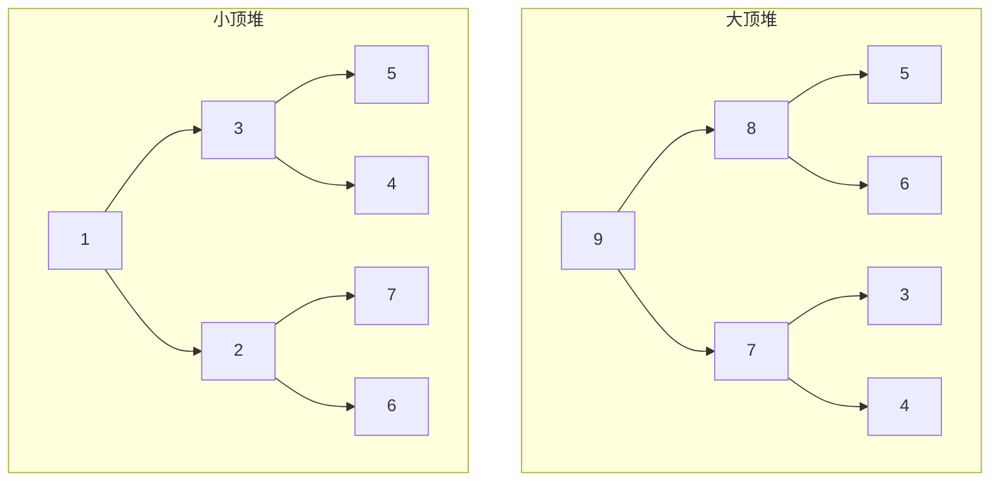
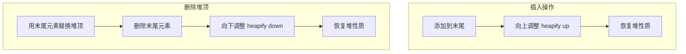
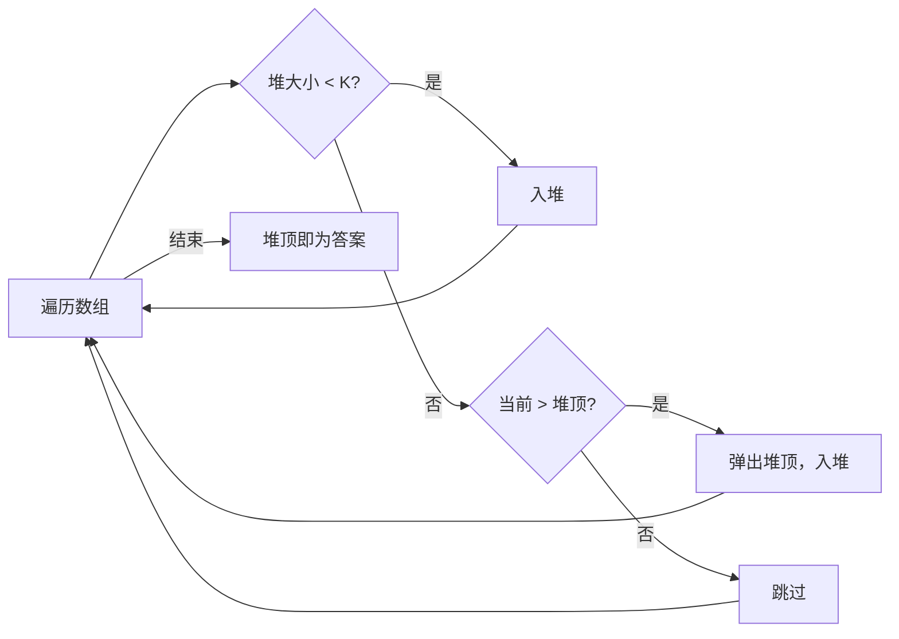

# Day 19：堆与优先队列

## 📅 学习目标

- [ ] 理解堆数据结构的原理
- [ ] 掌握大顶堆和小顶堆的区别
- [ ] 学会使用C++ STL的priority_queue
- [ ] 理解堆排序的原理
- [ ] 完成LeetCode 215、347

---

## 📖 知识点：堆数据结构

### 概念定义

**堆(Heap)** 是一种特殊的完全二叉树，满足堆性质：
- **大顶堆**：每个节点的值 ≥ 其子节点的值
- **小顶堆**：每个节点的值 ≤ 其子节点的值



### 形象化理解

想象一个**公司组织架构**：

```
大顶堆（大老板在最上面）：
        CEO(最大)
       /        \
    VP          VP
   /  \        /  \
 经理  经理   经理  经理

特点：每个领导都比下属"大"
```

### 堆的数组表示

堆通常用数组存储，对于下标 i 的节点：
- 父节点：(i-1) / 2
- 左子节点：2*i + 1
- 右子节点：2*i + 2

```
数组: [9, 8, 7, 5, 6, 3, 4]
下标:  0  1  2  3  4  5  6

对应堆：
        9(0)
      /    \
    8(1)   7(2)
   /  \    /  \
 5(3) 6(4) 3(5) 4(6)
```

### 堆的基本操作



### 时间复杂度

| 操作 | 时间复杂度 | 说明 |
|------|-----------|------|
| 插入 | O(log n) | 向上调整 |
| 删除堆顶 | O(log n) | 向下调整 |
| 获取堆顶 | O(1) | 直接访问 |
| 建堆 | O(n) | 从下往上调整 |

### C++ priority_queue

```cpp
#include <queue>

// 大顶堆（默认）
std::priority_queue<int> maxHeap;

// 小顶堆
std::priority_queue<int, std::vector<int>, std::greater<int>> minHeap;

// 自定义比较
auto cmp = [](int a, int b) { return a > b; };
std::priority_queue<int, std::vector<int>, decltype(cmp)> customHeap(cmp);
```

---

## 🎯 LeetCode 刷题

### 讲解题：LC 215. 数组中的第K个最大元素

#### 题目链接

[LeetCode 215](https://leetcode.cn/problems/kth-largest-element-in-an-array/)

#### 题目描述

给定整数数组 `nums` 和整数 `k`，请返回数组中第 `k` 个最大的元素。

#### 形象化理解

想象你有一堆成绩单，想找第K名：

```
成绩: [3, 2, 1, 5, 6, 4]
找第2名（第2大的数）

方法1：排序 → [6, 5, 4, 3, 2, 1] → 第2名是5
方法2：小顶堆，保持K个元素 → 堆顶就是第K大
```

#### 解题思路

**方法一：小顶堆**
- 维护大小为K的小顶堆
- 堆顶就是第K大的元素



**方法二：快速选择**
- 类似快速排序的partition
- 平均O(n)，最坏O(n²)

#### 代码实现

```cpp
// 方法1：小顶堆
int findKthLargest(vector<int>& nums, int k) {
    priority_queue<int, vector<int>, greater<int>> minHeap;
    
    for (int num : nums) {
        minHeap.push(num);
        if (minHeap.size() > k) {
            minHeap.pop();
        }
    }
    
    return minHeap.top();
}

// 方法2：快速选择
int quickSelect(vector<int>& nums, int left, int right, int k) {
    int pivot = nums[right];
    int i = left;
    
    for (int j = left; j < right; ++j) {
        if (nums[j] > pivot) {
            swap(nums[i], nums[j]);
            i++;
        }
    }
    swap(nums[i], nums[right]);
    
    if (i == k - 1) return nums[i];
    if (i < k - 1) return quickSelect(nums, i + 1, right, k);
    return quickSelect(nums, left, i - 1, k);
}
```

---

### 实战题：LC 347. 前K个高频元素

#### 题目链接

[LeetCode 347](https://leetcode.cn/problems/top-k-frequent-elements/)

#### 提示

1. 使用哈希表统计每个元素的频率
2. 用小顶堆维护前K个高频元素
3. 堆中存储(频率, 元素)对
4. 最终堆中的元素就是答案

#### 题目描述

给你一个整数数组 `nums` 和一个整数 `k`，请你返回其中出现频率前 `k` 高的元素。

#### 形象化理解

想象统计投票结果：

```
选票: [1, 1, 1, 2, 2, 3]
统计: 1号得3票，2号得2票，3号得1票
前2名: 1号和2号

思路：
1. 统计每个数字出现次数
2. 用小顶堆维护前K个高频元素
```

#### 解题思路

1. 使用哈希表统计频率
2. 用小顶堆维护前K高频元素
3. 堆中存储 (频率, 数字) 对

#### 代码实现

```cpp
vector<int> topKFrequent(vector<int>& nums, int k) {
    // 1. 统计频率
    unordered_map<int, int> freq;
    for (int num : nums) {
        freq[num]++;
    }
    
    // 2. 小顶堆
    auto cmp = [](const pair<int, int>& a, const pair<int, int>& b) {
        return a.second > b.second;  // 频率小的优先级高
    };
    priority_queue<pair<int, int>, vector<pair<int, int>>, decltype(cmp)> minHeap(cmp);
    
    // 3. 维护前K个
    for (auto& [num, count] : freq) {
        minHeap.push({num, count});
        if (minHeap.size() > k) {
            minHeap.pop();
        }
    }
    
    // 4. 收集结果
    vector<int> result;
    while (!minHeap.empty()) {
        result.push_back(minHeap.top().first);
        minHeap.pop();
    }
    
    return result;
}
```

---

## 🚀 运行代码

```bash
./build_and_run.sh
```

---

## 💡 学习提示

### 优先队列的使用场景

1. **Top K问题**：找最大/最小的K个元素
2. **合并有序链表**：多路归并
3. **任务调度**：优先级调度
4. **中位数维护**：双堆法
5. **滑动窗口最大值**：单调队列

### 大顶堆 vs 小顶堆

| 场景 | 选择 |
|------|------|
| 找最大K个元素 | 小顶堆（堆顶是第K大） |
| 找最小K个元素 | 大顶堆（堆顶是第K小） |
| 优先级高的先处理 | 大顶堆 |
| 按时间先后处理 | 小顶堆 |

---

## 📚 相关术语

| 术语 | 英文 | 定义 |
|------|------|------|
| 堆 | Heap | 满足堆性质的完全二叉树 |
| 大顶堆 | Max Heap | 父节点值大于等于子节点 |
| 小顶堆 | Min Heap | 父节点值小于等于子节点 |
| 优先队列 | Priority Queue | 基于堆实现的队列 |
| 堆化 | Heapify | 调整堆结构恢复堆性质 |
| 堆排序 | Heap Sort | 基于堆的排序算法 |

---

## 🔗 参考资料

1. [Hello-Algo - 堆](https://www.hello-algo.com/chapter_heap/)
2. [cppreference - priority_queue](https://en.cppreference.com/w/cpp/container/priority_queue)
3. [维基百科 - 堆排序](https://zh.wikipedia.org/wiki/堆排序)
