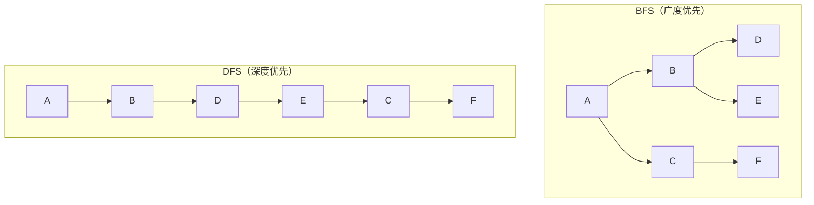
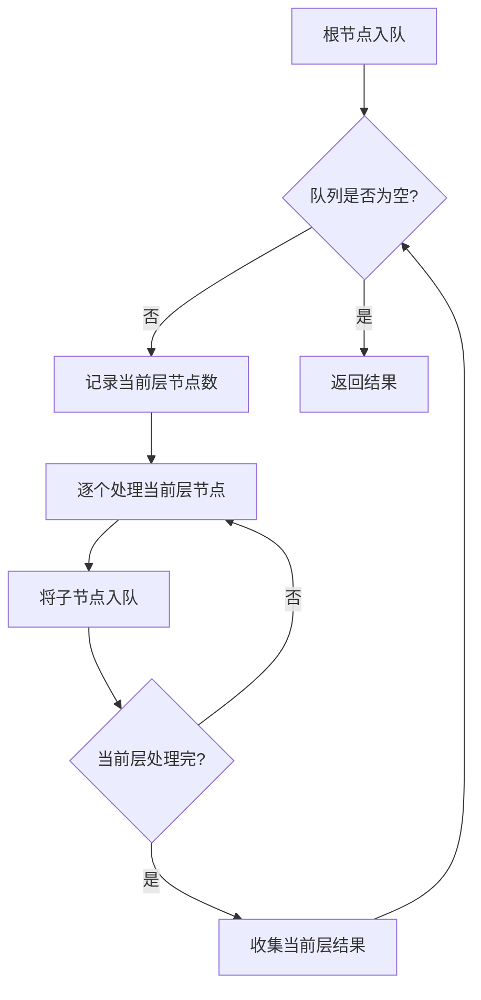

# Day 20：BFS广度优先搜索

## 📅 学习目标

- [ ] 理解BFS的原理和应用场景
- [ ] 掌握BFS的标准模板
- [ ] 理解BFS与DFS的区别
- [ ] 学会使用队列实现BFS
- [ ] 完成LeetCode 102、107

---

## 📖 知识点：BFS算法

### 概念定义

**广度优先搜索(BFS, Breadth-First Search)** 是一种图遍历算法，从起点开始，先访问所有相邻节点，再访问相邻节点的相邻节点，层层向外扩展。

### 专业介绍

BFS是图论中的基础算法，其核心特性如下：

**遍历顺序**：BFS按"距离"层级遍历，先访问距离起点近的节点，后访问远的节点。这种特性使BFS天然适合求最短路径问题。

**数据结构**：BFS使用队列(Queue)存储待访问节点。队列的FIFO特性保证了节点按入队顺序被处理，实现层级遍历。

**时间复杂度**：对于图G=(V,E)，BFS的时间复杂度为O(V+E)，其中V是节点数，E是边数。每个节点和边最多被访问一次。

**应用场景**：最短路径、层级遍历、连通性检测、拓扑排序、网络爬虫等。

### 形象化理解

想象**水波扩散**：

```
投入一颗石子，水波纹一圈圈向外扩散

        ╭───────╮
      ╭─┼───────┼─╮
    ╭─┼─┼───────┼─┼─╮
    │ │ │   ●   │ │ │  第3层
    ╰─┼─┼───────┼─┼─╯
      ╰─┼───────┼─╯    第2层
        ╰───────╯      第1层
        
起点(●) → 第1圈 → 第2圈 → 第3圈 → ...
```

**生活中的例子**：
- **社交网络**：找朋友的朋友（二度人脉）
- **迷宫**：找最短路径
- **传染传播**：病毒传播范围
- **GPS导航**：最短路线

### BFS vs DFS 对比



| 特性 | BFS | DFS |
|------|-----|-----|
| 数据结构 | 队列 | 栈 |
| 访问顺序 | 先近后远 | 先深入后回溯 |
| 最短路径 | 天然支持 | 需要额外处理 |
| 空间复杂度 | 可能较大 | 可能较小 |
| 适用场景 | 最短路径、层级遍历 | 全排列、回溯 |

### BFS标准模板

```cpp
void bfs(Node* start) {
    queue<Node*> q;
    set<Node*> visited;
    
    q.push(start);
    visited.insert(start);
    
    while (!q.empty()) {
        Node* curr = q.front();
        q.pop();
        
        // 处理当前节点
        process(curr);
        
        // 遍历相邻节点
        for (Node* neighbor : getNeighbors(curr)) {
            if (visited.find(neighbor) == visited.end()) {
                q.push(neighbor);
                visited.insert(neighbor);
            }
        }
    }
}
```

### 层序遍历模板

```cpp
vector<vector<int>> levelOrder(TreeNode* root) {
    vector<vector<int>> result;
    if (!root) return result;
    
    queue<TreeNode*> q;
    q.push(root);
    
    while (!q.empty()) {
        int levelSize = q.size();  // 当前层节点数
        vector<int> level;
        
        for (int i = 0; i < levelSize; ++i) {
            TreeNode* node = q.front();
            q.pop();
            level.push_back(node->val);
            
            if (node->left) q.push(node->left);
            if (node->right) q.push(node->right);
        }
        
        result.push_back(level);
    }
    
    return result;
}
```

---

## 🎯 LeetCode 刷题

### 讲解题：LC 102. 二叉树的层序遍历

#### 题目链接

[LeetCode 102](https://leetcode.cn/problems/binary-tree-level-order-traversal/)

#### 题目描述

给你二叉树的根节点 `root`，返回其节点值的**层序遍历**结果。

#### 形象化理解

想象从树顶往下看，一层一层地收集节点：

```
        3          第1层: [3]
       / \
      9  20        第2层: [9, 20]
        /  \
       15   7      第3层: [15, 7]

结果: [[3], [9, 20], [15, 7]]
```

#### 解题思路



#### 代码实现

```cpp
vector<vector<int>> levelOrder(TreeNode* root) {
    vector<vector<int>> result;
    if (!root) return result;
    
    queue<TreeNode*> q;
    q.push(root);
    
    while (!q.empty()) {
        int levelSize = q.size();
        vector<int> level;
        
        for (int i = 0; i < levelSize; ++i) {
            TreeNode* node = q.front();
            q.pop();
            level.push_back(node->val);
            
            if (node->left) q.push(node->left);
            if (node->right) q.push(node->right);
        }
        
        result.push_back(level);
    }
    
    return result;
}
```

---

### 实战题：LC 107. 二叉树的层序遍历 II

#### 题目链接

[LeetCode 107](https://leetcode.cn/problems/binary-tree-level-order-traversal-ii/)

#### 提示

1. 与102题解法相同
2. 最后将结果数组反转
3. 或者使用头插法构建结果

#### 题目描述

给你二叉树的根节点 `root`，返回其节点值**自底向上的层序遍历**。

#### 解题思路

只需在102题基础上**反转结果**即可：

```cpp
vector<vector<int>> levelOrderBottom(TreeNode* root) {
    vector<vector<int>> result = levelOrder(root);
    reverse(result.begin(), result.end());
    return result;
}
```

---

## 🚀 运行代码

```bash
./build_and_run.sh
```

---

## 💡 学习提示

### BFS的识别

当你看到以下问题时，考虑使用BFS：
1. 最短路径问题（无权图）
2. 层级遍历（树、图）
3. 连通区域问题
4. "最少步数"问题

### BFS优化技巧

1. **提前退出**：找到目标立即返回
2. **双向BFS**：从起点和终点同时搜索
3. **优先队列**：Dijkstra算法
4. **去重**：使用visited集合避免重复访问

---

## 📚 相关术语

| 术语 | 英文 | 定义 |
|------|------|------|
| 广度优先搜索 | BFS | 层级遍历图的算法 |
| 深度优先搜索 | DFS | 深入遍历图的算法 |
| 层序遍历 | Level Order Traversal | 按层遍历树 |
| 最短路径 | Shortest Path | 两点间最短距离 |
| 连通分量 | Connected Component | 连通的子图 |

---

## 🔗 参考资料

1. [Hello-Algo - BFS](https://www.hello-algo.com/chapter_graph/graph_bfs/)
2. [Hello-Algo - 二叉树遍历](https://www.hello-algo.com/chapter_tree/binary_tree_traversal/)
3. [维基百科 - 广度优先搜索](https://zh.wikipedia.org/wiki/广度优先搜索)
