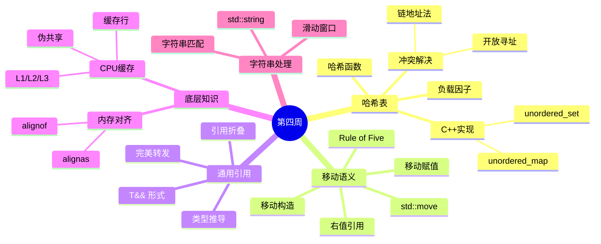

# 第四周：哈希表 + 移动语义

> 📚 本周重点：掌握哈希表数据结构、深入理解C++移动语义、学习通用引用与完美转发

---

## 📅 本周学习概览

| Day | 主题 | 数据结构 | C++11特性 | EMC++条款 | LeetCode |
|-----|------|---------|-----------|----------|----------|
| 22 | 哈希表入门 | 哈希表数据结构 | 右值引用 | 9 | 242, 383 |
| 23 | 移动语义 | - | 移动语义 | 23-25 | 1, 454 |
| 24 | 通用引用 | - | 通用引用 | 26-28 | 49, 128 |
| 25 | 完美转发 | - | 完美转发 | 29-30 | 3, 438 |
| 26 | CPU缓存 | CPU缓存/对齐 | - | - | 5, 647 |
| 27 | 字符串专题 | 字符串处理 | - | - | 76, 567 |
| 28 | 周复习 | 哈希表综合 | 移动语义综合 | 9,23-30复习 | 146, 460 |

---

## 📖 本周知识图谱



---

## 🎯 本周学习目标

### 数据结构目标
- [ ] 掌握哈希表的基本原理和实现方式
- [ ] 理解哈希冲突的解决策略（链地址法、开放寻址法）
- [ ] 了解CPU缓存结构及其对程序性能的影响
- [ ] 掌握内存对齐的概念和优化方法
- [ ] 掌握字符串处理的常用算法

### C++11特性目标
- [ ] 深入理解右值引用和左值引用的区别
- [ ] 掌握移动语义和std::move的使用
- [ ] 理解通用引用（万能引用）的概念
- [ ] 掌握引用折叠规则
- [ ] 能够正确使用std::forward实现完美转发

### EMC++条款目标
- [ ] Item 9：理解using和typedef的区别
- [ ] Item 23：理解std::move和std::forward的区别
- [ ] Item 24：区分通用引用和右值引用
- [ ] Item 25：正确使用std::move和std::forward
- [ ] Item 26-28：理解引用折叠规则和完美转发

### LeetCode刷题目标
- [ ] 完成14道题目（每天2道）
- [ ] 掌握哈希表在算法中的应用
- [ ] 掌握滑动窗口算法模板
- [ ] 实现LRU/LFU缓存设计

---

## 📂 目录结构

```
week_04/
├── README.md                   # 本文件
├── day_22/                     # 哈希表入门
│   ├── README.md
│   ├── CMakeLists.txt
│   ├── build_and_run.sh
│   └── code/
│       ├── main.cpp
│       ├── data_structure/     # 哈希表演示
│       ├── cpp11_features/     # 右值引用
│       ├── emcpp/              # Item 9
│       └── leetcode/           # LC 242, 383
│
├── day_23/                     # 移动语义
│   ├── README.md
│   ├── CMakeLists.txt
│   ├── build_and_run.sh
│   └── code/
│       ├── main.cpp
│       ├── cpp11_features/     # 移动语义演示
│       ├── emcpp/              # Item 23-25
│       └── leetcode/           # LC 1, 454
│
├── day_24/                     # 通用引用
│   ├── README.md
│   ├── CMakeLists.txt
│   ├── build_and_run.sh
│   └── code/
│       ├── main.cpp
│       ├── cpp11_features/     # 通用引用、引用折叠
│       ├── emcpp/              # Item 26-28
│       └── leetcode/           # LC 49, 128
│
├── day_25/                     # 完美转发
│   ├── README.md
│   ├── CMakeLists.txt
│   ├── build_and_run.sh
│   └── code/
│       ├── main.cpp
│       ├── cpp11_features/     # 完美转发、std::forward
│       ├── emcpp/              # Item 29-30
│       └── leetcode/           # LC 3, 438
│
├── day_26/                     # CPU缓存
│   ├── README.md
│   ├── CMakeLists.txt
│   ├── build_and_run.sh
│   └── code/
│       ├── main.cpp
│       ├── data_structure/     # CPU缓存、内存对齐
│       └── leetcode/           # LC 5, 647
│
├── day_27/                     # 字符串专题
│   ├── README.md
│   ├── CMakeLists.txt
│   ├── build_and_run.sh
│   └── code/
│       ├── main.cpp
│       ├── data_structure/     # 字符串、滑动窗口
│       └── leetcode/           # LC 76, 567
│
└── day_28/                     # 周复习
    ├── README.md
    ├── CMakeLists.txt
    ├── build_and_run.sh
    └── code/
        ├── main.cpp
        ├── data_structure/     # 哈希表复习
        ├── cpp11_features/     # 移动语义复习
        ├── emcpp/              # Item 9,23-30复习
        └── leetcode/           # LC 146, 460
```

---

## 🔑 核心知识点速查

### 哈希表

| 概念 | 说明 |
|------|------|
| 哈希函数 | 将任意大小数据映射到固定范围值的函数 |
| 哈希冲突 | 不同键映射到相同位置的现象 |
| 链地址法 | 每个桶维护一个链表存储冲突元素 |
| 开放寻址法 | 冲突时寻找下一个空位 |
| 负载因子 | 元素数量/桶数量，影响性能 |

### 移动语义

| 概念 | 说明 |
|------|------|
| 左值 | 有名字、有地址的表达式 |
| 右值 | 临时对象、字面量 |
| 右值引用 | `T&&`，绑定到右值 |
| std::move | 将左值转换为右值引用 |
| 移动构造 | 转移资源而非复制 |

### 通用引用与完美转发

| 概念 | 说明 |
|------|------|
| 通用引用 | `T&&` 配合类型推导，可绑定左值或右值 |
| 引用折叠 | 两个引用合并规则，左值引用优先 |
| std::forward | 条件性类型转换，保持值类别 |
| 完美转发 | 参数传递时保持原有值类别 |

---

## 🚀 快速开始

### 编译运行单天内容

```bash
# 进入某天目录
cd week_04/day_22

# 编译并运行
./build_and_run.sh
```

### 编译运行整个周

```bash
# 在 week_04 目录下
for day in day_22 day_23 day_24 day_25 day_26 day_27 day_28; do
    echo "=== Building $day ==="
    cd $day && ./build_and_run.sh && cd ..
done
```

---

## 📊 本周LeetCode题目汇总

| 题号 | 题目名称 | 难度 | 知识点 | 日期 |
|------|----------|------|--------|------|
| 242 | 有效的字母异位词 | 简单 | 哈希表 | Day 22 |
| 383 | 赎金信 | 简单 | 哈希表 | Day 22 |
| 1 | 两数之和 | 简单 | 哈希表 | Day 23 |
| 454 | 四数相加II | 中等 | 哈希表 | Day 23 |
| 49 | 字母异位词分组 | 中等 | 哈希表+排序 | Day 24 |
| 128 | 最长连续序列 | 中等 | 哈希集合 | Day 24 |
| 3 | 无重复字符的最长子串 | 中等 | 滑动窗口 | Day 25 |
| 438 | 找到字符串中所有字母异位词 | 中等 | 滑动窗口 | Day 25 |
| 5 | 最长回文子串 | 中等 | 中心扩展 | Day 26 |
| 647 | 回文子串 | 中等 | 中心扩展 | Day 26 |
| 76 | 最小覆盖子串 | 困难 | 滑动窗口 | Day 27 |
| 567 | 字符串的排列 | 中等 | 滑动窗口 | Day 27 |
| 146 | LRU缓存 | 中等 | 哈希表+双向链表 | Day 28 |
| 460 | LFU缓存 | 困难 | 哈希表+双链表 | Day 28 |

---

## 💡 学习建议

### 本周重点难点
1. **理解值类别**：左值、右值、将亡值的区别是理解移动语义的基础
2. **通用引用识别**：记住两个必要条件：`T&&`形式 + 类型推导发生
3. **引用折叠规则**：记住"有左值引用参与，结果必为左值引用"
4. **完美转发场景**：工厂函数、包装器、可变参数模板是典型应用

### 常见陷阱
1. **不要对已移动的对象做假设**：移动后对象状态不确定
2. **通用引用与右值引用混淆**：注意类型推导是否发生
3. **完美转发失败案例**：大括号初始化器、0/NULL、重载函数等
4. **缓存伪共享**：多线程环境下注意缓存行对齐

### 实践建议
1. 实现一个简单的哈希表，理解冲突解决
2. 为自定义类实现移动语义（Rule of Five）
3. 使用完美转发实现工厂函数
4. 对比缓存友好和非缓存友好代码的性能差异

---

## 📚 参考资料

1. [Hello-Algo - 哈希表](https://www.hello-algo.com/chapter_hashing/)
2. [cppreference - std::move](https://en.cppreference.com/w/cpp/utility/move)
3. [cppreference - std::forward](https://en.cppreference.com/w/cpp/utility/forward)
4. [Effective Modern C++](https://www.aristeia.com/EMC++.html) - Scott Meyers
5. [C++ Rvalue References Explained](http://thbecker.net/articles/rvalue_references/section_01.html)

---

## 🔗 相关链接

- [上一周：Week 3 - 栈队列 + Lambda](../week_03/)
- [下一周：Week 5 - 树 + 并发编程](../week_05/)
- [返回总览](../../README.md)

---

> 💪 第四周是理解现代C++核心特性的关键一周，移动语义和完美转发是高级C++编程的基础！
