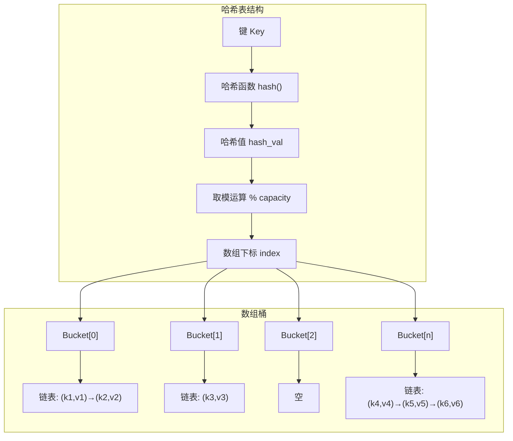
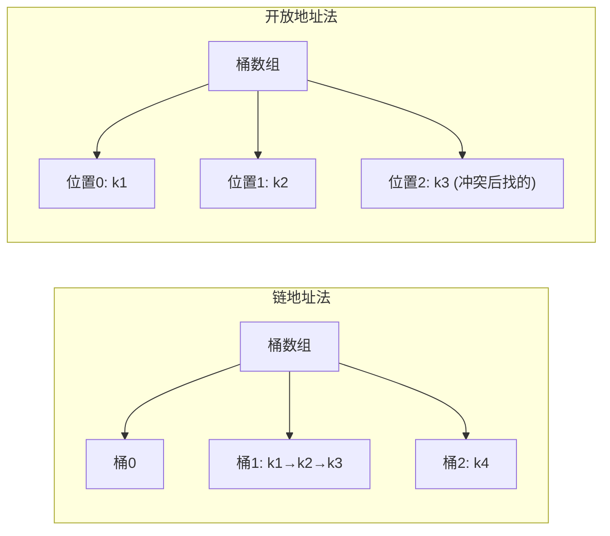
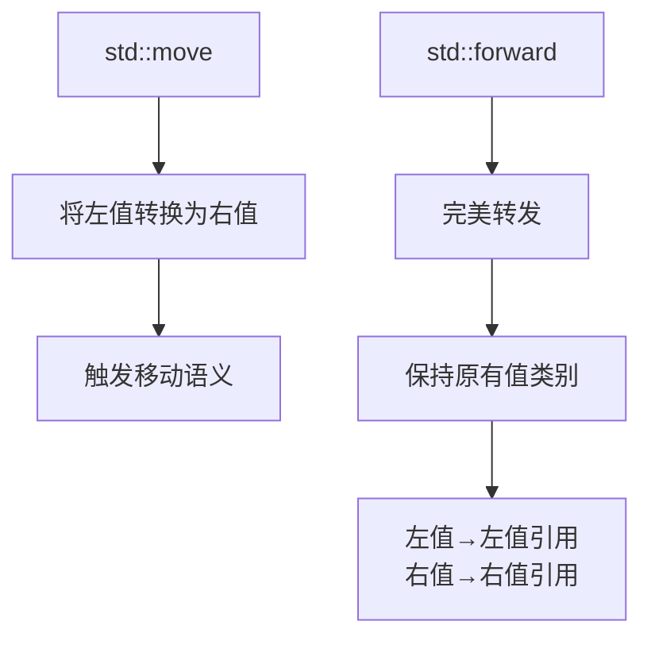
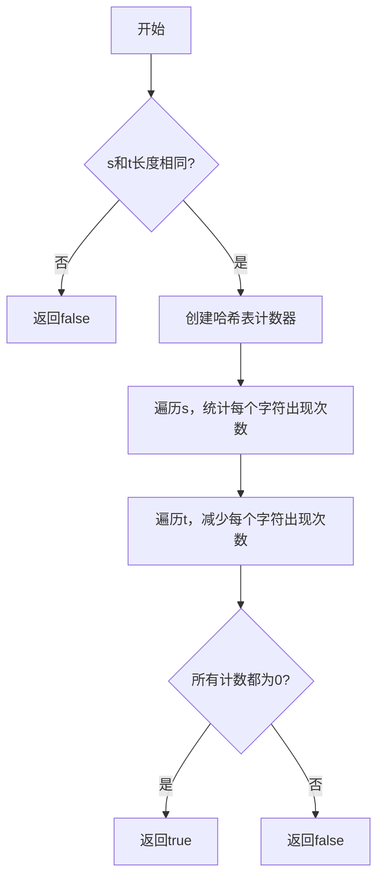
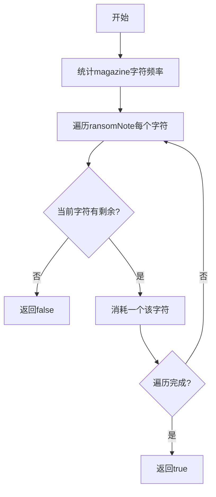

# Day 22：哈希表入门

## 📅 学习目标

- [ ] 理解哈希表的基本原理和核心概念
- [ ] 掌握哈希函数和冲突解决策略
- [ ] 学会使用C++中的unordered_map和unordered_set
- [ ] 理解右值引用的概念和移动语义基础
- [ ] 掌握using类型别名的现代写法
- [ ] 完成LeetCode 242、383

---

## 📖 知识点一：哈希表数据结构

### 概念定义

**哈希表(Hash Table)**，也称为散列表，是一种基于键值对(Key-Value Pair)的数据结构，它通过哈希函数将键映射到数组中的某个位置，从而实现快速的插入、删除和查找操作。哈希表的核心思想是"用空间换时间"，通过额外的存储空间来换取平均O(1)时间复杂度的查找效率。

### 专业介绍

哈希表是计算机科学中最重要的数据结构之一，其核心机制包括以下几个关键组成部分：

**哈希函数(Hash Function)**：哈希函数是哈希表的核心，它将任意大小的输入数据映射为固定大小的输出（哈希值）。一个好的哈希函数应该满足：计算高效、分布均匀、确定性（相同输入产生相同输出）。常见的哈希函数包括除留余数法、乘法哈希、加密哈希等。

**哈希冲突(Hash Collision)**：由于哈希函数的输出空间有限，而输入空间可能无限，因此必然存在不同的键映射到同一位置的情况，这称为哈希冲突。解决冲突是哈希表设计的核心问题之一，主要有链地址法(Separate Chaining)和开放地址法(Open Addressing)两种策略。

**负载因子(Load Factor)**：负载因子定义为元素数量除以哈希表容量，它反映了哈希表的填充程度。当负载因子超过阈值时，通常需要进行再哈希(Rehashing)，即扩容并重新分配所有元素，以保持操作的高效性。

**时间复杂度**：在理想情况下，哈希表的插入、删除、查找操作的平均时间复杂度都是O(1)。最坏情况下（所有键都冲突），这些操作的时间复杂度退化为O(n)，但通过良好的哈希函数设计和适当的负载因子控制，这种情况极少发生。

### 形象化理解

想象一个**超级智能的图书馆**：

```
传统图书馆（数组/链表）：
  书架按顺序排列，找书需要一本本翻
  《算法导论》 → 从第1架翻到第50架 → 找到了！
  
智能图书馆（哈希表）：
  书名 → 神奇公式计算 → 书架编号
  《算法导论》 → hash("算法导论") = 42 → 第42架 → 拿到！
```

**生活中的哈希表例子**：

- **电话簿**：人名→电话号码，通过姓名快速查找
- **图书馆索引**：书名→位置编号，快速定位书籍
- **仓库管理**：货号→货架位置，提高拣货效率
- **车位管理**：车牌号→车位编号，快速停车取车

### 哈希表内部结构



### 哈希冲突解决策略



| 方法 | 描述 | 优点 | 缺点 |
|------|------|------|------|
| 链地址法 | 每个桶维护一个链表 | 实现简单，删除方便 | 需要额外空间存储指针 |
| 开放地址法 | 冲突时找下一个空位 | 空间利用率高 | 聚集问题，删除复杂 |
| 再哈希法 | 使用多个哈希函数 | 减少冲突 | 计算开销增加 |

### C++中的哈希容器

```cpp
#include <unordered_map>
#include <unordered_set>

// unordered_map: 键值对哈希表
std::unordered_map<std::string, int> scores;
scores["Alice"] = 95;           // 插入
scores.insert({"Bob", 87});     // 插入
scores["Alice"] = 100;          // 修改
int score = scores["Alice"];     // 查找: 100
scores.erase("Bob");            // 删除

// unordered_set: 唯一元素集合
std::unordered_set<int> nums;
nums.insert(1);
nums.insert(2);
nums.insert(1);  // 重复元素不会插入
bool found = nums.count(1);     // 查找: 1

// 遍历
for (const auto& [key, value] : scores) {
    std::cout << key << ": " << value << std::endl;
}
```

---

## 📖 知识点二：右值引用

### 概念定义

**右值引用(Rvalue Reference)** 是C++11引入的新特性，它允许我们引用那些即将被销毁的临时对象（右值）。右值引用使用`&&`语法声明，是实现移动语义和完美转发的基础，能够显著提升程序的性能，特别是在处理资源管理类对象时。

### 专业介绍

要理解右值引用，首先需要区分左值和右值：

**左值(Lvalue)**：具有持久地址的表达式，可以出现在赋值号的左边。左值代表一个持久的对象，有名字，可以取地址。例如：变量、解引用表达式、前置递增/递减表达式等。

**右值(Rvalue)**：不具有持久地址的表达式，通常代表临时对象或字面值。右值只能出现在赋值号的右边，不能取地址。例如：字面值、后置递增/递减表达式、算术表达式的结果、函数返回的临时对象等。

**右值引用的特点**：
1. 延长了临时对象的生命周期：通过右值引用绑定的临时对象，其生命周期会延长到与引用相同。
2. 支持移动语义：允许资源从临时对象"窃取"而非复制，大大提高了性能。
3. 实现完美转发：配合std::forward，可以实现参数的完美转发。

**左值引用 vs 右值引用**：

```cpp
int x = 10;          // x是左值，10是右值
int& lr = x;         // 左值引用绑定左值
int&& rr = 10;       // 右值引用绑定右值
int&& rr2 = x + 5;   // 右值引用绑定临时对象
// int& lr2 = 10;    // 错误：左值引用不能绑定右值
// int&& rr3 = x;    // 错误：右值引用不能绑定左值
```

### 形象化理解

把对象看作"房产"，把资源看作"房屋"：

```
复制语义（深拷贝）：
  原房主 A → 盖新房子 → 新房主 B
  资源被复制，消耗大量时间和空间
  
移动语义（转移所有权）：
  原房主 A → 房产过户 → 新房主 B
  A 搬走，B 直接入住，零成本！
  
右值引用就像"临时居住证"：
  它告诉我们："这个房子马上要拆了，
   你可以把里面的东西搬走，不用盖新房！"
```

### 代码示例

```cpp
#include <iostream>
#include <utility>
#include <string>
#include <vector>

// 移动构造函数示例
class MyString {
private:
    char* data;
    size_t size;
    
public:
    // 构造函数
    MyString(const char* str = "") {
        size = strlen(str);
        data = new char[size + 1];
        strcpy(data, str);
        std::cout << "构造: " << data << std::endl;
    }
    
    // 析构函数
    ~MyString() {
        if (data) {
            std::cout << "析构: " << data << std::endl;
            delete[] data;
        }
    }
    
    // 拷贝构造函数（左值引用）
    MyString(const MyString& other) {
        size = other.size;
        data = new char[size + 1];
        strcpy(data, other.data);
        std::cout << "拷贝构造: " << data << std::endl;
    }
    
    // 移动构造函数（右值引用）
    MyString(MyString&& other) noexcept {
        // 直接"窃取"资源
        data = other.data;
        size = other.size;
        other.data = nullptr;  // 置空，防止重复释放
        other.size = 0;
        std::cout << "移动构造: " << data << std::endl;
    }
    
    const char* c_str() const { return data; }
};

// 返回临时对象
MyString createString() {
    MyString temp("Hello World");
    return temp;  // 返回值优化或移动语义
}

int main() {
    std::cout << "=== 左值与右值 ===" << std::endl;
    
    int x = 10;           // x是左值，10是右值
    int& lr = x;          // 左值引用
    int&& rr = 20;        // 右值引用
    int&& rr2 = x + 5;    // 右值引用绑定临时对象
    
    std::cout << "左值引用: " << lr << std::endl;
    std::cout << "右值引用: " << rr << std::endl;
    std::cout << "右值引用: " << rr2 << std::endl;
    
    std::cout << "\n=== 移动语义 ===" << std::endl;
    
    MyString s1("Original");
    MyString s2 = s1;              // 调用拷贝构造
    MyString s3 = std::move(s1);   // 调用移动构造
    
    std::cout << "\n=== std::move ===" << std::endl;
    std::vector<int> v1 = {1, 2, 3, 4, 5};
    std::vector<int> v2 = std::move(v1);  // 移动vector
    
    std::cout << "v1 size: " << v1.size() << std::endl;  // 0
    std::cout << "v2 size: " << v2.size() << std::endl;  // 5
    
    return 0;
}
```

### std::move 和 std::forward



---

## 📖 知识点三：EMC++ Item 9 - 类型别名

### 概念定义

**类型别名(Type Alias)** 是给已有类型起一个新名字的方式，C++11引入了`using`关键字作为`typedef`的现代替代方案。`using`语法更加清晰，支持模板别名，是更推荐使用的类型别名定义方式。

### 为什么优先使用using

**1. 语法更直观**

```cpp
// typedef 的语法：新名字在后面
typedef int (*FuncPtr)(int, int);      // 函数指针
typedef std::map<std::string, std::vector<int>> StringToInts;

// using 的语法：新名字在前面（更自然）
using FuncPtr = int(*)(int, int);       // 函数指针
using StringToInts = std::map<std::string, std::vector<int>>;
```

**2. 支持模板别名**

这是`using`最重要的优势，`typedef`不支持模板别名：

```cpp
// using 支持模板别名
template<typename T>
using Vec = std::vector<T>;

Vec<int> v1;           // std::vector<int>
Vec<std::string> v2;   // std::vector<std::string>

// typedef 无法实现模板别名！
// template<typename T>
// typedef std::vector<T> Vec;  // 编译错误！
```

**3. 可读性更好**

对于复杂的类型声明，`using`的"赋值"形式更容易理解：

```cpp
// typedef - 名字藏在类型中间
typedef void (*SignalHandler)(int);

// using - 名字清晰可见
using SignalHandler = void (*)(int);
```

### 代码示例

```cpp
#include <iostream>
#include <vector>
#include <map>
#include <memory>
#include <functional>

int main() {
    std::cout << "=== 类型别名对比 ===" << std::endl;
    
    // 1. 基本类型别名
    typedef int TInt;           // 旧式写法
    using ULong = unsigned long; // 新式写法
    
    TInt a = 10;
    ULong b = 20UL;
    std::cout << "TInt a = " << a << std::endl;
    std::cout << "ULong b = " << b << std::endl;
    
    // 2. 指针类型别名
    typedef int* TIntPtr;
    using IntPtr = int*;
    
    int x = 100;
    TIntPtr p1 = &x;
    IntPtr p2 = &x;
    std::cout << "*p1 = " << *p1 << ", *p2 = " << *p2 << std::endl;
    
    // 3. 函数指针类型别名
    typedef int (*OldFuncPtr)(int, int);
    using NewFuncPtr = int (*)(int, int);
    
    auto add = [](int a, int b) { return a + b; };
    OldFuncPtr f1 = add;
    NewFuncPtr f2 = add;
    std::cout << "f1(3,4) = " << f1(3, 4) << std::endl;
    std::cout << "f2(3,4) = " << f2(3, 4) << std::endl;
    
    // 4. 模板别名（using独有优势）
    template<typename T>
    using Vec = std::vector<T>;
    
    template<typename K, typename V>
    using Map = std::map<K, V>;
    
    Vec<int> numbers = {1, 2, 3, 4, 5};
    Map<std::string, int> scores = {{"Alice", 95}, {"Bob", 87}};
    
    std::cout << "numbers: ";
    for (int n : numbers) std::cout << n << " ";
    std::cout << std::endl;
    
    // 5. 智能指针别名
    template<typename T>
    using Ptr = std::shared_ptr<T>;
    
    Ptr<int> smartPtr = std::make_shared<int>(42);
    std::cout << "*smartPtr = " << *smartPtr << std::endl;
    
    // 6. 固定大小的数组别名
    template<typename T, size_t N>
    using Array = T[N];
    
    Array<int, 5> arr = {1, 2, 3, 4, 5};
    std::cout << "arr[0] = " << arr[0] << std::endl;
    
    return 0;
}
```

### 最佳实践

| 场景 | 推荐做法 |
|------|---------|
| 新代码 | 统一使用`using` |
| 模板别名 | 必须使用`using` |
| 函数指针 | `using`更清晰 |
| 标准库容器 | `using StringVector = std::vector<std::string>;` |

---

## 🎯 LeetCode 刷题

### 讲解题：LC 242. 有效的字母异位词

#### 题目链接

[LeetCode 242](https://leetcode.cn/problems/valid-anagram/)

#### 题目描述

给定两个字符串 `s` 和 `t`，编写一个函数来判断 `t` 是否是 `s` 的字母异位词。

**字母异位词**：两个字符串包含相同的字母，但顺序可能不同。

#### 形象化理解

想象两个"字母积木堆"：

```
字符串 s = "anagram"
字符串 t = "nagaram"

把两个字符串的字母打乱重排：
s → {a:3, n:1, g:1, r:1, m:1}
t → {a:3, n:1, g:1, r:1, m:1}

两个积木堆完全一样？ → 是字母异位词！
```

**生活类比**：
- 两袋积木，每袋的积木块数完全相同
- 两副扑克牌，每副牌的花色点数完全相同
- 两份食谱，所需的食材数量完全相同

#### 理论介绍

这道题的核心是**统计字符频率**。字母异位词的本质是：两个字符串中每个字符出现的次数完全相同。

哈希表是解决这类问题的利器，因为它可以：
1. 以字符为键，快速查找和更新计数
2. O(1)时间复杂度完成插入和查询

#### 解题思路



**方法一：哈希表计数**
- 使用unordered_map统计每个字符出现次数
- 时间复杂度：O(n)
- 空间复杂度：O(k)，k为字符集大小

**方法二：数组计数（更优）**
- 由于只有26个小写字母，可以用长度26的数组
- 时间复杂度：O(n)
- 空间复杂度：O(1)

#### 代码实现

```cpp
#include <iostream>
#include <string>
#include <unordered_map>
#include <vector>
using namespace std;

// 方法一：哈希表
bool isAnagram_hash(string s, string t) {
    if (s.length() != t.length()) return false;
    
    unordered_map<char, int> count;
    
    // 统计s中每个字符的出现次数
    for (char c : s) {
        count[c]++;
    }
    
    // 减去t中每个字符的出现次数
    for (char c : t) {
        count[c]--;
        if (count[c] < 0) return false;
    }
    
    return true;
}

// 方法二：数组（最优解）
bool isAnagram_array(string s, string t) {
    if (s.length() != t.length()) return false;
    
    int count[26] = {0};
    
    // 一次遍历完成统计
    for (size_t i = 0; i < s.length(); ++i) {
        count[s[i] - 'a']++;  // s中的字符加
        count[t[i] - 'a']--;  // t中的字符减
    }
    
    // 检查是否都为0
    for (int c : count) {
        if (c != 0) return false;
    }
    
    return true;
}

int main() {
    string s1 = "anagram", t1 = "nagaram";
    string s2 = "rat", t2 = "car";
    
    cout << "方法一（哈希表）：" << endl;
    cout << s1 << " vs " << t1 << ": " 
         << (isAnagram_hash(s1, t1) ? "true" : "false") << endl;
    cout << s2 << " vs " << t2 << ": " 
         << (isAnagram_hash(s2, t2) ? "true" : "false") << endl;
    
    cout << "\n方法二（数组）：" << endl;
    cout << s1 << " vs " << t1 << ": " 
         << (isAnagram_array(s1, t1) ? "true" : "false") << endl;
    cout << s2 << " vs " << t2 << ": " 
         << (isAnagram_array(s2, t2) ? "true" : "false") << endl;
    
    return 0;
}
```

---

### 实战题：LC 383. 赎金信

#### 题目链接

[LeetCode 383](https://leetcode.cn/problems/ransom-note/)

#### 提示

1. 这题与242题非常相似，都是字符计数问题
2. 区别：ransomNote中的字符数不能超过magazine中对应字符数
3. 使用哈希表或数组统计字符频率

#### 题目描述

给定一个赎金信字符串 `ransomNote` 和一个杂志字符串 `magazine`，判断 `ransomNote` 能否由 `magazine` 中的字符构成。

每个字符在 `magazine` 中只能使用一次。

#### 形象化理解

想象一个"拼字游戏"：

```
赎金信: "aabb"
杂志:   "aabbc"

从杂志中取字母拼赎金信：
  杂志: {a:2, b:2, c:1}
  需要: {a:2, b:2}
  
检查：每个字母的需求数 ≤ 杂志中的数量
  a: 2 ≤ 2 ✓
  b: 2 ≤ 2 ✓
  
结果：可以拼出赎金信！
```

**生活类比**：
- 你有一盒字母饼干，想拼出一句话
- 每种字母饼干的数量有限，够不够用？
- 就像超市购物清单，每种商品的数量是否充足

#### 理论介绍

这是典型的**集合包含问题**，本质是检查一个多重集合是否是另一个多重集合的子集。

哈希表解决这类问题的思路：
1. 先统计"供应方"（magazine）的字符数量
2. 再检查"需求方"（ransomNote）的需求能否被满足

#### 解题思路



#### 代码实现

```cpp
#include <iostream>
#include <string>
#include <unordered_map>
using namespace std;

// 方法一：哈希表
bool canConstruct_hash(string ransomNote, string magazine) {
    unordered_map<char, int> count;
    
    // 统计magazine中每个字符的数量
    for (char c : magazine) {
        count[c]++;
    }
    
    // 检查ransomNote能否被满足
    for (char c : ransomNote) {
        if (count[c] <= 0) return false;
        count[c]--;
    }
    
    return true;
}

// 方法二：数组（最优解）
bool canConstruct_array(string ransomNote, string magazine) {
    int count[26] = {0};
    
    // 统计magazine
    for (char c : magazine) {
        count[c - 'a']++;
    }
    
    // 检查ransomNote
    for (char c : ransomNote) {
        if (count[c - 'a'] <= 0) return false;
        count[c - 'a']--;
    }
    
    return true;
}

int main() {
    cout << "测试用例1: " << endl;
    cout << "ransomNote = \"a\", magazine = \"b\"" << endl;
    cout << "结果: " << (canConstruct_array("a", "b") ? "true" : "false") << endl;
    
    cout << "\n测试用例2: " << endl;
    cout << "ransomNote = \"aa\", magazine = \"ab\"" << endl;
    cout << "结果: " << (canConstruct_array("aa", "ab") ? "true" : "false") << endl;
    
    cout << "\n测试用例3: " << endl;
    cout << "ransomNote = \"aa\", magazine = \"aab\"" << endl;
    cout << "结果: " << (canConstruct_array("aa", "aab") ? "true" : "false") << endl;
    
    return 0;
}
```

---

## 🚀 运行代码

```bash
./build_and_run.sh
```

---

## 📚 相关术语

| 术语 | 英文 | 定义 |
|------|------|------|
| 哈希表 | Hash Table | 基于键值对的数据结构 |
| 哈希函数 | Hash Function | 将键映射到数组索引的函数 |
| 哈希冲突 | Hash Collision | 不同键映射到相同位置 |
| 负载因子 | Load Factor | 元素数量/表容量 |
| 右值引用 | Rvalue Reference | 引用临时对象的引用类型 |
| 移动语义 | Move Semantics | 转移资源所有权而非复制 |
| 类型别名 | Type Alias | 给类型起一个新名字 |

---

## 💡 学习提示

### 哈希表的适用场景

当你遇到以下问题时，优先考虑哈希表：

1. **快速查找**：需要O(1)时间查找元素
2. **去重**：判断元素是否重复出现
3. **计数统计**：统计元素出现次数
4. **两数之和**：找满足条件的配对

### 哈希表的时间复杂度

| 操作 | 平均 | 最坏 |
|------|------|------|
| 查找 | O(1) | O(n) |
| 插入 | O(1) | O(n) |
| 删除 | O(1) | O(n) |

### 右值引用的使用场景

1. **移动构造函数**：避免深拷贝
2. **移动赋值运算符**：高效资源转移
3. **std::move**：显式转换为右值
4. **std::forward**：完美转发

### 明日预告

Day 23 将学习：
- 哈希表的深入应用
- 移动构造和移动赋值
- EMC++ Item 10-11
- 更多哈希表相关的LeetCode题目

---

## 🔗 参考资料

1. [Hello-Algo - 哈希表](https://www.hello-algo.com/chapter_hashing/)
2. [cppreference - unordered_map](https://en.cppreference.com/w/cpp/container/unordered_map)
3. [cppreference - unordered_set](https://en.cppreference.com/w/cpp/container/unordered_set)
4. [cppreference - Rvalue Reference](https://en.cppreference.com/w/cpp/language/reference)
5. [Effective Modern C++ - Item 9](https://www.aristeia.com/EMC++.html)
