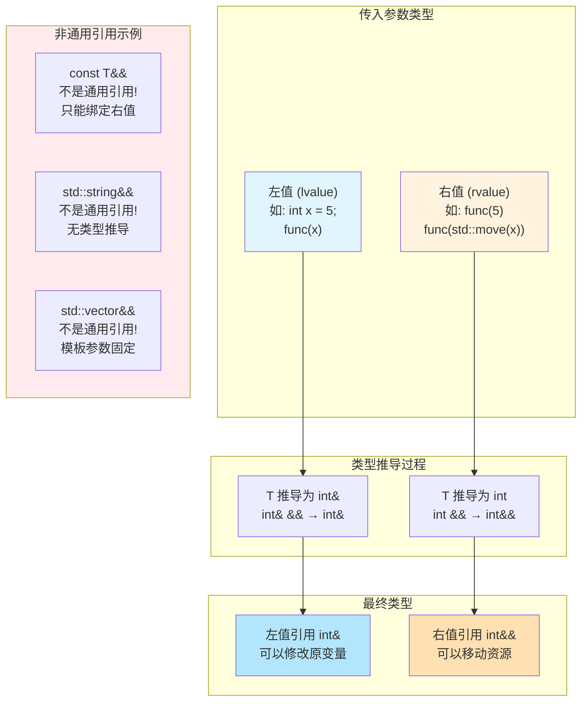
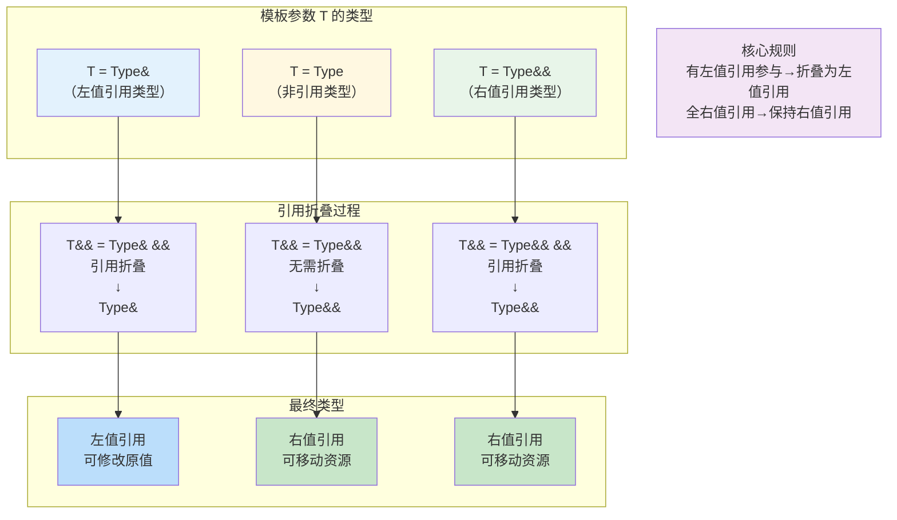
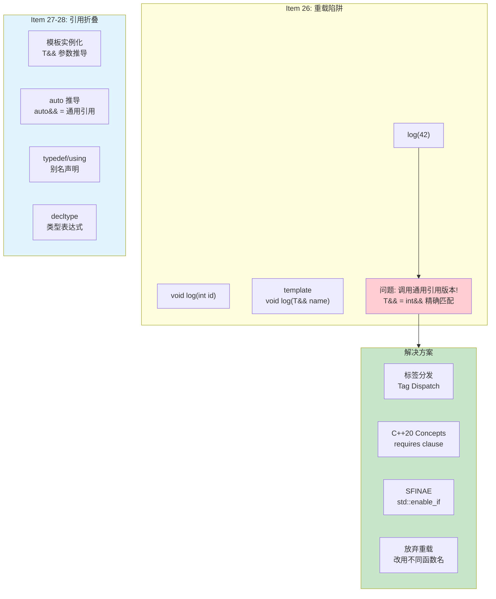
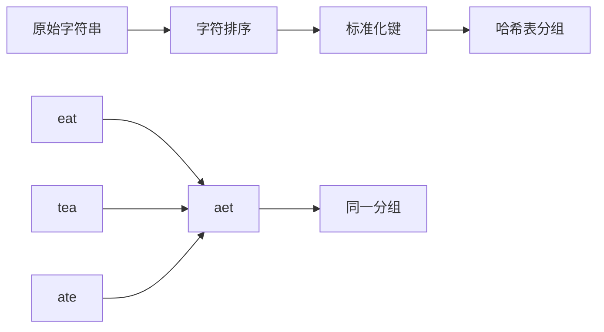
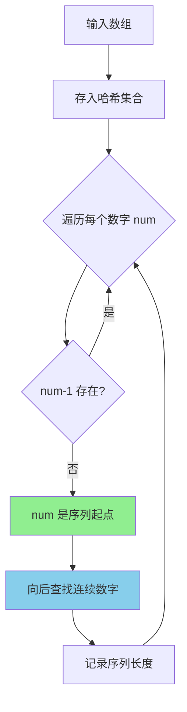

# Day 24: 通用引用 (Universal Reference)

> 📅 **学习进度**: 第 24 天 | 🎯 **难度**: ⭐⭐⭐⭐ | ⏱️ **预计时间**: 3-4小时

---

## 📅 学习目标

今天我们将深入学习 C++11 引入的核心概念——通用引用（Universal Reference），这是现代 C++ 模板编程和完美转发的基石。通过今天的学习，你将：

1. **理解通用引用的本质**：掌握 `T&&` 的两种不同含义，区分右值引用和通用引用
2. **掌握引用折叠规则**：理解模板实例化过程中引用类型的推导机制
3. **学会避免常见陷阱**：了解为什么不应该在通用引用上进行重载
4. **实践完美转发**：使用 `std::forward` 实现参数的完美传递
5. **刷题巩固基础**：通过 LeetCode 49 和 128 题练习哈希表与集合的应用

通用引用是 Scott Meyers 在《Effective Modern C++》中提出的术语，也被称为转发引用（Forwarding Reference）。它是 C++ 模板元编程的重要工具，掌握它对于理解现代 C++ 的移动语义和完美转发至关重要。今天的学习将为后续理解智能指针、并发编程等高级主题打下坚实基础。

---

## 📖 知识点一：通用引用 (Universal Reference)

### 🎯 概念定义

**通用引用（Universal Reference）** 是一种特殊的引用类型，它能够根据初始化表达式的值类别（value category）自动推导为左值引用或右值引用。通用引用必须满足两个条件：

1. **类型推导必须发生**：模板参数 `T` 必须参与类型推导
2. **必须是精确的 `T&&` 形式**：不能有任何 const、volatile 等修饰符

### 📚 专业介绍

在 C++ 类型系统中，`T&&` 的含义取决于上下文。当 `T&&` 出现在模板函数参数中且 `T` 是被推导的类型时，它就是一个通用引用。通用引用的核心机制基于**引用折叠规则**，这是 C++ 为了支持完美转发而引入的特殊规则。

```cpp
template<typename T>
void func(T&& arg);  // T&& 是通用引用，因为 T 的类型会被推导
```

当传入左值时，编译器会将 `T` 推导为 `T&`（左值引用），通过引用折叠最终得到 `T& && → T&`。当传入右值时，`T` 被推导为 `T`（非引用类型），最终得到 `T&&`。这种机制使得同一个函数模板能够同时处理左值和右值，为完美转发提供了基础。

### 💡 通俗解释

想象你是一个快递员，面前有两种包裹：
- **左值包裹**：有固定地址的房子，比如"人民路 123 号"，你随时可以回去取件
- **右值包裹**：临时摊位，比如"今天在公园门口摆摊"，明天就不在了

普通右值引用 `SomeType&&` 就像是专门接收"临时摊位"包裹的规定。但通用引用 `T&&` 更灵活——它就像一个智能快递员：
- 如果客户说"送到人民路 123 号"（左值），它会创建一个指向这个地址的链接
- 如果客户说"把这个刚买的包裹转交给你"（右值），它会直接接收包裹的所有权

**核心规则**：
```cpp
// 这是通用引用 - 能接收任何东西
template<typename T>
void smartForward(T&& item);  // 智能快递员

// 这是右值引用 - 只接收临时物品
void takeRightRef(std::string&& temp);  // 只接收"临时摊位"的包裹
```

### 📊 Mermaid 图示



### 💻 代码示例

```cpp
// ==================== 通用引用示例 ====================
#include <iostream>
#include <string>
#include <utility>
#include <type_traits>

// 通用引用：T&& 配合类型推导
template<typename T>
void universalRefDemo(T&& arg) {
    // 判断 arg 的实际类型
    if constexpr (std::is_lvalue_reference_v<T>) {
        std::cout << "左值引用版本: " << arg << std::endl;
    } else {
        std::cout << "右值引用版本: " << arg << std::endl;
    }
    
    // 使用 std::forward 保持原有值类别
    // process(std::forward<T>(arg));
}

// 非通用引用：类型固定，不是模板推导
void notUniversalRef(std::string&& arg) {
    std::cout << "只能接收右值: " << arg << std::endl;
}

// 非通用引用：有 const 修饰
template<typename T>
void alsoNotUniversal(const T&& arg) {
    std::cout << "const T&& 不是通用引用: " << arg << std::endl;
}

int main() {
    std::string leftVal = "Hello";
    
    std::cout << "=== 通用引用演示 ===" << std::endl;
    
    // 传入左值 → T 推导为 std::string&
    universalRefDemo(leftVal);  
    
    // 传入右值 → T 推导为 std::string
    universalRefDemo("World");  
    
    // 传入 std::move 的结果 → 右值
    universalRefDemo(std::move(leftVal));
    
    std::cout << "\n=== 非通用引用对比 ===" << std::endl;
    
    // notUniversalRef(leftVal);  // 编译错误！只能接收右值
    notUniversalRef("Right Value");  // OK
    
    // alsoNotUniversal(leftVal);  // 编译错误！const T&& 不是通用引用
    alsoNotUniversal(42);  // OK，可以接收右值
    
    return 0;
}
```

**输出结果**：
```
=== 通用引用演示 ===
左值引用版本: Hello
右值引用版本: World
右值引用版本: Hello

=== 非通用引用对比 ===
只能接收右值: Right Value
const T&& 不是通用引用: 42
```

---

## 📖 知识点二：引用折叠 (Reference Collapsing)

### 🎯 规则详解

**引用折叠（Reference Collapsing）** 是 C++ 编译器在处理引用的引用时所遵循的规则。由于 C++ 不允许直接定义"引用的引用"（如 `int& &`），编译器通过折叠规则将其转换为有效的类型。

**四大规则**（记住：只有两个左值引用折叠成左值引用，其他都是右值引用）：

| 组合 | 折叠结果 | 记忆口诀 |
|------|----------|----------|
| `T& &` | `T&` | 左 + 左 → 左 |
| `T& &&` | `T&` | 左 + 右 → 左 |
| `T&& &` | `T&` | 右 + 左 → 左 |
| `T&& &&` | `T&&` | 右 + 右 → 右 |

### 📚 专业介绍

引用折叠主要发生在以下四种上下文中：

1. **模板实例化**：当模板参数 `T` 是引用类型时，`T&&` 会触发引用折叠
2. **auto 类型推导**：`auto&&` 也是通用引用，会触发相同的折叠规则
3. **typedef 和 alias 声明**：使用 `using` 或 `typedef` 时可能产生引用的引用
4. **decltype 使用**：在 `decltype` 表达式中也可能出现引用折叠

引用折叠的设计初衷是为了支持**完美转发**。通过这套规则，我们可以确保：
- 传入左值时，最终得到左值引用
- 传入右值时，最终得到右值引用
- 保持原始值类别不被丢失

### 💡 通俗解释

想象你在玩俄罗斯套娃游戏，每个"引用"就是一层套娃。规则很简单：

- **左值引用是"强力胶"**：只要有一层是左值引用（`&`），最终结果就会被"粘"成左值引用
- **右值引用是"透明纸"**：只有全部都是右值引用（`&&`），才能保持透明

```
胶水规则：
  胶水 + 透明 = 胶水（左值引用"传染"）
  透明 + 胶水 = 胶水
  胶水 + 胶水 = 胶水
  透明 + 透明 = 透明（只有这个例外）
```

**实际应用**：
```cpp
template<typename T>
void wrapper(T&& arg) {
    // 当 arg 是左值时：T = int&, T&& = int& && → int&
    // 当 arg 是右值时：T = int,  T&& = int&&
}
```

### 📊 Mermaid 图示



### 💻 代码示例

```cpp
// ==================== 引用折叠示例 ====================
#include <iostream>
#include <type_traits>
#include <string>

// 辅助函数：打印类型信息
template<typename T>
void printType(const std::string& name) {
    std::cout << name << ":\n";
    std::cout << "  is_lvalue_reference: " << std::is_lvalue_reference_v<T> << "\n";
    std::cout << "  is_rvalue_reference: " << std::is_rvalue_reference_v<T> << "\n";
    std::cout << "  is_reference: " << std::is_reference_v<T> << "\n\n";
}

// 演示引用折叠的模板函数
template<typename T>
void demonstrateFolding(T&& arg) {
    using ParamType = T&&;  // 这里的 T&& 会发生引用折叠
    
    std::cout << "=== 引用折叠演示 ===\n";
    
    // 打印 T 的类型
    printType<T>("模板参数 T");
    
    // 打印 T&& 的类型
    printType<ParamType>("参数类型 T&&");
}

// 使用 using 别名演示引用折叠
void aliasCollapseDemo() {
    std::cout << "\n=== using 别名中的引用折叠 ===\n";
    
    using IntRef = int&;
    using IntRRef = int&&;
    
    // 这些都会发生引用折叠
    using Type1 = IntRef&;     // int& & → int&
    using Type2 = IntRef&&;    // int& && → int&
    using Type3 = IntRRef&;    // int&& & → int&
    using Type4 = IntRRef&&;   // int&& && → int&&
    
    printType<Type1>("IntRef&");
    printType<Type2>("IntRef&&");
    printType<Type3>("IntRRef&");
    printType<Type4>("IntRRef&&");
}

int main() {
    int x = 42;
    int& lr = x;
    int&& rr = 100;
    
    std::cout << "传左值:\n";
    demonstrateFolding(x);
    
    std::cout << "传左值引用:\n";
    demonstrateFolding(lr);
    
    std::cout << "传右值:\n";
    demonstrateFolding(100);
    
    std::cout << "传 std::move 结果:\n";
    demonstrateFolding(std::move(x));
    
    aliasCollapseDemo();
    
    return 0;
}
```

---

## 📖 知识点三：EMC++ Item 26-28

### 📚 Item 26: 避免在通用引用上重载

#### 🎯 问题背景

当函数重载涉及通用引用时，会产生意想不到的行为。通用引用是"贪婪"的——它能匹配几乎任何类型的参数，包括那些本意是传给其他重载版本的参数。

#### 📖 专业分析

考虑一个典型的工厂函数 `makeWidget`：

```cpp
// 重载 1：接受整数参数
Widget makeWidget(int id);

// 重载 2：通用引用版本
template<typename T>
Widget makeWidget(T&& arg);
```

当调用 `makeWidget(42)` 时，通用引用版本会被优先选择！因为：
1. `T&&` 能精确匹配 `int`（推导为 `int&&`）
2. `int` 版本需要精确匹配
3. 精确匹配优于类型转换，但通用引用的精确匹配"更精确"

**常见问题场景**：
- 拷贝构造函数被劫持
- 重载决议产生意外结果
- 代码可维护性下降

#### 💡 解决方案

1. **放弃重载**：改用不同的函数名
2. **传递 const T&**：放弃通用引用的性能优势
3. **传值**：当拷贝成本低时
4. **使用标签分发（Tag Dispatch）**
5. **约束通用引用模板（SFINAE/C++20 Concepts）**

### 📚 Item 27: 理解引用折叠规则

#### 🎯 核心要点

引用折叠是实现完美转发的技术基础。理解这套规则对于正确使用 `std::forward` 至关重要。

**记住规则**：任何包含左值引用的组合都会折叠为左值引用。

#### 📖 实践意义

```cpp
template<typename T>
void forwarder(T&& arg) {
    // std::forward 利用引用折叠
    // 当 arg 是左值时，返回左值引用
    // 当 arg 是右值时，返回右值引用
    target(std::forward<T>(arg));
}
```

`std::forward<T>(arg)` 的实现原理：
- 如果 `T` 是 `Type&`：返回 `Type&`
- 如果 `T` 是 `Type`：返回 `Type&&`

### 📚 Item 28: 理解引用折叠的上下文

#### 🎯 四大上下文

1. **模板实例化**
2. **auto 类型推导**
3. **typedef/using 别名声明**
4. **decltype 表达式**

#### 📊 Mermaid 图示



### 💻 代码示例

详细代码请参见 `code/emcpp/` 目录下的：
- `item26_avoid_overloading.cpp` - 重载陷阱与解决方案
- `item27_folding_rules.cpp` - 引用折叠规则演示
- `item28_perfect_forward.cpp` - 完美转发实现

---

## 🎯 LeetCode 刷题

### 📖 讲解题：LC 49 字母异位词分组

#### 📋 题目简介

**题目描述**：给定一个字符串数组，将字母异位词分组在一起。字母异位词是由相同字母重新排列形成的字符串。

**示例**：
```
输入: strs = ["eat", "tea", "tan", "ate", "nat", "bat"]
输出: [["bat"], ["nat", "tan"], ["ate", "eat", "tea"]]
```

#### 🎯 形象化提示

想象你是一个图书管理员，需要把所有"用相同字母拼成"的书分到同一个书架上：

```
书架管理：
┌─────────────────────────────────────────┐
│  书架 A (key: "aet")                     │
│  ├── "eat" (吃)                          │
│  ├── "tea" (茶)                          │
│  └── "ate" (ate动词过去式)               │
├─────────────────────────────────────────┤
│  书架 B (key: "ant")                     │
│  ├── "tan" (晒黑)                        │
│  └── "nat" (国家)                        │
├─────────────────────────────────────────┤
│  书架 C (key: "abt")                     │
│  └── "bat" (蝙蝠)                        │
└─────────────────────────────────────────┘

秘诀：把每个单词的字母排序后作为"书架标签"
"eat" → 排序 → "aet" → 找到标签为 "aet" 的书架
"tea" → 排序 → "aet" → 找到标签为 "aet" 的书架（同一个！）
```

#### 📚 相关理论介绍

**哈希表 (Hash Table)** 是本题的核心数据结构：

- **哈希函数**：将字符串（排序后的字母）映射到固定索引
- **键值对存储**：键是排序后的字符串，值是原字符串列表
- **平均 O(1) 查找**：快速判断属于哪个分组

**时间复杂度分析**：
- 外层遍历：O(N)，N 为字符串数量
- 排序每个字符串：O(K log K)，K 为字符串最大长度
- 总体：O(N × K log K)

#### 🔍 解题思路

解决本题的核心思路是：**找到一种方法，让所有字母异位词映射到同一个标识**。

**方法一：排序法（推荐）**
1. 遍历每个字符串，将其字符排序后作为"标准化形式"
2. 字母异位词排序后结果相同，如 "eat"、"tea"、"ate" 都变成 "aet"
3. 用哈希表以排序后的字符串为键，存储原始字符串列表
4. 最后返回哈希表的所有值



**方法二：计数法（优化空间）**
1. 统计每个字符串中各字母出现的次数
2. 用计数结果作为键（可用长度26的字符串编码）
3. 相同字母组成的字符串计数结果相同

**为什么选择排序法？**
- 实现简单，代码量少
- 对于短字符串效率高
- C++ 的 sort 函数对小数组优化良好

#### 💻 代码实现

```cpp
class Solution {
public:
    vector<vector<string>> groupAnagrams(vector<string>& strs) {
        // 哈希表：键是排序后的字符串，值是原字符串列表
        unordered_map<string, vector<string>> groups;
        
        for (const string& s : strs) {
            // 将字符串排序作为键
            string key = s;
            sort(key.begin(), key.end());
            
            // 加入对应的分组
            groups[key].push_back(s);
        }
        
        // 收集所有分组
        vector<vector<string>> result;
        for (auto& pair : groups) {
            result.push_back(std::move(pair.second));
        }
        
        return result;
    }
};
```

---

### 🎯 实战题：LC 128 最长连续序列

#### 📋 题目简介

**题目描述**：给定一个未排序的整数数组，找出最长连续元素序列的长度。要求算法时间复杂度为 O(n)。

**示例**：
```
输入: nums = [100, 4, 200, 1, 3, 2]
输出: 4
解释: 最长连续序列是 [1, 2, 3, 4]，长度为 4
```

#### 🎯 形象化提示

想象你在整理一堆扑克牌，需要找出最长的连续数字序列：

```
扑克牌整理：
散落的牌: [100, 4, 200, 1, 3, 2]

步骤1: 把所有牌摊开（放入哈希集合）
       ┌───┬───┬───┬───┬───┬───┐
       │ 1 │ 2 │ 3 │ 4 │100│200│
       └───┴───┴───┴───┴───┴───┘

步骤2: 找"起点"（前面没有相邻数字的牌）
       - 1 是起点（集合中没有 0）
       - 100 是起点（集合中没有 99）
       - 200 是起点（集合中没有 199）

步骤3: 从起点开始"数连续"
       从 1 开始: 1→2→3→4 (长度 4) ✓ 最长！
       从 100 开始: 100 (长度 1)
       从 200 开始: 200 (长度 1)

结果: 最长连续序列长度 = 4
```

#### 📚 相关理论介绍

**哈希集合 (HashSet)** 是解决本题的关键：

- **O(1) 查找**：快速判断某个数是否存在
- **去重**：自动处理重复数字
- **空间换时间**：使用 O(N) 空间换取 O(N) 时间

**核心思想**：
1. 把所有数字放入哈希集合
2. 只从"序列起点"开始计数（num-1 不存在）
3. 向后查找连续数字

**为什么能 O(N)**：虽然有两层循环，但每个数字最多被访问两次（一次判断是否起点，一次在序列中计数）。

#### 🔍 解题思路

解决本题的关键在于：**避免对每个数字都进行完整的序列搜索，只从"起点"开始搜索**。

**核心优化思想**：
- 如果一个数字 num 的前驱 num-1 存在，那么 num 不可能是序列起点
- 只有当 num-1 不存在时，num 才可能是某个连续序列的起点
- 从起点开始向后搜索，直到序列结束

**算法步骤**：
1. **预处理**：将所有数字存入哈希集合（去重 + O(1)查找）
2. **遍历集合**：对于每个数字，判断是否为序列起点
3. **起点判断**：如果 num-1 不在集合中，说明 num 是某个序列的起点
4. **序列扩展**：从起点开始，不断查找 num+1、num+2...直到断开
5. **记录结果**：更新最大序列长度



**复杂度证明**：
- 每个数字最多被访问两次：
  - 第一次：判断是否为起点
  - 第二次：作为序列的一部分被遍历
- 因此总时间复杂度为 O(N)

**常见错误**：
- ❌ 对每个数字都进行双向扩展 → 时间复杂度退化为 O(N²)
- ❌ 先排序再找连续 → 排序本身就是 O(N log N)

#### 💻 代码实现

```cpp
class Solution {
public:
    int longestConsecutive(vector<int>& nums) {
        if (nums.empty()) return 0;
        
        // 将所有数字放入哈希集合，去重 + O(1)查找
        unordered_set<int> numSet(nums.begin(), nums.end());
        
        int maxLen = 0;
        
        for (int num : numSet) {
            // 只从序列的起点开始计数
            // 如果 num-1 存在，说明 num 不是起点，跳过
            if (numSet.find(num - 1) != numSet.end()) {
                continue;
            }
            
            // 从起点开始向后查找连续序列
            int currentLen = 1;
            int current = num;
            
            while (numSet.find(current + 1) != numSet.end()) {
                current++;
                currentLen++;
            }
            
            maxLen = max(maxLen, currentLen);
        }
        
        return maxLen;
    }
};
```

---

## 🚀 运行代码

### 编译运行

```bash
# 进入 day_24 目录
cd /home/z/my-project/download/week_04/day_24

# 添加执行权限并运行
chmod +x build_and_run.sh
./build_and_run.sh
```

### 手动编译

```bash
# 创建构建目录
mkdir -p build && cd build

# 配置 CMake
cmake ..

# 编译
make -j$(nproc)

# 运行
./day_24_demo
```

### 预期输出

```
========================================
    Day 24: 通用引用 (Universal Reference)
========================================

=== 1. 通用引用演示 ===
传入左值: T 推导为 std::string&
传入右值: T 推导为 std::string

=== 2. 引用折叠演示 ===
...
```

---

## 📚 相关术语

| 术语 | 英文 | 解释 |
|------|------|------|
| 通用引用 | Universal Reference | 能根据初始化表达式推导为左值引用或右值引用的 `T&&` |
| 转发引用 | Forwarding Reference | C++ 标准中对通用引用的正式名称 |
| 引用折叠 | Reference Collapsing | 编译器处理"引用的引用"的规则 |
| 完美转发 | Perfect Forwarding | 保持参数原有值类别的转发方式 |
| 值类别 | Value Category | C++ 中表达式的分类：左值、右值、将亡值等 |
| 类型推导 | Type Deduction | 编译器自动推断模板参数或 auto 类型的过程 |
| SFINAE | Substitution Failure Is Not An Error | 模板替换失败时不报错，用于模板元编程 |
| 标签分发 | Tag Dispatch | 使用类型标签控制函数重载选择的技术 |

---

## 💡 学习提示

### 🎯 今日重点

1. **区分右值引用和通用引用**：
   - `Type&&` 且有类型推导 → 通用引用
   - `Type&&` 且无类型推导 → 右值引用
   - `const Type&&` 或 `vector<Type>&&` → 右值引用

2. **记住引用折叠规则**：
   - 有 `&` 参与 → 结果是 `&`
   - 全 `&&` → 结果是 `&&`

3. **理解完美转发**：
   - `std::forward<T>(arg)` 配合通用引用使用
   - 保持参数原有的值类别

### ⚠️ 常见陷阱

1. **误认为所有 `T&&` 都是通用引用**
   ```cpp
   template<typename T>
   void func(std::vector<T>&& arg);  // 这不是通用引用！
   ```

2. **在通用引用上重载**
   ```cpp
   void process(int x);
   template<typename T>
   void process(T&& x);  // 危险！可能劫持其他重载
   ```

3. **忘记使用 std::forward**
   ```cpp
   template<typename T>
   void badForward(T&& arg) {
       process(arg);  // 错误！arg 本身是左值
       process(std::forward<T>(arg));  // 正确！
   }
   ```

### 📖 延伸阅读

- 《Effective Modern C++》Item 24-28
- 《C++ Templates: The Complete Guide》第2版
- C++ 标准文档 [temp.deduct.call] 关于引用折叠的描述

---

## 🔗 参考资料

1. **书籍**：
   - Scott Meyers, *Effective Modern C++*, Items 24-28
   - Nicolai M. Josuttis, *C++ Templates: The Complete Guide*, 2nd Edition

2. **在线资源**：
   - [cppreference - Template argument deduction](https://en.cppreference.com/w/cpp/language/template_argument_deduction)
   - [cppreference - Reference collapsing](https://en.cppreference.com/w/cpp/language/reference)
   - [C++ Rvalue References Explained](http://thbecker.net/articles/rvalue_references/section_01.html)

3. **视频教程**：
   - CppCon: "Type Deduction and Why You Care" by Scott Meyers
   - CppCon: "Moving Experiences with C++" by Howard Hinnant

---

> 💪 **记住**：通用引用是现代 C++ 最重要的特性之一，它是理解完美转发和移动语义的基础。掌握它，你就能写出更高效、更优雅的 C++ 代码！

*最后更新：2024年 Day 24*
