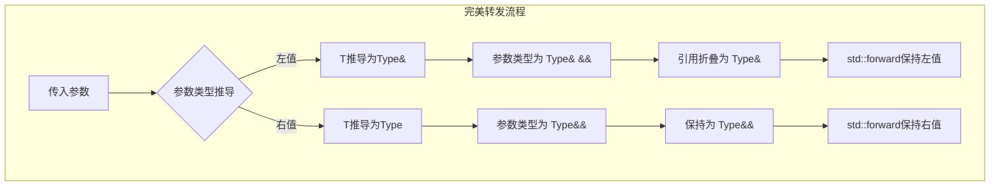
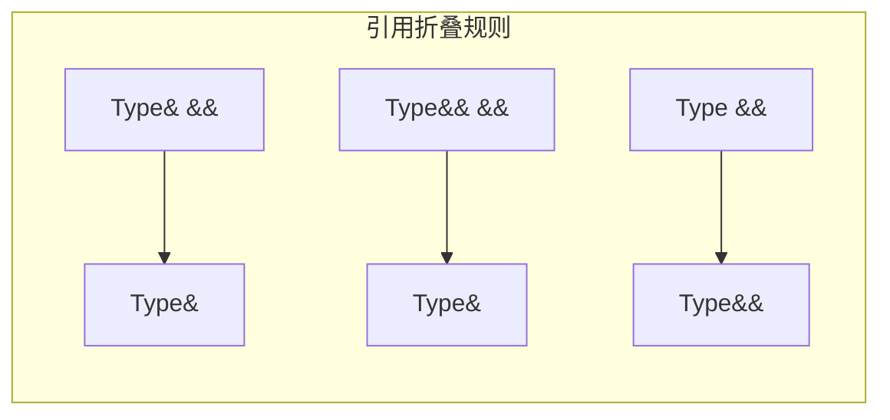
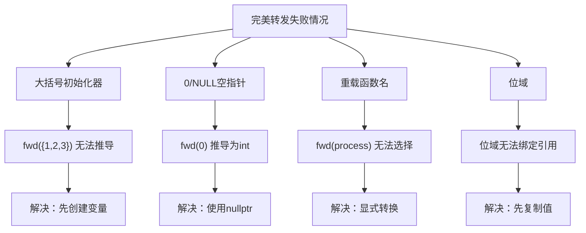
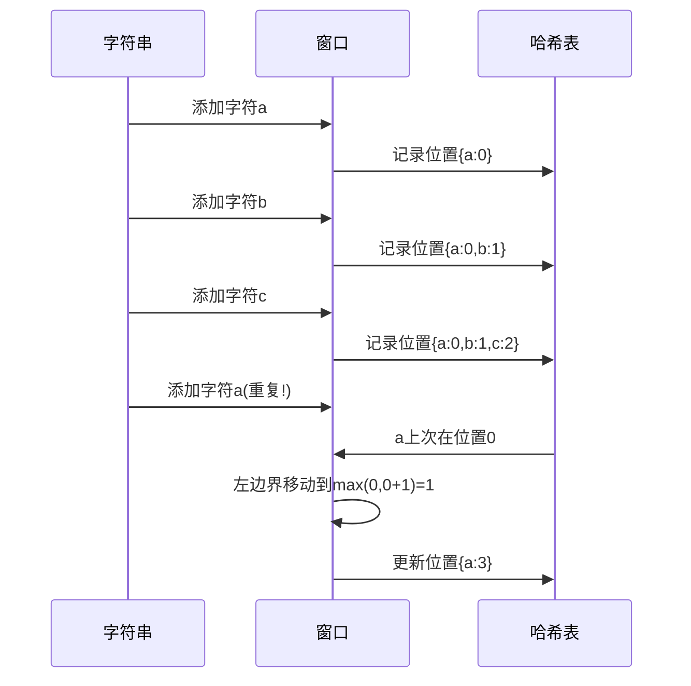
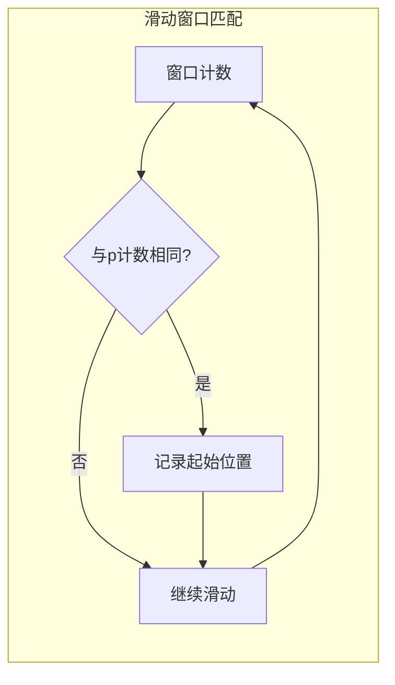

# Day 25：完美转发

## 📅 学习目标

- [ ] 理解完美转发的核心概念和设计目的
- [ ] 掌握std::forward的工作原理和使用方法
- [ ] 了解引用折叠（Reference Collapsing）规则
- [ ] 学习EMC++ Item 29-30：理解std::forward与完美转发失败案例
- [ ] 完成LeetCode 3、438两道滑动窗口题目

---

## 📖 知识点一：完美转发

### 概念定义

**完美转发（Perfect Forwarding）** 是C++11引入的重要特性，它允许函数模板将参数"完美地"转发给另一个函数，保持参数的值类别（左值/右值）和const属性不变。完美转发的核心在于：无论传入的参数是左值还是右值，转发后都能保持其原有的值类别特性，从而实现最优化的函数调用。

### 专业介绍

在C++中，函数参数的转发是一个常见需求。传统的转发方式存在一个问题：当参数传递给函数后，它就变成了左值，无论原来是什么类型。这会导致右值引用参数无法被正确地转发到其他函数，从而无法利用移动语义带来的性能优化。

完美转发通过两个机制协同工作来实现：
1. **模板参数推导**：使用`T&&`形式的万能引用（Universal Reference），能够根据传入参数自动推导类型
2. **引用折叠规则**：通过复杂的类型推导规则，保持参数的值类别信息



### 通俗解释

想象你在帮朋友传递包裹：
- **普通转发**：不管朋友给你的是"可以拆开的快递"（右值）还是"不能拆的礼盒"（左值），你都把它重新包装成一个标准的"不能拆的盒子"再转交出去。这样，原本可以拆开的快递就失去了它的特性。
- **完美转发**：你像一个透明的快递站，原封不动地保持包裹的状态。可拆的快递转交出去还是可拆的，不能拆的礼盒转交出去还是不能拆的。

```cpp
// 普通转发 - 失去了右值特性
void process(int& x);        // 左值版本
void process(int&& x);       // 右值版本

template<typename T>
void normalForward(T& param) {
    process(param);  // 永远调用左值版本！
}

// 完美转发 - 保持原有特性
template<typename T>
void perfectForward(T&& param) {
    process(std::forward<T>(param));  // 根据原类型选择正确版本
}
```

### 代码示例

```cpp
#include <iostream>
#include <utility>
#include <string>

// 目标函数：分别处理左值和右值
void process(const std::string& s) {
    std::cout << "处理左值: " << s << std::endl;
}

void process(std::string&& s) {
    std::cout << "处理右值: " << s << " (可移动)" << std::endl;
}

// 完美转发包装器
template<typename T>
void wrapper(T&& param) {
    process(std::forward<T>(param));  // 完美转发
}

int main() {
    std::string str = "Hello";
    
    wrapper(str);           // 调用左值版本
    wrapper(std::string("World"));  // 调用右值版本
    
    return 0;
}
```

---

## 📖 知识点二：std::forward详解

### 工作原理

`std::forward` 是一个条件转换工具，它的定义看起来像这样（简化版）：

```cpp
template<typename T>
T&& forward(typename std::remove_reference<T>::type& param) {
    return static_cast<T&&>(param);
}
```

当传入参数的类型信息保存在模板参数`T`中时，`std::forward<T>`会根据`T`的类型：
- 如果`T`是`Type&`（左值引用），返回`Type&`（左值）
- 如果`T`是`Type`（非引用），返回`Type&&`（右值）

### 引用折叠规则

引用折叠是完美转发的理论基础，规则如下：

| 模板参数T | T&& 实际类型 |
|----------|-------------|
| Type& | Type& |
| Type&& | Type& |
| Type | Type&& |
| const Type& | const Type& |



### 使用场景

```cpp
#include <iostream>
#include <utility>
#include <vector>
#include <memory>

// 场景1：工厂函数
template<typename T, typename... Args>
std::unique_ptr<T> make_unique(Args&&... args) {
    return std::unique_ptr<T>(new T(std::forward<Args>(args)...));
}

// 场景2：包装器函数
template<typename Func, typename... Args>
auto invoke(Func&& func, Args&&... args) 
    -> decltype(std::forward<Func>(func)(std::forward<Args>(args)...)) 
{
    return std::forward<Func>(func)(std::forward<Args>(args)...);
}

// 场景3：容器元素构造
class Widget {
public:
    Widget(const std::string& name, int value) 
        : name_(name), value_(value) {}
    
    Widget(std::string&& name, int value) 
        : name_(std::move(name)), value_(value) {}
    
private:
    std::string name_;
    int value_;
};

int main() {
    // 使用完美转发的工厂函数
    auto ptr = make_unique<Widget>("Test", 42);
    
    // 使用完美转发的调用包装器
    auto add = [](int a, int b) { return a + b; };
    std::cout << "Result: " << invoke(add, 3, 4) << std::endl;
    
    return 0;
}
```

### std::move vs std::forward

| 特性 | std::move | std::forward |
|------|-----------|--------------|
| 目的 | 无条件转换为右值 | 条件性转换 |
| 参数 | 任意类型 | 需要模板参数 |
| 使用场景 | 明确要移动对象 | 转发保持原类型 |
| 返回类型 | 总是返回右值引用 | 根据模板参数决定 |

```cpp
// std::move：无条件转换
std::string str = "Hello";
std::string moved = std::move(str);  // str被转换为右值

// std::forward：条件转换
template<typename T>
void wrapper(T&& param) {
    // 如果传入的是右值，这里会转换为右值
    // 如果传入的是左值，这里保持为左值
    someFunction(std::forward<T>(param));
}
```

---

## 📖 知识点三：EMC++ Item 29-30（完美转发失败案例）

### Item 29：理解std::forward的工作机制

**核心要点**：
- `std::forward`只在工作于万能引用参数时才有意义
- 只有当类型信息被正确保存在模板参数中时，才能实现完美转发
- `std::forward`与`std::move`有本质区别：前者是条件转换，后者是无条件转换

```cpp
// 正确的完美转发用法
template<typename T>
void correct(T&& param) {
    doSomething(std::forward<T>(param));
}

// 错误用法：对非万能引用使用forward
void wrong(int&& param) {
    // 错误！param已经是右值引用，不需要forward
    doSomething(std::forward<int>(param));  
    // 正确做法：直接使用或使用std::move
    doSomething(std::move(param));
}
```

### Item 30：完美转发失败案例

完美转发并非万能，以下情况会导致转发失败：

#### 1. 大括号初始化器

```cpp
template<typename T>
void fwd(T&& param) {
    process(std::forward<T>(param));
}

void process(const std::vector<int>& v);

// 失败！大括号初始化器无法推导
fwd({1, 2, 3});  // 编译错误

// 解决方法：先创建变量
auto init = {1, 2, 3};
fwd(init);  // 成功
```

#### 2. 0或NULL作为空指针

```cpp
void process(void* ptr);

// 失败！0被推导为int
fwd(0);    // 编译错误
fwd(NULL); // 编译错误

// 解决方法：使用nullptr
fwd(nullptr);  // 成功
```

#### 3. 重载函数名

```cpp
int process(int x);
int process(double x);

void fwd(void(*func)(int));

// 失败！无法确定哪个重载
fwd(process);  // 编译错误

// 解决方法：显式指定类型
fwd(static_cast<int(*)(int)>(process));  // 成功
```

#### 4. 位域

```cpp
struct BitField {
    int value : 4;
};

BitField bf{5};

// 失败！位域无法被绑定到非const引用
fwd(bf.value);  // 编译错误

// 解决方法：先复制
auto copy = bf.value;
fwd(copy);  // 成功
```



---

## 🎯 LeetCode 刷题

### 讲解题：LC 3. 无重复字符的最长子串

#### 题目链接

[LeetCode 3](https://leetcode.cn/problems/longest-substring-without-repeating-characters/)

#### 题目描述

给定一个字符串 `s`，请你找出其中不含有重复字符的**最长子串**的长度。

#### 形象化理解

想象你在一条走廊上行走，走廊两侧有各种颜色的门：
- 你可以用一个"滑动窗口"来框住你当前观察的区域
- 当遇到重复的颜色时，你需要从左边缩小窗口，直到没有重复

```
字符串: "abcabcbb"

步骤演示：
[abc]abcbb  → 窗口大小3，无重复
a[bca]bcbb  → 窗口大小3，无重复（左边界右移）
ab[cab]cbb  → 窗口大小3，无重复
abc[abc]bb  → 窗口大小3，无重复
abca[bc]bb  → 窗口大小2（遇到重复的a，左边界移动）
abcab[c]bb  → 窗口大小1（遇到重复的b）
...

最长无重复子串: "abc", 长度 = 3
```

#### 理论介绍

**滑动窗口（Sliding Window）** 是一种解决数组/字符串子区间问题的常用技巧：

1. **窗口**：维护一个连续的区间[left, right]
2. **右边界扩展**：向右移动，纳入新元素
3. **左边界收缩**：当不满足条件时，从左边缩小窗口
4. **记录最优解**：在过程中记录满足条件的最大/最小值

#### 解题思路

1. 使用双指针`left`和`right`维护滑动窗口
2. 用哈希表记录字符最后出现的位置
3. 当遇到重复字符时，移动左边界到重复位置的下一个
4. 不断更新最大长度



#### 代码实现

```cpp
int lengthOfLongestSubstring(string s) {
    unordered_map<char, int> charIndex;  // 记录字符最后出现的位置
    int maxLen = 0;
    int left = 0;
    
    for (int right = 0; right < s.size(); ++right) {
        char c = s[right];
        
        // 如果字符已存在于窗口中
        if (charIndex.find(c) != charIndex.end() && charIndex[c] >= left) {
            // 移动左边界到重复字符的下一个位置
            left = charIndex[c] + 1;
        }
        
        // 更新字符位置
        charIndex[c] = right;
        
        // 更新最大长度
        maxLen = max(maxLen, right - left + 1);
    }
    
    return maxLen;
}
```

#### 复杂度分析

- **时间复杂度**：O(n)，每个字符最多被访问两次（一次扩展，一次收缩）
- **空间复杂度**：O(min(m, n))，m为字符集大小，n为字符串长度

---

### 实战题：LC 438. 找到字符串中所有字母异位词

#### 题目链接

[LeetCode 438](https://leetcode.cn/problems/find-all-anagrams-in-a-string/)

#### 题目描述

给定两个字符串 `s` 和 `p`，找到 `s` 中所有 `p` 的**字母异位词**的起始索引。字母异位词指由相同字母重新排列形成的字符串。

#### 形象化理解

想象你在整理货架上的商品：
- `p`是你要找的商品组合模式（比如"苹果-香蕉-橙子"）
- 你需要在` s`的货架上找到所有符合这个模式（顺序可以不同）的连续区域

```
s = "cbaebabacd"
p = "abc"

寻找"abc"的异位词：
[cba]ebabacd  → cba是abc的异位词 ✓ 起始索引0
c[bae]babacd  → bae不是
cb[aeb]abacd  → aeb不是
cba[eba]bacd  → eba不是
cbae[bab]acd  → bab不是
cbaeb[aba]cd  → aba不是
cbaeba[bac]d  → bac是abc的异位词 ✓ 起始索引6
cbaebab[acd]  → acd不是

结果：[0, 6]
```

#### 理论介绍

**字母异位词**的特点：
- 两个字符串包含完全相同的字符
- 每个字符出现的次数相同
- 但字符的顺序可以不同

判断两个字符串是否为字母异位词的方法：
1. 排序后比较（O(n log n)）
2. 使用哈希表计数比较（O(n)）

在滑动窗口中，我们使用**计数数组**来高效判断。

#### 解题思路

1. 使用固定大小的滑动窗口，长度等于`p`的长度
2. 用数组记录窗口内各字符的出现次数
3. 每次移动窗口，更新计数并比较是否与`p`的计数相同



#### 代码实现

```cpp
vector<int> findAnagrams(string s, string p) {
    vector<int> result;
    if (s.size() < p.size()) return result;
    
    // 使用数组记录字符计数
    vector<int> pCount(26, 0);
    vector<int> windowCount(26, 0);
    
    // 统计p的字符
    for (char c : p) {
        pCount[c - 'a']++;
    }
    
    int windowSize = p.size();
    
    for (int i = 0; i < s.size(); ++i) {
        // 添加新字符
        windowCount[s[i] - 'a']++;
        
        // 移除窗口外的字符
        if (i >= windowSize) {
            windowCount[s[i - windowSize] - 'a']--;
        }
        
        // 比较计数
        if (i >= windowSize - 1) {
            if (windowCount == pCount) {
                result.push_back(i - windowSize + 1);
            }
        }
    }
    
    return result;
}
```

#### 优化版本（使用diff计数）

```cpp
vector<int> findAnagrams(string s, string p) {
    vector<int> result;
    if (s.size() < p.size()) return result;
    
    vector<int> count(26, 0);
    
    // 初始化：p中的字符计数增加，窗口中的字符计数减少
    for (int i = 0; i < p.size(); ++i) {
        count[p[i] - 'a']++;
        count[s[i] - 'a']--;
    }
    
    // 检查初始窗口
    if (allZero(count)) {
        result.push_back(0);
    }
    
    // 滑动窗口
    for (int i = p.size(); i < s.size(); ++i) {
        count[s[i - p.size()] - 'a']++;   // 移除左边字符
        count[s[i] - 'a']--;              // 添加右边字符
        
        if (allZero(count)) {
            result.push_back(i - p.size() + 1);
        }
    }
    
    return result;
}

bool allZero(const vector<int>& count) {
    for (int c : count) {
        if (c != 0) return false;
    }
    return true;
}
```

#### 复杂度分析

- **时间复杂度**：O(n)，其中n是字符串s的长度
- **空间复杂度**：O(1)，使用固定大小的数组

---

## 🚀 运行代码

```bash
./build_and_run.sh
```

---

## 📚 相关术语

| 术语 | 英文 | 定义 |
|------|------|------|
| 完美转发 | Perfect Forwarding | 保持参数值类别的转发机制 |
| 万能引用 | Universal Reference | 能绑定到任何值类别的引用(T&&) |
| 引用折叠 | Reference Collapsing | 多重引用的简化规则 |
| 值类别 | Value Category | 表达式的分类(左值/右值等) |
| std::forward | Forward | 条件性类型转换函数 |
| 滑动窗口 | Sliding Window | 维护动态区间的算法技巧 |
| 字母异位词 | Anagram | 相同字符重排形成的字符串 |

---

## 💡 学习提示

### 完美转发的识别

当你在编写函数模板时，如果需要：
1. 将参数原封不动地传递给另一个函数
2. 保持参数的值类别（左值/右值）
3. 支持任意类型的参数

就应该考虑使用完美转发。

### 滑动窗口的识别

当你看到以下问题时，考虑使用滑动窗口：
1. 求最长/最短满足条件的子数组/子串
2. 子数组/子串需要满足某种连续性质
3. 窗口大小固定或可变

### 避免完美转发陷阱

1. 不要对非万能引用使用`std::forward`
2. 记住完美转发失败的情况
3. 理解`std::move`和`std::forward`的区别

---

## 🔗 参考资料

1. [cppreference - std::forward](https://en.cppreference.com/w/cpp/utility/forward)
2. [cppreference - Reference collapsing](https://en.cppreference.com/w/cpp/language/reference)
3. [Effective Modern C++ - Item 29-30](https://www.aristeia.com/EMC++.html)
4. [LeetCode 滑动窗口专题](https://leetcode.cn/tag/sliding-window/)
