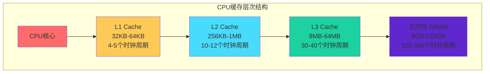
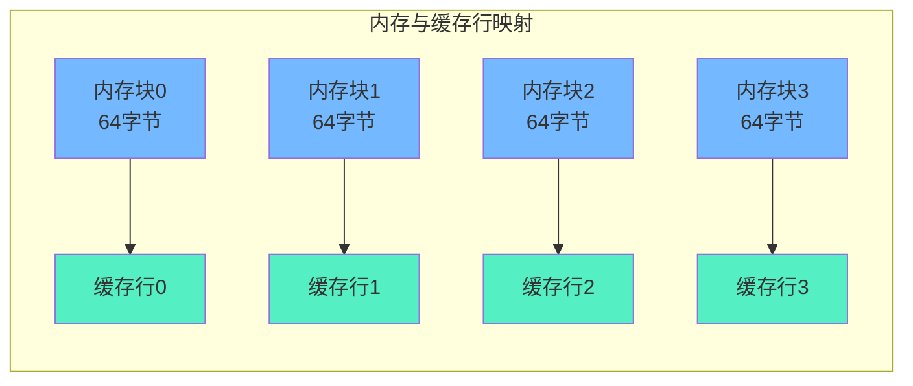
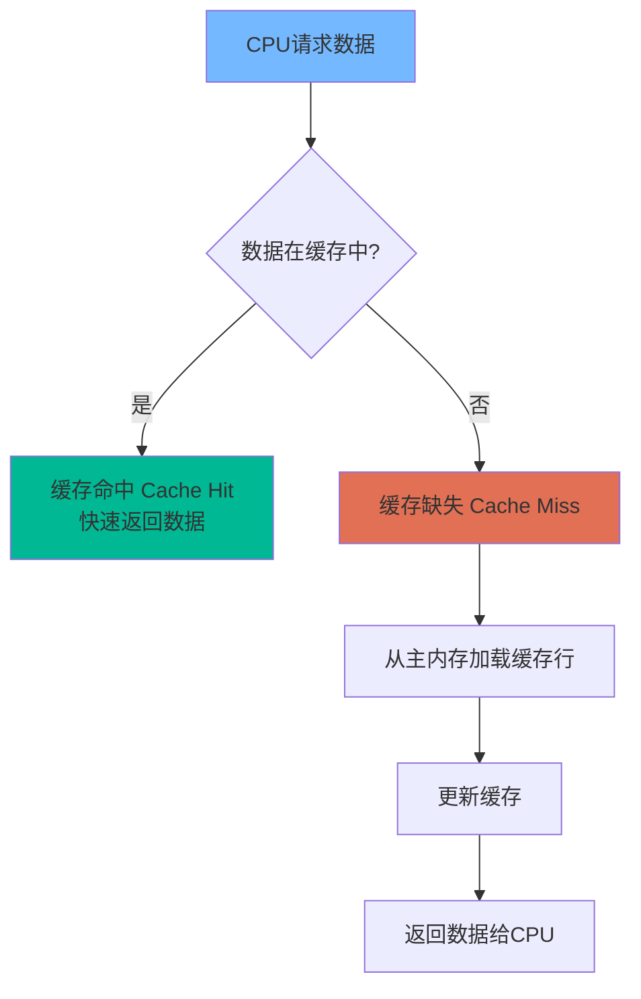
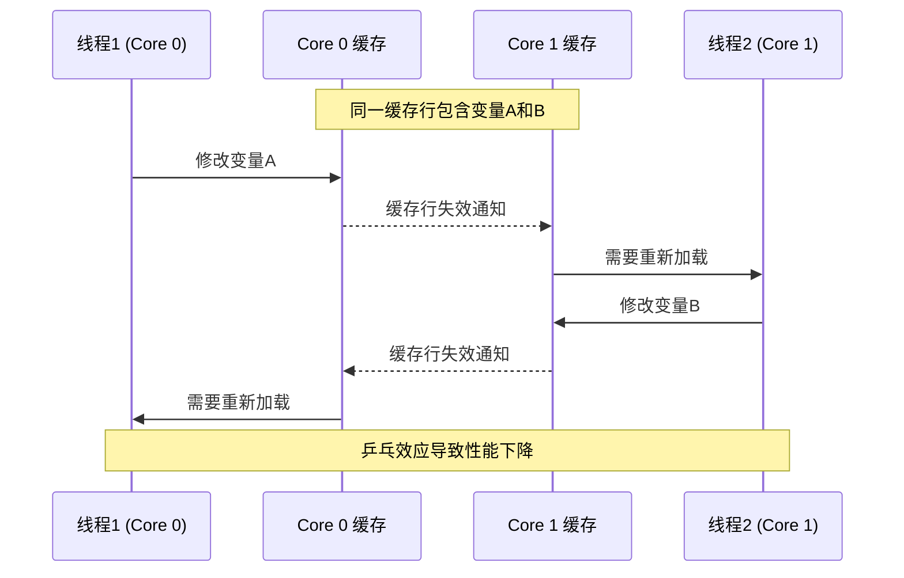
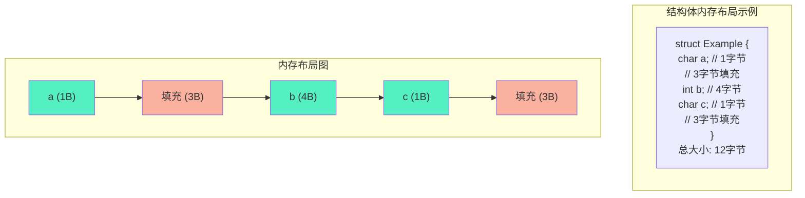
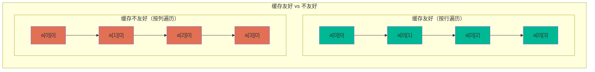
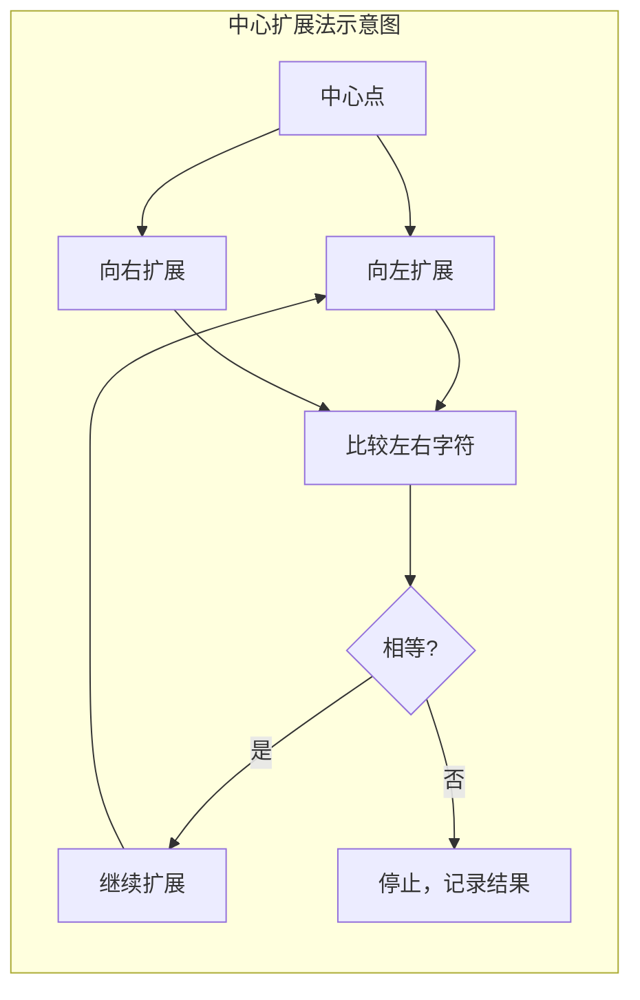

# Day 26：CPU缓存与内存对齐

## 📅 学习目标

- [ ] 理解CPU缓存的工作原理和层次结构
- [ ] 掌握缓存行的概念和缓存命中机制
- [ ] 了解伪共享问题及其解决方案
- [ ] 理解内存对齐的概念和对齐规则
- [ ] 掌握alignas和alignof关键字的使用
- [ ] 学习缓存友好的编程实践
- [ ] 完成LeetCode 5（最长回文子串）和647（回文子串）

---

## 📖 知识点一：CPU缓存

### 概念定义

CPU缓存（CPU Cache）是位于CPU和主内存之间的一种高速存储器，用于暂时存储CPU频繁访问的数据和指令。由于CPU的运算速度远快于主内存的访问速度，如果没有缓存，CPU将花费大量时间等待内存数据，导致性能严重下降。CPU缓存利用程序的局部性原理，通过预取和存储热点数据，显著减少CPU访问内存的次数，从而提升整体系统性能。缓存的设计是现代计算机体系结构中最重要的优化之一。

### 缓存层次结构

现代CPU通常采用多级缓存架构，常见的有L1、L2、L3三级缓存。L1缓存距离CPU核心最近，容量最小但速度最快，通常分为指令缓存（L1i）和数据缓存（L1d）。L2缓存容量更大但速度稍慢，每个CPU核心通常有独立的L2缓存。L3缓存是所有核心共享的最后一级缓存，容量最大但速度最慢。这种分层设计在速度、容量和成本之间取得了良好的平衡。



### 缓存行（Cache Line）

缓存行是CPU缓存与主内存之间数据传输的基本单位，通常大小为64字节。当CPU需要访问某个内存地址时，不会只读取该地址的数据，而是将包含该地址的整个缓存行加载到缓存中。这种设计利用了空间局部性原理：如果程序访问了某个地址，很可能很快会访问其附近的地址。理解缓存行对于编写高性能代码至关重要，因为合理的缓存行利用可以显著提升缓存命中率。



### 缓存命中与缓存缺失

缓存命中（Cache Hit）是指CPU需要的数据恰好存在于缓存中，可以直接从缓存读取，无需访问主内存。缓存缺失（Cache Miss）则是指所需数据不在缓存中，必须从主内存加载。缓存缺失分为三种类型：强制性缺失（首次访问数据必然缺失）、容量缺失（缓存容量不足导致的缺失）和冲突缺失（多个内存地址映射到同一缓存位置）。提高缓存命中率是性能优化的核心目标之一。



### 伪共享（False Sharing）

伪共享是多线程编程中一个隐蔽的性能杀手。当多个线程分别修改位于同一缓存行中的不同变量时，由于缓存一致性协议的要求，会导致该缓存行在多个CPU核心之间频繁传递，造成大量缓存失效。虽然线程操作的是不同的变量，但因为它们位于同一缓存行，导致缓存行被反复"乒乓"传递，严重影响性能。解决伪共享的常用方法是使用缓存行填充或alignas对齐。



### 代码示例

```cpp
#include <iostream>
#include <vector>
#include <chrono>
#include <thread>

// 缓存行大小通常为64字节
constexpr size_t CACHE_LINE_SIZE = 64;

// 演示伪共享问题
struct CounterBad {
    volatile int count1;  // 线程1修改
    volatile int count2;  // 线程2修改
    // 两个变量可能在同一缓存行，导致伪共享
};

// 使用缓存行填充避免伪共享
struct alignas(CACHE_LINE_SIZE) CounterGood {
    volatile int count1;
    char padding[CACHE_LINE_SIZE - sizeof(int)];  // 填充到独立缓存行
    volatile int count2;
};

// 测试伪共享影响
void testFalseSharing() {
    std::cout << "\n=== 伪共享测试 ===" << std::endl;
    
    const int ITERATIONS = 100'000'000;
    
    // 测试存在伪共享的情况
    CounterBad bad;
    bad.count1 = 0;
    bad.count2 = 0;
    
    auto start = std::chrono::high_resolution_clock::now();
    std::thread t1([&]() {
        for (int i = 0; i < ITERATIONS; ++i) {
            bad.count1++;
        }
    });
    std::thread t2([&]() {
        for (int i = 0; i < ITERATIONS; ++i) {
            bad.count2++;
        }
    });
    t1.join();
    t2.join();
    auto end = std::chrono::high_resolution_clock::now();
    std::cout << "存在伪共享耗时: " 
              << std::chrono::duration_cast<std::chrono::milliseconds>(end - start).count() 
              << " ms" << std::endl;
    
    // 测试避免伪共享的情况
    CounterGood good;
    good.count1 = 0;
    good.count2 = 0;
    
    start = std::chrono::high_resolution_clock::now();
    std::thread t3([&]() {
        for (int i = 0; i < ITERATIONS; ++i) {
            good.count1++;
        }
    });
    std::thread t4([&]() {
        for (int i = 0; i < ITERATIONS; ++i) {
            good.count2++;
        }
    });
    t3.join();
    t4.join();
    end = std::chrono::high_resolution_clock::now();
    std::cout << "避免伪共享耗时: " 
              << std::chrono::duration_cast<std::chrono::milliseconds>(end - start).count() 
              << " ms" << std::endl;
}
```

---

## 📖 知识点二：内存对齐

### 概念定义

内存对齐（Memory Alignment）是指数据在内存中的存放地址必须满足特定的边界要求。具体来说，一个数据对象的地址必须是其自身大小的整数倍。例如，一个4字节的int类型变量应该存放在能被4整除的地址上。内存对齐不是高级语言的要求，而是CPU硬件的特性，因为CPU在访问对齐的数据时效率最高，访问未对齐的数据可能需要额外的内存访问周期，甚至在某些架构上会导致程序崩溃。

### 对齐规则

不同数据类型有不同的对齐要求。一般规则是：基本数据类型的对齐边界等于其大小，复合类型（结构体、类）的对齐边界等于其最大成员的对齐边界，结构体的总大小必须是其对齐边界的整数倍。编译器会自动在结构体成员之间插入填充字节以满足对齐要求。理解这些规则有助于我们设计内存高效的 数据结构，减少内存浪费。



### 对齐规则详解

```cpp
#include <iostream>

// 演示内存对齐规则
struct AlignDemo {
    char a;     // 1字节 + 3字节填充（为了对齐int）
    int b;      // 4字节
    char c;     // 1字节 + 3字节填充（结构体对齐）
    double d;   // 8字节
};

void printAlignment() {
    std::cout << "\n=== 内存对齐详解 ===" << std::endl;
    
    std::cout << "char 对齐要求: " << alignof(char) << " 字节" << std::endl;
    std::cout << "short 对齐要求: " << alignof(short) << " 字节" << std::endl;
    std::cout << "int 对齐要求: " << alignof(int) << " 字节" << std::endl;
    std::cout << "long 对齐要求: " << alignof(long) << " 字节" << std::endl;
    std::cout << "double 对齐要求: " << alignof(double) << " 字节" << std::endl;
    std::cout << "指针 对齐要求: " << alignof(void*) << " 字节" << std::endl;
    
    std::cout << "\nAlignDemo 结构体分析:" << std::endl;
    std::cout << "  sizeof(AlignDemo) = " << sizeof(AlignDemo) << " 字节" << std::endl;
    std::cout << "  alignof(AlignDemo) = " << alignof(AlignDemo) << " 字节" << std::endl;
    
    AlignDemo demo;
    std::cout << "\n各成员偏移量:" << std::endl;
    std::cout << "  a 偏移: " << offsetof(AlignDemo, a) << std::endl;
    std::cout << "  b 偏移: " << offsetof(AlignDemo, b) << std::endl;
    std::cout << "  c 偏移: " << offsetof(AlignDemo, c) << std::endl;
    std::cout << "  d 偏移: " << offsetof(AlignDemo, d) << std::endl;
}
```

### 性能影响

内存对齐对性能有显著影响。对齐的数据访问只需要一次内存操作，而未对齐的数据可能需要两次或更多次内存操作才能完成读取。在某些RISC架构（如ARM、SPARC）上，访问未对齐数据会导致硬件异常。即使是x86架构支持未对齐访问，也会有明显的性能损失。因此，在性能敏感的代码中，合理设计数据结构的成员顺序，减少填充字节，同时保证对齐，是非常重要的优化手段。

### alignas 和 alignof

C++11引入了alignas和alignof关键字，使程序员能够更精确地控制数据对齐。alignof用于查询类型的对齐要求，返回一个size_t类型的值。alignas用于指定自定义的对齐要求，可以用于变量声明、类定义等场景。这两个关键字为编写跨平台、高性能的代码提供了更好的支持，特别是在SIMD编程、内存映射IO等需要特定对齐的场景中。

```cpp
#include <iostream>
#include <cstddef>

// 使用alignas指定对齐
struct alignas(16) AlignedStruct {
    int x;
    int y;
    // 整个结构体按16字节对齐
};

// 缓存行对齐
struct alignas(64) CacheLineAligned {
    int data[14];  // 56字节 + 8字节填充 = 64字节
};

void demoAlignasAlignof() {
    std::cout << "\n=== alignas/alignof 演示 ===" << std::endl;
    
    // alignof 示例
    std::cout << "alignof(int) = " << alignof(int) << std::endl;
    std::cout << "alignof(double) = " << alignof(double) << std::endl;
    std::cout << "alignof(AlignedStruct) = " << alignof(AlignedStruct) << std::endl;
    std::cout << "alignof(CacheLineAligned) = " << alignof(CacheLineAligned) << std::endl;
    
    // alignas 变量示例
    alignas(16) int alignedInt = 42;
    std::cout << "\nalignas(16) int 的地址: " << &alignedInt << std::endl;
    std::cout << "地址是否能被16整除: " << ((reinterpret_cast<std::uintptr_t>(&alignedInt) % 16) == 0) << std::endl;
    
    // 大小比较
    std::cout << "\n结构体大小比较:" << std::endl;
    std::cout << "sizeof(AlignedStruct) = " << sizeof(AlignedStruct) << std::endl;
    std::cout << "sizeof(CacheLineAligned) = " << sizeof(CacheLineAligned) << std::endl;
}
```

---

## 📖 知识点三：缓存友好编程实践

### 数据局部性原则

编写缓存友好的代码，核心是充分利用数据的局部性。时间局部性指最近访问的数据很可能再次被访问，空间局部性指访问某个地址后很可能访问其附近地址。在代码中，应该尽量让数据访问连续、有规律，避免随机访问模式。例如，遍历二维数组时应该按行遍历（C/C++中），而不是按列遍历，这样能充分利用缓存行。



### 数组 vs 链表

从缓存角度看，数组（连续内存）比链表（离散内存）有天然优势。数组的连续存储特性使得遍历时缓存行能被高效利用，预取机制也能有效工作。而链表节点分散在内存各处，每次访问都可能导致缓存缺失。在性能敏感场景，优先选择数组或vector，或考虑使用"扁平化"的数据结构（如将链表节点预分配在连续内存池中）。

```cpp
#include <iostream>
#include <vector>
#include <list>
#include <chrono>
#include <random>

void compareCachePerformance() {
    std::cout << "\n=== 缓存性能对比：数组 vs 链表 ===" << std::endl;
    
    const int N = 1000000;
    
    // 数组（连续内存）
    std::vector<int> arr(N);
    for (int i = 0; i < N; ++i) arr[i] = i;
    
    // 链表（离散内存）
    std::list<int> lst(arr.begin(), arr.end());
    
    volatile long long sum = 0;
    
    // 数组遍历
    auto start = std::chrono::high_resolution_clock::now();
    for (int i = 0; i < N; ++i) {
        sum += arr[i];
    }
    auto end = std::chrono::high_resolution_clock::now();
    std::cout << "数组遍历耗时: " 
              << std::chrono::duration_cast<std::chrono::microseconds>(end - start).count() 
              << " μs" << std::endl;
    
    // 链表遍历
    start = std::chrono::high_resolution_clock::now();
    for (int val : lst) {
        sum += val;
    }
    end = std::chrono::high_resolution_clock::now();
    std::cout << "链表遍历耗时: " 
              << std::chrono::duration_cast<std::chrono::microseconds>(end - start).count() 
              << " μs" << std::endl;
    
    std::cout << "提示: 数组因连续内存布局，缓存命中率更高" << std::endl;
}
```

### 结构体成员排序优化

合理安排结构体成员的顺序可以减少内存填充，提高缓存利用率。一般原则是：将相同或相似对齐要求的成员放在一起，将大对齐要求的成员放在前面。这样既能减少内存浪费，又能提高缓存行的利用效率。使用`#pragma pack`可以强制改变对齐方式，但通常不建议这样做，因为可能影响性能甚至导致程序崩溃。

```cpp
#include <iostream>

// 优化前：内存布局不紧凑
struct BeforeOpt {
    char a;     // 1字节 + 3字节填充
    int b;      // 4字节
    char c;     // 1字节 + 7字节填充
    double d;   // 8字节
};  // 总共24字节

// 优化后：按对齐要求排序
struct AfterOpt {
    double d;   // 8字节
    int b;      // 4字节
    char a;     // 1字节
    char c;     // 1字节 + 2字节填充
};  // 总共16字节

void structOptimization() {
    std::cout << "\n=== 结构体成员排序优化 ===" << std::endl;
    
    std::cout << "优化前 sizeof(BeforeOpt) = " << sizeof(BeforeOpt) << " 字节" << std::endl;
    std::cout << "优化后 sizeof(AfterOpt) = " << sizeof(AfterOpt) << " 字节" << std::endl;
    std::cout << "节省内存: " << sizeof(BeforeOpt) - sizeof(AfterOpt) << " 字节" << std::endl;
    
    std::cout << "\n成员排序建议:" << std::endl;
    std::cout << "  1. 将大对齐要求的成员（如double）放前面" << std::endl;
    std::cout << "  2. 将相同类型的成员放在一起" << std::endl;
    std::cout << "  3. 考虑使用位域压缩bool/enum成员" << std::endl;
}
```

### 缓存友好的循环

循环是程序中最常见的结构之一，优化循环访问模式对缓存性能至关重要。应该尽量避免在循环内部进行随机内存访问，优先使用步长为1的顺序访问。对于嵌套循环，应该将最内层循环设为访问最连续维度的循环。此外，循环展开和分块技术也能显著改善缓存利用。

```cpp
#include <iostream>
#include <vector>
#include <chrono>

constexpr int SIZE = 1024;

void loopOptimization() {
    std::cout << "\n=== 循环优化演示 ===" << std::endl;
    
    std::vector<std::vector<int>> matrix(SIZE, std::vector<int>(SIZE, 1));
    volatile long long sum = 0;
    
    // 按行遍历（缓存友好）
    auto start = std::chrono::high_resolution_clock::now();
    for (int i = 0; i < SIZE; ++i) {
        for (int j = 0; j < SIZE; ++j) {
            sum += matrix[i][j];
        }
    }
    auto end = std::chrono::high_resolution_clock::now();
    std::cout << "按行遍历耗时: " 
              << std::chrono::duration_cast<std::chrono::milliseconds>(end - start).count() 
              << " ms" << std::endl;
    
    // 按列遍历（缓存不友好）
    start = std::chrono::high_resolution_clock::now();
    for (int j = 0; j < SIZE; ++j) {
        for (int i = 0; i < SIZE; ++i) {
            sum += matrix[i][j];
        }
    }
    end = std::chrono::high_resolution_clock::now();
    std::cout << "按列遍历耗时: " 
              << std::chrono::duration_cast<std::chrono::milliseconds>(end - start).count() 
              << " ms" << std::endl;
    
    std::cout << "提示: C++中二维数组按行存储，按行遍历缓存命中率更高" << std::endl;
}
```

---

## 🎯 LeetCode 刷题

### 讲解题：LC 5. 最长回文子串

#### 题目链接

[LeetCode 5](https://leetcode.cn/problems/longest-palindromic-substring/)

#### 题目描述

给你一个字符串 `s`，找到 `s` 中最长的回文子串。

#### 形象化理解

想象你正在检查一串珠子，想找到最长的一段对称的珠子：

```
字符串: b a b a d
下标:   0 1 2 3 4

回文子串检测：
- "bab" (下标0-2): b→a→b ← 对称！长度3
- "aba" (下标1-3): a→b→a ← 对称！长度3
- "babad" 整体: 不对称

最长回文子串: "bab" 或 "aba"
```

回文就像镜子：从中心向两边看，左边和右边是一样的。



#### 理论介绍

**回文串**是指正读和反读都相同的字符串，如"aba"、"abba"。最长回文子串问题的核心是找到字符串中所有的回文子串，并返回最长的一个。

解决这个问题有多种方法：
1. **暴力法**：枚举所有子串，检查是否回文，时间复杂度O(n³)
2. **动态规划**：利用子问题的解，时间复杂度O(n²)，空间复杂度O(n²)
3. **中心扩展法**：以每个字符为中心向两边扩展，时间复杂度O(n²)，空间复杂度O(1)
4. **Manacher算法**：线性时间复杂度O(n)，但较复杂

对于初学者，推荐掌握**中心扩展法**，它直观易懂，空间效率高。

#### 解题思路

使用**中心扩展法**：
1. 遍历字符串的每个字符作为中心
2. 注意：回文中心可以是单个字符（奇数长度）或两个字符之间（偶数长度）
3. 从中心向两边扩展，直到左右字符不相等
4. 记录过程中发现的最长回文子串

#### 代码实现

```cpp
#include <string>
#include <algorithm>

class Solution {
public:
    std::string longestPalindrome(std::string s) {
        int n = s.length();
        if (n < 2) return s;
        
        int start = 0, maxLen = 1;
        
        // 中心扩展函数
        auto expandAroundCenter = [&](int left, int right) {
            while (left >= 0 && right < n && s[left] == s[right]) {
                left--;
                right++;
            }
            // 循环结束时，left和right是多扩展了一位的
            // 实际回文长度 = right - left - 1
            int len = right - left - 1;
            if (len > maxLen) {
                maxLen = len;
                start = left + 1;
            }
        };
        
        for (int i = 0; i < n; ++i) {
            // 以s[i]为中心的奇数长度回文
            expandAroundCenter(i, i);
            // 以s[i]和s[i+1]之间为中心的偶数长度回文
            expandAroundCenter(i, i + 1);
        }
        
        return s.substr(start, maxLen);
    }
};
```

---

### 实战题：LC 647. 回文子串

#### 题目链接

[LeetCode 647](https://leetcode.cn/problems/palindromic-substrings/)

#### 题目描述

给你一个字符串 `s`，请你统计并返回这个字符串中回文子串的数目。

#### 形象化理解

这次不是找最长的，而是数有多少个回文子串：

```
字符串: "abc"
回文子串: "a", "b", "c" 共3个

字符串: "aaa"
回文子串: "a", "a", "a", "aa", "aa", "aaa" 共6个

字符串: "aba"
回文子串: "a", "b", "a", "aba" 共4个
```

每一个单独的字符都是回文，连续相同的字符能组成更多回文。

#### 解题思路

同样使用**中心扩展法**，但这次要统计所有回文子串的数量：
1. 遍历每个可能的中心点
2. 对于每个中心，向两边扩展
3. 每次成功扩展（左右字符相等），就找到了一个回文子串，计数加一

#### 代码实现

```cpp
#include <string>

class Solution {
public:
    int countSubstrings(std::string s) {
        int n = s.length();
        int count = 0;
        
        // 中心扩展函数，返回以[left, right]为中心的回文子串数量
        auto extendPalindrome = [&](int left, int right) {
            while (left >= 0 && right < n && s[left] == s[right]) {
                count++;    // 找到一个回文子串
                left--;
                right++;
            }
        };
        
        for (int i = 0; i < n; ++i) {
            // 奇数长度回文：以s[i]为中心
            extendPalindrome(i, i);
            // 偶数长度回文：以s[i]和s[i+1]之间为中心
            extendPalindrome(i, i + 1);
        }
        
        return count;
    }
};
```

#### 两题对比

| 方面 | LC 5 最长回文子串 | LC 647 回文子串数 |
|------|------------------|------------------|
| 目标 | 找最长的 | 统计总数 |
| 返回值 | 字符串 | 整数 |
| 核心方法 | 中心扩展，记录最长 | 中心扩展，累加计数 |
| 时间复杂度 | O(n²) | O(n²) |
| 空间复杂度 | O(1) | O(1) |

---

## 🚀 运行代码

```bash
./build_and_run.sh
```

---

## 📚 相关术语

| 术语 | 英文 | 定义 |
|------|------|------|
| CPU缓存 | CPU Cache | CPU和主内存之间的高速存储器 |
| 缓存行 | Cache Line | 缓存与内存交换数据的基本单位，通常64字节 |
| 缓存命中 | Cache Hit | 请求数据在缓存中找到 |
| 缓存缺失 | Cache Miss | 请求数据不在缓存中 |
| 伪共享 | False Sharing | 多线程修改同一缓存行导致的性能问题 |
| 内存对齐 | Memory Alignment | 数据地址满足特定边界要求 |
| 对齐边界 | Alignment Boundary | 数据地址必须满足的整数倍要求 |
| 填充字节 | Padding | 编译器插入的用于满足对齐的字节 |
| 局部性原理 | Locality Principle | 程序访问数据的时空集中性 |
| SIMD | Single Instruction Multiple Data | 单指令多数据流并行计算 |

---

## 💡 学习提示

### 要点记忆

1. **缓存层次**：L1最快最小，L3最慢最大，越接近CPU越快
2. **缓存行大小**：通常64字节，一次加载一整行
3. **伪共享**：同一缓存行的不同变量被多线程修改导致性能下降
4. **内存对齐**：数据地址是其大小的整数倍，对齐访问更高效
5. **alignas/alignof**：C++11关键字，用于控制和查询对齐要求

### 实践建议

1. **性能测试**：使用高精度计时器测量缓存优化效果
2. **结构体设计**：按对齐要求排序成员，减少填充
3. **数据结构选择**：性能敏感场景优先使用连续内存结构
4. **循环优化**：优先顺序访问，避免随机访问模式
5. **工具使用**：使用性能分析工具（如perf、VTune）定位缓存问题

### 常见误区

1. ❌ 认为"内存对齐只是编译器的事" → 理解对齐才能写出高性能代码
2. ❌ 认为链表比数组"更灵活所以更好" → 忽视了缓存效率差异
3. ❌ 认为"现代CPU很快，不需要考虑缓存" → 缓存优化可能带来数倍性能提升
4. ❌ 过度使用`#pragma pack(1)` → 可能导致严重的性能问题或崩溃

---

## 🔗 参考资料

1. [What Every Programmer Should Know About Memory](https://people.freebsd.org/~lstewart/articles/cpumemory.pdf) - Ulrich Drepper的经典文章
2. [CPU Caches and Why You Care](https://www.aristeia.com/TalkNotes/codedive-CPUCachesHandouts.pdf) - Scott Meyers
3. [cppreference - alignas specifier](https://en.cppreference.com/w/cpp/language/alignas)
4. [cppreference - alignof operator](https://en.cppreference.com/w/cpp/language/alignof)
5. [False Sharing - Intel](https://software.intel.com/content/www/us/en/develop/articles/avoiding-and-identifying-false-sharing-among-threads.html)
