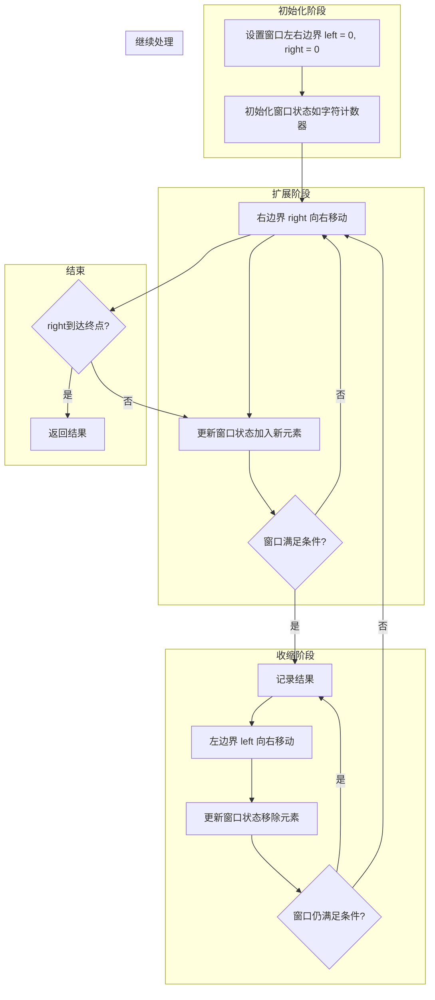
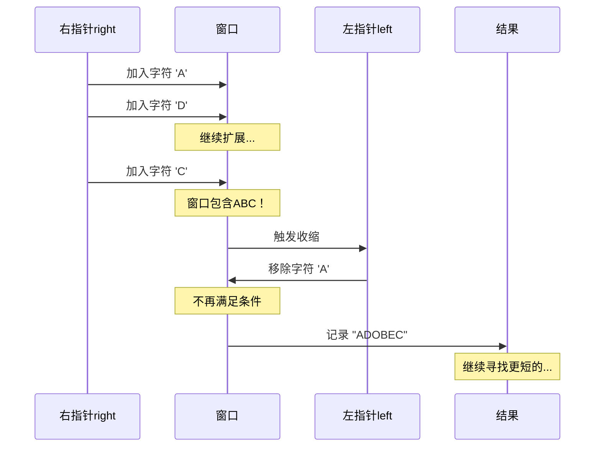

# Day 27：字符串专题

## 📅 学习目标

今天我们深入探索C++中的字符串处理技术，这是编程中最基础也是最重要的技能之一。字符串处理几乎出现在所有的软件开发场景中，从前端用户输入验证到后端数据处理，从算法竞赛到实际工程应用。通过今天的学习，你将掌握C++标准库中的字符串操作、字符串匹配算法的核心思想，以及滑动窗口这一经典算法技巧。这些知识不仅能帮助你解决LeetCode上的字符串相关题目，更能提升你处理实际文本数据的能力。我们将从基础操作开始，逐步深入到算法层面，最终通过两道经典题目巩固所学知识。

## 📖 知识点一：字符串基础

### 1.1 C++ std::string 概述

C++标准库提供了`std::string`类，它是对C风格字符串（以null结尾的字符数组）的安全、便捷封装。与C风格字符串相比，`std::string`自动管理内存，无需手动分配和释放，大大减少了内存泄漏和缓冲区溢出的风险。`std::string`支持动态扩容，可以根据需要自动增长，程序员不需要预先知道字符串的最大长度。此外，`std::string`提供了丰富的成员函数，包括查找、截取、拼接、比较等常用操作，使用起来非常直观。

```cpp
#include <string>
#include <iostream>

// 字符串的多种初始化方式
std::string s1;                    // 空字符串
std::string s2 = "Hello";          // 从C字符串构造
std::string s3(5, 'a');            // "aaaaa"
std::string s4(s2);                // 拷贝构造
std::string s5 = s2 + " World";    // 拼接
```

### 1.2 常用字符串操作

掌握字符串的常用操作是处理文本数据的基础技能。以下是最常用的操作分类：

**容量操作**：`size()`/`length()`返回字符串长度，`empty()`判断是否为空，`clear()`清空字符串，`reserve()`预分配空间以提高性能。

**元素访问**：`[]`运算符和`at()`方法都可以访问单个字符，区别在于`at()`会进行边界检查，越界时抛出异常，更安全但稍慢。`front()`和`back()`分别返回首尾字符。

**修改操作**：`push_back()`在末尾添加字符，`append()`追加字符串，`insert()`在指定位置插入，`erase()`删除字符，`replace()`替换部分内容。

**查找操作**：`find()`查找子串首次出现位置，`rfind()`从后向前查找，`find_first_of()`查找任意指定字符首次出现的位置。

```cpp
std::string s = "Hello World";

// 查找操作
size_t pos = s.find("World");      // pos = 6
size_t pos2 = s.find_first_of("aeiou");  // 找第一个元音字母

// 截取操作
std::string sub = s.substr(0, 5);  // "Hello"

// 修改操作
s.replace(6, 5, "C++");            // "Hello C++"
s.erase(5, 1);                     // 删除空格
```

### 1.3 底层实现原理

理解`std::string`的底层实现有助于写出更高效的代码。现代C++实现通常采用"短字符串优化"（SSO, Short String Optimization）技术：对于较短的字符串（通常15-22个字符以内），直接存储在对象本身的栈空间中，避免堆内存分配；对于长字符串，则在堆上分配内存。这种设计使得短字符串操作非常高效，因为避免了动态内存分配的开销。

字符串的拷贝操作在C++11之前是深拷贝，会复制整个字符数组。C++11引入了移动语义后，字符串的转移操作变得非常高效，只需转移内存所有权而不需要复制数据。在函数返回字符串或容器存储字符串时，移动语义会自动生效。

```cpp
// 移动语义示例
std::string createString() {
    std::string result = "Hello";
    return result;  // 触发返回值优化或移动语义
}

std::string s = createString();  // 无内存复制
```

## 📖 知识点二：字符串匹配算法

### 2.1 暴力匹配算法

字符串匹配是计算机科学中的经典问题：给定一个文本串T和一个模式串P，找出P在T中所有出现的位置。最直观的方法是暴力匹配：从文本串的每个位置开始，尝试与模式串逐字符比较。

暴力匹配的优点是实现简单、容易理解。缺点是效率不高，最坏情况下时间复杂度为O(n*m)，其中n是文本串长度，m是模式串长度。例如，当文本串是"AAAAA...A"，模式串是"AAAAB"时，每次都需要比较到模式串的最后一个字符才能确定匹配失败。

```cpp
// 暴力匹配实现
int bruteForceMatch(const std::string& text, const std::string& pattern) {
    int n = text.size(), m = pattern.size();
    for (int i = 0; i <= n - m; i++) {
        int j = 0;
        while (j < m && text[i + j] == pattern[j]) {
            j++;
        }
        if (j == m) return i;  // 找到匹配
    }
    return -1;  // 未找到
}
```

### 2.2 KMP算法简介

KMP算法（Knuth-Morris-Pratt）是字符串匹配的经典高效算法，时间复杂度为O(n+m)。其核心思想是：当匹配失败时，利用已经匹配过的信息，避免从头开始比较。

KMP算法的关键是构建"部分匹配表"（也称为next数组或失败函数）。这个表记录了模式串中每个位置之前的最长公共前后缀长度。当匹配失败时，我们可以根据这个表直接将模式串滑动到下一个可能匹配的位置，而不需要回退文本串的指针。

```cpp
// KMP算法的next数组计算
std::vector<int> computeNext(const std::string& pattern) {
    int m = pattern.size();
    std::vector<int> next(m, 0);
    int j = 0;
    for (int i = 1; i < m; i++) {
        while (j > 0 && pattern[i] != pattern[j]) {
            j = next[j - 1];
        }
        if (pattern[i] == pattern[j]) {
            j++;
        }
        next[i] = j;
    }
    return next;
}
```

### 2.3 Rabin-Karp算法思想

Rabin-Karp算法采用完全不同的思路：将字符串比较转化为数值比较。它使用哈希函数计算模式串和文本串中各子串的哈希值，通过比较哈希值来判断是否可能匹配。

由于哈希值可能存在冲突，当哈希值相等时还需要进行实际字符串比较来确认。Rabin-Karp算法的优势在于可以高效地进行多模式匹配，而且在某些实际应用中（如查重、入侵检测）表现良好。

```cpp
// Rabin-Karp算法的核心：滚动哈希
// 使用多项式哈希: hash(s) = s[0]*d^(m-1) + s[1]*d^(m-2) + ... + s[m-1]
// 当窗口滑动时: 新hash = (旧hash - 首字符贡献) * d + 新字符
```

## 📖 知识点三：滑动窗口算法

### 3.1 概念定义

滑动窗口是一种在数组/字符串上维护一个"窗口"的技巧，窗口可以左右滑动，用于高效解决一类涉及连续区间的问题。想象你在看一列很长的火车车厢，你只能看到连续的几节车厢（这就是窗口），随着火车移动（窗口滑动），你能看到的内容也在变化。

滑动窗口的核心思想是：当窗口滑动时，利用已经计算过的信息，避免重复计算。比如，如果我们知道窗口内的字符计数，当窗口向右滑动一格时，只需要更新移出和移入的两个字符的计数，而不需要重新统计整个窗口。

### 3.2 适用场景

滑动窗口算法特别适合以下类型的问题：

1. **子串/子数组问题**：寻找满足特定条件的最长/最短子串或子数组
2. **字符计数问题**：判断子串是否包含特定字符集合
3. **连续区间问题**：计算满足条件的连续区间

判断是否可以用滑动窗口的重要线索：
- 问题涉及连续区间或子串
- 问题有"最小"、"最大"、"包含"、"覆盖"等关键词
- 窗口的变化有单调性（通常窗口只向一个方向移动）

### 3.3 滑动窗口可视化



### 3.4 滑动窗口代码模板

```cpp
/**
 * 滑动窗口通用模板
 * 适用于求解满足特定条件的子串问题
 */
string slidingWindowTemplate(string s, string t) {
    // 1. 初始化字符计数器
    unordered_map<char, int> need, window;
    for (char c : t) need[c]++;
    
    // 2. 初始化窗口指针和状态
    int left = 0, right = 0;
    int valid = 0;  // 窗口中满足条件的字符数量
    
    // 3. 开始滑动窗口
    while (right < s.size()) {
        // 扩展窗口：加入右边界的字符
        char c = s[right];
        right++;
        // 更新窗口状态...
        
        // 4. 判断是否需要收缩窗口
        while (窗口需要收缩的条件) {
            // 记录/更新结果...
            
            // 收缩窗口：移除左边界的字符
            char d = s[left];
            left++;
            // 更新窗口状态...
        }
    }
    return result;
}
```

## 🎯 LeetCode 刷题

### 讲解题：LC 76 最小覆盖子串

#### 题目概述

给你一个字符串 `s` 和一个字符串 `t`。返回 `s` 中涵盖 `t` 所有字符（包括重复字符）的最小子串。如果不存在这样的子串，返回空字符串。

**示例**：
- 输入：s = "ADOBECODEBANC", t = "ABC"
- 输出："BANC"
- 解释：最小窗口子串 "BANC" 包含了 t 中的所有字符 'A'、'B'、'C'

#### 形象化理解

想象你是一个快递员，需要收集一整套特定的物品（字符串t中的所有字符）。你在一条街道上行走（遍历字符串s），街道两边的店铺出售各种物品。你需要找到最短的一段路，在这段路上能收集齐所有需要的物品。

```
街道: A D O B E C O D E B A N C
      ↑               ↑
      收集到ABC，但不是最短
      
街道: A D O B E C O D E B A N C
                      ↑     ↑
              最短路径：BANC，刚好收集齐ABC
```

#### 📚 理论介绍

**滑动窗口（Sliding Window）** 是解决子串/子数组问题的经典算法技巧，其核心思想是维护一个可动态调整的连续区间。

**为什么滑动窗口适用于本题？**
1. **子串连续性**：题目要求的是连续子串，窗口天然满足连续性
2. **单调性**：窗口只向右移动，不会回退，保证 O(n) 时间复杂度
3. **可增量更新**：窗口扩展或收缩时，只需更新边界元素的状态

**滑动窗口的两种类型**：
| 类型 | 特点 | 本题属于 |
|------|------|---------|
| 固定窗口 | 窗口大小不变 | ❌ |
| 可变窗口 | 窗口大小动态变化 | ✅ |

**窗口状态维护技巧**：
- 使用哈希表（或数组）记录目标字符需求
- 使用计数器记录"已满足条件的字符数"
- 当计数器等于目标字符种类数时，窗口满足条件

**与其他方法的对比**：
| 方法 | 时间复杂度 | 空间复杂度 | 是否最优 |
|------|-----------|-----------|---------|
| 暴力枚举 | O(n³) | O(k) | ❌ |
| 滑动窗口 | O(n) | O(k) | ✅ |

#### 算法思路

这道题是典型的滑动窗口问题，解题步骤如下：

1. **初始化**：用哈希表记录目标字符串t中每个字符的数量需求
2. **扩展窗口**：右指针向右移动，将字符加入窗口，更新计数
3. **判断条件**：当窗口中包含了所有需要的字符时，尝试收缩窗口
4. **收缩窗口**：左指针向右移动，寻找更短的满足条件的窗口
5. **更新结果**：在收缩过程中记录最短的满足条件的子串



#### 代码实现

见 `code/leetcode/0076_minimum_window/` 目录下的完整实现。

#### 复杂度分析

- **时间复杂度**：O(n)，其中n是字符串s的长度。每个字符最多被访问两次（一次被right指针，一次被left指针）。
- **空间复杂度**：O(k)，其中k是字符集大小。需要存储字符计数的哈希表。

---

### 实战题：LC 567 字符串的排列

#### 题目概述

给你两个字符串 `s1` 和 `s2`，写一个函数来判断 `s2` 是否包含 `s1` 的排列。如果是，返回 true；否则，返回 false。换句话说，`s1` 的排列之一是 `s2` 的子串。

**示例**：
- 输入：s1 = "ab", s2 = "eidbaooo"
- 输出：true
- 解释：s2 包含 s1 的排列 "ba"

#### 形象化理解

想象你在拼图游戏中寻找特定的拼图块组合。你有一块完整的拼图（s1），想看看另一堆拼图（s2）中是否存在完全相同的拼图块组合，只是顺序可能不同。

```
s1 = "ab" → 需要找到：一个'a'和一个'b'的组合

s2 = "e i d b a o o o"
            ↑ ↑
        找到了！'b'和'a'相邻，是s1的排列
```

可以把这个问题理解为：用固定大小的"框架"（长度等于s1）在s2上滑动，检查每个位置框架内的字符是否与s1的字符组成完全相同。

#### 📚 理论介绍

**排列（Permutation）** 是指将一组元素重新排列得到的所有可能顺序。对于字符串，排列意味着字符相同但顺序可能不同。

**判断排列相等的两种方法**：
| 方法 | 时间复杂度 | 适用场景 |
|------|-----------|---------|
| 排序后比较 | O(n log n) | 一次性判断 |
| 字符计数比较 | O(n) | 多次判断/滑动窗口 |

**固定窗口滑动算法的核心思想**：
1. **窗口大小固定**：本题窗口大小等于 s1 的长度，不会动态变化
2. **增量更新**：窗口滑动时，只需更新移出和移入的两个字符的计数
3. **匹配判断**：比较窗口内字符计数与目标计数是否相同

**与可变窗口的区别**：
```
可变窗口（LC 76）：
  ┌─────────────┐     ┌─────────┐     ┌───────┐
  │   不断变化   │ →  │  收缩    │ →  │ 最小窗口 │
  └─────────────┘     └─────────┘     └───────┘
  
固定窗口（本题）：
  ┌─────┐     ┌─────┐     ┌─────┐
  │ ABC │ →  │ BCD │ →  │ CDE │  （大小不变）
  └─────┘     └─────┘     └─────┘
```

**优化技巧 - 使用差值计数**：
- 维护一个 `diff` 变量记录"窗口与目标不同的字符种类数"
- 当 `diff == 0` 时，表示完全匹配
- 避免每次都比较整个计数数组

#### 算法思路

这道题可以用固定长度的滑动窗口来解决：

1. **固定窗口大小**：窗口长度等于s1的长度
2. **字符计数**：统计s1中每个字符的出现次数
3. **滑动匹配**：用固定大小的窗口在s2上滑动，检查窗口内的字符计数是否与s1相同

与LC 76不同，这里的窗口大小是固定的，不需要动态收缩，只需要判断当前窗口是否满足条件。

```cpp
// 核心思路：维护一个固定大小的窗口
// 窗口内的字符计数与s1相同时，返回true
bool checkInclusion(string s1, string s2) {
    int n1 = s1.size(), n2 = s2.size();
    if (n1 > n2) return false;
    
    // 统计s1的字符计数
    vector<int> count(26, 0);
    for (char c : s1) count[c - 'a']++;
    
    // 滑动窗口
    for (int i = 0; i <= n2 - n1; i++) {
        // 检查窗口[i, i+n1)是否满足条件
        // ...
    }
}
```

#### 优化技巧

使用"匹配字符数"来避免每次都比较整个计数数组：
- 维护一个变量`match`，表示当前窗口中有多少种字符的数量与目标相同
- 当`match`等于字符种类数时，说明找到了答案

#### 复杂度分析

- **时间复杂度**：O(n)，其中n是s2的长度。使用优化后，每个字符最多被处理两次。
- **空间复杂度**：O(1)，因为字符集大小固定（26个小写字母）。

## 🚀 运行代码

```bash
# 进入Day 27目录
cd /home/z/my-project/download/week_04/day_27

# 编译并运行
./build_and_run.sh

# 或手动编译
mkdir build && cd build
cmake ..
make
./day_27_demo
```

## 📚 相关术语

| 术语 | 英文 | 解释 |
|------|------|------|
| 子串 | Substring | 字符串中连续的一段字符序列 |
| 子序列 | Subsequence | 字符串中不要求连续的字符序列 |
| 回文串 | Palindrome | 正读和反读都相同的字符串 |
| 前缀/后缀 | Prefix/Suffix | 字符串开头/结尾的连续子串 |
| 滑动窗口 | Sliding Window | 维护可变/固定长度区间的算法技巧 |
| 哈希函数 | Hash Function | 将任意长度数据映射到固定长度的函数 |
| 字符编码 | Character Encoding | 字符与二进制数据的对应关系 |
| SSO | Short String Optimization | 短字符串优化，小字符串直接存储在栈上 |

## 💡 学习提示

1. **理解滑动窗口的本质**：滑动窗口是一种"增量式"计算的思想，通过维护窗口状态来避免重复计算，这是很多高效算法的核心。

2. **注意边界条件**：处理字符串时特别注意空字符串、单字符字符串、字符串长度关系等边界情况。

3. **区分子串和子序列**：子串要求连续，子序列不要求连续。滑动窗口适用于子串问题，不适用于子序列问题。

4. **字符计数技巧**：对于只包含小写字母的字符串，可以用长度为26的数组代替哈希表，效率更高。

5. **窗口的两种类型**：固定长度窗口（如LC 567）和可变长度窗口（如LC 76），它们的处理方式有所不同。

6. **多练习变体题目**：滑动窗口有很多变体，如至多包含k个不同字符的最长子串、替换k个字符后的最长重复子串等，多练习才能融会贯通。

## 🔗 参考资料

- [C++ Reference - std::string](https://en.cppreference.com/w/cpp/string/basic_string)
- [KMP Algorithm - Wikipedia](https://en.wikipedia.org/wiki/Knuth%E2%80%93Morris%E2%80%93Pratt_algorithm)
- [Sliding Window Technique](https://www.geeksforgeeks.org/window-sliding-technique/)
- 《算法导论》第32章：字符串匹配
- 《剑指Offer》字符串章节
