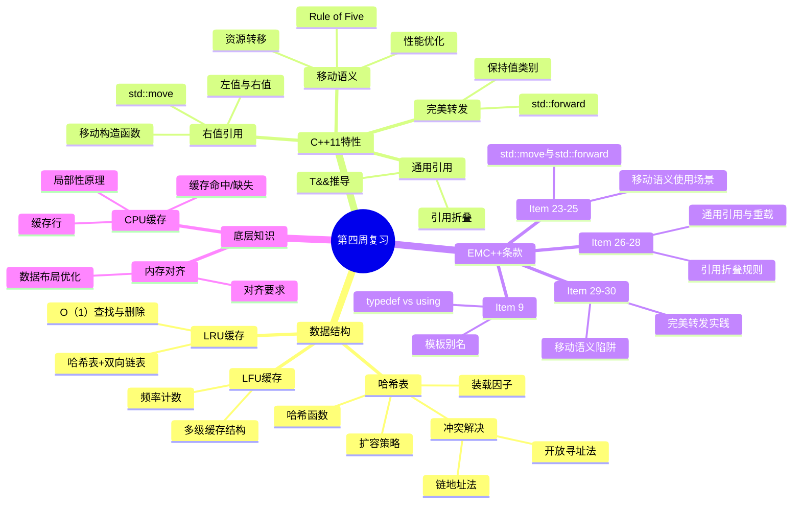
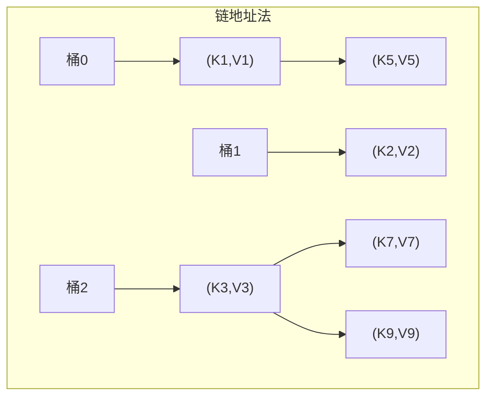
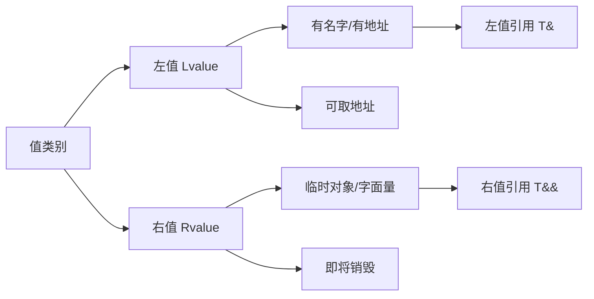
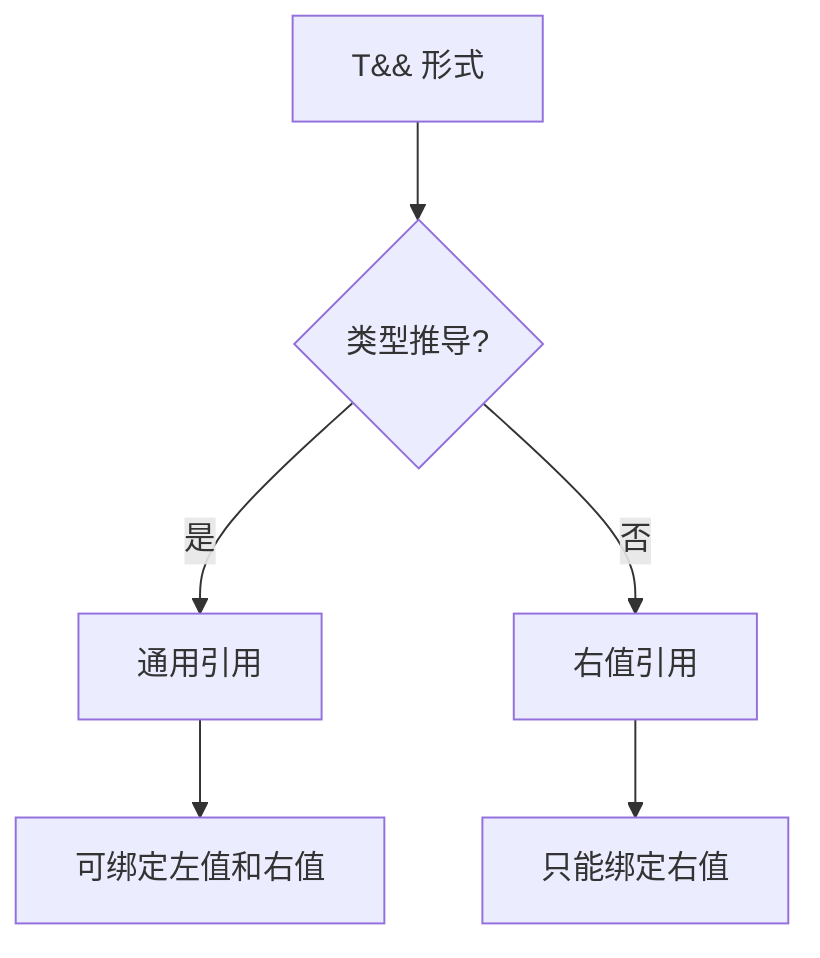
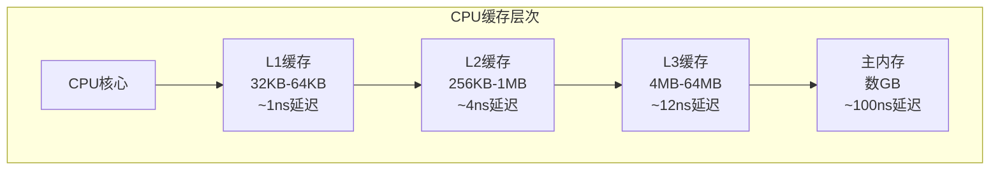
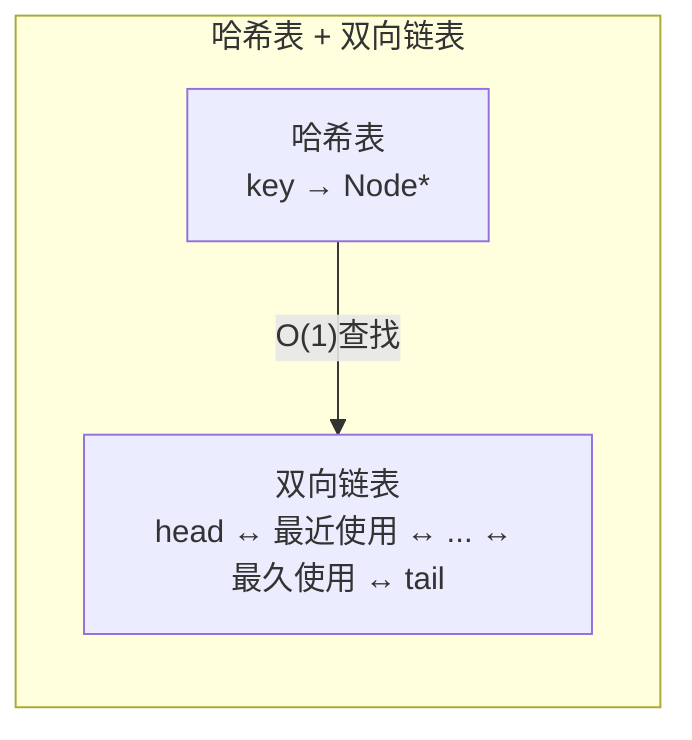
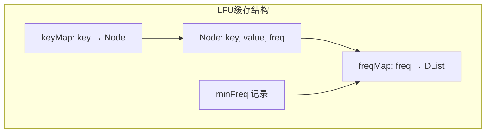

# Day 28：第四周复习

## 📅 学习目标

- [ ] 复习哈希表的核心概念与实现原理
- [ ] 巩固移动语义、右值引用的理解与应用
- [ ] 回顾通用引用与完美转发的核心要点
- [ ] 掌握EMC++ Item 9, 23-30的核心思想
- [ ] 完成LeetCode 146 (LRU缓存) 和 460 (LFU缓存)
- [ ] 总结本周底层知识：CPU缓存与内存对齐

---

## 📖 第四周知识图谱



---

## 📖 知识点复习一：哈希表

### 核心概念回顾

哈希表（Hash Table）是一种基于键值对（Key-Value Pair）的高效数据结构，其核心思想是通过哈希函数将键映射到数组索引，从而实现平均O(1)时间的查找、插入和删除操作。哈希表在现代软件开发中应用极为广泛，从数据库索引到缓存系统，从编译器符号表到编程语言的字典类型，都能看到哈希表的身影。

哈希函数是哈希表的核心组件，它负责将任意长度的输入数据转换为固定长度的输出值。一个优秀的哈希函数应该具备以下特性：首先，计算效率要高，能够快速完成映射；其次，分布要均匀，避免大量键映射到相同位置；最后，确定性要强，相同的输入必须产生相同的输出。常见的哈希函数包括除留余数法、乘法哈希、MurmurHash等。

### 冲突解决策略

由于哈希函数可能将不同的键映射到相同的索引位置，这种现象称为哈希冲突（Hash Collision）。解决冲突主要有两种策略：链地址法（Separate Chaining）和开放寻址法（Open Addressing）。

链地址法将所有哈希到同一位置的元素存储在一个链表中。这种方法实现简单，对装载因子不敏感，但在最坏情况下会退化为链表，时间复杂度变为O(n)。开放寻址法在发生冲突时，按照某种探测序列（如线性探测、二次探测、双重哈希）寻找下一个可用位置。这种方法缓存友好，内存连续，但对装载因子敏感，删除操作复杂。



### 常见问题与陷阱

在实际使用哈希表时，开发者经常会遇到一些典型问题。首先是键类型的选择：自定义类型作为键时，必须提供哈希函数和相等比较函数。其次是装载因子的控制：当装载因子过高时，哈希表性能会显著下降，需要及时扩容。另外，迭代顺序的不确定性也是一个需要注意的点，标准库的`std::unordered_map`不保证元素的遍历顺序。

### 最佳实践

```cpp
// 1. 选择合适的初始容量
std::unordered_map<std::string, int> freqMap;
freqMap.reserve(10000);  // 预分配容量，避免频繁rehash

// 2. 自定义类型的哈希函数
struct Point {
    int x, y;
    bool operator==(const Point& other) const {
        return x == other.x && y == other.y;
    }
};

struct PointHash {
    std::size_t operator()(const Point& p) const noexcept {
        return std::hash<int>()(p.x) ^ (std::hash<int>()(p.y) << 1);
    }
};

std::unordered_map<Point, std::string, PointHash> pointMap;

// 3. 使用 emplace 避免临时对象
std::unordered_map<int, std::string> map;
map.emplace(1, "one");  // 原地构造，更高效
```

---

## 📖 知识点复习二：移动语义

### 核心概念回顾

移动语义是C++11引入的重要特性，它允许资源的所有权从一个对象转移到另一个对象，而不是进行昂贵的深拷贝。这一特性对于提升程序性能有着重要意义，尤其是在处理大型对象（如容器、智能指针）时效果显著。

理解移动语义首先要区分左值（Lvalue）和右值（Rvalue）。左值是指有名字、有内存地址的对象，可以取地址，生命周期延续到作用域结束。右值是指临时对象、字面量或即将被销毁的对象，通常是无名临时变量，只能出现在赋值表达式右侧。C++11引入了右值引用`T&&`，专门用于绑定右值，这是实现移动语义的基础。



### std::move 与 std::forward

`std::move`是一个类型转换工具，它将左值转换为右值引用，告知编译器"这个对象可以被移动"。需要注意的是，`std::move`本身不执行任何移动操作，它只是一个类型转换。实际的移动发生在移动构造函数或移动赋值运算符中。

`std::forward`用于完美转发，它能够保持参数的值类别（左值或右值）。这在模板编程中特别重要，可以确保传递给其他函数的参数保持其原始的值类别属性。

### 移动构造与移动赋值

移动构造函数和移动赋值运算符是实现移动语义的关键。移动操作应该将资源从源对象"偷"过来，并将源对象置于有效但未定义的状态。通常这意味着将源对象的指针置空、计数器归零等。

```cpp
class String {
private:
    char* data_;
    size_t size_;

public:
    // 移动构造函数
    String(String&& other) noexcept
        : data_(other.data_), size_(other.size_) {
        other.data_ = nullptr;  // 源对象置空
        other.size_ = 0;
    }

    // 移动赋值运算符
    String& operator=(String&& other) noexcept {
        if (this != &other) {
            delete[] data_;           // 释放原有资源
            data_ = other.data_;      // 接管资源
            size_ = other.size_;
            other.data_ = nullptr;    // 源对象置空
            other.size_ = 0;
        }
        return *this;
    }

    // 析构函数
    ~String() {
        delete[] data_;
    }
};
```

### Rule of Five

如果类需要自定义析构函数、拷贝构造函数或拷贝赋值运算符，那么它几乎肯定也需要移动构造函数和移动赋值运算符。这就是著名的"Rule of Five"。现代C++提供了`= default`和`= delete`语法来简化这些特殊成员函数的定义。

```cpp
class Resource {
public:
    // 默认构造
    Resource() = default;

    // 拷贝操作
    Resource(const Resource&) = delete;            // 禁用拷贝
    Resource& operator=(const Resource&) = delete; // 禁用拷贝赋值

    // 移动操作
    Resource(Resource&&) noexcept = default;       // 默认移动构造
    Resource& operator=(Resource&&) noexcept = default; // 默认移动赋值

    // 析构函数
    ~Resource() = default;
};
```

### 最佳实践

1. **优先使用`std::move`转移所有权**：当对象即将被销毁或不再需要时，使用移动语义转移其资源。
2. **标记移动操作为`noexcept`**：这允许标准容器在重新分配内存时使用移动而非拷贝。
3. **理解何时编译器会自动生成移动操作**：如果类没有声明任何拷贝操作、移动操作或析构函数，编译器会自动生成默认的移动操作。
4. **注意返回值优化（RVO）**：在返回局部对象时，编译器通常会进行拷贝省略，此时手动`std::move`反而会阻碍优化。

---

## 📖 知识点复习三：通用引用与完美转发

### 核心概念回顾

通用引用（Universal Reference）是Scott Meyers提出的概念，指的是在类型推导上下文中出现的`T&&`形式。通用引用之所以"通用"，是因为它可以绑定到左值或右值，具体取决于初始化表达式的值类别。

通用引用出现在两种场景中：函数模板参数`template<typename T> void func(T&& arg)`和`auto&&`变量声明。关键在于类型推导必须发生。如果`T`是已知的类型，那么`T&&`就是普通的右值引用，而不是通用引用。

### 引用折叠规则

引用折叠是理解通用引用的关键机制。当模板实例化或类型推导导致引用的引用出现时，编译器会应用引用折叠规则：
- `T& &`、`T& &&`、`T&& &` 都折叠为 `T&`
- 只有 `T&& &&` 折叠为 `T&&`

简而言之，只有两个右值引用叠加才会产生右值引用，其他任何情况都会产生左值引用。这解释了为什么通用引用可以绑定到左值——当传入左值时，`T`被推导为`U&`，经过引用折叠后变成`U&`。



### 完美转发

完美转发是指在函数模板中将参数原封不动地传递给另一个函数，保持参数原有的值类别（左值或右值）和const/volatile属性。`std::forward`是实现完美转发的关键工具。

```cpp
template<typename T>
void wrapper(T&& arg) {
    // 完美转发：保持arg的原始值类别
    actual_function(std::forward<T>(arg));
}

// 使用示例
void actual_function(int& x) { std::cout << "左值\n"; }
void actual_function(int&& x) { std::cout << "右值\n"; }

int main() {
    int a = 10;
    wrapper(a);           // 输出"左值"
    wrapper(10);          // 输出"右值"
    wrapper(std::move(a)); // 输出"右值"
}
```

### 常见陷阱

1. **通用引用与重载的交互**：当通用引用出现在重载函数中时，它几乎总是最佳匹配，这可能导致意外行为。解决方案包括使用不同的函数名、标签分发、或限制模板参数。

2. **完美转发失败的情况**：花括号初始化列表、0和NULL作为空指针、静态常量整型成员等情况下，完美转发可能无法按预期工作。

3. **std::move的滥用**：不要对返回的局部对象使用`std::move`，这会阻碍RVO（返回值优化）。

```cpp
// 错误示例：阻碍RVO
std::string createString() {
    std::string s = "hello";
    return std::move(s);  // 不必要，反而阻碍优化
}

// 正确做法：让编译器处理
std::string createString() {
    std::string s = "hello";
    return s;  // RVO或隐式移动
}
```

---

## 📖 知识点复习四：底层知识要点

### CPU缓存基础

现代CPU的多级缓存结构对程序性能有着深远影响。理解缓存的工作原理可以帮助我们编写更高效的代码。CPU缓存通常分为L1、L2、L3三级，L1最接近CPU核心，速度最快但容量最小；L3距离最远，速度较慢但容量较大。

缓存以"缓存行"（Cache Line，通常64字节）为单位工作。当CPU访问内存中的一个字节时，整个缓存行的数据都会被加载到缓存中。这就是为什么顺序访问数组比随机访问要快得多的原因——顺序访问可以利用空间局部性，每次缓存行加载都能服务后续多次访问。



### 内存对齐

内存对齐是指数据在内存中的起始地址必须满足特定的边界要求。对齐的主要原因是硬件访问效率：大多数CPU在对齐的地址上访问数据效率最高，有些架构甚至在不对齐的访问上会抛出异常。

C++中可以使用`alignas`关键字指定对齐要求，使用`alignof`操作符查询类型的对齐要求。合理的内存布局可以提高缓存利用率，减少伪共享（False Sharing）问题。

```cpp
// 内存对齐示例
struct AlignedStruct {
    alignas(16) double data[4];  // 16字节对齐
    int value;
    char padding[12];  // 填充到64字节缓存行边界
};

static_assert(alignof(AlignedStruct) == 16, "Alignment check");
static_assert(sizeof(AlignedStruct) == 64, "Size check for cache line");
```

---

## 🎯 LeetCode 刷题

### 讲解题：LC 146. LRU缓存机制

#### 题目链接

[LeetCode 146](https://leetcode.cn/problems/lru-cache/)

#### 题目描述

请你设计并实现一个满足 LRU (最近最少使用) 缓存约束的数据结构。实现 `LRUCache` 类：
- `LRUCache(int capacity)` 以正整数作为容量 `capacity` 初始化 LRU 缓存
- `int get(int key)` 如果关键字 `key` 存在于缓存中，则返回关键字的值，否则返回 -1
- `void put(int key, int value)` 如果关键字 `key` 已经存在，则变更其数据值 `value`；如果不存在，则向缓存中插入该组 `key-value`。如果插入操作导致关键字数量超过 `capacity`，则应该逐出最久未使用的关键字。

函数 `get` 和 `put` 必须以 O(1) 的平均时间复杂度运行。

#### 形象化理解

想象一个"书架借阅系统"，书架上只能放固定数量的书：
- 每次有人借书，这本书就移到"最近使用"的位置
- 借出去的书放回时，也移到"最近使用"位置
- 当书架满了需要淘汰书时，就淘汰"最久没动过"的那本

```
容量为3的LRU缓存操作示例：

操作          缓存状态（左为最近使用，右为最久使用）
put(1,1)     [1]
put(2,2)     [2, 1]
get(1)→1     [1, 2]        // 访问后移到前面
put(3,3)     [3, 1, 2]     // 满了
put(4,4)     [4, 3, 1]     // 淘汰最久未使用的2
get(2)→-1    [4, 3, 1]     // 2已被淘汰
get(3)→3     [3, 4, 1]     // 访问3，移到前面
get(4)→4     [4, 3, 1]     // 访问4，移到前面
```

#### 📚 理论介绍

**LRU（Least Recently Used，最近最少使用）** 是一种经典的缓存淘汰策略，广泛应用于操作系统、数据库和Web缓存等领域。

**缓存淘汰策略家族**：
| 策略 | 全称 | 淘汰标准 | 应用场景 |
|------|------|---------|---------|
| LRU | Least Recently Used | 最久未使用 | 通用场景 |
| LFU | Least Frequently Used | 使用频率最低 | 热点数据场景 |
| FIFO | First In First Out | 最先进入 | 简单场景 |
| Random | Random | 随机淘汰 | 极简实现 |

**为什么选择 LRU？**
1. **局部性原理**：程序访问具有时间和空间局部性，最近访问的数据很可能再次被访问
2. **实现高效**：使用哈希表 + 双向链表可实现 O(1) 的所有操作
3. **性能均衡**：在各种访问模式下表现稳定

**LRU 的核心操作复杂度要求**：
- `get(key)`: O(1) — 需要哈希表快速定位
- `put(key, value)`: O(1) — 需要快速插入和可能的淘汰

**数据结构组合的设计智慧**：
```
单一数据结构的局限：
┌─────────────────────────────────────────────────────┐
│ 哈希表：O(1)查找 ✓   但无法维护访问顺序 ✗           │
│ 链表：维护顺序 ✓     但查找O(n) ✗                   │
│ 数组：查找O(1) ✓     但删除/移动O(n) ✗              │
└─────────────────────────────────────────────────────┘

组合方案：
┌─────────────────────────────────────────────────────┐
│ 哈希表：key → Node指针（快速定位节点）              │
│ 双向链表：维护访问顺序（O(1)移动/删除节点）          │
│ 结果：查找O(1) + 顺序维护O(1) ✓                     │
└─────────────────────────────────────────────────────┘
```

**为什么用双向链表而非单向链表？**
- 单向链表删除节点需要知道前驱，无法 O(1) 完成
- 双向链表可以直接获取前驱，支持 O(1) 删除

#### 解题思路

LRU缓存需要支持两个核心操作：快速查找（O(1)）和维护访问顺序。这恰好需要两种数据结构的配合：
1. **哈希表**：提供O(1)的键值查找
2. **双向链表**：维护访问顺序，支持O(1)的节点移动和删除



#### 代码实现

```cpp
// 文件位置：code/leetcode/0146_lru_cache/solution.cpp

#include <unordered_map>

// 双向链表节点
struct DListNode {
    int key;
    int value;
    DListNode* prev;
    DListNode* next;
    DListNode(int k, int v) : key(k), value(v), prev(nullptr), next(nullptr) {}
};

class LRUCache {
private:
    int capacity_;
    int size_;
    DListNode* head_;  // 虚拟头节点
    DListNode* tail_;  // 虚拟尾节点
    std::unordered_map<int, DListNode*> cache_;

    // 将节点移到链表头部（最近使用）
    void moveToHead(DListNode* node) {
        removeNode(node);
        addToHead(node);
    }

    // 从链表中移除节点
    void removeNode(DListNode* node) {
        node->prev->next = node->next;
        node->next->prev = node->prev;
    }

    // 将节点添加到链表头部
    void addToHead(DListNode* node) {
        node->prev = head_;
        node->next = head_->next;
        head_->next->prev = node;
        head_->next = node;
    }

    // 移除链表尾部节点（最久未使用）
    DListNode* removeTail() {
        DListNode* node = tail_->prev;
        removeNode(node);
        return node;
    }

public:
    LRUCache(int capacity) : capacity_(capacity), size_(0) {
        head_ = new DListNode(0, 0);
        tail_ = new DListNode(0, 0);
        head_->next = tail_;
        tail_->prev = head_;
    }

    ~LRUCache() {
        DListNode* curr = head_;
        while (curr) {
            DListNode* next = curr->next;
            delete curr;
            curr = next;
        }
    }

    int get(int key) {
        auto it = cache_.find(key);
        if (it == cache_.end()) {
            return -1;
        }
        // 命中，移到头部
        DListNode* node = it->second;
        moveToHead(node);
        return node->value;
    }

    void put(int key, int value) {
        auto it = cache_.find(key);
        if (it != cache_.end()) {
            // 已存在，更新值并移到头部
            DListNode* node = it->second;
            node->value = value;
            moveToHead(node);
        } else {
            // 不存在，创建新节点
            DListNode* newNode = new DListNode(key, value);
            cache_[key] = newNode;
            addToHead(newNode);
            ++size_;

            if (size_ > capacity_) {
                // 超出容量，淘汰尾部节点
                DListNode* removed = removeTail();
                cache_.erase(removed->key);
                delete removed;
                --size_;
            }
        }
    }
};
```

#### 复杂度分析

- 时间复杂度：`get` 和 `put` 操作都是 O(1)
- 空间复杂度：O(capacity)，用于存储缓存条目

---

### 实战题：LC 460. LFU缓存

#### 题目链接

[LeetCode 460](https://leetcode.cn/problems/lfu-cache/)

#### 题目描述

请你为最不经常使用（LFU）缓存算法设计并实现数据结构。实现 `LFUCache` 类：
- `LFUCache(int capacity)` 用数据结构的容量 `capacity` 初始化对象
- `int get(int key)` 如果键 `key` 存在于缓存中，则获取键的值，否则返回 -1
- `void put(int key, int value)` 如果键 `key` 已存在，则变更其值；如果不存在，请插入键值对。当缓存达到其容量 `capacity` 时，则应该在插入新项之前，移除最不经常使用的项。如果存在多个使用频率相同的项，则移除最久未使用的那一项。

#### 形象化理解

LFU比LRU多了一个"访问频率"的概念：
- 每次访问一个键，它的"频率计数器"就+1
- 淘汰时，优先淘汰频率最低的；如果频率相同，淘汰最久未使用的

```
容量为2的LFU缓存操作示例：

操作              缓存状态[(key,value,freq)]
put(1,1)         [(1,1,1)]
put(2,2)         [(1,1,1), (2,2,1)]
get(1)→1         [(1,1,2), (2,2,1)]    // 1的频率变为2
put(3,3)         [(1,1,2), (3,3,1)]    // 淘汰频率最低的2
get(2)→-1        [(1,1,2), (3,3,1)]
get(3)→3         [(1,1,2), (3,3,2)]
put(4,4)         [(3,3,2), (4,4,1)]    // 1和3频率相同，淘汰最久未使用的1
```

#### 📚 理论介绍

**LFU（Least Frequently Used，最不经常使用）** 是另一种经典的缓存淘汰策略，与 LRU 的区别在于它基于"使用频率"而非"最近使用时间"来做淘汰决策。

**LRU vs LFU 对比**：
| 特性 | LRU | LFU |
|------|-----|-----|
| 淘汰依据 | 最近访问时间 | 访问频率 |
| 适合场景 | 时间局部性强的数据 | 热点数据明显 |
| 空间效率 | 较低（可能淘汰热点） | 较高（保留热点） |
| 实现复杂度 | 中等 | 较高 |
| 对突发流量 | 表现好 | 可能表现差 |

**LFU 的优缺点分析**：

**优点**：
- 长期热点数据会被保留，不会被偶发的大量新数据挤掉
- 对于访问模式稳定的应用，缓存命中率高

**缺点**：
- 新数据需要"热身"才能获得较高优先级
- 历史热点可能长期占用空间（即使已经不再使用）
- 实现比 LRU 复杂

**LFU 的典型应用场景**：
- CDN 缓存：热点内容长期缓存
- 数据库查询缓存：频繁执行的 SQL 语句缓存
- 推荐系统：热门内容优先展示

**LFU 的优化变体**：
1. **LFU with Aging**：频率会随时间衰减，解决"历史热点"问题
2. **Window-LFU**：只统计最近N次访问的频率
3. **LFU* (LFU with dynamic aging)**：动态调整老化参数

**本题的实现要点**：
```
┌────────────────────────────────────────────────────┐
│ 需要维护三个维度：                                   │
│ 1. key → Node 的映射（快速查找）                    │
│ 2. freq → 节点列表（同一频率的节点）                │
│ 3. 每个频率列表内的LRU顺序（频率相同时淘汰最久未用）  │
└────────────────────────────────────────────────────┘
```

**为什么 LFU 需要三层结构？**
- 哈希表：O(1) 查找节点
- 频率映射：快速定位最小频率的节点
- 双向链表：维护同频率节点的 LRU 顺序

#### 解题思路

LFU缓存需要同时维护访问频率和访问时间顺序，可以使用三层结构：
1. **主哈希表**：key → Node（存储键值对和频率）
2. **频率哈希表**：freq → 双向链表（存储该频率的所有节点，按LRU顺序）
3. **最小频率记录**：用于快速定位需要淘汰的节点



#### 代码实现

```cpp
// 文件位置：code/leetcode/0460_lfu_cache/solution.cpp

#include <unordered_map>

struct Node {
    int key, value, freq;
    Node* prev;
    Node* next;
    Node(int k, int v) : key(k), value(v), freq(1), prev(nullptr), next(nullptr) {}
};

class DList {
private:
    Node* head_;
    Node* tail_;
    int size_;

public:
    DList() : size_(0) {
        head_ = new Node(0, 0);
        tail_ = new Node(0, 0);
        head_->next = tail_;
        tail_->prev = head_;
    }

    ~DList() {
        Node* curr = head_;
        while (curr) {
            Node* next = curr->next;
            delete curr;
            curr = next;
        }
    }

    bool isEmpty() const { return size_ == 0; }

    void addToHead(Node* node) {
        node->prev = head_;
        node->next = head_->next;
        head_->next->prev = node;
        head_->next = node;
        ++size_;
    }

    void removeNode(Node* node) {
        node->prev->next = node->next;
        node->next->prev = node->prev;
        --size_;
    }

    Node* removeTail() {
        if (isEmpty()) return nullptr;
        Node* node = tail_->prev;
        removeNode(node);
        return node;
    }
};

class LFUCache {
private:
    int capacity_;
    int minFreq_;
    std::unordered_map<int, Node*> keyMap_;         // key → Node
    std::unordered_map<int, DList*> freqMap_;       // freq → DList

    void increaseFreq(Node* node) {
        // 从旧频率链表中移除
        int oldFreq = node->freq;
        freqMap_[oldFreq]->removeNode(node);

        // 更新最小频率
        if (oldFreq == minFreq_ && freqMap_[oldFreq]->isEmpty()) {
            ++minFreq_;
        }

        // 添加到新频率链表
        node->freq = oldFreq + 1;
        int newFreq = node->freq;
        if (freqMap_.find(newFreq) == freqMap_.end()) {
            freqMap_[newFreq] = new DList();
        }
        freqMap_[newFreq]->addToHead(node);
    }

public:
    LFUCache(int capacity) : capacity_(capacity), minFreq_(0) {}

    int get(int key) {
        if (keyMap_.find(key) == keyMap_.end()) {
            return -1;
        }
        Node* node = keyMap_[key];
        increaseFreq(node);
        return node->value;
    }

    void put(int key, int value) {
        if (capacity_ == 0) return;

        auto it = keyMap_.find(key);
        if (it != keyMap_.end()) {
            // 已存在，更新值并增加频率
            Node* node = it->second;
            node->value = value;
            increaseFreq(node);
        } else {
            // 不存在，创建新节点
            if (keyMap_.size() == capacity_) {
                // 淘汰频率最低且最久未使用的节点
                DList* minList = freqMap_[minFreq_];
                Node* removed = minList->removeTail();
                keyMap_.erase(removed->key);
                delete removed;
            }

            Node* newNode = new Node(key, value);
            keyMap_[key] = newNode;
            minFreq_ = 1;
            
            if (freqMap_.find(1) == freqMap_.end()) {
                freqMap_[1] = new DList();
            }
            freqMap_[1]->addToHead(newNode);
        }
    }
};
```

#### 复杂度分析

- 时间复杂度：`get` 和 `put` 操作都是 O(1)
- 空间复杂度：O(capacity)

---

## 📊 本周学习检验

### 自测题

1. **哈希表基础**
   - 哈希表的平均时间复杂度是多少？最坏情况呢？
   - 常见的哈希冲突解决方法有哪些？各有什么优缺点？
   - 什么是装载因子？为什么需要扩容？

2. **移动语义**
   - 左值和右值有什么区别？
   - `std::move` 做了什么？它真的"移动"了吗？
   - 什么情况下应该定义移动构造函数？

3. **通用引用**
   - 什么是通用引用？它和右值引用有什么区别？
   - 引用折叠规则是什么？
   - 为什么需要完美转发？

4. **LRU与LFU**
   - LRU缓存的核心数据结构是什么？为什么这样设计？
   - LRU和LFU有什么区别？各自的淘汰策略是什么？

### 综合练习

实现一个支持过期时间的缓存系统：
- 基于 LRU 缓存
- 每个键值对有过期时间
- get 时检查是否过期，过期则返回 -1
- 可以手动清理过期条目

---

## 🚀 运行代码

```bash
# 编译并运行当天所有代码
./build_and_run.sh

# 或者手动编译
mkdir build && cd build
cmake ..
make
./day_28_main
```

---

## 📚 相关术语汇总

| 术语 | 英文 | 定义 |
|------|------|------|
| 哈希表 | Hash Table | 基于键值对的高效数据结构 |
| 哈希函数 | Hash Function | 将键映射到索引的函数 |
| 冲突 | Collision | 不同键映射到相同索引 |
| 链地址法 | Separate Chaining | 用链表解决冲突的方法 |
| 开放寻址法 | Open Addressing | 探测下一个位置的方法 |
| 装载因子 | Load Factor | 元素数量/桶数量 |
| 左值 | Lvalue | 有名字、有地址的对象 |
| 右值 | Rvalue | 临时对象或字面量 |
| 右值引用 | Rvalue Reference | T&&，绑定右值的引用 |
| 移动语义 | Move Semantics | 资源所有权转移的机制 |
| 通用引用 | Universal Reference | 可绑定左值或右值的T&& |
| 引用折叠 | Reference Collapsing | 引用之引用的推导规则 |
| 完美转发 | Perfect Forwarding | 保持参数原始值类别的转发 |
| LRU | Least Recently Used | 最近最少使用淘汰策略 |
| LFU | Least Frequently Used | 最不经常使用淘汰策略 |
| 缓存行 | Cache Line | CPU缓存的最小单位 |
| 内存对齐 | Memory Alignment | 数据地址满足特定边界要求 |

---

## 💡 学习提示

1. **哈希表学习建议**：理解哈希表的关键在于理解哈希函数的设计和冲突解决策略。建议手动实现一个简单的哈希表，加深对内部机制的理解。

2. **移动语义学习建议**：移动语义是现代C++最重要的特性之一。建议通过调试工具观察移动构造和拷贝构造的调用时机，体会两者的性能差异。

3. **LRU/LFU学习建议**：这两道题是面试高频题，也是数据结构设计的经典问题。重点理解为什么选择哈希表+链表的组合，以及如何协调两种数据结构。

4. **常见错误提醒**：
   - 不要滥用`std::move`，尤其是在返回局部对象时
   - 使用自定义类型作为哈希表键时，记得提供哈希函数和相等比较
   - 注意移动操作要标记`noexcept`，以便标准容器优化

---

## 🔗 参考资料

1. [Hello-Algo - 哈希表](https://www.hello-algo.com/chapter_hashing/)
2. [cppreference - unordered_map](https://en.cppreference.com/w/cpp/container/unordered_map)
3. [cppreference - std::move](https://en.cppreference.com/w/cpp/utility/move)
4. [cppreference - std::forward](https://en.cppreference.com/w/cpp/utility/forward)
5. [Effective Modern C++ - Item 9, 23-30](https://www.aristeia.com/EMC++.html)
6. [LeetCode 146 - LRU缓存](https://leetcode.cn/problems/lru-cache/)
7. [LeetCode 460 - LFU缓存](https://leetcode.cn/problems/lfu-cache/)
