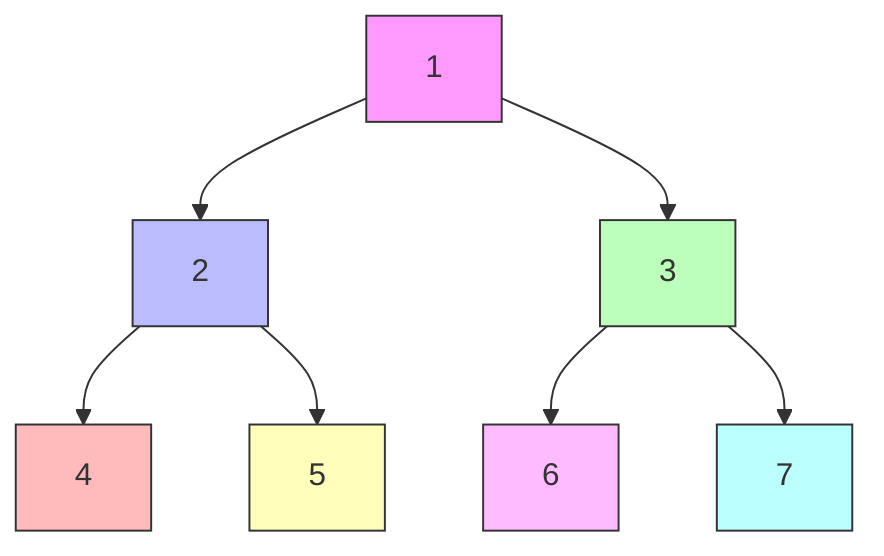
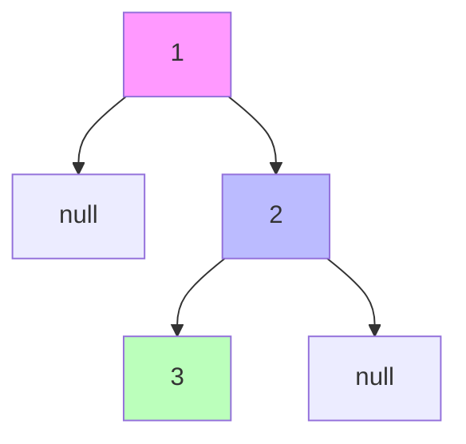
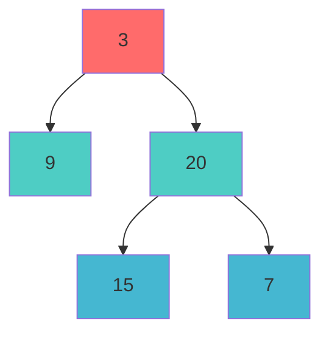

# Day 30: 树遍历

## 📅 学习目标

今天我们将深入学习二叉树的核心操作——遍历，以及C++多线程编程中至关重要的同步机制——互斥锁。通过今天的学习，你将掌握四种经典的二叉树遍历方式（前序、中序、后序、层序），理解它们各自的访问顺序和应用场景。同时，你将学会如何使用 `std::mutex` 保护共享数据，避免多线程环境下的数据竞争问题。此外，我们还将探讨 Effective Modern C++ 中关于异步任务执行策略的重要建议，帮助你写出更高效、更可靠的多线程代码。

**本日学习重点：**
- 掌握四种二叉树遍历方式的递归与迭代实现
- 理解 `std::mutex` 的基本用法和死锁预防策略
- 学习 `std::launch::async` 策略的正确使用方式
- 完成两道经典的二叉树遍历 LeetCode 题目

---

## 📖 知识点一：二叉树遍历

### 概念定义

二叉树遍历是指按照某种特定顺序访问二叉树中的每个节点，且每个节点恰好被访问一次。遍历是二叉树上最基础也是最重要的操作，它是许多树相关算法的基础。根据访问根节点的时机不同，遍历方式主要分为四种：前序遍历、中序遍历、后序遍历和层序遍历。

前三种遍历（前序、中序、后序）属于深度优先遍历（DFS）的范畴，它们沿着树的深度方向尽可能深地搜索，直到到达叶子节点再回溯。而层序遍历属于广度优先遍历（BFS），它按照从上到下、从左到右的顺序逐层访问节点。不同的遍历方式在表达式求值、语法分析、序列化与反序列化等场景中有着各自独特的应用价值。

### 四种遍历方式详解

#### 1. 前序遍历（Pre-order Traversal）

**访问顺序：根节点 → 左子树 → 右子树**

前序遍历的特点是"根优先"，即在任何子树被访问之前，先访问其根节点。这种遍历方式的名称"前序"正是来源于根节点在访问顺序中的"前"位置。前序遍历在实际应用中常用于：复制二叉树、计算表达式树的前缀表达式（波兰表示法）、序列化二叉树结构等场景。

遍历过程中，当我们访问一个节点时，首先处理该节点的数据，然后递归地遍历其左子树，最后递归地遍历其右子树。这种"先处理后遍历"的模式使得前序遍历非常适合需要"自顶向下"处理问题的场景。

#### 2. 中序遍历（In-order Traversal）

**访问顺序：左子树 → 根节点 → 右子树**

中序遍历的特点是根节点在左右子树"中间"被访问，这也是"中序"名称的由来。对于二叉搜索树（BST），中序遍历能够按照升序输出所有节点值，这一特性使得中序遍历在BST相关操作中具有特殊的重要性。

在实际应用中，中序遍历常用于：二叉搜索树的有序输出、表达式树的中缀表达式生成、验证二叉搜索树的有效性等。中序遍历的递归过程体现了"先深入再处理"的思想，先完全处理左子树后，才处理当前节点，最后处理右子树。

#### 3. 后序遍历（Post-order Traversal）

**访问顺序：左子树 → 右子树 → 根节点**

后序遍历的特点是根节点"最后"被访问，只有在左右子树都遍历完成后，才会访问根节点。这种"自底向上"的访问模式使得后序遍历特别适合需要先处理子节点再处理父节点的场景。

后序遍历的经典应用包括：计算表达式树的后缀表达式（逆波兰表示法）、计算目录占用的磁盘空间（先计算子目录，再汇总）、释放二叉树的内存（先释放子节点，再释放根节点）。在这些问题中，必须先获得子节点的信息，才能正确处理父节点。

#### 4. 层序遍历（Level-order Traversal）

**访问顺序：从上到下，从左到右，逐层访问**

层序遍历按照树的层级从上到下，每一层从左到右依次访问所有节点。与前三种深度优先遍历不同，层序遍历是广度优先的体现，它需要借助队列这种数据结构来实现。

层序遍历在实际应用中非常广泛：计算树的最大深度、判断是否为完全二叉树、找出每一层的最右节点（右视图问题）、二叉树的序列化与反序列化等。层序遍历天然地保持了节点的"邻居关系"，使得它非常适合处理需要按层级处理节点的问题。

### Mermaid 图示：遍历过程演示

下面我们用一个具体的二叉树来展示四种遍历的结果：



**四种遍历结果：**
| 遍历方式 | 访问顺序 | 结果序列 |
|---------|---------|---------|
| 前序遍历 | 根→左→右 | 1, 2, 4, 5, 3, 6, 7 |
| 中序遍历 | 左→根→右 | 4, 2, 5, 1, 6, 3, 7 |
| 后序遍历 | 左→右→根 | 4, 5, 2, 6, 7, 3, 1 |
| 层序遍历 | 逐层从左到右 | 1, 2, 3, 4, 5, 6, 7 |

### 递归与迭代实现对比

**递归实现**的代码简洁优雅，直接反映了遍历的逻辑定义。以前序遍历为例，递归版本只需三行核心代码：访问根节点、递归左子树、递归右子树。递归实现的缺点是对于深度很大的树，可能导致栈溢出。

**迭代实现**使用显式的栈（前/中/后序）或队列（层序）来模拟递归过程。迭代实现虽然代码更复杂，但可以避免栈溢出问题，并且在某些情况下可以进行优化。对于后序遍历，迭代实现尤其需要注意处理"何时访问根节点"的判断逻辑。

```cpp
// 前序遍历 - 递归版本
void preorder(TreeNode* root, vector<int>& result) {
    if (root == nullptr) return;
    result.push_back(root->val);      // 访问根节点
    preorder(root->left, result);     // 遍历左子树
    preorder(root->right, result);    // 遍历右子树
}

// 前序遍历 - 迭代版本
vector<int> preorderTraversal(TreeNode* root) {
    vector<int> result;
    stack<TreeNode*> stk;
    if (root) stk.push(root);
    
    while (!stk.empty()) {
        TreeNode* node = stk.top(); stk.pop();
        result.push_back(node->val);
        if (node->right) stk.push(node->right);  // 右孩子先入栈
        if (node->left) stk.push(node->left);    // 左孩子后入栈（先出）
    }
    return result;
}
```

---

## 📖 知识点二：mutex 互斥锁

### 概念定义

在多线程编程中，多个线程可能同时访问同一块内存区域（共享数据）。当至少有一个线程在写入数据时，如果没有适当的同步机制，就会产生数据竞争（Data Race），导致程序行为不可预测，产生难以调试的bug。`std::mutex`（互斥锁）是C++11引入的基本同步原语，用于保护共享数据，确保同一时刻只有一个线程能够访问临界区。

互斥锁的工作原理类似于一把钥匙：线程在进入临界区之前必须先"获取锁"（lock），离开时"释放锁"（unlock）。当一个线程持有锁时，其他试图获取同一把锁的线程将被阻塞，直到锁被释放。这种机制保证了临界区内代码的原子性执行。

### 基本使用方法

C++11 提供了 `std::mutex` 类，其核心操作包括：

- `lock()`：获取锁。如果锁已被其他线程持有，当前线程将阻塞等待。
- `unlock()`：释放锁。必须由持有锁的线程调用。
- `try_lock()`：尝试获取锁。如果锁可用则获取并返回 true；否则立即返回 false，不阻塞。

```cpp
#include <mutex>
#include <thread>
#include <iostream>

std::mutex mtx;
int shared_counter = 0;

void increment(int iterations) {
    for (int i = 0; i < iterations; ++i) {
        mtx.lock();
        ++shared_counter;  // 临界区：受保护的操作
        mtx.unlock();
    }
}

int main() {
    std::thread t1(increment, 10000);
    std::thread t2(increment, 10000);
    
    t1.join();
    t2.join();
    
    std::cout << "Counter: " << shared_counter << std::endl;  // 正确输出 20000
    return 0;
}
```

### 死锁问题与预防

**死锁（Deadlock）** 是多线程编程中的经典问题，指两个或多个线程互相等待对方释放锁，导致所有相关线程都无法继续执行的情况。死锁产生的四个必要条件（Coffman条件）：

1. **互斥条件**：资源只能被一个线程占用
2. **持有并等待**：线程持有资源同时等待其他资源
3. **不可剥夺**：资源不能被强制抢占
4. **循环等待**：存在线程等待的循环链

**预防死锁的常用策略：**

1. **按固定顺序加锁**：当需要同时获取多把锁时，所有线程都按相同顺序获取
2. **使用 `std::lock` 一次性获取多把锁**：该函数使用避免死锁的算法
3. **限制锁的持有时间**：尽快释放锁，减少锁的争用
4. **避免嵌套锁**：在持有锁的情况下，不要再尝试获取其他锁

```cpp
// 死锁示例
std::mutex mtx1, mtx2;

void deadlock_thread1() {
    mtx1.lock();
    // ... 一些操作
    mtx2.lock();  // 等待 mtx2，但 thread2 持有 mtx2
    mtx2.unlock();
    mtx1.unlock();
}

void deadlock_thread2() {
    mtx2.lock();
    // ... 一些操作
    mtx1.lock();  // 等待 mtx1，但 thread1 持有 mtx1 -> 死锁！
    mtx1.unlock();
    mtx2.unlock();
}

// 正确做法：使用 std::lock 一次性获取
void safe_thread() {
    std::lock(mtx1, mtx2);  // 原子性地获取两把锁，避免死锁
    // ... 临界区操作
    mtx1.unlock();
    mtx2.unlock();
}
```

### lock_guard 与 RAII

手动调用 `lock()` 和 `unlock()` 存在隐患：如果临界区代码抛出异常，`unlock()` 可能永远不会被执行，导致死锁。C++11 提供的 `std::lock_guard` 利用 RAII（资源获取即初始化）机制，在构造时自动获取锁，在析构时自动释放锁，无论是否发生异常。

```cpp
void safe_increment() {
    std::lock_guard<std::mutex> lock(mtx);  // 构造时自动 lock()
    ++shared_counter;
    // 函数结束，lock_guard 析构时自动 unlock()
    // 即使抛出异常，也能正确释放锁
}
```

C++17 进一步提供了 `std::scoped_lock`，它可以同时管理多把互斥锁，使用更加灵活。同时，`std::unique_lock` 提供了比 `lock_guard` 更丰富的功能，如延迟加锁、条件变量配合等。

```cpp
// C++17 scoped_lock 同时管理多把锁
void safe_multi_lock() {
    std::scoped_lock lock(mtx1, mtx2);  // 自动获取并释放两把锁
    // ... 临界区操作
}
```

---

## 📖 知识点三：EMC++ Item 36-37

### Item 36: 如果异步是必要的，使用 std::launch::async

`std::async` 是 C++11 提供的异步任务执行工具，它返回一个 `std::future` 对象，可以通过 `get()` 方法获取任务结果。然而，`std::async` 的默认行为可能出乎你的意料。

默认情况下，`std::async` 使用 `std::launch::async | std::launch::deferred` 作为启动策略，这意味着运行时可以自行选择是立即创建新线程异步执行（async），还是延迟到 `future::get()` 被调用时在当前线程同步执行（deferred）。这种不确定性可能导致性能问题甚至死锁。

```cpp
// 默认策略的不确定行为
auto future1 = std::async(doWork);  // 可能异步，可能延迟执行

// 明确指定异步执行
auto future2 = std::async(std::launch::async, doWork);  // 保证创建新线程
```

**为什么应该优先使用 `std::launch::async`？**

1. **可预测性**：明确知道任务会在独立线程中执行
2. **避免死锁**：延迟执行可能导致主线程等待一个永远不会开始的任务
3. **真正的并行**：利用多核处理器的并行能力

一个经典的死锁场景：

```cpp
void potential_deadlock() {
    auto future = std::async([]{
        std::cout << "Task running\n";
    });
    future.get();  // 如果是 deferred 策略，任务在此处同步执行
                   // 如果有复杂的线程依赖，可能导致死锁
}
```

### Item 37: 确保所有路径上 std::future 都是不可忽视的

当使用 `std::async` 创建异步任务时，返回的 `std::future` 对象会在其析构函数中阻塞等待任务完成。这意味着，如果你不关心任务的返回值而直接丢弃 future，程序会意外地变成同步执行。

```cpp
// 问题代码：future 被丢弃，析构时阻塞
void wrong_way() {
    std::async(std::launch::async, []{
        // 长时间运行的任务
        std::this_thread::sleep_for(std::chrono::seconds(5));
    });
    // future 在此处析构，阻塞等待任务完成！
    // 这违背了异步执行的初衷
}

// 正确做法：显式处理 future
void right_way() {
    auto future = std::async(std::launch::async, []{
        // 长时间运行的任务
        std::this_thread::sleep_for(std::chrono::seconds(5));
    });
    // 可以在这里做其他事情
    doOtherWork();
    // 需要结果时再等待
    future.get();  // 或 future.wait()
}
```

**重要原则：**
- 不要忽视 `std::async` 返回的 `std::future`
- 如果不需要结果，至少调用 `future.wait()` 或 `future.get()` 来明确等待时机
- 考虑使用线程池等更可控的并发方案替代 `std::async`

---

## 🎯 LeetCode 刷题

### 讲解题：LC 94 二叉树的中序遍历

#### 题目概述

给定一个二叉树的根节点 `root`，返回它的**中序遍历**结果。中序遍历的访问顺序是：左子树 → 根节点 → 右子树。

**示例输入输出：**
```
输入: root = [1,null,2,3]
     1
      \
       2
      /
     3

输出: [1,3,2]
```

#### 形象化提示

想象你是一位考古学家，正在探索一座树形的古墓：
1. 你总是先深入**左侧**的通道，直到无路可走
2. 在最深处，你**记录**当前位置的宝藏（访问节点）
3. 然后回溯，看看有没有**右侧**的通道可以探索
4. 这就是"左→根→右"的探索模式



**遍历过程：**
1. 从根节点 1 开始，尝试深入左子树 → 空，返回
2. 访问当前节点 1 → 记录 [1]
3. 进入右子树（节点 2）
4. 尝试深入左子树（节点 3）
5. 节点 3 无左子树 → 访问 3 → 记录 [1, 3]
6. 节点 3 无右子树 → 返回节点 2
7. 访问节点 2 → 记录 [1, 3, 2]
8. 完成！

#### 解题思路

**方法一：递归（推荐初学者）**

递归是最直观的实现方式，代码简洁易懂：
1. 如果当前节点为空，直接返回
2. 递归遍历左子树
3. 记录当前节点值
4. 递归遍历右子树

**方法二：迭代（使用栈）**

迭代方式模拟递归的调用栈：
1. 使用一个指针从根节点开始，一路向左，沿途节点入栈
2. 当无法继续向左时，弹出栈顶节点并访问
3. 然后转向该节点的右子树，重复上述过程

```cpp
// 迭代版本
vector<int> inorderTraversal(TreeNode* root) {
    vector<int> result;
    stack<TreeNode*> stk;
    TreeNode* curr = root;
    
    while (curr != nullptr || !stk.empty()) {
        // 一路向左，入栈
        while (curr != nullptr) {
            stk.push(curr);
            curr = curr->left;
        }
        // 弹出并访问
        curr = stk.top();
        stk.pop();
        result.push_back(curr->val);
        // 转向右子树
        curr = curr->right;
    }
    return result;
}
```

**复杂度分析：**
- 时间复杂度：O(n)，每个节点访问一次
- 空间复杂度：O(h)，h 为树的高度（栈的最大深度）

---

### 实战题：LC 102 二叉树的层序遍历

#### 题目概述

给定一个二叉树，返回其节点值的**层序遍历**结果（按层次从上到下，从左到右）。

**示例输入输出：**
```
输入: root = [3,9,20,null,null,15,7]
     3
    / \
   9  20
     /  \
    15   7

输出: [[3], [9,20], [15,7]]
```

#### 形象化提示

想象你站在一座金字塔前，需要从上到下记录每一层的人数：
1. 站在最顶层（第0层），记录人数
2. 然后走向下一层，从左到右记录这一层所有人
3. 继续向下，直到最底层

这就像**电梯停靠**：每一层都要停一下，看看这一层有哪些人（节点），然后继续下一层。



**颜色说明：** 红色为第0层，青色为第1层，蓝色为第2层

#### 解题思路

**核心算法：广度优先搜索（BFS）+ 队列**

层序遍历天然适合使用队列来实现：
1. 将根节点入队
2. 循环处理队列，每次处理一层的所有节点
3. 对于每个出队的节点，将其子节点入队
4. 记录每一层的节点值

**关键技巧：如何区分不同层？**

方法一：使用两个变量 `currentLevelSize` 和 `nextLevelSize`
方法二：在每层开始时，记录当前队列大小，这就是该层的节点数

```cpp
vector<vector<int>> levelOrder(TreeNode* root) {
    vector<vector<int>> result;
    if (root == nullptr) return result;
    
    queue<TreeNode*> q;
    q.push(root);
    
    while (!q.empty()) {
        int levelSize = q.size();  // 当前层的节点数
        vector<int> currentLevel;
        
        for (int i = 0; i < levelSize; ++i) {
            TreeNode* node = q.front();
            q.pop();
            currentLevel.push_back(node->val);
            
            if (node->left) q.push(node->left);
            if (node->right) q.push(node->right);
        }
        result.push_back(currentLevel);
    }
    return result;
}
```

**复杂度分析：**
- 时间复杂度：O(n)，每个节点入队出队各一次
- 空间复杂度：O(w)，w 为树的最大宽度（队列最大容量）

---

## 🚀 运行代码

### 编译与运行

```bash
# 进入 day_30 目录
cd /home/z/my-project/download/week_05/day_30

# 添加执行权限并运行
chmod +x build_and_run.sh
./build_and_run.sh
```

### 预期输出

程序将依次演示：
1. 四种树遍历的结果对比
2. mutex 保护共享变量的多线程示例
3. EMC++ Item 36-37 的异步策略演示
4. LeetCode 94 和 102 的解题代码运行

---

## 📚 相关术语

| 术语 | 英文 | 解释 |
|------|------|------|
| 前序遍历 | Pre-order Traversal | 先访问根节点，再遍历左右子树 |
| 中序遍历 | In-order Traversal | 先遍历左子树，再访问根节点，最后遍历右子树 |
| 后序遍历 | Post-order Traversal | 先遍历左右子树，最后访问根节点 |
| 层序遍历 | Level-order Traversal | 按层级从上到下、从左到右访问节点 |
| 互斥锁 | Mutex | 保证同一时刻只有一个线程访问临界区的同步原语 |
| 死锁 | Deadlock | 多个线程互相等待对方释放资源，导致无法继续执行 |
| RAII | Resource Acquisition Is Initialization | 资源获取即初始化，利用对象生命周期管理资源 |
| 临界区 | Critical Section | 需要互斥访问的代码区域 |
| 数据竞争 | Data Race | 多线程并发访问共享数据且至少有一个写入操作 |
| 异步策略 | Launch Policy | 决定 std::async 如何执行任务的策略 |

---

## 💡 学习提示

1. **理解遍历本质**：四种遍历方式的核心区别在于访问根节点的时机不同，理解这一点有助于记忆和区分它们。

2. **递归与迭代的选择**：递归代码简洁但可能栈溢出；迭代代码复杂但更可控。建议先用递归理解逻辑，再学习迭代实现。

3. **mutex 使用原则**：
   - 优先使用 `std::lock_guard` 或 `std::unique_lock`，避免手动 lock/unlock
   - 尽量减少临界区代码量
   - 获取多把锁时使用 `std::lock` 避免死锁

4. **std::async 的陷阱**：
   - 默认策略可能是延迟执行，不保证真正的异步
   - 不要忽视返回的 `std::future` 对象

5. **刷题技巧**：
   - 中序遍历是二叉搜索树（BST）相关题目的基础
   - 层序遍历的 BFS 模板可应用于最短路径等问题

---

## 🔗 参考资料

1. [C++ Reference - std::mutex](https://en.cppreference.com/w/cpp/thread/mutex)
2. [C++ Reference - std::async](https://en.cppreference.com/w/cpp/thread/async)
3. [LeetCode 94 - Binary Tree Inorder Traversal](https://leetcode.com/problems/binary-tree-inorder-traversal/)
4. [LeetCode 102 - Binary Tree Level Order Traversal](https://leetcode.com/problems/binary-tree-level-order-traversal/)
5. *Effective Modern C++* by Scott Meyers - Item 36 & 37
6. *C++ Concurrency in Action* by Anthony Williams
