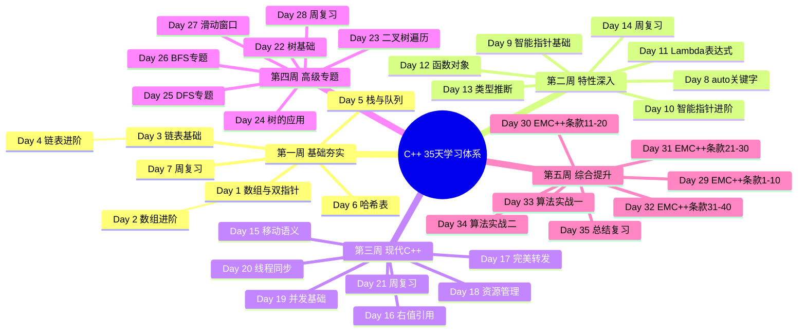

# Day 35: 35天学习总结 - 从入门到精通的C++之旅

> 恭喜你完成了35天的C++学习之旅！今天我们将系统性地回顾整个学习内容，巩固知识点，并为未来的进阶学习指明方向。

---

## 📅 学习目标

- **系统回顾**：全面梳理35天学习的核心知识点，形成完整的知识体系框架
- **融会贯通**：理解数据结构、C++特性、设计原则与算法之间的内在联系
- **查漏补缺**：通过综合检验题发现知识盲区，针对性强化薄弱环节
- **能力跃升**：完成两道经典LeetCode题目，检验综合应用能力
- **展望未来**：明确进阶学习路径，为持续成长奠定基础

---

## 📖 35天知识体系总览



---

## 📖 知识点回顾一：数据结构

数据结构是程序设计的基石，理解各种数据结构的特性、操作复杂度和适用场景，是编写高效代码的前提。在过去的35天里，我们系统学习了以下核心数据结构：

### 数组 (Array)

数组是最基础的数据结构，它在内存中连续存储元素，支持O(1)时间的随机访问。我们学习了双指针技巧（快慢指针、对撞指针）来解决数组去重、两数之和等问题。滑动窗口技术则是处理连续子数组问题的利器，能够在O(n)时间内解决子数组和、最长连续子序列等问题。数组的缺点是插入和删除操作需要移动大量元素，时间复杂度为O(n)。

### 链表 (Linked List)

链表通过指针连接节点，克服了数组插入删除效率低的问题。单向链表只支持单向遍历，双向链表支持双向遍历，循环链表的尾节点指向头节点。我们学习了虚拟头节点技巧简化边界处理、快慢指针检测环和寻找中点、递归与迭代两种反转链表方法。链表的随机访问需要O(n)时间，这是它相对于数组的主要劣势。

### 栈与队列 (Stack & Queue)

栈遵循后进先出(LIFO)原则，常用于表达式求值、括号匹配、函数调用栈等场景。单调栈是解决下一更大元素、柱状图最大矩形等问题的神器。队列遵循先进先出(FIFO)原则，是BFS遍历和任务调度的核心数据结构。双端队列(deque)结合了栈和队列的优点，滑动窗口最值问题常使用单调双端队列解决。优先队列(堆)能够在O(log n)时间内获取最值，是Top K问题的标准解法。

### 哈希表 (Hash Table)

哈希表通过哈希函数将键映射到数组索引，实现O(1)平均时间的查找、插入和删除。我们学习了哈希冲突的两种主要解决方法：链地址法和开放寻址法。unordered_map和unordered_set是C++ STL提供的哈希容器，常用于计数、去重、缓存等场景。哈希表的缺点是不支持有序遍历，最坏情况下操作复杂度退化为O(n)。

### 树 (Tree)

树是一种层次化的数据结构，二叉树是最常见的树结构。我们学习了前序、中序、后序三种深度优先遍历，以及层序广度优先遍历。二叉搜索树(BST)支持高效查找、插入和删除，是平衡树的基础。递归是解决树问题的核心思维，分治思想将大问题分解为子树问题。高级树结构如AVL树、红黑树、B树、字典树等在数据库和文件系统中有广泛应用。

```cpp
// 数据结构复杂度速查表
// ┌─────────────┬──────────┬──────────┬──────────┬──────────┐
// │  操作       │  访问    │  查找    │  插入    │  删除    │
// ├─────────────┼──────────┼──────────┼──────────┼──────────┤
// │  数组       │  O(1)    │  O(n)    │  O(n)    │  O(n)    │
// │  链表       │  O(n)    │  O(n)    │  O(1)    │  O(1)    │
// │  栈         │  O(n)    │  O(n)    │  O(1)    │  O(1)    │
// │  队列       │  O(n)    │  O(n)    │  O(1)    │  O(1)    │
// │  哈希表     │  N/A     │  O(1)*   │  O(1)*   │  O(1)*   │
// │  BST        │  O(log n)│  O(log n)│  O(log n)│  O(log n)│
// └─────────────┴──────────┴──────────┴──────────┴──────────┘
// * 平均时间复杂度
```

---

## 📖 知识点回顾二：C++11特性

C++11是C++语言的一次重大升级，引入了大量现代编程特性，使C++更加安全、高效、易用。以下是我们在35天中学习的核心C++11特性：

### auto关键字与类型推导

auto关键字让编译器自动推导变量类型，简化了冗长的类型声明，特别是迭代器和模板类型的声明。配合decltype可以获取表达式的类型，用于返回类型推导。auto不能推导数组类型、函数参数类型和非静态成员变量。使用auto时要注意初始化表达式必须完整，且推导结果可能出乎意料（如auto推导出引用还是副本）。

```cpp
// auto使用示例
auto iter = my_map.begin();  // 替代 std::map<K,V>::iterator
auto lambda = [](int x) { return x * 2; };  // 推导lambda类型
decltype(5 + 3.0) result;  // double类型
```

### 智能指针

智能指针是C++11最重要的特性之一，它通过RAII机制自动管理内存，有效防止内存泄漏。unique_ptr独占资源所有权，不能拷贝但可以移动，是零开销的智能指针。shared_ptr共享资源所有权，通过引用计数管理生命周期，但可能产生循环引用问题。weak_ptr是shared_ptr的观察者，不增加引用计数，用于打破循环引用和观察资源状态。使用make_unique和make_shared函数创建智能指针更加安全和高效。

```cpp
// 智能指针最佳实践
auto uptr = std::make_unique<int>(42);
auto sptr = std::make_shared<int>(100);
std::weak_ptr<int> wptr = sptr;  // 观察shared_ptr
if (auto locked = wptr.lock()) {  // 安全访问
    std::cout << *locked << std::endl;
}
```

### Lambda表达式

Lambda表达式是匿名函数的语法糖，它使得在需要函数对象的地方可以直接定义行为。Lambda的捕获列表决定如何访问外部变量：[=]值捕获所有变量，[&]引用捕获所有变量，也可以指定变量名和捕获方式。Lambda可以指定返回类型（->Type），也可以省略让编译器推导。Lambda常用于STL算法的自定义比较器、回调函数、事件处理等场景。

```cpp
// Lambda表达式进阶用法
std::vector<int> nums = {3, 1, 4, 1, 5, 9, 2, 6};
// 自定义排序：偶数在前，奇数在后
std::sort(nums.begin(), nums.end(), 
    [](int a, int b) {
        return (a % 2 == b % 2) ? (a < b) : (a % 2 == 0);
    });
// 捕获外部变量
int threshold = 5;
auto count_above = [&nums, threshold]() {
    return std::count_if(nums.begin(), nums.end(),
        [threshold](int x) { return x > threshold; });
};
```

### 移动语义与右值引用

移动语义是C++11性能优化的核心特性，它允许资源所有权从一个对象转移到另一个对象，避免不必要的深拷贝。右值引用(T&&)用于绑定临时对象（右值），std::move将左值转换为右值引用。移动构造函数和移动赋值运算符是实现移动语义的关键。完美转发使用std::forward保持参数的值类别，配合万能引用(T&&)实现参数的精确传递。

```cpp
// 移动语义示例
class String {
    char* data;
    size_t len;
public:
    // 移动构造函数
    String(String&& other) noexcept 
        : data(other.data), len(other.len) {
        other.data = nullptr;  // 置空源对象
        other.len = 0;
    }
    // 完美转发
    template<typename T>
    void process(T&& arg) {
        do_something(std::forward<T>(arg));
    }
};
```

### 并发编程

C++11将线程支持纳入标准库，提供了thread、mutex、condition_variable等组件。std::thread创建和管理线程，支持传入函数对象和Lambda表达式。std::mutex保护共享资源，配合std::lock_guard和std::unique_lock实现RAII风格的锁管理。std::condition_variable实现线程间的等待/通知机制。std::atomic提供无锁原子操作，适用于简单的共享变量访问。std::async和std::future简化异步任务编程。

```cpp
// 并发编程示例
std::mutex mtx;
std::vector<int> results;

void worker(int start, int end) {
    for (int i = start; i < end; ++i) {
        std::lock_guard<std::mutex> lock(mtx);
        results.push_back(i * i);
    }
}

int main() {
    std::vector<std::thread> threads;
    for (int i = 0; i < 4; ++i) {
        threads.emplace_back(worker, i * 25, (i + 1) * 25);
    }
    for (auto& t : threads) t.join();
    // 异步任务
    auto future = std::async(std::launch::async, 
        []() { return 42; });
    std::cout << future.get() << std::endl;  // 42
}
```

---

## 📖 知识点回顾三：EMC++条款

《Effective Modern C++》是Scott Meyers的经典著作，总结了42条现代C++的最佳实践。以下是前40条条款的核心要点总结：

### 第一章：类型推导（条款1-4）

**条款1：理解模板类型推导** - 模板类型推导是理解auto和decltype的基础。推导规则分为三种情况：ParamType是指针或引用、ParamType是万能引用、ParamType既不是指针也不是引用。数组名和函数名会退化为指针，除非ParamType是引用。

**条款2：理解auto类型推导** - auto类型推导与模板类型推导基本相同，但auto假设大括号初始化列表为std::initializer_list，而模板不会。

**条款3：理解decltype** - decltype返回变量或表达式的确切类型，C++14支持decltype(auto)作为返回类型推导。

**条款4：学会查看推导出的类型** - 使用IDE、编译器错误信息、运行时类型识别(typeid)或Boost.TypeIndex查看推导结果。

### 第二章：auto（条款5-6）

**条款5：优先使用auto而非显式类型声明** - auto避免未初始化变量、冗长的类型声明、变量截断类型不匹配等问题。但要注意不可见的代理类型可能导致的性能问题。

**条款6：auto推导出非常规类型时需要显式类型初始化** - vector<bool>的operator[]返回代理对象，auto会推导为错误类型，应使用static_cast显式转换。

### 第三章：转向现代C++（条款7-10）

**条款7：区别使用()和{}创建对象** - 大括号初始化是最通用的初始化语法，禁止窄化转换，但可能匹配initializer_list重载。小括号初始化可能被解析为函数声明。

**条款8：优先使用nullptr而非0或NULL** - nullptr是std::nullptr_t类型，不会产生类型推断错误，避免重载决议歧义。

**条款9：优先使用别名声明而非typedef** - using支持模板别名，语法更清晰，可以用于模板元编程。

**条款10：优先使用限定作用域的enum** - enum class避免命名污染，禁止隐式转换，可以前置声明并指定底层类型。

### 第四章：智能指针（条款17-22）

**条款17：理解特种成员函数的生成** - C++11中，移动构造/赋值在需要时自动生成，但如果声明了拷贝或析构函数，则不会生成移动操作。

**条款18：使用std::unique_ptr管理独占所有权资源** - unique_ptr小巧高效，可以自定义删除器，适合Pimpl模式。

**条款19：使用std::shared_ptr管理共享所有权资源** - shared_ptr通过控制块管理引用计数，避免用裸指针创建多个shared_ptr。

**条款20：使用std::weak_ptr管理类似缓存的资源** - weak_ptr不增加引用计数，lock()返回可能过期的shared_ptr。

**条款21：优先使用std::make_unique和std::make_shared** - 避免内存泄漏，减少内存分配次数，提高异常安全性。

**条款22：使用Pimpl模式时，在实现文件中定义特殊成员函数** - 将实现细节移到cpp文件，减少编译依赖，必须在实现文件中定义析构函数。

### 第五章：右值引用与移动语义（条款23-30）

**条款23：理解std::move和std::forward** - move执行到右值的无条件转换，forward仅在条件满足时执行转换。它们在运行时什么也不做，只是类型转换。

**条款24：区别万能引用和右值引用** - T&&在类型推导语境下是万能引用，包括模板参数和auto&&。const修饰的右值引用不是万能引用。

**条款25：右值引用使用std::move，万能引用使用std::forward** - 右值引用绑定到右值，移动是合适的；万能引用可能是左值或右值，需要精确转发。

**条款26：避免万能引用重载** - 万能引用匹配几乎所有类型，会导致重载决议意外匹配。使用标签分发或限制模板参数来替代。

**条款27：熟悉万能引用重载的替代方案** - 使用const T&、值传递、标签分发、SFINAE等技术避免万能引用重载问题。

**条款28：理解引用折叠** - 引用折叠规则：只有两个右值引用折叠为右值引用，其他情况都折叠为左值引用。这是万能引用和完美转发的基础。

**条款29：假设移动操作不存在、不便宜、不被使用** - 移动操作可能未定义、可能比复制更快但非O(1)、可能在异常情况下被禁用。

**条款30：熟悉完美转发的失败情况** - 大括号初始化、空指针0、重载函数名、位域等不能完美转发。

### 第六章：Lambda表达式（条款31-34）

**条款31：避免默认捕获模式** - 引用捕获可能导致悬垂引用，值捕获可能误以为捕获了指针所指向的对象。显式指定捕获变量更安全。

**条款32：使用初始化捕获将对象移入闭包** - C++14支持初始化捕获，可以移动捕获对象、捕获表达式结果。

**条款33：对std::forward的万能引用使用auto&&** - auto&&配合decltype可以在Lambda中完美转发捕获的万能引用。

**条款34：优先使用Lambda而非std::bind** - Lambda可读性好，支持内联，表达式求值时机清晰，效率更高。

### 第七章：并发API（条款35-40）

**条款35：优先使用基于任务的编程而非基于线程的编程** - std::async返回future，可以获取返回值和异常，避免线程管理和资源耗尽问题。

**条款36：如果异步是必要的，请指定std::launch::async** - 默认启动策略可能同步执行，需要异步行为时应显式指定。

**条款37：使std::thread在所有路径上不可join** - 析构joinable的thread会终止程序，使用RAII包装器确保thread被join或detach。

**条款38：关注未来析构行为** - future析构时，共享状态为deferred的任务会同步执行，其他情况只是减少计数。

**条款39：考虑单线程事件循环使用void返回的future** - void返回的future可以用于事件通知机制。

**条款40：对并发使用std::atomic，对特殊内存使用volatile** - atomic提供原子操作和内存序保证，volatile用于特殊内存映射，不提供线程安全。

---

## 📖 知识点回顾四：算法专题

算法是解决复杂问题的方法论，我们在35天中系统学习了多种经典算法技术：

### 双指针技巧

双指针技巧通过两个指针协同工作，将嵌套循环优化为单层循环，显著降低时间复杂度。**快慢指针**：一快一慢两个指针，用于检测链表环、寻找链表中点、删除倒数第N个节点。**对撞指针**：左右两端向中间移动，用于有序数组两数之和、三数之和、接雨水问题。**滑动窗口指针**：维护一个窗口，通过移动左右边界寻找满足条件的子数组。

```cpp
// 快慢指针检测环
bool hasCycle(ListNode* head) {
    ListNode *slow = head, *fast = head;
    while (fast && fast->next) {
        slow = slow->next;
        fast = fast->next->next;
        if (slow == fast) return true;
    }
    return false;
}

// 对撞指针两数之和
vector<int> twoSum(vector<int>& nums, int target) {
    int left = 0, right = nums.size() - 1;
    while (left < right) {
        int sum = nums[left] + nums[right];
        if (sum == target) return {left, right};
        else if (sum < target) ++left;
        else --right;
    }
    return {};
}
```

### 滑动窗口

滑动窗口是处理连续子数组/子字符串问题的通用模板。固定窗口大小问题直接维护窗口，可变窗口问题通过双指针动态调整窗口边界。核心思路是：先扩展右边界找到满足条件的窗口，再收缩左边界寻找最优解。

```cpp
// 最小覆盖子串模板
string minWindow(string s, string t) {
    unordered_map<char, int> need, window;
    for (char c : t) need[c]++;
    int left = 0, right = 0, valid = 0;
    int start = 0, len = INT_MAX;
    
    while (right < s.size()) {
        char c = s[right++];  // 扩展窗口
        if (need.count(c)) {
            window[c]++;
            if (window[c] == need[c]) valid++;
        }
        
        while (valid == need.size()) {  // 收缩窗口
            if (right - left < len) {
                start = left;
                len = right - left;
            }
            char d = s[left++];
            if (need.count(d)) {
                if (window[d] == need[d]) valid--;
                window[d]--;
            }
        }
    }
    return len == INT_MAX ? "" : s.substr(start, len);
}
```

### DFS深度优先搜索

DFS沿着一条路径一直走到底，再回溯探索其他分支。适用于路径搜索、组合枚举、连通性问题。递归是DFS最自然的实现方式，需要注意递归终止条件和剪枝优化。

```cpp
// DFS遍历二叉树
void dfs(TreeNode* root) {
    if (!root) return;
    // 前序位置
    dfs(root->left);
    // 中序位置
    dfs(root->right);
    // 后序位置
}

// DFS岛屿数量
int numIslands(vector<vector<char>>& grid) {
    int count = 0;
    for (int i = 0; i < grid.size(); ++i) {
        for (int j = 0; j < grid[0].size(); ++j) {
            if (grid[i][j] == '1') {
                dfs(grid, i, j);
                count++;
            }
        }
    }
    return count;
}
```

### BFS广度优先搜索

BFS逐层向外扩展，常用于最短路径问题。使用队列实现，先入先出保证按层遍历。无权图的最短路径可以用BFS直接求解。

```cpp
// BFS层序遍历
vector<vector<int>> levelOrder(TreeNode* root) {
    vector<vector<int>> result;
    if (!root) return result;
    
    queue<TreeNode*> q;
    q.push(root);
    
    while (!q.empty()) {
        int size = q.size();
        vector<int> level;
        for (int i = 0; i < size; ++i) {
            TreeNode* node = q.front(); q.pop();
            level.push_back(node->val);
            if (node->left) q.push(node->left);
            if (node->right) q.push(node->right);
        }
        result.push_back(level);
    }
    return result;
}

// BFS最短路径
int shortestPath(vector<vector<int>>& grid) {
    int m = grid.size(), n = grid[0].size();
    vector<vector<int>> dist(m, vector<int>(n, -1));
    queue<pair<int,int>> q;
    q.push({0, 0});
    dist[0][0] = 0;
    
    int dirs[4][2] = {{0,1}, {1,0}, {0,-1}, {-1,0}};
    while (!q.empty()) {
        auto [x, y] = q.front(); q.pop();
        for (auto& d : dirs) {
            int nx = x + d[0], ny = y + d[1];
            if (nx >= 0 && nx < m && ny >= 0 && ny < n && 
                grid[nx][ny] == 0 && dist[nx][ny] == -1) {
                dist[nx][ny] = dist[x][y] + 1;
                q.push({nx, ny});
            }
        }
    }
    return dist[m-1][n-1];
}
```

---

## 🎯 LeetCode 刷题

### 讲解题：LC 297 二叉树的序列化与反序列化

#### 📝 题目描述

序列化是将一个数据结构或者对象转换为连续的比特位的操作，进而可以将转换后的数据存储在一个文件或者内存中，同时也可以通过网络传输到另一个计算机环境，采取相反方式重构得到原数据。

请设计一个算法来实现二叉树的序列化与反序列化。这里不限定你的序列化/反序列化算法执行逻辑，你只需要保证一个二叉树可以被序列化为一个字符串并且将这个字符串反序列化为原始的树结构。

#### 💡 形象化提示

想象你要把一棵树"打包"成一个字符串，然后能在另一台电脑上"拆包"恢复成完全一样的树。就像把乐高积木拆散后用说明书记录每个积木的位置，收到的人可以照着说明书重新组装。

**关键洞察**：
- 树的遍历有前序、中序、后序、层序四种方式，都可以用于序列化
- 需要用特殊标记（如"null"或"#")表示空节点，否则无法唯一还原
- 前序遍历便于反序列化：先处理根节点，再递归处理左右子树
- 层序遍历更直观：按层输出，用队列辅助重建

#### 🔍 解题思路

**方法一：前序遍历DFS**

序列化：按照"根-左-右"的顺序遍历树，空节点用"null"表示，节点之间用分隔符连接。

反序列化：按分隔符拆分字符串，按照前序遍历的顺序重建树。递归处理：当前元素非null则创建节点，递归构建左子树和右子树。

```cpp
class Codec {
public:
    // 序列化：前序遍历
    string serialize(TreeNode* root) {
        string result;
        serializeHelper(root, result);
        return result;
    }
    
    void serializeHelper(TreeNode* root, string& result) {
        if (!root) {
            result += "null,";
            return;
        }
        result += to_string(root->val) + ",";
        serializeHelper(root->left, result);
        serializeHelper(root->right, result);
    }
    
    // 反序列化：前序遍历重建
    TreeNode* deserialize(string data) {
        queue<string> nodes;
        string node;
        stringstream ss(data);
        while (getline(ss, node, ',')) {
            nodes.push(node);
        }
        return deserializeHelper(nodes);
    }
    
    TreeNode* deserializeHelper(queue<string>& nodes) {
        string node = nodes.front();
        nodes.pop();
        if (node == "null") return nullptr;
        TreeNode* root = new TreeNode(stoi(node));
        root->left = deserializeHelper(nodes);
        root->right = deserializeHelper(nodes);
        return root;
    }
};
```

**方法二：层序遍历BFS**

```cpp
class Codec {
public:
    string serialize(TreeNode* root) {
        if (!root) return "null";
        string result;
        queue<TreeNode*> q;
        q.push(root);
        
        while (!q.empty()) {
            TreeNode* node = q.front(); q.pop();
            if (node) {
                result += to_string(node->val) + ",";
                q.push(node->left);
                q.push(node->right);
            } else {
                result += "null,";
            }
        }
        return result;
    }
    
    TreeNode* deserialize(string data) {
        queue<string> nodes;
        string node;
        stringstream ss(data);
        while (getline(ss, node, ',')) {
            nodes.push(node);
        }
        
        if (nodes.front() == "null") return nullptr;
        TreeNode* root = new TreeNode(stoi(nodes.front()));
        nodes.pop();
        queue<TreeNode*> q;
        q.push(root);
        
        while (!q.empty()) {
            TreeNode* parent = q.front(); q.pop();
            if (!nodes.empty()) {
                string left = nodes.front(); nodes.pop();
                if (left != "null") {
                    parent->left = new TreeNode(stoi(left));
                    q.push(parent->left);
                }
            }
            if (!nodes.empty()) {
                string right = nodes.front(); nodes.pop();
                if (right != "null") {
                    parent->right = new TreeNode(stoi(right));
                    q.push(parent->right);
                }
            }
        }
        return root;
    }
};
```

**复杂度分析**：
- 时间复杂度：O(n)，每个节点访问一次
- 空间复杂度：O(n)，存储序列化字符串或队列

---

### 实战题：LC 124 二叉树最大路径和

#### 📝 题目描述

二叉树中的路径被定义为一条节点序列，序列中每对相邻节点之间都存在一条边。同一个节点在一条路径序列中至多出现一次。该路径至少包含一个节点，且不一定经过根节点。

路径和是路径中各节点值的总和。给你一个二叉树的根节点root，返回其最大路径和。

#### 💡 形象化提示

想象树是一张连接的城市地图，每个城市有一个收益值（可正可负）。你要找到一条路线，使得总收益最大。这条路线可以从任意城市开始，到任意城市结束，但不能走回头路（一个城市只能经过一次）。

**关键洞察**：
- 路径可以是一条"直线"，也可以是一条"人字形"（在某个节点转弯）
- 对于每个节点，计算以其为转折点的最大路径和：左子树贡献 + 节点值 + 右子树贡献
- 递归返回的是以该节点为一端的最大路径和，只能选择一边（左边或右边或都不选）
- 全局变量维护最大路径和

#### 🔍 解题思路

**核心思想**：后序遍历 + 动态规划

1. 对于每个节点，计算其能贡献给父节点的最大路径和
2. 贡献值 = max(0, 左子树最大贡献) + max(0, 右子树最大贡献) + 当前节点值
3. 但返回给父节点时只能选择一边：max(max(左贡献, 右贡献), 0) + 当前节点值
4. 用全局变量记录过程中的最大路径和

```cpp
class Solution {
private:
    int maxSum = INT_MIN;
    
    // 返回以node为一端的最大路径和（贡献给父节点）
    int maxGain(TreeNode* node) {
        if (!node) return 0;
        
        // 递归计算左右子树贡献，负数贡献视为0（不选）
        int leftGain = max(maxGain(node->left), 0);
        int rightGain = max(maxGain(node->right), 0);
        
        // 以当前节点为转折点的路径和
        int pathSum = node->val + leftGain + rightGain;
        
        // 更新最大路径和
        maxSum = max(maxSum, pathSum);
        
        // 返回给父节点的贡献值（只能选一边）
        return node->val + max(leftGain, rightGain);
    }
    
public:
    int maxPathSum(TreeNode* root) {
        maxGain(root);
        return maxSum;
    }
};
```

**详细解释**：

1. **后序遍历**：先处理子树，再处理当前节点，这样我们才能知道子树的最大贡献

2. **贡献值计算**：
   - 左子树贡献 = max(左子树返回值, 0)，如果是负数就不选
   - 右子树贡献同理

3. **路径和计算**：
   - 以当前节点为"最高点"的路径：左贡献 + 节点值 + 右贡献
   - 这条路径无法延伸到父节点（因为已经用尽了左右两边）

4. **返回值**：
   - 只能选择一边延伸到父节点：节点值 + max(左贡献, 右贡献)

**复杂度分析**：
- 时间复杂度：O(n)，每个节点访问一次
- 空间复杂度：O(h)，递归栈深度为树高

---

## 📊 学习成果自测

通过以下问题检验你对35天学习内容的掌握程度：

### 数据结构篇

1. **数组**：给定一个有序数组，原地删除重复元素，使得每个元素最多出现两次，返回新长度。要求O(1)空间复杂度。

2. **链表**：如何判断链表是否有环？如果有环，如何找到环的入口节点？

3. **栈**：设计一个支持O(1)时间获取最小元素的栈。

4. **哈希表**：设计一个数据结构，支持O(1)时间的插入、删除和获取随机元素。

5. **树**：给定二叉树的前序和中序遍历序列，重建二叉树。

### C++特性篇

6. **auto**：以下代码中，a、b、c的类型分别是什么？
```cpp
int x = 10;
auto a = x;
auto& b = x;
auto&& c = 10;
```

7. **智能指针**：shared_ptr的引用计数是如何实现的？为什么是线程安全的？

8. **Lambda**：以下Lambda的捕获列表有什么问题？
```cpp
std::function<int()> createMultiplier(int factor) {
    return [&]() { return factor * 2; };
}
```

9. **移动语义**：解释std::move和std::forward的区别。

10. **并发**：如何避免死锁？RAII锁管理器是如何帮助的？

### EMC++条款篇

11. 为什么优先使用nullptr而不是NULL？

12. unique_ptr为什么比auto_ptr更安全？

13. 什么情况下编译器不会生成移动构造函数？

14. 为什么说"万能引用重载"是危险的？

15. volatile和atomic的区别是什么？

### 算法篇

16. 给定一个包含正负数的数组，找出和最大的连续子数组。

17. 给定一个字符串s和模式串p，实现支持'.'和'*'的正则表达式匹配。

18. 给定一个二维网格地图，计算岛屿的数量。

19. 给定一个无向图，判断是否为二分图。

20. 给定一棵二叉树，找到最深的叶子节点的最近公共祖先。

### 参考答案提示

<details>
<summary>点击查看答案提示</summary>

1. 双指针：快慢指针，快指针遍历，慢指针记录有效位置。

2. 快慢指针相遇则环存在；相遇后一指针从头开始，两指针同步移动，再次相遇即为入口。

3. 辅助栈记录最小值，或在栈节点中额外存储当前最小值。

4. 哈希表+数组：数组存储元素支持随机访问，哈希表存储值到索引的映射。

5. 前序第一个元素为根，在中序中找到根位置，左边为左子树，右边为右子树，递归处理。

6. a是int，b是int&，c是int&&（万能引用绑定右值）。

7. 控制块存储引用计数，使用原子操作保证线程安全。

8. 引用捕获局部变量factor，函数返回后factor被销毁，产生悬垂引用。

9. move无条件转换为右值，forward根据类型信息条件转换。

10. 按固定顺序获取锁；lock_guard/unique_lock自动释放锁，即使异常也会析构。

11. nullptr是std::nullptr_t类型，不会与整型重载混淆。

12. unique_ptr独占所有权，禁止拷贝，只能移动。

13. 声明了拷贝操作或析构函数时，移动操作不会自动生成。

14. 万能引用匹配几乎所有类型，会导致重载决议意外匹配。

15. volatile不保证原子性和内存序，atomic提供线程安全的原子操作。

16. 动态规划或Kadane算法，维护当前最大和全局最大。

17. 动态规划，dp[i][j]表示s[0:i]与p[0:j]是否匹配。

18. DFS/BFS遍历，访问过的标记为'0'，计数连通分量。

19. BFS染色，相邻节点颜色不同，冲突则非二分图。

20. BFS找最深层节点，递归找最近公共祖先。

</details>

---

## 🚀 运行代码

```bash
# 进入Day 35目录
cd /home/z/my-project/download/week_05/day_35

# 添加执行权限
chmod +x build_and_run.sh

# 编译并运行
./build_and_run.sh
```

### 预期输出

```
=== Day 35: 35天学习总结 ===

[数据结构知识体系]
数组: 访问O(1), 插入删除O(n)
链表: 访问O(n), 插入删除O(1)
哈希表: 平均O(1)查找插入删除
二叉搜索树: O(log n)查找插入删除

[C++11特性综合示例]
auto推导: 42 (int)
unique_ptr: 100
shared_ptr use_count: 2
Lambda结果: 30, 60, 90
移动语义: 资源已转移
线程并发: 任务完成

[EMC++条款复习]
条款5: auto优于显式类型声明
条款17: 理解特种成员函数生成
条款25: 右值引用用move，万能引用用forward
条款31: 避免默认捕获模式

[LC 297: 二叉树序列化]
原始树: 1 2 3 # # 4 5
序列化: 1,2,null,null,3,4,null,null,5,null,null,
反序列化: 1 2 3 # # 4 5
验证: 序列化/反序列化正确！

[LC 124: 最大路径和]
测试树: [-10,9,20,null,null,15,7]
最大路径和: 42
解释: 9 + 20 + 15 = 44 或 15 + 20 + 7 = 42
```

---

## 📚 相关术语汇总

| 术语 | 英文 | 定义 |
|------|------|------|
| 时间复杂度 | Time Complexity | 算法执行时间与输入规模的增长关系 |
| 空间复杂度 | Space Complexity | 算法占用空间与输入规模的增长关系 |
| RAII | Resource Acquisition Is Initialization | 资源获取即初始化，利用对象生命周期管理资源 |
| 右值引用 | Rvalue Reference | 绑定到右值的引用类型 T&& |
| 移动语义 | Move Semantics | 转移资源所有权而非复制 |
| 完美转发 | Perfect Forwarding | 保持参数原有值类别的转发 |
| 万能引用 | Universal Reference | 能同时接受左值和右值的引用 T&& |
| 引用折叠 | Reference Collapsing | 多层引用的简化规则 |
| 智能指针 | Smart Pointer | 自动管理内存的指针封装类 |
| 控制块 | Control Block | shared_ptr管理的引用计数等元数据 |
| Lambda表达式 | Lambda Expression | 匿名函数的语法糖 |
| 闭包 | Closure | Lambda捕获变量后生成的函数对象 |
| 深拷贝 | Deep Copy | 复制对象及其所有资源 |
| 浅拷贝 | Shallow Copy | 仅复制指针，共享资源 |
| DFS | Depth-First Search | 深度优先搜索 |
| BFS | Breadth-First Search | 广度优先搜索 |
| 前序遍历 | Preorder Traversal | 根-左-右 |
| 中序遍历 | Inorder Traversal | 左-根-右 |
| 后序遍历 | Postorder Traversal | 左-右-根 |
| 层序遍历 | Level Order Traversal | 按层从上到下、从左到右 |

---

## 💡 进阶学习建议

恭喜你完成了35天的C++学习之旅！这只是编程世界的入门，以下是进阶学习建议：

### 知识深化

1. **数据结构进阶**：学习红黑树、B+树、跳表、布隆过滤器等高级数据结构，理解它们在数据库和分布式系统中的应用。

2. **算法进阶**：深入研究动态规划、贪心算法、图论算法、字符串匹配算法，参加Codeforces/AtCoder等算法竞赛提升实战能力。

3. **C++深入**：学习模板元编程、C++17/20新特性（结构化绑定、协程、概念）、编译器优化技术。

### 实践项目

1. **系统编程**：实现一个简易数据库、HTTP服务器、内存池、线程池。

2. **开源贡献**：参与LLVM、Boost、folly等知名开源项目，学习工业级代码风格。

3. **性能优化**：学习性能分析工具（perf、VTune）、内存分析工具（Valgrind、ASan）、缓存优化技术。

### 推荐书籍

1. 《Effective C++》- Scott Meyers
2. 《More Effective C++》- Scott Meyers
3. 《Effective Modern C++》- Scott Meyers
4. 《C++ Concurrency in Action》- Anthony Williams
5. 《算法导论》- CLRS
6. 《编程珠玑》- Jon Bentley

### 在线资源

1. [cppreference.com](https://en.cppreference.com/) - C++标准库参考
2. [Compiler Explorer](https://godbolt.org/) - 在线查看编译结果
3. [LeetCode](https://leetcode.com/) - 算法练习平台
4. [C++ Core Guidelines](https://isocpp.github.io/CppCoreGuidelines/) - C++编码规范

---

## 🔗 参考资料

1. [C++ Reference](https://en.cppreference.com/)
2. [Effective Modern C++ - Scott Meyers](https://www.aristeia.com/EMC++.html)
3. [LeetCode题解](https://leetcode.com/problemset/)
4. [算法（第四版）- Robert Sedgewick](https://algs4.cs.princeton.edu/)
5. [C++ Core Guidelines](https://isocpp.github.io/CppCoreGuidelines/)

---

> "学习的目的不是为了记住所有知识，而是建立一套能够快速定位和解决问题的知识体系。35天只是一个开始，保持学习，持续进步！"

**祝你编程之路越走越远！** 🚀
