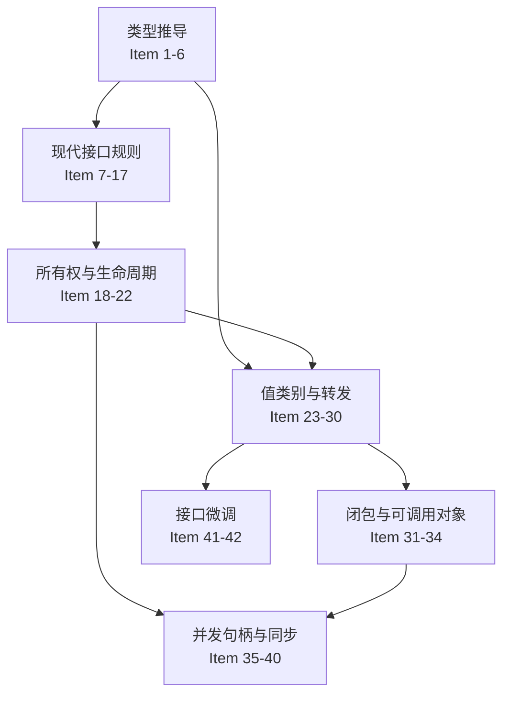

# Effective Modern C++ 教程

> 本教程基于 Scott Meyers 的《Effective Modern C++》，按 42 个条款完整整理。它是基础语法之后的“机制与工程实践深化篇”，不是零基础语法替代品。

建议先掌握 [C++ 基础学习教程](CPP基础学习教程.md) 中的函数、引用、类、模板和智能指针基础，再随 35 天主线分批学习。每个条款都应按“问题场景 → 错误写法 → 机制原因 → 正确写法 → 适用边界”理解，而不是只背标题。

如果只想查询标准版本、特性选型和仓库练习位置，先看 [现代 C++ 特性学习地图](../Modern_CPP_Features_Deep_Dive.md)；本教程承担的是 42 个条款的完整机制推导。每天的 README 只保留本条款与当天算法/工程动作的连接，不再复制这里的整段正文。

## 使用这份教程的方法

EMC++ 的 42 个条款不是彼此独立的技巧。它们建立在四条机制主线上：



学习每个条款时，至少回答七个问题：

1. 它试图防止哪一种真实错误？
2. 错误代码为什么可能通过编译？
3. 编译器进行了什么类型推导、重载决议或隐式生成？
4. 对象和资源的生命周期发生了什么？
5. 推荐写法改善了安全性、性能还是可维护性？
6. 推荐写法有什么成本，在哪些场景不适用？
7. 如何用一个最小实验或 `static_assert` 验证结论？

本教程的代码分为两类：完整可运行示例和用于展示编译失败的反例。反例会明确注释为“取消注释后应编译失败”，不要把它们当成可直接复制的完整程序。

---

## 目录

1. [类型推导](#1-类型推导)
2. [auto 关键字](#2-auto-关键字)
3. [转向现代 C++](#3-转向现代-c)
4. [智能指针](#4-智能指针)
5. [右值引用与移动语义](#5-右值引用与移动语义)
6. [Lambda 表达式](#6-lambda-表达式)
7. [并发 API](#7-并发-api)
8. [微调](#8-微调)

---

## 1. 类型推导

### Item 1: 理解模板类型推导
> 主线位置：[Week 1 总览](../week_01/README.md) · [Day 1](../week_01/day_01/README.md)


模板类型推导是理解 `auto` 和 `decltype` 的基础。当调用函数模板时，编译器会根据传入参数推导模板参数类型。

#### 为什么这是第一条

很多现代 C++ 代码把类型藏在模板、迭代器、Lambda 和工厂函数后面。代码仍然有精确类型，只是由编译器推导。如果不了解推导规则，就会误判是否发生复制、`const` 是否保留、数组是否退化，以及 `T&&` 到底是右值引用还是转发引用。

推导时要把两个结果分开写：

- `T`：模板参数被推导成什么。
- `ParamType`：把 `T` 代回声明后，函数参数最终是什么类型。

不要只回答其中一个，否则很容易在引用折叠处混乱。

```cpp
template<typename T>
void func(ParamType param);

func(expr);  // 编译器根据 expr 推导 T 和 ParamType
```

#### 情况1：ParamType 是指针或引用（非转发引用）

```cpp
template<typename T>
void func(T& param);  // ParamType 是 T&

void case1() {
    int x = 27;           // x 是 int
    const int cx = x;     // cx 是 const int
    const int& rx = x;    // rx 是 const int&
    
    func(x);   // T = int,       ParamType = int&
    func(cx);  // T = const int, ParamType = const int&
    func(rx);  // T = const int, ParamType = const int&
    // 注意：rx 的引用性被忽略，T 推导时不会保留引用
}
```

**推导规则**：
1. 如果 `expr` 是引用，忽略引用部分
2. 根据 `expr` 的类型匹配 `ParamType`，确定 `T`

#### 情况2：ParamType 是转发引用（书中称 Universal Reference）

```cpp
template<typename T>
void func(T&& param);  // T 被推导时是转发引用

void case2() {
    int x = 27;
    const int cx = x;
    
    func(x);   // x 是左值，T = int&,       ParamType = int&
    func(cx);  // cx 是左值，T = const int&, ParamType = const int&
    func(27);  // 27 是右值，T = int,       ParamType = int&&
    
    // 关键区别：
    // - 左值参数：T 推导为左值引用
    // - 右值参数：T 推导为非引用类型
}
```

> **为什么 `T&&` 能接左值？** 这里 `T` 被推成 `int&`，代入 `T&&` 得 `int& &&`——C++ 用**引用折叠**规则把它折成 `int&`，所以转发引用能同时接左值和右值。折叠机制详见 [Item 28](#item-28-理解引用折叠)，转发引用 vs 右值引用的判定见 [Item 24](#item-24-区分转发引用与右值引用)。本条先记结论，机制稍后展开。

#### 情况3：ParamType 既非指针也非引用（按值传递）

```cpp
template<typename T>
void func(T param);  // 按值传递

void case3() {
    int x = 27;
    const int cx = x;
    const int& rx = x;
    
    func(x);   // T = int, param = int
    func(cx);  // T = int, param = int  (const 被忽略)
    func(rx);  // T = int, param = int  (引用和 const 都被忽略)
    
    // 注意：param 是全新对象，顶层 const 和引用性都会被忽略
}
```

#### 数组参数的特殊处理

```cpp
template<typename T>
void func(T param);  // 按值传递

template<typename T>
void funcRef(T& param);  // 引用传递

void arrayCase() {
    const char name[] = "J. P. Briggs";
    
    func(name);     // T = const char*, param = const char*
                    // 数组退化为指针
    
    funcRef(name);  // T = const char[13], param = const char (&)[13]
                    // 引用传递保留数组类型
}

// 利用引用保留数组类型的特性，可以编写求数组大小的函数
template<typename T, size_t N>
constexpr size_t arraySize(T (&)[N]) {
    return N;
}
```

#### `const` 到底丢的是哪一层

按值传递会忽略的是**顶层 `const`**，因为参数是新对象；指针指向对象的**底层 `const`** 仍会保留：

```cpp
const char* const pointer = "hello";

template<typename T>
void byValue(T value);

byValue(pointer);
// T = const char*：指针自己的顶层 const 被忽略，所指字符的 const 保留
```

#### 条款边界与自测

模板推导规则不等于所有类型推导规则。`decltype` 有自己的一套规则，花括号初始化列表也不是普通表达式。学习完本条款后，应能在纸上推导 `T` 和参数类型，并用 `std::is_same_v` 验证，而不是依赖 `typeid` 猜测。

---

### Item 2: 理解 auto 类型推导
> 主线位置：[Week 1 总览](../week_01/README.md) · [Day 1](../week_01/day_01/README.md)


`auto` 类型推导与模板类型推导基本相同，但有一个例外：初始化列表。

可以把声明中的 `auto` 想象成模板中的 `T`，把其余修饰符想象成 `ParamType`：`auto` 类似按值，`auto&` 类似引用，`auto&&` 在发生推导时类似转发引用。因此 Item 1 不是模板程序员专属知识，它直接决定日常局部变量的类型。

```cpp
void autoDeduction() {
    auto x = 27;      // 情况3：按值传递
    auto& rx = x;     // 情况1：引用
    auto&& rr1 = x;   // 情况2：转发引用，x 是左值，rr1 是 int&
    auto&& rr2 = 27;  // 情况2：转发引用，27 是右值，rr2 是 int&&
    
    // 特殊情况：初始化列表
    auto a1 = {11};     // auto = std::initializer_list<int>
    auto a2 = {11, 22}; // auto = std::initializer_list<int>
    
    // 模板推导不支持初始化列表
    // template<typename T>
    // void f(T param);
    // f({11, 22});  // 错误！无法推导
}
```

#### auto 与模板推导的差异

```cpp
// auto 假设初始化列表为 std::initializer_list
auto x = {1, 2, 3};  // std::initializer_list<int>

// 函数模板不能自动推导初始化列表
template<typename T>
void func(T param);
// func({1, 2, 3});  // 编译错误

// 显式指定类型
void func2(std::initializer_list<int> param);
func2({1, 2, 3});  // OK
```

#### 容易混淆的花括号形式

```cpp
auto a = {1, 2, 3}; // std::initializer_list<int>
auto b{1};          // int：单元素直接列表初始化
// auto c{1, 2};    // 编译失败：直接列表初始化的 auto 只能有一个元素
// auto d = {1, 2.0}; // 编译失败：initializer_list 元素类型不一致
```

另外，C++14 的函数 `auto` 返回类型推导使用模板式规则，不会把单独的 `{1, 2, 3}` 推导成返回类型。版本与上下文都必须分清。

#### 工程建议

`auto` 应该减少类型重复，而不是隐藏业务语义。变量名要说明用途；如果精确数值类型影响协议、溢出或重载，应显式写出类型或使用带语义的别名。

---

### Item 3: 理解 decltype
> 主线位置：[Week 1 总览](../week_01/README.md) · [Day 1](../week_01/day_01/README.md)


`decltype` 返回给定表达式或变量名的精确类型，包括引用和 const 限定符。

`decltype` 有两套看似不一致、实际非常精确的规则：

1. 参数是未加括号的变量名或成员访问时，返回该实体的声明类型。
2. 其他表达式按值类别返回：左值表达式得到 `T&`，将亡值表达式得到 `T&&`，纯右值表达式得到 `T`。

这就是 `decltype(x)` 与 `decltype((x))` 不同的根本原因：前者走“实体声明类型”规则，后者的额外括号让它按普通左值表达式处理。

```cpp
void decltypeDemo() {
    int x = 0;
    const int cx = 0;
    
    decltype(x) a = x;    // int
    decltype(cx) b = cx;  // const int
    decltype((x)) c = x;  // int& (注意：双层括号返回引用)
    
    // decltype 在返回类型推导中的使用
    auto f = [](int x, int y) -> decltype(x + y) {
        return x + y;
    };
}
```

#### decltype(auto) 的使用

```cpp
// C++14 引入 decltype(auto)
// 结合 auto 的自动推导和 decltype 的精确类型保留

template<typename Container>
decltype(auto) getFirst(Container& c) {
    return c[0];  // 正确返回引用类型
}

void demo() {
    std::vector<int> v = {1, 2, 3};
    getFirst(v) = 100;  // OK: 返回 int&
}
```

#### `decltype(auto)` 最危险的地方

`decltype(auto)` 会把括号带来的引用也原样保留：

```cpp
decltype(auto) value_copy() {
    int value{42};
    return value;   // 返回 int
}

decltype(auto) dangling() {
    int value{42};
    return (value); // 返回 int&，函数结束后悬垂：严重错误
}
```

因此它适合编写需要透明保留返回类型的包装器，不适合为了“更自动”随意替换普通 `auto`。

---

### Item 4: 学会查看类型推导结果
> 主线位置：[Week 1 总览](../week_01/README.md) · [Day 1](../week_01/day_01/README.md)


这一条的重点不是收集打印类型的技巧，而是建立验证习惯。IDE 提示、编译器诊断、`static_assert` 和运行时输出看到的是不同层次的信息；涉及引用与 cv 限定时，运行时 RTTI 往往已经丢失部分类型信息。

#### 编译期诊断

```cpp
template<typename T>
class TypeDisplay;

void inspectTypes() {
    auto x = 27;
    // TypeDisplay<decltype(x)> t;  // 编译错误，显示 x 的类型
    
    // 使用 IDE 的类型提示或静态断言
    static_assert(std::is_same_v<decltype(x), int>);
}
```

#### 运行时输出

```cpp
#include <iostream>
#include <typeinfo>
#include <boost/type_index.hpp>

void printTypes() {
    const int x = 42;
    auto& rx = x;
    
    // typeid（不够精确，会忽略引用和 cv 限定符）
    std::cout << typeid(rx).name() << "\n";  // 可能输出 "int"
    
    // Boost.TypeIndex（推荐）
    using boost::typeindex::type_id_with_cvr;
    std::cout << type_id_with_cvr<decltype(rx)>().pretty_name() << "\n";
    // 输出 "int const&"
}
```

#### 推荐验证顺序

1. 先手工写出预期的 `T` 与最终类型。
2. 用 `static_assert(std::is_same_v<...>)` 做编译期验证。
3. 模板诊断困难时，用未定义的 `TypeDisplay<T>` 让编译器展示实例化类型。
4. 只有确实需要运行时展示时再用 Boost.TypeIndex；`typeid(...).name()` 的文本还可能经过实现相关编码。

真实代码中不要为了看类型保留故意编译失败的 `TypeDisplay`，它只是学习和调试工具。

---

## 2. auto 关键字

### Item 5: 优先使用 auto 而非显式类型声明
> 主线位置：[Week 1 总览](../week_01/README.md) · [Day 1](../week_01/day_01/README.md)


```cpp
void autoBenefits() {
    // 避免类型不匹配
    std::vector<int> v = {1, 2, 3};
    
    // 错误：std::vector<int>::size_type vs unsigned
    // unsigned sz = v.size();  // 可能导致比较错误
    
    auto sz = v.size();  // 正确：std::vector<int>::size_type
    
    // 避免意外构造
    std::unordered_map<std::string, int> m;
    
    // 错误：循环变量类型不对
    // for (const std::pair<std::string, int>& p : m) {
    //     // std::pair<std::string, int> vs std::pair<const std::string, int>
    //     // 导致拷贝构造！
    // }
    
    // 正确
    for (const auto& p : m) {
        // 类型自动匹配为 const std::pair<const std::string, int>&
    }
}
```

#### auto 的优势总结

1. **避免未初始化变量**：`auto x;` 编译错误，必须初始化
2. **避免类型截断**：自动匹配正确类型
3. **减少代码冗余**：简化复杂类型声明
4. **方便重构**：修改变量类型时自动传播

---

### Item 6: auto 推导的意外情况
> 主线位置：[Week 1 总览](../week_01/README.md) · [Day 2](../week_01/day_02/README.md)


```cpp
void autoTraps() {
    std::vector<bool> features = {true, false, true};
    
    // 危险：vector<bool> 的代理引用
    // bool& ref = features[0];  // 错误：vector<bool> 不支持引用
    
    auto ref = features[0];  // auto 推导为 std::vector<bool>::reference
    // 这是一个代理对象，不是 bool！
    
    // 潜在问题
    bool* pb = &ref;  // 错误：不能取代理对象的地址
    
    // 解决方案：显式类型转换
    bool value = features[0];  // OK
    
    // 或者使用 auto 后显式转换
    auto value2 = static_cast<bool>(features[0]);
}
```

#### 隐式代理类型

```cpp
// 矩阵类的代理引用示例
class Matrix {
public:
    class RowProxy {
    public:
        double& operator[](size_t col);
    };
    RowProxy operator[](size_t row);
};

void matrixDemo() {
    Matrix m;
    auto row = m[0];  // row 是 RowProxy，不是 double*
    
    // 显式声明类型避免意外
    // double& elem = m[0][1];  // 明确期望 double&
}
```

---

## 3. 转向现代 C++

### Item 7: 区分 () 和 {} 初始化语法
> 主线位置：[Week 1 总览](../week_01/README.md) · [Day 3](../week_01/day_03/README.md)


```cpp
void initSyntax() {
    // 传统初始化方式
    int x1 = 0;     // 拷贝初始化
    int x2(0);      // 直接初始化
    
    // C++11 统一初始化
    int x3{0};      // 列表初始化
    int x4 = {0};   // 拷贝列表初始化
    
    // 统一初始化的优势
    // 1. 可用于任何类型
    int arr[]{1, 2, 3};
    std::vector<int> v{1, 2, 3};
    
    // 2. 禁止窄化转换
    // int y = 3.14;   // 编译警告或接受
    // int z{3.14};    // 编译错误
    
    // 3. 免受最令人苦恼的解析困扰
    class Widget {
    public:
        Widget() {}
        Widget(int) {}
    };
    
    Widget w1();    // 函数声明！不是对象
    Widget w2{};    // 对象，调用默认构造
    
    // 统一初始化的陷阱
    std::vector<int> v1(10, 5);  // 10 个 5
    std::vector<int> v2{10, 5};  // {10, 5} 两个元素
}
```

#### initializer_list 的行为

```cpp
class Widget {
public:
    Widget() { std::cout << "Default\n"; }
    Widget(int) { std::cout << "Int\n"; }
    Widget(std::initializer_list<int>) { 
        std::cout << "Initializer list\n"; 
    }
};

void widgetDemo() {
    Widget w1;      // Default
    Widget w2(5);   // Int
    Widget w3{};    // Default（空初始化列表不匹配 initializer_list）
    Widget w4{5};   // Initializer list（优先匹配）
    Widget w5(5.0); // Int（窄化转换警告）
    // Widget w6{5.0}; // 编译错误（禁止窄化）
}
```

---

### Item 8: 优先使用 nullptr 而非 0 或 NULL
> 主线位置：[Week 1 总览](../week_01/README.md) · [Day 4](../week_01/day_04/README.md)


```cpp
void func(int);
void func(int*);

template<typename T>
void callFunc(T param) {
    func(param);
}

void nullptrDemo() {
    // 使用 0 或 NULL 的问题
    func(0);     // 调用 func(int)
    func(NULL);  // 调用 func(int)（NULL 是整数）
    
    // nullptr 解决歧义
    func(nullptr);  // 调用 func(int*)
    
    // nullptr 的类型安全
    auto p1 = 0;       // int
    auto p2 = NULL;    // int（通常）
    auto p3 = nullptr; // std::nullptr_t
    
    // 可以隐式转换为任意指针类型
    int* pi = nullptr;
    double* pd = nullptr;
    void (*pf)() = nullptr;
    
    // 模板中的优势
    callFunc(0);        // 传递 int
    callFunc(nullptr);  // 传递 std::nullptr_t，正确调用指针版本
}
```

---

### Item 9: 优先使用别名声明而非 typedef
> 主线位置：[Week 4 总览](../week_04/README.md) · [Day 22](../week_04/day_22/README.md)


```cpp
// typedef 的局限性
typedef void (*FuncPtr)(int, double);
typedef std::unique_ptr<std::unordered_map<std::string, std::vector<int>>> UPtrMap;

// using 别名声明（更清晰）
using FuncPtr = void (*)(int, double);
using UPtrMap = std::unique_ptr<std::unordered_map<std::string, std::vector<int>>>;

// 别名模板（typedef 不支持）
template<typename T>
using MyAllocList = std::list<T, MyAllocator<T>>;

// typedef 等价实现需要包装类
template<typename T>
struct MyAllocListHelper {
    typedef std::list<T, MyAllocator<T>> type;
};

template<typename T>
class AliasWidget {
    MyAllocList<T> list1_;
    typename MyAllocListHelper<T>::type list2_;
};

void aliasDemo() {
    MyAllocList<int> list1;  // 使用别名模板
    AliasWidget<int> widget;
}
```

---

<a id="emcpp-item-10"></a>

### Item 10: 优先使用限定作用域的枚举
> 主线位置：[Week 3 总览](../week_03/README.md) · [Day 18](../week_03/day_18/README.md)


```cpp
// 无作用域枚举的问题
enum Color { Red, Green, Blue };
enum Size { Small, Medium, Large };

void enumProblems() {
    // 污染命名空间
    // int x = Red;  // OK，隐式转换为 int
    
    // 可能的冲突
    // if (Red == Small) { }  // 编译通过！
}

// 限定作用域枚举（enum class）
enum class Color { Red, Green, Blue };
enum class Size { Small, Medium, Large };

void scopedEnumDemo() {
    Color c = Color::Red;  // 必须使用作用域
    // int x = c;          // 错误，不能隐式转换
    // if (Color::Red == Size::Small) { }  // 错误，类型不匹配
    
    // 显式转换
    int value = static_cast<int>(c);
    
    // 指定底层类型
    enum class Permissions : uint8_t {
        Read = 1,
        Write = 2,
        Execute = 4
    };
    
    // 前向声明（enum class 支持默认底层类型）
    enum class Status;  // OK
    // enum OldStatus;   // 错误，需要知道底层类型才能确定大小
}
```

---

#### Item 11-17 的共同主线：把接口承诺交给类型系统检查

这七条不是互不相关的语法建议，它们分别约束接口的不同阶段：

| 阶段 | 条款 | 编译器能替你检查什么 | 仍需人工设计什么 |
|---|---|---|---|
| 调用入口 | 11 `= delete` | 某些调用或隐式转换被拒绝 | 哪些转换真的违反契约 |
| 动态多态 | 12 `override` | 派生签名是否真正覆盖 | 基类是否需要多态、析构与所有权 |
| 遍历权限 | 13 `const_iterator` | 不能经该迭代器修改元素 | 容器生命周期和并发修改协议 |
| 异常边界 | 14 `noexcept` | 异常逃出时终止，类型 trait 可观察承诺 | 实现是否真的不抛、失败怎样表达 |
| 常量求值 | 15 `constexpr` | 某些调用可进入常量表达式 | 运行期/编译期成本和输入边界 |
| 逻辑只读 | 16 const 成员线程安全 | `const` 限制普通成员修改 | `mutable` 缓存、同步和重入策略 |
| 对象语义 | 17 特殊成员 | 生成、删除或抑制复制/移动操作 | 类型是值、资源句柄还是多态基类 |

统一练习方法是：先写调用者以为接口承诺了什么，再用一个“应编译失败”的例子和一个运行期边界测试验证。编译器能检查声明一致性，却不能替你决定所有权、业务不变量和失败策略。

<a id="emcpp-item-11"></a>

### Item 11: 优先使用 deleted 函数，而不是只声明不定义的 private 函数
> 主线位置：[Week 5 总览](../week_05/README.md) · [Day 33](../week_05/day_33/README.md)


旧式 C++ 常把不允许调用的函数声明为 `private` 且不提供定义。这会把错误推迟到链接期，而且类的成员或友元仍可能调用它。C++11 的 `= delete` 会在编译期明确拒绝调用，还能用于普通函数和不希望发生的隐式转换。

```cpp
class NonCopyable {
public:
    NonCopyable() = default;
    NonCopyable(const NonCopyable&) = delete;
    NonCopyable& operator=(const NonCopyable&) = delete;
};

bool isLucky(int number);
bool isLucky(char) = delete;
bool isLucky(bool) = delete;
bool isLucky(double) = delete;
```

边界：不要为了“限制一切”随意删除重载。先确认被禁止的转换确实是 API 错误，而不是正常使用场景。

#### =delete 的两种"被淘汰的旧法"对照

`=delete` 相对旧法有两层优势，理解它们能解释为什么新代码该用它：

- **vs C++98 的"private 声明不定义"**：旧法把禁用的拷贝声明为 `private` 且不给定义。问题是类内成员或友元仍可能调用它，编译能过，直到**链接期**才报"未定义符号"——错误定位晚、调试难。`=delete` 把函数设为 `public` 反而更好：任何调用都在**编译期**直接报"use of deleted function"，类内友元也不放过，错误最早暴露。所以 `=delete` 不必再藏成 private。

```cpp
class PrivateUndefined {                    // C++98 旧法
public: PrivateUndefined() = default;
private: PrivateUndefined(const PrivateUndefined&);   // 只声明不定义 → 链接期才报
};
class Deleted {                              // C++11 新法
public: Deleted() = default;
       Deleted(const Deleted&) = delete;     // 编译期就报
};

// 用左值源强制触发拷贝构造（C++17 对纯右值有拷贝省略，用 Deleted{} 这种临时量不会调拷贝）
PrivateUndefined u0;
// PrivateUndefined u1(u0);     // 旧法：类外调用 private 拷贝 → 编译期访问失败；
//                                   若是成员/友元调用则编译过、链接期报未定义符号
Deleted d0;
// Deleted d1(d0);              // 新法：无论谁调用，编译期直接 error: use of deleted function
```

- **vs `private` + `= delete`**：`=delete` 不依赖访问控制。即便声明在 `public` 段，调用也会被编译器拒绝——因为删除不是"访问不到"，而是"显式禁止"。把它放 public 还能让错误信息更直接（不在访问检查那一关就被拦，而直接命中 deleted 诊断）。

#### 删除非成员函数：拒绝不想要的隐式转换

`=delete` 不只用于成员函数。对自由函数重载用 `=delete`，能精确禁掉某个不想要的参数类型，让调用者传错类型时编译期就报，而不是静默走隐式转换：

```cpp
bool isLucky(int number);
bool isLucky(char) = delete;     // 禁止 char：'A' 不会偷偷转成 int 当幸运数
bool isLucky(bool) = delete;      // 禁止 bool：true/false 不会转 int
bool isLucky(double) = delete;    // 禁止 double：3.14 不会被截断成 3
// isLucky('A');   // 编译期错误：char 重载被 delete
// isLucky(true); // 编译期错误
```

不删的话，`isLucky('A')` 会经 char→int 转换调用 `isLucky(int)`，悄悄"算个幸运数"——通常是 API bug。`delete` 让这种误用编译期暴露。这正是上一段"限制隐式转换"的典型用法。

#### 删除模板特化：禁止特定类型的实例化

`=delete` 还能针对模板的某个特化，禁止用某类型实例化，而其他类型正常：

> **代码性质：完整可运行程序。** 可单独保存为 `.cpp` 文件，并按 C++17 编译运行。

```cpp
#include <cstdio>

template<typename T> void process(T*) {}
template<> void process<void>(void*) = delete;   // 禁止用 void* 调 process

int main() {
    int x;
    process(&x);                 // OK：process<int>(int*)
    // process((void*)&x);     // 编译期错误：void* 特化被 delete（"use of deleted function"）
}
```

这比在主模板体内放 `static_assert(!std::is_same_v<T, void>, "void not allowed")` 更优雅——拒绝发生在重载决议阶段（调用者拿到的是清晰的 deleted 诊断），而非模板实例化后。可用于禁止对某些类型（如 `void*`、不完整类型）实例化通用算法。注意 `static_assert` 里要用 `!is_same_v`（取反）才拒绝 void；直接写 `is_same_v` 语义反了。

---

<a id="emcpp-item-12"></a>

### Item 12: 覆盖虚函数时声明 `override`
> 主线位置：[Week 5 总览](../week_05/README.md) · [Day 33](../week_05/day_33/README.md)


派生类函数只有在签名与基类虚函数匹配时才真正覆盖。一个不小心的 `const`、引用限定符或参数差异，可能让你以为覆盖成功，实际却声明了新函数。`override` 会让编译器替你检查。

```cpp
class Base {
public:
    virtual ~Base() = default;
    virtual void process() const = 0;
};

class Derived : public Base {
public:
    void process() const override {
        // 如果漏掉 const，编译器会直接报错
    }
};
```

现代代码通常同时使用 `virtual` 表达基类接口、`override` 表达派生类覆盖意图；析构函数需要通过基类指针多态销毁时，基类析构必须是虚函数。

#### override 到底检查什么（清单）

`override` 不是泛泛地"对应到基类同名函数"，它要求派生类函数与某个基类虚函数在以下每一项都匹配，任一不符编译器就报 "marked override, but does not override"：

| 检查项 | 要求 | 漏掉的后果（不加 override 时） |
|---|---|---|
| 函数名 | 一致 | 拼错 → 成员隐藏，新函数 |
| 参数列表 | 类型、个数完全一致 | 参数不同 → 隐藏，不是覆盖 |
| `const` 限定 | 一致（const 对 const、非 const 对非 const） | 漏/多 const → 隐藏 |
| 引用限定符 `&`/`&&` | 一致 | 漏 ref-qualifier → 隐藏 |
| 返回类型 | 相同，或**协变返回**（可返回派生类指针/引用） | 其他不匹配 → 隐藏 |

```cpp
struct Base {
    virtual ~Base() = default;
    virtual void g() const {}            // const 成员
    virtual void h() & {}                // 左值限定
    virtual Base* clone() const;         // 返回基类指针
};
struct Derived : Base {
    void g() const override {}           // OK：const 一致
    // void g() override {}              // ❌ 漏 const → 不是覆盖 → override 报错
    void h() & override {}               // OK：左值限定一致
    // void h() override {}              // ❌ 漏 & → override 报错
    Derived* clone() const override;     // OK：协变返回（派生类指针允许）
};
```

最常踩的是漏 `const`——基类 `void g() const`，派生类写 `void g()`，以为覆盖了其实只是隐藏，运行期多态失效且无警告。加 `override` 后编译期就抓到（实测报 "marked 'override', but does not override"）。**协变返回是唯一的例外**：派生类可返回比基类更具体的指针/引用类型（如 `Derived*` 代替 `Base*`），仍算覆盖——这是覆盖规则里允许的"更具体"。

#### 不写 override 的代价：隐藏而非覆盖

不加 `override` 时，签名不匹配不会报错，而是默默**隐藏**基类函数、声明一个新函数——运行期通过基类指针调用会走到基类版本（静态类型决定），多态静默失效。这类 bug 极难发现：编译零警告、单元测试可能漏、只在特定调用路径才暴露。`override` 把这种"以为覆盖了其实没有"从运行期隐患变成编译期错误。**所有重写虚函数都应写 `override`，零运行开销，纯收益。**

#### final：禁止进一步覆盖或继承

`final` 是 `override` 的"封口"版：`void f() override final` 表示这个虚函数到此为止，派生类不能再覆盖它；`class Derived final : Base` 表示 `Derived` 不能再被继承。用于"这个实现是终态、不希望被改写"的场景，比如安全敏感的不变量、或想禁止被当作基类再扩展的类型。

> 更完整的虚函数表、对象切片、构造中调虚函数不多态等内容，见 [类与对象核心教程 §6](C++类与对象核心教程.md#6-多态与虚函数)。

---

<a id="emcpp-item-13"></a>

### Item 13: 优先使用 `const_iterator`
> 主线位置：[Week 5 总览](../week_05/README.md) · [Day 33](../week_05/day_33/README.md)


如果算法只读取元素，就应使用 `cbegin()` / `cend()` 或从 `const` 容器取得迭代器，让“不可修改”成为类型约束。

```cpp
std::vector<int> values{1, 2, 3};

auto position = std::find(values.cbegin(), values.cend(), 2);
values.insert(position, 10); // insert 接受 const_iterator 位置
```

#### const_iterator vs const iterator：一字之差的两种含义

这是最容易混的两个名字。它们是**完全不同**的约束：

- `const_iterator`：指向 const 元素的迭代器。**迭代器可移动（`++`），但不能通过它写元素**（`*it` 是 const 引用）。只读遍历用这个。
- `const iterator`：迭代器**对象本身**是 const。迭代器不能移动（`++it` 报错），但元素仍可写（`*it` 是可写引用）。几乎从来不是你想要的。

```cpp
std::vector<int> v{1, 2, 3};

std::vector<int>::const_iterator ci = v.cbegin();   // 指向 const 元素
// *ci = 10;        // ❌ 错：不能通过 const_iterator 写
++ci;               // ✅ 可：迭代器本身能移动

const std::vector<int>::iterator it = v.begin();    // 迭代器本身 const
*it = 10;           // ✅ 可：元素可写
// ++it;            // ❌ 错：迭代器对象本身 const，不能自增
```

记忆：把 `const` 当形容词修饰后面那个词。`const_iterator` 是"const 元素的迭代器"（只读）；`const iterator` 是"const 的迭代器"（钉死的可写迭代器，无用）。**只读要的是 `const_iterator`**，靠 `cbegin/cend` 或对 const 容器取 `begin/end` 得到。

#### insert/erase 接受 const_iterator 是 C++11 的改动

C++98 里 `insert`/`erase` 的位置参数是 `iterator`，想插入到 `find` 返回的 `const_iterator` 处反而编译不过，逼人改用 `iterator`——这是旧代码里 const_iterator 难用的主因。C++11 起这些位置参数改为接受 `const_iterator`，于是"全程只读地查找、再用结果定位插入/删除"才成为自然写法。新代码应全程用 `const_iterator` 表达"我这里不写元素"，不再为兼容旧接口退回 `iterator`。

#### C++14 起：自由函数 std::cbegin/std::cend

`cbegin()` 原本是成员函数，只对容器对象可用。C++14 增加了自由函数 `std::cbegin(c)` / `std::cend(c)`（及 `std::rbegin` 等），对**任何能用 `std::begin` 的东西**都适用，包括 C 数组：

```cpp
int arr[] = {1, 2, 3};
auto p = std::cbegin(arr);   // const int*，指向数组首元素的 const 视图
// 对自定义类型，只要它有 begin()/end() 或对应命名空间的自由函数即可
```

这统一了"只读取首尾"的写法，泛型代码里尤其有用——模板里不必区分成员还是非成员、容器还是数组。范围 `for` 只读时用 `const auto&` 即隐含 const_iterator；需要显式迭代器时，优先 `cbegin/cend`（成员或 `std::cbegin`）而非 `begin/end`。

范围 `for` 中同理：只读大型对象时使用 `const auto&`。`const_iterator` 约束的是“不能通过该迭代器修改元素”，不表示容器在其他地方绝对不会变化。

---

<a id="emcpp-item-14"></a>

### Item 14: 如果函数不会抛出异常，声明为 `noexcept`
> 主线位置：[Week 5 总览](../week_05/README.md) · [Day 33](../week_05/day_33/README.md)


`noexcept` 既是接口承诺，也可能影响标准容器的优化选择。例如 `vector` 扩容时，为了保持强异常保证，只有在移动构造被认为不会抛异常（或类型不可复制）时才更愿意移动元素。

```cpp
class Buffer {
public:
    Buffer(Buffer&& other) noexcept
        : data_{other.data_}, size_{other.size_} {
        other.data_ = nullptr;
        other.size_ = 0;
    }

    void swap(Buffer& other) noexcept;

private:
    char* data_{};
    std::size_t size_{};
};
```

不要为了性能盲目加 `noexcept`：如果异常逃出 `noexcept` 函数，程序会调用 `std::terminate()`。只有当实现和它调用的操作都支持这个承诺时才标注；必要时可使用条件 `noexcept`。

#### noexcept 说明符 vs noexcept 操作符

同一个词 `noexcept` 有两种用法，常被混为一谈：

- **说明符（specifier）**：写在函数声明上，承诺该函数不抛异常。`void f() noexcept;` 或带条件 `void f() noexcept(expr)`（`expr` 为 true 才不抛）。
- **操作符（operator）**：`noexcept(expr)` 出现在表达式上下文，是编译期**查询**该表达式是否不会抛，返回 `bool` 常量，本身不改变行为。它正是 `std::is_nothrow_move_constructible` 等 type trait 的底层依据。

```cpp
struct A { A() noexcept; };           // 说明符：承诺不抛
struct B { B() noexcept(false); };     // 说明符：显式标记可能抛

static_assert(noexcept(A()), "A() 不抛");   // 操作符：查询 A() 是否 noexcept → true
static_assert(!noexcept(B()), "B() 会抛");  // → false
```

关键易错点：`noexcept(std::move(x))` **永远是 true**——因为 `std::move` 本身只是个 `static_cast`，不会抛。要查"移动构造是否不抛"，得查**构造调用**：`noexcept(T(std::move(x)))`，或直接用 trait `std::is_nothrow_move_constructible<T>::value`。新手常写 `noexcept(std::move(x))` 以为查到了移动，其实查到的是 `std::move`。

#### 条件 noexcept：让泛型代码按成员推导

模板里硬写 `noexcept` 不安全——你不知道 `T` 的操作会不会抛。条件 `noexcept(expr)` 让承诺跟着 `T` 走：

```cpp
template<typename T>
struct Wrapper {
    T value;
    // 只有当 T 的移动构造不抛时，Wrapper 的移动构造才承诺不抛
    Wrapper(Wrapper&& o) noexcept(std::is_nothrow_move_constructible<T>::value)
        : value(std::move(o.value)) {}
    Wrapper(const Wrapper&) = default;
};

struct C { C() noexcept; C(const C&) noexcept; C(C&&) noexcept; };   // C 的移动不抛
struct D { D(); D(const D&); D(D&&); };                               // D 的移动未标 noexcept

// 查"调用 Wrapper 的移动构造"是否 noexcept（注意查构造调用，不是 std::move）
static_assert(noexcept(Wrapper<C>(std::move(std::declval<Wrapper<C>&>()))), "Wrapper<C> move 不抛");
static_assert(!noexcept(Wrapper<D>(std::move(std::declval<Wrapper<D>&>()))), "Wrapper<D> move 会抛");
```

`Wrapper<C>` 因 `C` 的移动不抛而承诺 `noexcept`，`Wrapper<D>` 因 `D` 的移动可能抛而保持"可能抛"。这正是标准库容器的做法——它们用 trait 查询元素类型，再决定扩容时用移动还是拷贝（见下）。

#### 与 move_if_noexcept 的联动

本条 `noexcept` 最实际的后果：`std::vector` 扩容时用 `std::move_if_noexcept` 决定搬元素方式——元素移动构造是 `noexcept` 就移动，否则退化为拷贝以保强异常保证。所以给资源类的移动构造标 `noexcept` 不只是风格，而是**让 `vector` 敢用你的移动**。详见 [类与对象核心教程 §3.3](C++类与对象核心教程.md#33-copy-and-swap-惯用法与强异常保证) 的实证（未标 noexcept 时扩容走拷贝、标了走移动）。一个细节：析构函数是特殊成员里唯一"用户手写也默认隐式 noexcept"的；移动/拷贝操作只有 `=default` 或编译器生成时才隐式推导 noexcept，手写函数体默认就是可能抛——所以上面 `Buffer` 的移动构造要显式标。

---

<a id="emcpp-item-15"></a>

### Item 15: 尽可能使用 `constexpr`
> 主线位置：[Week 5 总览](../week_05/README.md) · [Day 33](../week_05/day_33/README.md)


`constexpr` 表示“这个函数或对象可以参与常量表达式”，不是简单的“永远在编译期执行”。同一个 `constexpr` 函数也可以用运行期参数调用并在运行期计算。

```cpp
constexpr int square(int value) noexcept {
    return value * value;
}

constexpr int compile_time = square(6); // 可在编译期求值

int input{};
std::cin >> input;
const int run_time = square(input);      // 运行期求值也合法
```

版本边界：C++11 对 `constexpr` 函数体限制较多，C++14 起明显放宽；本仓库统一用 C++17 编译。

#### constexpr vs const：都"不变"，但含义不同

两者都暗含"只读"，但服务的是不同目的，初学常混：

- **`const`**：只表示"这个对象/参数初始化后不再改"，值可能在运行期才知道（如 `const int x = readInput();`）。它约束"不变"，不约束"何时算出来"。
- **`constexpr`**：表示"可在编译期求值"。它**也具备 const 语义**（constexpr 对象一定也是 const），但更强——要求初始化表达式是常量表达式，因此能用于数组大小、模板参数、`static_assert` 等"必须编译期已知"的场合。

```cpp
int runtime_value();
const     int a = runtime_value();   // OK：a 不可改，但值可能运行期才知道
constexpr int b = 42;                 // OK：b 必须编译期可求
// constexpr int c = runtime_value(); // 错：runtime_value 不是常量表达式

int arr[b];        // OK：b 是编译期常量，可作数组大小
// int arr2[a];    // 错：a 不是编译期常量（C 风格数组长度需编译期）
```

记忆：**`const` 管"变不变"，`constexpr` 管"何时算"。**所有 `constexpr` 都是 `const`，反之不然。需要编译期常量（数组长度、模板实参、`case` 标签、`static_assert`）就用 `constexpr`；只想要只读运行期值用 `const`。

#### constexpr 构造函数与"可在编译期用"的类

`constexpr` 不只用于函数和标量变量——构造函数也能 `constexpr`，这样就能在编译期构造对象，再对其调用 `constexpr` 成员函数做计算：

```cpp
class Point {
public:
    constexpr Point(double x, double y) : x_(x), y_(y) {}   // constexpr 构造
    constexpr double x() const { return x_; }
    constexpr double y() const { return y_; }
private:
    double x_, y_;
};

constexpr Point translate(Point p, double dx, double dy) {
    return Point(p.x() + dx, p.y() + dy);   // constexpr 函数里能用构造、constexpr 成员
}

constexpr Point p = translate(Point(1, 2), 3, 4);   // 编译期就得到 (4,6)
static_assert(p.x() == 4.0 && p.y() == 6.0, "compile-time Point");
```

`constexpr` 构造的要求：函数体只能初始化成员（C++11 下还要满足"常量表达式"对成员类型的要求），不能有动态分配等运行期副作用。这让"值对象"能在编译期算好，零运行期开销地嵌入程序（如编译期查表、固定几何参数）。

#### C++11 的函数体限制（实践要点）

`constexpr` 函数体能写什么，随标准收紧/放宽差别很大：

- **C++11**：函数体只能有 null 语句、`typedef`/`using`，**恰好一个 `return`**——不能 `if`/`for`/局部变量。`fibonacci(int n){ if(n<=1) return n; return ...; }` 在 C++11 下**不合法**（实测报 "not a return-statement"），要写成单三元 `return n<=1 ? n : ...`。
- **C++14 起**：放宽到允许局部变量、循环、`if`/`switch`、多 `return`。`sum(n){ int r=0; for(...) r+=i; return r; }` 在 C++14+ 合法。

本仓库用 C++17 编译，C++14 的放宽都可用；但若代码可能被以 `-std=c++11` 编译，就得守 C++11 限制。判断一条写法在哪个标准合法，看它是否违反 C++11 的"单 return、无局部变量、无循环分支"。详见 [基础教程 §7.2](CPP基础学习教程.md#72-constexpr-函数) 对 fibonacci bug 的修复与限制讲解。

`constexpr` 还有一个常被误解的点：标了 `constexpr` **不强制编译期求值**，只表示"可以编译期求值"。实参是常量时编译器可在编译期算（如上 `square(6)`）；实参运行期才知道时（如 `square(input)`）就退化为运行期调用。所以 `constexpr` 是"能力声明"，不是"一定编译期"。

---

<a id="emcpp-item-16"></a>

### Item 16: 让 `const` 成员函数具备线程安全性
> 主线位置：[Week 5 总览](../week_05/README.md) · [Day 33](../week_05/day_33/README.md)


同一个对象可能被多个线程通过 `const` 接口同时读取。如果 `const` 成员函数内部会延迟计算缓存、更新统计信息或修改 `mutable` 成员，就可能发生数据竞争。

```cpp
class Polynomial {
public:
    int roots() const {
        std::lock_guard<std::mutex> lock{mutex_};
        if (!cache_valid_) {
            cached_roots_ = compute_roots();
            cache_valid_ = true;
        }
        return cached_roots_;
    }

private:
    int compute_roots() const;

    mutable std::mutex mutex_;
    mutable bool cache_valid_{false};
    mutable int cached_roots_{0};
};
```

这里的要求是“同一对象上的 `const` 调用可安全并发”，不是说每个类都必须无条件加锁。纯读取不可变数据时没有额外同步需求；简单独立标志也可能适合 `std::atomic`。

---

<a id="emcpp-item-17"></a>

### Item 17: 理解特殊成员函数的生成规则

> 主线位置：[Week 2 总览](../week_02/README.md) · [Day 8](../week_02/day_08/README.md)

#### 要解决的问题

C++11 增加移动构造和移动赋值后，一个类最多涉及六个特殊成员函数：默认构造、析构、拷贝构造、拷贝赋值、移动构造、移动赋值。危险不在于“不会写这些函数”，而在于**只声明其中一个，就可能改变另外几个函数是否生成**。

典型症状是：代码仍能编译，但原本期待的移动悄悄退化为复制；或者类加入一个 `unique_ptr` 成员后，原本可复制的接口突然被定义为 deleted。工程上首先要回答：这个类是普通值、独占资源句柄、共享句柄，还是多态基类？答案决定它应遵循 Rule of Zero、Rule of Five，还是明确禁止某些操作。

#### 错误示例：写了析构函数，误以为移动仍会自动生成

```cpp
struct TracedData {
    TracedData() = default;
    TracedData(const TracedData&) {
        std::cout << "copy\n";
    }
    TracedData(TracedData&&) noexcept {
        std::cout << "move\n";
    }
};

class Report {
public:
    ~Report() = default;  // 即使只是 = default，也是“用户声明的析构函数”

private:
    TracedData data_;
};

Report first;
Report second = std::move(first); // 能编译，但 Report 没有隐式移动构造；调用的是复制构造
```

这里尤其容易被类型特征误导：`std::is_move_constructible_v<Report>` 可能仍为 `true`，因为“可由右值构造”不等于“存在移动构造函数”；接受 `const Report&` 的复制构造也能绑定右值。

另一个常见错误是手写拥有资源的析构函数，却忘记复制会产生两个所有者：

```cpp
class RawBuffer {
public:
    explicit RawBuffer(std::size_t size)
        : data_{new int[size]}, size_{size} {}

    ~RawBuffer() { delete[] data_; }

    // 错误：隐式复制只复制地址。两个对象最终会 delete[] 同一地址。

private:
    int* data_;
    std::size_t size_;
};
```

#### 机制：编译器究竟会生成什么

把规则分成三层理解：

1. **默认构造**：只有在没有用户声明任何构造函数时，编译器才会隐式声明默认构造函数。
2. **复制操作**：复制构造和复制赋值是两个独立操作。声明移动操作通常会使未显式声明的复制操作被定义为 deleted；仅靠编译器在“用户声明析构/另一复制操作”后继续补出复制操作的旧行为也不应作为设计依赖。
3. **移动操作**：只有当类没有用户声明复制构造、复制赋值、移动构造、移动赋值和析构函数时，编译器才会隐式声明对应移动操作。任一成员或基类不能执行所需操作时，生成的函数还可能被定义为 deleted。

因此，下面两句话都不完整：

- “写了 `= default` 就一定有这个操作”——成员不可复制时，默认化的复制仍会 deleted。
- “`std::move` 之后一定移动”——`std::move` 只产生 xvalue，最终可能调用复制重载。

#### 正确方案：优先 Rule of Zero，必要时明确五个操作

最稳妥的普通值类型通常不直接管理裸资源，让成员自己完成复制、移动和析构：

```cpp
class RuleOfZero {
public:
    RuleOfZero(std::string name, std::vector<int> data)
        : name_{std::move(name)}, data_{std::move(data)} {}

private:
    std::string name_;
    std::vector<int> data_;
};
```

如果类确实直接拥有裸资源，就必须明确复制是“深拷贝”、禁止复制还是共享；同时定义或禁用相关操作。这就是 Rule of Five，而不是机械地把五个函数都写一遍。

多态基类常因虚析构而抑制隐式移动。如果基类语义允许复制和移动，可明确默认化；若要防止对象切片，也可以把复制/移动放到 `protected`，再通过多态克隆接口复制派生对象：

```cpp
class PolymorphicBase {
public:
    virtual ~PolymorphicBase() = default;

protected:
    PolymorphicBase() = default;
    PolymorphicBase(const PolymorphicBase&) = default;
    PolymorphicBase& operator=(const PolymorphicBase&) = default;
    PolymorphicBase(PolymorphicBase&&) noexcept = default;
    PolymorphicBase& operator=(PolymorphicBase&&) noexcept = default;
};
```

实践时保留以下检查顺序：

- 用户声明拷贝操作、移动操作或析构函数，会影响移动操作的隐式生成。
- 用户声明移动操作通常会让隐式拷贝操作被定义为 deleted。
- `= default` 可以明确要求编译器生成函数，但生成结果仍可能因为成员不可复制/移动而被定义为 deleted。
- 多态基类常需要虚析构，这会抑制隐式移动；如果确实需要移动，应显式 `= default` 并检查语义。

#### 代价与例外

- 显式声明特殊成员函数能让意图清晰，但会增加维护面；成员变化后，要重新检查复制、移动、异常保证和自赋值。
- 容器通常更愿意在元素移动构造为 `noexcept` 时搬迁元素，否则可能为了强异常保证改用复制。但不要对可能抛异常的成员移动强行承诺 `noexcept`，否则异常逃出时会调用 `std::terminate`。
- “禁止复制”不代表“必须共享”。独占资源类通常应删除复制、允许移动；真正有共同生命周期时才考虑 `shared_ptr`。
- `= default` 写在类内和类外会影响函数是否是用户提供、平凡性等性质。普通课程阶段先保证语义正确；依赖 triviality、ABI 或序列化布局时再深入这些区别。

#### 自测

1. 给 Rule-of-Zero 类加入 `~Type() = default`，用带输出的成员观察 `Type b = std::move(a)` 是复制还是移动；再显式默认化移动操作比较结果。
2. 用以下断言验证“允许什么”，但同时说明它们不能证明“实际调用的是移动函数”：

```cpp
static_assert(std::is_copy_constructible_v<RuleOfZero>);
static_assert(std::is_move_constructible_v<RuleOfZero>);
```

3. 给类加入 `std::unique_ptr<int>` 成员，预测复制/移动类型特征如何变化，再编译验证。
4. 能否不看表格解释：为什么用户声明析构函数会让容器中的类型可能从移动退化为复制？

---

## 4. 智能指针

<a id="emcpp-item-18"></a>

### Item 18: 使用 std::unique_ptr 管理独占所有权

> 主线位置：[Week 2 总览](../week_02/README.md) · [Day 8](../week_02/day_08/README.md)

#### 要解决的问题

当一个资源在任意时刻只有一个负责人时，类型应直接表达“独占拥有”。裸指针只表达地址，本身没有告诉读者是否需要 `delete`，也无法在异常、提前 `return` 或后续代码重构时自动收尾。`std::unique_ptr<T>` 把释放动作绑定到句柄析构，并通过“可移动、不可复制”让所有权转移在类型系统中可见。

#### 错误示例：资源取得后才准备交给句柄

```cpp
std::unique_ptr<Investment> badFactory(bool validation_failed) {
    Investment* raw = new Stock;

    if (validation_failed) {
        throw std::runtime_error{"validation failed"}; // raw 泄漏
    }

    return std::unique_ptr<Investment>{raw};
}
```

问题不只是“忘记写 `delete`”，而是 `new` 成功到智能指针接管之间存在无主窗口。再如，把同一个独占句柄复制给两个对象从语义上就无法成立，因此 `unique_ptr` 直接删除复制操作，而不是等到运行期猜谁负责释放。

还有一个隐蔽错误：把 `unique_ptr<Derived>` 转成 `unique_ptr<Base>` 后由默认删除器通过 `Base*` 删除，而 `Base` 析构函数不是虚函数，会产生未定义行为。

#### 机制：独占句柄如何工作

- `unique_ptr` 析构时调用其删除器；默认删除器对单对象执行 `delete`，`unique_ptr<T[]>` 对数组执行 `delete[]`。
- 所有权只能通过移动构造或移动赋值转移。移动后源指针仍是合法对象，通常为空，可以重新赋值或销毁。
- 删除器是 `unique_ptr<T, Deleter>` 类型的一部分。无状态删除器通常可利用空基类优化，不额外占空间；有状态删除器可能增大句柄。
- `get()` 只借出裸地址，不转移所有权；`release()` 放弃所有权且不释放资源；`reset()` 替换当前资源并按需释放旧资源。

因此，`release()` 之后必须立刻把裸资源交给另一个明确所有者。把它当成“暂时不要析构”使用，通常会重新引入泄漏。

#### 正确方案：创建后立即拥有，接口上明确消费与观察

```cpp
class Investment {
public:
    virtual ~Investment() = default;
};

class Stock : public Investment {};
class Bond : public Investment {};

template<typename T, typename... Args>
std::unique_ptr<Investment> makeInvestment(Args&&... args) {
    static_assert(std::is_base_of_v<Investment, T>);
    return std::make_unique<T>(std::forward<Args>(args)...);
}

void uniquePtrDemo() {
    auto p1 = std::make_unique<Stock>();

    auto delInvmt = [](Investment* p) {
        std::cout << "Deleting investment\n";
        delete p;
    };

    std::unique_ptr<Investment, decltype(delInvmt)>
        p2(new Bond(), delInvmt);

    auto p3 = std::move(p1);  // p1 变为 nullptr

    std::shared_ptr<Investment> sp = std::move(p3); // 确实需要共享时才升级
}
```

接口设计可使用下面的信号：

```cpp
void consume(std::unique_ptr<Investment> value); // 接管所有权
std::unique_ptr<Investment> create();             // 把所有权交给调用者
void inspect(const Investment& value);            // 调用期间只读观察
Investment* find();                               // 可空、非拥有；文档必须写有效期
```

管理 C API 资源时使用自定义删除器，而不是为了套用 `delete` 改写资源规则：

```cpp
using FilePtr = std::unique_ptr<std::FILE, decltype(&std::fclose)>;
FilePtr file{std::fopen("data.txt", "r"), &std::fclose};
if (!file) {
    throw std::runtime_error{"cannot open data.txt"};
}
```

#### 代价与例外

- 独占句柄不能复制。如果业务确实要求多个独立副本，应实现资源的深拷贝，而不是偷偷共享同一个资源。
- 自定义删除器改变 `unique_ptr` 的完整类型，可能影响函数签名和对象大小；`shared_ptr` 的删除器则保存在控制块中，不进入指针类型。
- 默认删除器通过基类指针销毁派生对象时，基类通常需要虚析构。若不能修改基类，必须使用能正确销毁实际类型的删除器并严格控制转换。
- 对不完整类型可以声明 `unique_ptr<Impl>`，但拥有它的类通常要把析构函数放到 `Impl` 已完整的 `.cpp`；Item 22 会系统解释。
- `unique_ptr` 解决的是生命周期和释放，不会让所指对象自动线程安全。

#### 自测

```cpp
static_assert(!std::is_copy_constructible_v<std::unique_ptr<int>>);
static_assert(std::is_move_constructible_v<std::unique_ptr<int>>);
```

1. 写一个删除器计数器，验证移动三次、离开作用域后资源只释放一次。
2. 分别画出创建前、移动后、`reset()` 后的所有权图，并标出哪个句柄为空。
3. 将 `consume` 错写成 `void consume(const std::unique_ptr<T>&)`，解释它为什么没有表达“接管”。
4. 解释 `get()`、`release()`、`reset()` 的所有权差异，并为每个操作写一个会出错的使用场景。

---

<a id="emcpp-item-19"></a>

### Item 19: 使用 std::shared_ptr 管理共享所有权

> 主线位置：[Week 2 总览](../week_02/README.md) · [Day 9](../week_02/day_09/README.md)

#### 要解决的问题

有些对象确实没有唯一、稳定的负责人：多个异步任务、订阅者或图节点都需要保证同一对象继续存活，最后一个拥有者离开后资源才能释放。`std::shared_ptr<T>` 用共享控制块记录强引用数量，让这种**共同拥有**能够自动结束。

使用它之前必须先证明“多个参与者都需要延长生命周期”。如果函数只是临时访问对象，传 `const T&` 或 `T*` 更准确；为了省事把所有参数都换成 `shared_ptr`，会模糊接口并增加计数成本。

#### 错误示例：让同一裸指针进入两个控制块

```cpp
Widget* raw = new Widget;

std::shared_ptr<Widget> first{raw};
std::shared_ptr<Widget> second{raw}; // 错误：创建第二个独立控制块

// 不要运行：first 和 second 都认为自己是最后所有者，最终会重复 delete raw。
```

另一个常见错误是在已经由 `shared_ptr` 管理的对象内部写 `std::shared_ptr<Widget>{this}`。这同样新建控制块，而不是加入原控制块。若对象需要安全地产生指向自身的共享句柄，应使用 `std::enable_shared_from_this`，并确保对象一开始就由 `shared_ptr` 管理。

#### 机制：对象地址之外还有控制块

一个 `shared_ptr` 通常包含对象指针和控制块指针。具体布局由实现决定，但控制块概念上保存：

```text
Control Block
├── strong count：仍拥有对象的 shared_ptr 数
├── weak bookkeeping：维持控制块所需的弱引用信息
├── deleter：最后一个强拥有者离开时如何销毁对象
└── allocator / 其他实现信息
```

控制块通常在以下路径创建或继承：

- `std::make_shared<T>` / `std::allocate_shared<T>` 创建新对象和新控制块。
- 从尚未受管理的裸指针构造 `shared_ptr` 时创建新控制块；这条边界必须只发生一次。
- 从另一个 `shared_ptr` 复制、移动，或从 `unique_ptr` 转换时，继承同一个控制块。
- `weak_ptr::lock()` 成功时加入已有控制块，不会创建第二套所有权记录。

强计数归零时对象销毁；仍有 `weak_ptr` 时控制块可能继续存在。自定义删除器被类型擦除后存进控制块，所以不会改变 `shared_ptr<T>` 的静态类型。

引用计数的线程安全也要准确表述：共享同一控制块的**不同 `shared_ptr` 对象**可以在不同线程复制和销毁；并发读写同一个 `shared_ptr` 变量仍需要同步。控制块安全更不等于 `T` 的成员访问安全。本教程使用 C++17，如确需原子读写共享指针变量，可研究 `std::atomic_load`/`std::atomic_store` 的 `shared_ptr` 重载；`std::atomic<std::shared_ptr<T>>` 是 C++20 的接口。

#### 正确方案：从唯一创建点进入同一控制块

```cpp
void sharedPtrDemo() {
    auto sp1 = std::make_shared<Stock>();
    std::cout << "use_count: " << sp1.use_count() << "\n";  // 1

    auto sp2 = sp1;
    std::cout << "use_count: " << sp1.use_count() << "\n";  // 2

    auto deleter = [](Investment* p) {
        std::cout << "Custom delete\n";
        delete p;
    };

    std::shared_ptr<Investment> sp3(new Bond(), deleter);
    auto sp4 = sp3;  // 共享删除器
}
```

`use_count()` 适合教学观察和诊断，不应作为“如果只有我拥有就修改，否则复制”之类业务分支的可靠依据；在并发环境中，读完计数后它就可能变化，而且计数本身也不表达业务权限。

对象确实要返回自己的共享句柄时：

```cpp
class Task : public std::enable_shared_from_this<Task> {
public:
    static std::shared_ptr<Task> create() {
        return std::shared_ptr<Task>{new Task};
    }

    std::shared_ptr<Task> share() {
        return shared_from_this(); // 加入已有控制块
    }

private:
    Task() = default;
};

auto task = Task::create();
auto same_task = task->share();
```

在构造函数中调用 `shared_from_this()` 太早：此时外层 `shared_ptr` 通常尚未建立关联，C++17 中会抛出 `std::bad_weak_ptr`。

#### 代价与例外

- `shared_ptr` 通常比裸指针或 `unique_ptr` 更大，并伴随控制块、引用计数读写以及至少一次资源释放路径判断。
- `make_shared` 通常把对象和控制块合并分配，局部性和分配次数更好；但对象销毁后，只要弱引用还在，合并分配的整块内存就可能暂时保留。Item 21 会展开这个取舍。
- 共享所有权不会自动解决环。若 A 和 B 用强引用互相拥有，离开外部作用域后强计数仍不为零；需要重新判断哪条边只是观察关系，并改用 `weak_ptr`。
- 别用 `shared_ptr` 修补本来就不清晰的架构。全局对象、父对象严格拥有子对象、调用期借用等场景，往往有更简单的生命周期模型。
- 别名构造的 `shared_ptr` 可以共享一个控制块却保存不同对象地址；因此“`get()` 相同/不同”也不能单独证明控制块关系。

#### 自测

1. 创建一个析构时递增计数器的对象，复制三个 `shared_ptr`，逐个 `reset()`，验证对象只在最后一个强拥有者离开时析构。
2. 写一个 `weak_ptr` 观察者，在对象析构后确认 `expired()` 为真，但不要把 `use_count()` 写进业务控制流。
3. 画出“同一裸指针构造两个 `shared_ptr`”的两张控制块图，解释为什么每张图内部的计数都看似正确，整体仍会重复释放。
4. 回答：把 `shared_ptr<T>` 作为函数参数传值、传 `const&`、改传 `T&`，分别向调用者表达什么生命周期意图？

#### 与 Item 20 的连接：避免循环引用

```cpp
struct Node {
    std::shared_ptr<Node> next;
    std::weak_ptr<Node> prev;  // 使用 weak_ptr 打破循环
};

void cycleDemo() {
    auto n1 = std::make_shared<Node>();
    auto n2 = std::make_shared<Node>();

    n1->next = n2;
    n2->prev = n1;  // weak_ptr 不增加引用计数

    // 离开作用域时正确释放
}
```

---

<a id="emcpp-item-20"></a>

### Item 20: 使用 `std::weak_ptr` 处理可能失效的共享对象

> 主线位置：[Week 2 总览](../week_02/README.md) · [Day 10](../week_02/day_10/README.md)

#### 要解决的问题

缓存、观察者、异步回调和对象图经常需要“对象活着就使用，已经销毁就放弃”，但观察者不应延长对象生命。裸指针能表示非拥有关系，却无法知道共享对象是否已经销毁；`shared_ptr` 又会把观察变成拥有，甚至制造循环引用。`weak_ptr` 正是针对“观察一个由 `shared_ptr` 管理、但可能随时失效的对象”。

#### 错误示例：先检查，再假定对象仍存活

```cpp
std::weak_ptr<Session> observer = getSession();

if (!observer.expired()) {
    // 错误思路：expired() 与真正取得所有权之间有时间窗口。
    // 另一个线程或回调可能让最后一个 shared_ptr 在此处消失。
    auto session = observer.lock();
    session->send(); // session 仍可能为空
}
```

同样，先从临时 `shared_ptr` 取 `get()`，再销毁共享句柄，也会留下无法验证的裸地址：

```cpp
Session* raw = observer.lock().get(); // 临时 shared_ptr 在分号处销毁
raw->send();                          // 可能已经悬空
```

#### 机制：弱引用保留控制块，不保留对象

- 构造 `weak_ptr` 不增加强引用计数，因此不会阻止对象析构。
- 最后一个强拥有者离开时，对象销毁；控制块要等相关弱引用也消失后才能释放。
- `lock()` 以一个不可分割的“尝试增加强计数”动作返回 `shared_ptr`：成功则在返回句柄存活期间对象不会消失，失败则得到空 `shared_ptr`。
- `expired()` 只适合观察当前状态，不能代替 `lock()` 完成“检查后使用”。即使单线程代码中它看起来稳定，也没有必要做两次查询。

`weak_ptr` 只能观察已有共享控制块，不能直接观察栈对象、`unique_ptr` 独占对象或任意裸地址。若对象从设计上不需要共享所有权，应使用清晰的作用域、引用或其他专用句柄，而不是为了获得 `weak_ptr` 强行改成 `shared_ptr`。

#### 正确方案：只 `lock()` 一次，并让临时强引用覆盖整个使用区间

```cpp
class CachedData {
public:
    std::shared_ptr<Data> getData(const std::string& key) {
        auto it = cache_.find(key);
        if (it != cache_.end()) {
            // 检查数据是否还存在
            if (auto sp = it->second.lock()) {
                return sp;  // 数据存在，返回 shared_ptr
            } else {
                cache_.erase(it);  // 数据已销毁，清理缓存
            }
        }

        // 加载数据
        auto data = loadData(key);
        cache_[key] = data;  // 存储 weak_ptr
        return data;
    }

private:
    std::unordered_map<std::string, std::weak_ptr<Data>> cache_;
};
```

上面的缓存不拥有数据：调用者仍持有某个 `shared_ptr<Data>` 时缓存命中；所有调用者都释放后，缓存项自然过期，下一次访问再加载。真实并发缓存还必须为 `cache_` 本身加锁，`weak_ptr` 只解决生命周期，不解决容器的数据竞争。

使用观察者的最小模板是：

```cpp
void notify(const std::weak_ptr<Session>& observer) {
    if (auto session = observer.lock()) {
        session->send(); // session 在整个分支中保持对象存活
    } else {
        // 对象已结束：跳过、清理订阅或返回错误
    }
}
```

打破循环时，要根据语义选择弱边，而不是随便挑一条：例如父对象拥有子对象，子对象只回看父对象，那么“父到子”是强边，“子到父”通常是弱边。

#### 代价与例外

- 每个 `weak_ptr` 仍需参与控制块管理；频繁 `lock()` 会修改强计数并有同步成本。
- 对象已经销毁后，控制块可能因弱引用继续存在。配合 `make_shared` 时，对象和控制块常在同一分配块中，整块内存释放也可能延后。
- `lock()` 成功只保证生命周期，不保证对象状态没有被其他线程修改；访问成员仍需对象自己的同步协议。
- 若观察者按业务规则必须收到“对象结束”通知，单纯轮询 `expired()` 可能不够，应考虑显式取消订阅、事件或状态机。
- 不要把 `weak_ptr` 当成解决所有悬垂引用的工具。它只适用于 `shared_ptr` 所代表的共享所有权系统。

#### 自测

1. 建立 `Parent -> Child` 的 `shared_ptr` 强边和 `Child -> Parent` 的 `weak_ptr` 弱边，用析构日志验证离开作用域后两者都释放。
2. 把弱边错误改回 `shared_ptr`，预测并验证析构日志为什么消失；再画出强计数无法归零的环。
3. 在缓存实验中保留/释放最后一个外部 `shared_ptr`，分别验证 `lock()` 成功和失败。
4. 解释为什么 `if (!wp.expired()) wp.lock()->work();` 比 `if (auto sp = wp.lock()) sp->work();` 更差。

---

<a id="emcpp-item-21"></a>

### Item 21: 优先使用 std::make_unique 和 std::make_shared

> 主线位置：[Week 2 总览](../week_02/README.md) · [Day 10](../week_02/day_10/README.md)

#### 要解决的问题

智能指针负责释放资源，但“对象如何进入智能指针”仍会影响异常安全、分配次数、代码重复和内存释放时机。默认情况下，创建独占对象使用 `std::make_unique`，创建共享对象使用 `std::make_shared`；只有需求确实超出 make 函数能力时，才退回直接构造智能指针。

#### 错误示例：把所有 make 函数优点混成一句口号

原书最著名的反例是：

```cpp
processWidget(std::shared_ptr<Widget>(new Widget), computePriority());
```

在 C++11/14 中，求值可能先执行 `new Widget`，再执行会抛异常的 `computePriority()`，而 `shared_ptr` 尚未接管裸指针，于是泄漏。把创建封装进一次函数调用可以关闭这个窗口：

```cpp
processWidget(std::make_shared<Widget>(), computePriority());
```

**版本边界必须说清：**C++17 起，各函数实参的求值彼此不再交错；上述特定泄漏路径已经被语言规则消除。本仓库使用 C++17，因此不能把它描述为当前仍必然存在的漏洞。不过 make 函数仍提供更短的无裸 `new` 表达式，`make_shared` 通常还能减少一次分配，所以“优先使用”仍然成立。

另一个错误是把“优先”记成“任何情况都必须”。下面这些需求不能直接由普通 make 函数表达：

- 为智能指针指定自定义删除器。
- 直接完美转发大括号初始化列表。
- 让 `make_shared` 调用对其模板上下文不可访问的私有构造函数。
- 希望对象和控制块分开分配，使对象销毁后大块对象内存不被长期弱引用拖住。

#### 机制：`make_unique` 与 `make_shared` 的收益不完全相同

- `make_unique<T>(args...)` 在一次表达式中构造 `T` 并立刻交给独占句柄，避免重复类型名和显式裸 `new`。它通常仍是一次对象分配。
- `make_shared<T>(args...)` 通常把 `T` 与控制块放在同一分配块中，因此常从“两次分配”降为“一次分配”，并改善局部性。
- make 函数使用圆括号形式把参数转发给构造函数。单独的 `{1, 2, 3}` 没有可供模板正常推导的具体类型，所以不能把它直接当作任意构造参数转发。
- `make_shared` 内部执行构造，构造函数访问检查发生在标准库模板的上下文中；仅仅从类的静态成员函数调用它，并不会自动赋予标准库访问私有构造函数的权限。

#### 正确方案：默认走 make，例外路径也要立即建立 RAII

```cpp
void makeFunctions() {
    auto exclusive = std::make_unique<Widget>(); // C++14
    auto shared = std::make_shared<Widget>();

    processWidget(std::make_shared<Widget>(), computePriority());

    auto customDeleter = [](Widget* p) {
        logDeletion(p);
        delete p;
    };

    // 例外 1：自定义删除器。裸指针直接进入 shared_ptr 构造，不跨语句停留。
    std::shared_ptr<Widget> with_deleter{new Widget, customDeleter};

    // 例外 2：先给初始化列表一个具体类型，再交给 make 函数。
    auto values = std::initializer_list<int>{10, 20};
    auto vector_ptr = std::make_unique<std::vector<int>>(values);

    // 若 Widget 确实只有 Widget{10, 20} 这种列表构造路径：
    auto braced = std::unique_ptr<Widget>{new Widget{10, 20}};
}
```

私有构造常通过公开工厂集中验证参数。可以在工厂内直接让裸指针进入 `shared_ptr`，或使用经过审查的“公开派生辅助类型”技巧；不要为了使用 `make_shared` 随意把本应私有的构造函数公开。

需要自定义分配器而不是删除器时，优先研究 `std::allocate_shared`，它保留共享分配优化，并显式接受分配器。

#### 代价与例外

- `make_shared` 的合并分配意味着：强计数归零时 `T` 会析构，但只要还有 `weak_ptr`，包含对象存储的整块分配通常尚不能归还。对于非常大的 `T` 和长寿命弱引用，分开分配可能更合适。
- `make_shared` 不能接受自定义删除器；直接构造 `shared_ptr` 时删除器仍应与裸指针出现在同一条完整语句中。
- `make_unique`/`make_shared` 不是普通的大括号初始化替代品。先构造具名 `std::initializer_list` 或显式参数对象，通常比退回裸 `new` 更清楚。
- `std::make_unique` 从 C++14 开始提供；C++11 项目需要等价辅助函数或其他立即接管方案。本仓库目标为 C++17。
- `make_shared<T[]>` 是更晚版本才完善的接口；在 C++17 中不要假定所有数组形式都可用。

#### 自测

1. 解释 C++11/14 与 C++17 对原书多实参泄漏示例的不同结论，不能只背“make 更异常安全”。
2. 给一个对象和控制块画合并分配图：强计数归零、弱计数仍非零时，分别说明对象生命周期和分配块生命周期。
3. 尝试 `std::make_unique<std::vector<int>>({1, 2, 3})`，记录编译错误；再用具名 `initializer_list` 修正。
4. 列出三个不使用普通 make 函数的合理场景，并说明退回直接构造后如何避免裸资源跨语句存活。

---

<a id="emcpp-item-22"></a>

### Item 22: 使用 Pimpl 时在实现文件中定义特殊成员函数

> 主线位置：[Week 2 总览](../week_02/README.md) · [Day 11](../week_02/day_11/README.md)

#### 要解决的问题

公开头文件若直接包含大量实现成员，每次修改私有字段都可能迫使所有客户端重新编译，也会把第三方头、宏和平台细节扩散到接口边界。Pimpl（pointer to implementation）把实现类型放进 `.cpp`，头文件只保存指向不完整类型的句柄，从而形成编译防火墙，并让公开对象大小更稳定。

Item 22 的重点不只是“会写 `struct Impl;`”，而是理解：`unique_ptr<Impl>` 可以在头文件中声明，但某些特殊成员函数真正生成销毁/移动代码时，`Impl` 必须已经完整。

#### 错误示例：在头文件内默认化析构函数

```cpp
// widget.h
#include <memory>

class Widget {
public:
    Widget();
    ~Widget() = default; // 错误位置：客户端使用 Widget 时 Impl 仍是不完整类型

private:
    struct Impl;
    std::unique_ptr<Impl> impl_;
};
```

某些实现会在实例化 `unique_ptr<Impl>` 的默认删除路径时检查 `sizeof(Impl)`，客户端翻译单元只看见前置声明，于是报“不完整类型”相关错误。即使某个简单使用点暂时通过，也不应依赖实例化时机碰巧避开问题。

另一个不完整方案是只把析构移到 `.cpp`，却默认认为复制也会工作：`unique_ptr` 不可复制，所以 Pimpl 类的隐式复制会 deleted。若公开类型需要值语义，必须自己定义深拷贝；若不需要，就明确删除复制。

#### 机制：完整类型需求与特殊成员函数实例化

- 头文件只需知道 `Impl` 是一个类型，就能确定 `unique_ptr<Impl>` 句柄本身的布局。
- 真正用默认删除器销毁 `Impl` 时必须知道完整定义，才能执行正确析构和 `delete`。
- 将 `Widget::~Widget() = default;` 写在 `.cpp` 中，会让默认化发生在 `Impl` 已定义的位置。
- 用户声明析构函数后，Item 17 的规则会抑制隐式移动，因此需要移动语义时，也要在头文件声明并在 `.cpp` 定义移动构造和移动赋值。
- `unique_ptr` 让所有权清晰且通常只需一个句柄大小；改用 `shared_ptr` 可能放宽某些不完整类型使用限制，但会把独占实现错误地变成共享语义，并引入控制块成本。

#### 正确方案：头文件声明意图，实现文件看到完整类型后定义

```cpp
// widget.h
#pragma once

#include <memory>

class Widget {
public:
    Widget();
    ~Widget();

    Widget(Widget&&) noexcept;
    Widget& operator=(Widget&&) noexcept;

    Widget(const Widget&);
    Widget& operator=(const Widget&);

private:
    struct Impl;
    std::unique_ptr<Impl> impl_;
};
```

```cpp
// widget.cpp
#include "widget.h"

#include <string>
#include <vector>

struct Widget::Impl {
    std::string name;
    std::vector<int> data;
};

Widget::Widget() : impl_{std::make_unique<Impl>()} {}
Widget::~Widget() = default;
Widget::Widget(Widget&&) noexcept = default;
Widget& Widget::operator=(Widget&&) noexcept = default;

Widget::Widget(const Widget& other)
    : impl_{other.impl_ ? std::make_unique<Impl>(*other.impl_)
                        : std::make_unique<Impl>()} {}

Widget& Widget::operator=(const Widget& other) {
    if (this == &other) {
        return *this;
    }

    // 先完成可能抛异常的复制，再交换提交，提供强异常保证。
    auto replacement = other.impl_
        ? std::make_unique<Impl>(*other.impl_)
        : std::make_unique<Impl>();
    impl_.swap(replacement);
    return *this;
}
```

为什么析构放在 `.cpp`：`unique_ptr<Impl>` 的默认删除器最终需要看到完整的 `Impl` 才能执行 `delete`。如果在头文件内隐式生成析构，某些使用点会在 `Impl` 仍不完整时实例化相关代码。

这个版本保留了原示例的值语义，并进一步处理了两点：复制赋值先构造替代实现，失败时原对象不变；默认移动后源对象的 `impl_` 可能为空，因此复制操作把空实现解释为默认状态。类的其他成员函数也必须约定并正确处理 moved-from 状态，不能无条件解引用空 `impl_`。

如果类型不需要复制，接口可以更简单、意图也更明确：

```cpp
Widget(const Widget&) = delete;
Widget& operator=(const Widget&) = delete;
Widget(Widget&&) noexcept;
Widget& operator=(Widget&&) noexcept;
```

#### 代价与例外

- Pimpl 通常增加一次动态分配、一次指针间接访问和特殊成员函数样板，也可能减少跨边界内联机会。小型值类型、模板或性能热点不应机械使用。
- Pimpl 稳定的是公开对象布局并减少私有实现依赖；它不保证任何修改都 ABI 兼容。虚函数表、公开签名、异常规范、对齐、语义和工具链 ABI 都可能仍有影响。
- 若成员函数频繁调用且 `Impl` 可能为空，moved-from 状态处理会扩散。可以规定只允许析构/重新赋值，也可以主动恢复空实现，但恢复可能分配并影响 `noexcept` 移动。
- 深拷贝让 Pimpl 类型表现为值，代价是复制整个实现；共享实现、写时复制或禁止复制都有不同语义，必须由业务决定。
- `shared_ptr<Impl>` 不要求拥有类的析构一定在同一位置看到完整 `Impl`，但这不是默认换用它的理由。所有权语义优先于少写几行代码。

#### 自测

1. 建立 `widget.h`、`widget.cpp`、`client.cpp` 三个最小文件：客户端只包含头文件并创建局部 `Widget`。先把析构默认化写在头文件，再移到实现文件，比较诊断。
2. 修改 `Impl` 的私有成员，观察增量构建应只重编哪些翻译单元；再修改公开函数签名比较差异。
3. 对可复制版本测试默认对象、复制构造、自赋值、移动后再赋值，以及复制一个 moved-from 对象。
4. 写出 Pimpl 的收益清单和成本清单。如果只能回答“隐藏实现”，说明还没有理解编译依赖、完整类型和特殊成员函数之间的关系。

#### 与 Day 12-14 的复盘分工

- [Day 12](../week_02/day_12/README.md) 不再引入新条款，而是把 Item 17-22 合并成资源选择决策和异常路径：先判断所有权，再选句柄，最后验证失败路径。
- [Day 13](../week_02/day_13/README.md) 用相交链表和归并排序训练“算法指针是观察者，谁拥有节点由外层结构决定”，避免把智能指针机械塞进 LeetCode 接口。
- [Day 14](../week_02/day_14/README.md) 用复杂链表复制与线程安全链表做综合验收：前者检查对象图复制，后者检查所有权、锁和异常路径是否能同时闭环。

---

## 5. 右值引用与移动语义

这一组条款解决的不是“怎样少写一次复制”这么单一的问题，而是怎样把调用者的值类别、对象所有权和接口意图准确传到下一层。学习顺序固定为：先在 Item 23 分清类型与值类别，再在 Item 24 识别转发引用，接着由 Item 25 决定何时 `move`、何时 `forward`；Item 26-27 处理转发引用重载的接口风险，Item 28 给出背后的引用折叠规则，最后由 Item 29-30 认识移动与完美转发的边界。

<a id="emcpp-item-23"></a>

### Item 23: 理解 std::move 和 std::forward

> 主线位置：[Week 4 总览](../week_04/README.md) · [Day 23 移动语义](../week_04/day_23/README.md)

#### 要解决的问题

一个对象经过多层函数后，底层代码需要知道它是否仍应被当作左值，还是调用者已经允许复用它的资源。只按变量的声明类型判断会出错，因为**值类别是表达式的属性**，不是对象或变量永久携带的标签。

先看三个容易混淆的表达式：

```cpp
std::string text{"hello"};
std::string&& ref = std::move(text);

// 表达式 text 是左值；表达式 ref 也是左值，因为它是一个有名字的变量。
// 表达式 std::move(text) 是将亡值（xvalue）。
```

常用关系可以先这样记：左值和将亡值都有对象身份，合称泛左值；纯右值和将亡值都属于右值。字面量、多数临时计算结果是纯右值；`std::move(text)` 是将亡值。现阶段最重要的不是背分类图，而是能对**具体表达式**判断值类别。

#### 错误示例

下面三种写法分别误把“类型转换”当成“资源搬运”、误把名字为右值引用的变量当成右值，以及误以为 `const` 对象必然能移动：

```cpp
std::string source{"payload"};
auto&& alias = std::move(source); // 只绑定引用；这一行没有构造新 string

void consume(const std::string&); // 观察/复制路径
void consume(std::string&&);      // 可消费路径

consume(alias);                   // alias 是有名字的表达式，所以选择左值路径

const std::string frozen{"fixed"};
std::string target = std::move(frozen);
// std::move(frozen) 的类型是 const std::string&&。
// string 的移动构造需要 std::string&&，不能去掉 const，通常只能调用复制构造。
```

移动后的标准库对象通常是“有效但状态未指定”，不是“已经为空”或“内容未定义”。可以销毁、重新赋值，也可以调用没有额外前置条件的操作；不能假定它恰好处于某个值。

#### 工作机制

`std::move` 的核心近似如下：

```cpp
template<class T>
constexpr std::remove_reference_t<T>&& moveLike(T&& value) noexcept {
    return static_cast<std::remove_reference_t<T>&&>(value);
}
```

它无条件把表达式转换为可匹配右值引用重载的将亡值。真正是否移动，由后续是否存在合适的移动构造/移动赋值、对象是否为 `const`、重载决议以及编译器是否直接省略构造共同决定。

`std::forward<T>` 的作用不同。它近似执行 `static_cast<T&&>(value)`：当 `T` 是普通类型时结果为右值；当 `T` 是由左值实参推导出的 `U&` 时，`T&&` 经过引用折叠仍为 `U&`。因此它是**按推导结果进行条件转换**，不是另一个名字不同的 `move`。

```cpp
void process(const std::string& value);
void process(std::string&& value);

template<class T>
void wrapper(T&& arg) {
    process(std::forward<T>(arg));
}
```

`arg` 在函数体内是有名字的左值表达式；`std::forward<T>(arg)` 根据调用点恢复它原来的左值或右值属性。

#### 正确方案

- **先争取 Rule of Zero**：让 `std::string`、`std::vector`、智能指针等成员直接管理资源，通常无需手写析构、复制和移动成员。这样编译器生成的特殊成员能组合各成员的正确契约，异常安全也更容易成立。
- **只有类直接拥有裸资源时才进入 Rule of Five**：此时要同时决定析构、复制构造、复制赋值、移动构造和移动赋值，而不是只补两个移动函数。复制赋值应先成功获得替代资源再提交，例如使用 copy-and-swap，避免“先释放旧资源、后分配失败”把对象留在破坏状态。
- 当当前接口明确接收一个可消费的右值引用，并要把它继续交给别处时，用 `std::move`。
- 当参数是由当前函数模板推导得到的转发引用，并要保留调用者的值类别时，用 `std::forward<T>`。
- 把转换放在对象的最后一次有意义使用处；不要先 `move` 再继续依赖原值。
- 优先考虑按值接口。只有接口确实需要区分值类别时，才引入转发模板。

```cpp
class Message {
public:
    void replace(std::string&& text) {
        text_ = std::move(text);
    }

    template<class T>
    void assign(T&& text) {
        text_ = std::forward<T>(text);
    }

private:
    std::string text_;
};
```

#### 代价与例外

- `move`/`forward` 本身通常只是编译期可见的转换，但它们选中的构造或赋值可能分配、逐元素移动、复制，甚至抛异常。
- 对 `const` 对象使用 `std::move` 通常得不到资源转移，因为正确的移动操作往往必须修改源对象。
- 不要为了“看起来高效”对按值返回的局部变量写 `return std::move(local);`；这可能妨碍 NRVO。直接 `return local;`。
- 某些类型规定了更具体的移动后状态，但只有类型文档明确保证时才能依赖。
- `std::forward` 的模板实参应来自同一个转发引用的推导；随意手写一个类型可能强制出错误的值类别。

#### 自测

1. 分别写出 `x`、`std::move(x)`、名字为 `T&&` 的参数 `arg`、`T{}` 的值类别。
2. 给 `process(const X&)` 和 `process(X&&)` 加计数，验证 `wrapper(x)` 与 `wrapper(X{})` 选择哪个重载。
3. 把一个 `const std::string` 传给 `std::move`，解释为什么仍可能复制。
4. 只执行 `auto&& ref = std::move(x);`，证明没有新对象被构造。
5. 为一个 moved-from 对象只测试“可销毁、可重新赋值”，不要把“必须为空”写进断言。

---

<a id="emcpp-item-24"></a>

### Item 24: 区分转发引用与右值引用

> 主线位置：[Week 4 总览](../week_04/README.md) · [Day 23 移动语义](../week_04/day_23/README.md)

#### 要解决的问题

源码里都写成 `T&&`，有时它只能绑定右值，有时却能同时绑定左值和右值。如果不先判断 `T` 是否在当前调用中参与推导，就会错误地使用 `move`/`forward`，也会设计出过度贪婪的重载。

#### 错误示例

```cpp
void fixed(std::string&& value);       // 普通右值引用

template<class T>
void deduced(T&& value);               // 转发引用：T 在调用时推导

template<class T>
void notForwarding(const T&& value);   // 有 const 修饰，不是转发引用

template<class T>
class Box {
public:
    void put(T&& value);               // Box<T> 实例化时 T 已确定，不是转发引用
};

void mistake() {
    std::string text{"hello"};
    // fixed(text);                     // 错误：右值引用不能绑定左值

    Box<std::string> box;
    // box.put(text);                   // 仍然错误：这里的参数已是 std::string&&
}
```

把所有 `T&&` 都称为“万能引用”会掩盖关键条件。C++ 标准采用“转发引用”这一名称；“万能引用”是帮助理解的旧称。

#### 工作机制

对函数模板参数而言，转发引用需要同时满足：

1. 形态是未加 `const`/`volatile` 的模板参数 `T&&`；
2. 这个 `T` 在当前函数调用中由实参推导，而不是早已由类模板等外层上下文确定。

推导结果如下：

| 调用实参 | `T` 的推导结果 | 参数 `T&&` 的最终类型 |
|----------|----------------|------------------------|
| `std::string` 左值 | `std::string&` | `std::string&` |
| `const std::string` 左值 | `const std::string&` | `const std::string&` |
| `std::string` 右值 | `std::string` | `std::string&&` |

`auto&&` 在通常推导场景中也按同样规律工作，范围 `for` 中的 `auto&&` 因此可以接住代理引用和值。但 `auto&& values = {1, 2, 3};` 受大括号初始化列表的特殊推导规则影响，不把它当作普通转发引用案例。

> **表里 `T=string&` 怎么变成 `T&&=string&`？** 这是引用折叠：`string& &&` 折成 `string&`。折叠的完整四条规则和发生场景见 [Item 28](#item-28-理解引用折叠)。本条用其结论即可。

无论参数最终类型是什么，函数体内直接写参数名，它都是左值表达式：

```cpp
void observe(const std::string&);
void observe(std::string&&);

template<class T>
void inspect(T&& value) {
    observe(value);                    // 总是把有名字的 value 当作左值
    observe(std::forward<T>(value));   // 才恢复调用者原来的值类别
}
```

#### 正确方案

看到 `&&` 时按顺序问：基础类型是否已经固定？有没有 `const`？模板参数是否在这次调用中推导？只有确认为转发引用后，才使用 `std::forward<T>`。

```cpp
template<class T>
void forwardingRef(T&& value) {
    inspect(std::forward<T>(value));
}

template<class T>
void vectorRvalue(std::vector<T>&& value) {
    // T 会推导，但参数整体不是 T&&，这是 vector<T> 的普通右值引用。
    inspect(std::move(value));
}
```

#### 代价与例外

- 转发引用让一个模板覆盖大量实参类型，减少重复代码，但会扩大重载候选集、增加诊断长度和编译成本。
- `const T&&` 几乎从来不是接收普通业务参数的好接口：它既不能绑定左值，又通常无法真正移动。
- 类模板成员中的 `T&&` 可能不是转发引用，但成员函数自己的另一个模板参数仍可形成转发引用。
- 判断依据是“当前是否发生推导”，不能只看变量名、注释或是否写了 `template`。

#### 自测

1. 对 `template<class T> void f(T&&)` 分别传普通左值、`const` 左值和临时量，写出 `T` 与最终参数类型。
2. 判断 `Widget&&`、`const T&&`、`std::vector<T>&&`、类模板成员的 `T&&` 哪些是转发引用。
3. 在函数体中分别调用 `observe(value)` 与 `observe(std::forward<T>(value))`，记录重载差异。
4. 解释为什么“参数声明类型是 `X&&`”和“参数名表达式是左值”可以同时成立。

---

<a id="emcpp-item-25"></a>

### Item 25: 对右值引用使用 std::move，对转发引用使用 std::forward

> 主线位置：[Week 4 总览](../week_04/README.md) · [Day 23 移动语义](../week_04/day_23/README.md)

#### 要解决的问题

名字本身是左值表达式，所以接收右值的参数进入函数体后会“失去右值外观”。代码必须根据接口语义显式恢复：固定右值引用已经表明调用者允许消费，使用 `move`；转发引用必须尊重调用者选择，使用 `forward`。

#### 错误示例

```cpp
void consume(const std::string&);
void consume(std::string&&);

void receive(std::string&& text) {
    consume(text);                     // 错误意图：text 是名字，走左值路径
}

template<class T>
void relayWrong(T&& text) {
    consume(std::move(text));          // 错误：连调用者传入的左值也被当作可消费对象
}

std::string makeName() {
    std::string result{"name"};
    return std::move(result);          // 不推荐：可能阻止 NRVO
}
```

#### 工作机制

固定的 `X&&` 只接受调用点提供的右值，接口已经获得“可以消费”的许可；`std::move` 把函数体内的命名参数重新转换成将亡值。转发引用 `T&&` 可能实际绑定左值，也可能绑定右值，必须利用 `T` 的推导结果进行条件转换。

这个规则也适用于对象的成员：

```cpp
class Widget {
public:
    Widget() = default;

    Widget(Widget&& other) noexcept
        : name_(std::move(other.name_)),
          data_(std::move(other.data_)) {}

    template<class T>
    void setName(T&& name) {
        name_ = std::forward<T>(name);
    }

private:
    std::string name_;
    std::vector<int> data_;
};
```

`other` 的类型固定为 `Widget&&`，因此移动它的成员；`name` 是转发引用，因此保留调用者的左/右值选择。

#### 正确方案

```cpp
void receiveCorrect(std::string&& text) {
    validate(text);                    // 消费前仍可按左值检查
    consume(std::move(text));          // 在最后一次使用处消费
}

template<class T>
void relay(T&& text) {
    validate(text);                    // 观察，不改变调用者对象
    consume(std::forward<T>(text));    // 最后一次使用时只转发一次
}

void demo() {
    Widget widget;
    std::string name{"Widget Name"};

    widget.setName(name);              // 左值路径，name 不应被消费
    widget.setName(std::move(name));   // 右值路径；之后 name 有效但状态未指定
}
```

如果一个参数要被使用多次，先按左值完成只读工作，只在最后一次需要转交所有权时 `move`/`forward`。同一个右值实参被多次转发，第一次调用就可能已经改变它。

#### 代价与例外

- `std::move` 表达许可，不保证便宜，也不保证一定调用移动操作；Item 29 会系统解释。
- 移动构造若承诺不抛异常，应在契约成立时标记 `noexcept`，这会影响标准容器能否在扩容时采用移动。
- 返回按值局部对象通常直接写 `return local;`；编译器可以使用 NRVO，即使没有 NRVO，语言规则也允许把局部对象视为可移动来源。
- 对基类子对象或成员执行移动时，要确保类型的不变量在移动后仍成立。
- 一个转发引用接口若与其他重载并存，可能发生劫持；这不是 `forward` 本身的错误，而是 Item 26-27 的接口设计问题。

#### 自测

1. 修正 `receive` 和 `relayWrong`，并用两个重载验证最终值类别。
2. 在转发前后都读取参数，解释为什么转发必须放在最后一次使用处。
3. 比较 `return local;` 和 `return std::move(local);` 的构造次数，并查看编译器警告。
4. 给移动构造去掉和加上 `noexcept`，观察 `std::vector` 扩容时复制/移动计数的变化。

---

<a id="emcpp-item-26"></a>

### Item 26: 避免对转发引用进行重载

> 主线位置：[Week 4 总览](../week_04/README.md) · [Day 24 通用引用](../week_04/day_24/README.md)

#### 要解决的问题

转发引用模板几乎能为任何实参生成一个精确匹配，它与普通重载、复制构造或派生类转换放在一起时，可能选择到读者没有预料的函数。问题不是“模板总比非模板优先”，而是模板经常拥有**更好的转换序列**。

#### 错误示例

```cpp
void record(int id);

template<class T>
void record(T&& name);

void numericTrap() {
    short id = 7;
    record(id);                        // 模板是 short& 精确匹配；record(int) 需要提升

    record(42);                        // 两者都精确匹配时，非模板 record(int) 优先
}

class Person {
public:
    template<class T>
    explicit Person(T&& name)
        : name_(std::forward<T>(name)) {}

    Person(const Person&) = default;
    Person(Person&&) noexcept = default;

private:
    std::string name_;
};

void constructorTrap() {
    Person first{"Ada"};
    Person second{first};              // 模板可推导为 Person&，优于 const Person&
    // 随后尝试用 Person 构造 string，产生远离调用点的模板错误。
}
```

复制构造通常接收 `const Person&`；对于非常量左值 `first`，转发模板生成的 `Person&` 不需要添加 `const`，转换序列更好，于是复制构造被劫持。

#### 工作机制

重载决议先比较候选函数是否可行以及转换序列质量，只有质量相同时才使用“非模板优于模板”等决胜规则。因此：

- `record(42)` 中，`record(int)` 与模板实例都是精确匹配，非模板获胜；
- `short` 调用中，普通重载需要整型提升，模板可形成 `short&` 精确匹配，模板获胜；
- `std::string&` 与 `const std::string&` 重载并存时，转发模板可生成无 `const` 的精确引用，常常获胜；
- 构造函数模板还会参与复制、派生类到基类等本来应由特殊成员或普通重载处理的调用。

仅观察“最终函数体能不能正确 `forward`”不够；模板一旦先赢得重载决议，其函数体中的失败通常不会让编译器退回第二名候选。

#### 正确方案

默认选择是避免让无约束转发模板与语义不同的重载共享函数名：

```cpp
void recordId(int id);
void recordName(std::string name);
```

如果“名字”就是接口的核心值类型，按值接收往往更清楚：调用者传左值时复制参数，传右值时移动参数，函数内再移动到成员。只有实测证明接口需要接受多种可构造来源并保留值类别时，才使用 Item 27 的约束模板或标签分派。

#### 代价与例外

- 分开函数名会增加 API 数量，但调用意图和错误位置更清楚。
- 按值传递可能多一次移动；对可复制且移动便宜的“接收并保存”接口，通常是值得的交换。
- 如果普通重载与模板对于某调用确实拥有相同转换等级，非模板仍会优先；不要用 `record(42)` 作为“模板必然劫持”的示例。
- 私有化或删除复制构造不能自动解决模板劫持，因为重载决议仍可能先选中模板。

#### 自测

1. 为 `record(int)` 与 `record(T&&)` 分别传 `int`、`short`、`const int`，写出转换序列和最终选择。
2. 给转发构造函数加入复制日志，验证从非常量 `Person` 构造时谁被选择。
3. 将一个 `std::string` 普通重载参数从 `const&` 改为按值，比较接口行为和构造次数。
4. 解释“非模板优先”为什么不能单独预测所有重载结果。

---

<a id="emcpp-item-27"></a>

### Item 27: 熟悉转发引用重载的替代方案

> 主线位置：[Week 4 总览](../week_04/README.md) · [Day 24 通用引用](../week_04/day_24/README.md)

#### 要解决的问题

Item 26 说明了无约束转发重载的风险，但“全部改回 `const T&`”也不是唯一答案。要根据接口到底是观察、保存、区分业务类别，还是接受多种构造来源，选择范围最小且语义清楚的方案。

#### 错误示例

仅靠“排除左值”通常修错了方向：

```cpp
class BadWidget {
public:
    template<class T,
             std::enable_if_t<!std::is_lvalue_reference_v<T>, int> = 0>
    void setName(T&& name) {
        name_ = std::forward<T>(name);
    } // 合法的 string 左值也被排除，却没有表达“必须能构造 string”这一真正要求。

private:
    std::string name_;
};
```

#### 工作机制

常见替代方案各自解决不同问题：

| 方案 | 适合场景 | 主要代价 |
|------|----------|----------|
| 不重载，使用 `const T&` | 只观察，或复制成本可接受 | 右值通常不能直接带来成员移动收益 |
| 按值传递后移动 | 参数最终会被保存，类型可复制且移动便宜 | 左值路径通常是一次复制加一次移动 |
| 使用不同函数名 | 参数代表不同业务概念，如 ID 与姓名 | API 名称更多，但意图最明确 |
| 标签分派/`if constexpr` | 同一入口内确实要按类型类别选择实现 | 模板代码增加，诊断更复杂 |
| SFINAE 约束转发模板 | 必须接受多种可构造来源且性能敏感 | 约束必须正确维护；C++17 诊断不如 Concepts |

约束的目标不是“让模板少匹配几个类型”这么模糊，而是写出接口真正接受的集合。例如构造 `Person` 时，参数必须能构造 `std::string`，并且不能让模板取代 `Person` 自己的复制/移动操作。

#### 正确方案

最简单的保存型接口优先按值传递：

```cpp
class Widget {
public:
    void setName(std::string name) {
        name_ = std::move(name);
    }

private:
    std::string name_;
};
```

确实需要转发构造时，在 C++17 中可用类型特征缩小候选集：

```cpp
class Person {
public:
    Person(const Person&) = default;
    Person(Person&&) noexcept = default;

    template<class T,
             std::enable_if_t<
                 !std::is_same_v<std::decay_t<T>, Person> &&
                 std::is_constructible_v<std::string, T&&>, int> = 0>
    explicit Person(T&& name)
        : name_(std::forward<T>(name)) {}

private:
    std::string name_;
};
```

`std::decay_t<T>` 去掉引用和顶层 cv，阻止 `Person&`、`const Person&` 等进入模板；`is_constructible` 表达真正的成员构造要求。若存在继承层次，还要评估派生类传入时是否应走复制/移动路径，不能机械照抄“排除同类型”。

标签分派仍有价值：公开入口统一负责转发，私有实现接收 `std::true_type`/`std::false_type` 或使用 `if constexpr` 选择整数 ID 与字符串名称的不同业务逻辑。关键是先按**业务类型**分派，而不是简单按左值/右值分派。

#### 代价与例外

- 按值并非总是最佳：不可复制类型、大对象且移动也昂贵、只读取参数时应重新评估。
- `const T&` 能接受右值，但它表达的是只读借用，不表达获取所有权。
- SFINAE 约束会影响公开 API 的可调用集合，修改成员类型后也要同步审查约束。
- `std::decay_t` 会去掉数组和函数类型的特殊形式；如果接口需要保留这些信息，应考虑 `remove_reference_t` 等更精确工具。
- C++20 Concepts 能让相同约束更可读，但本教程的 C++17 代码使用 `enable_if`。

#### 自测

1. 为“只打印名称”“保存名称”“按 ID 查询名称”分别选择接口形式，并说明理由。
2. 验证受约束的 `Person` 可从字符串字面量、`std::string` 左值和右值构造，同时正常复制/移动 `Person`。
3. 故意传入整数，确认错误发生在候选约束处，而不是 `std::string` 构造函数深处。
4. 把保存接口改为按值并统计左值、右值调用的复制/移动次数。

---

<a id="emcpp-item-28"></a>

### Item 28: 理解引用折叠

> 主线位置：[Week 4 总览](../week_04/README.md) · [Day 24 通用引用](../week_04/day_24/README.md)

#### 要解决的问题

模板推导可能让 `T` 本身成为引用，再把它代入 `T&&`；别名、`auto` 和 `decltype` 也会在类型计算中形成类似组合。若没有统一规则，转发引用“为何既能接左值又能接右值”就只能靠死记。

#### 错误示例

最危险的错误口诀是“只有两个左值引用才得到左值引用，其他都是右值引用”。实际规则更偏向左值：

```cpp
template<class T>
using RvalueReference = T&&;

using A = RvalueReference<int>;   // int&&
using B = RvalueReference<int&>;  // int&，不是 int&&

static_assert(std::is_same_v<A, int&&>);
static_assert(std::is_same_v<B, int&>);
```

#### 工作机制

C++ 源代码不能直接声明“引用的引用”，但模板推导、`auto`、别名和 `decltype` 可能在类型计算中形成这种组合。编译器按引用折叠规则得到最终类型：只有 `&&` 与 `&&` 组合仍是 `&&`，只要出现 `&`，结果就是 `&`。

| 组合 | 折叠结果 |
|---|---|
| `T& &` | `T&` |
| `T& &&` | `T&` |
| `T&& &` | `T&` |
| `T&& &&` | `T&&` |

口诀只有一句：**有 `&` 就得到 `&`；全是 `&&` 才得到 `&&`。**

以函数模板为例，左值实参使 `T` 推导为 `U&`，代回 `T&&` 后形成概念上的 `U& &&`，折叠为 `U&`；右值实参使 `T` 推导为 `U`，最终保持 `U&&`：

```cpp
template<class T>
void inspect(T&& value) {
    // 左值传入时 T 推导为 U&，T&& 折叠为 U&
    // 右值传入时 T 推导为 U，T&& 为 U&&
    (void)value;
}

void referenceCollapsingDemo() {
    int number{42};
    inspect(number); // T = int&，参数最终是 int&
    inspect(42);     // T = int，参数最终是 int&&
}
```

折叠主要出现在四类上下文：模板实例化、`auto` 类型推导、`using`/`typedef` 别名替换，以及会生成引用类型的 `decltype` 表达式。`std::forward<T>` 正是把推导出的 `T` 代入 `T&&`，再依靠折叠得到正确结果。

#### 正确方案

推导时分两步写，不要一步猜答案：先根据实参写出 `T`，再把它代入声明并应用折叠。

```cpp
void autoDeductionDemo() {
    int value = 42;
    auto&& left = value;                // auto = int&，最终 int&
    auto&& right = 42;                  // auto = int，最终 int&&

    static_assert(std::is_same_v<decltype((value)), int&>);
    static_assert(std::is_same_v<decltype(std::move(value)), int&&>);
    (void)left;
    (void)right;
}
```

注意 `decltype(value)` 对未加括号的名字有特殊规则，得到变量声明类型 `int`；`decltype((value))` 根据表达式值类别得到 `int&`。这不是两套引用折叠规则，而是 `decltype` 本身先产生了不同类型。

#### 代价与例外

- 引用折叠是编译期类型规则，不会创建对象、移动资源或延长所有临时对象的生命周期。
- “有名字就是左值”是判断表达式的实用提示，不代表变量的声明类型不能是右值引用。
- `auto&&` 遇到大括号初始化列表有特殊推导行为，不应用普通转发引用结论硬套。
- `decltype(auto)` 会完整保留初始化表达式按 `decltype` 得到的引用性；多一层括号就可能改变返回类型和生命周期风险。

#### 自测

1. 手算 `T = int`、`int&`、`int&&` 时 `T&&` 的最终类型。
2. 对 `auto&& a = x`、`auto&& b = std::move(x)`、`auto&& c = 1` 写出 `auto` 与变量类型。
3. 比较 `decltype(x)`、`decltype((x))`、`decltype(std::move(x))`。
4. 在纸上完整推导一次 `std::forward<T>(arg)` 为何对左值返回左值、对右值返回右值。

---

<a id="emcpp-item-29"></a>

### Item 29: 假定移动操作不存在、成本不低、也未必会被使用

> 主线位置：[Week 4 总览](../week_04/README.md) · [Day 25 完美转发](../week_04/day_25/README.md)

#### 要解决的问题

“现代 C++ 支持移动”很容易被误读成“任何右值都会进行常数时间的资源转移”。泛型代码、性能设计和异常安全若建立在这个假设上，结果可能比预期慢，也可能根本没有调用移动构造。

#### 错误示例

```cpp
template<class T>
void appendRelocated(std::vector<T>& destination, std::vector<T>& source) {
    for (auto& element : source) {
        destination.push_back(std::move(element));
    }
    // 错误假设：所有 T 都有移动构造、移动很便宜，而且一定被调用。
}

const std::string text{"constant"};
std::string copy = std::move(text); // const std::string&& 通常只能匹配复制构造
```

#### 工作机制

“有移动构造”不等于“移动一定是 O(1) 且一定发生”：

- **移动可能不存在**：类型只提供复制构造时，右值仍可绑定到 `const T&` 并发生复制。用户声明的某些特殊成员还会抑制隐式移动操作生成。
- **移动可能不便宜**：`std::array<T, N>` 必须处理元素；短字符串使用 SSO 时，内容可能在对象内部缓冲区中；某些带状态分配器的容器在特定操作中也无法简单交换指针。
- **移动可能未被使用**：源对象为 `const` 时通常只能复制；标准容器为维持强异常保证，可能在 `T` 的移动构造可能抛异常且复制可用时选择复制。
- **移动可能被直接省略**：复制消除让目标对象直接在最终位置构造，此时既没有复制，也没有移动。C++17 对若干纯右值场景提供保证消除，但命名局部变量的 NRVO 仍取决于实现。

`std::vector` 常通过与 `std::move_if_noexcept` 相似的选择来迁移元素：若移动承诺不抛异常，或类型根本不可复制，就使用移动；否则可能复制以保护旧容器。

> `std::move_if_noexcept` 的机制（按移动构造是否 `noexcept` 决定走移动还是拷贝）在 [Item 14](#item-14-如果函数不会抛出异常声明为-noexcept) 的"与 move_if_noexcept 的联动"段已展开；本条用它说明"移动未必被用"。

#### 正确方案

泛型代码首先保证语义正确，再把“移动便宜”当作需要验证的类型属性或性能假设：

```cpp
template<class T>
void appendSafely(std::vector<T>& destination, std::vector<T>& source) {
    destination.reserve(destination.size() + source.size());
    for (auto& element : source) {
        destination.emplace_back(std::move_if_noexcept(element));
    }
}
```

自定义拥有资源的类型应优先遵循 Rule of Zero；必须手写移动操作时，只有在确实不会抛异常的前提下标记 `noexcept`。性能结论要结合具体类型、对象大小、分配器、输入规模和构建模式测量。

可以用下面的检查顺序审查一句“这里会移动”：

1. 类型是否真的有可用的移动操作？
2. 实参是否非 `const`，重载决议是否选中移动？
3. 移动是否对这个具体类型和数据规模更便宜？
4. 是否因为异常保证改用了复制？
5. 是否已经由复制消除省掉整个操作？

因此模板和泛型代码不应建立在“所有类型移动都极便宜”的假设上。针对已知类型和已测量场景，才可以利用其具体移动成本。

#### 代价与例外

- `std::move_if_noexcept` 不是“永远更快”，它是在可复制类型上用潜在复制换取异常安全；不可复制类型仍只能移动。
- 给实际上会抛异常的移动操作错误标记 `noexcept` 会在异常逃出时调用 `std::terminate`，不能为了容器采用移动而撒谎。
- SSO 阈值和标准库容器的具体布局属于实现细节，不要把某次测量的字节数写成标准保证。
- 已知类型在已知平台上可能明确保证常数时间移动；这时可以利用契约，但应把假设写在接口或性能测试中。
- “移动后有效但状态未指定”仍然适用；逐元素移动也不意味着源容器自动清空。

#### 自测

1. 写一个只定义复制构造的类型，用右值初始化新对象，确认调用了复制。
2. 为同一类型分别提供可能抛异常和 `noexcept` 移动构造，统计 `vector` 扩容时的复制/移动次数。
3. 比较 `std::array<Counter, N>` 在复制与移动时处理的元素数。
4. 用长、短字符串做实验，但把结果标注为当前标准库实现的观察，而不是标准承诺。
5. 测试从 `const` 对象 `std::move`，说明 `move` 已经转换但为什么移动构造仍未选中。

---

<a id="emcpp-item-30"></a>

### Item 30: 熟悉完美转发失败的情况

> 主线位置：[Week 4 总览](../week_04/README.md) · [Day 25 完美转发](../week_04/day_25/README.md)

#### 要解决的问题

完美转发只能在模板参数 `T` 已经成功推导后，保留一个表达式的类型信息和值类别。若调用点提供的不是一个具有唯一可推导类型的普通表达式，或者语言不允许参数绑定到该实体，失败发生在 `forward` 运行之前。

#### 错误示例与失败矩阵

```cpp
template<class T>
decltype(auto) relay(T&& value) {
    return std::forward<T>(value);
}
```

| 调用来源 | 失败原因 | 典型修复 |
|----------|----------|----------|
| `relay({1, 2, 3})` | braced-init-list 不是普通表达式，通常没有可供 `T` 推导的独立类型 | 先构造 `std::vector<int>` 或显式接收 `initializer_list` |
| `relay(0)` / `relay(NULL)` | 推导得到整数，不会凭目标函数语境变成空指针 | 使用 `nullptr` |
| `relay(overloadedName)` | 重载集或函数模板名没有唯一函数类型 | 转成明确的函数指针类型 |
| `relay(object.bitField)` | 位域不能绑定到普通引用，而转发引用需要引用绑定 | 先复制到普通变量，或让接口按值接收 |
| 转发仅在类内声明的 `static const` 整数成员 | 转发参数绑定引用会 ODR-use 该成员，可能需要定义 | 提供类外定义；C++17 可使用 `inline static constexpr` |

下面几段代码分别展示问题：

```cpp
void consume(std::vector<int> values);

// relay({1, 2, 3});                   // 无法推导 T

void pointerSink(int*);
// relay(0);                           // T 是 int，不是 int*

int transform(int);
double transform(double);
// relay(transform);                   // 无法从重载集推导唯一 T

struct Flags {
    unsigned ready : 1;
};

Flags flags{};
// relay(flags.ready);                 // 位域不能绑定到转发引用
```

静态成员案例尤其容易产生“编译通过、链接失败”：

```cpp
struct Limits {
    static const std::size_t minimum = 4;
};

// relay(Limits::minimum);             // 绑定引用会 ODR-use；旧式写法可能需类外定义

struct Cpp17Limits {
    inline static constexpr std::size_t minimum = 4;
};
```

#### 工作机制

直接调用一个非模板目标函数时，目标参数类型可以帮助编译器从重载集选择函数，也可以指导大括号初始化。但包装器必须先独立推导自己的 `T`，之后才能实例化函数体并调用目标；目标函数需要的类型信息不会反向穿过包装器替它完成推导。

`std::forward<T>` 只做 `static_cast<T&&>` 式的条件转换。它不能：

- 为大括号初始化列表发明普通表达式类型；
- 把整数 `0` 的类型改成指针；
- 从重载集中猜测调用者想要哪个函数；
- 绕过位域的引用绑定限制；
- 替缺少定义且已被 ODR-use 的静态成员生成存储。

#### 正确方案

在转发前把信息补全，或为特殊语法提供明确重载：

```cpp
std::vector<int> values{1, 2, 3};
relay(std::move(values));

relay(nullptr);                       // 让 T 推导为 std::nullptr_t

using Transform = int (*)(int);
Transform selected = static_cast<Transform>(transform);
relay(selected);

auto ready = flags.ready;             // 位域先按值读取
relay(ready);

relay(Cpp17Limits::minimum);           // inline static constexpr 已提供定义
```

若 API 天然支持列表，直接提供 `std::initializer_list<T>` 或目标容器类型重载通常比要求调用者穿过通用包装器更清楚。修复原则不是写更复杂的 `forward`，而是让调用点拥有唯一、合法、可推导的类型。

#### 代价与例外

- `auto values = {1, 2, 3};` 推导为 `std::initializer_list<int>`，不等同于 `std::vector<int>`；要按目标语义声明明确类型。
- `nullptr` 的类型是 `std::nullptr_t`，它可转换为多种指针类型，但自身不是指针类型。
- 有些目标函数按值接收位域完全可行；失败来自包装器先试图把位域绑定到引用。
- C++17 的 `inline static constexpr` 简化了静态常量定义，但仍要理解旧代码为什么在 ODR-use 时需要类外定义。
- 完美转发只承诺尽可能保留已有信息，不承诺所有直接调用都能无修改地包一层模板。

#### 自测

1. 对矩阵中的五类失败各写一个最小示例，先记录编译或链接阶段，再按建议修复。
2. 比较直接调用 `consume({1, 2, 3})` 与经过 `relay` 的差别，解释目标类型信息在哪里丢失。
3. 把重载函数名显式转换为函数指针，再验证转发成功。
4. 分别传 `0`、`NULL`、`nullptr`，写出 `T` 的推导类型及目标重载结果。
5. 在 C++17 下比较旧式 `static const` 与 `inline static constexpr` 被转发时的定义需求。

---

## 6. Lambda 表达式

<a id="emcpp-item-31"></a>

### Item 31: 避免默认捕获模式

> 主线位置：[Week 3 总览](../week_03/README.md) · [Day 15 初识](../week_03/day_15/README.md)

#### 要解决的问题

Lambda 经常先在当前函数里创建，随后被算法、事件系统或任务队列保存。默认捕获 `[&]` 和 `[=]` 看起来省字，却把闭包依赖隐藏起来：读者无法从捕获列表看出哪些名字被保存、保存的是引用还是副本，也容易误判闭包能活多久。

Item 31 不是说引用捕获或值捕获本身有错，而是要求**不要用默认模式掩盖捕获关系**。写回调时应先判断它是立即调用还是延迟调用，再明确每个依赖的所有权与生命周期。

#### 错误示例：默认引用捕获留下悬垂引用

```cpp
std::function<bool(int)> makeFilter() {
    int divisor = 5;

    return [&](int value) {
        return value % divisor == 0;
    }; // 错误：返回后 divisor 已销毁，闭包中的引用悬空
}
```

默认值捕获也不一定让闭包自包含。成员变量通过 `this` 访问，在 C++11/14/17 的 `[=]` 中，隐式保存的是 `this` 指针副本，不是各成员的副本：

```cpp
class Widget {
public:
    void addFilter(std::vector<std::function<bool(int)>>& filters) {
        filters.emplace_back([=](int value) {
            return value % divisor_ == 0; // 实际经由捕获的 this 访问
        });
    }

private:
    int divisor_{5};
};

// 若 filters 比 Widget 活得久，调用保存的闭包仍会解引用已失效的 this。
```

还有一种更隐蔽的“假快照”：静态存储期对象和全局对象无需捕获，`[=]` 中读取它们仍是调用时读取当前值，而不是创建闭包时复制一份。

#### 闭包与捕获机制

每个 Lambda 表达式都会产生一个唯一、匿名的**闭包类型**，求值 Lambda 表达式会构造一个闭包对象。可把捕获近似理解为闭包对象中的数据成员：

- `[x]`：闭包保存 `x` 的副本；之后外部 `x` 改变，不影响该副本。
- `[&x]`：闭包保存对外部 `x` 的引用关系；闭包不延长 `x` 的生命周期。
- `[this]`：闭包保存 `this` 指针副本；不延长当前对象生命周期。
- `[=]` / `[&]`：只对实际使用且可捕获的自动存储期局部变量应用默认规则，但依赖清单被隐藏。
- 静态/全局对象不是捕获项，闭包直接访问原对象。

C++17 可以写 `[*this]` 捕获当前对象副本，与 `[this]` 的指针语义不同；复制是否合理仍取决于对象成本和业务是否需要快照。C++20 开始，在 `[=]` 下隐式捕获 `this` 已被弃用，更说明不应依赖这种隐藏行为。

#### 正确方案：显式写出闭包真正需要的状态

若过滤器只需要成员当前值，就捕获这个值，而不是捕获整个对象地址：

```cpp
class Widget {
public:
    void addFilter(std::vector<std::function<bool(int)>>& filters) const {
        filters.emplace_back([divisor = divisor_](int value) {
            return value % divisor == 0;
        });
    }

private:
    int divisor_{5};
};
```

如果回调必须访问对象的实时状态，则应让生命周期契约显式可见。可以由外层保证回调不会超过对象，也可以捕获 `shared_ptr` 延长生命，或捕获 `weak_ptr` 并在调用时 `lock()`：

```cpp
std::weak_ptr<Widget> observer = widget;

auto callback = [observer](int value) {
    if (auto owner = observer.lock()) {
        return owner->accepts(value);
    }
    return false; // 对象已结束
};
```

这正是 Week 2 所有权模型在回调中的延伸。捕获 `shared_ptr` 会延长生命周期，捕获 `weak_ptr` 只观察；两者都比隐藏的 `this` 指针更容易审计。

#### 代价与例外

- 显式捕获列表稍长，但它同时充当闭包依赖清单，便于代码审查和重构。
- 复制大对象可能昂贵，复制不可复制对象会编译失败；此时应考虑初始化捕获、共享句柄或调整接口，而不是退回无边界的 `[&]`。
- 立即执行且绝不保存的标准算法调用中，短生命周期引用捕获常常完全安全，但仍建议显式写出被引用对象。
- 捕获 `shared_ptr` 可能制造长生命周期或循环引用；捕获 `weak_ptr` 则要求每次调用处理对象已经结束的分支。
- `[*this]` 是对象快照，不会自动跟随原对象后续变化；若对象很大或不可复制，也不适合这样捕获。

#### 自测

1. 返回一个默认引用捕获局部变量的闭包，用 ASan 运行并解释为什么即使某次“看起来正常”也仍是未定义行为。
2. 分别用 `[this]`、`[*this]` 和 `[member = member_]` 创建回调，修改原对象后比较三者观察到的值。
3. 让一个回调比对象活得久，分别用裸 `this`、`shared_ptr`、`weak_ptr` 画生命周期图。
4. 找出一段 `[=]` 代码中访问的静态变量，解释为什么它不是创建时快照。
5. 为 Day 15 的每个 Lambda 写出“保存者、捕获项、失效条件、调用次数”四项说明。

---

<a id="emcpp-item-32"></a>

### Item 32: 使用初始化捕获将对象移入闭包

> 主线位置：[Week 3 总览](../week_03/README.md) · [Day 16 初识](../week_03/day_16/README.md) · 学完 [Week 4 Day 23 移动语义](../week_04/day_23/README.md) 后回看

#### 要解决的问题

C++11 的普通值捕获会复制同名局部变量，无法直接表达“用一个表达式初始化闭包成员”，因此很难把 `unique_ptr`、文件句柄等只可移动对象交给闭包独占。C++14 的初始化捕获（广义 Lambda 捕获）允许在捕获列表里声明闭包自己的成员并指定初始化表达式：

```cpp
[name = expression] { /* 使用 name */ }
```

它不只用于移动，还适合计算快照、类型转换、重新命名和缩小闭包依赖。

#### 错误示例：复制 move-only 对象，或借用即将销毁的局部变量

```cpp
auto resource = std::make_unique<Widget>();

// auto copied = [resource] { resource->run(); };
// 错误：值捕获需要复制 unique_ptr，而 unique_ptr 不可复制。

auto borrowed = [&resource] {
    resource->run();
};

storeForLater(borrowed); // 若回调在当前作用域结束后执行，resource 引用悬空
```

另一个常见错误是移动后继续假设源对象仍拥有资源：

```cpp
auto resource = std::make_unique<Widget>();
auto task = [owned = std::move(resource)] { owned->run(); };

// resource->run(); // 错误：resource 已为空；所有权已进入闭包
```

#### 闭包、初始化捕获与移动机制

初始化捕获中的 `name` 是闭包对象的数据成员，其类型像 `auto` 一样从初始化表达式推导。创建闭包时先求值右侧表达式：

```cpp
auto task = [owned = std::move(resource)] {
    owned->run();
};
```

这里真正发生资源转移的是闭包构造时用 `std::move(resource)` 初始化成员 `owned`；`resource` 之后仍是合法的 `unique_ptr` 对象，但通常为空。

Lambda 的 `operator()` 默认是 `const`，因此默认不能修改捕获成员本身。访问 `unique_ptr` 所指对象通常没问题；若要 `reset()`、累加计数或把资源再次移出，需要 `mutable`：

```cpp
auto one_shot = [owned = std::move(resource)]() mutable {
    auto result = std::move(owned); // 第一次调用取走资源
    return result;
};
```

捕获了 `unique_ptr` 的闭包不可复制、但可以移动。这个性质会继续影响可调用对象边界：C++17 的 `std::function` 要求保存的目标可复制，因此不能直接存放这种 move-only 闭包。

#### 正确方案：让闭包拥有所需状态，并明确一次/多次调用语义

```cpp
void initCapture() {
    auto first = std::make_unique<Widget>();

    // C++11 兼容思路：bind 对象持有移动进去的 unique_ptr。
    auto cxx11_task = std::bind(
        [](const std::unique_ptr<Widget>& owned) {
            owned->run();
        },
        std::move(first));

    auto second = std::make_unique<Widget>();

    // C++14：初始化捕获直接表达“闭包独占该对象”。
    auto cxx14_task = [owned = std::move(second)] {
        owned->run();
    };

    // 捕获任意表达式结果，而不必先声明同名局部变量。
    auto computed = [value = computeValue()] {
        return value;
    };

    cxx11_task();
    cxx14_task();
    std::cout << computed() << '\n';
}
```

如果回调必须进入 `std::function`，先确认是否真的需要这个类型擦除边界。可选方案包括：

- 改用模板参数直接接收具体闭包类型。
- C++17 中使用适合一次性任务的 `std::packaged_task` 等 move-only 包装器。
- 捕获 `shared_ptr` 使闭包可复制，但这会把独占所有权改为共享所有权，必须是设计结论而不是兼容技巧。
- 在更高版本使用专门的 move-only function wrapper；不要假定 C++17 已有标准 `std::move_only_function`。

#### 代价与例外

- 把大对象移入闭包会增大闭包对象；之后每次移动/存储闭包都要考虑这个状态。
- `mutable` 允许修改捕获成员，也让同一闭包多次调用的结果可能不同；接口应注明它是一次性任务还是可重复调用函数。
- 将独占资源改成 `shared_ptr` 能满足 `std::function` 的可复制要求，但增加控制块成本并改变销毁时机。
- C++11 的 `std::bind` 兼容方案可工作，但表达不如初始化捕获直接；现代 C++14+ 代码优先使用 Lambda。
- 捕获表达式在闭包构造时求值，而不是每次调用时求值。若业务需要“调用时重新计算”，应把函数调用放进 Lambda 函数体。

#### 自测

1. 捕获一个 `unique_ptr` 后用 `static_assert` 检查闭包是否可复制、是否可移动。
2. 尝试把 move-only 闭包放进 C++17 `std::function<void()>`，阅读“目标必须可复制”的诊断。
3. 写一个 `mutable` 的一次性任务，第一次调用返回资源，第二次调用必须明确返回空或报告错误。
4. 比较 `[value = computeValue()]` 与 `[]{ return computeValue(); }` 的求值时机。
5. Day 16 先掌握初始化捕获的所有权结果；学完 Week 4 Day 23 后，再解释 `std::move` 为什么只是转换、真正的移动发生在哪个构造过程。

---

<a id="emcpp-item-33"></a>

### Item 33: 对 `auto&&` 参数使用 `decltype` 进行转发

> 主线位置：[Week 3 总览](../week_03/README.md) · [Day 16 初识](../week_03/day_16/README.md) · 学完 [Week 4 Day 24–25](../week_04/day_24/README.md) 后回看

#### 要解决的问题

泛型 Lambda 的 `auto&&` 参数可以接收左值和右值，但参数一旦有了名字，在函数体表达式中它就是左值。如果包装器直接把 `x` 传给下游，原本的右值会退化成左值；如果无条件 `std::move(x)`，原本的左值又会被错误地当成可移动对象。

Item 33 要求泛型 Lambda 像函数模板一样进行条件转发：左值仍是左值，右值仍是右值。

#### 错误示例：直接传递或无条件移动

```cpp
void process(const Widget&); // 左值/只读路径
void process(Widget&&);      // 右值/可消费路径

auto loses_category = [](auto&& value) {
    process(value); // value 是有名字的表达式，永远按左值调用
};

auto moves_everything = [](auto&& value) {
    process(std::move(value)); // 即使调用者传左值，也强制走右值路径
};
```

第二种写法可能把调用者仍准备继续使用的对象移走。第一种写法虽然通常不破坏对象，却会失去移动机会，也可能无法调用只接受右值的接口。

#### 泛型闭包、引用折叠与 `decltype` 机制

泛型 Lambda 会生成带模板调用运算符的闭包类型。下面两段代码在核心推导上对应：

```cpp
auto relay = [](auto&& value) {
    return process(std::forward<decltype(value)>(value));
};

struct Relay {
    template<typename T>
    auto operator()(T&& value) const {
        return process(std::forward<T>(value));
    }
};
```

当调用者传左值时，`auto&&` 经推导和引用折叠成为 `Widget&`；传右值时成为 `Widget&&`。对未加括号的参数名使用 `decltype(value)`，得到的正是声明类型：

- 左值实参：`decltype(value)` 为 `Widget&`。
- 右值实参：`decltype(value)` 为 `Widget&&`。

于是 `std::forward<decltype(value)>(value)` 能恢复调用者原来的值类别。这里必须写 `decltype(value)`，不要写 `decltype((value))`：带额外括号后，`value` 作为表达式是左值，结果会总是左值引用。

Day 16 只要求先建立这条正确写法。完整的模板推导、引用折叠和 `std::forward` 条件转换，应在 Week 4 Day 24–25 系统学习后回来重新推导。

#### 正确方案：每个转发参数只在最终消费点转发一次

```cpp
auto relay = [](auto&& value) -> decltype(auto) {
    return process(std::forward<decltype(value)>(value));
};

auto relayMany = [](auto&& callable, auto&&... args) -> decltype(auto) {
    return std::forward<decltype(callable)>(callable)(
        std::forward<decltype(args)>(args)...);
};
```

`decltype(auto)` 用于保留下游返回值的引用/值属性；只有确实需要原样传播返回类型时才使用，普通值返回写 `auto` 更简单。

如果参数在转发前还要检查，应保证检查本身不会消费它，并且只在最后一次使用时转发：

```cpp
auto checkedRelay = [](auto&& value) -> decltype(auto) {
    validateWithoutConsuming(value); // 按左值观察
    return process(std::forward<decltype(value)>(value));
};
```

#### 代价与例外

- 完美转发会把重载选择、隐式转换和生命周期问题一起传给下游，接口诊断可能变复杂；不需要保留值类别时，按值或 `const T&` 更清楚。
- 不要把同一个参数转发两次。第一次若把右值资源移走，第二次看到的是 moved-from 对象。
- `decltype(auto)` 可能意外返回局部变量引用；返回前必须检查被引用对象是否比调用者活得久。
- 泛型 Lambda 的模板调用运算符会为不同参数类型实例化代码，可能增加编译时间和代码体积。
- `std::forward` 不是“更快的传参函数”，只应出现在转发引用对应的最终传递位置。普通局部变量和按值参数通常不该机械套用。

#### 自测

1. 为 `process(const Widget&)` 和 `process(Widget&&)` 分别打印标记，验证左值、`const` 左值、临时对象各走哪个重载。
2. 把 `decltype(value)` 改成 `decltype((value))`，观察右值为何也进入左值重载。
3. 写一个把同一右值参数转发两次的反例，记录第二次使用看到的状态。
4. 为两个参数的泛型 Lambda 写展开式，确保每个参数都使用自己的 `decltype(arg)`。
5. 学完 Week 4 引用折叠后，手推 `T&& + 左值`、`T&& + 右值` 的结果，再回头解释 Item 33，而不是只背一行代码。

---

<a id="emcpp-item-34"></a>

### Item 34: 优先使用 Lambda 而非 `std::bind`

> 主线位置：[Week 3 总览](../week_03/README.md) · [Day 17](../week_03/day_17/README.md)

#### 要解决的问题

`std::bind` 能把函数和部分参数组合成新的可调用对象，但调用点看不到完整业务动作：占位符代表谁、哪些参数在绑定时求值、哪些对象被复制、引用是否需要 `std::ref`，都要读者额外推导。Lambda 直接写出参数名和函数体，通常更容易表达调用时机、重载和捕获生命周期。

Item 34 说的是“优先”，不是“`std::bind` 非法”。判断标准是接口是否清楚、生命周期是否可审计，以及生成的可调用对象是否符合存储边界。

#### 错误示例：绑定时机和参数语义被隐藏

假设要创建“调用后延迟一小时设置闹钟”的行为：

```cpp
using namespace std::chrono_literals;
using std::placeholders::_1;

auto bound_alarm = std::bind(
    setAlarm,
    std::chrono::steady_clock::now() + 1h, // 创建 bind 对象时就计算
    _1,
    30s);
```

如果十分钟后才调用 `bound_alarm(sound)`，目标时间仍是“创建绑定器时的一小时后”，而不是“调用时的一小时后”。Lambda 能把求值位置写得一目了然：

```cpp
auto alarm = [](Sound sound) {
    setAlarm(std::chrono::steady_clock::now() + 1h, sound, 30s);
};
```

重载函数也会让 `bind` 变得冗长：

```cpp
void update(int value);
void update(const std::string& value);

// auto bound = std::bind(update, _1); // 错误：无法判断取哪个重载
auto bound = std::bind(
    static_cast<void(*)(int)>(update),
    _1);

auto clearer = [](int value) { update(value); };
```

#### 可调用对象、绑定参数与转发机制

`std::bind` 返回一个未指定具体类型的函数对象。它通常按 decay 后的类型保存被绑定函数和普通绑定参数：

- 普通绑定参数默认存副本；想保留引用语义需显式使用 `std::ref`/`std::cref`。
- `_1`、`_2` 等占位符在调用绑定器时由实参替换，编号与业务参数名没有直接联系。
- 嵌套的 bind 表达式还可能被继续解释为绑定表达式，而不是普通值。
- 重载函数往往需要先转换成具体函数指针。

Lambda 同样产生闭包对象，但捕获列表和函数体直接暴露状态与行为。编译器也更容易看见完整调用表达式并进行内联，不过“Lambda 一定更快”不是标准保证，性能仍应以具体编译结果和测量为准。

若 Lambda 是泛型适配器，它还可以结合 Item 33 保持实参值类别：

```cpp
auto adapter = [](auto&& target, auto&&... args) -> decltype(auto) {
    return std::forward<decltype(target)>(target)(
        std::forward<decltype(args)>(args)...);
};
```

这段代码的机制要在 Week 4 完整学习转发后再回看；Week 3 先识别 Lambda 比占位符更能表达参数角色。

#### 正确方案：用具名参数写出真实调用，并选择合适存储边界

保留原来的成员函数适配例子：

```cpp
void lambdaVsBind() {
    auto boundFunc = std::bind(
        &Widget::process,
        std::placeholders::_1,
        std::placeholders::_2,
        42);

    auto lambdaFunc = [](Widget& widget, int value) {
        widget.process(value, 42);
    };
}
```

Lambda 的参数名直接说明第一个对象是 `Widget`，第二个是业务值，`42` 是固定配置。若固定配置来自外部，则显式捕获：

```cpp
int mode = 42;
auto handler = [mode](Widget& widget, int value) {
    widget.process(value, mode);
};
```

还要把“产生可调用对象”和“怎样存储它”分开考虑：

```cpp
template<typename Handler>
void runImmediately(Handler&& handler); // 保留具体类型，适合内部算法

using Handler = std::function<void(int)>;
void registerHandler(Handler handler);  // 稳定类型擦除边界，C++17 目标须可复制

void installCallback(void (*handler)(int)); // 只接受无状态函数指针
```

测试时可以用 Lambda 替换内部依赖，而不是启动真实服务或解析打印文本：

```cpp
std::vector<int> visited;
auto fake_sink = [&visited](int value) {
    visited.push_back(value);
};

runTraversal(fake_sink);
assert((visited == std::vector<int>{1, 2, 3}));
```

这里引用捕获安全的前提是 `runTraversal` 在当前作用域内同步完成且不保存回调；若函数会保存 `fake_sink`，接口必须重新设计其生命周期。

#### 代价与例外

- Lambda 仍可能错误捕获引用或 `this`；从 `bind` 改成 Lambda 不会自动解决生命周期，仍要应用 Item 31。
- `std::function` 的类型擦除可能产生间接调用和动态分配，且 C++17 不能直接保存 move-only 闭包。内部热路径可优先模板参数，稳定插件边界再考虑类型擦除。
- C++11 没有泛型 Lambda 和初始化捕获，某些高度泛化的适配器使用 `std::bind` 可能更短；本仓库使用 C++17，通常没有这个限制。
- C++20 的 `std::bind_front` 比传统占位符 bind 更直观，但它仍有绑定时保存状态和生命周期问题；本课程 C++17 主线不依赖它。
- 函数指针最轻量但不能携带捕获状态；不要为了使用它而把状态塞进全局变量。

#### 自测

1. 把一个含 `_1`、`_2`、固定参数和 `std::ref` 的 bind 表达式改写为 Lambda，并逐项核对复制/引用语义。
2. 比较“绑定时调用 `now()`”和“Lambda 体内调用 `now()`”的结果，解释求值时机。
3. 用重载函数测试 bind 为什么需要显式转换，而 Lambda 如何依靠具名参数完成重载决议。
4. 分别把无状态 Lambda、有状态可复制 Lambda、捕获 `unique_ptr` 的 move-only Lambda 放到模板参数、函数指针和 C++17 `std::function` 边界，记录哪些组合可行。
5. 为 Week 3 项目的邻居生成、目标判断和访问通知各写一个测试 Lambda，说明测试替代了哪个真实内部依赖。

---

## 7. 并发 API

<a id="emcpp-item-35"></a>

### Item 35: 优先使用基于任务的编程
> 主线位置：[Week 5 总览](../week_05/README.md) · [Day 29](../week_05/day_29/README.md)

> 本条用 `std::future`、`std::async`、`std::exception_ptr` 等。若还没接触过 future，先记住：`std::async(f)` 异步启动一个任务并返回一个 `std::future<T>` 句柄，调用者以后用 `future.get()` 取结果（任务抛的异常会经它重新抛出）。future 的完整机制（共享状态、一次性 get、`promise`/`packaged_task`）见 [并发教程 §4.4/§4.5](CPP并发编程教程.md#44-future-与-promise)。本条先记结论：任务接口把"返回值、异常、完成通知"一并给你，裸线程要自己建。

当问题天然描述为“提交计算并取得值或异常”时，任务接口比裸线程更贴近需求。裸 `std::thread` 只代表一个执行线程；返回值、异常、完成通知都要另建共享状态并证明同步正确。`std::async` 返回的 future 已关联共享状态，任务正常返回时保存值，任务抛异常时保存 `std::exception_ptr`。

#### `wait()` 与 `get()` 不是同一个操作

- `wait()` 只等待共享状态就绪，不取出结果，也不会重新抛出任务保存的异常；普通 future 在 `wait()` 后仍然 `valid()`。
- `get()` 等待就绪、取得值或重新抛出任务异常，然后释放该 future 的共享状态；普通 future 只能成功 `get()` 一次。
- `valid()` 只表示句柄是否关联共享状态，不表示任务已经完成；用 `wait_for(0s)` 才能做不阻塞的状态查询。

下面是完整可执行实验：

```cpp
#include <cassert>
#include <future>
#include <stdexcept>

int compute_value() {
    return 42;
}

int main() {
    auto value = std::async(std::launch::async, compute_value);
    value.wait();
    assert(value.valid());
    assert(value.get() == 42);
    assert(!value.valid());

    auto failure = std::async(std::launch::async, []() -> int {
        throw std::runtime_error("task failed");
    });
    failure.wait(); // 这里只等待，不抛出任务异常

    bool rethrown = false;
    try {
        static_cast<void>(failure.get());
    } catch (const std::runtime_error&) {
        rethrown = true;
    }
    assert(rethrown);
}
```

#### 为什么任务接口通常更安全

`get()` 把“等待、读取结果、传播异常”集中在一个明确位置，调用者不必让工作线程写某个外部引用，也不必用额外 `exception_ptr` 传错。任务接口还让“计算结果是什么”出现在类型中，例如 `future<int>`，比“线程大概会修改某处 int”更容易审计。

#### 边界与替代方案

`std::async` 不是标准线程池，没有标准化取消、背压、优先级或队列容量接口；显式 `launch::async` 还可能因无法创建执行资源而抛出 `std::system_error`。长期服务应使用具有提交失败、停止、队列上限和关闭协议的线程池或执行器。需要设置线程亲和性、直接操作原生句柄或维护长期线程局部状态时，`std::thread` 仍可能是正确抽象，但返回值和异常通道必须另外设计。

#### 可执行练习

1. 把第一个 `get()` 改为连续调用两次，捕获第二次抛出的 `std::future_error` 并检查 future 已失效。
2. 让任务先抛出自定义异常，分别只调用 `wait()` 和调用 `get()`，验证异常在哪一步重新出现。
3. 用裸 thread 重写同一程序，显式加入结果、异常和完成同步，再比较接口数量与失败路径。

---

<a id="emcpp-item-36"></a>

### Item 36: 指定 std::async 启动策略
> 主线位置：[Week 5 总览](../week_05/README.md) · [Day 30](../week_05/day_30/README.md)


不写策略时，`std::async(function)` 等价于允许实现从 `launch::async | launch::deferred` 中选择。前者通常在另一个线程运行；后者在调用 `get()` 或非超时 `wait()` 的线程里惰性执行。代码若依赖真正并发、线程局部变量或调用线程不能承担任务，就不能把选择交给实现。

```cpp
#include <atomic>
#include <cassert>
#include <chrono>
#include <future>

int main() {
    using namespace std::chrono_literals;

    std::atomic<int> deferred_runs{0};
    auto deferred = std::async(std::launch::deferred, [&deferred_runs] {
        deferred_runs.fetch_add(1, std::memory_order_relaxed);
        return 7;
    });

    assert(deferred.wait_for(0s) == std::future_status::deferred);
    assert(deferred_runs.load(std::memory_order_relaxed) == 0);
    assert(deferred.get() == 7);
    assert(deferred_runs.load(std::memory_order_relaxed) == 1);

    std::atomic<int> completed{0};
    static_cast<void>(std::async(std::launch::async, [&completed] {
        completed.store(1, std::memory_order_relaxed);
    }));
    // 被丢弃的临时 future 在分号处析构；到达这里时任务已经结束。
    assert(completed.load(std::memory_order_relaxed) == 1);

    auto first = std::async(std::launch::async, [] { return 20; });
    auto second = std::async(std::launch::async, [] { return 22; });
    assert(first.get() + second.get() == 42);
}
```

#### 临时 future 会隐藏等待

显式 `launch::async` 返回的 future 若没有保存到变量，临时对象会在完整表达式末尾析构。它释放最后一个关联共享状态时会等待异步任务结束，所以连续写两条丢弃 future 的 async 调用，表面像并发，实际可能在每个分号处串行等待。把句柄保存下来，再在设计好的同步点 `get()`，才能让等待位置可见并保留异常。

#### 正确检测 deferred

轮询 future 时必须先处理 `future_status::deferred`。若循环只把 `ready` 当完成、把其他状态都当“继续等”，deferred 任务永远不会开始，形成活锁。遇到 deferred 后应直接调用 `get()`/`wait()` 接受当前线程执行，或者从接口层要求调用者传入显式 `launch::async`。

#### 边界与替代方案

显式 async 保证任务不会使用 deferred 策略，但不保证“立刻运行”、固定线程数或公平调度。大量短任务逐个 `launch::async` 可能耗尽线程资源；这类负载应交给有容量控制的线程池。延迟求值本身并非错误，若工作只在确实需要结果时才值得执行，显式 `launch::deferred` 反而把策略写清楚。

#### 可执行练习

1. 在示例中打印任务线程与调用线程的 `std::thread::id`，验证 deferred 任务在哪个线程执行。
2. 写一个处理 `ready`、`timeout`、`deferred` 三种状态的查询函数，不能把 deferred 落入普通轮询。
3. 把两个已保存 future 改成两个被丢弃的临时 future，使用事件日志观察开始/结束顺序；不要用固定耗时作为正确性断言。

---

<a id="emcpp-item-37"></a>

### Item 37: 使 std::thread 在离开每条路径前变为 non-joinable
> 主线位置：[Week 5 总览](../week_05/README.md) · [Day 30](../week_05/day_30/README.md)


`joinable()` 描述的是 thread 对象是否仍关联某个执行线程，不是底层函数是否还在运行。线程函数已经返回但尚未 `join()` 的 thread 仍然 joinable；它析构时照样调用 `std::terminate()`。因此“任务应该已经结束了”不能替代 join。

```cpp
#include <atomic>
#include <cassert>
#include <future>
#include <stdexcept>
#include <thread>
#include <utility>
#include <vector>

class ThreadGroup {
public:
    ThreadGroup() = default;

    ~ThreadGroup() {
        for (std::thread& thread : threads_) {
            if (thread.joinable()) {
                thread.join();
            }
        }
    }

    ThreadGroup(const ThreadGroup&) = delete;
    ThreadGroup& operator=(const ThreadGroup&) = delete;

    template <typename Function>
    void start(Function&& function) {
        threads_.emplace_back(std::forward<Function>(function));
    }

private:
    std::vector<std::thread> threads_;
};

void launch_batch(std::atomic<int>& completed) {
    ThreadGroup group;
    group.start([&completed] {
        completed.fetch_add(1, std::memory_order_relaxed);
    });
    group.start([&completed] {
        completed.fetch_add(1, std::memory_order_relaxed);
    });
    throw std::runtime_error("later setup failed");
}

int main() {
    std::promise<void> function_returned;
    auto returned = function_returned.get_future();
    std::thread finished_thread([&function_returned] {
        function_returned.set_value();
    });
    returned.wait();
    assert(finished_thread.joinable()); // 已执行完仍需 join
    finished_thread.join();

    std::atomic<int> completed{0};
    try {
        launch_batch(completed);
    } catch (const std::runtime_error&) {
        // ThreadGroup 在展开期间 join 已经创建的两个线程。
    }
    assert(completed.load(std::memory_order_relaxed) == 2);
}
```

#### 批量创建线程的异常安全

循环创建十个 thread 时，第六次构造可能因资源不足抛出 `std::system_error`。如果前五个 thread 直接存于局部 `vector<std::thread>`，栈展开会析构仍 joinable 的元素并终止进程，原始异常反而看不到。示例中的 `ThreadGroup` 从第一个成功创建的线程起就接管所有权；后续任意异常都会触发析构 join。

还要处理线程函数内部异常：异常若逃出线程入口同样会调用 `std::terminate()`。任务需要报告失败时，应在线程入口捕获并写入 promise、错误队列或其他明确通道。

#### join、detach 与停止协议

析构 join 能保证回收，却可能无限等待；如果工作线程等待一个永远不会到来的条件，RAII 析构也会卡住。因此线程所有者还应定义“请求停止、唤醒等待者、join”的顺序。detach 只消除句柄关联，不延长捕获对象寿命，也不提供错误通道，通常不是异常安全的替代方案。C++20 的 `std::jthread` 提供析构 join 和停止令牌，但任务仍必须主动检查停止请求。

#### 可执行练习

1. 把 `returned.wait()` 后的断言改成 `!joinable()`，观察为什么线程函数结束不改变句柄状态。
2. 在 `launch_batch` 的不同位置抛异常，验证已启动线程数量与最终计数一致。
3. 为 ThreadGroup 增加 `request_stop()` 状态与条件变量唤醒，明确析构前的停止顺序。

---

<a id="emcpp-item-38"></a>

### Item 38: 关注线程句柄的析构行为
> 主线位置：[Week 5 总览](../week_05/README.md) · [Day 31](../week_05/day_31/README.md)


不同“线程句柄”并没有统一的析构策略：

- joinable 的 `std::thread` 析构会调用 `std::terminate()`。
- future 析构通常只是释放共享状态引用。
- 如果共享状态来自 `std::async(std::launch::async, ...)`，最后一个关联句柄释放状态时可能等待异步线程完成。
- deferred 任务只在 `get()` / `wait()` 时执行；直接销毁句柄不会在析构中自动运行它。

```cpp
#include <atomic>
#include <cassert>
#include <future>

int main() {
    std::atomic<int> deferred_runs{0};
    {
        auto deferred = std::async(std::launch::deferred, [&deferred_runs] {
            deferred_runs.fetch_add(1, std::memory_order_relaxed);
        });
        assert(deferred.valid());
    }
    assert(deferred_runs.load(std::memory_order_relaxed) == 0);

    std::promise<int> producer;
    {
        auto consumer = producer.get_future();
        assert(consumer.valid());
    }
    producer.set_value(42); // 消费句柄已销毁，不会等待生产者

    auto async_result = std::async(std::launch::async, [] { return 42; });
    async_result.wait();
    assert(async_result.valid());
    assert(async_result.get() == 42);
}
```

核心不是背一张“future 都会等待”的表，而是追踪共享状态来源、执行策略、是否就绪、当前是否最后一个关联句柄，以及谁负责观察结果。`promise`/`packaged_task` 产生的 future 不会因为消费者句柄析构而普遍等待生产者；async 特殊释放规则的效果是异步线程完成会与最后释放返回建立同步，这能阻止它在该点之后继续使用捕获的引用，但也可能把阻塞藏到析构位置。

`wait()` 可以把完成同步点显式提前，但只有 `get()` 会消费结果并重新抛出异常。只 wait 不 get 会悄悄丢失任务异常；只依赖析构等待则既看不到异常，又让延迟落在不直观的位置。一个可靠接口应明确写出“在哪等待、在哪取值、异常交给谁”。

#### 边界与替代方案

async future 的释放等待不能充当通用取消协议，也不能保证响应时间。需要多个消费者时使用 `shared_future`，需要重复事件时使用条件变量或队列；需要明确停止时要另外传递停止状态。不要通过测量“析构花了多少毫秒”断言语义，调度耗时不稳定，应使用 promise/future 事件构造确定性测试。

#### 可执行练习

1. 在 async 任务中抛异常，先只 `wait()` 后离开作用域，再改为 `get()`，比较异常是否被观察。
2. 分别从 async、promise、packaged_task 取得 future，画出共享状态由谁持有和最后释放的位置。
3. 把 deferred 示例的作用域内加入 `get()`，验证任务恰好执行一次。

---

<a id="emcpp-item-39"></a>

### Item 39: 考虑用 `void future` 进行一次性事件通信
> 主线位置：[Week 5 总览](../week_05/README.md) · [Day 32](../week_05/day_32/README.md)


如果线程之间只需要通知“一件事已经发生”，并不需要传递具体结果，可使用 `std::promise<void>` / `std::future<void>`。共享状态会记住 ready：通知早于等待也不会丢失，并且没有条件变量的虚假唤醒。

```cpp
#include <atomic>
#include <cassert>
#include <future>
#include <thread>

int main() {
    std::promise<void> ready_promise;
    std::shared_future<void> ready = ready_promise.get_future().share();
    std::atomic<int> passed{0};

    std::thread first([ready, &passed] {
        ready.get();
        passed.fetch_add(1, std::memory_order_relaxed);
    });
    std::thread second([ready, &passed] {
        ready.get();
        passed.fetch_add(1, std::memory_order_relaxed);
    });

    ready_promise.set_value();
    first.join();
    second.join();
    assert(passed.load(std::memory_order_relaxed) == 2);
    ready.get(); // shared_future 可重复观察同一结果

    bool duplicate_rejected = false;
    try {
        ready_promise.set_value();
    } catch (const std::future_error&) {
        duplicate_rejected = true;
    }
    assert(duplicate_rejected);

    std::future<void> abandoned;
    {
        std::promise<void> never_fulfilled;
        abandoned = never_fulfilled.get_future();
    }

    bool broken_observed = false;
    try {
        abandoned.get();
    } catch (const std::future_error& error) {
        broken_observed =
            error.code() == std::make_error_code(std::future_errc::broken_promise);
    }
    assert(broken_observed);
}
```

#### 普通 future、shared_future 与 broken promise

一个 promise 只能成功取得一次 ordinary future，也只能用值或异常满足一次。ordinary future 是 move-only，`get()` 后失效；调用 `.share()` 会把共享状态转入可复制的 `shared_future`，原 future 随后失效。多个等待者各自复制 shared_future，`get()` 可重复调用并观察同一值或异常。

promise 若在未设置值或异常时销毁，会把共享状态置为 broken；等待方不会永久睡眠，而是在 `get()` 时收到错误码为 `broken_promise` 的 `future_error`。这能暴露生产者异常退出，但不能替代业务取消原因；需要区分取消、超时和失败时，应显式传递状态类型或异常。

#### 边界与替代方案

void future 是一次性栅门，不适合重复通知、数据队列或动态变化的谓词。多个生产者竞争满足同一个 promise 也不是“谁先到谁赢”的无异常 API，失败者会收到 `promise_already_satisfied`。重复事件应使用条件变量加受保护状态、信号量或队列，并定义关闭协议。

#### 可执行练习

1. 把 shared_future 改为 ordinary future，观察为什么不能复制给两个线程。
2. 用 `set_exception(std::current_exception())` 通知初始化失败，验证所有 shared_future 消费者都观察同一异常。
3. 让 promise 在三个不同控制流上退出：set_value、set_exception、直接析构，并分别断言消费者结果。

---

<a id="emcpp-item-40"></a>

### Item 40: 对并发使用 `std::atomic`，对特殊内存使用 `volatile`
> 主线位置：[Week 5 总览](../week_05/README.md) · [Day 32](../week_05/day_32/README.md)


`std::atomic` 和 `volatile` 解决完全不同的问题。atomic 为**单个原子对象上的操作**提供不可分割性与内存序；volatile 让特定访问成为抽象机可观察副作用，但不提供线程同步。

```cpp
#include <atomic>
#include <cassert>
#include <mutex>
#include <thread>
#include <utility>
#include <vector>

class Ledger {
public:
    bool transfer(int amount) {
        std::lock_guard<std::mutex> lock(mutex_);
        if (amount < 0 || left_ < amount) {
            return false;
        }
        left_ -= amount;
        right_ += amount;
        return true;
    }

    std::pair<int, int> snapshot() const {
        std::lock_guard<std::mutex> lock(mutex_);
        return {left_, right_};
    }

private:
    mutable std::mutex mutex_;
    int left_{100};
    int right_{0};
};

int main() {
    std::atomic<int> successful_operations{0};
    Ledger ledger;
    std::vector<std::thread> workers;

    for (int index = 0; index < 4; ++index) {
        workers.emplace_back([&ledger, &successful_operations] {
            if (ledger.transfer(25)) {
                successful_operations.fetch_add(1, std::memory_order_relaxed);
            }
        });
    }
    for (std::thread& worker : workers) {
        worker.join();
    }

    const auto balances = ledger.snapshot();
    assert(balances.first == 0);
    assert(balances.second == 100);
    assert(successful_operations.load(std::memory_order_relaxed) == 4);
}
```

#### 单对象原子性不等于跨字段事务

若把 `left_`、`right_` 分别改为 atomic，再依次 `left.fetch_sub(amount)`、`right.fetch_add(amount)`，两个操作各自没有数据竞争，但观察者可能在中间看到总额暂时减少。检查余额后扣款也不是单个原子步骤，多个线程可同时通过检查。互斥量把检查与两个字段更新放进同一临界区，才保护“余额非负且总额不变”的跨字段不变量。

relaxed 适合示例中的独立统计计数，因为正确性只要求每次递增不丢失，最终值在 join 后读取；它不能发布邻近普通数据。发布 payload 时通常需要 release store 与读到它的 acquire load 建立 synchronizes-with。先用默认 `seq_cst` 写对，再在有证明和测量时放宽内存序。

#### volatile 的真实边界

volatile 既不保证读取最新线程写入，也不保证 `value++` 原子，更不建立 happens-before。它可能出现在内存映射设备寄存器等平台接口中，但真实代码还要遵守地址映射、访问宽度、屏障和设备内存模型；不能凭空把整数地址转换成指针后解引用。信号处理也只有标准明确允许的极少类型与操作可用，不能把 volatile 当通用并发工具。

#### 性能与替代方案

atomic 类型不保证 lock-free，可用 `is_lock_free()` 查询当前对象；lock-free 也不等于 wait-free 或更快，高竞争 CAS 循环和伪共享都可能很昂贵。复杂状态优先考虑 mutex、不可变快照、消息队列或单线程所有权。正确性证明的单位应是业务不变量，不是“代码里没有 mutex”。

#### 可执行练习

1. 在 Ledger 中增加失败转账测试，断言两个余额都保持不变。
2. 写一个错误的双 atomic 版本，只记录可能出现的中间状态，不要用不稳定调度把“必定观察到”写成断言。
3. 对真正并发的安全版本运行 TSan，并记录 sanitizer 运行时与平台限制。

---

## 8. 微调

<a id="emcpp-item-41"></a>

### Item 41: 对可复制、移动成本低且总会被复制的参数，考虑按值传递
> 主线位置：[Week 4 总览](../week_04/README.md) · [Day 23](../week_04/day_23/README.md)


当函数一定要把参数保存到自己拥有的对象中，而且该类型可复制、移动成本低时，可以用一个按值参数统一接受左值和右值，再把参数移动到成员。标题中的“考虑”很重要：它用一次额外移动换取更少重载和更简单实现，不是所有 setter 的默认答案。

```cpp
#include <cassert>
#include <string>
#include <utility>

class Tracked {
public:
    explicit Tracked(std::string text_in) : text_(std::move(text_in)) {}

    Tracked(const Tracked& other) : text_(other.text_) {
        ++copies;
    }

    Tracked(Tracked&& other) noexcept : text_(std::move(other.text_)) {
        ++moves;
    }

    Tracked& operator=(const Tracked& other) {
        text_ = other.text_;
        ++copies;
        return *this;
    }

    Tracked& operator=(Tracked&& other) noexcept {
        text_ = std::move(other.text_);
        ++moves;
        return *this;
    }

    static void reset_counts() {
        copies = 0;
        moves = 0;
    }

    static inline int copies{0};
    static inline int moves{0};

private:
    std::string text_;
};

class Store {
public:
    void set(Tracked incoming) {
        value_ = std::move(incoming);
    }

private:
    Tracked value_{"initial"};
};

int main() {
    Store store;
    Tracked left_value{"left"};

    Tracked::reset_counts();
    store.set(left_value);
    assert(Tracked::copies == 1);
    assert(Tracked::moves == 1);

    Tracked right_value{"right"};
    Tracked::reset_counts();
    store.set(std::move(right_value));
    assert(Tracked::copies == 0);
    assert(Tracked::moves == 2);
}
```

#### 逐项计算复制与移动

以 `member = std::move(parameter)` 的 setter 为例：

| 接口 | 左值调用 | 已命名右值调用 | 代码成本 |
|------|----------|----------------|----------|
| `set(const T&)` | 一次复制赋值 | 仍是一次复制赋值 | 一个函数，但浪费右值 |
| `set(const T&)` + `set(T&&)` | 一次复制赋值 | 一次移动赋值 | 两个重载，逻辑可能重复 |
| `set(T)` 后移动 | 一次复制构造参数 + 一次移动赋值 | 一次移动构造参数 + 一次移动赋值 | 一个函数，多一次移动 |

传入同类型纯右值时，C++17 的 prvalue 直接构造和复制消除可能减少进入参数的移动，所以不要用固定计数描述所有表达式；表格用“已命名对象再 `std::move`”隔离了该优化。对构造函数 `member_(std::move(parameter))` 也应同样逐步计算。

#### 异常安全并不会自动改善

按值参数在进入函数前构造，所以复制参数若抛异常，原成员尚未变化；但随后移动赋值若可能抛异常，目标成员可能已经部分修改，强异常保证并不自动成立。需要“失败时对象完全不变”时，可先构造完整新值，再用已证明 `noexcept` 的 swap 提交，或者为类型设计事务式更新。只有移动和 swap 的异常规格支持时，这些保证才成立。

#### 不适用边界

- 函数只在某些分支保存参数时，按值会让“不保存”路径也提前复制。
- 移动成本不低的固定容量对象、移动可能抛异常的类型，不符合标题前提。
- 多态基类按值传递会切片；应使用引用、指针或明确的克隆接口。
- 只读取参数时用 `const T&`，需要取得唯一所有权时可直接接收 `std::unique_ptr<T>`。
- 赋值目标若已有很大容量，临时参数再移动可能丢失复用现有存储的机会，必须以具体类型和测量判断。

#### 可执行练习

1. 给 Tracked 加入 `set(const T&)`/`set(T&&)` 两个版本，逐项比较计数与重复代码。
2. 用纯右值 `Tracked{"temporary"}` 调用按值 setter，记录当前编译器因复制消除得到的次数，但不要把优化次数当接口保证。
3. 让移动赋值在修改一半状态后抛异常，再实现 copy-and-swap 版本并比较对象不变量。

---

<a id="emcpp-item-42"></a>

### Item 42: 考虑用 emplacement 代替 insertion
> 主线位置：[Week 4 总览](../week_04/README.md) · [Day 25](../week_04/day_25/README.md)


`emplace_back`、`emplace` 等接口把构造参数转发到容器内部，可以直接在目标位置构造元素；`push_back`/`insert` 接收已经构造好的元素。只有避免了真实临时对象或中间移动时，emplacement 才可能更高效。

```cpp
#include <cassert>
#include <map>
#include <memory>
#include <string>
#include <utility>
#include <vector>

class ExplicitValue {
public:
    explicit ExplicitValue(int value_in) : value_(value_in) {}

    int value() const {
        return value_;
    }

private:
    int value_;
};

class MappedValue {
public:
    explicit MappedValue(int value_in) : value_(value_in) {
        ++constructions;
    }

    int value() const {
        return value_;
    }

    static inline int constructions{0};

private:
    int value_;
};

int main() {
    std::vector<ExplicitValue> values;
    values.emplace_back(7);       // 直接调用 explicit 构造函数
    // values.push_back(7);       // 取消注释后应编译失败
    assert(values.front().value() == 7);

    std::map<std::string, MappedValue> table;
    auto first = table.try_emplace("answer", 42);
    assert(first.second);
    const int before_duplicate = MappedValue::constructions;
    auto duplicate = table.try_emplace("answer", 0);
    assert(!duplicate.second);
    assert(MappedValue::constructions == before_duplicate);
    assert(duplicate.first->second.value() == 42);

    std::vector<std::unique_ptr<int>> owners;
    owners.push_back(std::make_unique<int>(9));
    assert(*owners.front() == 9);

    std::vector<int> numbers;
    numbers.reserve(1);
    numbers.push_back(1);
    const auto old_capacity = numbers.capacity();
    numbers.emplace_back(2);
    assert(numbers.capacity() > old_capacity); // 发生重分配，旧迭代器已失效
}
```

#### 重复键：优先理解 `try_emplace`

关联容器的 `emplace` 在发现重复键前可能已经构造节点和值，随后又销毁它；具体能否避免无用构造与实现和传参形式有关。C++17 的 `try_emplace(key, mapped_args...)` 明确在键已存在时不构造 mapped value，也不会移动这些 mapped 参数。若键存在时要覆盖值，语义对应 `insert_or_assign`，不要假装它仍是“插入失败”。

#### `explicit` 构造函数与更宽的参数集合

emplace 接受元素构造参数，因此能调用 `explicit` 构造函数；push/insert 要先形成元素，不能进行对应的隐式转换。这既是能力也是风险：本来希望接口拒绝的参数可能通过 emplace 直接到达深层构造函数，错误位置更难理解。审查重点应是“这些参数构造元素是否有业务意义”，不是“能否编译”。

#### 资源所有权必须先建立

不要写 `vector<unique_ptr<T>>.emplace_back(new T(...))`。裸指针在进入容器内部并成功构造 unique_ptr 前没有所有者；若容器分配节点或扩容时抛异常，资源可能泄漏。先用 `make_unique`/`make_shared` 建立 RAII 所有权，再 `push_back` 或 `emplace_back` 移动智能指针；此时 emplacement 通常没有额外性能优势，push 更直接表达“转移一个已有元素”。

#### emplacement 不改变迭代器失效规则

- vector 重分配时所有迭代器、引用和指针失效；未重分配时，插入点及其后的迭代器失效。
- string 的非 const 操作也可能使迭代器、引用和指针失效，应按具体标准版本与操作查表，不能直接套用 vector 的完整规则。
- deque 的规则取决于插入位置，不能套用 vector 的直觉。
- list 和有序关联容器的插入通常不使已有迭代器失效，erase 只使被删元素失效。
- unordered 容器 rehash 会使迭代器失效，但元素引用和指针仍保持有效；被擦除元素除外。

push 与 emplace 在同一容器位置遵守相同规则，性能接口不会改变生命周期契约。需要继续使用插入结果时，应接收返回的 iterator/reference 或 `pair<iterator, bool>`，不要保留可能已失效的旧位置。

#### 更可能获益的条件

1. 插入的是构造出来的新对象，而不是已有同类型对象。
2. 参数类型与容器元素类型不同。
3. 容器确定会接受插入，或使用 `try_emplace` 避免重复键构造。
4. 参数不会绕过本应生效的转换/所有权审查。

已有同类型对象时，`push_back(std::move(value))` 与 `emplace_back(std::move(value))` 通常都只是移动构造，前者往往更清楚。先选择语义最清楚的接口，再用实际类型、优化构建和基准判断性能差异。

#### 可执行练习

1. 把 `try_emplace` 改为普通 `emplace`，用构造计数观察当前标准库在重复键上的行为，但不要把实现优化写成可移植保证。
2. 取消注释 `push_back(7)`，阅读编译错误并解释 explicit 为什么阻止隐式转换。
3. 分别对 vector、list、map、unordered_map 插入元素，按标准规则标注哪些旧迭代器仍可使用，禁止通过实际解引用失效迭代器“试运气”。
4. 为拥有资源的元素故意注入分配异常，比较裸 new 参数与先创建智能指针的异常安全性。

---

## 参考资料

1. **Scott Meyers, _Effective Modern C++_**：本教程条款结构的主要来源。
2. **C++ working draft**：https://eel.is/c++draft/
3. **cppreference**：https://en.cppreference.com/
4. **ISO C++ Core Guidelines**：https://isocpp.github.io/CppCoreGuidelines/

条款标题来自教材的工程建议，正文中的标准语义、版本和库契约以 working draft/cppreference 交叉核对。建议性规则会保留“优先、考虑、避免”等条件词，不把经验法则改写成无条件强制规则。

---

## 学习建议

### 阅读顺序

1. **第一阶段**：类型推导（Item 1-4）和 auto（Item 5-6）
2. **第二阶段**：现代 C++ 接口规则（Item 7-17）
3. **第三阶段**：智能指针（Item 18-22）
4. **第四阶段**：移动语义（Item 23-30）
5. **第五阶段**：Lambda 表达式（Item 31-34）
6. **第六阶段**：并发 API（Item 35-40）
7. **第七阶段**：按值传参与 emplacement（Item 41-42）

### 实践要点

1. **边读边练**：每个条款都要写代码验证
2. **理解原理**：不仅知道"怎么做"，还要知道"为什么"
3. **代码审查**：检查现有代码是否遵循这些准则
4. **持续学习**：C++ 标准在演进，保持关注新特性

---

*本教程适合已有 C++ 基础的读者学习现代 C++ 的机制与工程取舍；它不是标准文本，也不替代对具体类型和平台契约的核对。*
