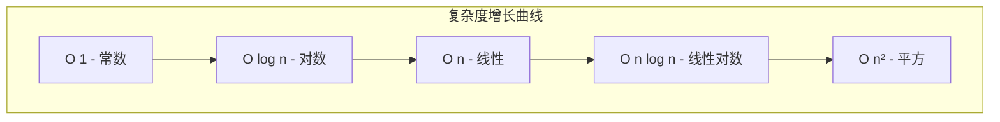
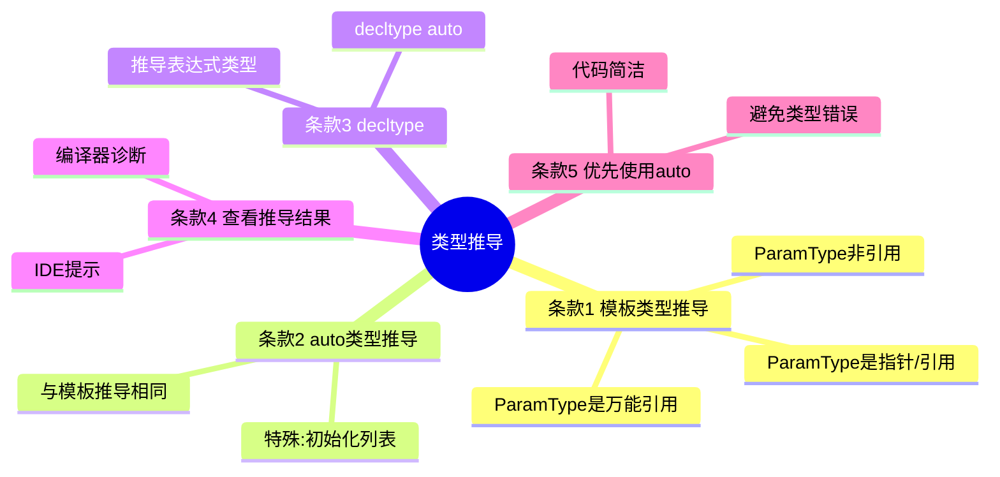
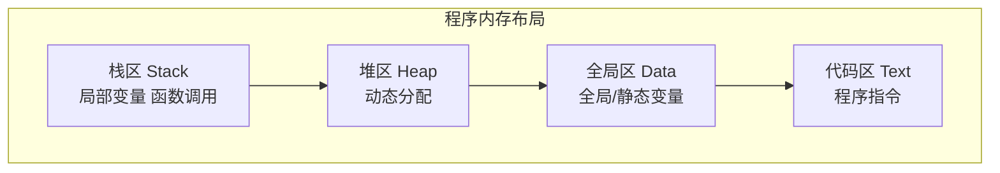
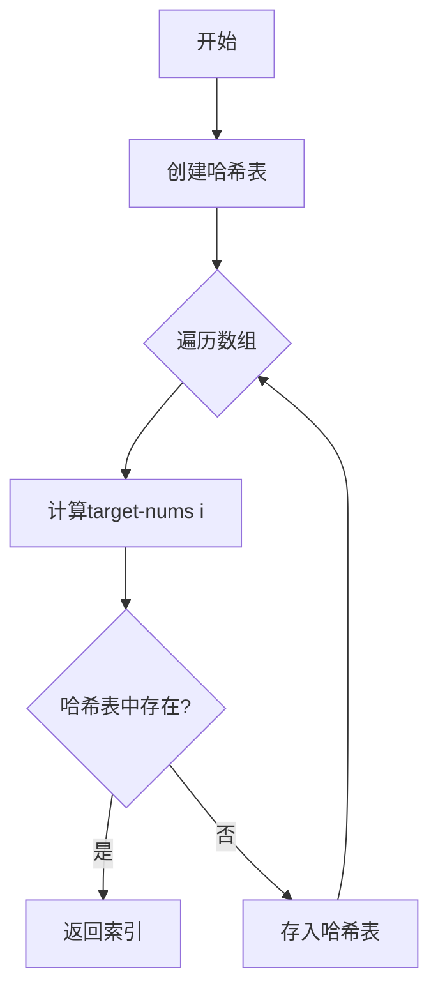
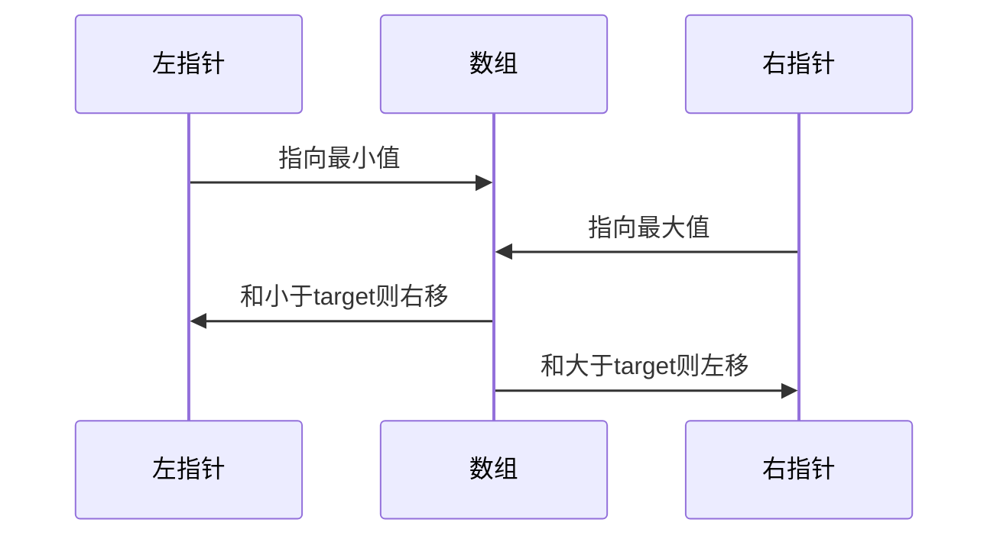

# Day 1：开发环境搭建 + 复杂度分析 + auto类型推导

## 📅 学习目标

- [ ] 掌握算法复杂度分析方法
- [ ] 理解auto类型推导原理
- [ ] 学习EMC++条款1-5
- [ ] 完成LeetCode 1和167题

---

## 📖 知识点一：复杂度分析

### 概念定义

**时间复杂度**：算法执行时间与输入规模之间的关系，用大O表示法描述。

**空间复杂度**：算法执行所需额外空间与输入规模之间的关系。

### 专业介绍

大O表示法描述算法在最坏情况下的渐进上界：

- O(1)：常数时间，与输入规模无关
- O(log n)：对数时间，如二分查找
- O(n)：线性时间，如遍历数组
- O(n log n)：线性对数，如归并排序
- O(n²)：平方时间，如冒泡排序

### 复杂度对比图



### 通俗解释

想象你在整理书架：
- **O(1)**：直接拿第一本书，不管书架多大
- **O(n)**：从头到尾找一本书
- **O(n²)**：每本书都要和其他所有书比较

---

## 📖 知识点二：auto类型推导 + EMC++条款1-5

### auto基本用法

`auto`让编译器在编译期自动推导变量类型：

```cpp
auto x = 42;        // int
auto y = 3.14;      // double
auto s = "hello";   // const char*
auto v = {1, 2, 3}; // std::initializer_list<int>
```

### EMC++条款要点



#### 条款1：模板类型推导

三种情况：
1. **ParamType是指针或引用**：忽略引用，保留const
2. **ParamType是万能引用**：保留值类别
3. **ParamType非引用**：忽略引用、const和volatile

#### 条款2：auto推导规则

auto推导与模板推导基本相同，唯一例外是初始化列表。

#### 条款5：优先使用auto

```cpp
// 不使用auto - 可能出错
int x = 0;
unsigned size = vec.size(); // 32/64位不兼容

// 使用auto - 类型正确
auto x = 0;
auto size = vec.size();     // 自动匹配正确类型
```

---

## 📖 知识点三：编译流程与内存模型

### 编译流程


### 内存模型



---

## 🎯 LeetCode 刷题

### 讲解题：1. 两数之和

#### 题目描述

给定一个整数数组 `nums` 和一个整数目标值 `target`，找出数组中和为目标值的两个数的索引。

#### 解题思路



#### 代码实现

见 `code/leetcode/0001_two_sum/`

| 方法 | 时间复杂度 | 空间复杂度 |
|------|----------|----------|
| 暴力法 | O(n²) | O(1) |
| 哈希表 | O(n) | O(n) |

---

### 实战题：167. 两数之和 II

#### 思路

利用数组**已排序**的特性，使用双指针从两端向中间收敛：



---

## 🚀 运行代码

```bash
cd /home/z/my-project/download/week_01/day_01
./build_and_run.sh
```

---

## 📚 相关术语

| 术语 | 英文 | 定义 |
|------|------|------|
| 时间复杂度 | Time Complexity | 算法执行时间与输入规模的关系 |
| 空间复杂度 | Space Complexity | 算法所需空间与输入规模的关系 |
| 大O表示法 | Big O Notation | 描述算法上界的数学符号 |
| 类型推导 | Type Deduction | 编译器自动推断表达式类型 |
| 哈希表 | Hash Table | 键值对存储，O(1)平均查找 |

---

## 💡 学习提示

1. **auto陷阱**：初始化列表会推导为`std::initializer_list`
2. **复杂度分析**：关注最坏情况，但实际运行可能更好
3. **哈希表**：空间换时间的经典策略

---

## 🔗 参考资料

1. [Hello-Algo - 复杂度分析](https://www.hello-algo.com/chapter_computational_complexity/)
2. [cppreference - auto](https://en.cppreference.com/w/cpp/language/auto)
