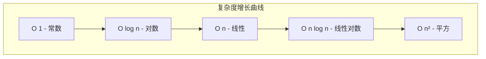
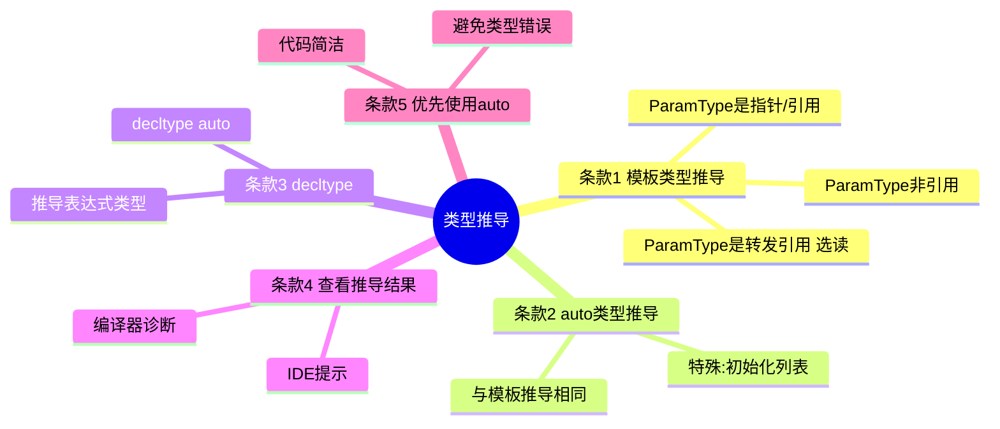
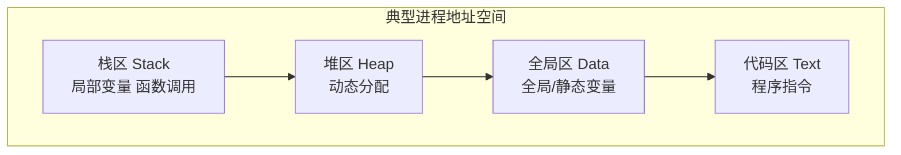
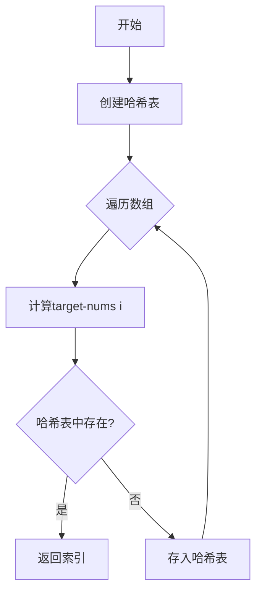
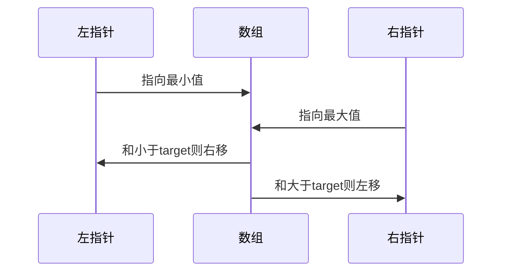

# Day 1：开发环境搭建 + 复杂度分析 + auto类型推导

> **学习定位**：如果变量、函数、`vector` 和引用还不熟，先回查 [C++ 基础学习教程](../../tutorials/CPP基础学习教程.md) 的相关章节。今天主线是学会估算复杂度并正确使用 `auto`；EMC++ Item 1-5 先建立印象，完整推导留到 Day 7 二次复盘。

今天的内容看起来横跨“算法”和“现代 C++”，实际上都在回答同一个问题：**怎样在写代码之前判断它是否合适**。复杂度帮助我们判断算法能否处理足够大的输入，类型推导帮助我们判断编译器最终生成的类型是否符合意图。

## 阅读导航

- 复杂度和 `auto` 的当日语义以本文为主；`auto` 的标准规则可对照 [cppreference](https://en.cppreference.com/w/cpp/language/auto)。
- 两数之和的完整契约分别见 [LeetCode 1](code/leetcode/0001_two_sum/README.md) 与 [LeetCode 167](code/leetcode/0167_two_sum_ii/README.md)，手算图见 [数组算法形象化指南](../算法小白形象化题解指南.md)。
- 今天只要求掌握普通值/引用推导；`decltype` 和代理类型在 [Day 2](../day_02/README.md) 正式展开，完整 Item 1-8 复盘留到 Day 7。

## 📅 学习目标

- [ ] 掌握算法复杂度分析方法
- [ ] 能从循环、递归和额外容器估算时间/空间复杂度
- [ ] 会用按值/普通引用的直觉解释常见 `auto` 推导
- [ ] 能用一句话说出 EMC++ Item 1-5 各自在解决什么问题
- [ ] 完成LeetCode 1和167题

---

## 📖 知识点一：复杂度分析

### 概念定义

**时间复杂度**：基本操作次数随输入规模增长的趋势。它不是某台电脑上的秒数，而是一个与机器速度相对独立的增长模型。

**空间复杂度**：算法占用空间随输入规模增长的趋势。刷题中通常关注**额外空间**，即不把输入本身占用的空间重复计算进去；分析具体系统时则应先说明采用“总空间”还是“额外空间”口径。

输入规模通常记为 `n`，但它必须结合题目定义。例如数组题中 `n` 是元素个数，矩阵题中可能有行数 `m` 和列数 `n`，图问题中则常写成顶点数 `V` 和边数 `E`。

### 专业介绍

大 O 表示的是函数增长率的**渐进上界**。它本身并不等同于“最坏情况”：同一个算法可以分别分析最好、平均和最坏情况，再用大 O 描述其中任意一种。教程和面试若未特别说明，通常报告最坏情况上界。

- O(1)：常数时间，与输入规模无关
- O(log n)：对数时间，如二分查找
- O(n)：线性时间，如遍历数组
- O(n log n)：线性对数，如归并排序
- O(n²)：平方时间，如冒泡排序

### 复杂度对比图


```mermaid
graph TB
    subgraph 复杂度增长曲线
        A[O 1 - 常数]
        B[O log n - 对数]
        C[O n - 线性]
        D[O n log n - 线性对数]
        E[O n² - 平方]
    end
    A --> B --> C --> D --> E
```

### 通俗解释

想象你在整理书架：
- **O(1)**：直接拿第一本书，不管书架多大
- **O(n)**：从头到尾找一本书
- **O(n²)**：每本书都要和其他所有书比较

### 怎样一步步估算复杂度

先不要数每一条 C++ 语句，而要找出“随着输入增大而重复执行”的核心操作：

```cpp
// 1. 固定次数：O(1)
int first = nums[0];

// 2. 遍历 n 个元素：O(n)
for (int x : nums) {
    use(x);
}

// 3. 两层都遍历 n 次：O(n^2)
for (std::size_t i = 0; i < nums.size(); ++i) {
    for (std::size_t j = 0; j < nums.size(); ++j) {
        use(nums[i], nums[j]);
    }
}

// 4. 每轮把问题规模减半：O(log n)
for (std::size_t remaining = nums.size(); remaining > 1; remaining /= 2) {
    do_one_step();
}
```

估算时遵循四条规则：

1. **顺序执行相加，保留增长最快的一项**：`O(n) + O(n²) = O(n²)`。
2. **嵌套执行通常相乘**：外层 `n` 次、内层 `n` 次，总共 `n²` 次。
3. **忽略常数系数和低阶项**：`3n + 10` 写作 `O(n)`，不是说常数不影响实际速度，而是大 O 只比较增长趋势。
4. **先说明输入和情况**：二分查找是 `O(log n)` 的前提是数据支持随机访问且已经有序；哈希表查找通常是平均 `O(1)`，极端冲突下可能退化。

### 常见但容易判断错的结构

```cpp
// 两个先后循环是 O(n)，不是 O(n^2)
for (std::size_t i = 0; i < n; ++i) { /* ... */ }
for (std::size_t i = 0; i < n; ++i) { /* ... */ }

// 内层总次数是 n + n/2 + n/4 + ... < 2n，所以是 O(n)
for (std::size_t start = 1; start < n; start *= 2) {
    for (std::size_t i = 0; i < n / start; ++i) { /* ... */ }
}
```

### 空间复杂度怎样算

- 几个整数、指针等固定数量变量：`O(1)`。
- `std::vector<int> copy(nums)`：复制 `n` 个元素，额外空间 `O(n)`。
- `n × n` 矩阵：`O(n²)`。
- 递归还要计算调用栈。例如递归深度为 `n`，即使每层只有几个局部变量，额外空间通常也是 `O(n)`。

> **计时不是复杂度证明**：运行时间还受编译优化、缓存、输入分布和机器负载影响。计时适合验证趋势，复杂度结论仍应来自对代码执行次数的推导。

---

## 📖 知识点二：auto类型推导 + EMC++条款1-5

### 进入类型推导前：最小模板铺垫

`auto` 的规则大部分来自模板类型推导。零基础学习者不需要先掌握整套模板，只需理解下面这个最小函数模板：

```cpp
template<typename T>
void inspect(const T& value) {
    // T 是编译器根据实参推导出的类型
}

int n{42};
inspect(n);      // 根据 n 推导 T
inspect(3.14);   // 根据 3.14 推导 T
```

- `template<typename T>` 声明了一个待推导的类型参数 `T`。
- `const T&` 是参数的类型模式（EMC++ 中称 `ParamType`）。
- 调用时传入的表达式是实参（argument），编译器拿实参类型去匹配参数模式。
- “推导 `T`”和“得到最终参数类型”不是一回事。例如传入 `const int` 给 `const T&` 时，`T` 推导为 `int`，最终参数类型才是 `const int&`。

这套“**实参表达式 + 参数类型模式 → 推导结果**”的思路，也是理解 `auto`、泛型 lambda 和后续完美转发的基础。

### auto基本用法

`auto`让编译器在编译期自动推导变量类型：

```cpp
auto x = 42;        // int
auto y = 3.14;      // double
auto s = "hello";   // const char*
auto v = {1, 2, 3}; // std::initializer_list<int>
```

`auto` 不是动态类型，也不会让变量在运行时随意改变类型。上面每个变量的类型都在**编译期固定**；`x` 之后仍然只能按 `int` 使用。

### EMC++条款要点

本节保留 Item 1-5 的完整知识量，但按首次学习负担分层：

| 层级 | Day 1 要求 | 后续落点 |
|---|---|---|
| 主线 | `auto` 在编译期得到具体类型；按值通常不保留顶层 `const`；`auto&`/`const auto&` 表达引用意图；用 `static_assert` 验证类型 | 当日自测 |
| 认识即可 | Item 1-5 的名称、动机与一个代表例子 | Day 7 横向复盘 |
| 明确选读 | 转发引用、引用折叠、值类别、`decltype(auto)` 返回引用与悬空边界 | `decltype` 规则回到 Day 2，完整推导演算和生命周期回到 Day 7 |

第一次阅读可以跳过标有“选读”的段落，不影响完成 Day 1 两道算法题和当日自测。


```mermaid
mindmap
  root((类型推导))
    条款1 模板类型推导
      ParamType是指针/引用
      ParamType是转发引用 选读
      ParamType非引用
    条款2 auto类型推导
      与模板推导相同
      特殊:初始化列表
    条款3 decltype
      推导表达式类型
      decltype auto
    条款4 查看推导结果
      IDE提示
      编译器诊断
    条款5 优先使用auto
      避免类型错误
      代码简洁
```

#### 条款1：理解模板类型推导

设有三个基础模板：

```cpp
template<typename T> void by_ref(T& param);
template<typename T> void forwarding_ref(T&& param);
template<typename T> void by_value(T param);

int x{27};
const int cx{x};
const int& rx{x};
```

**情况 A：参数是普通引用或指针。** 编译器先忽略实参已有的引用性，再根据模式匹配；对象自身的 `const` 会保留。

```cpp
by_ref(x);   // T = int，       ParamType = int&
by_ref(cx);  // T = const int， ParamType = const int&
by_ref(rx);  // T = const int， ParamType = const int&
```

**选读——情况 B：参数是转发引用 `T&&`。** 这里的前提是 `T` 需要推导且形式恰好是 `T&&`。左值实参会让 `T` 推导为左值引用，经过引用折叠后，参数仍是左值引用；右值实参则得到右值引用。Day 1 只需知道“`T&&` 不总等于右值引用”，完整演算留到 Day 7。

```cpp
forwarding_ref(x);   // x 是左值：T = int&，ParamType 最终为 int&
forwarding_ref(27);  // 27 是右值：T = int， ParamType 为 int&&
```

“有名字的变量通常是左值”是此处最重要的直觉。仅仅看到类型里有 `&&`，不能断言表达式就是右值。

**情况 C：按值传递。** 形参会得到一份新对象，因此实参的引用性和顶层 `const` 不需要带到副本上；指针所指对象的底层 `const` 仍会保留。

```cpp
by_value(cx);  // T = int
by_value(rx);  // T = int

const char name[] = "cpp";
by_value(name);  // T = const char*，数组发生退化
```

按值推导时，数组和函数通常会退化为指针；若参数是引用，就能保留数组/函数类型。理解这一点后，Day 2 的 C 风格数组传参会自然很多。

#### 条款2：理解 `auto` 类型推导

把声明中的 `auto` 想成模板中的 `T`，把初始化表达式想成传给模板的实参：

```cpp
const int cx{42};
const int& rx{cx};

auto a = cx;         // 类似按值推导：int
auto b = rx;         // 类似按值推导：int
const auto& c = cx;  // 类似 const T&：const int&
auto&& d = a;        // a 是左值：int&
auto&& e = 42;       // 42 是右值：int&&
```

重要差异是花括号：

```cpp
auto a = {1, 2, 3}; // std::initializer_list<int>
auto b{1};          // int（单元素直接列表初始化）
// auto c = {1, 2.0}; // 错误：无法为 initializer_list 推导出单一元素类型

template<typename T>
void f(T);
// f({1, 2, 3});      // 错误：普通模板不能仅凭花括号列表推导 T
```

因此“`auto` 与模板推导完全相同”并不准确，`std::initializer_list` 是必须记住的例外。

#### 条款3：认识 `decltype`（正式规则在 Day 2）

`auto` 主要回答“用初始化表达式声明一个新变量时，该取什么类型”；`decltype` 则用于查询**名称或表达式的类型**，通常不对表达式求值。

```cpp
int x{0};
const int& r{x};

decltype(x) a{1};      // int：未加括号的变量名，返回声明类型
decltype(r) b{x};      // const int&：仍返回声明类型
decltype((x)) c{x};    // int&：(x) 按普通表达式规则处理，它是左值
decltype(x + 1) d{1};  // int：x + 1 是纯右值
```

一般表达式的规则是：左值表达式得到 `T&`，将亡值表达式得到 `T&&`，纯右值表达式得到 `T`。Day 2 会专门解释为什么 `decltype(x)` 和 `decltype((x))` 不同。

> **选读 / 后续索引**：从 `decltype(auto)` 开始涉及精确返回类型和生命周期，不属于 Day 1 自测。Day 2 会正式讲两套 `decltype` 规则，Day 7 再复盘返回引用的风险。

`decltype(auto)` 使用 `decltype` 的规则推导整个声明，能保留引用：

```cpp
int x{0};
auto a = (x);            // int，产生副本
decltype(auto) b = (x);  // int&，b 是 x 的别名
```

它很精确，也更容易因多写一层括号而意外返回引用，所以函数返回类型使用 `decltype(auto)` 时必须检查对象生命周期。尤其要注意：普通 `std::vector<T>::operator[]` 返回 `T&`（const 容器返回 `const T&`）；即使在临时 `vector` 上调用，结果也不是“安全延长生命周期的右值引用”，临时容器仍会在完整表达式结束时销毁。

因此元素访问包装器只接受左值容器，让接口直接表达“调用结束后容器仍须存活”：

```cpp
template<typename Container, typename Index>
decltype(auto) get_element(Container& container, Index index) {
    static_assert(std::is_integral_v<Index>);
    if constexpr (std::is_signed_v<Index>) {
        if (index < 0) throw std::out_of_range("negative index");
    }
    return container.at(static_cast<std::size_t>(index));
}

std::vector<int> values{1, 2, 3};
get_element(values, 0) = 10;             // 正确：返回 int&
// get_element(values, -1);              // 运行时抛出 out_of_range
// get_element(std::vector<int>{1}, 0);  // 编译错误：临时容器不能绑定到 Container&
```

可执行边界证据位于 `code/emcpp/lifetime_boundary_test.cpp`：默认运行验证左值/const 左值，`--trigger-asan` 是专供 AddressSanitizer 拦截悬空引用的负例，不应作为普通示例使用。

```bash
cd week_01/day_01
cmake -S . -B build-asan \
  -DCMAKE_BUILD_TYPE=Debug \
  -DCMAKE_CXX_FLAGS="-fsanitize=address,undefined -fno-omit-frame-pointer" \
  -DCMAKE_EXE_LINKER_FLAGS="-fsanitize=address,undefined"
cmake --build build-asan --target day01_lifetime_boundaries
./build-asan/day01_lifetime_boundaries                 # 安全路径应通过
! ./build-asan/day01_lifetime_boundaries --trigger-asan # 负例必须由 ASan 以非零状态拦截
```

#### 条款4：知道怎样查看推导类型

学习类型推导不能只靠猜。常用方法各有边界：

1. IDE 悬停和语言服务器适合日常阅读，但显示格式由工具决定。
2. `static_assert(std::is_same_v<decltype(expr), Expected>)` 能在编译期精确验证，是本教程示例最可靠的方式。
3. 故意实例化未定义模板（如 `TypeDisplay<decltype(expr)> value;`）可让编译器诊断打印类型，仅用于学习实验。
4. `typeid(expr).name()` 是运行时信息，名称可能经过编译器编码，而且经常不显示顶层 `const` 和引用，不能作为精确结论。

```cpp
#include <type_traits>

const int x{0};
auto y = x;
static_assert(std::is_same_v<decltype(y), int>);
```

#### 条款5：优先使用 `auto`

这里的“优先”不是“所有类型都必须隐藏”，而是：当初始化表达式已经清楚表达类型，或显式类型容易写错时，让编译器维护类型通常更可靠。

```cpp
// 显式类型容易与库的真实返回类型不一致
unsigned size = vec.size(); // vector::size_type 不保证就是 unsigned

// auto 精确跟随接口
auto size = vec.size();

// map 的键是 const Key；写错元素类型可能产生隐藏拷贝
for (const auto& [key, value] : scores) {
    // 读取 key 和 value，不复制整个元素
}
```

`auto` 还有两个实际优势：变量必须有初始化器，避免基础类型处于未初始化状态；长迭代器、lambda 和工厂函数返回类型不必手写。

但要同时保留语义意图：

```cpp
auto value = expensive_object();        // 要一份独立副本/移动结果
const auto& value = existing_object;    // 只读别名，避免复制
auto& value = existing_object;          // 可修改别名
```

不要把三种写法混为一谈。`auto` 只替你推导基础类型，值、引用和 `const` 仍由程序员选择。代理类型是另一个重要边界，Day 2 的 Item 6 会继续讲。

### 选读：从 Item 1-5 得出的完整推导方法

看到类型推导代码时，按下面顺序分析：

1. 写出初始化表达式/函数实参的原始类型和 `const`。
2. 判断它是左值、将亡值还是纯右值。
3. 判断声明或 `ParamType` 是值、普通引用，还是满足条件的转发引用。
4. 应用引用折叠、顶层 `const` 移除、数组/函数退化等规则。
5. 最后用 `static_assert` 验证，不依赖肉眼猜测。

---

## 📖 知识点三：编译流程与典型进程地址空间

### 编译流程


```mermaid
flowchart LR
    A[源代码 .cpp] --> B[预处理 .ii]
    B --> C[编译 .s]
    C --> D[汇编 .o]
    D --> E[链接]
    E --> F[可执行文件]
```

### 典型实现的进程地址空间示意


```mermaid
graph TB
    subgraph 典型进程地址空间
        A["栈区 Stack<br/>局部变量 函数调用"]
        B["堆区 Heap<br/>动态分配"]
        C["全局区 Data<br/>全局/静态变量"]
        D["代码区 Text<br/>程序指令"]
    end
    A --> B --> C --> D
```

这张图只是常见操作系统和工具链下的教学示意：C++ 标准并不要求进程必须按这些固定区域划分，也不保证它们的排列顺序。“栈/堆/代码段”属于实现与运行环境概念，不要和并发章节中的 C++ **内存模型（memory model）**混为一谈；后者讨论的是线程间可见性、原子操作和指令重排规则。

---

## 🎯 LeetCode 刷题

### 讲解题：1. 两数之和

#### 题目描述

给定一个整数数组 `nums` 和一个整数目标值 `target`，找出数组中和为目标值的两个数的索引。

#### 解题思路

暴力法枚举所有下标对，约检查 `n(n-1)/2` 次，所以是 `O(n²)`。哈希表方法在遍历到 `nums[i]` 时，先查询补数 `target - nums[i]` 是否已经出现；如果出现，就能与当前元素组成答案，否则再记录当前元素。

关键不变量是：**处理下标 `i` 之前，哈希表保存的是下标区间 `[0, i)` 中已经看过的值及其索引**。先查询、后插入还能避免同一个元素被使用两次。哈希表查找和插入平均为 `O(1)`，因此总时间平均为 `O(n)`；额外存储最多 `n` 个元素，所以空间为 `O(n)`。


```mermaid
flowchart TD
    A[开始] --> B[创建哈希表]
    B --> C{遍历数组}
    C --> D[计算target-nums i]
    D --> E{哈希表中存在?}
    E -->|是| F[返回索引]
    E -->|否| G[存入哈希表]
    G --> C
```

#### 代码实现

见 `code/leetcode/0001_two_sum/`

| 方法 | 时间复杂度 | 空间复杂度 |
|------|----------|----------|
| 暴力法 | O(n²) | O(1) |
| 哈希表 | O(n) | O(n) |

---

### 实战题：167. 两数之和 II

#### 思路

利用数组**已排序**的特性，使用双指针从两端向中间收敛：


```mermaid
sequenceDiagram
    participant 左指针
    participant 数组
    participant 右指针
    左指针->>数组: 指向最小值
    右指针->>数组: 指向最大值
    数组->>左指针: 和小于target则右移
    数组->>右指针: 和大于target则左移
```

为什么移动是安全的？设当前和为 `sum = numbers[left] + numbers[right]`：

- 若 `sum < target`，右端已经是当前范围最大值。固定 `left` 再换成任何更小的右端，和只会更小，所以 `left` 不可能参与答案，可以放心右移。
- 若 `sum > target`，左端已经是当前范围最小值。固定 `right` 再换成任何更大的左端，和只会更大，所以 `right` 不可能参与答案，可以放心左移。

每次至少排除一个位置，两个指针总共移动不超过 `n` 次，因此时间复杂度为 `O(n)`、额外空间为 `O(1)`。这就是“利用有序性消除一整批候选”，而不只是背诵双指针模板。

> LeetCode 167 返回的是从 `1` 开始计数的下标，写代码时不要和 C++ 容器的 `0` 起始下标混淆。

---

## 🚀 运行代码

```bash
cd week_01/day_01
./build_and_run.sh
```

---

## 📚 相关术语

| 术语 | 英文 | 定义 |
|------|------|------|
| 时间复杂度 | Time Complexity | 算法执行时间与输入规模的关系 |
| 空间复杂度 | Space Complexity | 算法所需空间与输入规模的关系 |
| 大O表示法 | Big O Notation | 描述算法上界的数学符号 |
| 类型推导 | Type Deduction | 编译器自动推断表达式类型 |
| 哈希表 | Hash Table | 键值对存储，O(1)平均查找 |

---

## 💡 学习提示

1. **auto陷阱**：初始化列表会推导为`std::initializer_list`
2. **复杂度分析**：先定义输入规模与分析口径，再数核心操作的增长次数
3. **哈希表**：平均 `O(1)` 查询是用额外空间换时间，不能误写成无条件最坏 `O(1)`
4. **类型推导**：主线先分清值、引用和 `const`；值类别与引用折叠留到 Day 7 完整复盘

## ✅ 今日自测

1. 为什么两个先后执行的 `O(n)` 循环仍是 `O(n)`，而两层嵌套循环通常是 `O(n²)`？
2. `const int x = 0; auto a = x; const auto& b = x;` 中 `a` 和 `b` 分别是什么类型？
3. `auto a = x; auto& b = x; const auto& c = x;` 分别表达“副本、可改别名、只读别名”中的哪一种？
4. 为什么 `auto values = {1, 2, 3};` 是 Item 2 需要单独记住的花括号例外？
5. 两数之和的哈希表方法为什么要“先查补数、再插入当前元素”？

如果这些问题能不用背答案、而是根据规则推导出来，就可以进入 Day 2：把类型推导应用到数组、`vector`、表达式和代理对象中。

---

## 🧩 今日唯一工程动作

画一张 `day01_main` 的构建与调用关系图：从主入口连到五个课程静态库，再从每个库连到自己的 `.cpp`，并用不同箭头区分“编译进库、可执行文件链接库、函数调用”。

## 📝 五句复盘

1. 今天的核心是先定义输入规模和不变量，再推导复杂度与类型。
2. `auto` 不是模糊类型，它按可验证的模板推导规则得到具体类型。
3. 两数之和的正确性来自“先查询、后插入”的哈希表不变量或有序数组的排除证明。
4. 容器下标、算术结果和两个不同下标的要求都是接口契约的一部分。
5. Day 2 将把这些推导规则和边界意识带入数组、`vector` 与代理对象。

---

## 🔗 参考资料

1. [Hello-Algo - 复杂度分析](https://www.hello-algo.com/chapter_computational_complexity/)
2. [cppreference - auto](https://en.cppreference.com/w/cpp/language/auto)
