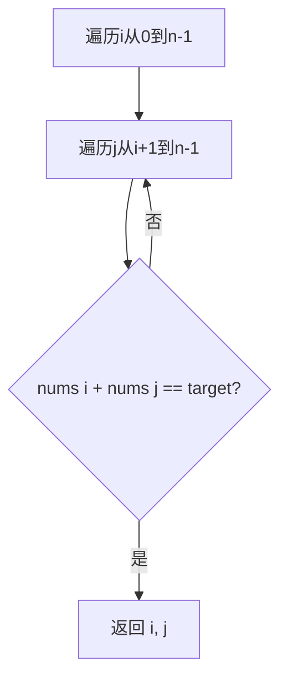
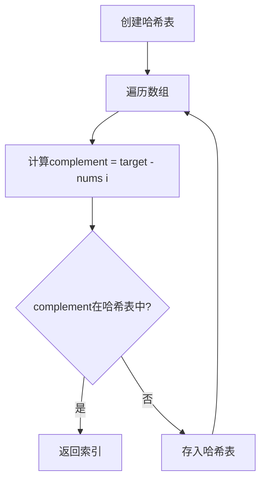

# LeetCode 1. 两数之和

## 题目描述

给定一个整数数组 `nums` 和一个整数目标值 `target`，找出数组中和为目标值的两个数的索引。

你可以假设每个输入只对应一个答案，且同一个元素不能使用两次。

## 解题思路

### 方法1：暴力法 O(n²)

### 方法2：哈希表 O(n) ⭐推荐

**核心思想**：空间换时间，用哈希表存储已遍历元素，将查找从O(n)降到O(1)。

## 代码实现

见 `solution.cpp`

## 复杂度分析

| 方法 | 时间复杂度 | 空间复杂度 |
|------|----------|----------|
| 暴力法 | O(n²) | O(1) |
| 哈希表 | O(n) | O(n) |

## 关键点

1. **哈希表查找O(1)**：unordered_map的find操作平均O(1)
2. **一边遍历一边存**：不需要先存所有元素
3. **处理重复元素**：先查找再存入，避免使用同一元素
