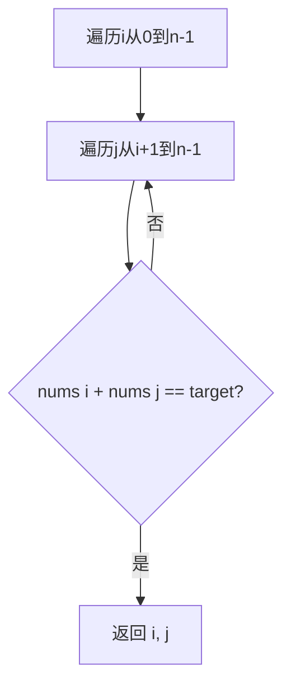
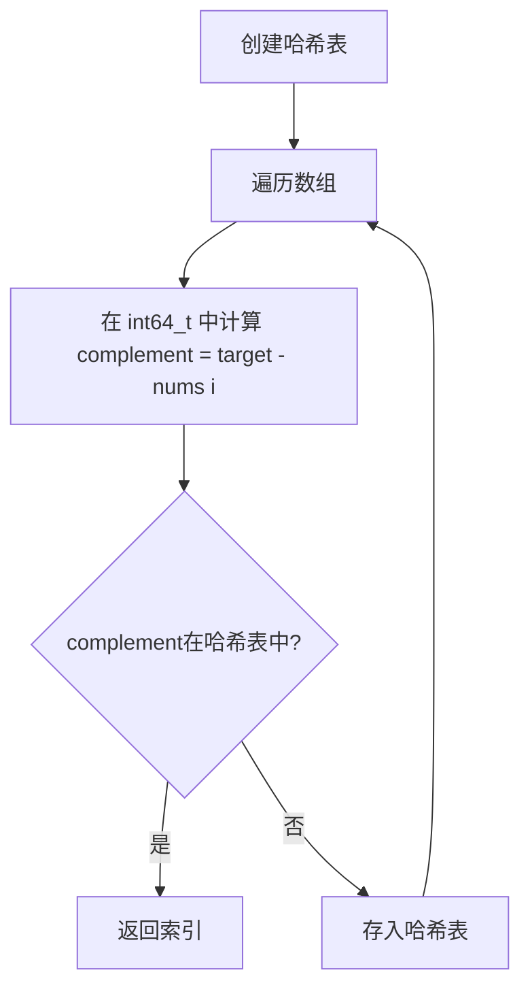

# LeetCode 1. 两数之和

## 题目描述

给定一个整数数组 `nums` 和一个整数目标值 `target`，找出数组中和为目标值的两个数的索引。

你可以假设每个输入只对应一个答案，且同一个元素不能使用两次。

## 解题思路

### 方法1：暴力法 O(n²)

```mermaid
flowchart TD
    A[遍历i从0到n-1] --> B[遍历j从i+1到n-1]
    B --> C{nums i + nums j == target?}
    C -->|是| D[返回 i, j]
    C -->|否| B
```

### 方法2：哈希表 O(n) ⭐推荐

```mermaid
flowchart TD
    A[创建哈希表] --> B[遍历数组]
    B --> C[在 int64_t 中计算 complement = target - nums i]
    C --> D{complement在哈希表中?}
    D -->|是| E[返回索引]
    D -->|否| F[存入哈希表]
    F --> B
```

**核心思想**：空间换时间，用哈希表存储已遍历元素，将查找从 O(n) 降到平均 O(1)。补数和暴力法中的两数之和都要在 `int64_t` 中计算；若先做 `int` 加减，`INT_MIN/INT_MAX` 附近可能在比较前就发生未定义行为。公开接口返回 `int` 下标，因此找到答案后还要统一检查下标可表示范围。

## 代码实现

见 `solution.cpp`

## 复杂度分析

| 方法 | 时间复杂度 | 空间复杂度 |
|------|----------|----------|
| 暴力法 | O(n²) | O(1) |
| 哈希表 | 平均 O(n)，最坏取决于哈希冲突 | O(n) |

## 关键点

1. **哈希表平均 O(1) 查找**：`unordered_map::find` 在冲突严重时可能退化
2. **一边遍历一边存**：不需要先存所有元素
3. **处理重复元素**：先查找再存入，避免使用同一元素
