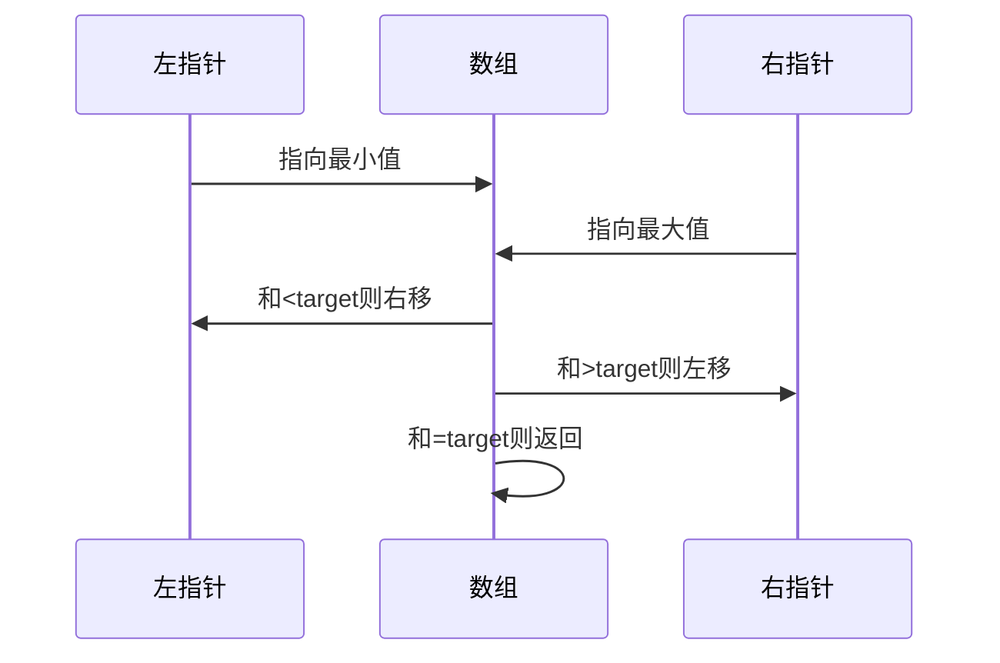

# LeetCode 167. 两数之和 II - 输入有序数组

## 题目描述

给定一个**已排序**的整数数组，找出两个数使它们的和等于目标值。

返回它们的下标（从1开始）。

## 解题思路

### 双指针法

利用数组已排序的特性，用两个指针从两端向中间收敛：

### 为什么双指针正确？

- 数组有序：小的数在左，大的数在右
- 和 < target：需要更大的数，左指针右移
- 和 > target：需要更小的数，右指针左移
- 每次都能缩小范围，不会遗漏

## 复杂度

| 方法 | 时间复杂度 | 空间复杂度 |
|------|----------|----------|
| 双指针 | O(n) | O(1) |
| 二分查找 | O(n log n) | O(1) |

## 与 LeetCode 1 的区别

| 特性 | LC 1 | LC 167 |
|------|------|--------|
| 数组是否有序 | 不确定 | **有序** |
| 下标起点 | 0 | 1 |
| 最优解法 | 哈希表 O(n) | 双指针 O(n) |
| 空间复杂度 | O(n) | O(1) |
