# Day 2: 数组数据结构与decltype详解

> **学习定位**：承接 Day 1 对 Item 1-5 的初识，本日才正式展开 `decltype`、表达式类别和代理对象，并把它们放进连续内存接口中验证。主线是数组/`vector` 与快慢指针；复杂规则先通过实验理解，不要求一次背完，Day 7 再横向复盘。

Day 1 的两数之和把数据当作“可通过下标访问的一串数”。今天要把这件事拆开：为什么下标访问快、C 数组与 `vector` 到底哪里相同、什么时候引用会失效，以及快慢指针凭什么能原地覆盖数据。类型部分则从 `auto` 的“声明一个新变量”过渡到 `decltype` 的“精确询问名称或表达式的类型”。

## 阅读导航

- 连续存储、迭代器失效和 `decltype` 是本日主讲；标准接口可对照 [`std::array`](https://en.cppreference.com/w/cpp/container/array)、[`std::vector`](https://en.cppreference.com/w/cpp/container/vector) 与 [`decltype`](https://en.cppreference.com/w/cpp/language/decltype)。
- LeetCode 26 的完整不变量与递归边界见 [题目 README](code/leetcode/0026_remove_duplicates/README.md)；Day 27 的真实实现位于 `code/leetcode/0027_remove_element/`。
- 前接 [Day 1 的普通 `auto` 推导](../day_01/README.md)，后接 [Day 3 的对象初始化与逆向写入](../day_03/README.md)。

## 📚 今日学习内容

| 模块 | 内容 | 难度 |
|------|------|------|
| 数据结构 | C 数组、`std::array`、`std::vector` 与连续内存 | ⭐⭐ |
| C++11特性 | decltype关键字 | ⭐⭐⭐ |
| EMC++条款 | 条款6：auto推导陷阱 | ⭐⭐⭐ |
| LeetCode | 26题、27题 | ⭐⭐ |

---

## 1. 数组数据结构

### 1.1 数组基本概念

数组是一种**线性数据结构**，使用**连续的内存空间**存储相同类型的元素。

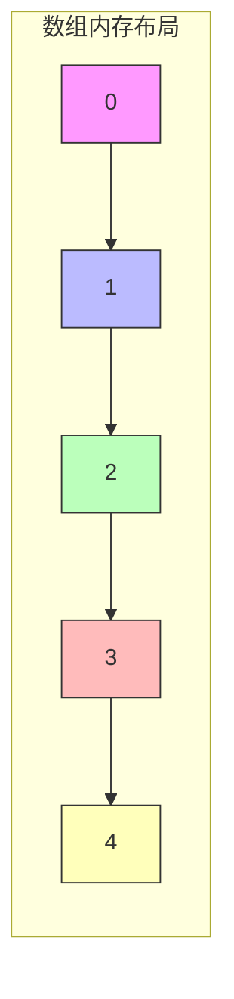

“连续”意味着相邻元素之间没有别的元素插入。假设首元素地址为 `base`，元素类型为 `T`，那么第 `i` 个元素的地址可以按下面的模型理解：

```text
address(i) = base + i * sizeof(T)
```

因此只要知道首地址、下标和元素大小，就能直接定位元素，不需要从第一个元素一路走到第 `i` 个元素，这就是随机访问为 `O(1)` 的原因。`O(1)` 只表示操作步数不随 `n` 增长，不代表没有乘法、边界检查或缓存开销。

连续内存通常也更符合 CPU 缓存的工作方式：读入一个元素时，附近的一段内存往往会一起进入缓存，顺序遍历更容易命中缓存。复杂度相同的两段代码，实际性能仍可能因内存布局不同而差很多。

### 1.2 数组的特点

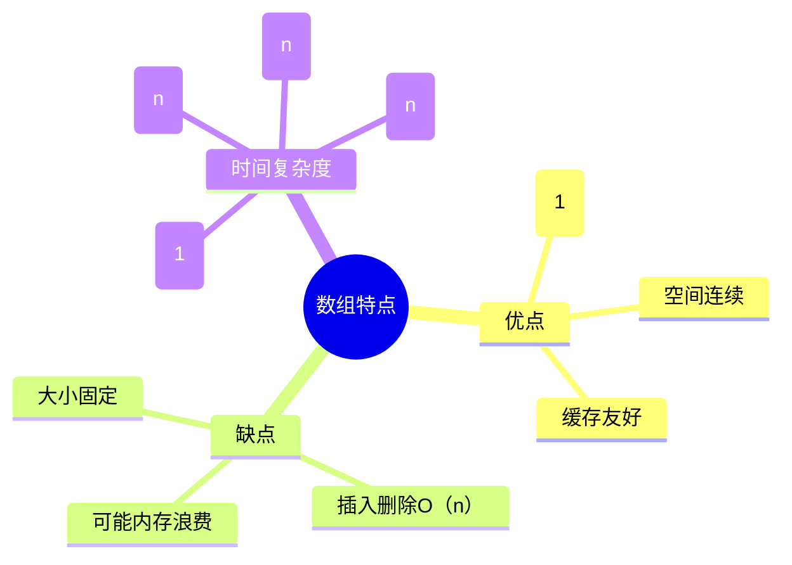

### 1.3 数组操作示意图

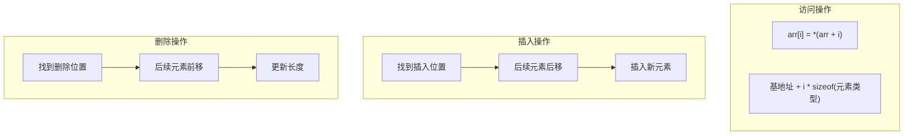

### 1.4 C++数组类型对比

| 特性 | C风格数组 | std::array | std::vector |
|------|----------|------------|-------------|
| 元素存储 | 对象内部连续 | 对象内部连续 | 动态分配区连续（`vector<bool>` 除外） |
| 大小 | 编译期固定 | 编译期固定 | 运行期可增长/缩小 |
| 边界检查 | 无 | at()有 | at()有 |
| 作为函数参数 | 常见写法会退化为指针，也可按数组引用传递 | 由形参决定：按值复制、按引用不复制 | 由形参决定：按值复制、按引用不复制 |
| 长度怎样取得 | 数组边界是类型的一部分，当前作用域可用 `std::size`；退化成指针后长度信息丢失 | `size()`，编译期固定 | `size()`，运行期状态 |
| 推荐程度 | ❌ | ✅ | ✅✅ |

表中的“C 数组会退化”需要准确理解：数组对象本身不是指针，数组边界也是类型的一部分；只是在多数表达式以及写成 `void f(int arr[])` 这类普通函数形参时会转换为首元素指针。转换后只剩地址，调用方必须另传长度或改用数组引用、`std::array`、`std::vector` 等自带长度的接口。

```cpp
#include <cstddef>

template<std::size_t N>
void inspect(const int (&arr)[N]) {
    // 按数组引用接收，不退化，N 也能被推导出来
    static_assert(N > 0);
    (void)arr;
}

int main() {
    int values[3]{1, 2, 3};
    static_assert(sizeof(values) == 3 * sizeof(int));
    inspect(values); // N = 3
}
```

#### `std::vector` 的对象和元素不在同一块内存

`std::vector<int> v` 是一个管理对象，典型实现内部保存元素区地址、当前元素数和容量；真正的元素位于它管理的一块动态连续内存中。

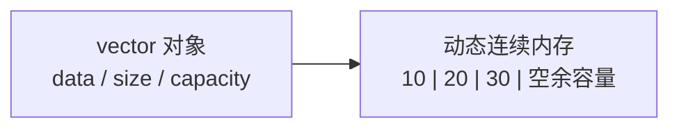

- `size()`：当前已经构造的元素个数。
- `capacity()`：不重新分配内存时最多能容纳的元素个数，必有 `capacity() >= size()`。
- `data()`：指向连续元素区首元素；非空时 `&v[i] == v.data() + i`。
- `push_back` 若超过容量，通常会申请更大的内存并搬移元素。旧元素的指针、引用和迭代器此时会失效。

```cpp
std::vector<int> v{10, 20, 30};
int* old_first = &v[0];
v.push_back(40); // 如果触发重新分配，old_first 随即失效
// std::cout << *old_first; // 错误示例：可能解引用失效指针，行为未定义
```

不要通过某一次运行恰好没有崩溃来判断引用仍然有效。是否重新分配要看操作语义和容量，而不是肉眼观察地址。

#### `operator[]` 与 `at()`

`arr[i]` / `v[i]` 不自动做边界检查，越界访问会产生未定义行为；`std::array::at(i)` 和 `std::vector::at(i)` 会检查边界，越界时抛出 `std::out_of_range`。学习阶段若下标来源不确定，使用 `at()` 更容易尽早暴露错误；性能敏感代码则应先建立并证明下标范围。

---

## 2. decltype关键字详解

### 2.1 基本语法

```cpp
decltype(expression) variable;
```

### 2.2 decltype推导规则

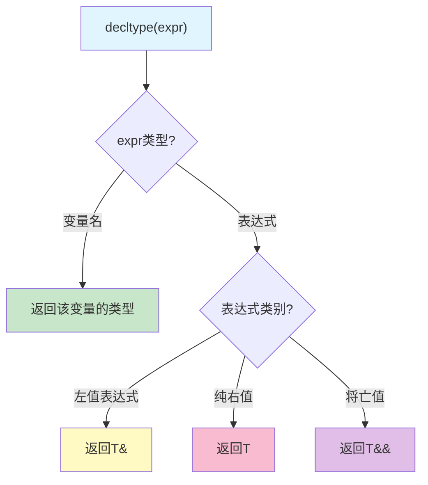

流程图中的“变量名”更严格地说，是**未加括号的标识表达式或未加括号的类成员访问表达式**。`decltype` 有两套规则：

1. 若操作数是未加括号的变量名/成员访问，直接得到它的**声明类型**。
2. 其他表达式根据值类别得到类型：左值为 `T&`，将亡值为 `T&&`，纯右值为 `T`。

这正是下面两个结果不同的原因：

```cpp
int x{10};

decltype(x) a{0};    // int：x 命中特殊规则，返回声明类型
decltype((x)) b{x};  // int&：(x) 不再是“未加括号的变量名”；它是 int 左值表达式

b = 99;              // b 引用 x，因此 x 也变为 99
```

括号并没有把 `x` 变成左值——有名字的变量表达式 `x` 本来就是左值。括号的作用是让 `decltype` 不再使用第一条特殊规则，转而按表达式值类别处理。

再看三个能建立直觉的表达式：

```cpp
#include <utility>

int x{10};
int* p{&x};

decltype(*p) r{x};            // int&，解引用表达式是左值
decltype(std::move(x)) rr{1}; // int&&，std::move(x) 是将亡值
decltype(x + 1) value{0};     // int，算术结果是纯右值
```

`std::move` 不搬移对象，只把表达式转换为将亡值；真正是否发生移动取决于后续调用。

### 2.3 decltype vs auto 对比

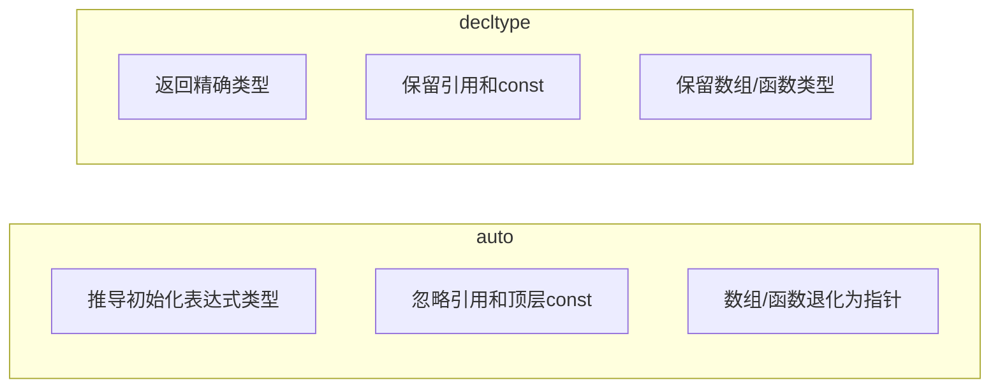

这里的对比指的是**不带 `&` 的普通 `auto` 变量**。如果写 `auto&`、`const auto&` 或 `auto&&`，声明者仍可以主动保留引用/只读语义。`decltype` 也并非无条件“保留一切”，它究竟得到什么类型必须套用上面的两套规则。

### 2.4 典型应用场景

```cpp
// 1. 返回类型尾置语法
template<typename T, typename U>
auto add(T t, U u) -> decltype(t + u) {
    return t + u;
}

// 2. 保留表达式的精确类型
int x = 10;
decltype((x)) y = x;  // y是int&，因为(x)是左值表达式

// 3. 用于类型别名（需要 <type_traits>、<utility>）
template<typename Container>
using Element = std::remove_cv_t<std::remove_reference_t<
    decltype(std::declval<Container&>()[0])>>;

static_assert(std::is_same_v<Element<std::vector<int>>, int>);
```

若直接把 `decltype(container[0])` 命名为 `ValueType`，对普通 `vector<int>` 得到的其实是 `int&`，容易误导。上例显式移除了引用与 `const`；在 C++20 中可以用 `std::remove_cvref_t` 简化。

### 2.5 `decltype(auto)`：精确，但要检查生命周期

```cpp
int global_value{42};

decltype(auto) by_reference() {
    return (global_value); // int&，括号让它按左值规则推导
}

decltype(auto) by_value() {
    return global_value;   // int，未加括号变量名返回声明类型
}
```

`decltype(auto)` 很适合泛型包装器保留返回值类型，但也可能意外返回局部变量引用。下面是**错误示例，保持注释，不能使用**：

```cpp
// decltype(auto) dangling() {
//     int local{42};
//     return (local); // 错误：推导为 int&，函数结束后 local 已销毁
// }
```

判断返回类型时，不只要问“推导成什么”，还要问“被引用对象能活多久”。

---

## 3. EMC++ 条款6：auto推导陷阱

### 3.1 主要陷阱总结

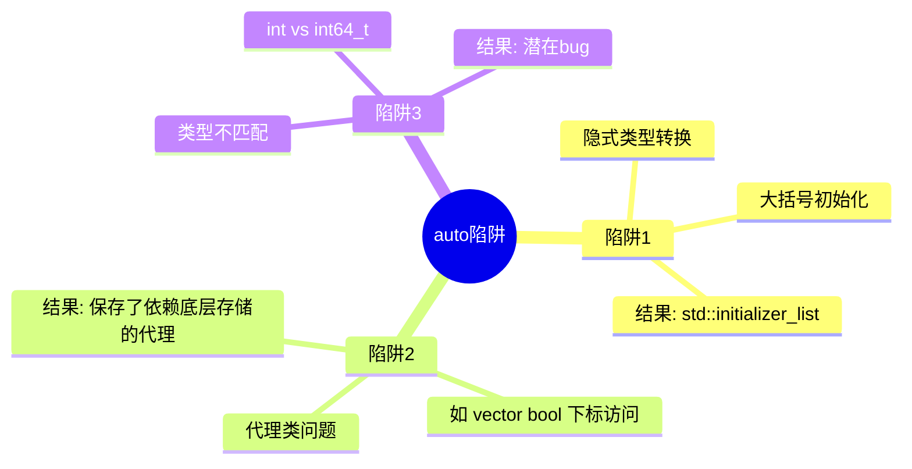

Item 6 的原意不是反对 `auto`，而是处理一类特殊情况：初始化表达式返回的并不是你真正想保存的值，而是一个为了实现运算而临时出现的**代理类型**（invisible proxy type）。此时“精确推导”反而会把代理对象保存下来。

### 3.2 典型陷阱示例

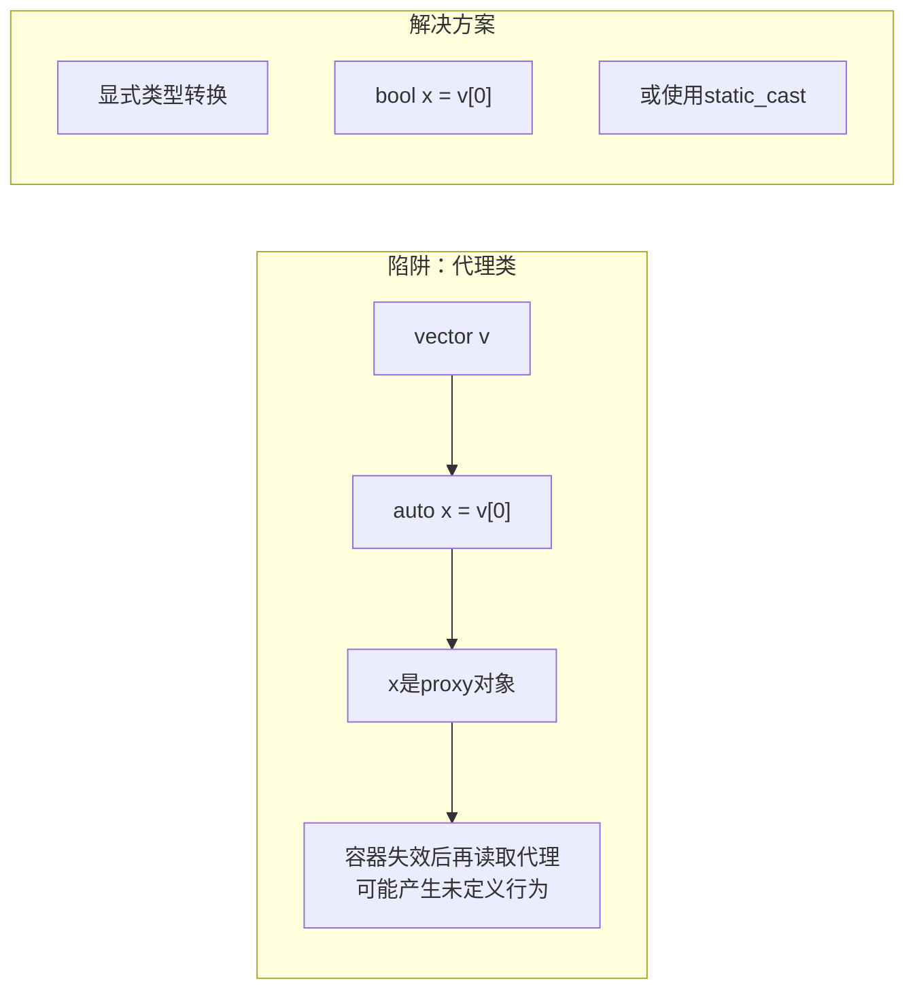

`std::vector<bool>` 为了按位压缩存储，不能像普通 `vector<T>` 那样让 `operator[]` 返回真正的 `bool&`。一个比特不能单独取得普通对象地址，因此它返回类似 `std::vector<bool>::reference` 的代理对象：代理内部记录某个机器字和位位置，并把读取/赋值转发给那个比特。

```cpp
std::vector<bool> flags{true, false};

auto proxy = flags[0];                     // 代理类型，不是 bool
bool value = flags[0];                     // 立即转换并保存真正的 bool 值
auto value2 = static_cast<bool>(flags[0]); // 同样明确保存 bool
```

`auto proxy = flags[0]` **并不会在这一行结束时立刻悬空**；只要 `flags` 及对应存储仍然有效，代理通常仍可读写原比特。风险发生在容器销毁、重新分配或其他使引用失效的操作之后：

```cpp
std::vector<bool> flags{true, false};
auto proxy = flags[0];
flags.clear();
flags.shrink_to_fit();
// bool bad = proxy; // 错误示例：代理可能指向已失效的底层存储，行为未定义
```

所以 Item 6 给出的策略是：当表达式可能返回代理类型，而业务需要的是实际值时，使用**显式类型初始化习惯**：

```cpp
auto enabled = static_cast<bool>(flags[0]);
```

显式转换不是为了迎合编译器，而是在代码中写清“我要代理所代表的值，不要代理本身”。同类问题还可能出现在矩阵表达式模板、惰性计算库等 API 中，应查阅返回类型与生命周期规则。

### 3.3 最佳实践

| 场景 | 推荐 | 避免 |
|------|------|------|
| 简单类型推导 | `auto x = 10;` | - |
| 容器迭代器 | `auto it = v.begin();` | - |
| 想得到单个整数 | `auto x = 42;` 或 `auto x{42};` | `auto x = {42};`（它是列表） |
| vector\<bool\> | `bool x = v[0];` | `auto x = v[0];` |

另外，`auto size = v.size()` 正确保留了容器的无符号 `size_type`，但不代表所有有符号/无符号比较都会自动安全：

```cpp
auto size = v.size(); // 类型正确
int index{-1};
// if (index < size)  // 错误示例：index 通常会先转成无符号数，-1 变成很大的值
```

如果逻辑允许负数索引，就统一使用合适的有符号类型并在转换前检查范围；如果索引本就不应为负数，就保持容器的 `size_type`，不要用 `-1` 作为哨兵。把 `size()` 无条件转成 `int` 也可能在超大容器上溢出，不是通用修复。

---

## 4. LeetCode题目详解

### 4.1 第26题：删除有序数组中的重复项

#### 题目描述
给定一个**升序排列**的数组 `nums`，请**原地**删除重复元素，使每个元素只出现一次，返回删除后数组的新长度。

#### 算法思路：快慢指针

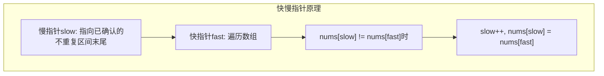

当前实现令 `slow = 0`，所以 `slow` 更准确的含义是“**已确认的不重复区间末尾**”，而不是尚未写入的位置。对于非空有序数组，在每次处理 `fast` 后保持不变量：

- `nums[0..slow]` 恰好是原数组已处理区间去重后的结果；
- 该区间仍然升序且元素互不相同；
- `nums[slow]` 是目前见过的最后一个不同值。

当 `nums[fast] == nums[slow]` 时，由于原数组有序，它只是当前值的重复项，跳过不会破坏不变量；不等时发现了一个新值，先 `++slow` 再写入 `nums[slow]`，不变量继续成立。

```cpp
int removeDuplicates(std::vector<int>& nums) {
    if (nums.empty()) {
        return 0; // 必须先处理空数组，否则 nums[0] 不存在
    }

    std::size_t slow{0};
    for (std::size_t fast{1}; fast < nums.size(); ++fast) {
        if (nums[fast] != nums[slow]) {
            nums[++slow] = nums[fast];
        }
    }
    return week01::checked_index(slow + 1);
}
```

“原地删除”并不会真的缩短 LeetCode 传入的 `vector`，题目只要求返回新长度，并保证前 `k` 个元素是答案；`k` 之后的内容无需关心。若业务代码需要实际缩短容器，可以在算法结束后调用 `resize(k)`。

#### 执行过程示意

```mermaid
gantt
    title 快慢指针执行过程
    dateFormat X
    axisFormat %s
    
    section 初始状态
    数组: [0,0,1,1,1,2,2,3,3,4] :0, 10
    
    section 第一步
    fast=1, nums[0]==nums[1] :1, 2
    
    section 第二步
    fast=2, nums[0]!=nums[2], slow++ :2, 3
    
    section 结果
    前slow+1个元素唯一 :5, 6
```

#### 复杂度分析
- **时间复杂度**: O(n) - 只需遍历一次
- **空间复杂度**: O(1) - 原地修改

---

### 4.2 第27题：移除元素

#### 题目描述
给定数组 `nums` 和值 `val`，**原地**移除所有数值等于 `val` 的元素，返回新长度。

#### 算法思路：双指针

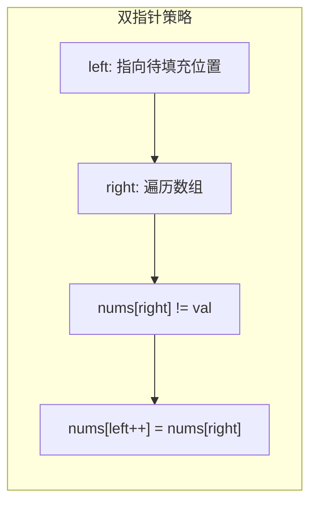

这题的 `left` 采用另一种常见定义：它指向**下一个写入位置**。在处理 `right` 前保持不变量：

- `[0, left)` 全部是不等于 `val` 的已保留元素；
- 它们与原数组中已经处理部分的相对顺序一致；
- `[right, n)` 还未检查。

若 `nums[right] != val`，把它写到 `nums[left]` 再递增 `left`；若相等则跳过。即使 `left == right`，自赋值也安全。循环结束时所有元素都已处理，因此 `[0, left)` 就是答案，返回 `left`。

标准写法稳定地保留相对顺序。代码目录中还有“用末尾元素覆盖待删除元素”的版本，它可能减少赋值，但**不保证元素顺序**；题目允许顺序改变时才能使用。

#### 执行过程图解

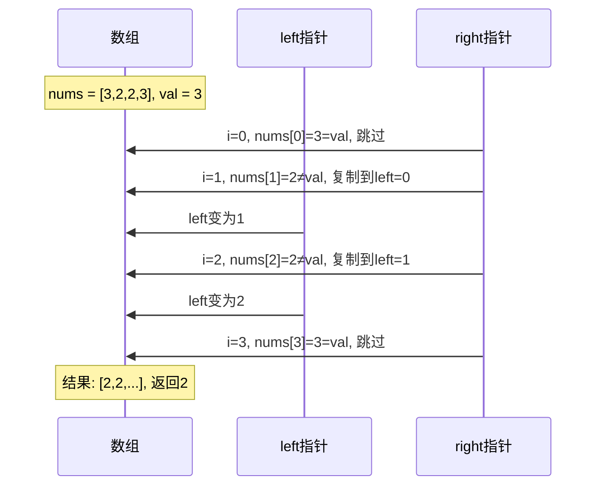

#### 复杂度分析
- **时间复杂度**: O(n)
- **空间复杂度**: O(1)

---

## 5. 编译运行指南

### 5.1 目录结构

```
day_02/
├── README.md
├── CMakeLists.txt
├── build_and_run.sh
└── code/
    ├── main.cpp
    ├── data_structure/
    │   └── array_structure.cpp
    ├── cpp11_features/
    │   └── decltype_demo.cpp
    ├── emcpp/
    │   └── item06_auto_traps.cpp
    └── leetcode/
        ├── 0026_remove_duplicates/
        │   └── solution.cpp
        └── 0027_remove_element/
            └── solution.cpp
```

### 5.2 编译运行

```bash
cd week_01/day_02
./build_and_run.sh
```

### 5.3 预期输出

```
========================================
Day 2: 数组与decltype学习演示
========================================

[1] 数组数据结构演示
====================
数组遍历: 1 2 3 4 5 
数组随机访问: nums[2] = 3
二维数组访问: matrix[1][1] = 5
std::array大小: 5
std::array元素: 10 20 30 40 50 

[2] decltype演示
================
decltype(x) = int
decltype((x)) = int&
decltype(ptr) = int*
decltype(arr) = int[5]
decltype返回类型推导成功: add(1, 2.5) = 3.5

[3] EMC++ 条款6：auto推导陷阱
=============================
陷阱1 - 大括号初始化:
auto x1 = 42 -> i
auto x2 = {42} -> St16initializer_listIiE
陷阱2 - vector<bool>代理类问题:
  直接使用auto会保存依赖底层存储的代理对象
  正确做法: bool val = vec[0];
陷阱3 - 类型不匹配:
  vec.size() 返回 size_t (无符号)
  保持真实类型: auto size = vec.size();
陷阱4 - 数组退化为指针:
  auto数组推导: Pi (指针)
  decltype数组推导: A5_i (数组)

[4] LeetCode 26题：删除有序数组中的重复项
=========================================
测试用例: {1,1,2}
去重后长度: 2
结果数组: 1 2 
测试用例: {0,0,1,1,1,2,2,3,3,4}
去重后长度: 5
结果数组: 0 1 2 3 4 

[5] LeetCode 27题：移除元素
===========================
测试用例: {3,2,2,3}, val=3
移除后长度: 2
结果数组: 2 2 
测试用例: {0,1,2,2,3,0,4,2}, val=2
移除后长度: 5
结果数组: 0 1 3 0 4 

========================================
Day 2 学习完成！
========================================
```

---

## 6. 学习要点总结

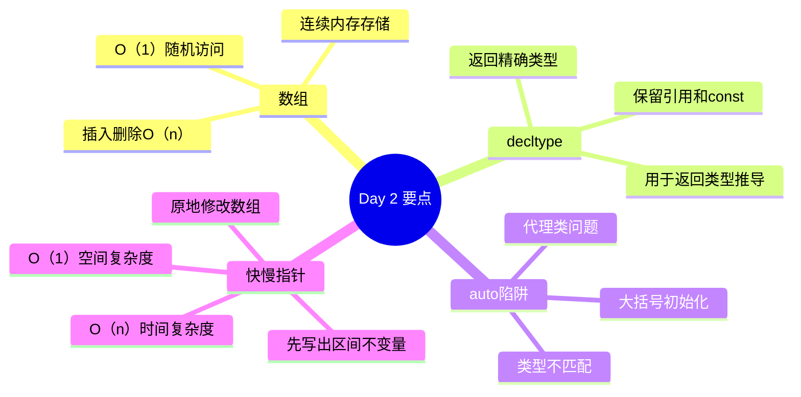

---

## 7. 练习建议

1. **数组操作**: 手动实现数组的插入、删除、查找操作
2. **decltype**: 尝试推导各种复杂表达式的类型
3. **auto陷阱**: 收集并分析实际项目中的auto使用问题
4. **LeetCode**: 完成相关数组题目（26、27、80、283等）

建议每道双指针题都先写三句话，再写循环：每个指针表示什么、循环开始时哪些区间已经满足条件、一次移动为什么不会漏掉答案。这样遇到 Day 3 的逆向双指针时，迁移的是证明方法，而不是死记代码。

### 今日唯一工程动作

为 C 风格数组、`std::array` 和 `std::vector` 各填一行接口责任表，固定记录“长度来源、元素所有者、能否改变长度、越界报告方式”四项。

### 五句复盘

1. 数组的连续存储带来常数时间随机访问，但不会自动提供越界安全。
2. `decltype` 保留表达式类别与声明类型的细节，因此额外括号会改变推导结果。
3. `vector<bool>` 提醒我们 `auto` 可能保存代理对象而不是独立的 `bool` 值。
4. 快慢指针的正确性取决于已处理区间的不变量，而不是指针变量的名字。
5. Day 3 将继续在连续存储上训练写入方向、初始化契约和原地修改。

### 自测问题

1. `std::vector<int>` 对象本身和它管理的元素一定在同一块内存吗？
2. `push_back` 后为什么旧迭代器可能失效？
3. 为什么 `decltype(x)` 是 `int`，而 `decltype((x))` 是 `int&`？
4. `auto bit = std::vector<bool>{true}[0];` 中，临时容器何时销毁？保存下来的代理还能安全吗？
5. LeetCode 26 与 27 的慢指针定义有何不同？各自的不变量是什么？

---

> 💡 **提示**：数组是最基础的数据结构。Day 3 会继续利用连续内存做原地合并，但写入方向将从正向改为逆向；选择方向的依据，是保证尚未读取的数据不会被覆盖。
