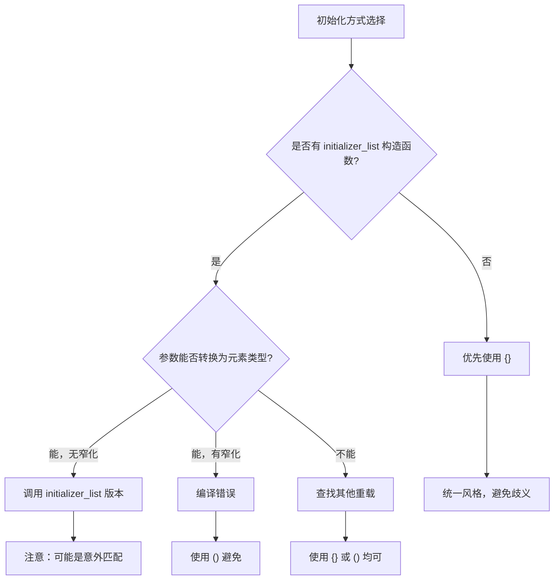
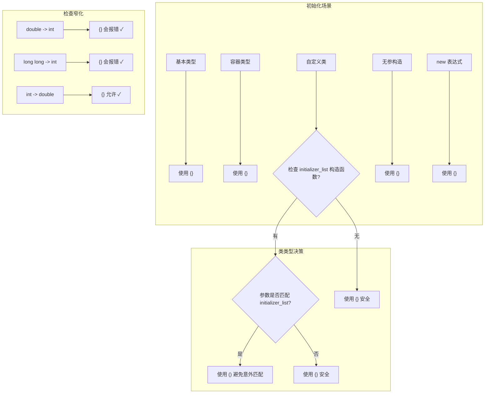
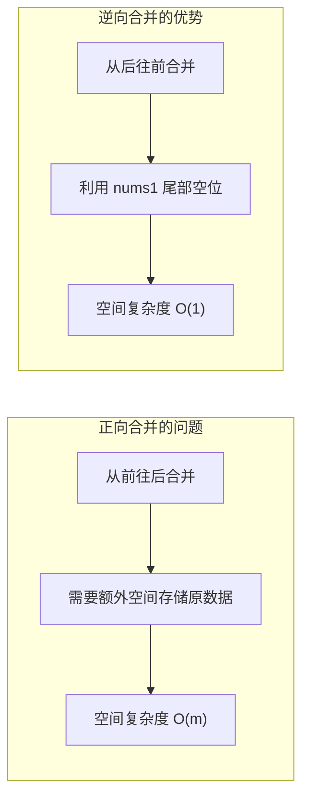
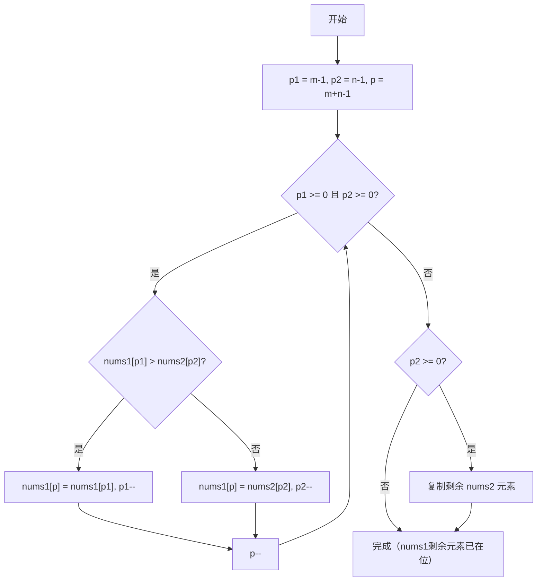
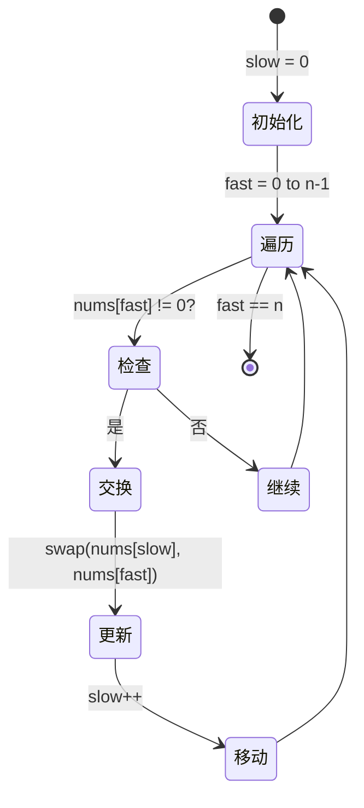

# Day 3: C++11 统一初始化与初始化列表

## 学习目标

1. **掌握统一初始化语法**：理解花括号 `{}` 初始化的优势与使用场景
2. **深入理解 `std::initializer_list`**：掌握其原理与实现机制
3. **理解 EMC++ 条款 7**：能够正确区分 `()` 和 `{}` 初始化的使用场景
4. **掌握逆向双指针技巧**：解决 LeetCode 88 题和 283 题

---

## 知识点详解

### 一、统一初始化（Uniform Initialization）

C++11 引入了**统一初始化语法**，使用花括号 `{}` 进行初始化，解决了传统初始化方式的诸多问题。

#### 1.1 传统初始化的问题

```cpp
// 问题1：最令人苦恼的解析（Most Vexing Parse）
Widget w1();    // 被解析为函数声明，而非对象初始化！

// 问题2：初始化方式不统一
int x = 3;      // 拷贝初始化
int x(3);       // 直接初始化
int x = {3};    // C++11 统一初始化
int x{3};       // C++11 统一初始化（推荐）

// 问题3：容器初始化繁琐
std::vector<int> v;
v.push_back(1);
v.push_back(2);
v.push_back(3);
// C++11: std::vector<int> v{1, 2, 3};
```

#### 1.2 统一初始化的优势

```cpp
// 1. 避免最令人苦恼的解析
Widget w1{};    // 明确是对象初始化，不是函数声明

// 2. 容器直接初始化
std::vector<int> v{1, 2, 3, 4, 5};
std::map<std::string, int> m{{"apple", 1}, {"banana", 2}};

// 3. 动态数组的初始化
int* arr = new int[5]{1, 2, 3, 4, 5};

// 4. 类成员默认初始化
class Widget {
    int x{0};           // C++11 支持
    int y = 0;          // C++11 支持
    // int z(0);         // 错误！不支持
};

// 5. 不可拷贝对象的初始化
std::atomic<int> a1{0};     // OK
std::atomic<int> a2 = 0;    // 错误！不可拷贝
```

#### 1.3 窄化转换检查（Narrowing Conversion）

花括号初始化会**禁止窄化转换**，这是重要的安全特性：

```cpp
double d = 1.5;
int x1 = d;      // OK，但会丢失数据（x1 = 1）
int x2(d);       // OK，但会丢失数据
int x3{d};       // 错误！窄化转换，编译器警告或报错
int x4 = {d};    // 错误！同上

// 更多的窄化转换示例
long long ll = 10000000000LL;
int i1 = ll;     // OK，数据丢失
int i2{ll};      // 错误！窄化转换

float f = 3.14f;
char c1 = f;     // OK
char c2{f};      // 错误！
```

---

### 二、std::initializer_list 详解

#### 2.1 基本概念

`std::initializer_list<T>` 是 C++11 引入的轻量级代理类，用于访问花括号初始化列表中的元素。

```cpp
template<class T>
class initializer_list {
public:
    using value_type = T;
    using reference = const T&;
    using const_iterator = const T*;
    
    constexpr initializer_list() noexcept;
    constexpr size_t size() const noexcept;     // 元素个数
    constexpr const T* begin() const noexcept;  // 起始迭代器
    constexpr const T* end() const noexcept;    // 结束迭代器
};
```

#### 2.2 工作原理

```cpp
void print(std::initializer_list<int> list) {
    for (auto it = list.begin(); it != list.end(); ++it) {
        std::cout << *it << " ";
    }
    // 或使用范围 for
    for (int x : list) {
        std::cout << x << " ";
    }
}

print({1, 2, 3, 4, 5});  // 编译器自动创建 initializer_list
```

#### 2.3 构造函数重载决议

```cpp
class Widget {
public:
    Widget(int i, bool b);              // 构造函数1
    Widget(int i, double d);            // 构造函数2
    Widget(std::initializer_list<long double> il);  // 构造函数3
    
    operator float() const;             // 隐式转换
};

Widget w1(10, true);    // 调用构造函数1
Widget w2(10, 5.0);     // 调用构造函数2
Widget w3{10, true};    // 调用构造函数3！(10 和 true 被转换为 long double)
Widget w4{10, 5.0};     // 调用构造函数3！

// 空花括号：调用默认构造函数（如果有 initializer_list 构造函数）
Widget w5{};            // 调用默认构造函数，而非空的 initializer_list
Widget w6();            // 函数声明！
```

#### 2.4 initializer_list 的陷阱

```cpp
class Widget {
public:
    Widget(int i, bool b);
    Widget(std::initializer_list<bool> il);
};

Widget w{10, 5.0};  // 错误！尝试将 int 和 double 转换为 bool
                    // 发生窄化转换，花括号初始化禁止

// 解决方案：使用圆括号
Widget w(10, 5.0);  // OK，调用第一个构造函数
```

---

### 三、EMC++ 条款 7：区分 () 和 {} 初始化

#### 3.1 初始化方式对比



#### 3.2 使用建议

| 场景 | 推荐方式 | 原因 |
|------|----------|------|
| 变量初始化 | `{}` | 统一风格，防止窄化 |
| 类成员初始化 | `{}` | 唯一支持的方式 |
| 构造函数调用 | 看情况 | 注意 `initializer_list` 陷阱 |
| 无参构造 | `{}` | 避免"最令人苦恼的解析" |
| 容器初始化 | `{}` | 自然、直观 |
| 数值初始化 | `{}` | 防止意外窄化 |

#### 3.3 最佳实践代码示例

```cpp
// 推荐：日常使用花括号初始化
int x{0};
std::string s{"Hello"};
std::vector<int> v{1, 2, 3};

// 推荐：类成员初始化
class Widget {
    int id_{0};
    std::string name_{"default"};
    std::vector<int> data_{};
};

// 警惕：vector 的 initializer_list 构造函数
std::vector<int> v1{10, 20};    // 2个元素: 10, 20
std::vector<int> v2(10, 20);    // 10个元素，每个都是20

// 警惕：有 initializer_list 构造函数时的调用
Widget w1{10, true};    // 可能调用 initializer_list 版本
Widget w2(10, true);    // 调用普通构造函数

// 最佳实践：API设计时，避免让 initializer_list 造成歧义
```

---

### 四、初始化方式决策图



---

## LeetCode 题解：逆向双指针技巧

### 题1：88. 合并两个有序数组

#### 题目描述
给你两个有序整数数组 `nums1` 和 `nums2`，将 `nums2` 合并到 `nums1` 中，使 `nums1` 成为一个有序数组。

#### 思路分析



#### 算法流程



#### 关键代码

```cpp
void merge(vector<int>& nums1, int m, vector<int>& nums2, int n) {
    int p1 = m - 1;     // nums1 有效元素末尾
    int p2 = n - 1;     // nums2 末尾
    int p = m + n - 1;  // 合并后末尾位置
    
    while (p1 >= 0 && p2 >= 0) {
        if (nums1[p1] > nums2[p2]) {
            nums1[p--] = nums1[p1--];
        } else {
            nums1[p--] = nums2[p2--];
        }
    }
    
    // 只需处理 nums2 剩余元素
    while (p2 >= 0) {
        nums1[p--] = nums2[p2--];
    }
}
```

#### 复杂度分析
- **时间复杂度**：O(m + n)，每个元素最多被访问一次
- **空间复杂度**：O(1)，原地操作

---

### 题2：283. 移动零

#### 题目描述
给定一个数组 `nums`，将所有 `0` 移动到数组末尾，同时保持非零元素的相对顺序。

#### 思路分析

```mermaid
flowchart TD
    subgraph 方法一：两次遍历
        A1["第一次遍历"] --> B1["将非零元素移到前面"]
        B1 --> C1["记录非零元素个数"]
        C1 --> D1["第二次遍历填充0"]
    end
    
    subgraph 方法二：双指针一次遍历
        A2["快指针遍历"] --> B2["慢指针记录非零位置"]
        B2 --> C2["遇到非零交换"]
        C2 --> D2["一次遍历完成"]
    end
```

#### 算法流程



#### 关键代码

```cpp
void moveZeroes(vector<int>& nums) {
    int slow = 0;  // 慢指针：下一个非零元素的位置
    
    for (int fast = 0; fast < nums.size(); ++fast) {
        if (nums[fast] != 0) {
            std::swap(nums[slow], nums[fast]);
            ++slow;
        }
    }
}

// 另一种写法：两次遍历
void moveZeroes_v2(vector<int>& nums) {
    // 第一次：移动非零元素
    int pos = 0;
    for (int num : nums) {
        if (num != 0) {
            nums[pos++] = num;
        }
    }
    // 第二次：填充零
    while (pos < nums.size()) {
        nums[pos++] = 0;
    }
}
```

#### 复杂度分析
- **时间复杂度**：O(n)
- **空间复杂度**：O(1)

---

## 代码目录结构

```
code/
├── main.cpp                          # 主程序入口
├── cpp11_features/                   # C++11 特性示例
│   ├── uniform_init.cpp              # 统一初始化示例
│   ├── initializer_list.cpp          # initializer_list 详解
│   └── init_comparison.cpp           # () vs {} 完整对比
├── emcpp/                            # Effective Modern C++
│   └── item07_init_choice.cpp        # 条款7详解
└── leetcode/                         # LeetCode 题解
    ├── 0088_merge_sorted_array/      # 合并有序数组
    │   ├── solution.h
    │   ├── solution.cpp
    │   └── test.cpp
    └── 0283_move_zeroes/             # 移动零
        ├── solution.h
        ├── solution.cpp
        └── test.cpp
```

---

## 构建与运行

```bash
# 进入目录
cd week_01/day_03

# 构建项目
mkdir build && cd build
cmake ..
make

# 运行主程序
./day03_tutorial

# 或使用脚本
./build_and_run.sh
```

---

## 学习检查清单

- [ ] 理解统一初始化的语法和优势
- [ ] 掌握 `std::initializer_list` 的工作原理
- [ ] 能够区分 `()` 和 `{}` 初始化的使用场景
- [ ] 理解窄化转换检查的重要性
- [ ] 独立完成 LeetCode 88 题（逆向双指针）
- [ ] 独立完成 LeetCode 283 题（快慢指针）
- [ ] 理解"最令人苦恼的解析"问题

---

## 拓展阅读

1. **ISO C++ 标准**：[dcl.init] 初始化相关条款
2. **Effective Modern C++**：条款 7 详细讨论
3. **C++ Templates**：`std::initializer_list` 的模板实现细节
4. **LeetCode 热题**：逆向思维在数组操作中的应用

---

## 常见问题

### Q1: 什么时候应该避免使用 `{}` 初始化？
当类有 `initializer_list` 构造函数，而你不想调用它时，应使用 `()`。

### Q2: `std::initializer_list` 的性能开销？
几乎没有。它只是一个指向编译器生成数组的轻量级代理，拷贝成本极低。

### Q3: 逆向双指针还有哪些应用场景？
- 原地删除有序数组中的重复元素
- 原地反转字符串/数组
- 两数之和（有序数组）
- 三数之和问题
