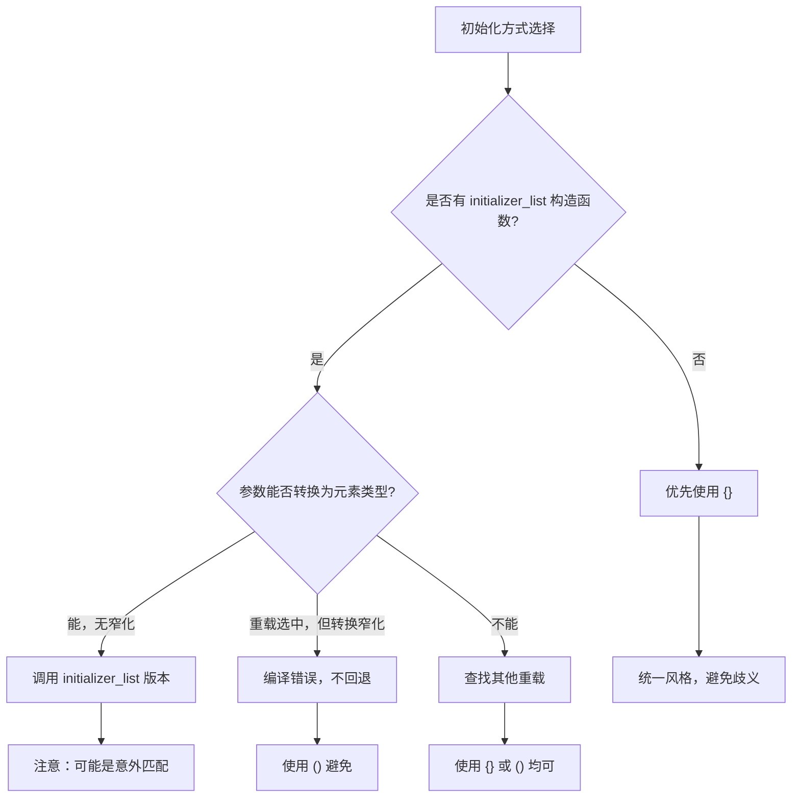
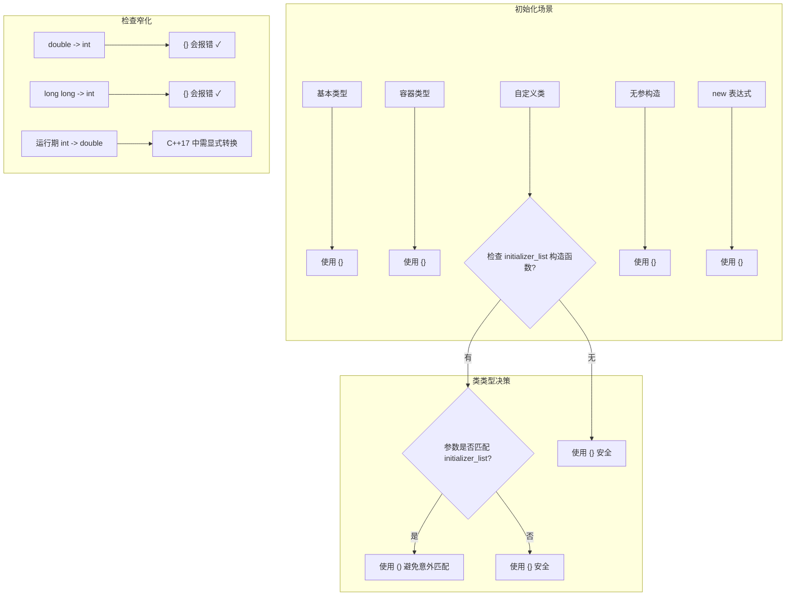
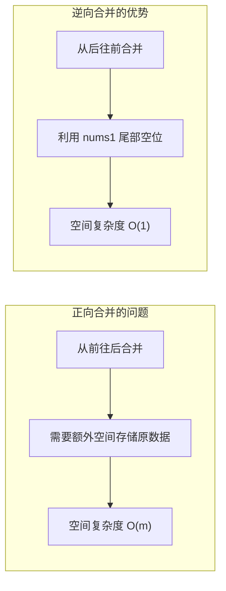
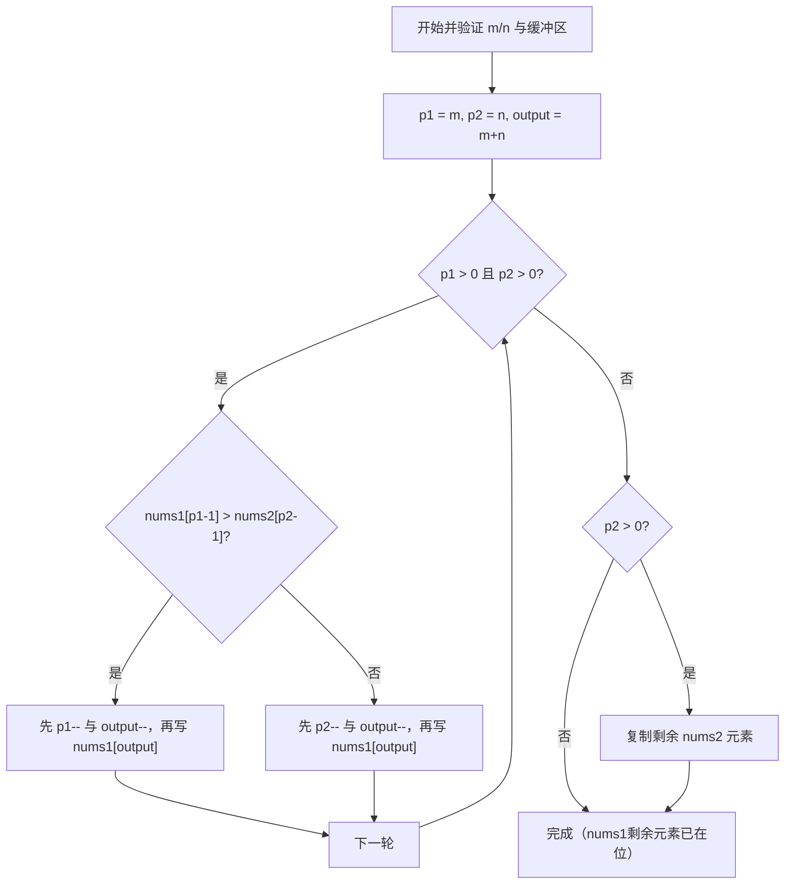
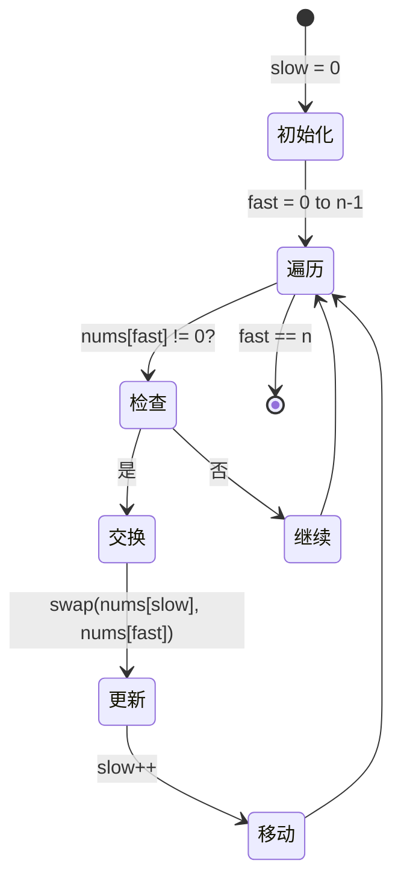

# Day 3: C++11 统一初始化与初始化列表

> **学习定位**：前两日解决“数据是什么类型、放在哪里”，今天解决“对象怎样获得初始状态”。先掌握初始化选择和窄化检查，再用双指针处理有序数组；明日将进入空指针语义和更复杂的指针边界。

初始化不是“给变量赋值”的另一种写法。初始化发生在对象生命期开始时，用来决定对象如何被构造；赋值发生在对象已经存在之后，用新状态替换旧状态。对 `int` 看起来差别不大，对拥有资源、禁止拷贝或提供多个构造函数的类，二者可能调用完全不同的函数。

## 阅读导航

- 列表初始化与 `initializer_list` 的当日语义以本文为主；标准规则可对照 [list-initialization](https://en.cppreference.com/w/cpp/language/list_initialization) 与 [`std::initializer_list`](https://en.cppreference.com/w/cpp/utility/initializer_list)。
- 两道题的完整边界分别见 [LeetCode 88](code/leetcode/0088_merge_sorted_array/README.md) 和 [LeetCode 283](code/leetcode/0283_move_zeroes/README.md)，手算方向对比见 [形象化指南](../算法小白形象化题解指南.md) 的 Day 3 部分。
- 前接 [Day 2 的连续存储与原地覆盖](../day_02/README.md)，后接 [Day 4 的空指针语义与对撞指针](../day_04/README.md)。

## 学习目标

1. **掌握统一初始化语法**：理解花括号 `{}` 初始化的优势与使用场景
2. **深入理解 `std::initializer_list`**：掌握其原理与实现机制
3. **理解 EMC++ 条款 7**：能够正确区分 `()` 和 `{}` 初始化的使用场景
4. **掌握双指针的方向选择与不变量**：用逆向合并解决 LeetCode 88，用稳定分区解决 LeetCode 283

---

## 知识点详解

### 一、统一初始化（Uniform Initialization）

C++11 引入了**统一初始化语法**，使用花括号 `{}` 进行初始化，解决了传统初始化方式的诸多问题。

“统一初始化”是教学中常用的说法，标准术语是**列表初始化（list-initialization）**。花括号让很多对象可以使用相同外观初始化，但不保证它和圆括号语义相同；本日最重要的内容正是辨认这些差异。

#### 1.0 先分清常见初始化类别

```cpp
int a;          // 默认初始化：局部基础类型的值不确定，读取前必须先写入
int b{};        // 值初始化 + 空列表：b 为 0
int c(42);      // 直接初始化
int d = 42;     // 拷贝初始化（不等同于先构造再调用赋值运算符）
int e{42};      // 直接列表初始化
int f = {42};   // 拷贝列表初始化
```

对于类类型，这些语法会参与构造函数选择；对于聚合类型，花括号还能按成员顺序初始化。不要仅凭有没有 `=` 判断“会不会复制”：`T obj = expression;` 是初始化语法，是否真正产生拷贝取决于重载决议与拷贝消除规则。

#### 1.1 传统初始化的问题

```cpp
// 问题1：最令人苦恼的解析（Most Vexing Parse）
Widget w1();    // 被解析为函数声明，而非对象初始化！

// 问题2：初始化方式不统一
int x1 = 3;      // 拷贝初始化
int x2(3);       // 直接初始化
int x3 = {3};    // 拷贝列表初始化
int x4{3};       // 直接列表初始化

// 问题3：容器初始化繁琐
std::vector<int> v;
v.push_back(1);
v.push_back(2);
v.push_back(3);
// C++11: std::vector<int> v{1, 2, 3};
```

#### 1.2 统一初始化的优势

```cpp
// 1. 避免最令人苦恼的解析
Widget w1{};    // 明确是对象初始化，不是函数声明

// 2. 容器直接初始化
std::vector<int> v{1, 2, 3, 4, 5};
std::map<std::string, int> m{{"apple", 1}, {"banana", 2}};

// 3. 动态数组的初始化
int* arr = new int[5]{1, 2, 3, 4, 5};

// 4. 类成员默认初始化
class Widget {
    int x{0};           // C++11 支持
    int y = 0;          // C++11 支持
    // int z(0);         // 错误！不支持
};

// 5. 明确的零初始化
int count{};                 // 0；比未初始化的局部 int 更安全
```

类内成员也可以使用 `=`，所以“花括号是唯一方式”并不准确；真正不允许的是在成员声明处使用圆括号。构造函数的成员初始化列表则可以使用圆括号或花括号，仍要留意 `initializer_list` 重载。

#### 1.3 窄化转换检查（Narrowing Conversion）

花括号初始化会**禁止窄化转换**，这是重要的安全特性：

```cpp
double d = 1.5;
int x1 = d;      // OK，但会丢失数据（x1 = 1）
int x2(d);       // OK，但会丢失数据
int x3{d};       // 编译错误！列表初始化禁止这种窄化转换
int x4 = {d};    // 错误！同上

// 更多的窄化转换示例
long long ll = 10000000000LL;
int i1 = ll;     // OK，数据丢失
int i2{ll};      // 错误！窄化转换

float f = 3.14f;
char c1 = f;     // OK
char c2{f};      // 错误！
```

在 C++17 的列表初始化规则中，常见窄化包括：浮点数转整数、可能丢失范围的整数转换、整数转浮点数但编译期不能证明精确表示，以及某些精度降低的浮点转换。两个细节尤其容易被“类型大小”口诀误导：

```cpp
char c1{42};       // OK：42 是常量表达式，且 char 能表示它
int runtime{42};
// char c2{runtime}; // 错误：runtime 不是常量表达式，编译器不能据值豁免

double d1{42};     // OK：常量 42 可被 double 精确表示
// double d2{runtime}; // C++17 中属于窄化：一般整数变量转浮点数
double d3{static_cast<double>(runtime)}; // OK：显式表达转换意图
```

显式 `static_cast` 会让列表初始化接受结果，但不会神奇地消除数据损失。它的含义是“程序员已经检查并愿意承担这次转换”。因此应先验证范围，再转换，而不是为了让编译器闭嘴到处加 cast。

---

### 二、std::initializer_list 详解

#### 2.1 基本概念

`std::initializer_list<T>` 是 C++11 引入的轻量级代理类，用于访问花括号初始化列表中的元素。

```cpp
template<class T>
class initializer_list {
public:
    using value_type = T;
    using reference = const T&;
    using const_iterator = const T*;
    
    constexpr initializer_list() noexcept;
    constexpr size_t size() const noexcept;     // 元素个数
    constexpr const T* begin() const noexcept;  // 起始迭代器
    constexpr const T* end() const noexcept;    // 结束迭代器
};
```

上面是帮助理解的接口模型，不是要求自己实现。编译器通常为 `{1, 2, 3}` 生成一个临时的 `const int` 数组，再让 `initializer_list<int>` 保存指向首元素的信息和元素个数。因此：

- 拷贝 `initializer_list` 通常只复制指针/长度，不复制所有元素；
- 通过它访问到的是 `const T`，不能修改元素；
- 它适合“读取一组同类型值”，不适合需要移动独占资源的场景，例如不能直接用 initializer list 构造 `vector<unique_ptr<T>>`；
- 保存其迭代器或返回指向底层数组的视图时，必须认真检查底层数组的生命周期。

#### 2.2 工作原理

```cpp
void print(std::initializer_list<int> list) {
    for (auto it = list.begin(); it != list.end(); ++it) {
        std::cout << *it << " ";
    }
    // 或使用范围 for
    for (int x : list) {
        std::cout << x << " ";
    }
}

print({1, 2, 3, 4, 5});  // 编译器自动创建 initializer_list
```

#### 2.3 构造函数重载决议

列表初始化选择构造函数时可以按“两阶段”理解：

1. 第一阶段只考虑 `std::initializer_list` 构造函数，把整组元素当作候选列表。
2. 只有第一阶段没有可行候选时，才考虑其他构造函数，并把花括号中的元素当作普通参数。

因此只要 `initializer_list` 版本能匹配，它往往会压过参数看起来更精确的普通构造函数。更隐蔽的是：若它先被选中，随后发现元素转换属于窄化，程序会直接编译失败，不会“退回”普通重载。

```cpp
// 接口示意：实现位于配套代码中，这里只观察重载选择
class Widget {
public:
    Widget();
    Widget(int i, bool b);              // 构造函数1
    Widget(int i, double d);            // 构造函数2
    Widget(std::initializer_list<long double> il);  // 构造函数3
    
    operator float() const;             // 隐式转换
};

Widget w1(10, true);    // 调用构造函数1
Widget w2(10, 5.0);     // 调用构造函数2
Widget w3{10, true};    // 调用构造函数3！(10 和 true 被转换为 long double)
Widget w4{10, 5.0};     // 调用构造函数3！

// 空花括号：若存在默认构造函数，优先执行默认构造
Widget w5{}; // 调用默认构造函数，而非空 initializer_list

// Widget w6(); // 错误示例：这是函数声明，不是对象
Widget w7(std::initializer_list<long double>{}); // 明确传空列表
```

#### 2.4 initializer_list 的陷阱

```cpp
class Widget {
public:
    Widget(int i, bool b);
    Widget(std::initializer_list<bool> il);
};

Widget w{10, 5.0};  // 错误！尝试将 int 和 double 转换为 bool
                    // 发生窄化转换，花括号初始化禁止

// 解决方案：使用圆括号
Widget w(10, 5.0);  // OK，调用第一个构造函数
```

这里不是说花括号“先发现窄化，所以改找其他构造函数”，恰恰相反：`initializer_list<bool>` 候选先赢得重载决议，然后其元素转换因窄化而使整个声明非法。

---

### 三、EMC++ 条款 7：区分 () 和 {} 初始化

#### 3.1 初始化方式对比


```mermaid
graph TB
    A["初始化方式选择"] --> B{"是否有 initializer_list 构造函数?"}
    B -->|"是"| C{"参数能否转换为元素类型?"}
    B -->|"否"| D["优先使用 {}"]
    C -->|"能，无窄化"| E["调用 initializer_list 版本"]
    C -->|"重载选中，但转换窄化"| F["编译错误，不回退"]
    C -->|"不能"| G["查找其他重载"]
    D --> H["统一风格，避免歧义"]
    E --> I["注意：可能是意外匹配"]
    F --> J["使用 () 避免"]
    G --> K["使用 {} 或 () 均可"]
```

#### 3.2 使用建议

| 场景 | 推荐方式 | 原因 |
|------|----------|------|
| 变量初始化 | `{}` | 统一风格，防止窄化 |
| 类内成员默认初始化 | `{}` 或 `=` | 声明处不支持 `()` |
| 构造函数调用 | 看情况 | 注意 `initializer_list` 陷阱 |
| 无参构造 | `{}` | 避免"最令人苦恼的解析" |
| 容器初始化 | `{}` | 自然、直观 |
| 数值初始化 | `{}` | 防止意外窄化 |

#### 3.3 最佳实践代码示例

```cpp
// 推荐：日常使用花括号初始化
int x{0};
std::string s{"Hello"};
std::vector<int> v{1, 2, 3};

// 推荐：类成员初始化
class Widget {
    int id_{0};
    std::string name_{"default"};
    std::vector<int> data_{};
};

// 警惕：vector 的 initializer_list 构造函数
std::vector<int> v1{10, 20};    // 2个元素: 10, 20
std::vector<int> v2(10, 20);    // 10个元素，每个都是20

// 警惕：有 initializer_list 构造函数时的调用
Widget w1{10, true};    // 可能调用 initializer_list 版本
Widget w2(10, true);    // 调用普通构造函数

// 最佳实践：API设计时，避免让 initializer_list 造成歧义
```

EMC++ Item 7 的结论不是简单的“永远用 `{}`”或“为了安全永远用 `()`”，而是理解两组取舍：

- `{}` 适用面广，能避免最令人苦恼的解析，并在编译期阻止隐式窄化。
- `{}` 会强烈偏向 `initializer_list` 构造函数，可能改变原本想表达的构造语义。
- `()` 不做列表窄化检查，却能明确选择非列表构造语义，例如 `vector(count, value)`。
- 泛型库作者无法预先知道任意类型 `T` 的两种语法是否等价，因此构造策略应成为接口契约的一部分，而不是随手替换括号。

对新手最实用的习惯是：标量和无参构造优先考虑 `{}`；类类型先看构造函数集合，尤其检查是否存在 `initializer_list`；如果两种括号语义不同，就选择能表达业务意图的那一种，并写注释或测试锁定行为。

---

### 四、初始化方式决策图


```mermaid
flowchart TD
    subgraph 初始化场景
        A1["基本类型"] --> B1["使用 {}"]
        A2["容器类型"] --> B2["使用 {}"]
        A3["自定义类"] --> B3{"检查 initializer_list 构造函数?"}
        A4["无参构造"] --> B4["使用 {}"]
        A5["new 表达式"] --> B5["使用 {}"]
    end
    
    subgraph 类类型决策
        B3 -->|"有"| C1{"参数是否匹配 initializer_list?"}
        B3 -->|"无"| C2["使用 {} 安全"]
        C1 -->|"是"| D1["使用 () 避免意外匹配"]
        C1 -->|"否"| D2["使用 {} 安全"]
    end
    
    subgraph 检查窄化
        E1["double -> int"] --> F1["{} 会报错 ✓"]
        E2["long long -> int"] --> F2["{} 会报错 ✓"]
        E3["运行期 int -> double"] --> F3["C++17 中需显式转换"]
    end
```

---

## LeetCode 题解：逆向合并与稳定分区

### 题1：88. 合并两个有序数组

#### 题目描述
给你两个有序整数数组 `nums1` 和 `nums2`，将 `nums2` 合并到 `nums1` 中，使 `nums1` 成为一个有序数组。

#### 思路分析


```mermaid
graph LR
    subgraph 正向合并的问题
        A1["从前往后合并"] --> B1["需要额外空间存储原数据"]
        B1 --> C1["空间复杂度 O(m)"]
    end
    
    subgraph 逆向合并的优势
        A2["从后往前合并"] --> B2["利用 nums1 尾部空位"]
        B2 --> C2["空间复杂度 O(1)"]
    end
```

为什么从前向后写会覆盖数据？`nums1[0..m)` 既是输入，也是结果数组的前半部分。如果较小元素来自 `nums2`，直接写入 `nums1[0]` 可能覆盖一个尚未参与比较的原始元素。数组尾部的 `n` 个预留位置则没有未读的有效数据，所以从尾部写入最安全。

#### 算法流程


```mermaid
flowchart TD
    A["开始并验证 m/n 与缓冲区"] --> B["p1 = m, p2 = n, output = m+n"]
    B --> C{"p1 > 0 且 p2 > 0?"}
    C -->|"是"| D{"nums1[p1-1] > nums2[p2-1]?"}
    D -->|"是"| E["先 p1-- 与 output--，再写 nums1[output]"]
    D -->|"否"| F["先 p2-- 与 output--，再写 nums1[output]"]
    E --> G["下一轮"]
    F --> G
    G --> C
    C -->|"否"| H{"p2 > 0?"}
    H -->|"是"| I["复制剩余 nums2 元素"]
    H -->|"否"| J["完成（nums1剩余元素已在位）"]
    I --> J
```

#### 关键代码

下面是与配套实现一致的核心循环；长度校验由同一源文件中的 `validate_lengths` 完成，因此它属于“核心循环”片段。需要可直接编译的版本时使用 `code/leetcode/0088_merge_sorted_array/solution.cpp`，不要只复制循环而遗漏负长度和缓冲区检查。

```cpp
void merge(vector<int>& nums1, int m, const vector<int>& nums2, int n) {
    const auto [first_size, second_size] =
        validate_lengths(nums1, m, nums2, n);
    size_t p1 = first_size;                   // 未处理区间 [0, p1)
    size_t p2 = second_size;                  // 未处理区间 [0, p2)
    size_t output = first_size + second_size; // 待填区间 [0, output)
    
    while (p1 > 0 && p2 > 0) {
        if (nums1[p1 - 1] > nums2[p2 - 1]) {
            --p1;
            --output;
            nums1[output] = nums1[p1];
        } else {
            --p2;
            --output;
            nums1[output] = nums2[p2];
        }
    }
    
    // 只需处理 nums2 剩余元素
    while (p2 > 0) {
        --p2;
        --output;
        nums1[output] = nums2[p2];
    }
}
```

#### 正确性：维护“结果后缀已经完成”的不变量

在每次循环开始时维护以下事实：

- `nums1[output .. first_size + second_size)` 已经放好最终结果中最大的那一段，并且顺序正确；
- `[0, p1)` 与 `[0, p2)` 分别是两个数组尚未合并的区间，若非空，末元素就是各自最大候选；
- 有关系 `output = p1 + p2`，因此两个未处理区间的元素总数正好等于待填位置数。

两个输入都非空时，最终序列当前最大的剩余元素必然是 `nums1[p1 - 1]` 与 `nums2[p2 - 1]` 中较大的那个。先缩短相应半开区间和 `output`，再写入新尾部，不变量继续成立。`validate_lengths` 先拒绝负长度和缓冲区不匹配，因此这里不需要 `-1` 哨兵，也不会计算可能溢出的 `m + n - 1`。

写入为什么不会覆盖 `nums1` 尚未读取的元素？循环开始时 `output = p1 + p2`；只要 `p2 > 0`，就有 `output > p1`。递减 `output` 后的写入位置仍不小于 `p1`，而 `nums1` 未读取区间是 `[0, p1)`，两者不重叠。当 `nums2` 耗尽时，`nums1` 剩余元素已经位于正确位置，无需搬动；当 `nums1` 耗尽时，只需把 `nums2` 剩余元素继续复制到前面。

边界情况也由同一套不变量覆盖：`m == 0` 时全部复制 `nums2`；`n == 0` 时主循环和补拷贝循环都不执行；有重复值时任选一侧的相等元素先写都不影响最终有序性。

#### 复杂度分析
- **时间复杂度**：O(m + n)，每个元素最多被访问一次
- **空间复杂度**：O(1)，原地操作

---

### 题2：283. 移动零

#### 题目描述
给定一个数组 `nums`，将所有 `0` 移动到数组末尾，同时保持非零元素的相对顺序。

#### 思路分析


```mermaid
flowchart TD
    subgraph method1["方法一：两次遍历"]
        A1["第一次遍历"] --> B1["将非零元素移到前面"]
        B1 --> C1["记录非零元素个数"]
        C1 --> D1["第二次遍历填充0"]
    end
    
    subgraph method2["方法二：双指针一次遍历"]
        A2["快指针遍历"] --> B2["慢指针记录非零位置"]
        B2 --> C2["遇到非零交换"]
        C2 --> D2["一次遍历完成"]
    end
```

这题不是逆向合并，而是**稳定分区**：把非零元素稳定地放到前面，零留在后面。“稳定”表示非零元素的相对顺序不能改变。

#### 算法流程


```mermaid
stateDiagram-v2
    [*] --> 初始化: slow = 0
    初始化 --> 遍历: fast = 0 to n-1
    遍历 --> 检查: nums[fast] != 0?
    检查 --> 交换: 是
    检查 --> 继续: 否
    交换 --> 更新: swap(nums[slow], nums[fast])
    更新 --> 移动: slow++
    移动 --> 遍历
    继续 --> 遍历
    遍历 --> [*]: fast == n
```

#### 关键代码

```cpp
void moveZeroes(vector<int>& nums) {
    size_t slow = 0;  // 慢指针：下一个非零元素的位置
    
    for (size_t fast = 0; fast < nums.size(); ++fast) {
        if (nums[fast] != 0) {
            std::swap(nums[slow], nums[fast]);
            ++slow;
        }
    }
}

// 另一种写法：两次遍历
void moveZeroes_v2(vector<int>& nums) {
    // 第一次：移动非零元素
    size_t pos = 0;
    for (int num : nums) {
        if (num != 0) {
            nums[pos++] = num;
        }
    }
    // 第二次：填充零
    while (pos < nums.size()) {
        nums[pos++] = 0;
    }
}
```

交换写法在处理每个 `fast` 前维护：

- `[0, slow)` 是已经发现的全部非零元素，并保持原相对顺序；
- `[slow, fast)` 全是零；
- `[fast, n)` 尚未处理。

遇到零时只移动 `fast`，零区扩大；遇到非零元素时，它是按原顺序发现的下一个非零值，与 `nums[slow]` 交换后被追加到非零区末尾，同时原来的零被放到已处理区后部。若 `slow == fast`，交换的是元素自身，正确但可以省略。由此循环结束后 `[0, slow)` 是稳定的非零序列，剩余区间全为零。

两次遍历版本维护的核心不变量相同，只是第一遍通过覆盖收集非零值，第二遍显式填零。它通常写入次数更容易分析；交换版本则结构紧凑。二者都是 `O(n)` 时间、`O(1)` 额外空间。

#### 复杂度分析
- **时间复杂度**：O(n)
- **空间复杂度**：O(1)

---

## 代码目录结构

```
code/
├── main.cpp                          # 主程序入口
├── cpp11_features/                   # C++11 特性示例
│   ├── uniform_init.cpp              # 统一初始化示例
│   ├── initializer_list.cpp          # initializer_list 详解
│   └── init_comparison.cpp           # () vs {} 完整对比
├── emcpp/                            # Effective Modern C++
│   └── item07_init_choice.cpp        # 条款7详解
└── leetcode/                         # LeetCode 题解
    ├── 0088_merge_sorted_array/      # 合并有序数组
    │   ├── solution.h
    │   ├── solution.cpp
    │   ├── test.cpp
    │   └── test_main.cpp
    └── 0283_move_zeroes/             # 移动零
        ├── solution.h
        ├── solution.cpp
        ├── test.cpp
        └── test_main.cpp
```

---

## 构建与运行

```bash
# 进入目录
cd week_01/day_03

# 构建项目
cmake -S . -B build -DCMAKE_BUILD_TYPE=Release -DBUILD_TESTS=ON
cmake --build build --parallel

# 运行全部教学演示（非交互）
./build/day03_tutorial --all

# 运行两个独立算法测试
ctest --test-dir build --output-on-failure

# 或使用脚本
./build_and_run.sh
```

---

## 学习检查清单

- [ ] 理解统一初始化的语法和优势
- [ ] 掌握 `std::initializer_list` 的工作原理
- [ ] 能够区分 `()` 和 `{}` 初始化的使用场景
- [ ] 理解窄化转换检查的重要性
- [ ] 独立完成 LeetCode 88 题（逆向双指针）
- [ ] 独立完成 LeetCode 283 题（快慢指针）
- [ ] 理解"最令人苦恼的解析"问题
- [ ] 能解释列表初始化选择构造函数的两阶段规则
- [ ] 能写出 LeetCode 88 的“已完成后缀”循环不变量

---

## 拓展阅读

1. **ISO C++ 标准**：[dcl.init] 初始化相关条款
2. **Effective Modern C++**：条款 7 详细讨论
3. **C++ Templates**：`std::initializer_list` 的模板实现细节
4. **LeetCode 热题**：逆向思维在数组操作中的应用

---

## 常见问题

### Q1: 什么时候应该避免使用 `{}` 初始化？
当类有 `initializer_list` 构造函数，而你不想调用它时，应使用 `()`。

### Q2: `std::initializer_list` 的性能开销？
代理对象本身通常很轻量，复制它一般只复制指针和长度；但元素仍需要被构造，容器通常还要再把这些 `const` 元素复制到自己的存储中。对大对象或只可移动类型，不能笼统地说“几乎没有开销”。

### Q3: 逆向双指针还有哪些应用场景？
- 在目标数组尾部有预留空间时原地合并
- 从后向前填充，避免覆盖尚未读取的输入
- 需要从两端选取当前最大/最小候选的问题

删除重复项、移动零、两数之和也属于双指针，但不一定是“逆向双指针”。判断方向的关键不是题目标签，而是：每次写入是否会破坏未读取数据，以及移动指针时能否证明不会漏解。

### 今日自测

1. `int x;` 与 `int x{};` 对局部变量有什么差别？
2. 为什么 `vector<int>{10, 20}` 和 `vector<int>(10, 20)` 语义不同？
3. 一个 `initializer_list<bool>` 构造函数因窄化失败后，编译器为什么不改选普通构造函数？
4. LeetCode 88 中为什么始终有 `p > p1`（两个输入都还有元素时）？
5. 移动零的交换写法为什么能保持非零元素相对顺序？

如果能用初始化类别、重载决议和循环不变量回答这些问题，就已经从“会照着写”过渡到“知道为何正确”。Day 4 的 `nullptr` 会继续沿用同样的方法：先区分语义，再观察它如何影响重载选择。

### 今日唯一工程动作

从当天任意示例类中选一个，填完“数据成员、有效范围、建立不变量的构造函数、维护不变量的成员函数”四列对象卡。

### 五句复盘

1. 列表初始化能拒绝隐式窄化，显式转换则表示程序员接受转换后果。
2. 花括号会优先考虑 `initializer_list` 构造函数，即使这与圆括号的语义不同。
3. 最令人恼火的解析是声明语法歧义，错误形式应放在注释中而不是可执行路径中。
4. 合并有序数组从后向前写入，是为了不覆盖尚未读取的有效元素。
5. Day 4 将把“语法形式表达意图”的思路转向类型安全的空指针和双指针排除证明。
