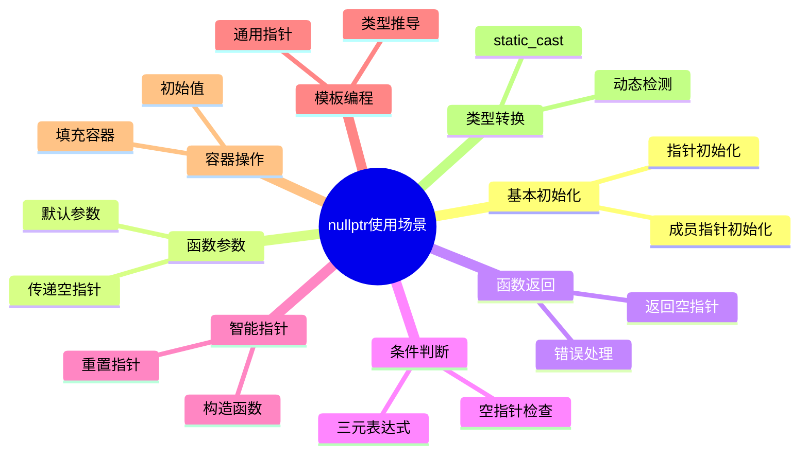
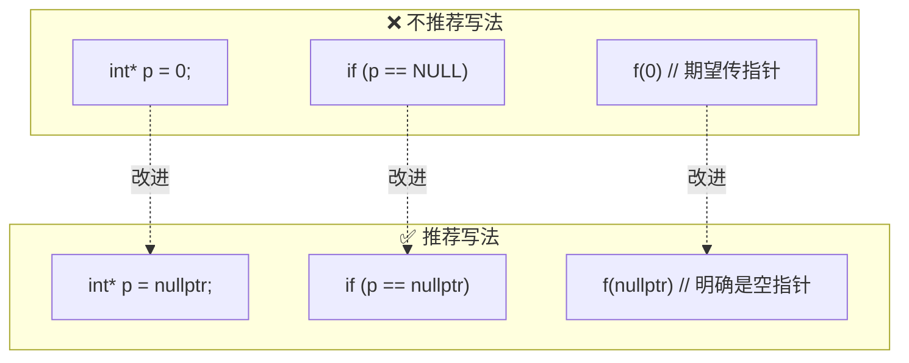
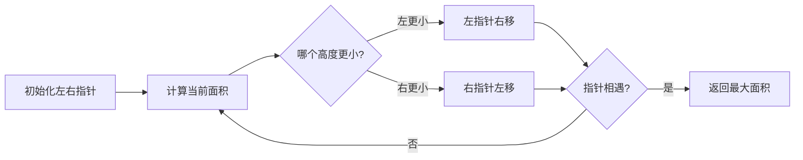

# Day 4: nullptr详解与双指针算法

## 📚 学习目标

1. **深入理解nullptr**：掌握C++11引入的nullptr的关键特性
2. **理解NULL的问题**：了解为什么0和NULL在C++中存在隐患
3. **掌握EMC++条款8**：优先使用nullptr而非0或NULL
4. **双指针算法实践**：通过LeetCode题目掌握双指针技巧
5. **去重技巧**：掌握三数之和中的去重处理

---

## 🔍 知识点详解

### 1. nullptr 基础

#### 1.1 nullptr 是什么？

`nullptr` 是C++11引入的关键字，表示**空指针常量**。

```cpp
// nullptr的类型是 std::nullptr_t
std::nullptr_t null_val = nullptr;

// 可以隐式转换为任何指针类型
int* p1 = nullptr;
double* p2 = nullptr;
void (*func)() = nullptr;
```

#### 1.2 NULL 和 0 的问题

```cpp
// 在C++中，NULL通常被定义为 0
#define NULL 0

// 这会导致函数重载时的问题
void f(int);
void f(int*);

f(0);        // 调用 f(int)
f(NULL);     // 也调用 f(int)！可能不是期望的行为
f(nullptr);  // 调用 f(int*)，明确无误
```

#### 1.3 类型特性对比

| 特性 | 0 | NULL | nullptr |
|------|---|------|---------|
| 类型 | int | int/long | std::nullptr_t |
| 指针安全 | ❌ | ❌ | ✅ |
| 重载正确 | ❌ | ❌ | ✅ |
| 模板友好 | ❌ | ❌ | ✅ |
| 可读性 | 差 | 中 | 优 |

---

### 2. nullptr 的10种使用场景



#### 场景1：指针初始化
```cpp
int* ptr = nullptr;                    // 初始化为空
std::unique_ptr<int> uptr = nullptr;   // 智能指针
```

#### 场景2：函数参数默认值
```cpp
void process(const char* data = nullptr);
```

#### 场景3：函数返回空指针
```cpp
Node* find(int key) {
    if (!exists(key)) return nullptr;
    return &nodes[key];
}
```

#### 场景4：条件判断
```cpp
if (ptr != nullptr) {
    // 安全使用 ptr
}
```

#### 场景5：智能指针重置
```cpp
std::shared_ptr<int> sptr = std::make_shared<int>(42);
sptr = nullptr;  // 等价于 sptr.reset()
```

#### 场景6：模板类型推导
```cpp
template<typename T>
void func(T arg) {
    T* ptr = nullptr;  // 正确初始化
}

func(nullptr);  // T 推导为 std::nullptr_t
```

#### 场景7：容器初始化
```cpp
std::vector<int*> vec(10, nullptr);  // 10个空指针
```

#### 场景8：类型安全转换
```cpp
// nullptr 可以安全转换为任何指针类型
void* vptr = nullptr;
int* iptr = static_cast<int*>(vptr);  // OK
```

#### 场景9：函数重载区分
```cpp
void handle(int value);
void handle(int* ptr);
void handle(std::nullptr_t);  // 专门处理nullptr

handle(nullptr);  // 明确调用第三个
```

#### 场景10：布尔上下文
```cpp
int* ptr = nullptr;
bool isEmpty = !ptr;        // true
if (ptr) { /* 不执行 */ }   // 隐式布尔转换
```

---

### 3. EMC++ 条款8：优先使用nullptr

#### 3.1 核心原则

> **Prefer nullptr to 0 and NULL.**

#### 3.2 为什么要避免使用0和NULL？

```cpp
// 问题1：重载歧义
void f(int);
void f(bool);
void f(void*);

f(0);     // 调用 f(int)
f(NULL);  // 可能调用 f(int)，取决于NULL的定义
f(nullptr);  // 调用 f(void*) ✓

// 问题2：模板中的类型丢失
template<typename T>
void call(T arg) {
    func(arg);  // 如果arg是0，T是int而非指针类型
}

call(0);        // T = int
call(NULL);     // T = int 或 long
call(nullptr);  // T = std::nullptr_t，可以正确传递
```

#### 3.3 代码示例对比



---

## 🧠 LeetCode 题目解析

### LeetCode 11: 盛最多水的容器

#### 题目描述

给定一个长度为 n 的整数数组 height，找出两条线，使得它们与 x 轴共同构成的容器可以容纳最多的水。

#### 算法思路：双指针贪心



#### 核心思想

1. **贪心策略**：每次移动较矮的边，因为只有移动较矮边才可能获得更大的面积
2. **双指针**：从两端向中间收缩，保证不遗漏最优解
3. **时间复杂度**：O(n)，空间复杂度：O(1)

#### 代码实现

```cpp
int maxArea(vector<int>& height) {
    int left = 0, right = height.size() - 1;
    int maxWater = 0;
    
    while (left < right) {
        // 计算当前容器面积
        int h = min(height[left], height[right]);
        int width = right - left;
        maxWater = max(maxWater, h * width);
        
        // 移动较矮的边
        if (height[left] < height[right]) {
            left++;
        } else {
            right--;
        }
    }
    
    return maxWater;
}
```

---

### LeetCode 15: 三数之和

#### 题目描述

找出所有和为0的三元组，要求不包含重复的三元组。

#### 算法思路：排序 + 双指针 + 去重

```mermaid
flowchart TB
    A[排序数组] --> B[遍历第一个数i]
    B --> C[剪枝: nums\[i\] > 0 跳出]
    C --> D[去重: 跳过相同的i]
    D --> E[双指针: left=i+1, right=n-1]
    E --> F{计算sum}
    F -->|sum = 0| G[记录结果]
    G --> H[跳过重复的left/right]
    H --> E
    F -->|sum < 0| I[left++]
    I --> E
    F -->|sum > 0| J[right--]
    J --> E
```

#### 去重技巧详解

```cpp
vector<vector<int>> threeSum(vector<int>& nums) {
    vector<vector<int>> result;
    sort(nums.begin(), nums.end());
    int n = nums.size();
    
    for (int i = 0; i < n - 2; i++) {
        // 去重1：跳过相同的第一个数
        if (i > 0 && nums[i] == nums[i - 1]) continue;
        
        // 剪枝优化
        if (nums[i] > 0) break;
        
        int left = i + 1, right = n - 1;
        while (left < right) {
            int sum = nums[i] + nums[left] + nums[right];
            
            if (sum == 0) {
                result.push_back({nums[i], nums[left], nums[right]});
                
                // 去重2：跳过相同的第二个数
                while (left < right && nums[left] == nums[left + 1]) left++;
                // 去重3：跳过相同的第三个数
                while (left < right && nums[right] == nums[right - 1]) right--;
                
                left++;
                right--;
            } else if (sum < 0) {
                left++;
            } else {
                right--;
            }
        }
    }
    
    return result;
}
```

#### 去重图解

```
数组: [-1, -1, 0, 0, 1, 1, 2, 2]
       ↑   ↑       ↑       ↑
       i   left    right
       
情况1: 第一个数去重
i=0: nums[0]=-1
i=1: nums[1]=-1 (跳过，因为nums[1]==nums[0])

情况2: 第二个数去重
left=2: nums[2]=0
left=3: nums[3]=0 (需要跳过)

情况3: 第三个数去重
right=6: nums[6]=2
right=5: nums[5]=1 (不同，继续)
```

---

## 📁 代码结构

```
day_04/
├── README.md                    # 本文档
├── CMakeLists.txt              # CMake构建文件
├── build_and_run.sh            # 构建和运行脚本
└── code/
    ├── main.cpp                # 主程序入口
    ├── cpp11_features/         # nullptr特性演示
    │   ├── nullptr_demo.cpp    # 基本用法
    │   ├── nullptr_vs_null.cpp # 与NULL对比
    │   └── nullptr_overload.cpp# 重载场景
    ├── emcpp/                  # EMC++条款实现
    │   └── item08_prefer_nullptr.cpp
    └── leetcode/               # LeetCode题目
        ├── 0011_container_with_most_water/
        └── 0015_3sum/
```

---

## 🚀 构建和运行

```bash
# 进入目录
cd /home/z/my-project/download/week_01/day_04

# 添加执行权限并运行
chmod +x build_and_run.sh
./build_and_run.sh
```

---

## 💡 关键要点总结

| 概念 | 要点 |
|------|------|
| nullptr | 类型安全的空指针，优先使用 |
| NULL | C++中定义为0，存在重载歧义 |
| 0 | 整数类型，不是指针类型 |
| 双指针 | O(n)时间复杂度解决两数问题 |
| 去重 | 排序后跳过相同元素 |

---

## 🔗 扩展阅读

1. [C++11 nullptr详解](https://en.cppreference.com/w/cpp/language/nullptr)
2. [Effective Modern C++ - Item 8](https://www.aristeia.com/EMC++.html)
3. [LeetCode双指针专题](https://leetcode.com/tag/two-pointers/)

---

## 📝 练习

1. 编写代码验证nullptr不能赋值给整型变量
2. 实现一个函数模板，正确处理nullptr参数
3. 修改LeetCode 15，实现四数之和
4. 思考：为什么nullptr不能进行算术运算？
