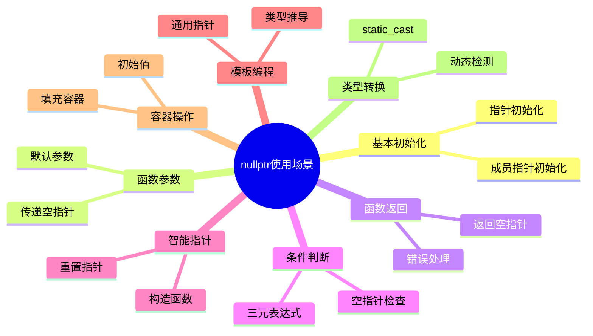
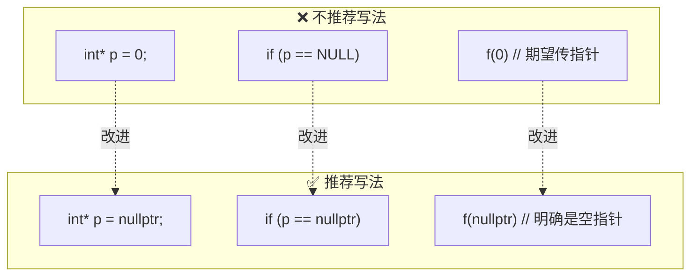
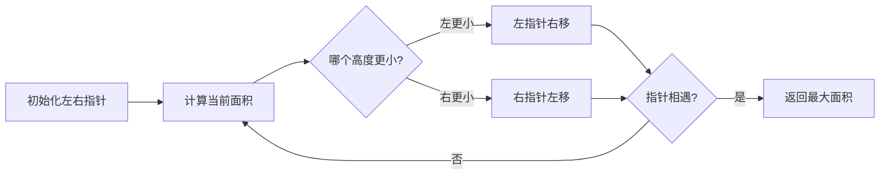
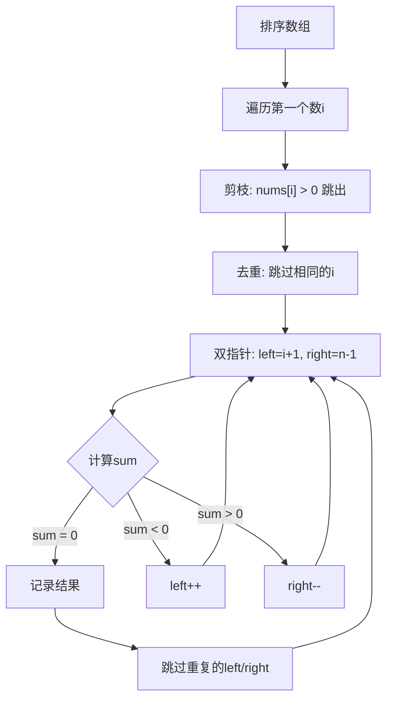

# Day 4: nullptr详解与双指针算法

> **学习定位**：承接 Day 3 的初始化规则，本日明确“没有对象”应如何表达，并继续训练对撞指针。`nullptr` 的重载优势会在 Week 2 的链表与智能指针中反复用到。

## 阅读导航

- `nullptr` 的标准转换与重载语义可对照 [cppreference](https://en.cppreference.com/w/cpp/language/nullptr)；本文负责把它连接到接口空值契约。
- 盛水容器和三数之和的完整证明分别见 [LeetCode 11](code/leetcode/0011_container_with_most_water/README.md) 与 [LeetCode 15](code/leetcode/0015_3sum/README.md)，图解见 [形象化指南](../算法小白形象化题解指南.md) 的 Day 4 部分。
- 前接 [Day 3 的重载选择](../day_03/README.md)，后接 [Day 5 的滑动窗口](../day_05/README.md)；Week 2 会继续区分空指针、悬空指针和所有权。

## 📚 学习目标

1. **深入理解nullptr**：掌握C++11引入的nullptr的关键特性
2. **理解NULL的问题**：了解为什么0和NULL在C++中存在隐患
3. **掌握EMC++条款8**：优先使用nullptr而非0或NULL
4. **双指针算法实践**：通过LeetCode题目掌握双指针技巧
5. **去重技巧**：掌握三数之和中的去重处理

---

## 🔍 知识点详解

### 1. nullptr 基础

#### 1.0 先把“指针”说清楚

如果把对象想成一间房子，指针保存的就是房子的“地址”：

```cpp
int value = 42;        // 真正存放数据的对象
int* ptr = &value;     // ptr 保存 value 的地址
std::cout << *ptr;     // 解引用：沿地址找到对象，读出 42
```

指针有三种需要分清的状态：

1. 指向有效对象：可以在对象生命期内解引用。
2. 空指针：明确表示“当前没有指向任何对象”。
3. 悬空指针：仍保存某个地址，但对象已经销毁；这比空指针更危险。

`nullptr` 只能表示第 2 种状态，不会自动解决悬空指针、重复释放或资源所有权问题。任何空指针都不能解引用：

```cpp
int* ptr = nullptr;
// std::cout << *ptr;  // 错误：解引用空指针，行为未定义
```

#### 1.1 nullptr 是什么？

`nullptr` 是C++11引入的关键字，表示**空指针常量**。

```cpp
// nullptr的类型是 std::nullptr_t
std::nullptr_t null_val = nullptr;

// 可以隐式转换为任何指针类型
int* p1 = nullptr;
double* p2 = nullptr;
void (*func)() = nullptr;
```

#### 1.2 NULL 和 0 的问题

```cpp
// NULL 是实现提供的宏，常见定义是 0 或 0L。
// 不要在自己的程序中重新 #define NULL。

// 这会导致函数重载时的问题
void f(int);
void f(int*);

f(0);        // 调用 f(int)
f(NULL);     // 结果受 NULL 实现影响，可能调到整数版或产生歧义
f(nullptr);  // 调用 f(int*)，明确无误
```

#### 1.3 类型特性对比

| 特性 | 0 | NULL | nullptr |
|------|---|------|---------|
| 类型 | `int` | 由实现提供的宏展开结果 | `std::nullptr_t` |
| 表意 | 整数，也可作空指针常量 | 空指针宏，但本质常为整数 | 专门的空指针字面量 |
| 重载选择 | 容易选中整数重载 | 依实现而定，可能歧义 | 优先匹配指针语义 |
| 模板推导 | 推导为 `int` | 常推导为整数类型 | 推导为 `std::nullptr_t` |
| 可读性 | 差 | 中 | 优 |

---

### 2. nullptr 的10种使用场景


```mermaid
mindmap
  root((nullptr使用场景))
    基本初始化
      指针初始化
      成员指针初始化
    函数参数
      传递空指针
      默认参数
    函数返回
      返回空指针
      错误处理
    条件判断
      空指针检查
      三元表达式
    智能指针
      重置指针
      构造函数
    模板编程
      类型推导
      通用指针
    容器操作
      初始值
      填充容器
    类型转换
      static_cast
      动态检测
```

#### 场景1：指针初始化
```cpp
int* ptr = nullptr;                    // 初始化为空
std::unique_ptr<int> uptr = nullptr;   // 智能指针
```

#### 场景2：函数参数默认值
```cpp
void process(const char* data = nullptr);
```

#### 场景3：函数返回空指针
```cpp
Node* find(int key) {
    if (!exists(key)) return nullptr;
    return &nodes[key];
}
```

#### 场景4：条件判断
```cpp
if (ptr != nullptr) {
    // 安全使用 ptr
}
```

#### 场景5：智能指针重置
```cpp
std::shared_ptr<int> sptr = std::make_shared<int>(42);
sptr = nullptr;  // 等价于 sptr.reset()
```

#### 场景6：模板类型推导
```cpp
template<typename T>
void inspect(T arg);

inspect(0);        // T = int
inspect(NULL);     // T 取决于实现提供的宏展开结果，常见为整数类型
inspect(nullptr);  // T = std::nullptr_t
```

这不表示 `std::nullptr_t` 本身是某种指针类型；它是一个可转换成任意指针类型的独立类型。

#### 场景7：容器初始化
```cpp
std::vector<int*> vec(10, nullptr);  // 10个空指针
```

#### 场景8：转换为具体指针类型
```cpp
int* iptr = nullptr;            // 隐式转换为 int*
void (*callback)() = nullptr;   // 也可转换为函数指针
// int value = nullptr;         // 错误：不能当成普通整数
```

#### 场景9：函数重载区分
```cpp
void handle(int value);
void handle(int* ptr);
void handle(std::nullptr_t);  // 专门处理nullptr

handle(nullptr);  // 明确调用第三个
```

#### 场景10：布尔上下文
```cpp
int* ptr = nullptr;
bool isEmpty = !ptr;        // true
if (ptr) { /* 不执行 */ }   // 隐式布尔转换
```

---

### 3. EMC++ 条款8：优先使用nullptr

#### 3.1 核心原则

> **Prefer nullptr to 0 and NULL.**

#### 3.2 为什么要避免使用0和NULL？

```cpp
// 问题1：重载歧义
void f(int);
void f(bool);
void f(void*);

f(0);     // 调用 f(int)
f(NULL);  // 可能调用 f(int)，取决于NULL的定义
f(nullptr);  // 调用 f(void*) ✓

// 问题2：模板会记住实参的真实类型
void consume(int*);

template<typename T>
void forward_to_consume(T arg) {
    consume(arg);
}

// forward_to_consume(0);     // 错误：T = int，函数参数 arg 不再是“字面量 0”
// forward_to_consume(NULL);  // 同理，T 为整数类型
forward_to_consume(nullptr);  // 正确：std::nullptr_t 仍可转换为 int*
```

这就是 Item 8 不只谈“代码好看”的原因：`nullptr` 在跨越函数模板边界后仍保留空指针语义。

#### 3.3 代码示例对比


```mermaid
flowchart TB
    subgraph "❌ 不推荐写法"
        A1["int* p = 0;"]
        A2["if (p == NULL)"]
        A3["f(0) // 期望传指针"]
    end
    
    subgraph "✅ 推荐写法"
        B1["int* p = nullptr;"]
        B2["if (p == nullptr)"]
        B3["f(nullptr) // 明确是空指针"]
    end
    
    A1 -.->|改进| B1
    A2 -.->|改进| B2
    A3 -.->|改进| B3
```

---

## 🧠 LeetCode 题目解析

### LeetCode 11: 盛最多水的容器

#### 题目描述

给定一个长度为 n 的整数数组 height，找出两条线，使得它们与 x 轴共同构成的容器可以容纳最多的水。

#### 算法思路：双指针贪心


```mermaid
flowchart LR
    A[初始化左右指针] --> B[计算当前面积]
    B --> C{哪个高度更小?}
    C -->|左更小| D[左指针右移]
    C -->|右更小| E[右指针左移]
    D --> F{指针相遇?}
    E --> F
    F -->|否| B
    F -->|是| G[返回最大面积]
```

#### 核心思想

1. **状态**：`left` 和 `right` 表示当前还没有被排除的两端。
2. **面积瓶颈**：面积是 `min(左高, 右高) × 宽度`，因此较矮边限制了当前高度。
3. **排除证明**：假设左边不高于右边。固定左边、把右边向左移，宽度变小，高度又不会超过左边，所以不可能超过当前面积。因而可以安全排除当前左边，移动 `left`。
4. **复杂度**：两个指针各自只单调移动，时间 O(n)，额外空间 O(1)。

#### 代码实现

下面展示核心函数体；`validate_input` 与 `week01::checked_result` 分别承担非负高度/长度检查和 `int` 返回范围检查。可编译权威版本位于 `code/leetcode/0011_container_with_most_water/solution.cpp`。

```cpp
int maxArea(vector<int>& height) {
    validate_input(height);
    if (height.size() < 2) return 0;

    size_t left = 0;
    size_t right = height.size() - 1;
    int64_t max_water = 0;
    
    while (left < right) {
        // 计算当前容器面积
        const int64_t h = min(height[left], height[right]);
        const int64_t width = static_cast<int64_t>(right - left);
        max_water = max(max_water, h * width);
        
        // 移动较矮的边
        if (height[left] < height[right]) {
            ++left;
        } else {
            --right;
        }
    }
    
    return week01::checked_result(max_water);
}
```

---

### LeetCode 15: 三数之和

#### 题目描述

找出所有和为0的三元组，要求不包含重复的三元组。

#### 算法思路：排序 + 双指针 + 去重


```mermaid
flowchart TB
    A[排序数组] --> B[遍历第一个数i]
    B --> C["剪枝: nums[i] > 0 跳出"]
    C --> D[去重: 跳过相同的i]
    D --> E[双指针: left=i+1, right=n-1]
    E --> F{计算sum}
    F -->|sum = 0| G[记录结果]
    G --> H[跳过重复的left/right]
    H --> E
    F -->|"sum < 0"| I["left++"]
    I --> E
    F -->|"sum > 0"| J["right--"]
    J --> E
```

#### 去重技巧详解

先排序的价值不只是“能用双指针”：相同值会聚在一起，因此才能通过跳过相邻重复值去重。循环不变量是：在固定 `i` 后，`[i + 1, left)` 中过小的候选和 `(right, n)` 中过大的候选都已排除。

下面是核心函数体；配套实现还通过公开头文件提供类接口。复制到独立文件时需要补齐 `<algorithm>`、`<cstdint>`、`<vector>` 和相应 `std::` 限定，权威可编译版本位于本题 `solution.cpp`。

```cpp
vector<vector<int>> threeSum(vector<int>& nums) {
    vector<vector<int>> result;
    sort(nums.begin(), nums.end());

    for (size_t i = 0; i + 2 < nums.size(); ++i) {
        // 去重1：跳过相同的第一个数
        if (i > 0 && nums[i] == nums[i - 1]) continue;
        
        // 剪枝优化
        if (nums[i] > 0) break;
        
        size_t left = i + 1;
        size_t right = nums.size() - 1;
        while (left < right) {
            const int64_t sum = static_cast<int64_t>(nums[i]) +
                                nums[left] + nums[right];
            
            if (sum == 0) {
                result.push_back({nums[i], nums[left], nums[right]});
                
                // 去重2：跳过相同的第二个数
                while (left < right && nums[left] == nums[left + 1]) ++left;
                // 去重3：跳过相同的第三个数
                while (left < right && nums[right] == nums[right - 1]) --right;
                
                ++left;
                --right;
            } else if (sum < 0) {
                ++left;
            } else {
                --right;
            }
        }
    }
    
    return result;
}
```

#### 去重图解

```
数组: [-1, -1, 0, 0, 1, 1, 2, 2]
       ↑   ↑       ↑       ↑
       i   left    right
       
情况1: 第一个数去重
i=0: nums[0]=-1
i=1: nums[1]=-1 (跳过，因为nums[1]==nums[0])

情况2: 第二个数去重
left=2: nums[2]=0
left=3: nums[3]=0 (需要跳过)

情况3: 第三个数去重
right=6: nums[6]=2
right=5: nums[5]=1 (不同，继续)
```

---

## 📁 代码结构

```
day_04/
├── README.md                    # 本文档
├── CMakeLists.txt              # CMake构建文件
├── build_and_run.sh            # 构建和运行脚本
└── code/
    ├── main.cpp                # 主程序入口
    ├── cpp11_features/         # nullptr特性演示
    │   ├── nullptr_demo.cpp    # 基本用法
    │   ├── nullptr_vs_null.cpp # 与NULL对比
    │   └── nullptr_overload.cpp# 重载场景
    ├── emcpp/                  # EMC++条款实现
    │   └── item08_prefer_nullptr.cpp
    └── leetcode/               # LeetCode题目
        ├── 0011_container_with_most_water/
        └── 0015_3sum/
```

---

## 🚀 构建和运行

```bash
# 进入目录
cd week_01/day_04

./build_and_run.sh
```

---

## 💡 关键要点总结

| 概念 | 要点 |
|------|------|
| nullptr | 类型安全的空指针，优先使用 |
| NULL | 实现提供的宏，常表现为整数空指针常量，重载结果不可靠 |
| 0 | 整数类型，不是指针类型 |
| 双指针 | 利用有序性或可证明的排除规则，让边界单调移动 |
| 去重 | 排序后跳过相同元素 |

---

## 🔗 扩展阅读

1. [C++11 nullptr详解](https://en.cppreference.com/w/cpp/language/nullptr)
2. [Effective Modern C++ - Item 8](https://www.aristeia.com/EMC++.html)
3. [LeetCode双指针专题](https://leetcode.com/tag/two-pointers/)

---

## 📝 练习

1. **验证语言规则**：分别尝试将 `0`、`NULL`、`nullptr` 传给整数/指针重载，记录编译结果。
2. **解释机制**：不看文档，用自己的话解释为什么模板包装函数中 `0` 不再能当空指针，`nullptr` 却可以。
3. **手算算法**：对 `[1,8,6,2,5,4,8,3,7]` 写出盛水题每轮的 `left/right/area/maxArea`。
4. **独立编程**：不复制模板，重写三数之和，并补充空数组、全 0、大量重复值和整数边界测试。
5. **进阶迁移**：实现四数之和，说明它与三数之和共用了哪些模板。

## 🧩 今日唯一工程动作

为代码中一个指针参数写一张空值契约卡，卡片只记录“是否允许 `nullptr`、空值行为、违约报告、是否保存指针”四项。

## 📝 五句复盘

1. `nullptr` 具有 `std::nullptr_t` 类型，因此能在重载和模板推导中保留指针意图。
2. `0` 和 `NULL` 可能走向整数重载，所以它们不是现代 C++ 的空指针接口选择。
3. 非空检查只能排除空值，不能证明对象生命周期仍然有效。
4. 盛水容器和三数之和的指针移动都需要可证明的排除规则和安全的中间算术类型。
5. Day 5 将把两端向中间的边界移动扩展为维护连续区间状态的滑动窗口。

## ✅ 完成标准与下一日过渡

完成 Day 4 后，你应能说清“空指针不等于悬空指针”，也能为双指针的移动规则给出排除证明。Day 5 会把“两端向中间收缩”扩展成“维护一个连续区间的状态”，即滑动窗口。
