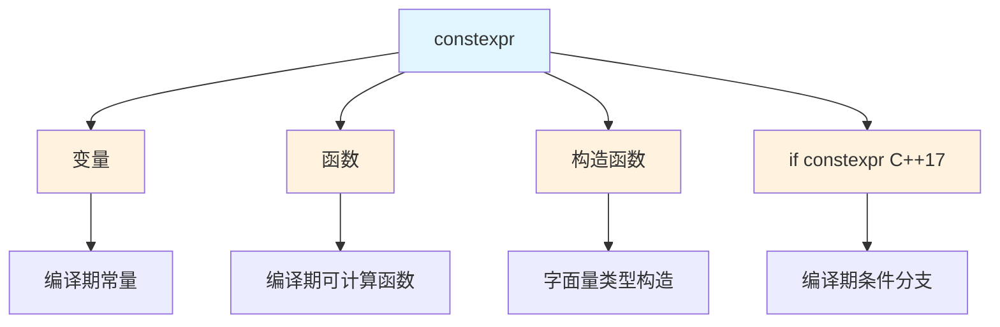
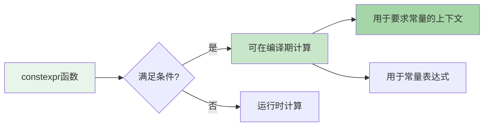
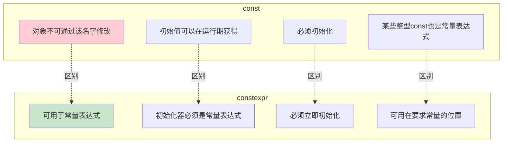
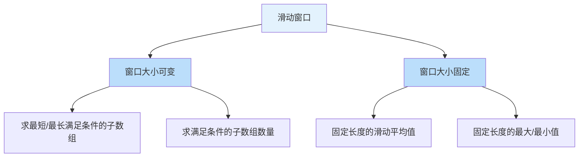
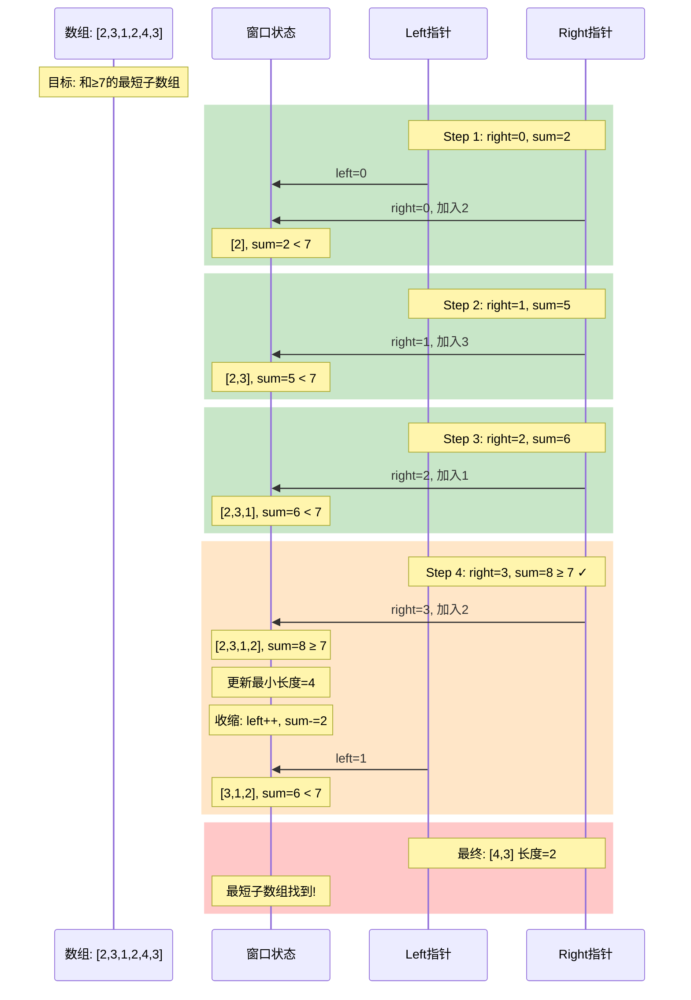
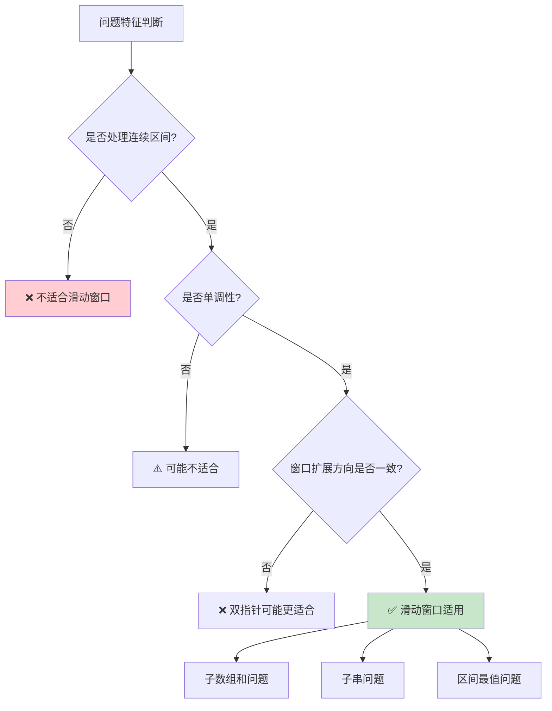
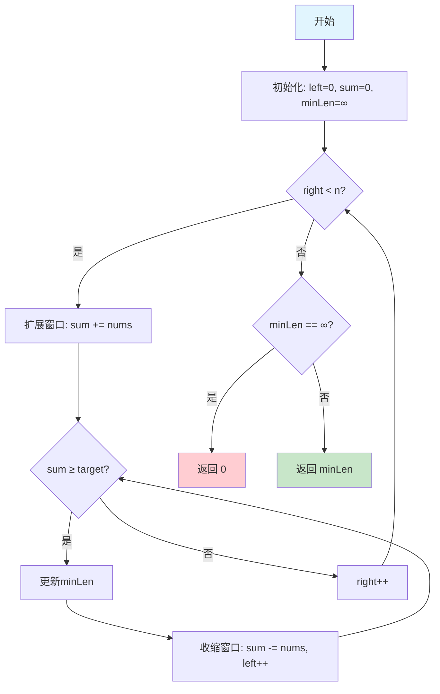
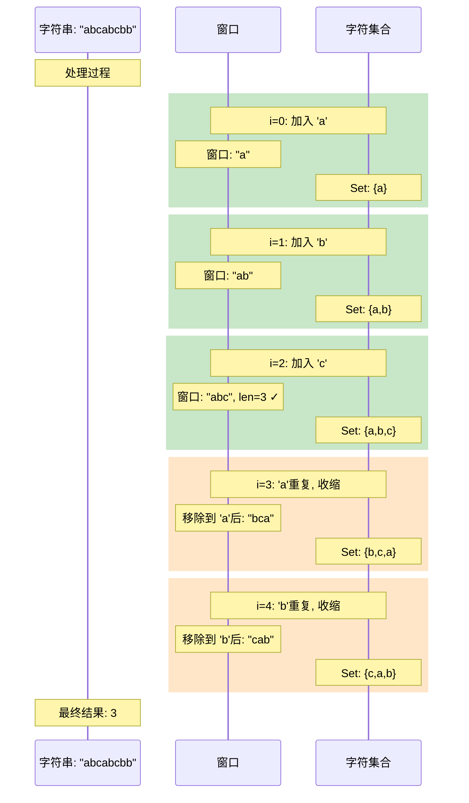

# Day 5: constexpr详解与滑动窗口算法

> **学习定位**：从运行期变量推进到编译期可求值表达式，同时把双指针扩展为维护区间状态的滑动窗口。C++17 的 `if constexpr` 是扩展内容；主线仍是 `constexpr` 基础和窗口不变量。

## 阅读导航

- 常量表达式、`constexpr` 函数与 C++17 `if constexpr` 的标准边界可对照 [cppreference constexpr](https://en.cppreference.com/w/cpp/language/constexpr)；本文重点解释“有资格常量求值”与“此处必须常量求值”的差别。
- 最长无重复子串和最短正数子数组的完整题解分别见 [LeetCode 3](code/leetcode/0003_longest_substring/README.md) 与 [LeetCode 209](code/leetcode/0209_minimum_size_subarray_sum/README.md)。
- 前接 [Day 4 的单调排除](../day_04/README.md)，后接 [Day 6 的二分边界](../day_06/README.md)；两天都要求先写单调性前提。

## 📚 学习目标

1. **深入理解constexpr**：掌握编译期计算的核心技术
2. **区分const与constexpr**：理解两者的本质区别
3. **掌握滑动窗口算法**：学会使用滑动窗口解决子数组/子串问题
4. **LeetCode实战**：209题和3题的滑动窗口解法

---

## 🎯 Part 1: constexpr详解

### 1.1 constexpr概述

`constexpr` 是 C++11 引入的关键字，它的核心不是“强制所有计算都提前做”，而是让一个值或函数**有资格参与常量表达式**。

先分清两种语境：

```cpp
#include "constexpr_math.h"

constexpr int a = day05::square(5);  // 此处必须在编译期求值

int n = 0;
std::cin >> n;
int b = day05::square(n);     // 结果超出 int 时抛出 overflow_error
```

是否必须编译期求值，由使用位置决定。`constexpr` 函数的普通运行期调用也可能被编译器优化，但那是优化决定，不是语言保证。



### 1.2 constexpr变量

```cpp
// constexpr变量必须用常量表达式初始化
constexpr int max_size = 100;           // 编译期常量
constexpr double pi = 3.14159265359;    // 编译期常量
constexpr int arr_size = max_size * 2;  // 编译期计算

// 用作数组大小（必须是编译期常量）
int data[max_size];                     // ✅ 合法
int data2[arr_size];                    // ✅ 合法

// constexpr变量的特点
// 1. 必须立即初始化
// 2. 初始化必须由常量表达式完成
// 3. 一旦初始化就不能修改
// 4. 可以用于需要编译期常量的场景
```

### 1.3 constexpr函数

**constexpr 函数的规则（先看历史边界，再以本课程 C++17 为准）：**



**下面四条是 C++11 的历史限制，不是本课程 C++17 的当前限制：**
- 函数体必须是单一的return语句
- 必须有返回值（不能是void）
- 参数和返回类型必须是字面量类型
- 函数调用前必须已定义

```cpp
// 共享实现先用 int64_t 计算，再检查 int 结果范围。
constexpr int square(int x) {
    return day05::checked_int(static_cast<std::int64_t>(x) * x);
}

constexpr int factorial(int n) {
    return (0 <= n && n <= 12)
        ? (n <= 1 ? 1 : n * factorial(n - 1))
        : throw std::out_of_range("factorial(int) requires 0 <= n <= 12");
}

// C++14 起可以有多条语句；教学实现同样检查边界。
constexpr int sum_to_n(int n) {
    return n >= 0
        ? day05::checked_int((static_cast<std::int64_t>(n) *
                              (n + std::int64_t{1})) / 2)
        : throw std::invalid_argument("sum_to_n requires n >= 0");
}

// 使用示例
constexpr int sq = square(5);          // 编译期计算：25
constexpr int fact = factorial(5);     // 编译期计算：120
constexpr int s = sum_to_n(10);        // C++14：编译期计算：55
int arr[factorial(3)];                 // 编译期计算数组大小：6

// 运行时调用
int n;
std::cin >> n;
// int 的最大安全输入是 12；13! 已超过 INT_MAX，调用前必须验证范围。
int runtime_result = factorial(n);     // 运行时计算
```

`constexpr` 不会自动消除运行时未定义行为：同一函数以运行时参数调用时，仍要遵守结果类型的数值范围。Day 5 把共享实现放在 `code/constexpr_math.h`，并由 `constexpr_math_test.cpp` 同时验证 `12!`、`13` 和负数边界。

### 1.4 constexpr构造函数

`constexpr` 构造函数让对象有机会参与常量求值；一个类是否属于可在常量表达式中使用的字面量类型，还取决于成员、析构等其他语言规则，不能只看构造函数上的一个关键字。

```cpp
class Point {
private:
    int x_, y_;
    
public:
    // constexpr构造函数
    constexpr Point(int x, int y) : x_(x), y_(y) {}
    
    constexpr int x() const { return x_; }
    constexpr int y() const { return y_; }
    
    constexpr int distance_squared() const {
        return x_ * x_ + y_ * y_;
    }
};

// 编译期创建对象
constexpr Point p1(3, 4);
constexpr int dist = p1.distance_squared();  // 编译期计算：25

// 用作模板参数（C++20前需要）
template <int X, int Y>
struct PointTemplate {
    static constexpr Point value{X, Y};
};
```

### 1.5 if constexpr（C++17）

```cpp
// if constexpr：编译期条件判断
template <typename T>
auto get_value(T t) {
    if constexpr (std::is_pointer_v<T>) {
        return *t;  // 解引用
    } else {
        return t;   // 直接返回
    }
}

// 编译期类型判断
template <typename T>
void process(T value) {
    if constexpr (std::is_integral_v<T>) {
        std::cout << "Integer: " << value << "\n";
    } else if constexpr (std::is_floating_point_v<T>) {
        std::cout << "Float: " << value << "\n";
    } else if constexpr (std::is_same_v<T, std::string>) {
        std::cout << "String: " << value << "\n";
    } else {
        std::cout << "Unknown type\n";
    }
}

// 递归展开
template <int N>
constexpr int fibonacci() {
    if constexpr (N <= 1) {
        return N;
    } else {
        return fibonacci<N-1>() + fibonacci<N-2>();
    }
}
```

### 1.6 const vs constexpr

`const` 回答“这个对象通过当前名字不能被修改”；`constexpr` 还要求初始值是常量表达式。但不要把 `const` 等同于“只能运行期”：由常量表达式初始化的整型 `const` 也可以用在数组边界和整型模板实参中。



```cpp
// 对比示例

// ============== const ==============
const int runtime_const = get_runtime_value();  // ✅ 运行时初始化
const int const_arr_size = 100;                  // ✅ 整型常量表达式
const int* ptr1 = &some_var;                     // ✅ 指向const int，指针本身可改
int* const ptr2 = &some_var;                     // ✅ 指针本身不可改

// ============== constexpr ==============
constexpr int compile_const = 100;              // ✅ 编译期常量
// constexpr int runtime_init = get_runtime_value();  // ❌ 编译错误！
constexpr int* compile_ptr = nullptr;           // ✅ 类型是 int* const

// ============== 关键区别 ==============
// 1. 数组大小
int arr1[const_arr_size];     // ✅ 标准C++：初始值是整型常量表达式
int arr2[compile_const];      // ✅ 标准保证

// 2. 模板参数
template <int N>
struct Array {};
Array<const_arr_size> a1;     // ✅
Array<compile_const> a2;      // ✅ 保证成功

// 3. 函数参数
void func(const int n);       // ✅ 运行时参数
// void func2(constexpr int n); // ❌ 不允许！constexpr不能用于参数
```

### 1.7 constexpr函数限制总结

下表是学习用的版本演进摘要，不是完整标准条款。“可以写在 `constexpr` 函数中”也不等于“每次调用都能成为常量表达式”。

| 限制项 | C++11 | C++14 | C++17 | C++20 |
|--------|-------|-------|-------|-------|
| 单一return | ✓ | ✗ | ✗ | ✗ |
| 局部变量 | ✗ | ✓ | ✓ | ✓ |
| 循环语句 | ✗ | ✓ | ✓ | ✓ |
| 条件语句 | ✗ | ✓ | ✓ | ✓ |
| 动态内存 | ✗ | ✗ | ✗ | 有条件允许（常量求值内需释放） |
| 虚函数 | ✗ | ✗ | ✗ | ✓ |
| try-catch | ✗ | ✗ | ✗ | ✓ |

---

## 🔧 Part 2: 滑动窗口算法

### 2.1 算法概述

滑动窗口是一种处理**连续区间问题**的技术。它能在许多具有单调性的问题中把 O(n²) 暴力枚举优化到 O(n)，但不是所有连续区间问题都能直接套窗口。

建议始终把窗口定义成闭区间 `[left, right]`，并在纸上写出当前不变量：

- LeetCode 209：收缩循环结束后，当前窗口和小于 `target`。
- LeetCode 3：每次更新答案时，窗口内没有重复字符。
- O(n) 的根据：`right` 只右移，`left` 也只右移，不回退。



### 2.2 两类可变窗口模板：更新答案的时机不同

“滑动窗口通用模板”不能只背一份。先判断问题属于哪一类：

- **最短满足窗口**：窗口一满足条件就可能是答案，要在收缩前或每次收缩时更新。
- **最长合法窗口**：先把非法窗口收缩到合法，再用当前窗口更新最长值。

两类问题的 `while` 条件和更新位置不同，混用会漏掉答案。

```cpp
#include <algorithm>
#include <cstddef>
#include <limits>
#include <stdexcept>
#include <unordered_map>
#include <vector>

// ========== 最短满足窗口：例如“和至少为 target 的最短子数组” ==========
// 前提：target > 0，nums 中元素为正数，使窗口和具有所需的单调性。
std::size_t minSatisfyingWindow(const std::vector<int>& nums, long long target) {
    if (target <= 0 ||
        std::any_of(nums.begin(), nums.end(), [](int value) { return value <= 0; })) {
        throw std::invalid_argument("target and every element must be positive");
    }
    if (nums.size() > static_cast<std::size_t>(std::numeric_limits<int>::max())) {
        throw std::length_error("input is too large for the declared sum bound");
    }

    std::size_t left = 0;
    std::size_t result = nums.size();
    bool found = false;
    long long current = 0;

    for (std::size_t right = 0; right < nums.size(); ++right) {
        current += nums[right];
        
        while (current >= target) {
            // 当前窗口已经满足条件，必须先记录，再尝试缩短。
            result = std::min(result, right - left + 1);
            found = true;
            current -= nums[left];
            ++left;
        }
    }

    return found ? result : 0;
}

// ========== 最长合法窗口：以“窗口内没有重复”为例 ==========
std::size_t longestValidWindow(const std::vector<int>& nums) {
    std::size_t left = 0;
    std::size_t result = 0;
    std::unordered_map<int, std::size_t> frequency;

    for (std::size_t right = 0; right < nums.size(); ++right) {
        ++frequency[nums[right]];

        while (frequency[nums[right]] > 1) {
            --frequency[nums[left]];
            ++left;
        }

        // while 结束后窗口重新合法，才更新最长值。
        result = std::max(result, right - left + 1);
    }
    
    return result;
}

// ========== 固定窗口大小模板 ==========
long long fixedSizeWindow(const std::vector<int>& nums, int k) {
    if (k <= 0 || static_cast<std::size_t>(k) > nums.size()) {
        throw std::invalid_argument("k must be in [1, nums.size()]");
    }

    const auto window_size = static_cast<std::size_t>(k);
    long long current = 0;
    
    // 初始化窗口
    for (std::size_t i = 0; i < window_size; ++i) {
        current += nums[i];
    }
    
    long long result = current;  // 第一个完整窗口也必须参与答案
    
    // 滑动窗口
    for (std::size_t i = window_size; i < nums.size(); ++i) {
        current += nums[i];
        current -= nums[i - window_size];
        result = std::max(result, current);
    }
    
    return result;
}
```

三种模板的更新时机可以压缩成三句话：

1. 最短满足窗口：**加入右端 → 满足时先记录 → 再移除左端**。
2. 最长合法窗口：**加入右端 → 非法时先收缩 → 恢复合法后记录**。
3. 固定长度窗口：**先记录第一个完整窗口 → 每轮加入一个并移除一个 → 再更新**。

边界也是模板的一部分：空数组的前两个函数返回 0；固定窗口中 `k <= 0` 或 `k > nums.size()` 属于无效调用；而最短和模板若允许负数，就不再具备该移动规则需要的单调性。

### 2.3 滑动窗口动画演示



### 2.4 适用场景判断



**典型适用场景：**
1. ✅ **连续子数组和**：求和满足条件的子数组
2. ✅ **无重复子串**：最长无重复字符子串
3. ✅ **区间覆盖**：最小覆盖子串
4. ✅ **滑动平均/最值**：固定窗口统计

**不适用场景：**
1. ❌ 非连续子序列
2. ❌ 窗口扩展方向不固定
3. ❌ 需要回退的情况

**一个关键反例：**LeetCode 209 明确说数组元素为正数。如果允许负数，加入右边元素后窗口和可能变小，移除左边元素后反而可能变大，原有收缩逻辑就失去正确性。这类问题往往需要前缀和、单调队列等其他方法。

---

## 📝 Part 3: LeetCode实战

### 3.1 LeetCode 209: 长度最小的子数组

**题目描述：**
给定一个含有 n 个正整数的数组和一个正整数 target。找出该数组中满足其和 ≥ target 的长度最小的连续子数组，并返回其长度。

**示例：**
```
输入: target = 7, nums = [2,3,1,2,4,3]
输出: 2
解释: 子数组 [4,3] 是该条件下的长度最小的子数组
```

**解题思路：**



**代码实现：**

以下类片段用于对照窗口更新时机；输入契约由配套实现中的 `validate_input` 完成，完整可编译版本以两个题目的 `solution.cpp` 为准。

```cpp
class Solution {
public:
    int minSubArrayLen(int target, const vector<int>& nums) {
        validate_input(target, nums);
        size_t left = 0;
        int64_t sum = 0;
        size_t min_len = nums.size();
        bool found = false;

        for (size_t right = 0; right < nums.size(); ++right) {
            sum += nums[right];  // 扩展窗口

            while (sum >= static_cast<int64_t>(target)) {  // 收缩条件
                min_len = min(min_len, right - left + 1);
                found = true;
                sum -= nums[left];
                ++left;
            }
        }

        return found ? week01::checked_index(min_len) : 0;
    }
};
```

**复杂度分析：**
- 时间复杂度：O(n)，每个元素最多被访问两次（加入和移除）
- 空间复杂度：O(1)，只使用常数额外空间

### 3.2 LeetCode 3: 无重复字符的最长子串

**题目描述：**
给定一个字符串 s，找出其中不含有重复字符的最长子串的长度。

**示例：**
```
输入: s = "abcabcbb"
输出: 3
解释: 因为无重复字符的最长子串是 "abc"，所以其长度为 3
```

**解题思路：**



**代码实现：**

```cpp
class Solution {
public:
    int lengthOfLongestSubstring(const string& s) {
        unordered_set<char> window;  // 窗口内的字符集合
        size_t left = 0;
        size_t max_len = 0;
        
        for (size_t right = 0; right < s.size(); ++right) {
            // 收缩窗口直到无重复
            while (window.count(s[right])) {
                window.erase(s[left]);
                ++left;
            }
            
            // 扩展窗口
            window.insert(s[right]);
            max_len = max(max_len, right - left + 1);
        }
        
        return week01::checked_index(max_len);
    }
};

// 优化版本：使用数组代替哈希表
class SolutionOptimized {
public:
    int lengthOfLongestSubstring(const string& s) {
        size_t char_index[256]{};  // 按单字节值记录位置+1
        size_t left = 0;
        size_t max_len = 0;
        
        for (size_t right = 0; right < s.size(); ++right) {
            // 如果字符出现过且在窗口内，更新左边界
            const auto ch = static_cast<unsigned char>(s[right]);
            if (char_index[ch] > left) {
                left = char_index[ch];
            }

            char_index[ch] = right + 1;
            max_len = max(max_len, right - left + 1);
        }
        
        return week01::checked_index(max_len);
    }
};
```

**复杂度分析：**
| 方法 | 时间复杂度 | 空间复杂度 |
|------|-----------|-----------|
| 哈希表法 | O(n) | O(min(m,n))，m为字符集大小 |
| 数组法 | O(n) | O(m)，单字节字符集时 m=256 |

> 注意：上面的数组版按“字节”区分字符，适合 ASCII/LeetCode 输入。UTF-8 中一个中文字通常占多个字节，若要按 Unicode 字符统计，需要先正确解码。

---

## 📊 Part 4: 知识总结

### 4.1 constexpr要点总结

| 特性 | 说明 |
|------|------|
| **变量** | 必须编译期可计算，立即初始化 |
| **函数** | 可编译期求值，也可运行时调用 |
| **构造函数** | 让满足其他条件的类对象可以参与常量求值 |
| **if constexpr** | 编译期条件分支（C++17） |

### 4.2 滑动窗口要点总结

| 要点 | 说明 |
|------|------|
| **双指针** | left和right定义窗口边界 |
| **单调性** | right单调递增，left单调不减 |
| **时间复杂度** | O(n)，每个元素最多处理两次 |
| **适用场景** | 连续区间、子数组、子串问题 |

### 4.3 练习建议

1. **constexpr练习**：
   - 实现编译期斐波那契数列
   - 实现编译期字符串哈希
   - 用constexpr实现类型安全的数组

2. **滑动窗口练习**：
   - LeetCode 76: 最小覆盖子串
   - LeetCode 438: 找到字符串中所有字母异位词
   - LeetCode 567: 字符串的排列

练习顺序不建议直接从 76 题开始。先不看答案重写 209 和 3，再做 438/567，最后挑战 76。每道题都要写出“窗口内维护什么状态、何时收缩、何时更新答案”。

## 🧩 今日唯一工程动作

建一张值分类表，从 Day 5 代码中分别填入一个“必须编译期确定的值、运行时确定后只读的值、运行时持续变化的窗口状态”，并为每项写出判定依据。

## 📝 五句复盘

1. `constexpr` 表示对象或调用具备常量求值能力，但仍要检查整数结果范围。
2. 正数数组的滑动窗口依赖和的单调性，非正元素会破坏这一正确性前提。
3. 窗口状态必须说清边界、累计值和更新答案的时机。
4. 长度与容器下标先用 `size_t`表示，返回 `int` 的题目接口再在边界统一检查转换。
5. Day 6 会继续利用单调性，但通过区间不变量每轮排除一半候选。

## ✅ 完成标准与下一日过渡

你应能分辨“可以在编译期求值”和“此处必须在编译期求值”，并能靠窗口不变量而不是背模板写出 209/3。Day 6 将继续训练“单调性 + 边界”，但每轮不再只排除一个元素，而是排除一半搜索空间。

---

## 🚀 运行代码

```bash
# 进入目录
cd week_01/day_05

./build_and_run.sh

# 用固定输入验证显式交互路径，命令不会阻塞
printf '8\n' | ./build/day05_main --interactive
printf '8\n' | ./build/constexpr_func --interactive
```

---

## 📚 扩展阅读

1. [cppreference: constexpr](https://en.cppreference.com/w/cpp/language/constexpr)
2. [C++11 FAQ: constexpr](https://www.stroustrup.com/C++11FAQ.html#constexpr)
3. [滑动窗口算法详解](https://leetcode.cn/problems/minimum-window-substring/solution/hua-dong-chuang-kou-suan-fa-tong-yong-si-xiang-by-/)
