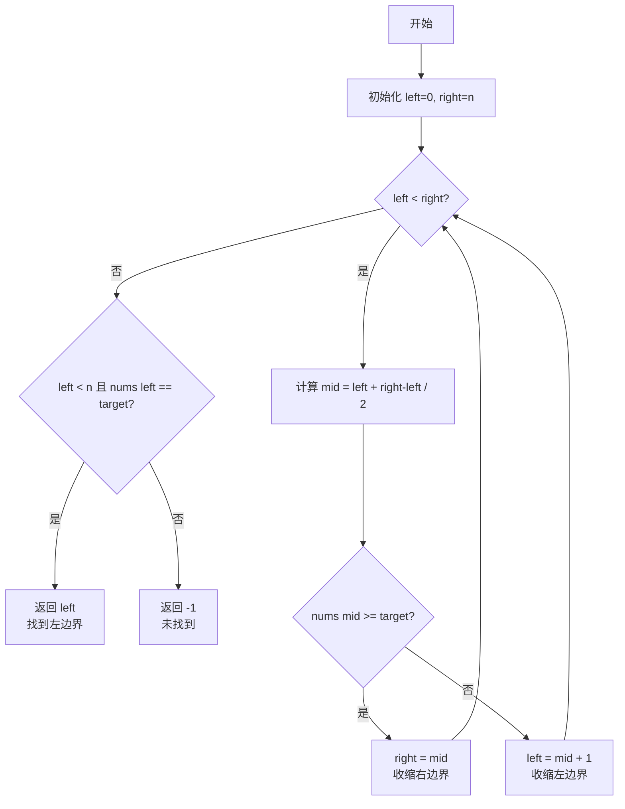

# Day 6: 二分查找详解

## 📚 学习目标

1. **理解二分查找的核心思想**：通过不断缩小搜索范围，将时间复杂度从O(n)降低到O(log n)
2. **掌握三种二分查找模板**：标准查找、左边界查找、右边界查找
3. **避免常见错误**：整数溢出、死循环、边界条件处理
4. **熟练应用**：解决LeetCode经典二分查找问题

---

## 🎯 知识点：二分查找完全指南

### 1. 前提条件

二分查找适用于满足以下条件的场景：

| 条件 | 说明 |
|------|------|
| **有序性** | 数组必须是有序的（升序或降序） |
| **随机访问** | 能够通过下标O(1)时间访问任意元素 |
| **单调性** | 对于任意中间点，能判断目标在左侧还是右侧 |

### 2. 核心思想

```
初始范围: [left, right] 包含所有可能的目标位置
每次迭代:
  1. 计算中间位置 mid
  2. 比较 nums[mid] 与 target
  3. 缩小搜索范围为一半
```

### 3. 时间复杂度分析

| 操作 | 时间复杂度 |
|------|------------|
| 查找单个元素 | O(log n) |
| 查找边界 | O(log n) |
| 空间复杂度 | O(1) |

---

## 📝 三种二分查找模板

### 模板一：标准二分查找

```cpp
int binarySearch(vector<int>& nums, int target) {
    int left = 0, right = nums.size() - 1;  // 闭区间 [left, right]
    
    while (left <= right) {  // 注意：left <= right
        int mid = left + (right - left) / 2;  // 防溢出写法
        
        if (nums[mid] == target) {
            return mid;  // 找到目标
        } else if (nums[mid] < target) {
            left = mid + 1;  // 目标在右半部分
        } else {
            right = mid - 1;  // 目标在左半部分
        }
    }
    
    return -1;  // 未找到
}
```

**适用场景**：查找数组中是否存在某个元素，返回任意一个匹配位置。

### 模板二：查找左边界

```cpp
int binarySearchLeft(vector<int>& nums, int target) {
    int left = 0, right = nums.size();  // 左闭右开 [left, right)
    
    while (left < right) {  // 注意：left < right
        int mid = left + (right - left) / 2;
        
        if (nums[mid] >= target) {
            right = mid;  // 收缩右边界，包含mid
        } else {
            left = mid + 1;  // 收缩左边界，不包含mid
        }
    }
    
    // 检查是否找到
    if (left == nums.size() || nums[left] != target) {
        return -1;
    }
    return left;
}
```

**适用场景**：
- 查找目标值第一次出现的位置
- 查找第一个大于等于目标值的位置

### 模板三：查找右边界

```cpp
int binarySearchRight(vector<int>& nums, int target) {
    int left = 0, right = nums.size();  // 左闭右开 [left, right)
    
    while (left < right) {
        int mid = left + (right - left) / 2;
        
        if (nums[mid] <= target) {
            left = mid + 1;  // 收缩左边界，不包含mid
        } else {
            right = mid;  // 收缩右边界，包含mid
        }
    }
    
    // 检查是否找到
    if (left == 0 || nums[left - 1] != target) {
        return -1;
    }
    return left - 1;
}
```

**适用场景**：
- 查找目标值最后一次出现的位置
- 查找最后一个小于等于目标值的位置

---

## 🔧 模板对比总结

| 特性 | 标准模板 | 左边界模板 | 右边界模板 |
|------|----------|------------|------------|
| 搜索区间 | [left, right] | [left, right) | [left, right) |
| 循环条件 | left <= right | left < right | left < right |
| right初始值 | nums.size()-1 | nums.size() | nums.size() |
| 找到目标时 | 直接返回mid | 继续收缩右边界 | 继续收缩左边界 |
| 返回值 | mid或-1 | left或-1 | left-1或-1 |

---

## ⚠️ 常见错误与陷阱

### 错误1：mid计算溢出

```cpp
// ❌ 错误写法 - 可能溢出
int mid = (left + right) / 2;

// ✅ 正确写法 - 防溢出
int mid = left + (right - left) / 2;
// 或者使用位运算
int mid = left + ((right - left) >> 1);
```

**原因**：当left和right都接近INT_MAX时，left + right会溢出。

### 错误2：死循环

```cpp
// ❌ 错误写法 - 可能死循环
while (left < right) {
    int mid = left + (right - left) / 2;  // 向下取整
    if (nums[mid] >= target) {
        right = mid;  // 如果left = mid，会死循环
    } else {
        left = mid;   // 错误：应该为 mid + 1
    }
}
```

**解决方案**：确保每次迭代搜索范围都在缩小。

### 错误3：边界条件处理

```cpp
// 常见边界情况需要特别处理：
// 1. 空数组
// 2. 目标值小于所有元素
// 3. 目标值大于所有元素
// 4. 目标值恰好等于边界元素
```

---

## 📊 二分查找流程图

```mermaid
flowchart TD
    A[开始] --> B[初始化 left=0, right=n-1]
    B --> C{left <= right?}
    C -->|否| D[返回 -1<br/>未找到]
    C -->|是| E[计算 mid = left + right-left / 2]
    E --> F{nums[mid] == target?}
    F -->|是| G[返回 mid<br/>找到目标]
    F -->|否| H{nums[mid] < target?}
    H -->|是| I[left = mid + 1<br/>搜索右半部分]
    H -->|否| J[right = mid - 1<br/>搜索左半部分]
    I --> C
    J --> C
```

### 左边界查找流程图



---

## 🏋️ 练习题

### LeetCode 704. 二分查找

**题目描述**：给定一个升序排列的整数数组nums和一个目标值target，返回target在数组中的索引，如果不存在则返回-1。

**解题思路**：使用标准二分查找模板

**时间复杂度**：O(log n)  
**空间复杂度**：O(1)

### LeetCode 34. 在排序数组中查找元素的第一个和最后一个位置

**题目描述**：给定一个升序排列的整数数组nums和一个目标值target，返回target在数组中的起始位置和结束位置。如果不存在则返回[-1, -1]。

**解题思路**：
1. 使用左边界模板找到第一个位置
2. 使用右边界模板找到最后一个位置

**时间复杂度**：O(log n)  
**空间复杂度**：O(1)

---

## 📂 代码文件结构

```
code/
├── main.cpp                      # 主程序入口
├── algorithm/                    # 算法模板
│   ├── binary_search_basic.cpp   # 标准二分查找
│   ├── binary_search_left.cpp    # 左边界查找
│   ├── binary_search_right.cpp   # 右边界查找
│   └── binary_search_template.cpp # 通用模板类
└── leetcode/                     # LeetCode题目
    ├── 0704_binary_search/       # 704题实现
    └── 0034_find_first_and_last/ # 34题实现
```

---

## 🔨 编译与运行

```bash
# 进入Day 6目录
cd week_01/day_06

# 赋予执行权限
chmod +x build_and_run.sh

# 编译并运行
./build_and_run.sh
```

---

## 💡 学习建议

1. **理解三种模板的区别**：特别是循环条件和边界更新的逻辑
2. **手动模拟**：用小数组手动跟踪每一步，理解算法过程
3. **画图辅助**：画出搜索区间变化图
4. **多做练习**：二分查找变体很多，需要大量练习

---

## 📚 扩展阅读

- 二分查找查找旋转排序数组（LeetCode 33）
- 搜索插入位置（LeetCode 35）
- x的平方根（LeetCode 69）
- 寻找峰值（LeetCode 162）

---

*Created for 35天C++学习计划 - Day 6*
