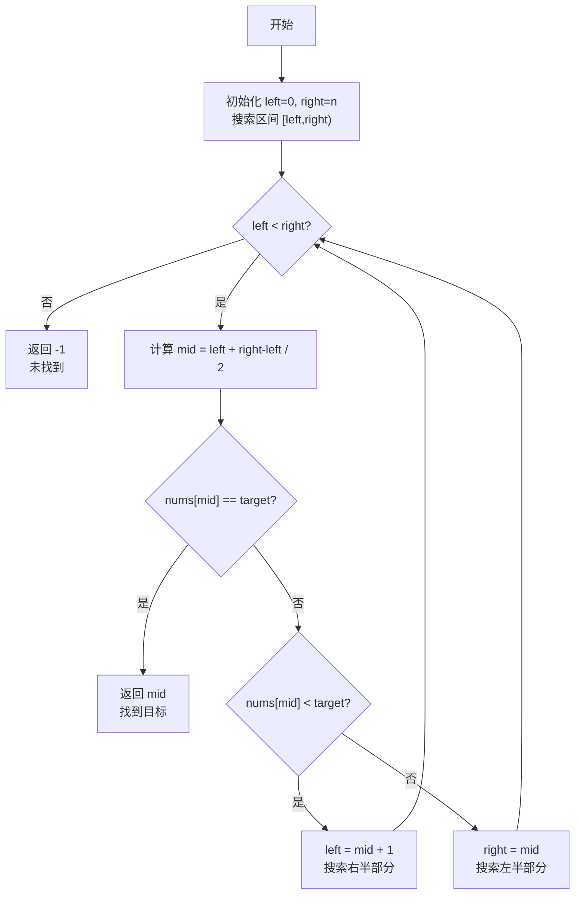
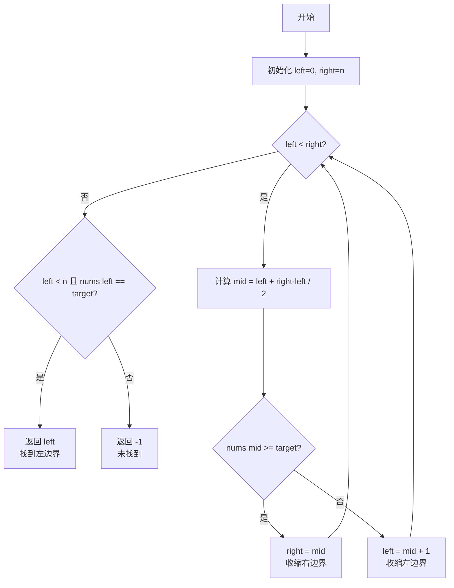

# Day 6: 二分查找详解

> **学习定位**：本日集中训练“有序性 + 区间定义 + 循环不变量”。不要背互相冲突的模板；先固定一种区间写法并证明它不会漏解、越界或死循环。Day 7 会把本周所有边界问题统一复盘。

## 阅读导航

- 本文主讲半开区间与边界模板；标准库对应接口是 [`std::lower_bound`](https://en.cppreference.com/w/cpp/algorithm/lower_bound) 和 [`std::upper_bound`](https://en.cppreference.com/w/cpp/algorithm/upper_bound)。
- 单值查找和左右边界的完整题解分别见 [LeetCode 704](code/leetcode/0704_binary_search/README.md) 与 [LeetCode 34](code/leetcode/0034_find_first_and_last/README.md)。
- 前接 [Day 5 的单调窗口](../day_05/README.md)，后接 [Day 7 的周复盘与 DynamicArray](../day_07/README.md)。

## 📚 学习目标

1. **理解二分查找的核心思想**：通过不断缩小搜索范围，将时间复杂度从O(n)降低到O(log n)
2. **掌握三种二分查找模板**：标准查找、左边界查找、右边界查找
3. **避免常见错误**：整数溢出、死循环、边界条件处理
4. **熟练应用**：解决LeetCode经典二分查找问题

---

## 🎯 知识点：二分查找统一契约指南

### 1. 前提条件

初学时可以先把二分理解成“在有序数组上查找值”，但它更一般的本质是：**在一个具有单调分界的搜索空间中定位边界**。

| 条件 | 说明 |
|------|------|
| **可判定的分界** | 检查中点后，能证明其中一半不可能包含答案 |
| **有序性/单调性** | 升序数组是最典型的情况；“是否满足条件”由 false 单调变为 true 也可以二分 |
| **高效定位中点** | 数组/`vector` 可 O(1) 随机访问，因此整体是 O(log n)；链表即使有序也不会因此获得同样的实际效率 |

Day 6 的数组查找代码统一假设输入是**非递减数组**。如果改成降序，比较和边界更新也要同时反过来，不能只修改注释；答案域模板依赖的则是显式写出的单调谓词。

### 2. 核心思想

```
初始范围: [left, right) 包含所有可能的目标位置，right 本身不是可访问下标
每次迭代:
  1. 计算中间位置 mid
  2. 比较 nums[mid] 与 target
  3. 缩小搜索范围为一半
```

### 3. 时间复杂度分析

| 操作 | 时间复杂度 |
|------|------------|
| 查找单个元素 | O(log n) |
| 查找边界 | O(log n) |
| 空间复杂度 | O(1) |

---

## 📝 三种二分查找模板

### 模板一：标准二分查找

```cpp
int binarySearch(vector<int>& nums, int target) {
    size_t left = 0;
    size_t right = nums.size();  // 左闭右开 [left, right)
    
    while (left < right) {
        const size_t mid = left + (right - left) / 2;
        
        if (nums[mid] == target) {
            return week01::checked_index(mid);  // 题目接口要求 int
        } else if (nums[mid] < target) {
            left = mid + 1;  // 目标在右半部分
        } else {
            right = mid;  // 保留左半区间 [left, mid)
        }
    }
    
    return -1;  // 未找到
}
```

**适用场景**：查找数组中是否存在某个元素，返回任意一个匹配位置。

### 模板二：查找左边界

```cpp
int binarySearchLeft(vector<int>& nums, int target) {
    size_t left = 0, right = nums.size();  // 左闭右开 [left, right)
    
    while (left < right) {  // 注意：left < right
        const size_t mid = left + (right - left) / 2;
        
        if (nums[mid] >= target) {
            right = mid;  // nums[mid] 进入已确认后缀，待判定区间为 [left, mid)
        } else {
            left = mid + 1;  // 排除 [left, mid]
        }
    }
    
    // 检查是否找到
    if (left == nums.size() || nums[left] != target) {
        return -1;
    }
    return week01::checked_index(left);
}
```

**适用场景**：
- 查找目标值第一次出现的位置

`while` 部分实际上先求出“第一个大于等于 `target` 的位置”，最后的相等检查才把它变成“目标第一次出现的位置”。如果真正需要 `lower_bound` 语义，应直接返回 `left`，并允许结果等于 `nums.size()`。

### 模板三：查找右边界

```cpp
int binarySearchRight(vector<int>& nums, int target) {
    size_t left = 0, right = nums.size();  // 左闭右开 [left, right)
    
    while (left < right) {
        const size_t mid = left + (right - left) / 2;
        
        if (nums[mid] <= target) {
            left = mid + 1;  // 排除 [left, mid]
        } else {
            right = mid;  // nums[mid] 进入已确认后缀，待判定区间为 [left, mid)
        }
    }
    
    // 检查是否找到
    if (left == 0 || nums[left - 1] != target) {
        return -1;
    }
    return week01::checked_index(left - 1);
}
```

**适用场景**：
- 查找目标值最后一次出现的位置

`while` 部分先找“第一个严格大于 `target` 的位置”（即 `upper_bound`），再看前一个元素是否等于目标。“最后一个小于等于目标的位置”与“目标的右边界”不是完全相同的接口，目标不存在时尤其要区分。

### 为什么左边界模板正确？

对 `[left, right)` 的左边界查找，每轮循环前保持：

- `[0, left)` 中的元素都小于 `target`，已被排除。
- `[right, n)` 中的元素都大于等于 `target`，是已经确认的后缀。
- `[left, right)` 是仍待判定的元素区间；最终 `left == right` 时，边界位置可以等于 `n`。

当 `nums[mid] >= target` 时，`mid` 仍可能是第一个候选，所以必须保留它：`right = mid`。当 `nums[mid] < target` 时，`mid` 一定不是答案，所以 `left = mid + 1`。最终 `left == right`，未知区间为空，分界点就被确定。

### 答案二分：整数与实数使用同一方向

数组查找的区间是下标半开区间 `[left, right)`；“最小可行答案”模板的输入区间则是答案域的闭区间 `[left, right]`。两者不要混写，但答案模板中的谓词方向统一为：

- `check(x)` 是纯谓词，并随 `x` 呈 `false ... false, true ... true`；
- 若 `check(left)` 已为真，最小可行答案就是 `left`；否则必须有 `check(right) == true`；
- 端点检查后保持“`left` 不可行、`right` 可行”，所以整数模板返回收敛点，实数模板返回可行侧 `right`。

```cpp
// 整数闭区间 [left, right]：返回满足 check 的最小整数。
const int first_feasible = binarySearchTemplate<int>(
    0, 10, [](int value) { return value >= 7; }); // 7

// 实数闭区间 [left, right]：返回可行侧近似值。
const double root_two = binarySearchDouble(
    0.0, 2.0, 1.0e-12,
    [](double value) { return value * value >= 2.0; });
```

实数模板结束时返回 `right`，因为它仍满足谓词；返回 `left` 会破坏契约。例如在 `[0, 1]` 上查找 `x >= 0.75`，令 `eps = 0.5`，第一轮后区间是 `[0.5, 1]`。此时宽度已经达到精度要求，但 `0.5` 明确不可行，只有返回右侧才符合“返回可行近似值”的约定。源码还会拒绝无穷、NaN、非正精度、逆序区间和“不存在可行右端点”的调用；单调性本身是调用者必须提供的前提，通用函数无法只靠有限次采样证明它。

---

## 🔧 模板对比总结

| 特性 | 标准模板 | 左边界模板 | 右边界模板 |
|------|----------|------------|------------|
| 搜索区间 | [left, right) | [left, right) | [left, right) |
| 循环条件 | left < right | left < right | left < right |
| right初始值 | nums.size() | nums.size() | nums.size() |
| 找到目标时 | 直接返回mid | 继续收缩右边界 | 继续收缩左边界 |
| 返回值 | mid或-1 | left或-1 | left-1或-1 |

---

## ⚠️ 常见错误与陷阱

### 错误1：mid计算溢出

```cpp
// ❌ 错误写法 - 可能溢出
size_t mid = (left + right) / 2;

// ✅ 正确写法 - 防溢出
size_t mid = left + (right - left) / 2;
```

**原因**：当 `left` 和 `right` 都接近 `size_t` 上界时，`left + right` 会在无符号类型中回绕并给出错误中点。

位移写法在这个非负区间中也能工作，但对初学者并不比除法更清晰，也不应把它当成性能优化技巧。

### 错误2：死循环

```cpp
// ❌ 错误写法 - 可能死循环
while (left < right) {
    size_t mid = left + (right - left) / 2;  // 向下取整
    if (nums[mid] >= target) {
        right = mid;
    } else {
        left = mid;   // 错误：mid 可能等于 left，区间不会缩小
    }
}
```

**解决方案**：确保每次迭代搜索范围都在缩小。

### 错误3：边界条件处理

```cpp
// 常见边界情况需要特别处理：
// 1. 空数组
// 2. 目标值小于所有元素
// 3. 目标值大于所有元素
// 4. 目标值恰好等于边界元素
```

---

## 📊 二分查找流程图


```mermaid
flowchart TD
    A[开始] --> B["初始化 left=0, right=n<br/>搜索区间 [left,right)"]
    B --> C{left < right?}
    C -->|否| D["返回 -1<br/>未找到"]
    C -->|是| E[计算 mid = left + right-left / 2]
    E --> F{"nums[mid] == target?"}
    F -->|是| G["返回 mid<br/>找到目标"]
    F -->|否| H{"nums[mid] < target?"}
    H -->|是| I["left = mid + 1<br/>搜索右半部分"]
    H -->|否| J["right = mid<br/>搜索左半部分"]
    I --> C
    J --> C
```

### 左边界查找流程图


```mermaid
flowchart TD
    A[开始] --> B[初始化 left=0, right=n]
    B --> C{left < right?}
    C -->|否| D{left < n 且 nums left == target?}
    D -->|是| E["返回 left<br/>找到左边界"]
    D -->|否| F["返回 -1<br/>未找到"]
    C -->|是| G[计算 mid = left + right-left / 2]
    G --> H{nums mid >= target?}
    H -->|是| I["right = mid<br/>收缩右边界"]
    H -->|否| J["left = mid + 1<br/>收缩左边界"]
    I --> C
    J --> C
```

---

## 🏋️ 练习题

### LeetCode 704. 二分查找

**题目描述**：给定一个升序排列的整数数组nums和一个目标值target，返回target在数组中的索引，如果不存在则返回-1。

**解题思路**：使用标准二分查找模板

**时间复杂度**：O(log n)  
**空间复杂度**：O(1)

### LeetCode 34. 在排序数组中查找元素的第一个和最后一个位置

**题目描述**：给定一个升序排列的整数数组nums和一个目标值target，返回target在数组中的起始位置和结束位置。如果不存在则返回[-1, -1]。

**解题思路**：
1. 使用左边界模板找到第一个位置
2. 使用右边界模板找到最后一个位置

**时间复杂度**：O(log n)  
**空间复杂度**：O(1)

---

## 📂 代码文件结构

```
code/
├── main.cpp                      # 主程序入口
├── algorithm/                    # 算法模板
│   ├── binary_search_basic.cpp   # 标准二分查找
│   ├── binary_search_left.cpp    # 左边界查找
│   ├── binary_search_right.cpp   # 右边界查找
│   ├── binary_search.h           # 非模板函数声明
│   └── binary_search_template.h  # 通用模板类（定义需在头文件可见）
└── leetcode/                     # LeetCode题目
    ├── 0704_binary_search/       # 704题实现
    └── 0034_find_first_and_last/ # 34题实现
```

---

## 🔨 编译与运行

```bash
# 进入Day 6目录
cd week_01/day_06

# 编译并运行
./build_and_run.sh
```

---

## 💡 学习建议

1. **理解三种模板的区别**：特别是循环条件和边界更新的逻辑
2. **手动模拟**：用小数组手动跟踪每一步，理解算法过程
3. **画图辅助**：画出搜索区间变化图
4. **多做练习**：二分查找变体很多，需要大量练习

建议用以下四组数据逐行手算：空数组、`[5]`、`[1,2,2,2,3]`、`[1,3,5,7]`。每轮写出 `left/right/mid`、当前区间定义以及被排除的部分。如果只能写出代码而说不出为什么保留/排除 `mid`，说明还在背模板。

## 🧩 今日唯一工程动作

画一张 `binary_search.h`、三个实现 `.cpp`、`main.cpp`、两个测试目标与 CMake target 的依赖图，并在图上标出声明、定义、编译和链接的边界。

## 📝 五句复盘

1. 数组查找统一使用半开下标区间 `[left, right)`，答案域二分则显式使用闭端点并写清可行侧。
2. 中点写成 `left + (right - left) / 2` 是为了避免先计算可能越界的 `left + right`。
3. 每次更新都必须保留可能的答案并严格缩小搜索区间。
4. 答案二分必须写清谓词方向、可行端点和返回侧，实数近似返回仍满足谓词的一侧。
5. Day 7 将把区间不变量与本周的所有权、异常路径和项目测试合并起来。

## ✅ 完成标准与 Day 7 过渡

完成后应能独立写出一种区间风格，并回答三个问题：循环前的搜索区间是什么？为什么这次更新不会丢掉答案？为什么区间一定缩小？Day 7 会将这种“不变量 + 边界”思维与本周的双指针、滑动窗口统一起复盘。

---

## 📚 扩展阅读

- 二分查找查找旋转排序数组（LeetCode 33）
- 搜索插入位置（LeetCode 35）
- x的平方根（LeetCode 69）
- 寻找峰值（LeetCode 162）

---

*Created for 35天C++学习计划 - Day 6*
