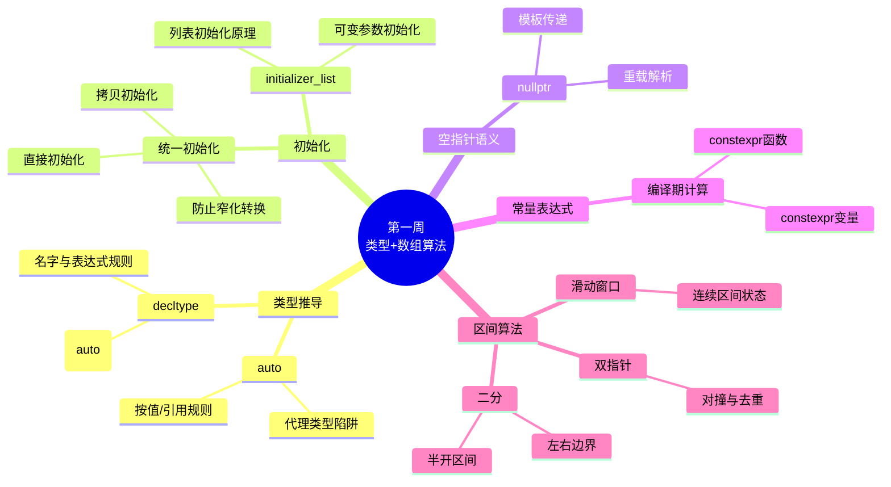

# Day 7: 第一周复习与综合练习

> **学习定位**：本日不是继续堆新概念，而是完成第一次闭环：接回 Day 1 只做索引的转发引用/`decltype(auto)` 内容，横向比较 Item 1-8，并通过动态数组项目连接类、资源和 RAII。下一阶段将正式进入链表和所有权。

> 📅 **学习目标**: 巩固第一周所学知识，完成综合项目，掌握经典LeetCode题目

## 阅读导航

- Item 1-8 的完整专题机制可回查 [Effective Modern C++ 教程](../../tutorials/Effective_Modern_CPP教程.md)；本文只做一周横向归纳并连接真实项目。
- DynamicArray 的主讲位置是本文与 `code/project/`，而算法完整题解分别位于 [LeetCode 42](code/leetcode/0042_trapping_rain_water/README.md) 和 [LeetCode 189](code/leetcode/0189_rotate_array/README.md)。
- 前接 [Day 6 的区间不变量](../day_06/README.md)，完成后进入 [Week 2 所有权路线](../../week_02/README.md)。

---

## 📖 第一周学习目标回顾

恭喜你完成了C++学习计划的第一周！让我们回顾一下本周的学习成果：

### 本周核心内容

| 天数 | 主题 | 核心知识点 |
|------|------|-----------|
| Day 1 | 开发流程、复杂度与 `auto` | 编译/运行、复杂度、EMC++ Item 1-5 初识、两数之和 |
| Day 2 | 数组、`vector` 与 `decltype` | 连续内存、下标边界、代理类型、原地覆盖 |
| Day 3 | 对象初始化 | `{}`、`std::initializer_list`、窄化转换、Item 7 |
| Day 4 | `nullptr` 与对撞指针 | 空指针语义、重载/模板边界、盛水容器、三数之和 |
| Day 5 | `constexpr` 与滑动窗口 | 常量表达式、`if constexpr` 扩展、窗口不变量 |
| Day 6 | 二分查找 | 有序性、半开区间、循环不变量、左/右边界 |

### 能力自检清单

- [ ] 能够正确使用`auto`进行类型推导
- [ ] 理解`auto`与`decltype`的区别
- [ ] 掌握统一初始化语法`{}`的使用
- [ ] 理解`std::initializer_list`的工作原理
- [ ] 能解释 `nullptr` 为什么比 `0`/`NULL` 更能保留空指针语义
- [ ] 能说清 `const` 与 `constexpr` 各自保证什么
- [ ] 能为双指针、滑动窗口和二分写出循环不变量
- [ ] 能为空输入、单元素、重复元素、索引越界和整数溢出补测试

Day 7 的智能指针和 `DynamicArray` 是进入第二周前的**预览/综合挑战**，不要将“看过演示”当成“已掌握所有权、RAII 和移动语义”。这些会在第二周层层展开。

---

## 🧠 知识图谱



---

## 📚 EMC++ 条款 1-8 要点总结

### 条款1: 理解模板类型推导

```cpp
template<typename T>
void f(ParamType param);

f(expr);  // 从expr推导T和ParamType
```

**三种情况：**
1. **ParamType是指针或引用**：忽略expr的引用，模式匹配
2. **ParamType是转发引用**：保留expr的左值/右值性
3. **ParamType既非指针也非引用**：按值传递，忽略const/volatile

### 条款2: 理解auto类型推导

```cpp
auto x = 27;          // int
auto& rx = x;         // int&
auto&& uref = x;      // int& (左值 -> 引用)
auto&& uref2 = 27;    // int&& (右值 -> 右值引用)
```

**花括号特殊规则**：`auto x = {1, 2}` 推导为 `std::initializer_list<int>`；在 C++17 中 `auto x{1}` 推导为 `int`，而 `auto x = {1}` 仍是 `initializer_list<int>`。不要笼统记成“`auto + {}` 总是初始化列表”。

### 条款3: 理解decltype

```cpp
decltype(auto) f() {
    int x = 0;
    return (x);  // 返回int&，悬垂引用警告！
}
```

### 条款4: 学会查看推导类型

- **编译时验证**：`static_assert` 配合 `<type_traits>`
- **IDE提示**：鼠标悬停
- **编译器错误信息**：故意触发错误
- **运行时辅助**：`typeid(...).name()` 的输出由实现决定，且常不能完整展示引用和顶层 `const`，不应单独依赖

### 条款5: 优先使用auto而非显式类型声明

```cpp
// ✅ 推荐
auto iter = m.find(key);

// ❌ 可能的性能问题
std::unordered_map<std::string, int> m;
for (const std::pair<std::string, int>& p : m) {
    // 错误！实际类型是pair<const string, int>
    // 会产生临时对象拷贝
}
```

### 条款6: auto推导异常情况

```cpp
std::vector<bool> v{true, false, true};
auto x = v[0];  // x不是bool，是std::vector<bool>::reference
```

**注意代理类型**：需要显式类型声明或使用`static_cast`

### 条款7: 区分()和{}创建对象

```cpp
int x(0);      // 直接初始化
int y{0};      // 直接列表初始化
int z = 0;     // 拷贝初始化

// {}的优点：防止窄化转换
double d = 3.14;
int i{d};      // 编译错误！窄化转换
int j(d);      // C++ 语言规则允许；本课程的严格告警会把这种窄化当作构建失败
```

### 条款8: 优先使用nullptr而非0或NULL

```cpp
void f(int);
void f(int*);

f(0);       // 调用f(int)
f(NULL);    // 可能有歧义
f(nullptr); // 清晰调用f(int*)
```

---

## 💪 综合练习题

### 选择题

**1. 以下代码中，`x`的类型是什么？**
```cpp
const int& foo();
auto x = foo();
```
- A. `int`
- B. `const int`
- C. `const int&`
- D. `int&`

<details>
<summary>点击查看答案</summary>
答案：A。

解析：`auto x = foo()` 是按值初始化，推导时忽略引用和顶层 `const`，所以 `x` 是一个独立的 `int` 对象。若写 `const auto& x = foo()`，才会保留引用语义。
</details>

**2. 仅按 C++17 语言规则（暂不考虑本课程将警告升级为错误的构建策略），以下哪个初始化会导致编译错误？**
```cpp
double d = 3.14;
int a = d;    // (1)
int b(d);     // (2)
int c{d};     // (3)
```
- A. 只有(1)
- B. 只有(3)
- C. (1)和(3)
- D. 都不会

<details>
<summary>点击查看答案</summary>
答案：B

解析：列表初始化 `{}` 会拒绝窄化转换，`double` 到 `int` 是窄化，因此 (3) 在语言层面就不合法。
(1) 和 (2) 在语言层面允许但会丢失小数部分；编译器可能给出转换警告，而本课程的 `-Wconversion -Werror` 会把相关警告升级为构建失败。
</details>

**3. 关于`decltype(auto)`，以下说法正确的是？**
```cpp
decltype(auto) f() {
    int x = 42;
    return (x);
}
```
- A. 返回类型是`int`
- B. 返回类型是`int&`
- C. 返回类型是`int&&`
- D. 编译错误

<details>
<summary>点击查看答案</summary>
答案：B

解析：`decltype((x))`对于带括号的变量名，结果是引用类型。
因此`decltype(auto)`推导为`int&`，返回的是局部变量的引用，这是悬垂引用！
</details>

**4. 以下代码的输出是什么？**
```cpp
int x = 10;
auto&& r1 = x;
auto&& r2 = 10;
std::cout << std::is_lvalue_reference_v<decltype(r1)>
          << std::is_rvalue_reference_v<decltype(r2)>;
```
- A. `00`
- B. `10`
- C. `01`
- D. `11`

<details>
<summary>点击查看答案</summary>
答案：D

解析：这里的 `auto&&` 按转发引用规则推导（早期资料也常称“通用引用”）。
- `x`是左值，所以`r1`推导为`int&`（左值引用）
- `10`是右值，所以`r2`推导为`int&&`（右值引用）

`is_lvalue_reference_v<decltype(r1)>` = 1
`is_rvalue_reference_v<decltype(r2)>` = 1
因此连续输出 `11`。
</details>

**5. 关于智能指针，以下哪个说法是错误的？**
- A. `unique_ptr`不能拷贝，但可以移动
- B. `shared_ptr`使用引用计数管理生命周期
- C. `weak_ptr`可以延长对象的生命周期
- D. `make_unique`比直接`new`更安全

<details>
<summary>点击查看答案</summary>
答案：C

解析：`weak_ptr` 不增加强引用计数，因此不会延长对象生命周期；它仍会关联控制块，使控制块保留到弱观察者也消失。
它用于观察 `shared_ptr` 管理的对象，避免强拥有边形成循环。
</details>

### 编程题

**编程题1: 用列表初始化阻止语言定义的窄化转换**

实现一个函数`safe_cast<T, U>`，能够在编译时检查窄化转换：

```cpp
template<typename To, typename From>
constexpr To list_checked_cast(From value) {
    return To{value};
}

// 测试用例
static_assert(list_checked_cast<double>(3) == 3.0);  // OK
// auto bad = list_checked_cast<int>(3.0);           // 编译错误：浮点到整型是窄化
```

<details>
<summary>点击查看答案</summary>

```cpp
template<typename To, typename From>
constexpr To list_checked_cast(From value) {
    return To{value};
}
```

注意：C++ 的列表初始化规则把任何浮点到整型都视为窄化，即使 `3.0` 数值上恰好是整数。原练习若声称 `safe_cast<int>(3.0)` 应通过，会与语言的窄化定义矛盾。
</details>

**编程题2: 实现一个移动感知的容器包装器**

实现一个`Container<T>`类模板，支持以下功能：
- 从`std::vector<T>`构造（支持移动语义）
- 提供`begin()`和`end()`迭代器
- 实现`size()`和`empty()`
- 支持范围for循环

```cpp
Container<int> c(std::vector<int>{1, 2, 3});
for (auto& x : c) { /* ... */ }
```

<details>
<summary>点击查看答案</summary>

```cpp
template<typename T>
class Container {
public:
    Container() = default;
    
    // 移动构造
    Container(std::vector<T>&& v) : data_(std::move(v)) {}
    
    // 拷贝构造
    Container(const std::vector<T>& v) : data_(v) {}
    
    // 迭代器
    auto begin() { return data_.begin(); }
    auto end() { return data_.end(); }
    auto begin() const { return data_.begin(); }
    auto end() const { return data_.end(); }
    
    // 容量
    auto size() const { return data_.size(); }
    auto empty() const { return data_.empty(); }
    
private:
    std::vector<T> data_;
};
```
</details>

---

<a id="综合项目dynamicarray类"></a>

## 🚀 综合项目：DynamicArray类

### 设计说明

`DynamicArray`是一个自定义的动态数组类，类似于简化版的`std::vector`。通过实现这个类，我们将复习以下知识点：

- **RAII**: 构造函数获取资源，析构函数释放资源
- **移动语义**: 实现移动构造和移动赋值
- **模板编程**: 类模板的设计
- **异常安全**: 理解“先构造新资源，成功后再替换旧资源”的提交思路
- **现代C++特性**: `auto`、`decltype`、`constexpr`

> **学习边界**：这是一个高于第一周主线的预览项目。先读测试理解接口，再对照实现追踪 `data_/size_/capacity_`。若析构、拷贝/移动、placement new 还很陌生，先达到“能画出资源转移图”即可，第二周再深化。它用于学习资源管理，不是 `std::vector` 的生产级替代品。

建议按明确的两阶段顺序学习，而不是把两份实现混成一份：

1. 先读 [C++ 基础学习教程第 12 章](../../tutorials/CPP基础学习教程.md#12-实战项目动态数组类) 的简化版。它用 `new T[capacity]`，容量内的对象会一次性全部构造，`pop_back/clear` 只缩短逻辑长度。
2. 再回到本日进阶版。它把“原始存储”和“已构造对象”分开，只在 `[0, size_)` 中放置活对象，因此 `pop_back/clear` 会立即调用被移除元素的析构函数。

| 对比点 | 基础教程简化版 | Day 7 进阶版 |
|---|---|---|
| 存储取得 | `new T[capacity]` | `::operator new` 原始存储 |
| 已构造对象范围 | 整个 `[0, capacity_)` | 仅 `[0, size_)` |
| `pop_back/clear` | 只改逻辑长度 | 立即销毁移除的元素 |
| 学习目标 | 先理解所有权、复制、移动和提交式扩容 | 再理解 placement new、精确生命周期和模板实现可见性 |

两版都保留是有意的教学阶梯，不应把进阶版的生命周期断言直接套到简化版。`dynamic_array_test.cpp` 中的 `LifetimeProbe` 是本版“立即析构”语义的可执行证据；到第二周 Day 12 学习 RAII 时应再回访两版，解释为什么生产级容器更接近本版的对象生命周期模型。

### 类设计（与真实头文件同步的接口摘要）

下面的代码块用于阅读接口，不是另一份可独立维护的头文件；可直接包含和实例化的唯一权威版本是 `code/project/dynamic_array.h`。摘要保留真实公开成员、`const` 重载和容量/自引用安全相关接口，避免“README 骨架能调用、实际类却没有”或反过来的漂移。

```cpp
namespace cpp_learning {

template<typename T>
class DynamicArray {
public:
    // 类型别名
    using value_type = T;
    using size_type = std::size_t;
    using difference_type = std::ptrdiff_t;
    using reference = T&;
    using const_reference = const T&;
    using pointer = T*;
    using const_pointer = const T*;
    using iterator = T*;
    using const_iterator = const T*;
    
    // 构造与析构
    DynamicArray() noexcept;
    explicit DynamicArray(size_type count);
    DynamicArray(size_type count, const T& value);
    DynamicArray(std::initializer_list<T> init);
    template<typename InputIt,
             typename = std::enable_if_t<std::is_convertible_v<
                 typename std::iterator_traits<InputIt>::iterator_category,
                 std::forward_iterator_tag>>>
    DynamicArray(InputIt first, InputIt last);
    DynamicArray(const DynamicArray& other);
    DynamicArray(DynamicArray&& other) noexcept;
    ~DynamicArray();
    
    // 赋值操作
    DynamicArray& operator=(const DynamicArray& other);
    DynamicArray& operator=(DynamicArray&& other) noexcept;
    DynamicArray& operator=(std::initializer_list<T> init);
    
    // 元素访问
    reference operator[](size_type pos);
    const_reference operator[](size_type pos) const;
    reference at(size_type pos);  // 带边界检查
    const_reference at(size_type pos) const;
    reference front();
    const_reference front() const;
    reference back();
    const_reference back() const;
    pointer data() noexcept;
    const_pointer data() const noexcept;
    
    // 容量
    [[nodiscard]] bool empty() const noexcept;
    size_type size() const noexcept;
    size_type capacity() const noexcept;
    static constexpr size_type max_size() noexcept;
    void reserve(size_type new_cap);
    void shrink_to_fit();
    
    // 修改操作
    void push_back(const T& value);
    void push_back(T&& value);
    template<typename... Args>
    reference emplace_back(Args&&... args);
    void pop_back();
    void clear() noexcept;
    void resize(size_type count);
    void resize(size_type count, const T& value);
    void swap(DynamicArray& other) noexcept;
    
    // 迭代器
    iterator begin() noexcept;
    iterator end() noexcept;
    const_iterator begin() const noexcept;
    const_iterator end() const noexcept;
    const_iterator cbegin() const noexcept;
    const_iterator cend() const noexcept;
    
private:
    T* data_ = nullptr;
    size_type size_ = 0;
    size_type capacity_ = 0;
    
    void reallocate(size_type new_cap);
    void destroy_elements() noexcept;
    static pointer allocate(size_type count);
    static void deallocate(pointer ptr) noexcept;
    size_type next_capacity() const;
};

template<typename T>
bool operator==(const DynamicArray<T>& lhs, const DynamicArray<T>& rhs);

template<typename T>
bool operator!=(const DynamicArray<T>& lhs, const DynamicArray<T>& rhs);

template<typename T>
void swap(DynamicArray<T>& lhs, DynamicArray<T>& rhs) noexcept;

} // namespace cpp_learning
```

### 核心实现要点

#### 1. RAII 内存管理

```cpp
template<typename T>
DynamicArray<T>::DynamicArray(size_type count) 
    : data_(allocate(count)),
      size_(0),
      capacity_(count) {
    try {
        for (; size_ < count; ++size_) {
            new (data_ + size_) T();  // placement new
        }
    } catch (...) {
        destroy_elements();
        deallocate(data_);
        throw;
    }
}

template<typename T>
DynamicArray<T>::~DynamicArray() {
    destroy_elements();
    deallocate(data_);
}
```

`allocate` 先检查 `count * sizeof(T)` 不会溢出；普通类型使用普通 `operator new`，`alignof(T) > alignof(max_align_t)` 的类型改用匹配的对齐分配。所有释放路径都经过 `deallocate`，保证普通分配与对齐分配不会混用；`dynamic_array_test.cpp` 用 `alignas(64)` 元素验证返回地址满足对齐契约。

#### 2. 移动语义

```cpp
template<typename T>
DynamicArray<T>::DynamicArray(DynamicArray&& other) noexcept
    : data_(std::exchange(other.data_, nullptr)),
      size_(std::exchange(other.size_, 0)),
      capacity_(std::exchange(other.capacity_, 0)) {}

template<typename T>
DynamicArray<T>& DynamicArray<T>::operator=(DynamicArray&& other) noexcept {
    if (this != &other) {
        destroy_elements();
        deallocate(data_);
        data_ = std::exchange(other.data_, nullptr);
        size_ = std::exchange(other.size_, 0);
        capacity_ = std::exchange(other.capacity_, 0);
    }
    return *this;
}
```

#### 3. 扩容策略

```cpp
template<typename T>
void DynamicArray<T>::push_back(const T& value) {
    if (size_ == capacity_) {
        // 先复制，避免 arr.push_back(arr[0]) 扩容后 value 成为失效引用
        T value_copy(value);
        reserve(next_capacity());
        new (data_ + size_) T(std::move_if_noexcept(value_copy));
    } else {
        new (data_ + size_) T(value);
    }
    ++size_;
}
```

上面不只是一个性能细节，而是一条引用有效性规则：**只要扩容可能让参数引用失效，就要在 `reserve/reallocate` 之前保存构造新元素所需的值。**

需要同样处理的还有：

- `arr.push_back(std::move(arr[0]))`：右值引用也可能指向本容器元素。扩容前应先移动构造临时 `T`，再重新分配。原元素被移动后仍有效，但值处于未指定状态。
- `arr.emplace_back(arr[0])`：任意构造参数都可能引用本容器。容量足够时直接在末尾就地构造；需要扩容时，先用参数构造临时 `T`，提交新存储后再移动或拷贝到末尾。
- `arr.resize(new_size, arr[0])`：填充值引用也会因扩容失效。必须先拷贝保存填充值，再 `reserve`。

生产级通用容器还要同时考虑不可移动类型、抛异常构造和分配器传播。本项目用 `move_if_noexcept` 让可拷贝但不可移动的类型仍能扩容，并在容量足够时保留 `emplace_back` 的就地构造语义；需要扩容的不可复制且可能抛出移动类型只能获得基本保证。重点是建立“扩容会使本容器引用失效，并且元素能力决定异常保证”的边界意识。

---

## 🌧️ LeetCode 42: 接雨水

### 问题描述

给定 `n` 个非负整数表示每个宽度为 `1` 的柱子的高度图，计算按此排列的柱子，下雨之后能接多少雨水。

```
输入: height = [0,1,0,2,1,0,1,3,2,1,2,1]
输出: 6
```

```
        ■
    ■   ■ ■   ■
■   ■ ■ ■ ■ ■ ■ ■
0 1 0 2 1 0 1 3 2 1 2 1
```

### 解法一：双指针法（推荐）

以下三种接雨水写法展示核心机制，统一依赖配套实现中的 `validate_heights`、`add_water` 和 `checked_result` 边界检查；它们是核心片段，完整可编译实现位于题目目录的 `solution.cpp`。

```cpp
int trap(vector<int>& height) {
    if (height.empty()) return 0;
    validate_heights(height);
    (void)week01::checked_index(height.size());
    size_t left = 0;
    size_t right = height.size() - 1;
    int left_max = 0, right_max = 0;
    int64_t water = 0;
    
    while (left < right) {
        if (height[left] < height[right]) {
            if (height[left] >= left_max) {
                left_max = height[left];
            } else {
                add_water(water, left_max - height[left]);
            }
            ++left;
        } else {
            if (height[right] >= right_max) {
                right_max = height[right];
            } else {
                add_water(water, right_max - height[right]);
            }
            --right;
        }
    }
    return week01::checked_result(water);
}
```

**时间复杂度**: O(n)  
**空间复杂度**: O(1)

**为什么可以只看较矮一侧？** 若 `height[left] <= height[right]`，左侧位置能存多少水只由 `left_max` 和当前高度决定：右边已经存在一根不低于左边的柱子，因此左侧的右边界足够高。对称地，右边较矮时可确定右侧存水量。

### 解法二：动态规划

```cpp
int trap(vector<int>& height) {
    validate_heights(height);
    const size_t n = height.size();
    if (n == 0) return 0;
    
    vector<int> left_max(n), right_max(n);
    
    left_max[0] = height[0];
    for (size_t i = 1; i < n; ++i) {
        left_max[i] = max(left_max[i - 1], height[i]);
    }
    
    right_max[n - 1] = height[n - 1];
    for (size_t i = n - 1; i > 0; --i) {
        right_max[i - 1] = max(right_max[i], height[i - 1]);
    }
    
    int64_t water = 0;
    for (size_t i = 0; i < n; ++i) {
        add_water(water, min(left_max[i], right_max[i]) - height[i]);
    }
    return week01::checked_result(water);
}
```

**时间复杂度**: O(n)  
**空间复杂度**: O(n)

### 解法三：单调栈（预览）

```cpp
int trap(vector<int>& height) {
    validate_heights(height);
    stack<size_t> st;  // 存储下标
    int64_t water = 0;
    
    for (size_t i = 0; i < height.size(); ++i) {
        while (!st.empty() && height[i] > height[st.top()]) {
            const size_t bottom = st.top();
            st.pop();
            if (st.empty()) break;
            
            const int64_t distance = static_cast<int64_t>(i - st.top() - 1);
            const int bounded_height = min(height[i], height[st.top()]) - height[bottom];
            add_water(water, distance * bounded_height);
        }
        st.push(i);
    }
    return week01::checked_result(water);
}
```

**时间复杂度**: O(n)  
**空间复杂度**: O(n)

### 解法对比

| 解法 | 时间复杂度 | 空间复杂度 | 难度 | 特点 |
|------|-----------|-----------|------|------|
| 双指针 | O(n) | O(1) | ⭐⭐ | 只求水量时常用，状态最少 |
| 动态规划 | O(n) | O(n) | ⭐⭐ | 思路直观，易于理解 |
| 单调栈 | O(n) | O(n) | ⭐⭐⭐ | 按行计算，扩展性好 |

---

## 🔄 LeetCode 189: 轮转数组

### 问题描述

给定一个整数数组 `nums`，将数组中的元素向右轮转 `k` 个位置。

```
输入: nums = [1,2,3,4,5,6,7], k = 3
输出: [5,6,7,1,2,3,4]
```

### 解法一：数组翻转

```cpp
void rotate(vector<int>& nums, int k) {
    if (nums.empty()) return;  // 先防止 k % 0
    const int64_t n = week01::checked_index(nums.size());
    int64_t shift = static_cast<int64_t>(k) % n;
    if (shift < 0) shift += n;  // 负 k 按向左轮转处理
    const auto offset = static_cast<vector<int>::difference_type>(shift);
    
    // 翻转整个数组
    reverse(nums.begin(), nums.end());
    // 翻转前 shift 个
    reverse(nums.begin(), nums.begin() + offset);
    // 翻转剩余部分
    reverse(nums.begin() + offset, nums.end());
}
```

**时间复杂度**: O(n)  
**空间复杂度**: O(1)

### 解法二：额外数组

```cpp
void rotate(vector<int>& nums, int k) {
    if (nums.empty()) return;
    const int64_t n = week01::checked_index(nums.size());
    int64_t raw_shift = static_cast<int64_t>(k) % n;
    if (raw_shift < 0) raw_shift += n;
    const size_t shift = static_cast<size_t>(raw_shift);
    vector<int> temp(nums.size());
    
    for (size_t i = 0; i < nums.size(); ++i) {
        temp[(i + shift) % nums.size()] = nums[i];
    }
    nums = std::move(temp);
}
```

**时间复杂度**: O(n)  
**空间复杂度**: O(n)

---

## 📁 项目结构

```
day_07/
├── README.md                    # 本教程文件
├── CMakeLists.txt              # CMake配置
├── build_and_run.sh            # 编译运行脚本
└── code/
    ├── main.cpp                # 主程序入口
    ├── review/                 # 复习代码
    │   ├── type_deduction_review.cpp
    │   ├── init_review.cpp
    │   └── pointer_review.cpp
    ├── project/                # 综合项目
    │   ├── dynamic_array.h
    │   ├── dynamic_array.cpp
    │   ├── dynamic_array.tpp        # 模板实现，由头文件包含
    │   └── dynamic_array_test.cpp
    └── leetcode/               # LeetCode题目
        ├── 0042_trapping_rain_water/
        │   ├── solution.h
        │   ├── solution.cpp
        │   ├── test.cpp
        │   └── README.md
        └── 0189_rotate_array/
            ├── solution.h
            ├── solution.cpp
            ├── test.cpp
            └── README.md
```

---

## 🔨 编译与运行

```bash
# 进入项目目录
cd week_01/day_07

# 编译并运行
./build_and_run.sh
```

---

## 🧩 今日唯一工程动作

完成一页 DynamicArray 项目卡，在同一份产物中记录项目目标与非目标、三条不变量、文件与 CMake 职责、存储所有者、扩容成败路径、五组核心测试以及模板实现可见性的取舍。

## 📝 五句复盘

1. 本周的语法和算法共同主线是用契约、不变量和边界证明程序为什么正确。
2. DynamicArray 必须明确唯一所有者、已构造元素范围与 `size <= capacity` 不变量。
3. 复制、移动、扩容和异常路径都要保证资源不泄漏且对象仍处于可析构状态。
4. 接雨水和轮转数组说明同一问题可有多种机制，但每种机制都需要边界、复杂度和失败方式。
5. 进入第二周后，这套思考方式将用于链表节点的生命周期和智能指针所有权。

---

## 📚 参考资料

- [Effective Modern C++](https://www.aristeia.com/EMC++.html) - Scott Meyers
- [C++ Core Guidelines](https://isocpp.github.io/CppCoreGuidelines/)
- [LeetCode 42. 接雨水](https://leetcode.cn/problems/trapping-rain-water/)
- [LeetCode 189. 轮转数组](https://leetcode.cn/problems/rotate-array/)

---

## 🎯 下周预告

第二周我们将深入学习：

- **Day 8**: 链表与 `unique_ptr` 独占所有权
- **Day 9**: 链表快慢指针与 `shared_ptr`
- **Day 10**: `weak_ptr`、循环引用与链表环
- **Day 11**: Pimpl 与 K 路合并
- **Day 12**: RAII 和内存管理决策
- **Day 13-14**: 链表综合、Item 17-22 复盘与阶段项目

---

*Happy Coding! 🚀*
