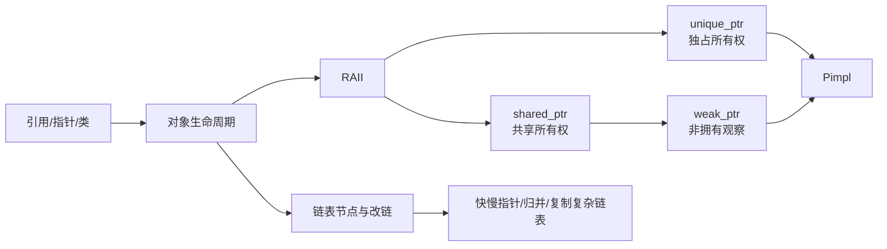
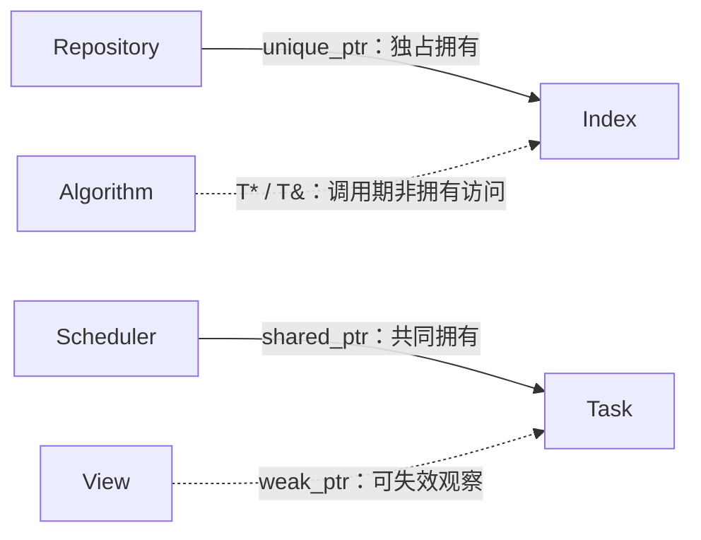
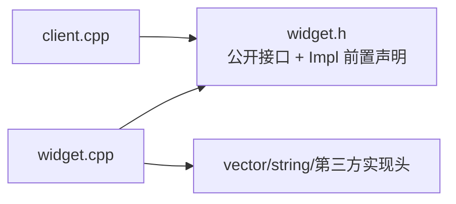

# 第二周：链表、所有权与智能指针（Day 8-14）

本周把第一周和基础教程中的引用、指针和类，推进到 C++ 最重要的工程主题之一：**对象生命周期与资源所有权**。

第一周主要回答“值是什么、边界在哪里、指针当前指向哪里”；第二周要继续追问三个工程问题：**谁拥有对象、谁只是在观察对象、异常或提前返回时由谁收尾**。链表恰好把这三件事放到一张图里：节点地址会变化，所有权不能含糊，改链顺序错误还会直接丢失后续节点。

## 本周文档怎样分工

| 文档 | 主要职责 | 不承担的职责 |
|---|---|---|
| 本周 README | 所有权总图、七天依赖、接口卡与阶段验收 | 不复制每天的 API 清单和题目代码 |
| Day 8-14 README | 当日新增语义、仓库代码导读、工程动作、五句复盘 | 不重复完整单题题解 |
| [链表形象化指南](链表专题形象化题解指南.md) | 指针变化、手算过程、常用图示 | 不作为可复制实现的权威来源 |
| 各题 `code/leetcode/.../README.md` | 输入契约、不变量、正确性、复杂度和边界 | 不重讲通用智能指针教材 |
| `code/` 与测试 | 真实接口、可执行行为和失败路径 | 不替代设计理由与标准语义 |

遇到重复时按“周路线 → 当日差异 → 形象化手算 → 单题完整题解 → 真实代码”前进。智能指针的通用机制以 [Effective Modern C++ 教程](../tutorials/Effective_Modern_CPP教程.md#emcpp-item-17) 为专题入口，每日文档只说明它如何作用于当天的链表或工程问题。

## 先修检查

开始前应能：

- 解释栈上局部对象何时销毁。
- 使用引用参数修改调用者对象，使用 `const T&` 只读访问对象。
- 手写基本的类、构造函数和析构函数。
- 使用 `std::vector`，理解数组连续而链表节点离散。
- 完成第一周的双指针与边界练习。

如果这些概念不稳，先回查 [C++ 基础学习教程](../tutorials/CPP基础学习教程.md) 中的引用、类与内存管理内容，以及 [第一周](../week_01/README.md)。

### 从 Week 1 进入 Week 2：先改变提问方式

| Week 1 的关注点 | Week 2 的推进 | 写代码前要问 |
|---|---|---|
| 指针保存一个地址 | 指针/句柄还表达所有权关系 | 谁负责最终释放？ |
| 函数参数能否修改对象 | 参数是否延长或转移生命周期 | 调用结束后对象还活着吗？ |
| 双指针维护区间边界 | 多个指针维护对象图和链路 | 改链后还能到达剩余节点吗？ |
| 局部变量离开作用域销毁 | RAII 把资源释放绑定到对象析构 | 抛异常时清理路径是否仍成立？ |

不要把“现代 C++”误解成把所有裸指针机械替换成智能指针。智能指针首先表达**拥有关系**；链表算法中的 `Node* current`、函数中的 `T&` 仍可作为非拥有观察者，前提是接口明确它们的有效期。

## 知识依赖图



## 每日安排与过渡

| Day | 主线内容 | EMC++ | 关键产出 | 过渡 |
|---|---|---|---|---|
| [Day 8](day_08/README.md) | 链表、独占所有权 | [Item 17](../tutorials/Effective_Modern_CPP教程.md#emcpp-item-17)、[Item 18](../tutorials/Effective_Modern_CPP教程.md#emcpp-item-18) | 反转链表、`unique_ptr` | 从裸节点进入资源所有者 |
| [Day 9](day_09/README.md) | 快慢指针、共享所有权 | [Item 19](../tutorials/Effective_Modern_CPP教程.md#emcpp-item-19) | 合并链表、环检测 | 理解控制块和真正的共同拥有 |
| [Day 10](day_10/README.md) | 循环引用、观察者与工厂函数 | [Item 20](../tutorials/Effective_Modern_CPP教程.md#emcpp-item-20)、[Item 21](../tutorials/Effective_Modern_CPP教程.md#emcpp-item-21) | 入环点、删除倒数节点、`weak_ptr::lock()` | 由对象图理解循环引用与创建路径 |
| [Day 11](day_11/README.md) | Pimpl、K 路合并 | [Item 22](../tutorials/Effective_Modern_CPP教程.md#emcpp-item-22) | 编译依赖隔离、堆/分治 | 从所有权进入接口与依赖设计 |
| [Day 12](day_12/README.md) | RAII 与内存管理决策 | [Item 17-22 复盘](../tutorials/Effective_Modern_CPP教程.md#emcpp-item-17) | 两两交换、K 组翻转 | 建立资源选择决策树和异常路径表 |
| [Day 13](day_13/README.md) | 链表综合 | 所有权边界实践 | 相交链表、链表归并排序 | 迁移算法模板而非记题 |
| [Day 14](day_14/README.md) | 阶段复盘与项目 | [Item 17-22 二次深化](../tutorials/Effective_Modern_CPP教程.md#emcpp-item-17) | 复制复杂链表、线程安全链表初识 | 为栈队列和并发资源管理铺垫 |

条款编号以原书和 [Effective Modern C++ 教程](../tutorials/Effective_Modern_CPP教程.md) 为准：Item 19 是 `shared_ptr`，Item 20 是 `weak_ptr`，Item 21 是 `make_unique`/`make_shared`，Item 22 是 Pimpl。若某日旧材料的局部标题沿用了不同编号，主题讲解仍可阅读，但复盘和笔记必须按上表归档。

## 三种所有权必须分清

| 意图 | 常见表达 | 说明 |
|---|---|---|
| 独占拥有 | `std::unique_ptr<T>` | 一个所有者，可移动不可复制，默认首选 |
| 共同拥有 | `std::shared_ptr<T>` | 多个所有者共享控制块，有额外成本 |
| 非拥有观察 | `T*`、`T&`、`std::weak_ptr<T>` | 不延长生命周期，使用前必须确认对象仍存在 |

注意：`shared_ptr` 控制块的引用计数操作可安全地发生在不同 `shared_ptr` 对象上，但**同一个 `shared_ptr` 对象**被多个线程同时修改仍需要同步；它也不会自动让所指对象的成员变成线程安全。

### 本周第一张工程图：所有权图

做链表题时画“指针变化图”；做资源设计时再加一层“所有权图”。箭头上必须写明关系，不能只画谁指向谁：



画图时逐条检查：

1. 删除某个拥有者后，目标对象是否应该继续存在？
2. 是否出现一圈 `shared_ptr` 强引用，使强计数永远无法归零？
3. 非拥有指针/引用的有效期由谁保证，哪些操作会让它失效？
4. 所有者是否唯一？若答案是“通常唯一，偶尔共享”，应先重新审视接口，而不是直接使用 `shared_ptr`。

## 链表复杂度的准确表述

“链表插入删除是 O(1)”有前提：已经拿到待操作位置及所需前驱节点。若先按值查找或定位第 k 个节点，定位仍是 O(n)。

链表归并排序也要区分实现：

- 自顶向下递归版：O(n log n) 时间，递归栈通常为 O(log n)。
- 自底向上迭代版：O(n log n) 时间，可做到 O(1) 额外辅助空间。

## 本周工程能力线：从会用指针到能说明接口

每天的代码之外，还要持续维护下面四份小文档。它们不是形式作业，而是把“代码能运行”推进到“设计可以被别人正确使用”。

### 1. 接口卡：一句话说清所有权契约

为一个公开函数填写一张接口卡：

| 字段 | 要回答的问题 | 示例 |
|---|---|---|
| 输入角色 | 参数是所有者、共享者还是观察者？ | `const Node&`：调用期间只读观察 |
| 返回角色 | 返回值是否转移或共享所有权？ | `std::unique_ptr<Node>`：把所有权交给调用者 |
| 可空性 | `nullptr`/空句柄是否合法？ | `Node* find(...)`：找不到返回 `nullptr` |
| 有效期 | 非拥有结果能使用多久？ | 直到链表销毁或结构性修改 |
| 失效条件 | 哪些操作会使地址/迭代器失效？ | 删除对应节点、销毁容器 |
| 异常保证 | 失败后状态是未改变、仍有效，还是未说明？ | `push_front` 分配失败时链表不变 |
| 并发约束 | 可否并发调用，调用者还需什么同步？ | 只有明确写出的操作受锁保护 |

判断接口时不要只看类型名。例如 `void inspect(std::shared_ptr<T>)` 会增加引用计数，暗示函数可能保留共享所有权；如果只在调用期间访问，`const T&` 或 `T*` 往往更准确。

### 2. 异常路径表：验证 RAII 是否真的闭环

对至少一个资源操作写出异常路径：

| 阶段 | 当前已取得的资源 | 可能失败点 | 谁负责清理 | 失败后的对象状态 |
|---|---|---|---|---|
| 创建新节点 | 暂无 | `make_unique<Node>` 分配/构造失败 | 尚未取得资源 | 原链表不变 |
| 准备提交 | `new_node` 独占新节点 | 加锁或后续检查失败 | `unique_ptr`、锁对象析构 | 原链表不变 |
| 提交改链 | 新节点和旧头都由明确对象拥有 | `unique_ptr` 的标准移动操作为 `noexcept`（删除器须满足其要求） | 新链表所有权闭合 | 操作成功 |
| 遍历回调 | 当前节点锁已由 RAII 持有 | 用户回调抛异常 | `unique_lock` 析构解锁 | 结构不应损坏；回调副作用不回滚 |

表格的重点是找到“资源已经取得，但还没有交给 RAII 对象”的空窗。如果存在这样的空窗，就需要调整语句顺序或先把资源放进句柄。

### 3. Pimpl 依赖卡：验证编译防火墙

Pimpl 不是只把成员换成一个指针，而是改变头文件依赖方向：



验收方式：

- 修改 `Impl` 的私有成员，只应要求重新编译实现文件和直接依赖它的目标。
- 修改公开函数签名，客户端仍应重新编译；Pimpl 不是“任何改动都不重编”。
- `unique_ptr<Impl>` 所在类的析构函数及相关特殊成员函数在 `Impl` 完整的 `.cpp` 中定义。
- 记录代价：一次动态分配、一次间接访问、更多样板代码，以及可能受影响的内联优化。

### 4. Day 14 项目卡：线程安全链表初识

[Day 14 项目](day_14/README.md) 的目标是把所有权、RAII 和锁的生命周期放进同一个小项目，不是提前宣称掌握无锁编程。

| 项目项 | 本阶段最低要求 |
|---|---|
| 节点所有权 | 哨兵与节点用单向 `shared_ptr<Node>` 拥有后继；遍历线程在锁交接时复制局部 owner，显式钉住正在访问的节点 |
| 数据所有权 | 节点和值的共享都必须有理由；这里的节点共享只覆盖“结构所有者 + 正在交接的操作”这一真实短暂共同生命周期，单向链不会形成环 |
| 锁契约 | 写清采用整表锁还是逐节点锁，以及固定的加锁/解锁顺序 |
| 回调约束 | 若持锁调用用户回调，说明回调抛异常和重入可能带来的后果 |
| 异常保证 | 插入/更新在可抛工作完成后提交；删除逐节点提交并提供基本保证；不维护会在异常后漂移的独立 `size_` 缓存 |
| 测试 | 空表、单节点、多节点；多线程插入/遍历；析构次数；异常回调后继续使用 |
| 非目标 | 本周不把无锁链表、ABA、内存回收策略当成必做内容 |

项目完成标准不是“跑一次没有崩溃”。至少要能交付一张所有权图、一张接口卡、一张异常路径表，以及说明测试能证明什么、不能证明什么；容器析构前还必须先停止并 `join` 所有访问线程。

## 本阶段常见误区

1. 把裸指针等同于“必须手动 delete”。裸指针也常用于非拥有访问，关键是所有权约定。
2. 为了“安全”到处使用 `shared_ptr`。共享所有权应是设计结论，而不是默认选择。
3. 只看 `use_count()` 判断业务逻辑。引用计数是生命周期机制，不应成为常规控制流。
4. 认为 `std::move` 会执行移动。它只是类型转换，是否移动由后续重载决定。
5. 链表改链时一次修改多个指针，却没有先保存下一节点。
6. 递归算法写成 O(1) 空间，却忽略调用栈。

## 参考语义边界

- 智能指针的标准接口与销毁条件优先查 [cppreference memory library](https://en.cppreference.com/w/cpp/memory.html)。
- 接口所有权表达、RAII 和裸指针角色可对照 [C++ Core Guidelines 的资源管理部分](https://isocpp.github.io/CppCoreGuidelines/CppCoreGuidelines#S-resource)。
- 《C++ Primer》第 12 章适合第一次系统理解动态内存，《Effective Modern C++》Item 17-22 适合分析特殊成员函数、智能指针和 Pimpl 的工程边界。
- 上述指南和教材给出组织与建议；“是否编译、何时销毁、何时产生未定义行为”仍以 C++17 标准语义为准。

## 阶段验收

进入第三周前，应能：

- 画出一个链表算法每一步的指针变化，避免丢失后续节点。
- 解释 Rule of Zero、Three、Five 的适用场景。
- 在 `unique_ptr`、`shared_ptr`、`weak_ptr`、引用和裸指针之间做有理由的选择。
- 解释控制块、循环引用、`weak_ptr::lock()` 和对象生命周期。
- 手写迭代反转链表、快慢指针找中点、合并两个有序链表。
- 说明 Pimpl 为什么减少编译依赖，以及析构函数为什么常放在 `.cpp` 定义。
- 为一个链表或资源类画所有权图，并用接口卡说明拥有、观察、可空性和失效条件。
- 为一次插入或创建操作写异常路径表，说明失败后是否保持原状态。
- 完成 Day 14 项目卡，能区分“引用计数线程安全”“对象线程安全”和“容器接口线程安全”。
- 编译运行 Day 8-14，并能用测试验证空链表、单节点和无交点等边界。

完成后进入 [第三周：栈队列、Lambda 与 BFS](../week_03/README.md)。过渡并不是另起炉灶：链表节点的拥有关系会迁移到栈/队列的内部表示，接口卡会用于分析容器适配器，Day 14 的回调接口会自然引出 Lambda，而“由队列持有待处理工作”的模型正是 BFS 的基础。完整并发设计则留到后续并发阶段系统学习。

## 本周面试高频问题汇总

把本周的智能指针、所有权、资源管理串成问答。

### 智能指针选型与实现

```
Q1: unique_ptr、shared_ptr、weak_ptr 的核心区别？
A: unique_ptr 独占所有权，默认情况下大小等于裸指针、无控制块（但带自定义删除器时，
   若删除器有状态或为函数指针，unique_ptr<T,Deleter> 会变大以存储它）；
   不可拷贝只能移动。
   shared_ptr 共享所有权，靠控制块里的引用计数实现，可拷贝，有原子计数开销。
   weak_ptr 是 shared_ptr 的弱引用，不增加引用计数，用于打破循环引用和观察。
   选型默认 unique_ptr；需要共享才用 shared_ptr；需要观察不持有才用 weak_ptr。

Q2: shared_ptr 的控制块里有什么？
A: 通常有强引用计数、弱引用计数、删除器、分配器。
   控制块是 shared_ptr 和 weak_ptr 共享的一块堆内存，原子地增减计数。
   强计数归零时析构对象；弱计数也归零时才释放控制块本身。

Q3: make_shared 比直接 new + shared_ptr 好在哪？
A: make_shared 把对象和控制块合并成一次堆分配，省一次分配且提高缓存局部性。
   代价：对象内存与控制块同生命周期，weak_ptr 还活着时对象内存不能回收。
   直接 new 是两次分配，但对象析构与控制块释放可分离。
```

### 所有权与生命周期

```
Q4: 什么是循环引用？weak_ptr 怎么解决？
A: 两个对象互相用 shared_ptr 持有对方，引用计数永不归零，导致内存泄漏。
   把其中一条改成 weak_ptr：不增加计数，需要时用 weak_ptr::lock() 提升为
   shared_ptr；若对象已销毁，lock 返回空 shared_ptr，避免悬空访问。

Q5: Rule of Zero / Three / Five 分别适用什么场景？
A: Zero：成员都是 RAII 类型（vector、string、智能指针），让编译器生成默认五件套即可。
   Three：直接管理资源时，写析构、拷贝构造、拷贝赋值三者之一通常就要写齐。
   Five：C++11 起，Three 基础上再加移动构造、移动赋值，兼顾正确与高效。
   优先 Zero，只有裸资源才落到 Five。

Q6: Pimpl 为什么减少编译依赖？
A: 把成员指针化、实现细节放到 .cpp，头文件只留前置声明和指针成员。
   改实现只重编一个 .cpp，不触发包含头文件的所有文件重编。
   析构常放 .cpp 是因为这里需要完整类型（~unique_ptr<Impl> 需要看 Impl 完整定义）。
```

### 线程安全范围

```
Q7: shared_ptr 是线程安全的吗？
A: 控制块的引用计数增减是原子操作，所以多个线程拷贝/析构不同的 shared_ptr
   指向同一对象是安全的（计数正确）。但 shared_ptr 指向的对象本身不因此线程安全，
   对同一 shared_ptr 实例的并发读写也不安全。即"引用计数线程安全"不等于
   "对象线程安全"也不等于"容器接口线程安全"。

Q8: 独占所有权用什么？为什么不能用 shared_ptr 代替？
A: 用 unique_ptr。独占场景用 shared_ptr 会引入不必要的控制块和原子计数开销，
   也模糊了所有权语义（独占变成共享，读者误判谁负责销毁）。
   unique_ptr 还可隐式转换为 shared_ptr（单向），反向不行，选型更灵活。
```

---

