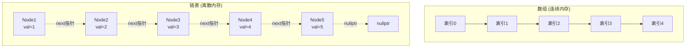
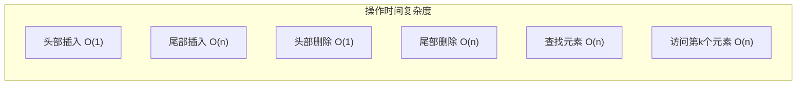
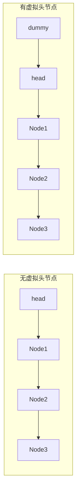
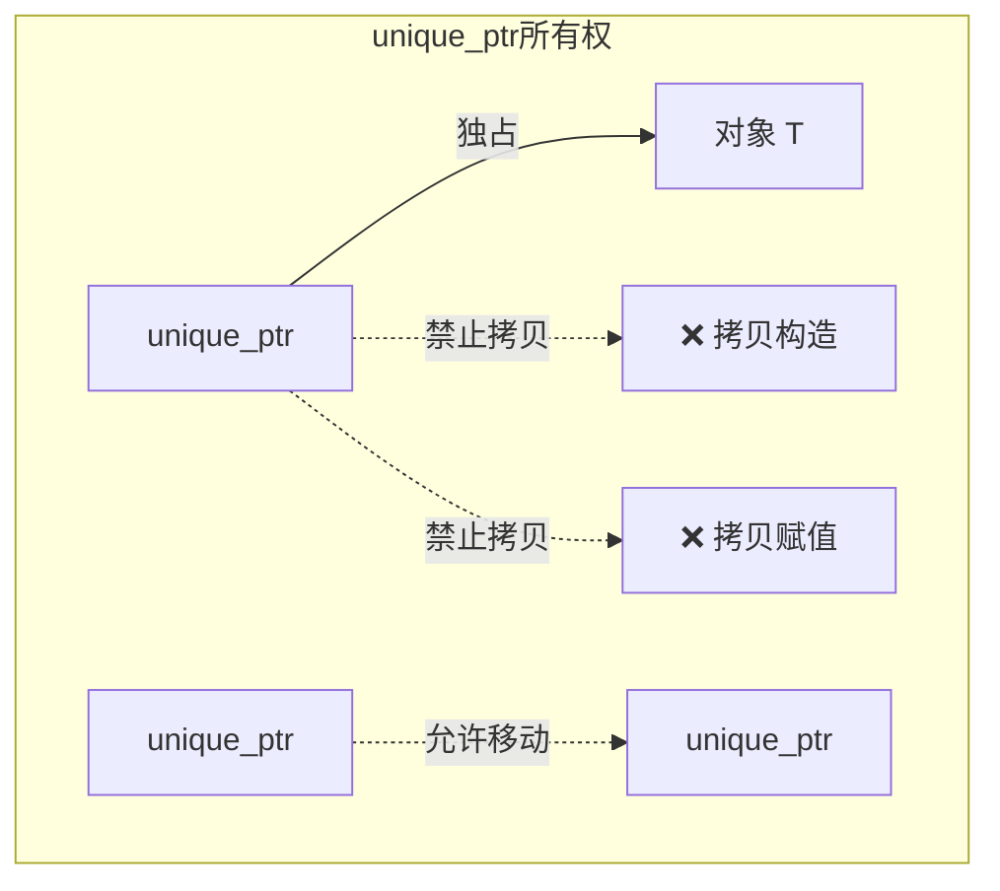
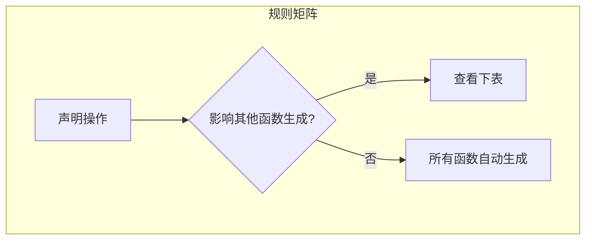
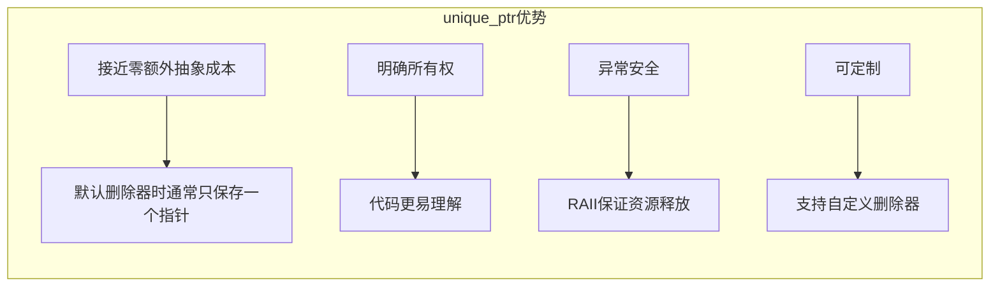
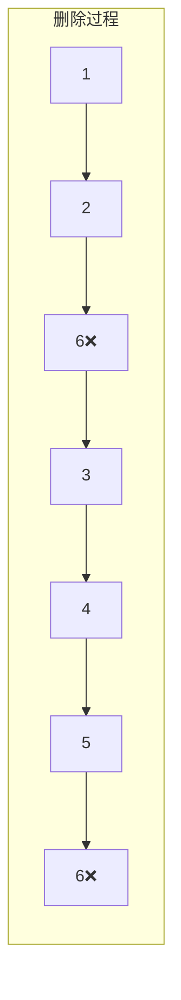
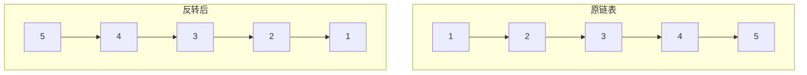
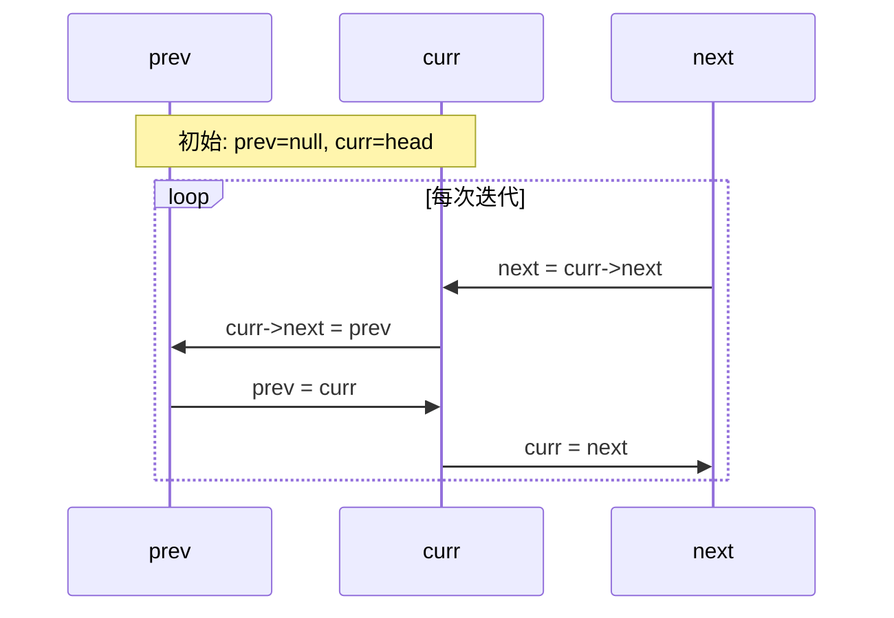

# Day 8: 链表数据结构与unique_ptr智能指针

> **学习定位**：从连续内存切换到离散节点，也从“指针能访问谁”推进到“谁负责释放资源”。主线是链表改链和 `unique_ptr` 独占所有权；二者都依赖清晰的生命周期思维。

## 阅读导航

- 本日主讲节点可达性与独占所有权；`unique_ptr` 标准接口可对照 [cppreference](https://en.cppreference.com/w/cpp/memory/unique_ptr)，设计建议可对照 [Core Guidelines R.20-R.23](https://isocpp.github.io/CppCoreGuidelines/CppCoreGuidelines#Rr-owner)。
- 反转与删除的手算过程集中在 [链表形象化指南](../链表专题形象化题解指南.md) 的 Day 8 部分，真实接口与测试位于 `code/leetcode/0203_remove_elements/` 和 `code/leetcode/0206_reverse_list/`。
- 前接 [Day 7 的 DynamicArray 生命周期预览](../../week_01/day_07/README.md)，后接 [Day 9 的共享所有权与控制块](../day_09/README.md)。

## 📚 今日学习目标

1. **数据结构**：掌握链表的内存布局、节点设计与基本操作
2. **C++11特性**：深入理解`unique_ptr`的独占所有权语义
3. **EMC++条款**：学习特殊成员函数生成规则与资源管理
4. **算法实践**：解决链表经典问题，掌握虚拟头节点技巧

---

## 0️⃣ 先建立统一模型：对象生命周期、指针与所有权

学习链表前要先把三个问题分开。否则看到一个 `T*`，很容易误以为“能访问对象”就等于“负责释放对象”。

1. **对象何时存在？** 对象构造完成后生命期开始；析构完成后生命期结束。生命期结束后，即使原地址还保存在指针中，也不能再解引用。
2. **谁负责结束生命期？** 负责释放资源的一方是所有者（owner）；只临时访问对象的一方是借用者（borrower）。
3. **异常或提前返回时谁清理？** RAII 把资源交给局部对象管理，离开作用域时自动清理，因此正常返回、提前返回和抛异常走同一条释放路径。

```cpp
void inspect(const Widget& widget);                 // borrow：只访问，不接管
void consume(std::unique_ptr<Widget> widget);       // consume：调用后所有权进入函数
std::unique_ptr<Widget> createWidget();             // create：把新对象所有权交给调用者
```

常见错误都可以从所有权不清晰解释：没有所有者会泄漏；对象已经销毁但借用指针仍被使用会悬空；两个彼此不知道的所有者释放同一对象会重复释放。今天学习链表裸指针，是为了看清“节点如何连接”；学习 `unique_ptr`，则是为了用类型明确表达“谁拥有节点或资源”。

---

## 1️⃣ 链表数据结构详解

### 1.1 链表与数组的内存布局对比



### 1.2 特性对比表

| 特性 | 数组 | 链表 |
|------|------|------|
| 内存布局 | 连续 | 离散 |
| 随机访问 | O(1) | O(n) |
| 插入/删除 | O(n) 需移动元素 | 已知目标位置或前驱时 O(1)；先查找位置仍是 O(n) |
| 存储取得 | 连续容器通常一次取得一段空间，扩容可能整体搬移 | 通常按节点取得存储，不要求整表连续 |
| 缓存友好性 | 高 | 低 |
| 空间开销 | 仅数据 | 数据+指针 |

### 1.3 链表节点设计

```cpp
// 单链表节点
struct ListNode {
    int val;           // 数据域
    ListNode* next;    // 指针域
    ListNode(int x) : val(x), next(nullptr) {}
};

// 双链表节点
struct DoublyListNode {
    int val;
    DoublyListNode* prev;  // 前驱指针
    DoublyListNode* next;  // 后继指针
    DoublyListNode(int x) : val(x), prev(nullptr), next(nullptr) {}
};
```

课程仓库里很多题目都会使用 `ListNode`、`Solution` 这样的常见名字；如果把它们都放在全局命名空间，同一 `.cpp` 组合包含两个头就会重定义。Day 8 的通用节点放在 `day08_lists`，两道题分别放在 `leetcode_0203`、`leetcode_0206`；命名空间不改变对象生命周期或算法复杂度，只是在编译期给类型和函数划清模块边界。头文件不导出全局 `using namespace`，使用者应在自己的 `.cpp` 里写限定名或局部 `using`，这样跨日组合包含仍能看出每个类型属于谁。

### 1.4 链表基本操作时间复杂度



### 1.5 虚拟头节点技巧



**优势**：
- 统一头节点和其他节点的操作逻辑
- 避免删除头节点时的特殊情况处理
- 简化代码逻辑

---

## 2️⃣ unique_ptr智能指针详解

### 2.1 独占所有权模型



### 2.2 核心特性

| 特性 | 说明 |
|------|------|
| 独占所有权 | 同一时刻只能有一个unique_ptr指向对象 |
| 低开销 | 默认无状态删除器时通常与原生指针同样大小；有状态删除器可能增大对象 |
| 自动释放 | 离开作用域自动delete |
| 不可拷贝 | 禁用拷贝构造和拷贝赋值 |
| 可移动 | 支持移动语义，转移所有权 |

### 2.3 基本用法

```cpp
// 创建方式
std::unique_ptr<int> p1(new int(42));        // 直接构造
auto p2 = std::make_unique<int>(42);         // 推荐方式 (C++14)

// 访问对象
*p1 = 100;           // 解引用
int* raw = p1.get(); // 获取原生指针

// 释放所有权
int* raw2 = p1.release();  // 释放所有权，返回原生指针
delete raw2;               // 需要手动删除

// 重置
p1.reset(new int(200));    // 删除旧对象，管理新对象
p1.reset();                // 删除对象，变为空
```

这里最容易混淆的是三个接口的所有权含义：

- `get()` 只取得临时借用指针，`unique_ptr` 仍是所有者；不要对返回值 `delete`，也不要让它活得比所有者更久。
- `release()` 放弃所有权且不删除对象，调用者必须立刻把返回值交给另一个所有者或负责释放；随手调用最容易制造泄漏。
- `reset(p)` 先释放当前对象，再接管 `p`；不要把 `get()` 返回的同一指针再传回 `reset()`。

### 2.4 移动语义

```cpp
// 所有权转移
std::unique_ptr<int> p1 = std::make_unique<int>(42);
std::unique_ptr<int> p2 = std::move(p1);  // p1变为nullptr

// 函数返回
std::unique_ptr<int> createInt() {
    return std::make_unique<int>(42);  // 隐式移动
}

// 函数参数
void consume(std::unique_ptr<int> p);  // 移动所有权进入函数
void inspect(const int& value);        // 只借用对象时，直接传对象引用
```

`const std::unique_ptr<T>&` 技术上也能借用，但它让接口依赖“调用者恰好用 unique_ptr 管理对象”。如果函数只需要一个 `T`，优先传 `T&`/`const T&`；只有函数需要观察或操作智能指针本身时，才传智能指针的引用。

### 2.5 自定义删除器

```cpp
// 数组删除器
std::unique_ptr<int[]> arr(new int[10]);

// 文件句柄删除器
auto fileDeleter = [](FILE* f) noexcept {
    if (f) fclose(f);
};
std::unique_ptr<FILE, decltype(fileDeleter)> file(fopen("test.txt", "r"), fileDeleter);

// 函数指针删除器
std::unique_ptr<int, void(*)(int*)> p(new int(42), [](int* p) {
    delete p;
    std::cout << "Custom delete\n";
});
```

删除器是 `unique_ptr` 类型的一部分。无捕获函数对象常可利用空基类优化而不增加大小；函数指针或带状态删除器通常需要额外存储。因此“`unique_ptr` 永远只有一个指针大小”并不成立，正确结论是：它只为你选择的删除策略付费。

---

## 3️⃣ EMC++条款17：特殊成员函数生成规则

### 3.1 特殊成员函数概览

C++中的特殊成员函数包括：
- 默认构造函数
- 析构函数
- 拷贝构造函数
- 拷贝赋值运算符
- 移动构造函数 (C++11)
- 移动赋值运算符 (C++11)

### 3.2 生成规则表



| 声明的操作 | 默认构造 | 析构 | 拷贝构造 | 拷贝赋值 | 移动构造 | 移动赋值 |
|-----------|---------|------|---------|---------|---------|---------|
| 无 | ✅ | ✅ | ✅ | ✅ | ✅ | ✅ |
| 普通构造函数（非拷贝/移动） | ❌ | ✅ | ✅ | ✅ | ✅ | ✅ |
| 析构函数 | ✅ | - | ✅ | ✅ | ❌ | ❌ |
| 拷贝构造 | ❌ | ✅ | - | ✅ | ❌ | ❌ |
| 拷贝赋值 | ✅ | ✅ | ✅ | - | ❌ | ❌ |
| 移动构造 | ❌ | ✅ | ❌ | ❌ | - | ❌ |
| 移动赋值 | ✅ | ✅ | ❌ | ❌ | ❌ | - |

### 3.3 核心规则

1. **移动操作只在类完全无拷贝操作时生成**
   - 如果声明了拷贝构造或拷贝赋值，移动操作不生成
   - 如果声明了移动操作，拷贝操作不生成

2. **析构函数影响移动操作**
   - 声明析构函数后，移动操作不自动生成
   - C++17 中拷贝操作仍可能被隐式声明，但这种配合用户析构的隐式拷贝已属弃用，而且裸资源常会被错误地浅拷贝

3. **Rule of Zero/Three/Five**
   - **Rule of Zero**：尽量不声明任何特殊成员函数
   - **Rule of Three**：如果需要析构、拷贝构造、拷贝赋值中的一个，通常需要全部三个
   - **Rule of Five**：在Three基础上加上移动操作

不要把这张表当作背诵题。编译器的核心判断是：**你是否已经通过某个特殊成员函数表达了资源管理策略**。例如手写析构函数通常意味着类在管理资源，编译器便不再贸然生成移动操作；声明移动操作又意味着“资源可被搬走”，隐式拷贝就会被删除。

```cpp
class Buffer {
public:
    Buffer() = default;
    ~Buffer() = default;  // 仍是“用户声明的析构函数”，会抑制隐式移动生成
};
```

`= default` 不等于“没有声明”。如果确实需要移动，应显式 `= default` 移动构造和移动赋值；更好的起点是 Rule of Zero：把资源放进 `std::vector`、`std::string`、`unique_ptr` 等 RAII 成员，让成员自己决定正确的拷贝/移动/析构行为。还要注意，函数“被生成”不代表一定可用：`unique_ptr` 成员会让默认拷贝被定义为删除，而 `string`/`vector` 值成员通常得到独立值拷贝；若改用 `shared_ptr`，得到的是共享同一对象，不是自动深拷贝。

本日的 `special_member_contract_test` 用类型特征验证三个容易混淆的事实：普通参数构造只抑制默认构造而不抑制移动；即使写成 `= default`，用户声明的析构仍会抑制隐式移动；没有移动构造时，`std::move` 可能调用拷贝构造，所以“表达式能编译”不能反推“发生了移动”。Rule of Zero 也不是“六项操作一定都存在”，而是让成员语义决定外层能力：`unique_ptr` 成员自然形成只移动类型，`string` 值成员则通常同时支持拷贝与移动。

`noexcept` 是调用者可依赖的契约，不是“移动函数应该贴上的标签”。只有成员移动和函数体中的每一步都不会抛出时才能承诺它；尤其不要在 `noexcept` 移动或析构中直接写可能启用异常的流输出，也不要为了标记 moved-from 状态再给 `std::string` 赋文本。替代方案是移除附加日志、在日志边界内部吞掉异常，或用条件异常规格 `noexcept(std::is_nothrow_move_constructible_v<Member>)`；验证时可用类型特征和输出失败注入核对声明与真实路径。

---

## 4️⃣ EMC++条款18：使用unique_ptr管理资源

### 4.1 条款核心思想

> 使用 `std::unique_ptr` 表达独占所有权；默认删除器时它通常只需保存一个指针，但对象大小和成本仍受删除器与实现影响。

### 4.2 unique_ptr的优势



### 4.3 适用场景

1. **工厂函数返回值**
```cpp
std::unique_ptr<Investment> makeInvestment(InvestmentType type) {
    std::unique_ptr<Investment> pInv;
    switch (type) {
        case InvestmentType::Stock:
            pInv = std::make_unique<Stock>();
            break;
        case InvestmentType::Bond:
            pInv = std::make_unique<Bond>();
            break;
    }
    return pInv;  // 编译器优化为RVO或移动
}
```

返回 `unique_ptr<Base>` 的工厂要求 `Base` 具有虚析构函数，否则通过基类指针销毁派生对象会产生未定义行为。工厂返回独占所有权也为未来留下余地：调用者若确实需要共享，可以把 `unique_ptr` 移入 `shared_ptr`；反方向通常做不到。

2. **Pimpl惯用法**
```cpp
// Widget.h
class Widget {
public:
    Widget();
    ~Widget();
private:
    struct Impl;
    std::unique_ptr<Impl> pImpl;
};

// Widget.cpp
struct Widget::Impl {
    // 私有实现细节
};
```

仅把 `Impl` 前置声明还不够。`unique_ptr<Impl>` 的默认删除器在执行析构时需要看到 `Impl` 的完整定义，所以 `Widget` 的析构函数应在头文件中声明、在 `Widget.cpp`（`Impl` 已完整定义处）定义。这个边界正是 EMC++ Item 22 的重点。

3. **管理数组**
```cpp
std::unique_ptr<int[]> arr = std::make_unique<int[]>(10);
arr[0] = 42;  // 支持下标访问
```

### 4.4 与shared_ptr对比

| 特性 | unique_ptr | shared_ptr |
|------|-----------|------------|
| 所有权模型 | 独占 | 共享 |
| 内存开销 | 默认无状态删除器时通常与原生指针同大小；有状态删除器可能更大 | 智能指针对象通常保存对象指针和控制块指针，另有控制块开销 |
| 线程安全 | 不提供特殊保证；并发修改同一个句柄需同步 | 不同副本共享控制块时计数操作安全；并发修改同一个句柄仍需同步 |
| 适用场景 | 明确唯一所有者 | 共享所有权场景 |
| 性能 | 最优 | 略有开销 |

选择标准不是“哪个更方便复制”，而是谁拥有对象：默认从 `unique_ptr` 开始；只有当多个彼此独立的参与者都必须延长同一对象生命期时，才升级为 `shared_ptr`。

两种智能指针都只管理生命周期，不会自动让所指对象 `T` 线程安全。多个线程即使各自持有合法的智能指针副本，只要会同时修改同一个 `T`，仍需由 `T` 的设计或互斥量提供同步。

---

## 5️⃣ LeetCode题目详解

### 5.1 LeetCode 203：移除链表元素

**题目**：删除链表中等于给定值的所有节点

**示例**：
```
输入: head = [1,2,6,3,4,5,6], val = 6
输出: [1,2,3,4,5]
```



**核心思路**：
1. 使用虚拟头节点简化头节点删除
2. 遍历链表，跳过目标值节点
3. 正确释放被删除节点的内存

循环不变量是：`cur` 之前的节点已经检查完，且结果链表中不再含目标值。每次只检查 `cur->next`，这样删除头节点和删除中间节点使用同一套改链逻辑。改链前先保存待删节点，改链后再 `delete`，不要在释放节点后读取它的 `next`。

**时间复杂度**：O(n)  
**空间复杂度**：O(1)

---

### 5.2 LeetCode 206：反转链表

**题目**：反转单链表

**示例**：
```
输入: 1->2->3->4->5->NULL
输出: 5->4->3->2->1->NULL
```



**方法一：迭代法**
```cpp
ListNode* reverseList(ListNode* head) {
    ListNode* prev = nullptr;
    ListNode* curr = head;
    while (curr) {
        ListNode* next = curr->next;
        curr->next = prev;
        prev = curr;
        curr = next;
    }
    return prev;
}
```

每轮循环开始时保持不变量：`prev` 指向已经反转好的前缀，`curr` 指向尚未处理的后缀。必须先保存 `curr->next`，否则执行 `curr->next = prev` 后会丢失后缀入口。

**方法二：递归法**
```cpp
ListNode* reverseList(ListNode* head) {
    if (!head || !head->next) return head;
    ListNode* newHead = reverseList(head->next);
    head->next->next = head;
    head->next = nullptr;
    return newHead;
}
```

**迭代法执行过程**：



**时间复杂度**：O(n)  
**空间复杂度**：迭代O(1)，递归O(n)栈空间

---

## 6️⃣ 今日实践要点

### 代码结构

```
day_08/
├── README.md                    # 本文档
├── CMakeLists.txt               # 构建配置
├── build_and_run.sh             # 构建脚本
└── code/
    ├── main.cpp                 # 主程序入口
    ├── data_structure/          # 链表数据结构
    │   ├── list_node.h          # 节点定义
    │   ├── list_operations.cpp  # 基本操作
    │   └── list_demo.cpp        # 演示代码
    ├── cpp11_features/          # unique_ptr演示
    │   ├── unique_ptr_demo.cpp
    │   ├── unique_ptr_advanced.cpp
    │   └── make_unique.cpp
    ├── emcpp/                   # EMC++条款
    │   ├── item17_special_members.cpp
    │   └── item18_unique_ptr.cpp
    └── leetcode/                # LeetCode题目
        ├── 0203_remove_elements/
        └── 0206_reverse_list/
```

### 编译运行

```bash
cd week_02/day_08
./build_and_run.sh
```

脚本会配置、编译并运行 CTest。

### 今日工程动作：标注链表接口的所有权

给今天出现的函数逐个标注 `borrow / consume / create`，再检查借用指针的生命期是否短于所有者。重点不是多写一套代码，而是让函数签名和调用方式能够回答“谁负责释放”。

### 五句复盘

1. **核心问题**：如何在链表改链时保持节点可达，并用 `unique_ptr` 明确表达独占所有权？
2. **旧误解**：指针能访问对象不代表它拥有对象，链表插入删除也不是无条件 O(1)。
3. **规则前提**：只有已知操作位置或前驱时改链才是 O(1)，借用指针必须比所有者活得短。
4. **测试/反例证据**：203、206 的空链表和头节点用例验证边界；`release()` 后无人接管则直接展示所有权丢失风险。
5. **与前后课连接**：本日从 Day 7 的基础指针推进到独占所有权，Day 9 将在此基础上学习快慢指针与共享所有权。

---

## 7️⃣ 扩展阅读

1. **链表高级变种**
   - 跳表 (Skip List)：O(log n)查找
   - 环形链表：检测环的Floyd算法
   - 双向链表：STL的`std::list`

2. **智能指针最佳实践**
   - 优先使用`make_unique`/`make_shared`
   - 避免从原生指针创建多个智能指针
   - 使用`unique_ptr`作为工厂函数返回类型

3. **EMC++相关条款**
   - 条款21：优先使用`std::make_unique`和`std::make_shared`
   - 条款22：使用Pimpl惯用法时，在实现文件中定义特殊成员函数

---

## 📝 今日总结

| 主题 | 核心要点 |
|------|---------|
| 链表 | 离散内存；已知位置时 O(1) 改链；虚拟头节点统一边界 |
| unique_ptr | 独占所有权、低开销、支持移动语义、自定义删除器 |
| 条款17 | 特殊成员函数生成规则、Rule of Zero/Three/Five |
| 条款18 | 用unique_ptr管理独占资源、工厂函数、Pimpl惯用法 |
| LeetCode 203 | 虚拟头节点简化删除逻辑 |
| LeetCode 206 | 迭代/递归两种反转方法 |

---

**下一步**：Day 9 将学习快慢指针与 `shared_ptr` 共享所有权！
