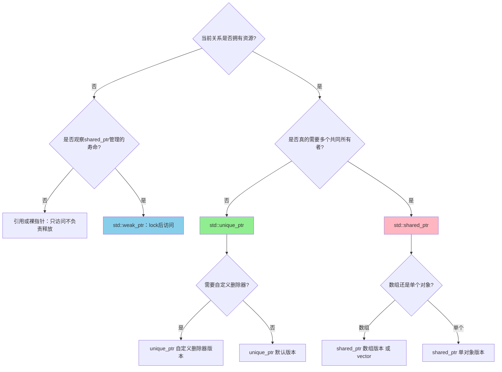

# Day 12: 智能指针总结与选择指南 & 底层内存管理

> **学习定位**：本日把 `unique_ptr`、`shared_ptr`、`weak_ptr`、引用和裸指针放进同一张所有权决策图，并用 RAII 解释资源为何能自动释放。重点是做选择和说明理由，而不是背 API 表。

## 阅读导航

- RAII、资源句柄和所有权选择是本日主讲；设计建议可对照 [Core Guidelines 资源管理部分](https://isocpp.github.io/CppCoreGuidelines/CppCoreGuidelines#S-resource)。
- 两两交换的完整题解见 [LeetCode 24](code/leetcode/0024_swap_pairs/README.md)，K 组翻转的真实实现位于 `code/leetcode/0025_reverse_k/`。
- 前接 [Day 11 的 Pimpl 资源边界](../day_11/README.md)，后接 [Day 13 的链表模板迁移](../day_13/README.md)。

## 📚 今日概览

今天是C++内存管理的集大成篇，我们将：
1. **总结三种智能指针**：对比分析、选择策略
2. **深入底层原理**：堆内存管理、RAII原则
3. **LeetCode链表实战**：24题、25题

---

## 一、三种智能指针全面对比

### 1.1 对比表格

| 特性 | `std::unique_ptr` | `std::shared_ptr` | `std::weak_ptr` |
|------|-------------------|-------------------|-----------------|
| **所有权** | 独占所有权 | 共享所有权 | 无所有权（观察者） |
| **拷贝** | ❌ 禁止 | ✅ 允许（引用计数+1） | ✅ 允许 |
| **移动** | ✅ 允许 | ✅ 允许 | ✅ 允许 |
| **控制块计数** | 无 | 增加强引用计数 | 不增加强引用计数，但连接控制块并维护弱引用状态 |
| **对象大小** | 默认无状态删除器时通常与裸指针同样紧凑；有状态删除器可能增大 | 句柄通常含两个指针，另有控制块 | 句柄通常也要连接对象/控制块，不能简单视为“一个裸指针” |
| **主要成本** | 独占转移，通常很低 | 控制块分配与引用计数更新 | `lock()` 检查并尝试增加强引用 |
| **典型用途** | 资源独占、工厂模式 | 共享资源、缓存 | 打破循环引用、观察者 |
| **线程安全边界** | 同一对象的并发修改仍需同步 | 不同句柄副本可并发更新控制块；所指对象并不自动安全 | 不同句柄副本可观察控制块；所指对象仍需同步 |

### 1.2 智能指针选择决策树



这棵树先问“是否拥有”，因为裸指针和引用并不等于危险：只要它们明确表示**借用**，并且被借用对象活得足够久，就是合适的非拥有接口。`weak_ptr` 也不是 `shared_ptr` 的廉价替代品，它只用于观察由共享控制块管理的生命周期。

### 1.3 选择指南

```cpp
// 场景1: 独占资源 - unique_ptr
std::unique_ptr<File> file = std::make_unique<File>("data.txt");

// 场景2: 共享资源 - shared_ptr
auto texture = std::make_shared<Texture>("sprite.png");
auto sprite1 = texture;  // 共享
auto sprite2 = texture;  // 引用计数 = 3

// 场景3: 打破循环引用 - weak_ptr
class Node {
    std::shared_ptr<Node> next;
    std::weak_ptr<Node> prev;  // 防止循环引用
};

// 场景4: 自定义删除器 - unique_ptr<T, Deleter>
auto fileDeleter = [](FILE* f) noexcept { if (f) fclose(f); };
std::unique_ptr<FILE, decltype(fileDeleter)> file(fopen("test.txt", "r"), fileDeleter);
```

---

## 二、RAII原则详解

### 2.1 RAII核心思想

**RAII (Resource Acquisition Is Initialization)**：资源获取即初始化

核心原则：
1. **资源获取**：在对象构造时完成
2. **资源释放**：在对象析构时自动完成
3. **异常安全**：栈展开保证析构函数被调用

### 2.2 RAII 的四大支柱

```cpp
// 1. 构造时获取资源
class Resource {
    Resource() { /* 获取资源 */ }
    
    // 2. 析构时释放资源
    ~Resource() { /* 释放资源 */ }
    
    // 3. 拷贝策略取决于资源语义：禁止、深拷贝或显式共享
    Resource(const Resource&) = delete;
    Resource& operator=(const Resource&) = delete;
    
    // 4. 资源允许转移时才支持移动；并非所有RAII类都必须可移动
    Resource(Resource&&) noexcept;
    Resource& operator=(Resource&&) noexcept;
};
```

### 2.3 RAII 实现示例

```cpp
// 简单的文件句柄 RAII 封装
class FileHandle {
    FILE* file_;
public:
    explicit FileHandle(const char* filename, const char* mode)
        : file_(fopen(filename, mode)) {
        if (!file_) throw std::runtime_error("Failed to open file");
    }
    
    ~FileHandle() {
        if (file_) fclose(file_);
    }
    
    // 禁止拷贝
    FileHandle(const FileHandle&) = delete;
    FileHandle& operator=(const FileHandle&) = delete;
    
    // 支持移动
    FileHandle(FileHandle&& other) noexcept : file_(other.file_) {
        other.file_ = nullptr;
    }
    
    FILE* get() const { return file_; }
};
```

`noexcept` 必须由真实操作推出：上面的文件句柄移动只交换裸句柄并清空源指针，所以不会分配；但泛型 `ScopeGuard<F>` 不能无条件写 `noexcept`，因为 `F` 的移动本身可能抛。本日实现用条件异常规格描述移动能力，并要求清理回调满足 `is_nothrow_invocable`；若清理工作可能失败，应在回调内部捕获并记录，而不能让异常穿过析构函数。析构日志也属于可能失败的附加工作，资源应先释放，日志异常在边界内处理；验证 `noexcept` 时既要看类型特征，也要打开流异常或注入失败路径，而不是只观察正常运行。

### 2.4 拥有型资源必须显式决定特殊成员函数

`heap_memory.cpp` 的简单 `MemoryPool` 直接拥有一块 `new[]` 缓冲区，池内分配结果都依赖这块存储的唯一地址。若只写析构函数而不声明复制操作，C++17 仍可能生成浅拷贝，使两个池在析构时释放同一地址；这里选择删除复制，并实现清空源对象的 `noexcept` 移动，因为“复制一份对象字节”也不能正确复制池内已构造对象的生命周期。`--resource-contracts` 会在编译期检查不可复制/可移动特征，并在运行期覆盖零容量、移动构造、移动赋值、自移动、容量边界和池内对象构造抛异常的路径；这个入门池是单调分配器，构造失败后已切出的原始存储仍记为已使用，池析构再统一释放底层缓冲区，ASan 负责确认这些路径没有重复释放或泄漏。

---

## 三、堆内存管理

### 3.1 new/delete vs malloc/free

| 方面 | new/delete | malloc/free |
|------|------------|-------------|
| **来源** | C++运算符 | C标准库函数 |
| **类型与对象** | `new T` 返回 `T*` 并开始 `T` 的生命期 | 返回 `void*` 原始存储；C++ 中需显式转换，且尚未构造 `T` |
| **构造/析构** | 自动调用构造/析构函数 | 仅分配内存 |
| **错误处理** | 普通 `new` 失败抛 `std::bad_alloc`；`new (std::nothrow)` 才返回空 | 失败返回 `nullptr` |
| **内存大小** | 自动计算 | 需手动计算 |
| **重载** | 可在类/全局重载 | 不可重载 |
| **底层** | 实现可调用分配器，具体策略由实现决定 | C运行库分配器，也不等同于每次直接系统调用 |

`malloc` 成功只得到一块原始存储，`DemoClass` 对象的生命周期还没有开始；在 placement new 构造之前调用成员函数，即使“只是打印未初始化值”，也是未定义行为。

### 3.2 内存分配流程

```
new 表达式:
┌─────────────────────────────────────────┐
│ 1. operator new 分配原始内存            │
│ 2. 构造函数在内存上构造对象              │
│ 3. 返回类型化指针                        │
└─────────────────────────────────────────┘

delete 表达式:
┌─────────────────────────────────────────┐
│ 1. 调用析构函数清理资源                  │
│ 2. operator delete 释放内存              │
└─────────────────────────────────────────┘
```

### 3.3 内存泄漏检测方法

```cpp
// 方法1: 普通追踪分配函数（教学中不要随意替换全局operator new）
void* tracked_allocate(size_t size) {
    void* p = malloc(size);
    if (!p) throw std::bad_alloc{};
    std::cout << "Allocated " << size << " bytes at " << p << "\n";
    return p;
}

// 方法2: 使用 RAII 确保释放
void process() {
    auto data = std::make_unique<Data>();  // 自动释放
    // 即使抛出异常也能正确释放
}

// 方法3: 使用工具检测
// - Valgrind (Linux)
// - AddressSanitizer (编译器)
// - Visual Studio 内存检测器
```

---

## 四、LeetCode 链表专题

### 4.1 24题 - 两两交换链表中的节点

**题目**：给定链表，两两交换相邻节点，返回交换后的链表。

**示例**：
```
输入: 1->2->3->4
输出: 2->1->4->3
```

**解题思路**：

1. **递归法**：
   - 交换前两个节点
   - 递归处理后续链表
   - 时间: O(n), 空间: O(n) 递归栈

2. **迭代法**：
   - 使用虚拟头节点
   - 成对交换节点
   - 时间: O(n), 空间: O(1)

无论递归还是迭代，交换的是节点连接而不是节点值。改链前先保存尚未处理的后继；循环过程中，“哨兵之后的已处理前缀已经正确，未处理后缀仍然可达”应始终成立。奇数个节点时，最后一个节点保持原位。

### 4.2 25题 - K个一组翻转链表

**题目**：每k个节点一组进行翻转，返回修改后的链表。

**示例**：
```
输入: 1->2->3->4->5, k = 2
输出: 2->1->4->3->5
```

**解题思路**：

1. **分组翻转**：
   - 先统计链表长度
   - 每k个节点进行翻转
   - 不足k个保持原序

2. **关键操作**：
   - 找到待翻转的k个节点
   - 翻转该组节点
   - 连接前后链表

分组翻转的核心不变量是：改链前保存下一组起点；已处理前缀已经按组翻转并正确连接；未处理后缀仍可达；剩余节点不足 `k` 个时保持原序。只会写 `reverse()` 不够，还要证明组头、组尾和下一组之间没有断链。

---

## 五、代码结构

```
day_12/
├── README.md                    # 本文件
├── CMakeLists.txt              # 构建配置
├── build_and_run.sh            # 编译运行脚本
└── code/
    ├── main.cpp                # 主入口
    ├── cpp11_features/
    │   ├── smart_ptr_guide.cpp # 智能指针选择指南
    │   ├── raw_vs_smart.cpp    # 裸指针vs智能指针对比
    │   └── custom_deleter.cpp  # 自定义删除器汇总
    ├── low_level/
    │   ├── heap_memory.cpp     # 堆内存管理详解
    │   ├── raii_demo.cpp       # RAII原则演示
    │   └── memory_leak.cpp     # 内存泄漏检测
    └── leetcode/
        ├── 0024_swap_pairs/    # LeetCode 24题
        └── 0025_reverse_k/       # LeetCode 25题
```

---

## 六、编译运行

```bash
# 进入目录
cd week_02/day_12

# 一键编译运行
./build_and_run.sh all

# 只运行CTest；第二个参数打开 AddressSanitizer 和 UndefinedBehaviorSanitizer
./build_and_run.sh test
./build_and_run.sh test --asan

# 或手动配置；重复执行会安全地重用构建目录
cmake -S . -B build-manual -DCMAKE_BUILD_TYPE=Debug
cmake --build build-manual -j4
ctest --test-dir build-manual --output-on-failure
./build-manual/day_12 --all
./build-manual/day_12 --resource-contracts
```

---

## 七、学习检查清单

- [ ] 理解三种智能指针的区别和适用场景
- [ ] 掌握智能指针选择决策树
- [ ] 理解 RAII 原则的核心思想
- [ ] 了解 new/delete 与 malloc/free 的区别
- [ ] 掌握链表的两两交换操作
- [ ] 掌握 K 个一组翻转链表的方法
- [ ] 理解递归和迭代两种解题思路

### 今日工程动作：用 Sanitizer 检查生命周期、未定义行为和泄漏

运行 `./build_and_run.sh test --asan`，脚本会同时启用 AddressSanitizer 与 UndefinedBehaviorSanitizer，再运行 `./build/day_12 --resource-contracts` 观察资源契约路径。随后只在学习笔记中写出“`malloc` 后、placement new 前调用成员”的反例并预测结果，不修改仓库源码来制造负例。结论应是：工具能帮助发现问题，但“对象生命周期尚未开始，不能访问成员”首先是一条语言规则，而且 Sanitizer 不保证发现每一种生命周期违例。

### 五句复盘

1. 普通引用或裸指针适合生命期严格由外部保证的借用，`weak_ptr` 适合观察共享控制块管理且可能过期的对象。
2. `shared_ptr` 只同步控制块计数，所指对象的并发读写仍要由对象自身的锁或其他协议保护。
3. `malloc` 只取得原始存储，类对象必须等构造完成、生命期开始后才能访问成员。
4. 两两交换和 K 组翻转都必须在断链前保存后继，并持续保证已处理前缀正确且未处理后缀可达。
5. RAII 类是否复制、共享或转移资源取决于资源语义，不能把禁止拷贝或支持移动当成统一模板。

---

## 八、扩展阅读

1. **智能指针最佳实践**
   - [C++ Core Guidelines - Smart Pointers](https://isocpp.github.io/CppCoreGuidelines/)
   - Scott Meyers - "Effective Modern C++" 第4章

2. **内存管理**
   - "The C++ Programming Language" - 内存管理章节
   - Understanding Memory Leaks in C++

3. **RAII 设计模式**
   - "Modern C++ Design" - Andrei Alexandrescu

---

**上一节**：[Day 11 - Pimpl模式与链表专题](../day_11/)
**下一节**：[Day 13 - 链表综合练习](../day_13/)
