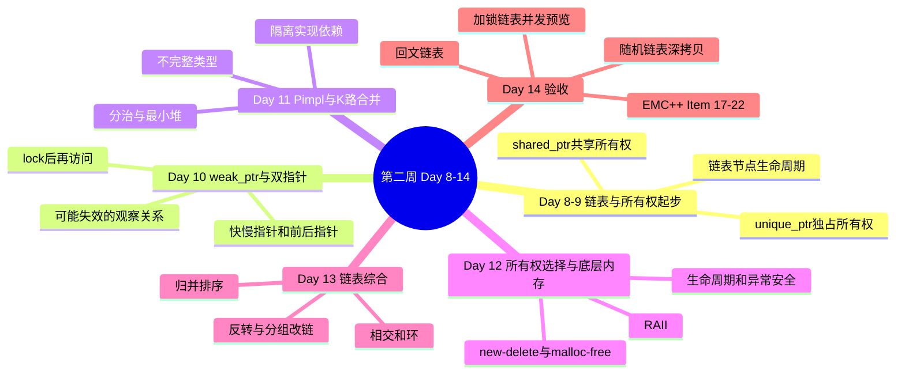

# Day 14: 第二周复习与综合练习

> **学习定位**：用口述、边界测试和综合项目检查所有权知识是否真正形成。线程安全链表在这里是并发预览，不要求马上掌握无锁结构；下一阶段先学习栈、队列和可调用对象。

## 阅读导航

- Item 17-22 的专题机制回查 [Effective Modern C++ 教程](../../tutorials/Effective_Modern_CPP教程.md#emcpp-item-17)；本文只做阶段验收与线程安全链表预览。
- 回文链表和随机链表复制的完整题解分别见 [LeetCode 234](code/leetcode/0234_palindrome/README.md) 与 [LeetCode 138](code/leetcode/0138_copy_random/README.md)。
- 前接 [Day 13 的链表模板迁移](../day_13/README.md)，完成后进入 [Week 3](../../week_03/README.md)；并发项目只验证锁协议和生命周期，不提前扩展成无锁实现。

## 📚 本周知识图谱



## 📖 学习目标

1. **系统复习**第二周所有知识点
2. **深入理解**EMC++条款17-22的设计思想
3. **掌握**链表的高级操作技巧
4. **预览**基于锁的线程安全编程模式，并能说出它的能力边界

---

## 📝 本周知识总结

### Day 8-9：链表节点与 `unique_ptr` / `shared_ptr`

| 智能指针 | 所有权模式 | 引用计数 | 适用场景 |
|---------|-----------|---------|---------|
| `unique_ptr` | 独占 | 无 | 独占资源、工厂返回 |
| `shared_ptr` | 共享 | 有 | 共享资源、缓存 |
| `weak_ptr` | 不拥有对象 | 不增加强引用计数 | 观察共享对象、打破循环 |

**核心要点：**
- 优先使用`unique_ptr`，只在需要共享时才用`shared_ptr`
- 使用`make_unique`和`make_shared`创建智能指针
- `weak_ptr::lock()`安全访问资源

这里真正要形成的不是“会写三种指针”，而是先问：**谁负责释放资源？**

- 只有一个负责人：`unique_ptr`。
- 多个对象确实共同决定资源寿命：`shared_ptr`。
- 只观察、不延长寿命：普通引用/裸指针；若要观察 `shared_ptr` 管理的寿命，用 `weak_ptr`。

### Day 10：`weak_ptr` 与链表双指针

`weak_ptr` 像一张“可能已经过期的取件凭证”：它连接控制块，但不延长对象寿命。访问前调用 `lock()`，成功才得到一个临时 `shared_ptr`。循环引用只是它的重要应用之一，不是完整定义。

链表算法同时建立两类距离思维：快慢指针制造速度差，前后指针维持固定间距。它们分别支撑中点、环和倒数第 `k` 个节点等问题。

### Day 11：Pimpl 与链表专题

Pimpl 用一个指向不完整类型 `Impl` 的指针隔离实现细节，减少实现依赖传播；它有助于编译隔离和 ABI 稳定，但不会自动保证 ABI 兼容。链表部分把“两两合并”推广到 K 路合并，比较顺序合并、分治和最小堆三种组织方式。

### Day 12-13：所有权验收、底层内存与链表综合

Day 12 把智能指针选择、RAII、对象生命周期和底层内存操作串起来；Day 13 再通过反转、删除、相交、环、归并排序等问题验收改链不变量。

> **后续预告，不属于第二周主线**：下面的移动语义与完美转发示例保留下来，是因为 `unique_ptr` 的所有权转移会频繁遇到 `std::move`。此处只建立直觉，后续现代 C++ 课程再系统学习值类别、移动构造和 `std::forward`。

```cpp
// 左值 vs 右值
int x = 10;           // x是左值，10是右值
int& lr = x;          // 左值引用绑定左值
int&& rr = 10;        // 右值引用绑定右值
int&& rr2 = std::move(x);  // move 将表达式转成 xvalue，使其可匹配右值重载

// 移动构造函数
class Widget {
public:
    Widget(Widget&& other) noexcept(
        std::is_nothrow_move_constructible_v<decltype(data_)>)
        : data_(std::move(other.data_)) {}
};
```

异常规格必须由成员和函数体共同推出：如果移动路径还要输出、分配，或给源对象的 `string` 写入“moved”标记，就不能机械承诺 `noexcept`。容器会依据这个契约决定扩容时能否放心移动，所以错误的 `noexcept` 不是注释错误，而可能直接把本可捕获的异常变成 `std::terminate`。

**链表综合识别提示：**

1. 头节点可能被删除或替换：先考虑哨兵节点。
2. 需要中点、倒数距离或判断环：考虑快慢/前后指针。
3. 修改 `next`：先保存后继，再断开或重连，并持续确认未处理后缀仍可达。
4. 链表排序：优先考虑归并排序。

---

## 🎯 EMC++条款17-22要点

### 条款17: 理解特殊成员函数的生成

“编译器会帮我生成”不是无条件的。最容易踩坑的是：代码写着 `std::move(x)`，但类型没有移动构造，最后仍可能调用拷贝构造。`std::move` 只改变表达式的值类别，不会凭空生成移动操作。

| 你的声明 | 关键后果 |
|---------|---------|
| 声明任意构造函数 | 不再隐式生成默认构造函数 |
| 声明析构函数、拷贝构造或拷贝赋值 | 阻止隐式移动构造和移动赋值生成 |
| 声明移动构造或移动赋值 | 隐式拷贝操作会被定义为 `deleted` |
| 成员本身不可拷贝/移动 | 默认生成的对应操作也可能被删除 |

```cpp
class Widget {
public:
    Widget();                              // 默认构造
    ~Widget();                             // 析构
    Widget(const Widget&);                 // 拷贝构造
    Widget& operator=(const Widget&);      // 拷贝赋值
    Widget(Widget&&);                      // 移动构造
    Widget& operator=(Widget&&);           // 移动赋值
};

// 只要用户声明析构函数、拷贝构造或拷贝赋值，
// 编译器就不会再隐式生成移动构造和移动赋值。
// 只要声明移动操作，隐式拷贝操作就会被删除。
```

工程上优先追求 **Rule of Zero**：让 `std::string`、`std::vector`、智能指针等成员管理资源，业务类不手写析构/拷贝/移动。只有直接管理资源时，才把 **Rule of Five** 当作检查清单，逐项决定复制、转移还是禁用。

### 条款18: 使用unique_ptr管理独占资源

`unique_ptr` 表达“当前只有一个所有者负责释放”。它不能拷贝，可以移动，因此很适合作为工厂返回值。自定义删除器是 `unique_ptr` 类型的一部分；默认无状态删除器时它通常和裸指针一样紧凑，有状态删除器则可能让对象变大。

```cpp
// 创建方式
auto p1 = std::make_unique<Widget>();
auto p2 = std::unique_ptr<Widget>(new Widget());

// 智能指针析构会调用删除器；删除器不能让异常逃逸
auto deleter = [](FILE* f) noexcept { if (f) fclose(f); };
std::unique_ptr<FILE, decltype(deleter)> file(fopen("test.txt", "r"), deleter);

// 工厂模式返回
std::unique_ptr<Widget> createWidget() {
    return std::make_unique<Widget>();
}
```

### 条款19: 使用shared_ptr管理共享资源

`shared_ptr` 管理的是“共享所有权”，而不仅是“方便传指针”。控制块通常保存强引用计数、弱引用计数和删除器。只有多个参与者确实共同决定对象何时销毁时才使用它，否则会把生命周期关系变得模糊。

```cpp
// 引用计数机制
auto sp1 = std::make_shared<Widget>();  // 通常将控制块与对象合并为一次分配
auto sp2 = sp1;  // 引用计数+1
// 当sp1和sp2都析构时，Widget才被销毁

// 注意：裸指针构造多个shared_ptr会导致重复释放
Widget* raw = new Widget();
std::shared_ptr<Widget> p1(raw);
std::shared_ptr<Widget> p2(raw);  // 危险！会导致double-free
```

控制块的引用计数更新可由不同 `shared_ptr` 副本并发完成，但这不代表 `Widget` 自动线程安全，也不代表多个线程可以无同步地修改同一个 `shared_ptr` 变量。

### 条款20: 使用weak_ptr表示可能悬空的shared_ptr-like指针

`weak_ptr` 不拥有对象。它保存“对象过去/现在由某个 `shared_ptr` 控制块管理”的观察关系，因此对象可能已经销毁。正确使用方式不是先 `expired()` 再访问——两步之间仍可能过期——而是直接 `lock()`，原子地尝试取得一个临时共享所有权。

```cpp
class Node {
public:
    std::shared_ptr<Node> next;
    std::weak_ptr<Node> prev;  // 使用weak_ptr打破循环
};

// 观察者模式
class Observer {
public:
    virtual void notify() = 0;
};

class Subject {
    std::vector<std::weak_ptr<Observer>> observers_;
public:
    void notifyAll() {
        for (auto& weakObs : observers_) {
            if (auto obs = weakObs.lock()) {  // 安全访问
                obs->notify();
            }
        }
    }
};
```

### 条款21: 优先使用make函数

`make_unique` / `make_shared` 把“分配对象”和“交给智能指针管理”写成一个动作，代码更短，也不暴露裸 `new`。`make_shared` 通常还能把对象与控制块合并为一次分配，但标准不保证绝对的实现方式。书中关于多参数调用中泄漏的例子主要针对 C++11/14；C++17 加强了参数求值顺序，但 `make` 的表达力和分配优势仍然成立。

```cpp
// 推荐方式
auto up = std::make_unique<Widget>(arg1, arg2);
auto sp = std::make_shared<Widget>(arg1, arg2);

// make的优势：
// 1. 异常安全：避免函数调用之间的内存泄漏
// 2. 性能优化：make_shared通常将对象与控制块合并为一次分配
// 3. 代码简洁：不重复写类型名

// 需要权衡或不适用make的场景：
// 1. 需要自定义删除器
// 2. 必须使用花括号初始化，而构造函数不匹配圆括号参数
// 3. make_shared的大对象仍有weak_ptr时，整块内存可能延迟释放
```

### 条款22: 使用Pimpl模式减少编译依赖

前向声明让头文件知道“存在 `Impl` 这个类型”，因此可以声明指向它的指针；但删除 `Impl` 对象时必须看到完整定义。`unique_ptr<Impl>` 的析构函数会执行删除，所以持有它的外层类通常要把析构函数以及相关移动操作声明在头文件、定义在 `.cpp` 中，并放在 `Impl` 完整定义之后。

```cpp
// Widget.h
class Widget {
public:
    Widget();
    ~Widget();
private:
    class Impl;  // 前向声明
    std::unique_ptr<Impl> pImpl_;
};

// Widget.cpp
class Widget::Impl {
    // 实现细节放在这里
    std::string name_;
    std::vector<int> data_;
};

Widget::Widget() : pImpl_(std::make_unique<Impl>()) {}
Widget::~Widget() = default;  // 必须在Impl定义之后
```

Pimpl 隐藏的是**实现专属依赖**。如果公开成员函数使用 `std::string`、`std::vector` 等类型，头文件仍要正确包含或声明这些公开接口类型。它有助于减少重编译范围和维持 ABI，但代价通常包括一次动态分配、一次间接访问；若类需要值语义，还要自行实现深拷贝。

---

## 🧩 LeetCode题目解析

### 234. 回文链表

**难度：简单** | **标签：链表、双指针**

#### 题目描述
给你一个单链表的头节点 `head`，请你判断该链表是否为回文链表。

#### 解题思路
1. **快慢指针**找到链表中点
2. **反转**后半部分链表
3. **比较**前后两半
4. **恢复**链表（查询接口的必要后置条件）

#### 复杂度分析
- 时间复杂度：O(n)
- 空间复杂度：O(1)

Day 14 的新增要求不是再背一次反转代码，而是补上**查询接口后置条件**：即使比较中途发现不相等，也必须恢复后半链。循环期间保持“前指针与反转后的后半指针已比较相同长度前缀”；恢复后还要验证节点地址和 `next` 拓扑与调用前一致，而不只是返回值正确。完整实现、数组法、递归法和运行命令集中在 [LeetCode 234 题解](code/leetcode/0234_palindrome/README.md)。

---

### 138. 随机链表的复制

**难度：中等** | **标签：链表、哈希表**

#### 题目描述
给你一个长度为 `n` 的链表，每个节点包含一个额外增加的随机指针 `random`，该指针可以指向链表中的任何节点或空节点。请构造这个链表的深拷贝。

#### 解法一：哈希表法

**复杂度：** O(n) 时间，O(n) 空间

本日把哈希表法看成“先建立原节点到副本节点的一一映射，再复制两种边”。临时 `unique_ptr` 应在所有连接成功前拥有副本，使分配或建表异常不会泄漏；交付后还要验证副本节点地址均不同于原节点。

#### 解法二：节点拆分法

**复杂度：** O(n) 时间，O(1) 空间

节点拆分法的三阶段不变量是“已穿插副本”“副本边已映射”“原链与副本链已分离”。副本构造可能在第一阶段任意位置失败，所以必须回滚已穿插前缀；一旦构造全部完成，后两阶段只做不抛的指针重连，避免重新打开失败窗口。完整异常安全实现、边界表与验证方法集中在 [LeetCode 138 题解](code/leetcode/0138_copy_random/README.md)。

---

## 🚀 综合项目：线程安全链表

> **定位提醒**：这是基于互斥锁的并发数据结构预览，不是无锁链表。目标是先理解“共享状态、锁保护范围、固定加锁顺序、RAII 解锁”，不是在第二周一次掌握完整并发编程。

项目公开类型放在 `week2_concurrency` 命名空间，演示入口放在 `week2_concurrency::demo`；命名空间只解决编译期模块边界，不替代运行期的锁和生命周期协议。

### 设计要点

1. **每节点一把锁**：相邻遍历者有机会操作不同位置，但锁数量和推理成本也更高。
2. **手递手加锁**：先持有当前节点，再在当前锁内复制后继 `shared_ptr`，锁住后继，最后释放当前节点；所有操作保持同一方向，避免形成反向等待环。
3. **RAII 解锁**：`lock_guard` / `unique_lock` 在正常返回和异常退出时都会释放锁。
4. **先构造再加锁**：新节点分配或元素构造如果抛异常，链表尚未变化。
5. **生命周期令牌**：结构链和正在交接的操作短暂共同拥有节点；删除重连后，局部 owner 与节点锁都释放之前，节点、数据和 mutex 都不能析构。

### 核心实现

```cpp
namespace week2_concurrency {

template<typename T>
class ThreadSafeList {
private:
    struct Node {
        mutable std::mutex mutex;
        std::shared_ptr<T> data;
        std::shared_ptr<Node> next;
        
        Node() : data(nullptr) {}
        Node(const T& val) : data(std::make_shared<T>(val)) {}
    };
    
    Node head;  // 哨兵节点

public:
    void push_front(const T& value) {
        auto new_node = std::make_shared<Node>(value);
        std::lock_guard<std::mutex> lk(head.mutex);
        new_node->next = head.next;
        head.next = std::move(new_node);
    }
    
    template<typename Func>
    void for_each(Func f) const {
        const Node* current = &head;
        std::shared_ptr<Node> current_owner;
        std::unique_lock<std::mutex> lk(head.mutex);
        while (auto next_owner = current->next) { // 必须在lk保护下复制owner
            std::unique_lock<std::mutex> next_lk(next_owner->mutex);
            lk.unlock();  // 释放前一个锁
            lk = std::move(next_lk);  // 转移锁所有权
            current_owner = std::move(next_owner); // 现在才可释放旧owner
            current = current_owner.get();
            f(static_cast<const T&>(*current->data));
        }
    }
};

} // namespace week2_concurrency
```

### 必须说清的能力边界

- `for_each`、`find_first_if`、`remove_if` 的用户回调在节点锁持有期间执行。慢回调会阻塞其他操作；回调若重入同一链表，可能再次申请同一把锁并死锁。
- 回调抛异常时，RAII 能保证锁被释放；对只读回调，结构不变。`remove_if` 采用逐节点提交：当前候选的谓词先执行，匹配后只做不抛的重连；若后续谓词抛异常，之前已提交的删除保留，未检查后缀仍有效，这是基本保证而不是“整个操作回滚”的强保证。
- 本实现故意不缓存 `size_`：`size()` 通过同一锁耦合协议遍历，代价是 `O(n)`，但不会出现“结构已部分删除、计数尚未提交”的漂移。并发修改时一次遍历也不是全局原子快照；若业务需要跨操作一致视图，整表锁或显式快照接口更容易证明。
- `find_first_if` 返回的 `shared_ptr<const T>` 是找到时那个值的**不可变版本快照**，它会延长该版本值的寿命，但不是节点内容的实时视图。`update_first_if` 会先构造新值，再给节点换入新的 `shared_ptr`；所以旧句柄继续看到旧值，新查找看到新值，节点随后被更新或删除也不会让旧句柄悬空。
- 本例没有 `wait`、`close` 或阻塞弹出接口，因此还不存在“关闭后唤醒等待者”的语义。那是设计并发队列时需要单独定义的契约。
- 容器析构和移动期间不能仍有其他线程访问。本实现禁止移动链表本身；析构前调用者必须先发出停止协议并 `join` 全部访问线程，析构再逐节点移走 `next`，避免长链递归释放，也不调用用户谓词。

这里选择 `shared_ptr<Node>` 不是建议“并发结构一律共享所有权”，而是让结构所有者和正在锁交接的操作真实共享短暂生命周期。更简单的替代方案是一把整表锁；继续使用 `unique_ptr<Node>` 也不是绝对错误，但必须证明任何访问者在节点可能摘链和销毁前始终持有能阻止该动作的锁或独立回收令牌。若走无锁路线，则还需要 hazard pointer、epoch 等独立内存回收协议，本周不把它伪装成一次指针替换。

---

## 📁 代码结构

```
day_14/
├── README.md                    # 本教程文档
├── CMakeLists.txt               # CMake构建配置
├── build_and_run.sh             # 一键构建运行脚本
└── code/
    ├── main.cpp                 # 主程序入口
    ├── review/
    │   ├── week2_summary.h      # 总结模块声明
    │   ├── week2_summary.cpp    # 本周知识点总结代码
    │   ├── emcpp_review.h       # EMC++模块声明
    │   ├── emcpp_review.cpp     # EMC++条款复习
    │   ├── exercises.h          # 综合练习模块声明
    │   └── exercises.cpp        # 综合练习题
    ├── project/
    │   ├── thread_safe_list.h   # 线程安全链表头文件
    │   ├── thread_safe_list_demo.h # 演示函数声明
    │   ├── thread_safe_list.cpp # 实现
    │   └── test_thread_safe.cpp # 测试用例
    ├── header_composition_test.cpp # 同日/跨日教学头组合包含
    └── leetcode/
        ├── 0234_palindrome/     # 回文链表
        │   ├── solution.h
        │   ├── solution.cpp
        │   ├── test.cpp
        │   └── README.md
        └── 0138_copy_random/    # 随机链表复制
            ├── solution.h
            ├── solution.cpp
            ├── test.cpp
            └── README.md
```

---

## 🔧 构建与运行

```bash
# 方式一：使用脚本
cd week_02/day_14
./build_and_run.sh all

# 方式二：手动配置；重复执行会安全地重用构建目录
cmake -S . -B build-manual -DCMAKE_BUILD_TYPE=Debug
cmake --build build-manual -j4
ctest --test-dir build-manual --output-on-failure
./build-manual/day14_main --all
```

不带参数时进入交互菜单。菜单按整行解析：空行、非数字和 `3 trailing` 这类尾随垃圾都会只拒绝当前行，下一行仍可继续输入；stdin 仅有 EOF 时友好退出，`badbit` 即使与 `eofbit` 同时出现也优先视为 I/O 故障并返回非零，异常掩码抛出的 `std::ios_base::failure` 也会归入同一有限退出路径，绝不会重复使用旧选项或无限打印菜单。可直接复查真实入口：

```bash
printf 'bad\n0\n' | ./build-manual/day14_main
./build-manual/day14_main </dev/null
./build-manual/day14_main --menu-contracts
```

需要额外检查内存和未定义行为时，显式打开 Sanitizer：

```bash
ENABLE_SANITIZERS=ON ./build_and_run.sh test
```

---

## 📋 练习任务

### 基础任务
- [ ] 阅读并理解所有复习代码
- [ ] 完成LeetCode 234题的提交
- [ ] 完成LeetCode 138题的提交

### 进阶任务
- [ ] 为删除全部、删除部分、查找不存在和回调抛异常补边界测试
- [ ] 解释为什么普通迭代器很难在并发修改下保持有效，再设计快照接口
- [ ] 研究是否真的能用`std::shared_mutex`优化；先写清读写操作和数据竞争边界

### 挑战任务
- [ ] 画出无锁链表还需要解决的 ABA 与内存回收问题，并比较 hazard pointer、epoch 等方案；本周不直接实现
- [ ] 对比细粒度锁与单一锁的性能差异
- [ ] 实现线程安全的跳表

### 今日工程动作：用工具验证并发代码

先运行普通 CTest，再打开 ASan/UBSan；定向测试用条件变量谓词把读者停在受锁节点上，确认删除线程在交接期间不能提前销毁节点和值，再释放门闩、`join` 全部线程并检查析构次数与最终结构：

```bash
cd week_02/day_14
./build_and_run.sh test
ENABLE_SANITIZERS=ON ./build_and_run.sh test
```

工具通过不等于并发设计已被证明正确；你仍要能口述锁顺序、回调边界和对象生命周期。
若编译器与运行环境支持 TSan，再为同一目标建立 TSan 构建并运行；正确性证据仍是协议和最终不变量，而不是休眠时长、运行次数或输出顺序。

### 五句复盘

1. `unique_ptr`、`shared_ptr`、`weak_ptr` 分别表达独占拥有、共同拥有和可过期的非拥有观察。
2. 用户声明析构、拷贝构造或拷贝赋值会抑制隐式移动生成，声明移动操作则会使隐式拷贝被删除。
3. `weak_ptr::lock()` 把存活检查与取得临时共享所有权合成一个原子动作，关闭了两步检查之间的失效窗口。
4. 手递手加锁保持统一方向可避免反向等待环，后继 owner 在前驱锁内取得才能保证交接期间节点不被摘链销毁。
5. 回文链表依赖比较后恢复输入结构，随机链表深拷贝依赖原节点到副本节点的一一映射并在失败时恢复原链。

---

## 📚 参考资料

1. **Effective Modern C++** - Scott Meyers
   - Item 17-22: 智能指针与资源管理

2. **C++ Concurrency in Action** - Anthony Williams
   - Chapter 6: Designing lock-based concurrent data structures

3. **LeetCode官方题解**
   - [234. 回文链表](https://leetcode.cn/problems/palindrome-linked-list/)
   - [138. 随机链表的复制](https://leetcode.cn/problems/copy-list-with-random-pointer/)

---

## 🎉 第二周总结

恭喜你完成了第二周的学习！本周我们深入探索了：

- **智能指针**：现代C++资源管理的基石
- **所有权设计**：区分独占、共享和不拥有的观察关系
- **链表算法**：快慢指针、反转链表等核心技巧
- **工程意识**：用 CTest 和 Sanitizer 验证边界；并发链表只作为加锁预览

下周先学习**栈、队列、Lambda、优先队列与 BFS**。移动语义和完美转发的代码已经保留为现代 C++ 后续课程预告，不把它们冒充第二周 Day 10-11 的主线。

**Keep coding, keep learning!** 🚀
