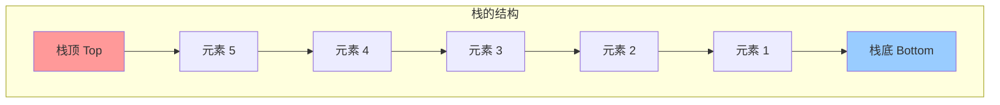
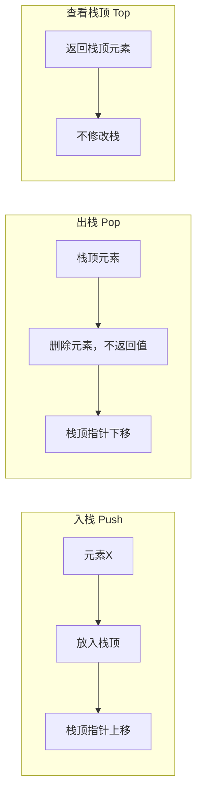
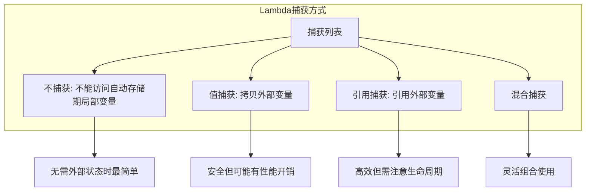
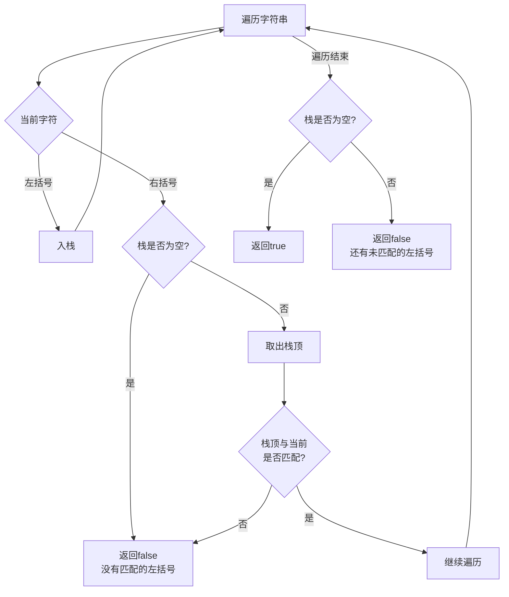
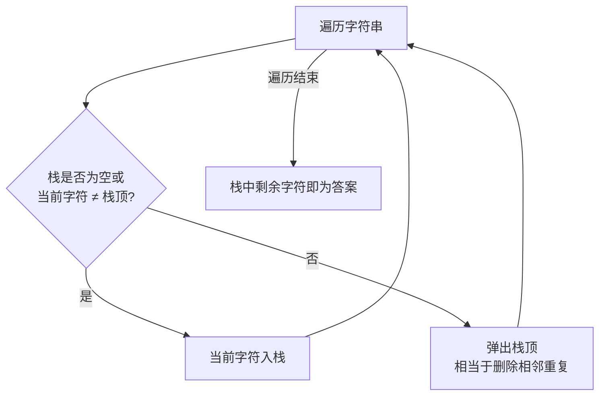

# Day 15：栈入门与Lambda表达式

> **学习定位**：从链表的显式节点关系切换到 STL 容器适配器，并把函数行为写成 Lambda 对象。主线是 LIFO 模型和捕获生命周期；EMC++ Item 31 用于解释为什么默认捕获可能隐藏风险。

## 📅 学习目标

- [ ] 理解栈数据结构的后进先出(LIFO)原理
- [ ] 掌握栈的基本操作：入栈、出栈、查看栈顶
- [ ] 学会使用C++ STL的stack容器
- [ ] 掌握Lambda表达式的基本语法
- [ ] 理解Lambda的捕获方式（值捕获、引用捕获）
- [ ] 学习EMC++ Item 31：避免默认捕获模式
- [ ] 完成LeetCode 20、1047

---

## 📖 知识点一：栈数据结构

### 概念定义

**栈(Stack)** 是一种**后进先出**(LIFO, Last In First Out)的线性数据结构。它只允许在一端（称为栈顶）进行插入和删除操作。

### 专业介绍

栈是一种抽象数据类型(ADT)，其核心特性体现在以下方面：

**操作约束**：栈只允许在表尾（栈顶）进行插入和删除操作，这种限制带来了操作的确定性——总是能确定哪个元素会被访问或删除。栈顶指针(top)指向最后一个入栈的元素位置。

**实现方式**：栈 ADT 可以由动态数组、分块双端队列或链表等结构实现，取舍是连续性、扩容方式、额外指针开销和引用失效规则。不要把“顺序栈”机械理解成必须一次性预分配固定容量：`std::vector` 也是连续存储，但能动态扩容。C++ 的 `std::stack` 默认适配 `std::deque`，它的语义由栈接口决定，性能和失效细节则跟随底层容器。

**应用原理**：栈的LIFO特性使其天然适合处理具有递归结构或嵌套关系的问题，如函数调用、括号匹配、表达式求值等。在许多常见 ABI 和未被优化改写的实现中，运行时栈会保存恢复未完成调用所需的部分状态；具体哪些参数、返回状态或局部对象位于栈内存，由平台、编译器和优化决定，C++ 标准不规定固定栈帧布局。



### 形象化比喻

想象一摞盘子：

```
🍽️ ← 栈顶（最后放的盘子，最先拿走）
🍽️
🍽️
🍽️
🍽️ ← 栈底（最先放的盘子，最后拿走）
```

**生活中的例子**：
- **洗盘子**：最后放上去的盘子，最先被洗
- **浏览器的后退按钮**：最后访问的页面，最先后退回去
- **撤销操作**：最后的操作最先被撤销
- **函数调用**：最后调用的函数最先返回

### 栈的基本操作



### 时间复杂度

| 操作 | 时间复杂度 | 说明 |
|------|-----------|------|
| push(x) | O(1) | 入栈 |
| pop() | O(1) | 出栈 |
| top() | O(1) | 查看栈顶 |
| empty() | O(1) | 判空 |
| size() | O(1) | 获取大小 |

`std::stack` 是容器适配器：它只暴露栈顶操作，不允许随机访问和直接遍历。尤其要记住，`pop()` 只删除、不返回元素；若需要取值，应先在非空前提下调用 `top()`，再调用 `pop()`。对空栈调用 `top()` 或 `pop()` 不满足接口前置条件，不能用某个哨兵值假装成功。

<a id="day15-stack-adaptor"></a>

### 容器适配器与底层容器契约

`std::stack<T, Container>` 不是一种新的节点容器，它保存一个受保护的底层容器 `Container c`，并把 `top/push/pop` 映射到 `back/push_back/pop_back`。因此底层类型必须满足容器要求，并提供这三个尾端操作；`std::vector`、`std::deque` 和 `std::list` 都能满足，默认是 `std::deque`。

| 底层容器 | 为什么可用 | 要注意的差异 |
|------------|------------|------------------|
| `std::deque<T>` | 提供尾端常数时间操作，也是默认选择 | 通常不是单块连续存储 |
| `std::vector<T>` | `back/push_back/pop_back` 都可用 | 扩容可使指向元素的迭代器、指针和引用失效 |
| `std::list<T>` | 尾端插入、删除稳定 | 每元素有节点与指针开销，局部性通常较差 |

适配器只保证自己公开的契约，不暴露底层迭代器。上表也不意味着某一种容器在所有机器上都更快；若算法只需要 LIFO，首先选择 `std::stack` 表达受限接口，只在有明确性能或失效规则需求时才替换底层类型。

### C++ STL stack 使用

```cpp
#include <stack>
#include <iostream>

void stackDemo() {
    std::stack<int> s;
    
    // 入栈
    s.push(1);
    s.push(2);
    s.push(3);
    
    // 查看栈顶
    std::cout << "栈顶: " << s.top() << std::endl;  // 3
    
    // 出栈
    s.pop();  // 移除栈顶元素 3
    
    // 大小
    std::cout << "大小: " << s.size() << std::endl;  // 2
    
    // 判空
    while (!s.empty()) {
        std::cout << s.top() << " ";  // 2 1
        s.pop();
    }
}
```

---

## 📖 知识点二：Lambda表达式入门

### 概念定义

**Lambda表达式** 是C++11引入的一种匿名函数机制，允许在代码中直接定义函数对象，无需单独声明命名函数。Lambda表达式可以捕获外部作用域的变量，实现闭包(closure)功能。

### 专业介绍

Lambda表达式在编译时会生成一个唯一的函数对象类（闭包类型），捕获的变量成为该类的成员变量。这种机制使得Lambda可以像普通函数一样调用，同时保持对外部状态的访问能力。

三个术语要分清：源码中的 `[...] { ... }` 是 **Lambda 表达式**；编译器生成的未命名类是 **闭包类型**；表达式求值得到、真正存储捕获状态的实例是 **闭包对象**。同一段 Lambda 每执行一次，都可能构造一个状态不同的新闭包对象。

**类型推导**：Lambda表达式的类型由编译器自动推导，是一个唯一的、未命名的函数对象类型。可以使用auto关键字存储Lambda，或使用std::function封装。

**捕获机制**：捕获是Lambda的核心特性，分为值捕获（拷贝）和引用捕获（别名）。值捕获的变量在Lambda创建时拷贝，引用捕获则绑定到原变量。mutable关键字允许修改值捕获的变量（修改的是拷贝）。

捕获发生在**闭包对象创建时**，不是调用时：值捕获得到当时的快照；引用捕获在调用时读取原对象，因此闭包若比原对象活得久就会悬空。回调被保存到容器、线程或异步任务时，必须先问“回调活多久、捕获对象由谁拥有”。

**优化特点**：Lambda 的闭包类型是具体类型，编译器通常容易看见调用目标并尝试内联；但“写成 Lambda”不保证一定内联或一定更快。若把它装进 `std::function`，还可能引入类型擦除、间接调用和动态分配，是否有开销要结合实际类型与优化结果判断。

### 基本语法

```cpp
[capture](parameters) -> return_type { body }
   ↑         ↑              ↑           ↑
 捕获列表   参数列表      返回类型     函数体
```

### 最简单的Lambda

```cpp
auto greet = []() { std::cout << "Hello, Lambda!" << std::endl; };
greet();  // 调用Lambda
```

### 带参数的Lambda

```cpp
auto add = [](int a, int b) { return a + b; };
std::cout << add(3, 4) << std::endl;  // 7
```

### 显式指定返回类型

```cpp
auto divide = [](double a, double b) -> double {
    if (b == 0) return 0;
    return a / b;
};
```

### 捕获方式详解



#### 1. 值捕获

```cpp
int x = 10;
auto f = [x]() {  // 拷贝x的值
    std::cout << x << std::endl;  // 10
    // x = 20;  // 错误：不能修改值捕获的变量
};

// 如果想修改拷贝的值，使用mutable
auto f2 = [x]() mutable {
    x = 20;  // OK，但只修改拷贝
    std::cout << x << std::endl;  // 20
};
```

#### 2. 引用捕获

```cpp
int x = 10;
auto f = [&x]() {  // 引用x
    x = 20;  // OK，修改原变量
};
f();
std::cout << x << std::endl;  // 20
```

#### 3. 隐式捕获

```cpp
int a = 1, b = 2, c = 3;

// 对Lambda体内实际使用且可捕获的自动变量按值隐式捕获
auto f1 = [=]() { return a + b + c; };

// 对Lambda体内实际使用且可捕获的自动变量按引用隐式捕获
auto f2 = [&]() { a = 10; b = 20; c = 30; };

// 混合捕获：实际使用的a、c按值捕获，b按引用捕获
auto f3 = [=, &b]() { b = a + c; };
```

### EMC++ Item 31：避免默认捕获模式

**问题**：默认捕获（`[=]`或`[&]`）可能导致意外行为。

Item 31 不是说默认捕获语法永远非法，而是要求长期存在或不断演化的闭包把依赖写清楚：

- `[&]` 会让用到的局部对象成为引用依赖，闭包逃离当前作用域后可能悬空。
- `[=]` 捕获成员时，在 C++11/14/17 中实际隐式捕获的是 `this` 指针，不是成员对象的独立副本；对象先销毁仍会悬空。C++20 已弃用通过 `[=]` 隐式捕获 `this`，应显式写出所需对象或成员快照。
- 全局变量和静态变量可直接访问，不属于捕获；`[=]` 也不会把它们冻结成快照。
- 后续在 Lambda 体内新增变量使用时，默认捕获会悄悄改变闭包状态和生命周期依赖，显式捕获更利于审查。

<a id="day15-lambda-lifetime"></a>

### Lambda 捕获与生命周期边界

捕获列表记录的是闭包对象的状态，但“把一个名字写进捕获列表”不自动表示拥有其背后资源。判断一个可能被保存的 Lambda，至少分清以下五种情况：

| 写法 | 闭包中保存什么 | 主要生命周期结论 |
|------|--------------------|----------------------|
| `[x]` | 创建闭包时的 `x` 副本 | 副本与闭包同寿；若 `x` 本身是指针，复制指针不会延长所指对象寿命 |
| `[&x]` | 对外部 `x` 的引用依赖 | 闭包每次调用时 `x` 都必须仍存活；否则访问是未定义行为 |
| `[this]` | `this` 指针的副本 | 不拥有对象；调用时原对象必须仍存活 |
| `[*this]` | C++17 中当前对象的副本 | 副本与闭包同寿，但需要对象可复制，并且修改的是副本 |
| `[p = std::move(p)]` | 由初始化式构造的新成员 | 可把 `unique_ptr` 所有权移入闭包；该闭包因此可能仅可移动 |

`std::function` 的 C++17 目标必须可复制，所以一个直接移入 `std::unique_ptr` 的闭包不能直接存入 `std::function`；这不是 Lambda 调用错误，而是存储边界的可复制性不匹配。若回调可能比当前对象活得更久，可根据业务所有权选择拥有副本、捕获 `shared_ptr`，或捕获 `weak_ptr` 并在调用时 `lock()`；不要为了“防止悬空”无条件引入共享所有权。Day 16 只继续讲初始化捕获的所有权转移，不再重复本表。

#### 危险示例

```cpp
// 危险：引用捕获可能导致悬空引用
std::function<void()> createCallback() {
    int local = 42;
    return [&]() {  // 危险！local会被销毁
        std::cout << local << std::endl;  // 未定义行为
    };
}

// 安全：显式值捕获或使用init捕获
std::function<void()> createCallbackSafe() {
    int local = 42;
    return [local]() {  // 安全：拷贝值
        std::cout << local << std::endl;
    };
}
```

#### 最佳实践

```cpp
// ✅ 推荐：显式列出要捕获的变量
int x = 10, y = 20;
auto f = [x, &y]() {  // 清晰明了
    y = x + 1;
};

// ❌ 避免：默认捕获
auto f2 = [&]() {  // 不清晰，容易把新的局部变量也变成引用依赖
    // ...
};
```

---

## 🎯 LeetCode 刷题

### 讲解题：LC 20. 有效的括号

#### 题目链接

[LeetCode 20](https://leetcode.cn/problems/valid-parentheses/)

#### 题目描述

给定一个只包括 `'('`，`')'`，`'{'`，`'}'`，`'['`，`']'` 的字符串 `s`，判断字符串是否有效。

有效字符串需满足：
1. 左括号必须用相同类型的右括号闭合
2. 左括号必须以正确的顺序闭合

#### 形象化理解

想象你在叠积木，每种括号是一种形状的积木：

```
输入: "{[()]}"  → 有效 ✓

叠积木过程：
  { [ (         先放左括号（像盖房子从下往上）
  { [ ( )       遇到)匹配最近的(，移除
  { [ ]         遇到]匹配最近的[，移除  
  { }           遇到}匹配最近的{，移除
  空            全部匹配成功！
```

```
输入: "{[(])}"  → 无效 ✗

叠积木过程：
  { [ (         放入 { [ (
  { [ ( ]       遇到]，但最近的是(，不匹配！
                匹配失败
```

#### 解题思路



#### 代码实现

```cpp
class Solution {
public:
    bool isValid(string s) {
        std::stack<char> stk;
        
        // 括号匹配映射：右括号 -> 左括号
        std::unordered_map<char, char> pairs = {
            {')', '('},
            {']', '['},
            {'}', '{'}
        };
        
        for (char c : s) {
            if (pairs.count(c)) {
                // 当前是右括号
                if (stk.empty() || stk.top() != pairs[c]) {
                    return false;  // 没有匹配的左括号
                }
                stk.pop();  // 匹配成功，移除栈顶
            } else {
                // 当前是左括号，入栈
                stk.push(c);
            }
        }
        
        return stk.empty();  // 栈空则全部匹配
    }
};
```

#### 复杂度分析

- **时间复杂度**：O(n)，遍历一次字符串
- **空间复杂度**：O(n)，最坏情况栈存储所有左括号

**栈不变量**：处理完任意前缀后，栈从底到顶保存该前缀中尚未匹配的左括号，顺序与出现顺序一致。遇到右括号时必须先保证栈非空，再保证栈顶类型匹配；遍历结束还必须保证栈为空。`"]"` 证明“右括号先出现”会失败，`"("` 证明“只检查过程中不报错”仍不够。

---

### 实战题：LC 1047. 删除字符串中的所有相邻重复项

#### 题目链接

[LeetCode 1047](https://leetcode.cn/problems/remove-all-adjacent-duplicates-in-string/)

#### 提示

1. 使用栈来模拟"消消乐"的过程
2. 遍历字符串，如果当前字符与栈顶相同，则弹出栈顶（消除）
3. 否则将当前字符入栈
4. 最后栈中剩余的字符就是答案

#### 题目描述

给出由小写字母组成的字符串 `s`，重复项删除操作会选择两个相邻且相同的字母并删除它们。反复执行这一操作，直到无法继续删除。

#### 形象化理解

想象**消消乐游戏**，相同的字母相邻就会消失：

```
输入: "abbaca"

步骤演示：
  a b b a c a   初始
    ↑↑
  a   b b   a c a   发现bb相邻相同，删除
  a     a c a       变成aa相邻
    ↑↑
      c a           删除aa，得到结果"ca"
```

这就像**栈弹球**：
- 新球与栈顶球相同？两个都消失！
- 不同？新球入栈！

#### 解题思路



#### 代码实现

```cpp
class Solution {
public:
    string removeDuplicates(string s) {
        std::stack<char> stk;
        
        for (char c : s) {
            if (stk.empty() || stk.top() != c) {
                // 栈空或不重复，入栈
                stk.push(c);
            } else {
                // 与栈顶相同，消除
                stk.pop();
            }
        }
        
        // 构建结果字符串（教学写法）
        string result;
        while (!stk.empty()) {
            result = stk.top() + result;  // 反复头插可能退化为 O(n²)
            stk.pop();
        }
        
        return result;
    }
};
```

#### 推荐实现（使用string作为栈）

```cpp
class Solution {
public:
    string removeDuplicates(string s) {
        string result;  // string本身可以作为栈使用
        
        for (char c : s) {
            if (!result.empty() && result.back() == c) {
                result.pop_back();  // 消除
            } else {
                result.push_back(c);  // 入栈
            }
        }
        
        return result;
    }
};
```

#### 复杂度分析

- **时间复杂度**：推荐实现为 O(n)；上面的 `std::stack` 教学写法若反复向字符串头部插入，最坏可达 O(n²)
- **空间复杂度**：O(n)

**状态不变量**：处理完任意前缀后，作为栈使用的结果字符串已经是该前缀“完全消除相邻重复项”的结果，并且内部不存在相邻相同字符。新字符只可能与当前栈顶形成一对，因此一次比较即可决定弹栈还是入栈；这也是连锁消除仍能在线性时间完成的原因。

---

## 🚀 运行代码

```bash
# 编译并运行当天所有代码
./build_and_run.sh

# 或者手动编译
cmake -S . -B build -DCMAKE_BUILD_TYPE=Release
cmake --build build
ctest --test-dir build --output-on-failure
```

### 今日工程动作：让测试失败可见

在 Day 15 目录执行 `./build_and_run.sh /tmp/week3-day15-action`，确认算法断言通过后，临时把一个 LC 20 期望值改错并再次执行同一命令，观察 CTest 如何通过非零退出状态暴露失败，最后恢复正确期望值。随后为可保存到 `std::function<void()>` 的回调标出引用捕获期限，再改成显式值捕获或智能指针捕获，使所有权和生命周期从接口上可审查；同时为两道算法各写一句循环不变量，用空输入、单个不匹配字符和连锁消除反例验证。

### 五句复盘

1. **核心问题**：栈顶操作和 Lambda 捕获如何把“下一步只能做什么”表达成明确约束？
2. **旧误解**：`pop()` 不返回元素，值捕获也不是调用时读取，默认 `[=]` 更不等于深拷贝整个对象。
3. **规则前提**：栈访问前必须判空；引用捕获要求被引用对象活得比闭包久。
4. **测试/反例证据**：右括号先出现、遍历结束仍有左括号、连锁重复字符和逃逸引用回调分别验证边界。
5. **与前后课连接**：Day 15 建立 LIFO 与闭包生命周期模型，Day 16 将用两个栈实现 FIFO，并把对象移动进闭包。

---

## 📚 相关术语

| 术语 | 英文 | 定义 |
|------|------|------|
| 栈 | Stack | 后进先出的数据结构 |
| LIFO | Last In First Out | 后进先出 |
| 入栈 | Push | 将元素添加到栈顶 |
| 出栈 | Pop | 移除栈顶元素 |
| 栈顶 | Top | 栈中最后入栈的元素 |
| Lambda | Lambda Expression | 匿名函数 |
| 捕获 | Capture | Lambda访问外部变量 |
| 闭包 | Closure | Lambda及其捕获的环境 |

---

## 💡 学习提示

### 栈的使用场景

1. **括号匹配**：检查括号是否成对出现
2. **表达式求值**：中缀转后缀、计算后缀表达式
3. **函数调用**：常见实现用运行时栈保存恢复未完成调用所需的部分状态
4. **撤销操作**：保存历史状态
5. **浏览器历史**：后退功能

### Lambda使用建议

1. ✅ 显式列出要捕获的变量
2. ✅ 理解值捕获和引用捕获的区别
3. ✅ 注意引用捕获的生命周期问题
4. ⚠️ 默认捕获并非语法错误，但对会逃逸或长期维护的闭包应优先显式捕获
5. ❌ 避免返回引用捕获的Lambda

---

## 🔗 参考资料

1. [Hello-Algo - 栈](https://www.hello-algo.com/chapter_stack_and_queue/stack/)
2. [cppreference - stack](https://en.cppreference.com/w/cpp/container/stack)
3. [cppreference - Lambda](https://en.cppreference.com/w/cpp/language/lambda)
4. [Effective Modern C++ - Item 31](https://www.aristeia.com/EMC++.html)
5. [C++ Core Guidelines F.53 - 非局部 Lambda 避免引用捕获](https://isocpp.github.io/CppCoreGuidelines/CppCoreGuidelines#f53-avoid-capturing-by-reference-in-lambdas-that-will-be-used-non-locally-including-returned-stored-on-the-heap-or-passed-to-another-thread)
6. [C++ Core Guidelines F.54 - 捕获 `this` 时显式说明语义](https://isocpp.github.io/CppCoreGuidelines/CppCoreGuidelines#f54-if-you-capture-this-capture-all-variables-explicitly-no-default-capture)
7. 《C++ Primer》第 5 版：Lambda 表达式与泛型算法
