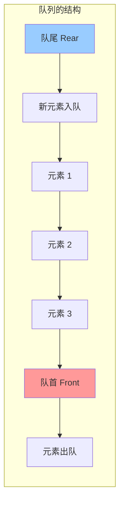
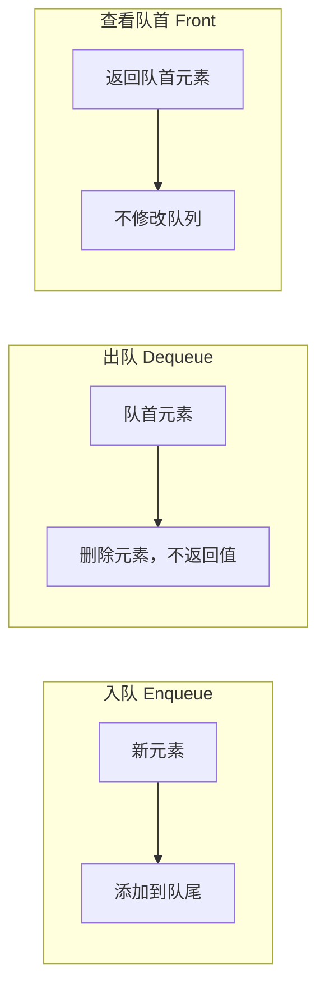
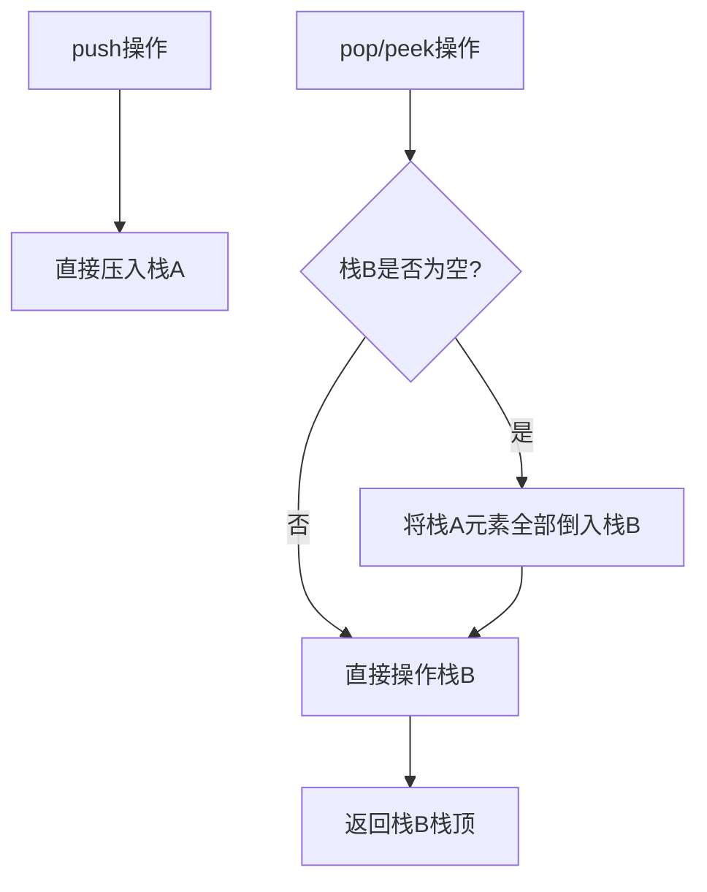
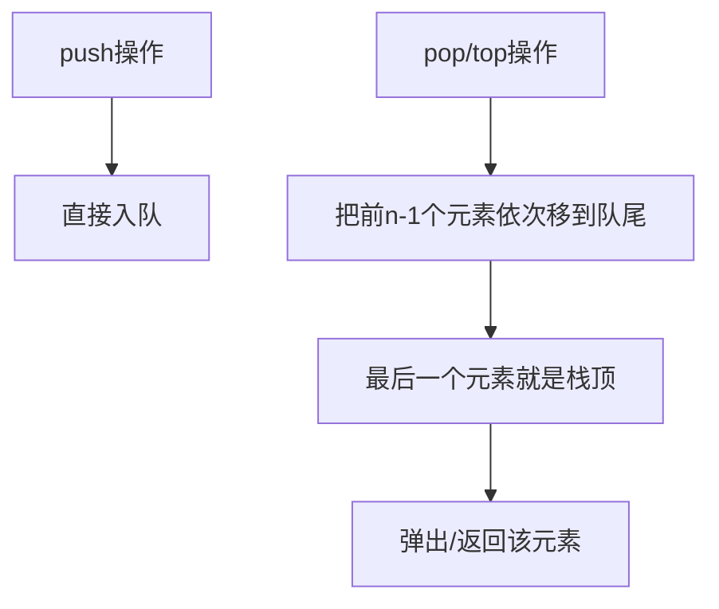
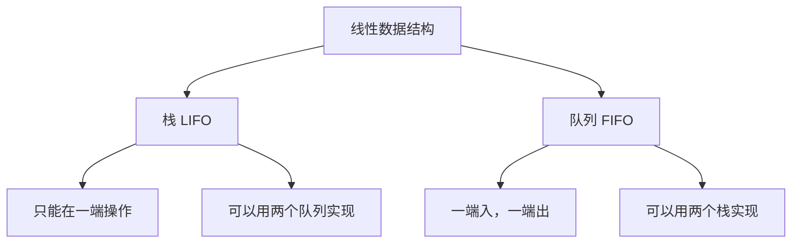

# Day 16：队列入门与Lambda进阶

> **学习定位**：承接 Day 15 的栈和 Lambda，本日进入 FIFO、均摊复杂度、初始化捕获与泛型 Lambda。C++14 特性会明确标注，统一用 C++17 环境编译。

## 📅 学习目标

- [ ] 理解队列数据结构的先进先出(FIFO)原理
- [ ] 掌握队列的基本操作：入队、出队、查看队首
- [ ] 学会使用C++ STL的queue容器
- [ ] 掌握Lambda的高级用法：泛型Lambda、初始化捕获
- [ ] 学习EMC++ Item 32-33
- [ ] 完成LeetCode 232、225

---

## 📖 知识点一：队列数据结构

### 概念定义

**队列(Queue)** 是一种**先进先出**(FIFO, First In First Out)的线性数据结构。它只允许在一端（队尾）插入，在另一端（队首）删除。

### 专业介绍

队列是一种抽象数据类型(ADT)，其核心特性体现在以下方面：

**操作约束**：队列允许在表尾（rear）插入元素，在表头（front）删除元素。这种双端操作限制保证了元素的处理顺序与到达顺序一致。队头指针和队尾指针分别指向第一个和最后一个元素位置。

**实现方式**：队列可以用数组（循环队列）或链表实现。循环队列通过取模运算解决"假溢出"问题，空间利用率高；链式队列动态分配内存，容量灵活但需要指针开销。双端队列(deque)允许两端都进行插入删除。

**应用场景**：队列的FIFO特性使其成为处理"先来先服务"场景的理想选择。操作系统使用队列管理进程调度，网络路由器使用队列缓冲数据包，消息队列实现异步通信和解耦。



### 形象化比喻

想象排队买票的场景：

```
[票窗口] ← [小明] ← [小红] ← [小刚] ← [小华]
  ↑                              ↑
 队首                          队尾
(最先到的人先买票)          (最后到的人排在最后)
```

**生活中的例子**：
- **排队买票**：先来的先买
- **打印机任务**：先提交的任务先打印
- **客服热线**：按顺序接听
- **消息队列**：先发送的消息先处理

### 队列的基本操作



### 时间复杂度

| 操作 | 时间复杂度 | 说明 |
|------|-----------|------|
| push(x) / enqueue | O(1) | 入队 |
| pop() / dequeue | O(1) | 出队 |
| front() | O(1) | 查看队首 |
| back() | O(1) | 查看队尾 |
| empty() | O(1) | 判空 |
| size() | O(1) | 获取大小 |

和 `std::stack` 一样，`std::queue::pop()` **只删除、不返回元素**。需要取出队首时应先确认队列非空，再读取 `front()`，最后 `pop()`。对空队列调用 `front()`、`back()` 或 `pop()` 不满足接口前置条件；标准库不会替你返回 `0` 或空字符串。`std::queue` 也是容器适配器，只公开 FIFO 所需接口，不提供随机访问和迭代器。

<a id="day16-queue-adaptor"></a>

### 容器适配器与底层容器契约

`std::queue<T, Container>` 把队首操作映射到 `front/pop_front`，把队尾操作映射到 `back/push_back`。底层容器因此必须提供这四类操作；默认 `std::deque` 满足要求，`std::list` 也可用，而 `std::vector` 没有 `pop_front()`，不能直接作为 `std::queue` 的底层容器。

选择底层容器不改变 FIFO 语义，但会影响节点开销、局部性、分配行为和元素引用的失效规则。本日算法只依赖适配器的受限接口，因此测试不应偷看底层容器；若业务需要两端操作或迭代，应直接使用 `std::deque`，而不是想办法绕过 `std::queue` 的接口。

### C++ STL queue 使用

```cpp
#include <queue>
#include <iostream>

void queueDemo() {
    std::queue<int> q;
    
    // 入队
    q.push(1);
    q.push(2);
    q.push(3);
    
    // 查看队首和队尾
    std::cout << "队首: " << q.front() << std::endl;  // 1
    std::cout << "队尾: " << q.back() << std::endl;    // 3
    
    // 出队
    q.pop();  // 移除队首元素 1
    
    // 大小
    std::cout << "大小: " << q.size() << std::endl;  // 2
    
    // 遍历并清空
    while (!q.empty()) {
        std::cout << q.front() << " ";  // 2 3
        q.pop();
    }
}
```

---

## 📖 知识点二：Lambda进阶

Day 15 已系统说明闭包类型、捕获时机、`this` 与悬空边界，请先回看 [Lambda 捕获与生命周期边界](../day_15/README.md#day15-lambda-lifetime)。本日只新增两件事：用初始化捕获构造闭包成员，以及用泛型 Lambda 的模板调用运算符接受多种类型。

### 泛型Lambda（C++14）

C++14允许Lambda参数使用`auto`，实现泛型Lambda：

```cpp
// 泛型Lambda：可以接受任意类型
auto add = [](auto a, auto b) {
    return a + b;
};

add(1, 2);        // int + int
add(1.5, 2.5);    // double + double
add(std::string("Hello"), std::string(" World"));  // string + string
```

编译器会为泛型 Lambda 生成带模板调用运算符的闭包类型。这里两个 `auto` 分别推导，所以 `add(1, 2.5)` 也是允许尝试实例化的；能否调用最终取决于函数体中的 `a + b` 对这组类型是否合法。C++14/17 中，错误通常在实例化时暴露；C++20 才可以用 `requires` 更直接地写出约束。本日先掌握调用模型，模板约束会在后续模板课程深化。

### 初始化捕获（C++14）

C++14允许在捕获列表中初始化新变量：

```cpp
auto ptr = std::make_unique<int>(42);

// C++14: 移动捕获
auto f = [p = std::move(ptr)]() {
    std::cout << *p << std::endl;
};

// 也可以创建新变量
int base = 10;
auto g = [x = base, y = base + 5]() {
    return x + y;  // 15
};
```

初始化捕获不是“先捕获再赋值”，而是在**创建闭包对象时**用右侧表达式初始化闭包中的新成员。左侧名字只在 Lambda 体内代表这个成员；右侧表达式在外层作用域求值。因此不能指望同一捕获列表里刚声明的 `x` 给后面的捕获初始化。若右侧使用 `std::move(ptr)`，资源所有权进入闭包，原对象仍然有效但处于移动后状态，不应假定除类型承诺之外的具体值。

### EMC++ Item 32：使用初始化捕获将对象移入闭包

**问题**：C++11只能拷贝捕获，无法移动捕获。

**C++11变通方案**：

```cpp
std::vector<int> data = {1, 2, 3, 4, 5};

// C++11: 使用std::bind模拟移动捕获
auto f = std::bind(
    [](const std::vector<int>& data) {
        // 使用data
    },
    std::move(data)  // 移动给bind对象
);
```

**C++14方案**：

```cpp
std::vector<int> data = {1, 2, 3, 4, 5};

auto f = [data = std::move(data)]() {
    // data已被移动到闭包中
};
```

这解决的是**所有权**问题：闭包直接拥有资源，不再依赖外部局部变量的生命周期。还要注意，Lambda 的 `operator()` 默认是 `const`，可以读取捕获成员，但若要再次把该成员移动出去，通常要写 `() mutable`。初始化捕获也可用于改名、预计算或只捕获对象的某个成员快照，不只服务于 `unique_ptr`。

捕获 `unique_ptr` 使闭包成为 move-only，这在使用 `auto` 保存或传入接受具体可调用类型的模板时没有问题，但 C++17 的 `std::function` 不能存储这种目标。若闭包会被调用多次，还必须明确“第一次调用是否会把资源再移走”；能编译不等于多次调用后仍有同一业务语义。

### EMC++ Item 33：对auto&&参数使用decltype来std::forward

**泛型Lambda中的完美转发**：

```cpp
// C++14: 泛型Lambda中完美转发
auto f = [](auto&& x) {
    doSomething(std::forward<decltype(x)>(x));
};

f(42);           // x是int&&，转发为右值
int y = 10;
f(y);            // x是int&，转发为左值
```

这里有三步推理：

1. `auto&&` 发生类型推导，因此是转发引用：左值实参让 `decltype(x)` 成为 `T&`，右值实参让它成为 `T&&`。
2. 进入函数体后，`x` 有名字，所以表达式 `x` 本身永远是左值；直接写 `doSomething(x)` 会丢掉右值属性。
3. `std::forward<decltype(x)>(x)` 根据推导结果有条件地恢复原值类别。这里要用 `decltype(x)`，不要手写一个猜测出来的类型。

多参数包装器对每个参数分别写 `std::forward<decltype(args)>(args)...`。Day 16 只建立第一次正确认识；[Day 22](../../week_04/day_22/README.md) 区分值类别与右值引用，[Day 23](../../week_04/day_23/README.md) 讲移动特殊成员与所有权，[Day 24](../../week_04/day_24/README.md) 系统推导转发引用和引用折叠，[Day 25](../../week_04/day_25/README.md) 再把完美转发放回模板接口中。

---

## 🎯 LeetCode 刷题

### 讲解题：LC 232. 用栈实现队列

#### 题目链接

[LeetCode 232](https://leetcode.cn/problems/implement-queue-using-stacks/)

#### 题目描述

请你仅使用两个栈实现一个队列，并支持队列的四种操作：push、pop、peek、empty。

#### 形象化理解

用两个盒子（栈）来模拟排队：

```
栈A（入队栈）    栈B（出队栈）
  [  ]            [  ]
  [  ]            [  ]
  [3]             [1]
  [2]             [2]
  [1]             [3]
  
入队时：往栈A压入元素
出队时：如果栈B为空，把栈A的元素全部倒入栈B，然后弹出栈B顶
```

这就是**"倒水杯"**的方法：把一个杯子里的水倒入另一个杯子，顺序就颠倒了！

#### 解题思路



#### 代码实现

```cpp
class MyQueue {
private:
    std::stack<int> inStack;   // 入队栈
    std::stack<int> outStack;  // 出队栈
    
    void transfer() {
        while (!inStack.empty()) {
            outStack.push(inStack.top());
            inStack.pop();
        }
    }
    
public:
    void push(int x) {
        inStack.push(x);
    }
    
    int pop() {
        if (outStack.empty()) {
            transfer();
        }
        if (outStack.empty()) {
            throw std::underflow_error("不能从空队列弹出元素");
        }
        int val = outStack.top();
        outStack.pop();
        return val;
    }
    
    int peek() {
        if (outStack.empty()) {
            transfer();
        }
        if (outStack.empty()) {
            throw std::underflow_error("空队列没有队首元素");
        }
        return outStack.top();
    }
    
    bool empty() const noexcept {
        return inStack.empty() && outStack.empty();
    }
};
```

#### 复杂度分析

- **push**: O(1)
- **pop/peek**: 单次最坏 O(n)，均摊 O(1)
- **empty**: O(1)

为什么不是简单地说每次都是 O(1)？当 `outStack` 为空时，一次 `pop()` 可能把 `inStack` 的 n 个元素全部转移，确实要 O(n)。但从一串操作整体看，每个元素只会：进入 `inStack` 一次、从 `inStack` 弹出并压入 `outStack` 一次、最后从 `outStack` 弹出一次。它不会来回转移。因此 n 个元素对应的总栈操作数仍是 O(n)，平均到每次队列操作就是均摊 O(1)。均摊分析不是“某次操作很快”，而是“昂贵操作不会对同一元素反复发生”。

**状态不变量**：`outStack` 非空时，它的栈顶始终是当前队首；`outStack` 为空时，`inStack` 的栈底是当前队首。只有在前者为空时才能整体转移，否则会让后入队的新元素跑到老元素前面。题目保证 `pop/peek` 调用时队列非空；脱离题目写工程接口时，应自行检查并选择异常、`optional` 或显式前置条件。

---

### 实战题：LC 225. 用队列实现栈

#### 题目链接

[LeetCode 225](https://leetcode.cn/problems/implement-stack-using-queues/)

#### 提示

1. 用一个队列即可实现栈
2. 出栈时，将前n-1个元素依次移到队尾
3. 最后一个元素就是"栈顶"
4. 或者使用两个队列交替存储

#### 题目描述

请你仅使用两个队列实现一个栈，并支持栈的四种操作：push、pop、top、empty。

#### 形象化理解

用一个队列实现栈的技巧：

```
原队列: [1, 2, 3, 4, 5]
要弹出"栈顶"(实际是队尾)的5

方法：把前面的元素重新排到后面
[1, 2, 3, 4, 5] 
→ [2, 3, 4, 5, 1]
→ [3, 4, 5, 1, 2]
→ [4, 5, 1, 2, 3]
→ [5, 1, 2, 3, 4]
现在队首就是原来的"栈顶"，可以弹出了！
```

这就像**"循环队列"**：不断把队首移到队尾，直到目标元素到达队首。

#### 解题思路



#### 代码实现（单队列方案）

```cpp
class MyStack {
private:
    std::queue<int> q;
    
public:
    void push(int x) {
        q.push(x);
    }
    
    int pop() {
        if (q.empty()) {
            throw std::underflow_error("不能从空栈弹出元素");
        }
        const std::size_t rotations = q.size() - 1;
        // 把栈顶之前的元素移到队尾
        for (std::size_t i = 0; i < rotations; ++i) {
            q.push(q.front());
            q.pop();
        }
        int val = q.front();
        q.pop();
        return val;
    }
    
    int top() {
        int val = pop();
        q.push(val);  // 放回去
        return val;
    }
    
    bool empty() const noexcept {
        return q.empty();
    }
};
```

#### 复杂度分析

- **push**: O(1)
- **pop/top**: O(n)
- **empty**: O(1)

`top()` 的语义是查看而不删除，所以单队列实现先做一次与 `pop()` 相同的轮转，再把取出的值放回队尾。应检查“连续调用两次 `top()` 结果是否相同”，否则很容易写成一次隐藏的删除。与 LC 232 一样，题目保证 `pop/top` 时栈非空，普通工程代码必须明确空结构行为。

---

## 🚀 运行代码

```bash
# 编译并运行当天所有代码
./build_and_run.sh

# 或者手动编译
cmake -S . -B build -DCMAKE_BUILD_TYPE=Release
cmake --build build
ctest --test-dir build --output-on-failure
```

### 今日工程动作：验证队列接口与均摊账本

在 Day 16 目录执行 `./build_and_run.sh /tmp/week3-day16-action`，确认 CTest 同时覆盖正常 FIFO 序列和空队列 `pop/peek` 的 `std::underflow_error` 契约。再为双栈队列写出“每个元素一生经历哪些栈操作”的账本，并构造“连续入队 n 次后第一次出队”的最坏用例，区分单次复杂度与均摊复杂度；随后给泛型 Lambda 写两个重载目标函数，分别接收 `int&` 和 `int&&`，删掉 `std::forward` 观察两个调用都落到左值重载，再恢复转发并用测试输出证明值类别得到保留。

### 五句复盘

1. **核心问题**：FIFO 如何由受限接口表示，闭包又如何拥有资源并保持调用者的值类别？
2. **旧误解**：`queue::pop()` 不返回元素；均摊 O(1) 不等于每次 O(1)；有名字的 `auto&& x` 在函数体中仍是左值表达式。
3. **规则前提**：访问队首前必须非空；移动捕获后只依赖移动后状态保证；完美转发必须处于类型推导语境。
4. **测试/反例证据**：首次批量转移、交替入队出队、连续两次 `top()`、左值/右值重载共同验证实现。
5. **与前后课连接**：Day 15 的栈和捕获生命周期支撑本日；Day 17 将把栈升级为维护候选关系的单调栈，Day 23–25 再深化值类别与转发。

---

## 📚 相关术语

| 术语 | 英文 | 定义 |
|------|------|------|
| 队列 | Queue | 先进先出的数据结构 |
| FIFO | First In First Out | 先进先出 |
| 入队 | Enqueue | 将元素添加到队尾 |
| 出队 | Dequeue | 移除队首元素 |
| 双端队列 | Deque | 两端都可入队出队 |
| 泛型Lambda | Generic Lambda | 参数使用auto的Lambda |
| 初始化捕获 | Init Capture | 在捕获列表中初始化变量 |

---

## 💡 学习提示

### 队列的使用场景

1. **BFS广度优先搜索**：按层次遍历
2. **任务调度**：先来先服务
3. **消息队列**：异步处理
4. **缓冲区**：数据传输
5. **打印队列**：打印任务管理

### 栈和队列的关系



---

## 🔗 参考资料

1. [Hello-Algo - 队列](https://www.hello-algo.com/chapter_stack_and_queue/queue/)
2. [cppreference - queue](https://en.cppreference.com/w/cpp/container/queue)
3. [cppreference - Lambda expressions](https://en.cppreference.com/w/cpp/language/lambda)
4. [cppreference - std::forward](https://en.cppreference.com/w/cpp/utility/forward)
5. [Effective Modern C++ - Item 32-33](https://www.aristeia.com/EMC++.html)
6. 《C++ Primer》第 5 版：Lambda 表达式与可调用对象
