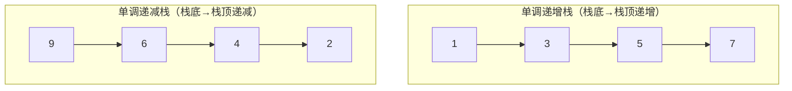
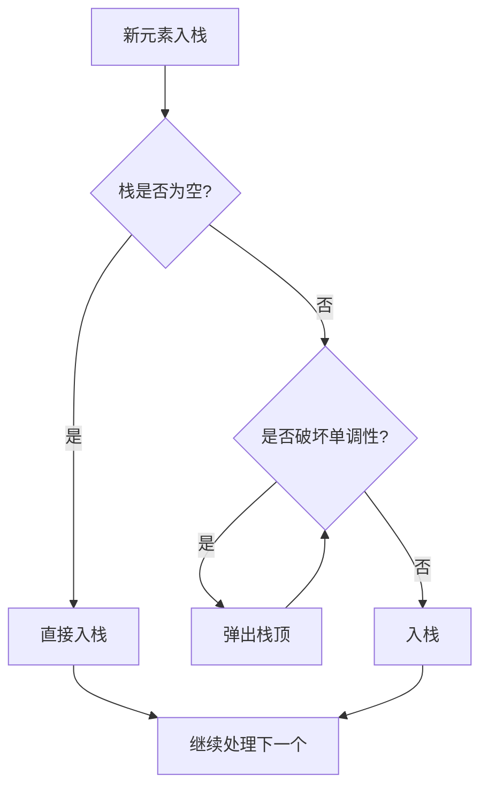
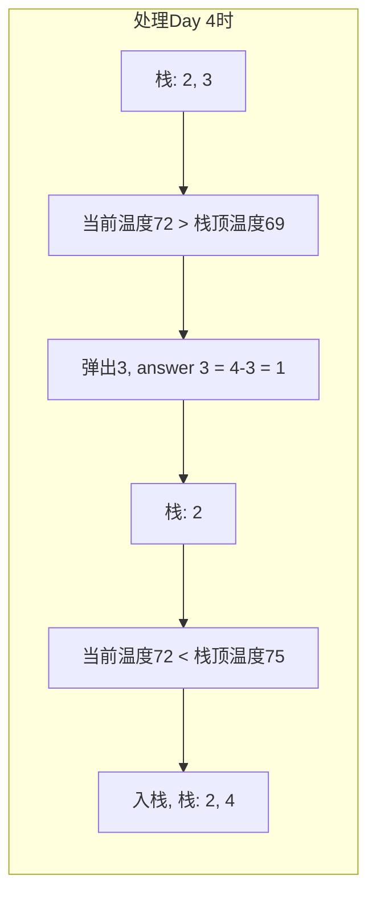

# Day 17：单调栈与function/bind

## 📅 学习目标

- [ ] 理解单调栈的原理和应用场景
- [ ] 掌握单调递增栈和单调递减栈
- [ ] 学会使用std::function存储可调用对象
- [ ] 理解std::bind的用法
- [ ] 学习EMC++ Item 34：优先使用Lambda而非std::bind
- [ ] 完成LeetCode 739、496

---

## 📖 知识点一：单调栈算法

### 概念定义

**单调栈(Monotonic Stack)** 是一种特殊的栈，其内部元素始终保持单调递增或单调递减的顺序。当新元素入栈时，会先弹出所有破坏单调性的元素。



### 形象化理解

想象你在排队看风景，每个人都想看前面的风景：

```
场景：一排人站在一起，问每个人"右边第一个比你高的人是谁？"

[身高]  1    3    5    2    4    6
[位置]  0    1    2    3    4    5

人1(身高3)：右边第一个比我高的是人2(身高5)
人2(身高5)：右边没有比我高的
人3(身高2)：右边第一个比我高的是人4(身高4)

单调栈的思路：维护一个"候选人的队列"
- 新人来时，把所有比他矮的人都"解决掉"（找到了答案）
- 剩下的都是比他高的，他就是下一个要被解决的人
```

### 单调栈模板

```cpp
// 单调栈通用模板
vector<int> monoStack(vector<int>& nums) {
    int n = nums.size();
    vector<int> result(n, -1);  // 存储结果
    stack<int> stk;  // 存储下标
    
    for (int i = 0; i < n; ++i) {
        // 当栈不为空且当前元素满足条件
        while (!stk.empty() && nums[stk.top()] < nums[i]) {
            // 弹出栈顶，记录结果
            result[stk.top()] = i;  // 或 nums[i]
            stk.pop();
        }
        stk.push(i);
    }
    
    return result;
}
```

### 单调递增栈 vs 单调递减栈

| 类型 | 栈内元素顺序 | 适用场景 |
|------|-------------|---------|
| 单调递增栈 | 栈底→栈顶递增 | 找下一个更大元素 |
| 单调递减栈 | 栈底→栈顶递减 | 找下一个更小元素 |



---

## 📖 知识点二：std::function与std::bind

### std::function

`std::function` 是一个通用的函数包装器，可以存储、复制和调用任何可调用对象：

```cpp
#include <functional>

// 存储函数指针
std::function<int(int, int)> add = [](int a, int b) { return a + b; };

// 存储函数对象
struct Multiplier {
    int operator()(int a, int b) { return a * b; }
};
std::function<int(int, int)> mult = Multiplier{};

// 存储成员函数指针
struct Calculator {
    int subtract(int a, int b) { return a - b; }
};
Calculator calc;
std::function<int(int, int)> sub = std::bind(&Calculator::subtract, &calc, _1, _2);
```

### std::bind

`std::bind` 可以绑定函数和参数，创建新的可调用对象：

```cpp
#include <functional>
using namespace std::placeholders;

int add(int a, int b, int c) {
    return a + b + c;
}

// 绑定部分参数
auto add5 = std::bind(add, 5, _1, _2);  // a固定为5
std::cout << add5(3, 4) << std::endl;   // 5 + 3 + 4 = 12

// 绑定所有参数
auto addAll = std::bind(add, 1, 2, 3);
std::cout << addAll() << std::endl;     // 6
```

### EMC++ Item 34：优先使用Lambda而非std::bind

**Lambda的优势**：

```cpp
// ❌ std::bind：可读性差
auto setAlarm = std::bind(setSound, std::chrono::hours(1), _1, 60);

// ✅ Lambda：清晰明了
auto setAlarm = [](Sound s) {
    setSound(std::chrono::hours(1), s, 60);
};
```

**比较**：

| 特性 | Lambda | std::bind |
|------|--------|-----------|
| 可读性 | 好 | 差 |
| 性能 | 更好 | 一般 |
| 表达能力 | 更强 | 有限 |
| C++14泛型 | 支持 | 不支持 |
| 移动捕获 | 支持 | 需要特殊处理 |

---

## 🎯 LeetCode 刷题

### 讲解题：LC 739. 每日温度

#### 题目链接

[LeetCode 739](https://leetcode.cn/problems/daily-temperatures/)

#### 题目描述

给定一个整数数组 `temperatures`，表示每天的温度，返回一个数组 `answer`，其中 `answer[i]` 是指对于第 `i` 天，下一个更高温度出现在几天后。

#### 形象化理解

想象你在看天气预报，想知道"下一个比今天更热的是哪一天？"

```
温度: [73, 74, 75, 71, 69, 72, 76, 73]
日期:   0   1   2   3   4   5   6   7

Day 0 (73°F): 下一个更热是Day 1 (74°F), 等待1天
Day 1 (74°F): 下一个更热是Day 2 (75°F), 等待1天
Day 2 (75°F): 下一个更热是Day 6 (76°F), 等待4天
...
```

#### 解题思路

使用**单调递减栈**：栈中存储温度递减的天数索引



#### 代码实现

```cpp
vector<int> dailyTemperatures(vector<int>& temperatures) {
    int n = temperatures.size();
    vector<int> answer(n, 0);
    stack<int> stk;  // 存储下标
    
    for (int i = 0; i < n; ++i) {
        // 当前温度比栈顶温度高
        while (!stk.empty() && temperatures[i] > temperatures[stk.top()]) {
            int prev = stk.top();
            stk.pop();
            answer[prev] = i - prev;  // 计算天数差
        }
        stk.push(i);
    }
    
    return answer;
}
```

#### 复杂度分析

- **时间复杂度**：O(n)，每个元素最多入栈出栈各一次
- **空间复杂度**：O(n)，栈的最大大小

---

### 实战题：LC 496. 下一个更大元素 I

#### 题目链接

[LeetCode 496](https://leetcode.cn/problems/next-greater-element-i/)

#### 提示

1. 先用单调栈求出nums2中所有元素的下一个更大元素
2. 用哈希表存储映射关系
3. 遍历nums1查询结果

#### 题目描述

给你两个没有重复元素的数组 `nums1` 和 `nums2`，其中 `nums1` 是 `nums2` 的子集。请你找出 `nums1` 中每个元素在 `nums2` 中的下一个更大元素。

#### 形象化理解

```
nums2 = [1, 3, 4, 2]
nums1 = [4, 1, 2]

对于nums1中的4：在nums2中，4后面没有比它大的 → -1
对于nums1中的1：在nums2中，1后面有3比它大 → 3
对于nums1中的2：在nums2中，2后面没有比它大的 → -1

结果：[-1, 3, -1]
```

#### 解题思路

1. 先用单调栈求出nums2中所有元素的下一个更大元素
2. 用哈希表存储映射关系
3. 查询nums1中每个元素的结果

#### 代码实现

```cpp
vector<int> nextGreaterElement(vector<int>& nums1, vector<int>& nums2) {
    // 先求nums2中每个元素的下一个更大元素
    unordered_map<int, int> nextGreater;
    stack<int> stk;
    
    for (int num : nums2) {
        while (!stk.empty() && num > stk.top()) {
            nextGreater[stk.top()] = num;
            stk.pop();
        }
        stk.push(num);
    }
    
    // 栈中剩余元素没有下一个更大元素
    while (!stk.empty()) {
        nextGreater[stk.top()] = -1;
        stk.pop();
    }
    
    // 查询nums1
    vector<int> result;
    for (int num : nums1) {
        result.push_back(nextGreater[num]);
    }
    
    return result;
}
```

---

## 🚀 运行代码

```bash
./build_and_run.sh
```

---

## 💡 学习提示

### 单调栈的识别

当你看到以下问题时，考虑使用单调栈：
1. 找下一个更大/更小元素
2. 找左边/右边第一个满足条件的元素
3. 需要维护一个"候选集"

### 时间复杂度优化

单调栈将O(n²)的问题优化到O(n)：
- 暴力解法：对每个元素，向后遍历找答案
- 单调栈：每个元素最多入栈出栈各一次

---

## 📚 相关术语

| 术语 | 英文 | 定义 |
|------|------|------|
| 单调栈 | Monotonic Stack | 元素保持单调性的栈 |
| 单调递增栈 | Increasing Stack | 栈底到栈顶递增 |
| 单调递减栈 | Decreasing Stack | 栈底到栈顶递减 |
| std::function | Function Wrapper | 通用函数包装器 |
| std::bind | Bind | 函数参数绑定器 |
| 闭包 | Closure | Lambda及其捕获的环境 |

---

## 🔗 参考资料

1. [Hello-Algo - 栈](https://www.hello-algo.com/chapter_stack_and_queue/stack/)
2. [cppreference - function](https://en.cppreference.com/w/cpp/utility/functional/function)
3. [cppreference - bind](https://en.cppreference.com/w/cpp/utility/functional/bind)
4. [Effective Modern C++ - Item 34](https://www.aristeia.com/EMC++.html)
