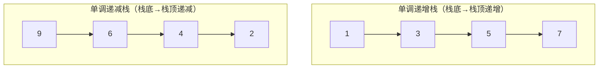
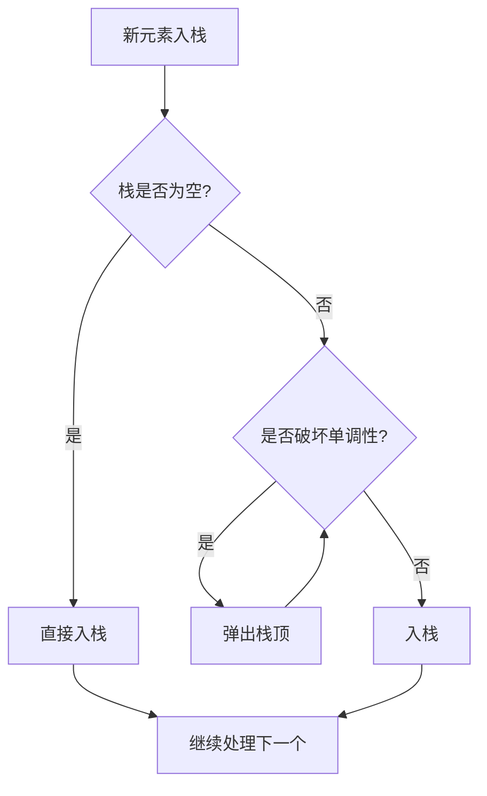
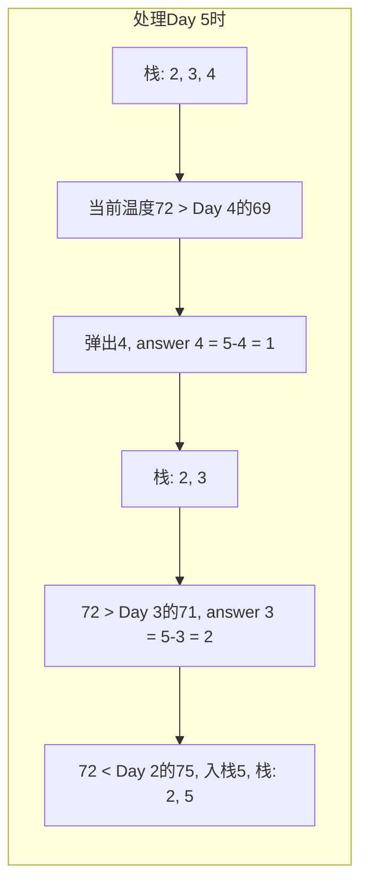

# Day 17：单调栈与function/bind

> **学习定位**：普通栈只约束进出顺序，单调栈还维护元素关系。本日重点是写清“栈内顺序、存值还是下标、何时弹栈”；`std::function`/`bind` 用于比较不同可调用对象的封装方式。

## 📅 学习目标

- [ ] 理解单调栈的原理和应用场景
- [ ] 掌握单调递增栈和单调递减栈
- [ ] 学会使用std::function存储可调用对象
- [ ] 理解std::bind的用法
- [ ] 学习EMC++ Item 34：优先使用Lambda而非std::bind
- [ ] 完成LeetCode 739、496

---

## 📖 知识点一：单调栈算法

### 概念定义

**单调栈(Monotonic Stack)** 是一种用普通栈维护“尚未得到答案的候选项”的算法技巧。候选项对应的值按栈底到栈顶保持单调；新元素到来时，反复弹出那些已经能由当前元素确定答案的候选项，再把当前项压栈。

“单调递增栈/单调递减栈”在不同资料里可能按**值的顺序**命名，也可能按**要找的答案**命名，容易背反。写代码前不要只说名称，固定回答四个问题：

1. 栈里存值还是下标？需要距离或回填数组位置时通常存下标。
2. 从栈底到栈顶，对应值是递增、递减，还是允许相等？
3. 当前值满足什么严格/非严格条件时弹栈？
4. 被弹出的元素为何已经得到最终答案，之后不必再入栈？


```mermaid
graph TB
    subgraph "单调递增栈（栈底→栈顶递增）"
    A[1] --> B[3]
    B --> C[5]
    C --> D[7]
    end
    
    subgraph "单调递减栈（栈底→栈顶递减）"
    E[9] --> F[6]
    F --> G[4]
    G --> H[2]
    end
```

### 形象化理解

想象你在排队看风景，每个人都想看前面的风景：

```
场景：一排人站在一起，问每个人"右边第一个比你高的人是谁？"

[身高]  1    3    5    2    4    6
[位置]  0    1    2    3    4    5

人1(身高3)：右边第一个比我高的是人2(身高5)
人2(身高5)：右边第一个比我高的是人5(身高6)
人3(身高2)：右边第一个比我高的是人4(身高4)

单调栈的思路：维护一个"尚未找到答案的候选栈"
- 新人来时，把所有比他矮的人都"解决掉"（找到了答案）
- 剩下的都是比他高的，他就是下一个要被解决的人
```

<a id="day17-monotonic-stack-template"></a>

### 单调栈模板

```cpp
// 单调栈通用模板
vector<int> monoStack(vector<int>& nums) {
    int n = nums.size();
    vector<int> result(n, -1);  // 存储结果
    stack<int> stk;  // 存储下标
    
    for (int i = 0; i < n; ++i) {
        // 当栈不为空且当前元素满足条件
        while (!stk.empty() && nums[stk.top()] < nums[i]) {
            // 弹出栈顶，记录结果
            result[stk.top()] = i;  // 或 nums[i]
            stk.pop();
        }
        stk.push(i);
    }
    
    return result;
}
```

### 从左到右寻找右侧第一个元素时的栈内顺序

| 目标 | 栈存储内容 | 栈底→栈顶对应值 | 弹栈条件 |
|------|-----------|------------------|---------|
| 下一个严格更大 | 尚未找到答案的下标 | 非递增 | `current > value[top]` |
| 下一个严格更小 | 尚未找到答案的下标 | 非递减 | `current < value[top]` |

以“下一个严格更大”为例，较小值遇到当前更大值时被解决并弹出；没被弹出的候选值必然大于等于当前值，所以压入当前下标后，从栈底到栈顶仍是非递增。等号是否弹出取决于题意中的“严格更大”还是“大于等于”，不能机械照抄模板。


```mermaid
flowchart TD
    A[新元素入栈] --> B{栈是否为空?}
    B -->|是| C[直接入栈]
    B -->|否| D{是否破坏单调性?}
    D -->|是| E[弹出栈顶]
    E --> D
    D -->|否| F[入栈]
    C --> G[继续处理下一个]
    F --> G
```

---

## 📖 知识点二：std::function与std::bind

### std::function

`std::function` 是一个通用的函数包装器，可以存储、复制并调用与目标签名兼容的可调用对象：

```cpp
#include <functional>
using namespace std::placeholders;

// 存储函数指针
std::function<int(int, int)> add = [](int a, int b) { return a + b; };

// 存储函数对象
struct Multiplier {
    int operator()(int a, int b) { return a * b; }
};
std::function<int(int, int)> mult = Multiplier{};

// 存储成员函数指针
struct Calculator {
    int subtract(int a, int b) { return a - b; }
};
Calculator calc;
std::function<int(int, int)> sub = std::bind(&Calculator::subtract, &calc, _1, _2);
```

`std::function<R(Args...)>` 通过**类型擦除**把不同具体类型统一成同一接口，前提是对象能用 `Args...` 调用，并且结果能用于 `R`。本课程采用 C++17，此时保存的目标还必须可复制构造；捕获了 `std::unique_ptr` 等资源而成为 move-only 的闭包不能直接放进 `std::function`。它适合回调成员、事件表等需要运行时统一存储的场景。代价是具体类型信息被隐藏，调用可能多一层间接访问，大对象还可能触发动态分配；空的 `std::function` 被调用会抛出 `std::bad_function_call`。若只在局部立即调用，优先保留 `auto` 推导出的具体闭包类型通常更简单。

### std::bind

`std::bind` 可以绑定函数和参数，创建新的可调用对象：

```cpp
#include <functional>
using namespace std::placeholders;

int add(int a, int b, int c) {
    return a + b + c;
}

// 绑定部分参数
auto add5 = std::bind(add, 5, _1, _2);  // a固定为5
std::cout << add5(3, 4) << std::endl;   // 5 + 3 + 4 = 12

// 绑定所有参数
auto addAll = std::bind(add, 1, 2, 3);
std::cout << addAll() << std::endl;     // 6
```

`std::bind` 默认把绑定参数按值衰减后保存在绑定对象中；若确实要保存引用，必须显式使用 `std::ref`/`std::cref`，并自行保证生命周期。占位符 `_1`、`_2` 描述的是“调用绑定对象时传入的第几个参数”，不是原函数的参数编号。遇到重载函数时还常需要显式转换函数指针类型，这些隐藏规则正是 Item 34 偏向 Lambda 的原因。

### EMC++ Item 34：优先使用Lambda而非std::bind

Item 34 的“优先”不是“`std::bind` 已被禁用”，而是比较两种表达方式后，默认选择让调用关系更直接的一种：

```cpp
using namespace std::placeholders;

// ❌ std::bind：可读性差
auto bindAlarm = std::bind(setSound, std::chrono::hours(1), _1, 60);

// ✅ Lambda：清晰明了
auto lambdaAlarm = [](Sound s) {
    setSound(std::chrono::hours(1), s, 60);
};
```

**机制比较**：

| 特性 | Lambda | std::bind |
|------|--------|-----------|
| 参数关系 | 在函数体中按原顺序展示 | 由占位符和绑定规则间接表达 |
| 保存状态 | 捕获列表明确值、引用、移动 | 默认按值保存，引用需 `std::ref` |
| 类型转换/转发 | 可在调用点显式写出 | 容易隐藏在 `bind` 的调用规则中 |
| 泛化方式 | C++14 泛型 Lambda 可直接写逻辑 | 占位符可接受多种实参，但目标调用约束较隐蔽 |
| 优化 | 具体闭包类型便于编译器分析 | 同样是具体类型，但表达层次通常更绕；性能无绝对保证 |

Lambda 还更容易处理重载选择、`constexpr`、初始化捕获和完美转发。`std::bind` 仍有合理例外：维护既有 C++11 代码、适配旧接口，或一个非常短且团队已熟悉的参数重排。即使在这些场景，也要检查绑定参数是复制还是引用、移动对象在调用时以什么值类别传给目标。

---

## 🎯 LeetCode 刷题

### 讲解题：LC 739. 每日温度

#### 题目链接

[LeetCode 739](https://leetcode.cn/problems/daily-temperatures/)

#### 题目描述

给定一个整数数组 `temperatures`，表示每天的温度，返回一个数组 `answer`，其中 `answer[i]` 是指对于第 `i` 天，下一个更高温度出现在几天后。

#### 形象化理解

想象你在看天气预报，想知道"下一个比今天更热的是哪一天？"

```
温度: [73, 74, 75, 71, 69, 72, 76, 73]
日期:   0   1   2   3   4   5   6   7

Day 0 (73°F): 下一个更热是Day 1 (74°F), 等待1天
Day 1 (74°F): 下一个更热是Day 2 (75°F), 等待1天
Day 2 (75°F): 下一个更热是Day 6 (76°F), 等待4天
...
```

#### 解题思路

使用**单调递减栈**：栈中存储温度递减的天数索引


```mermaid
graph LR
    subgraph "处理Day 5时"
    A[栈: 2, 3, 4] --> B["当前温度72 > Day 4的69"]
    B --> C["弹出4, answer 4 = 5-4 = 1"]
    C --> D[栈: 2, 3]
    D --> E["72 > Day 3的71, answer 3 = 5-3 = 2"]
    E --> F["72 < Day 2的75, 入栈5, 栈: 2, 5"]
    end
```

#### 代码实现

```cpp
vector<int> dailyTemperatures(vector<int>& temperatures) {
    int n = temperatures.size();
    vector<int> answer(n, 0);
    stack<int> stk;  // 存储下标
    
    for (int i = 0; i < n; ++i) {
        // 当前温度比栈顶温度高
        while (!stk.empty() && temperatures[i] > temperatures[stk.top()]) {
            int prev = stk.top();
            stk.pop();
            answer[prev] = i - prev;  // 计算天数差
        }
        stk.push(i);
    }
    
    return answer;
}
```

#### 复杂度分析

- **时间复杂度**：O(n)，每个元素最多入栈出栈各一次
- **空间复杂度**：O(n)，栈的最大大小

**循环不变量**：处理下标 `i` 之前，栈保存 `[0, i)` 中仍未找到更高温度的下标；这些下标递增，对应温度从栈底到栈顶非递增。当前温度严格更高时，栈顶下标第一次遇到更高温度，因此 `i - prev` 就是最终答案。每个下标只入栈一次、至多弹出一次，所以嵌套的 `while` 总计仍是 O(n)。空数组、全递减和全相等数组用于证明“栈中剩余项保持 0”这一边界。

---

### 实战题：LC 496. 下一个更大元素 I

#### 题目链接

[LeetCode 496](https://leetcode.cn/problems/next-greater-element-i/)

#### 提示

1. 先用单调栈求出nums2中所有元素的下一个更大元素
2. 用哈希表存储映射关系
3. 遍历nums1查询结果

#### 题目描述

给你两个没有重复元素的数组 `nums1` 和 `nums2`，其中 `nums1` 是 `nums2` 的子集。请你找出 `nums1` 中每个元素在 `nums2` 中的下一个更大元素。

#### 形象化理解

```
nums2 = [1, 3, 4, 2]
nums1 = [4, 1, 2]

对于nums1中的4：在nums2中，4后面没有比它大的 → -1
对于nums1中的1：在nums2中，1后面有3比它大 → 3
对于nums1中的2：在nums2中，2后面没有比它大的 → -1

结果：[-1, 3, -1]
```

#### 解题思路

1. 先用单调栈求出nums2中所有元素的下一个更大元素
2. 用哈希表存储映射关系
3. 查询nums1中每个元素的结果

#### 代码实现

```cpp
vector<int> nextGreaterElement(vector<int>& nums1, vector<int>& nums2) {
    // 先求nums2中每个元素的下一个更大元素
    unordered_map<int, int> nextGreater;
    stack<int> stk;
    
    for (int num : nums2) {
        while (!stk.empty() && num > stk.top()) {
            nextGreater[stk.top()] = num;
            stk.pop();
        }
        stk.push(num);
    }
    
    // 栈中剩余元素没有下一个更大元素
    while (!stk.empty()) {
        nextGreater[stk.top()] = -1;
        stk.pop();
    }
    
    // 查询nums1
    vector<int> result;
    for (int num : nums1) {
        auto it = nextGreater.find(num);
        result.push_back(it == nextGreater.end() ? -1 : it->second);
    }
    
    return result;
}
```

LeetCode 保证 `nums1` 是 `nums2` 的子集，所以直接用 `nextGreater[num]` 在题目范围内能工作；工程代码更适合用 `find()`，避免缺失键时 `operator[]` 悄悄插入默认值 `0`，把输入错误伪装成合法答案。

---

## 🚀 运行代码

```bash
./build_and_run.sh
```

也可以显式运行测试：

```bash
cmake -S . -B build -DCMAKE_BUILD_TYPE=Release
cmake --build build
ctest --test-dir build --output-on-failure
```

### 今日工程动作：迁移单调栈不变量

在 Day 17 目录执行 `./build_and_run.sh /tmp/week3-day17-action` 保存基线结果，再任选“下一个更大/更小、左侧/右侧、严格/非严格”中的一种变体，用四句话写清存储内容、栈内顺序、弹栈条件和不变量后改模板并重跑同一命令。随后把一个 `std::bind` 示例改写成 Lambda，逐项标注绑定参数的复制/引用、调用参数的位置、隐式转换和对象生命周期；两版都跑测试，而不是只凭“看起来更短”判断。

### 五句复盘

1. **核心问题**：如何让栈只保留仍可能需要未来元素解决的候选项，并清楚表达可调用对象的状态与参数关系？
2. **旧误解**：找下一个更大时，本日从左到右实现的对应值是栈底到栈顶非递增；嵌套 `while` 也不自动意味着 O(n²)。
3. **规则前提**：先明确扫描方向和严格性；`std::function` 是类型擦除包装器；`bind` 的绑定参数默认按值保存。
4. **测试/反例证据**：空数组、递减数组、相等值、缺失哈希键，以及 `std::ref` 前后的行为可以揭示边界。
5. **与前后课连接**：Day 15–16 的普通栈提供操作模型，本日加入候选不变量；后续算法会把这一模式用于柱状图、区间边界等问题。

---

## 💡 学习提示

### 单调栈的识别

当你看到以下问题时，考虑使用单调栈：
1. 找下一个更大/更小元素
2. 找左边/右边第一个满足条件的元素
3. 需要维护一个"候选集"

### 时间复杂度优化

单调栈将O(n²)的问题优化到O(n)：
- 暴力解法：对每个元素，向后遍历找答案
- 单调栈：每个元素最多入栈出栈各一次

---

## 📚 相关术语

| 术语 | 英文 | 定义 |
|------|------|------|
| 单调栈 | Monotonic Stack | 元素保持单调性的栈 |
| 单调递增栈 | Increasing Stack | 栈底到栈顶递增 |
| 单调递减栈 | Decreasing Stack | 栈底到栈顶递减 |
| std::function | Function Wrapper | 通用函数包装器 |
| std::bind | Bind | 函数参数绑定器 |
| 闭包 | Closure | Lambda及其捕获的环境 |

---

## 🔗 参考资料

1. [Hello-Algo - 栈](https://www.hello-algo.com/chapter_stack_and_queue/stack/)
2. [cppreference - function](https://en.cppreference.com/w/cpp/utility/functional/function)
3. [cppreference - bind](https://en.cppreference.com/w/cpp/utility/functional/bind)
4. [Effective Modern C++ - Item 34](https://www.aristeia.com/EMC++.html)
