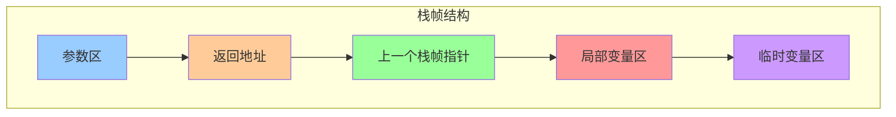
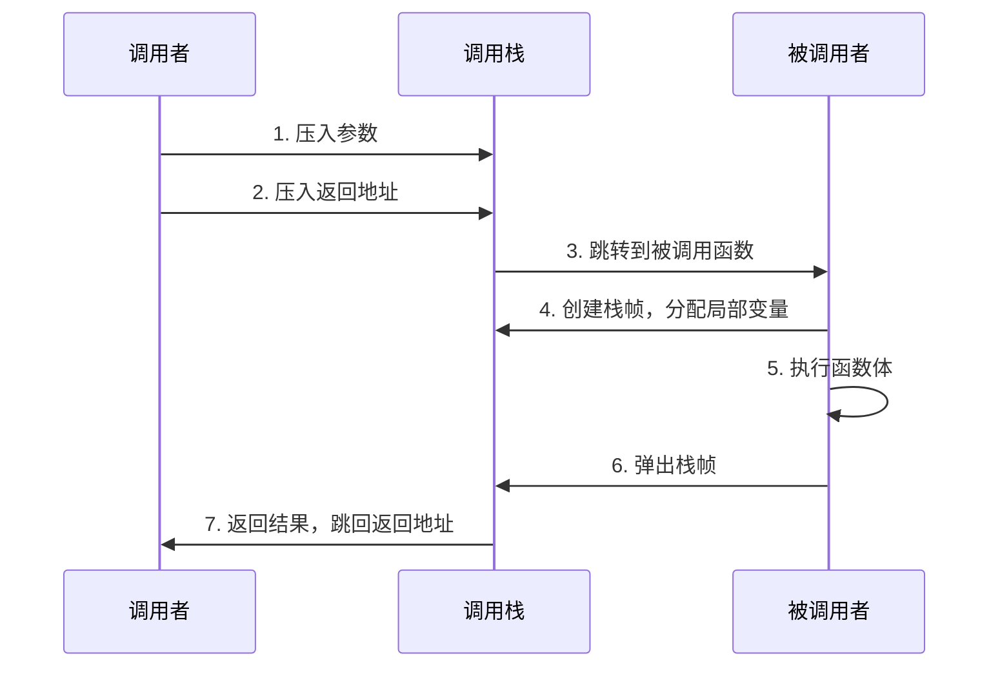
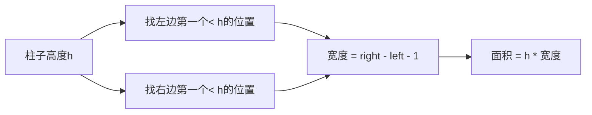

# Day 18：函数调用栈与enum class

## 📅 学习目标

- [ ] 理解函数调用栈的工作原理
- [ ] 了解栈帧结构和函数调用过程
- [ ] 掌握enum class的优势
- [ ] 学习EMC++ Item 10
- [ ] 完成LeetCode 84、42

---

## 📖 知识点一：函数调用栈

### 概念定义

**函数调用栈(Call Stack)** 是程序运行时用于管理函数调用的一种数据结构。每次函数调用都会在栈上创建一个**栈帧(Stack Frame)**，用于存储该函数的局部变量、参数、返回地址等信息。

### 专业介绍

函数调用栈是程序运行时的核心机制，其工作原理如下：

**栈帧结构**：每次函数调用创建一个栈帧，包含：函数参数、返回地址、保存的寄存器、局部变量等。栈帧按照调用顺序依次压入栈中，形成调用链。

**调用过程**：调用函数时，参数按特定顺序入栈，返回地址入栈，控制权转移到被调函数。被调函数创建栈帧，执行函数体。返回时，弹出栈帧，恢复调用者状态。

**栈溢出**：当递归深度过大或局部变量过多，超出栈空间限制时，会发生栈溢出(Stack Overflow)。这是常见的程序崩溃原因，需要合理控制递归深度和局部变量大小。

### 形象化理解

想象一个书桌上的文件夹堆叠：

```
文件夹堆（函数调用栈）
┌──────────────────┐
│  main()文件夹    │ ← 最底层，程序入口
├──────────────────┤
│  funcA()文件夹   │ ← main调用funcA
├──────────────────┤
│  funcB()文件夹   │ ← funcA调用funcB
├──────────────────┤
│  funcC()文件夹   │ ← funcB调用funcC（当前执行）
└──────────────────┘
```

每个"文件夹"（栈帧）里存放着：
- 局部变量
- 函数参数
- 返回地址（调完后回到哪里）
- 上一个栈帧的位置

### 栈帧结构



### 函数调用过程



### 递归与栈溢出

递归就是函数调用自己，每次调用都会创建新的栈帧：

```cpp
int factorial(int n) {
    if (n <= 1) return 1;
    return n * factorial(n - 1);  // 递归调用
}

// factorial(5) 的调用栈：
// factorial(5) → factorial(4) → factorial(3) → factorial(2) → factorial(1)
// 然后依次返回：1 → 2 → 6 → 24 → 120
```

**栈溢出**：递归太深，栈空间耗尽：
```cpp
void infiniteRecursion() {
    infiniteRecursion();  // 无限递归，最终Stack Overflow
}
```

---

## 📖 知识点二：enum class

### 传统enum的问题

```cpp
// 传统C enum
enum Color { RED, GREEN, BLUE };
enum Size { SMALL, MEDIUM, LARGE };

// 问题1：污染命名空间
int x = RED;  // OK，RED在全局作用域

// 问题2：隐式转换
if (RED == 0) { }  // OK，隐式转为int

// 问题3：类型不安全
Color c = RED;
Size s = SMALL;
if (c == s) { }  // 编译通过！但语义错误
```

### enum class的优势

```cpp
// C++11 强类型枚举
enum class Color { RED, GREEN, BLUE };
enum class Size { SMALL, MEDIUM, LARGE };

// 优势1：作用域限定
Color c = Color::RED;  // 必须使用 Color::RED
// int x = RED;  // 错误！RED不在全局作用域

// 优势2：不会隐式转换
// if (Color::RED == 0) { }  // 错误！不能比较

// 优势3：类型安全
Color c2 = Color::GREEN;
Size s2 = Size::SMALL;
// if (c2 == s2) { }  // 错误！不同类型不能比较
```

### EMC++ Item 10：优先使用enum class

**要点**：
1. 避免命名污染
2. 避免意外转换
3. 可以前置声明
4. 可以指定底层类型

```cpp
// 指定底层类型
enum class Color : uint8_t { RED, GREEN, BLUE };  // 1字节
enum class BigEnum : long long { VAL1, VAL2 };    // 8字节

// 前置声明
enum class Status;  // 可以前置声明
void process(Status s);

enum class Status { OK, ERROR, PENDING };
```

---

## 🎯 LeetCode 刷题

### 讲解题：LC 84. 柱状图中最大的矩形

#### 题目链接

[LeetCode 84](https://leetcode.cn/problems/largest-rectangle-in-histogram/)

#### 题目描述

给定 n 个非负整数，用来表示柱状图中各个柱子的高度。每个柱子彼此相邻，且宽度为 1。求在该柱状图中，能够勾勒出来的矩形的最大面积。

#### 形象化理解

想象一排不同高度的积木，找出能框出的最大矩形面积：

```
高度: [2, 1, 5, 6, 2, 3]

积木图:
    █
  █ █
  █ █
  █ █ █
█ █ █ █ █
█ █ █ █ █ █

最大矩形 = 5 * 2 = 10（第2和第3个柱子）
```

#### 解题思路：单调栈

对于每个柱子，找到左右两边第一个比它矮的柱子，计算面积：



**关键技巧**：使用单调递增栈，一次遍历同时找到左右边界。

#### 代码实现

```cpp
int largestRectangleArea(vector<int>& heights) {
    stack<int> stk;
    int maxArea = 0;
    
    // 在末尾添加一个高度为0的柱子，确保所有柱子都能被处理
    heights.push_back(0);
    
    for (int i = 0; i < heights.size(); ++i) {
        while (!stk.empty() && heights[i] < heights[stk.top()]) {
            int h = heights[stk.top()];
            stk.pop();
            int left = stk.empty() ? -1 : stk.top();
            int width = i - left - 1;
            maxArea = max(maxArea, h * width);
        }
        stk.push(i);
    }
    
    return maxArea;
}
```

---

### 实战题：LC 42. 接雨水

#### 题目链接

[LeetCode 42](https://leetcode.cn/problems/trapping-rain-water/)

#### 提示

1. 使用单调栈或双指针方法
2. 对于每个位置，找左右两边最高的柱子
3. 能接的雨水量 = min(左边最高, 右边最高) - 当前高度
4. 注意边界条件处理

#### 题目描述

给定 n 个非负整数表示每个宽度为 1 的柱子的高度图，计算按此排列的柱子，下雨之后能接多少雨水。

#### 形象化理解

想象一排柱子，下雨后能接多少水：

```
高度: [0,1,0,2,1,0,1,3,2,1,2,1]

柱子图（R=柱子，W=水）:
        R
    R W W R
  R W R W R R W R
R R W R W R W R W R
↑ 能接6单位水
```

#### 解题思路

**方法一：单调栈**
- 维护单调递减栈
- 当遇到更高的柱子时，可以接雨水

**方法二：双指针**
- 左右指针向中间移动
- 记录左右最大高度

#### 代码实现（单调栈）

```cpp
int trap(vector<int>& height) {
    stack<int> stk;
    int water = 0;
    
    for (int i = 0; i < height.size(); ++i) {
        while (!stk.empty() && height[i] > height[stk.top()]) {
            int mid = stk.top();
            stk.pop();
            if (stk.empty()) break;
            
            int left = stk.top();
            int h = min(height[left], height[i]) - height[mid];
            int w = i - left - 1;
            water += h * w;
        }
        stk.push(i);
    }
    
    return water;
}
```

---

## 🚀 运行代码

```bash
./build_and_run.sh
```

---

## 💡 学习提示

### 单调栈经典应用

1. **LC 84**：柱状图最大矩形
2. **LC 42**：接雨水
3. **LC 739**：每日温度
4. **LC 85**：最大矩形
5. **LC 316**：去除重复字母

### enum class vs enum

| 特性 | enum | enum class |
|------|------|------------|
| 作用域 | 全局 | 类作用域 |
| 隐式转换 | 允许 | 禁止 |
| 类型安全 | 否 | 是 |
| 前置声明 | 受限 | 支持 |
| 底层类型 | 不确定 | 可指定 |

---

## 📚 相关术语

| 术语 | 英文 | 定义 |
|------|------|------|
| 调用栈 | Call Stack | 管理函数调用的栈结构 |
| 栈帧 | Stack Frame | 函数调用的栈内存区域 |
| 栈溢出 | Stack Overflow | 栈空间耗尽导致的错误 |
| enum class | Scoped Enum | 强类型枚举 |
| 强类型枚举 | Strongly-typed Enum | 类型安全的枚举 |

---

## 🔗 参考资料

1. [Hello-Algo - 递归](https://www.hello-algo.com/chapter_computation/recursion/)
2. [cppreference - enum](https://en.cppreference.com/w/cpp/language/enum)
3. [Effective Modern C++ - Item 10](https://www.aristeia.com/EMC++.html)
