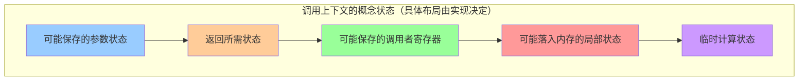
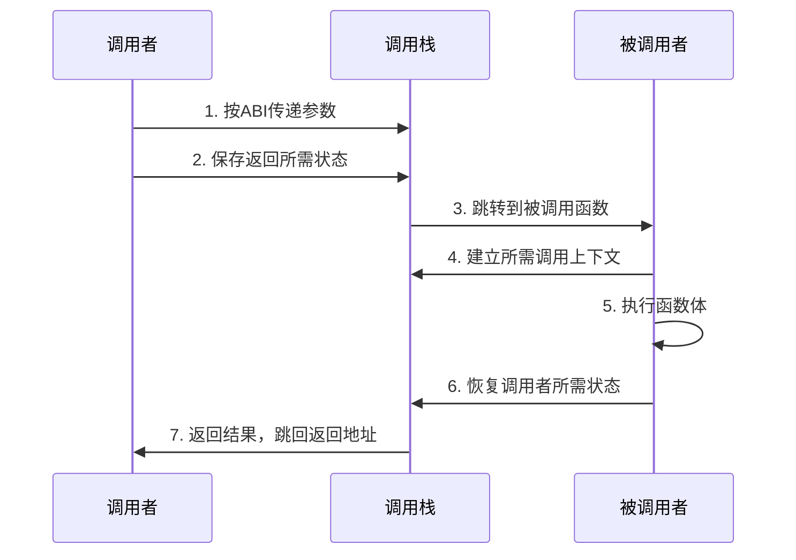
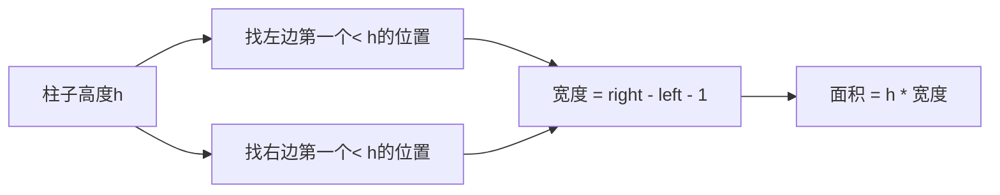

# Day 18：函数调用栈与enum class

> **学习定位**：从算法栈回到程序运行时调用栈，理解递归空间从何而来；再用 `enum class` 表达受限状态。柱状图和接雨水是单调栈深化题，难度较高，可以拆成两次完成。

## 📅 学习目标

- [ ] 理解函数调用栈的工作原理
- [ ] 了解栈帧结构和函数调用过程
- [ ] 掌握enum class的优势
- [ ] 学习EMC++ Item 10
- [ ] 完成LeetCode 84、42

---

## 📖 知识点一：函数调用栈

### 概念定义

**函数调用栈(Call Stack)** 是常见 C++ 实现用来管理未完成函数调用的运行时机制。在没有被内联、尾调用消除或其他优化改写时，一次调用通常会建立调用上下文（常称**栈帧，Stack Frame**）；但 C++ 标准不保证“每次调用都在内存栈上创建一块固定格式的栈帧”。

先不要急着背“谁入栈、谁出栈”，先回答函数本身承诺什么。以 `factorial(n)` 为例：前置条件是 `n >= 0`，后置条件是返回 `n!`；递归步的含义是“假设 `factorial(n - 1)` 能正确返回 `(n - 1)!`，当前层再乘 `n`”，基准情况负责停止缩小。调用栈只是运行时保存“这一层还在等待什么”的机制，不是递归正确性的来源。

### 专业介绍

函数调用栈是程序运行时的核心机制，其工作原理如下：

**栈帧结构**：一次未完成的函数调用通常需要保存返回位置、部分寄存器和局部状态，形成调用链。具体哪些参数放寄存器、哪些值真正落到栈内存，以及是否保留独立栈帧，由平台 ABI、编译器和优化级别决定；C++ 语言并不规定一张固定布局图。

**调用过程**：调用者先满足函数的参数与对象生命周期契约，再按 ABI 传递参数并转移控制权。被调函数执行后返回结果，运行时恢复调用者继续执行所需的状态。下方“压栈/弹栈”图是帮助入门的抽象模型，不是所有机器上的逐字节实况。

**栈溢出**：当递归深度过大或局部变量过多，超出栈空间限制时，会发生栈溢出(Stack Overflow)。这是常见的程序崩溃原因，需要合理控制递归深度和局部变量大小。

### 形象化理解

想象一个书桌上的文件夹堆叠：

```
文件夹堆（函数调用栈）
┌──────────────────┐
│  main()文件夹    │ ← 最底层，程序入口
├──────────────────┤
│  funcA()文件夹   │ ← main调用funcA
├──────────────────┤
│  funcB()文件夹   │ ← funcA调用funcB
├──────────────────┤
│  funcC()文件夹   │ ← funcB调用funcC（当前执行）
└──────────────────┘
```

把“文件夹”理解为一层尚未完成调用的**概念状态**即可。实现可能需要保存局部状态、参数的一部分、返回位置或调用者寄存器，也可能把参数和局部值完全留在寄存器中；是否存在“上一个栈帧指针”同样取决于 ABI、编译器和优化选项。

### 栈帧结构


```mermaid
graph TB
    subgraph "调用上下文的概念状态（具体布局由实现决定）"
    A[可能保存的参数状态] --> B[返回所需状态]
    B --> C[可能保存的调用者寄存器]
    C --> D[可能落入内存的局部状态]
    D --> E[临时计算状态]
    end
    
    style A fill:#99ccff
    style B fill:#ffcc99
    style C fill:#99ff99
    style D fill:#ff9999
    style E fill:#cc99ff
```

### 函数调用过程


```mermaid
sequenceDiagram
    participant Caller as 调用者
    participant Stack as 调用栈
    participant Callee as 被调用者
    
    Caller->>Stack: 1. 按ABI传递参数
    Caller->>Stack: 2. 保存返回所需状态
    Stack->>Callee: 3. 跳转到被调用函数
    Callee->>Stack: 4. 建立所需调用上下文
    Callee->>Callee: 5. 执行函数体
    Callee->>Stack: 6. 恢复调用者所需状态
    Stack->>Caller: 7. 返回结果，跳回返回地址
```

### 递归与栈溢出

递归就是函数直接或间接调用自己。在未被优化消除的常见实现中，每一层未完成递归通常都需要独立调用状态，因此深度增长会增加栈空间压力：

```cpp
int factorial(int n) {
    if (n <= 1) return 1;
    return n * factorial(n - 1);  // 递归调用
}

// factorial(5) 的调用栈：
// factorial(5) → factorial(4) → factorial(3) → factorial(2) → factorial(1)
// 然后依次返回：1 → 2 → 6 → 24 → 120
```

**栈溢出**：递归太深，栈空间耗尽：
```cpp
void infiniteRecursion() {
    infiniteRecursion();  // 无限递归，最终Stack Overflow
}
```

把递归改成“尾递归”不等于问题自动消失：C++ 不保证编译器一定做尾调用优化。工程上应先估算最大深度；深度可能随输入线性增长时，优先考虑显式栈或迭代写法。

---

## 📖 知识点二：enum class

### 传统enum的问题

```cpp
// 传统C enum
enum Color { RED, GREEN, BLUE };
enum Size { SMALL, MEDIUM, LARGE };

// 问题1：污染命名空间
int x = RED;  // OK，RED进入枚举所在的外围作用域；此例是全局作用域

// 问题2：隐式转换
if (RED == 0) { }  // OK，隐式转为int

// 问题3：类型不安全
Color c = RED;
Size s = SMALL;
if (c == s) { }  // 编译通过！但语义错误
```

### enum class的优势

```cpp
// C++11 强类型枚举
enum class Color { RED, GREEN, BLUE };
enum class Size { SMALL, MEDIUM, LARGE };

// 优势1：作用域限定
Color c = Color::RED;  // 必须使用 Color::RED
// int x = RED;  // 错误！RED不在全局作用域

// 优势2：不会隐式转换
// if (Color::RED == 0) { }  // 错误！不能比较

// 优势3：类型安全
Color c2 = Color::GREEN;
Size s2 = Size::SMALL;
// if (c2 == s2) { }  // 错误！不同类型不能比较
```

### EMC++ Item 10：优先使用enum class

**要点**：
1. 避免命名污染
2. 避免意外转换
3. 可以前置声明
4. 可以指定底层类型

```cpp
#include <cstdint>

// 指定底层类型
enum class Color : std::uint8_t { RED, GREEN, BLUE };  // 1字节
enum class BigEnum : long long { VAL1, VAL2 };    // 8字节

// 前置声明
enum class Status;  // 可以前置声明
void process(Status s);

enum class Status { OK, ERROR, PENDING };
```

这里有三个容易混淆的边界：

1. `enum class` 的枚举项位于枚举自己的作用域内，因此写 `Color::RED`；“class”不表示它拥有普通类的成员函数或继承能力。
2. 未显式指定时，作用域枚举的底层类型默认为 `int`；需要稳定宽度时可写成 `enum class Status : std::uint8_t`，同时确保所有枚举值都能表示。但固定底层类型只约束枚举的底层表示，不会自动解决文件/网络序列化中的字节序、协议版本、对齐和非法枚举值处理。
3. 它不会隐式转成整数。`static_cast` 增加了一点书写成本，但这正是防止业务状态误当下标或位掩码的安全门；只在序列化、数组索引、日志或旧 C API 边界显式转换。

传统非作用域枚举若指定固定底层类型也可以前置声明；Item 10 的重点不是“只有 `enum class` 能前置声明”，而是作用域、类型安全和稳定底层类型组合起来更适合作为接口类型。

---

## 🎯 LeetCode 刷题

### 讲解题：LC 84. 柱状图中最大的矩形

#### 题目链接

[LeetCode 84](https://leetcode.cn/problems/largest-rectangle-in-histogram/)

#### 题目描述

给定 n 个非负整数，用来表示柱状图中各个柱子的高度。每个柱子彼此相邻，且宽度为 1。求在该柱状图中，能够勾勒出来的矩形的最大面积。

#### 形象化理解

想象一排不同高度的积木，找出能框出的最大矩形面积：

```
高度: [2, 1, 5, 6, 2, 3]

积木图:
    █
  █ █
  █ █
  █ █ █
█ █ █ █ █
█ █ █ █ █ █

最大矩形 = 5 * 2 = 10（第2和第3个柱子）
```

#### 解题思路：单调栈

对于每个柱子，找到左右两边第一个比它矮的柱子，计算面积：


```mermaid
graph LR
    A[柱子高度h] --> B["找左边第一个< h的位置"]
    A --> C["找右边第一个< h的位置"]
    B --> D[宽度 = right - left - 1]
    C --> D
    D --> E[面积 = h * 宽度]
```

**关键技巧**：使用单调递增栈，一次遍历同时找到左右边界。

必须先说清栈中保存什么：栈里放的是**下标**，从栈底到栈顶对应的柱高保持非递减。扫描到位置 `i` 时，若当前高度比栈顶矮，说明栈顶柱子的右侧第一个更矮位置已经确定为 `i`；弹出后新的栈顶就是它左侧第一个更矮的位置，因此宽度为 `i - left - 1`。每个下标最多入栈、出栈各一次，所以总时间是 `O(n)`，不是嵌套 `while` 看起来的 `O(n²)`。

末尾的 0 是“结算哨兵”：它迫使仍在栈中的正高度柱子全部弹出。工程代码可以使用虚拟哨兵 `i == n ? 0 : heights[i]`，避免为了算法方便而给调用者的输入永久追加一个元素。

#### 代码实现

```cpp
int largestRectangleArea(const vector<int>& heights) {
    stack<int> stk;
    int maxArea = 0;
    
    // i == heights.size() 时使用虚拟的0高度哨兵，不修改输入
    for (size_t i = 0; i <= heights.size(); ++i) {
        int current = i == heights.size() ? 0 : heights[i];
        while (!stk.empty() && current < heights[stk.top()]) {
            int h = heights[stk.top()];
            stk.pop();
            size_t width = stk.empty() ? i : i - stk.top() - 1;
            maxArea = max(maxArea, h * static_cast<int>(width));
        }
        stk.push(i);
    }
    
    return maxArea;
}
```

---

### 实战题：LC 42. 接雨水

#### 题目链接

[LeetCode 42](https://leetcode.cn/problems/trapping-rain-water/)

#### 提示

1. 使用单调栈或双指针方法
2. 对于每个位置，找左右两边最高的柱子
3. 能接的雨水量 = min(左边最高, 右边最高) - 当前高度
4. 注意边界条件处理

#### 题目描述

给定 n 个非负整数表示每个宽度为 1 的柱子的高度图，计算按此排列的柱子，下雨之后能接多少雨水。

#### 形象化理解

想象一排柱子，下雨后能接多少水：

```
高度: [0,1,0,2,1,0,1,3,2,1,2,1]

柱子图（R=柱子，W=水）:
        R
    R W W R
  R W R W R R W R
R R W R W R W R W R
↑ 能接6单位水
```

#### 解题思路

**方法一：单调栈**
- 维护单调递减栈
- 当遇到更高的柱子时，可以接雨水

**方法二：双指针**
- 左右指针向中间移动
- 记录左右最大高度

#### 代码实现（单调栈）

```cpp
int trap(const vector<int>& height) {
    stack<int> stk;
    int water = 0;
    
    for (int i = 0; i < height.size(); ++i) {
        while (!stk.empty() && height[i] > height[stk.top()]) {
            int mid = stk.top();
            stk.pop();
            if (stk.empty()) break;
            
            int left = stk.top();
            int h = min(height[left], height[i]) - height[mid];
            int w = i - left - 1;
            water += h * w;
        }
        stk.push(i);
    }
    
    return water;
}
```

---

## 🚀 运行代码

```bash
./build_and_run.sh
```

---

## 💡 学习提示

### 单调栈经典应用

1. **LC 84**：柱状图最大矩形
2. **LC 42**：接雨水
3. **LC 739**：每日温度
4. **LC 85**：最大矩形
5. **LC 316**：去除重复字母

### enum class vs enum

| 特性 | enum | enum class |
|------|------|------------|
| 枚举项作用域 | 进入枚举所在的外围作用域 | 保留在枚举自身作用域，如 `Color::RED` |
| 隐式转换 | 允许 | 禁止 |
| 类型安全 | 否 | 是 |
| 前置声明 | 指定固定底层类型后支持 | 支持，默认底层类型为 `int` |
| 底层类型 | 未指定时由实现选择，也可显式指定 | 默认为 `int`，也可显式指定 |

### 今日工程动作：验证算法不修改输入

在 Day 18 目录执行 `./build_and_run.sh /tmp/week3-day18-action`。重点观察 LC 84 测试不仅检查面积，还比较调用前后的 `heights`，而函数签名也通过 `const` 引用禁止修改输入；这能帮助你区分“测试观察到未修改”和“接口在编译期承诺不修改”。然后尝试删掉虚拟哨兵分支，确认递增数组为何无法结算剩余柱子，实验后恢复正确代码；CTest 中名称带 `SmokeRuns` 的项目只验证总入口能运行并正常退出，算法正确性由独立的 LC 84/42 测试负责。

### 五句复盘

用恰好五句话回答：

1. 递归函数的契约、递归步和基准情况分别解决什么问题？
2. 为什么教材中的栈帧布局不能当成 C++ 标准保证？
3. `enum class` 的作用域、底层类型和显式转换分别提供了什么约束？
4. 最大矩形的单调栈在扫描位置 `i` 前维持什么不变量？
5. 虚拟 0 哨兵为什么能完成结算，又为什么不应永久修改调用者输入？

---

## 📚 相关术语

| 术语 | 英文 | 定义 |
|------|------|------|
| 调用栈 | Call Stack | 管理函数调用的栈结构 |
| 栈帧 | Stack Frame | 常见实现中保存一次未完成调用状态的上下文，具体布局不由 C++ 规定 |
| 栈溢出 | Stack Overflow | 栈空间耗尽导致的错误 |
| enum class | Scoped Enum | 强类型枚举 |
| 强类型枚举 | Strongly-typed Enum | 类型安全的枚举 |

---

## 🔗 参考资料

1. [Hello-Algo - 递归](https://www.hello-algo.com/chapter_computation/recursion/)
2. [cppreference - enum](https://en.cppreference.com/w/cpp/language/enum)
3. [Effective Modern C++ - Item 10](https://www.aristeia.com/EMC++.html)
