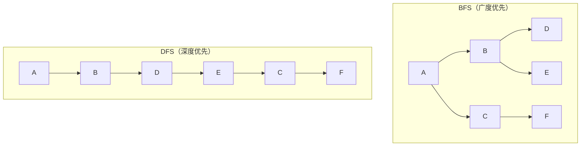
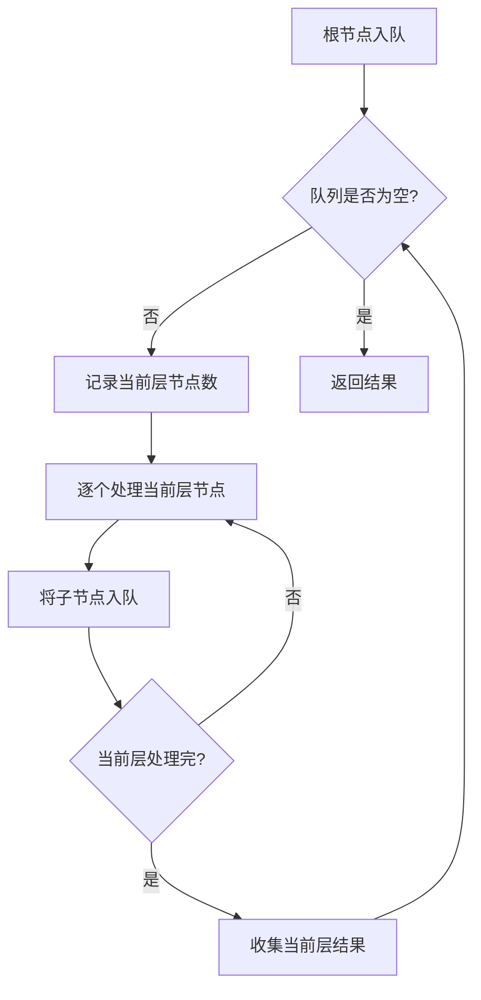

# Day 20：BFS广度优先搜索

> **学习定位**：本日把队列从容器操作升级为搜索框架。重点是“何时标记已访问、如何按层处理、队列中保存什么状态”；树上 BFS 是图上 BFS 的无环简化版。

## 📅 学习目标

- [ ] 理解BFS的原理和应用场景
- [ ] 掌握BFS的标准模板
- [ ] 理解BFS与DFS的区别
- [ ] 学会使用队列实现BFS
- [ ] 完成LeetCode 102、107

---

## 📖 知识点：BFS算法

### 概念定义

**广度优先搜索(BFS, Breadth-First Search)** 是一种图遍历算法，从起点开始，先访问所有相邻节点，再访问相邻节点的相邻节点，层层向外扩展。

### 专业介绍

BFS是图论中的基础算法，其核心特性如下：

**遍历顺序**：BFS按“边数距离”层级遍历，先访问距离起点近的节点，后访问远的节点。因此它能求**无权图或每条边代价相同**时的最短步数；边权不同时不能直接套普通 BFS。

**数据结构**：BFS使用队列(Queue)存储待访问节点。队列的FIFO特性保证了节点按入队顺序被处理，实现层级遍历。

**时间复杂度**：对于邻接表表示的图 `G=(V,E)`，若使用布尔数组或平均 `O(1)` 的哈希集合去重，BFS 的时间复杂度为 `O(V+E)`。这个结论依赖“每个节点最多入队一次”，所以标记时机不是代码风格细节，而是复杂度证明的一部分。

**应用场景**：无权/等权边图的最短步数、层级遍历、连通性检测、拓扑排序、网络爬虫等。

### 形象化理解

想象**水波扩散**：

```
投入一颗石子，水波纹一圈圈向外扩散

        ╭───────╮
      ╭─┼───────┼─╮
    ╭─┼─┼───────┼─┼─╮
    │ │ │   ●   │ │ │  第3层
    ╰─┼─┼───────┼─┼─╯
      ╰─┼───────┼─╯    第2层
        ╰───────╯      第1层
        
起点(●) → 第1圈 → 第2圈 → 第3圈 → ...
```

**生活中的例子**：
- **社交网络**：找朋友的朋友（二度人脉）
- **迷宫**：每一步代价相同时找最少步数
- **传染传播**：病毒传播范围
- **GPS导航不是普通 BFS 的直接例子**：道路距离、时间通常不同，属于加权图，常用 Dijkstra 或 A*；只有把每条边视为等代价时，BFS 才是在找最少经过边数

### BFS vs DFS 对比



| 特性 | BFS | DFS |
|------|-----|-----|
| 数据结构 | 队列 | 栈 |
| 访问顺序 | 先近后远 | 先深入后回溯 |
| 最短路径 | 无权/等权边时保证最少边数 | 不保证 |
| 树遍历额外空间 | `O(最大层宽度)` | `O(最大深度)` |
| 一般图最坏空间 | `O(V)`（队列与 visited） | `O(V)`（栈/递归与 visited） |
| 适用场景 | 无权最短路、层级遍历 | 全排列、回溯 |

### BFS标准模板

```cpp
void bfs(Node* start) {
    queue<Node*> q;
    set<Node*> visited;
    
    visited.insert(start);
    q.push(start);
    
    while (!q.empty()) {
        Node* curr = q.front();
        q.pop();
        
        // 处理当前节点
        process(curr);
        
        // 遍历相邻节点
        for (Node* neighbor : getNeighbors(curr)) {
            if (visited.find(neighbor) == visited.end()) {
                visited.insert(neighbor);
                q.push(neighbor);
            }
        }
    }
}
```

<a id="day20-bfs-enqueue-mark"></a>

### 为什么必须“入队即标记”

设节点 `X` 同时是 `A` 和 `B` 的邻居。如果等到 `X` 出队时才标记，那么处理 `A` 时会把 `X` 入队一次，处理 `B` 时仍看见它“未访问”，又入队一次；在稠密图里重复项会迅速膨胀。发现 `X` 时先标记再入队，相当于把“谁负责处理 X”的所有权交给第一次发现它的前驱，保证每个节点最多入队一次。

树从根向孩子遍历时通常没有回边，每个节点只有一个父节点，所以示例可以不写 `visited`；一旦输入是一般图、网格允许回走，或树节点还保存父指针，就必须恢复去重集合。

### 层序遍历模板

```cpp
vector<vector<int>> levelOrder(TreeNode* root) {
    vector<vector<int>> result;
    if (!root) return result;
    
    queue<TreeNode*> q;
    q.push(root);
    
    while (!q.empty()) {
        size_t levelSize = q.size();  // 冻结本轮的当前层边界
        vector<int> level;
        
        for (std::size_t i = 0; i < levelSize; ++i) {
            TreeNode* node = q.front();
            q.pop();
            level.push_back(node->val);
            
            if (node->left) q.push(node->left);
            if (node->right) q.push(node->right);
        }
        
        result.push_back(level);
    }
    
    return result;
}
```

`levelSize` 必须在本轮 `for` 开始前读取一次。处理当前层节点时，新加入队列的是下一层；若循环条件直接写成变化中的 `q.size()`，当前层和下一层就会混在一起。也可以把 `(node, depth)` 一起入队，但“队列大小快照”是树层序遍历最简洁的模板。

---

## 🎯 LeetCode 刷题

### 讲解题：LC 102. 二叉树的层序遍历

#### 题目链接

[LeetCode 102](https://leetcode.cn/problems/binary-tree-level-order-traversal/)

#### 题目描述

给你二叉树的根节点 `root`，返回其节点值的**层序遍历**结果。

#### 形象化理解

想象从树顶往下看，一层一层地收集节点：

```
        3          第1层: [3]
       / \
      9  20        第2层: [9, 20]
        /  \
       15   7      第3层: [15, 7]

结果: [[3], [9, 20], [15, 7]]
```

#### 解题思路



#### 代码实现

```cpp
vector<vector<int>> levelOrder(TreeNode* root) {
    vector<vector<int>> result;
    if (!root) return result;
    
    queue<TreeNode*> q;
    q.push(root);
    
    while (!q.empty()) {
        int levelSize = q.size();
        vector<int> level;
        
        for (int i = 0; i < levelSize; ++i) {
            TreeNode* node = q.front();
            q.pop();
            level.push_back(node->val);
            
            if (node->left) q.push(node->left);
            if (node->right) q.push(node->right);
        }
        
        result.push_back(level);
    }
    
    return result;
}
```

---

### 实战题：LC 107. 二叉树的层序遍历 II

#### 题目链接

[LeetCode 107](https://leetcode.cn/problems/binary-tree-level-order-traversal-ii/)

#### 提示

1. 与102题解法相同
2. 最后将结果数组反转
3. 或者使用头插法构建结果

#### 题目描述

给你二叉树的根节点 `root`，返回其节点值**自底向上的层序遍历**。

#### 解题思路

只需在102题基础上**反转结果**即可：

```cpp
vector<vector<int>> levelOrderBottom(TreeNode* root) {
    vector<vector<int>> result = levelOrder(root);
    reverse(result.begin(), result.end());
    return result;
}
```

---

## 🚀 运行代码

```bash
./build_and_run.sh
```

---

## 💡 学习提示

### BFS的识别

当你看到以下问题时，考虑使用BFS：
1. 最短路径问题（无权图）
2. 层级遍历（树、图）
3. 连通区域问题
4. "最少步数"问题

### BFS优化技巧

1. **提前退出**：找到目标立即返回
2. **双向BFS**：从起点和终点同时搜索
3. **有权图改用Dijkstra**：它使用优先队列，但不再是普通FIFO BFS
4. **去重**：使用visited集合避免重复访问

### 今日工程动作：制造一次重复入队

在 Day 20 目录执行 `./build_and_run.sh /tmp/week3-day20-action`，确认 CTest 既运行算法断言，也运行独立的 BFS 可视化程序。再画一个菱形图 `S -> A, S -> B, A -> X, B -> X`，先把代码改成“出队时才标记”，记录 `X` 进入队列几次，然后恢复“入队即标记”，确认每个节点最多入队一次；随后把 `levelSize` 改成循环过程中不断读取的 `q.size()`，观察三层树为什么会丢失层级边界并恢复代码。`Day20BfsTemplate` 还验证空迷宫、非矩形迷宫、起终点相同、多路径最短步数和不可达边界，LC 102/107 测试验证树遍历；`Day20SmokeRuns` 只说明总入口可以运行并正常退出，不代表算法断言已经覆盖。

### 五句复盘

用恰好五句话回答：

1. 普通 BFS 为什么只能直接保证无权图或等权图的最短路？
2. 出队时标记为什么会让同一节点重复入队？
3. 入队即标记维持了什么复杂度不变量？
4. 层序遍历中的 `levelSize` 为什么必须是本轮开始时的快照？
5. 树 BFS 什么时候可以省略 `visited`，什么时候必须加回来？

---

## 📚 相关术语

| 术语 | 英文 | 定义 |
|------|------|------|
| 广度优先搜索 | BFS | 层级遍历图的算法 |
| 深度优先搜索 | DFS | 深入遍历图的算法 |
| 层序遍历 | Level Order Traversal | 按层遍历树 |
| 最短路径 | Shortest Path | 两点间最短距离 |
| 连通分量 | Connected Component | 连通的子图 |

---

## 🔗 参考资料

1. [Hello-Algo - BFS](https://www.hello-algo.com/chapter_graph/graph_bfs/)
2. [Hello-Algo - 二叉树遍历](https://www.hello-algo.com/chapter_tree/binary_tree_traversal/)
3. [维基百科 - 广度优先搜索](https://zh.wikipedia.org/wiki/广度优先搜索)
