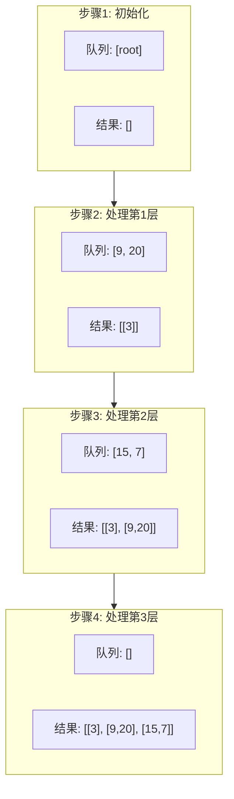

# LeetCode 102: 二叉树的层序遍历

## 题目描述

给你二叉树的根节点 `root`，返回其节点值的**层序遍历**。（即逐层地，从左到右访问所有节点）。

## 示例

### 示例 1

```
输入：root = [3,9,20,null,null,15,7]
输出：[[3],[9,20],[15,7]]
```

```
     3
    / \
   9  20
     /  \
    15   7
```

### 示例 2

```
输入：root = [1]
输出：[[1]]
```

### 示例 3

```
输入：root = []
输出：[]
```

## 形象化理解

### 🏢 楼层电梯比喻

想象一栋大楼，电梯从顶楼开始逐层下降：

```
电梯运行：
┌─────────────┐
│ 第3层: [3]  │  ← 总经理（根节点）
├─────────────┤
│ 第2层: [9,20] │ ← 部门经理
├─────────────┤
│ 第1层: [15,7] │ ← 普通员工
└─────────────┘
```

### 📊 执行过程图解



## 解题思路

### 核心思想

使用**BFS（广度优先搜索）**，配合**队列**实现逐层遍历。

### 关键技巧

**记录当前层大小**：在处理每一层之前，先记录队列大小，这样才能准确处理当前层的所有节点。

```cpp
// ★ 关键代码
int levelSize = q.size();  // 先记录大小
for (int i = 0; i < levelSize; ++i) {
    // 处理当前层节点
}
```

### 为什么需要先记录大小？

```cpp
// 错误写法 ❌
while (!q.empty()) {
    for (int i = 0; i < q.size(); ++i) {  // q.size()会变化！
        // ...
    }
}

// 正确写法 ✓
while (!q.empty()) {
    int levelSize = q.size();  // 固定大小
    for (int i = 0; i < levelSize; ++i) {
        // ...
    }
}
```

## 代码实现

### 方法一：BFS迭代法（推荐）

```cpp
vector<vector<int>> levelOrder(TreeNode* root) {
    vector<vector<int>> result;
    if (!root) return result;
    
    queue<TreeNode*> q;
    q.push(root);
    
    while (!q.empty()) {
        int levelSize = q.size();
        vector<int> currentLevel;
        
        for (int i = 0; i < levelSize; ++i) {
            TreeNode* node = q.front();
            q.pop();
            
            currentLevel.push_back(node->val);
            
            if (node->left) q.push(node->left);
            if (node->right) q.push(node->right);
        }
        
        result.push_back(currentLevel);
    }
    
    return result;
}
```

### 方法二：DFS递归法

```cpp
void dfs(TreeNode* node, int level, vector<vector<int>>& result) {
    if (!node) return;
    
    if (level >= result.size()) {
        result.push_back({});
    }
    
    result[level].push_back(node->val);
    
    dfs(node->left, level + 1, result);
    dfs(node->right, level + 1, result);
}

vector<vector<int>> levelOrder(TreeNode* root) {
    vector<vector<int>> result;
    dfs(root, 0, result);
    return result;
}
```

## 复杂度分析

| 方法 | 时间复杂度 | 空间复杂度 |
|------|-----------|-----------|
| BFS迭代 | O(n) | O(w)，w为最大宽度 |
| DFS递归 | O(n) | O(h)，h为高度 |

## 易错点

1. **忘记检查空树**：`if (!root) return result;`
2. **在循环中使用q.size()**：导致处理层数错误
3. **子节点入队顺序**：应该先左后右，保证顺序
4. **忘记弹出节点**：`q.pop()` 必须调用

## 相关题目

- [107. 二叉树的层序遍历 II](../0107_level_order_bottom/) - 自底向上层序遍历
- [199. 二叉树的右视图](#) - 每层最右节点
- [637. 二叉树的层平均值](#) - 每层平均值
- [429. N叉树的层序遍历](#) - 扩展到N叉树
