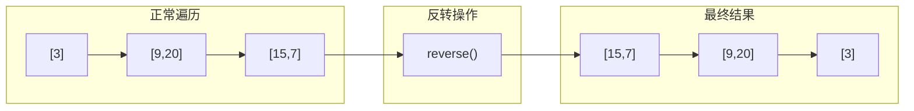

# LeetCode 107: 二叉树的层序遍历 II

## 题目描述

给你二叉树的根节点 `root`，返回其节点值**自底向上**的层序遍历。（即按从叶子节点所在层到根节点所在的层，逐层从左往右遍历）

## 示例

### 示例 1

```
输入：root = [3,9,20,null,null,15,7]
输出：[[15,7],[9,20],[3]]
```

```
     3
    / \
   9  20
     /  \
    15   7
```

### 示例 2

```
输入：root = [1]
输出：[[1]]
```

### 示例 3

```
输入：root = []
输出：[]
```

## 形象化理解

### 📉 倒金字塔比喻

正常层序遍历是从塔顶往下看，而本题要求从塔底往上看：

```
正常层序遍历：           自底向上遍历：
     [3]  ← 顶层            [15,7] ← 底层
    ↙   ↘                   ↖   ↗
 [9,20] 中层              [9,20] 中层
    ↙   ↘                   ↖   ↗
[15,7] ← 底层              [3]   ← 顶层
```

### 🔄 转换过程图解



## 解题思路

### 方法对比

| 方法 | 核心思想 | 优点 | 缺点 |
|------|---------|------|------|
| BFS + 反转 | 正常遍历后反转 | 简单直观 | 多一次反转操作 |
| deque | 每层添加到头部 | 一步到位 | deque转vector |
| DFS递归 | 递归时记录层级 | 代码简洁 | 理解稍难 |

### 方法一：BFS + 反转（推荐）

**最简单直接的方法**：

1. 执行正常的层序遍历
2. 最后反转结果数组

```cpp
vector<vector<int>> levelOrderBottom(TreeNode* root) {
    vector<vector<int>> result;
    if (!root) return result;
    
    queue<TreeNode*> q;
    q.push(root);
    
    // 正常层序遍历
    while (!q.empty()) {
        int levelSize = q.size();
        vector<int> currentLevel;
        
        for (int i = 0; i < levelSize; ++i) {
            TreeNode* node = q.front();
            q.pop();
            
            currentLevel.push_back(node->val);
            
            if (node->left) q.push(node->left);
            if (node->right) q.push(node->right);
        }
        
        result.push_back(currentLevel);
    }
    
    // ★ 关键：反转结果
    reverse(result.begin(), result.end());
    return result;
}
```

### 方法二：使用deque

**核心思想**：使用双端队列，每次添加到头部

```cpp
vector<vector<int>> levelOrderBottom(TreeNode* root) {
    deque<vector<int>> dq;  // 使用deque
    if (!root) return {};
    
    queue<TreeNode*> q;
    q.push(root);
    
    while (!q.empty()) {
        int levelSize = q.size();
        vector<int> currentLevel;
        
        for (int i = 0; i < levelSize; ++i) {
            TreeNode* node = q.front();
            q.pop();
            
            currentLevel.push_back(node->val);
            
            if (node->left) q.push(node->left);
            if (node->right) q.push(node->right);
        }
        
        // ★ 添加到头部，而不是尾部
        dq.push_front(currentLevel);
    }
    
    return vector<vector<int>>(dq.begin(), dq.end());
}
```

### 方法三：DFS递归

**核心思想**：DFS时记录层级，从后往前填充

```cpp
void dfs(TreeNode* node, int level, vector<vector<int>>& result) {
    if (!node) return;
    
    // 需要新层时，在最前面插入
    if (level >= result.size()) {
        result.insert(result.begin(), {});
    }
    
    // 计算实际索引
    int index = result.size() - 1 - level;
    result[index].push_back(node->val);
    
    dfs(node->left, level + 1, result);
    dfs(node->right, level + 1, result);
}
```

## 复杂度分析

| 方法 | 时间复杂度 | 空间复杂度 | 说明 |
|------|-----------|-----------|------|
| BFS + 反转 | O(n) | O(w) | 多一次反转操作 |
| deque | O(n) | O(w) | deque操作是O(1) |
| DFS | O(n) | O(h) | h为树高 |

## 与 LC 102 的关系

```
LC 102: 自顶向下层序遍历
        [[3], [9,20], [15,7]]
              ↓
           reverse()
              ↓
LC 107: 自底向上层序遍历
        [[15,7], [9,20], [3]]
```

**LC 107 就是 LC 102 的结果反转！**

## 易错点

1. **反转时机**：在BFS完成后反转，不是每一层反转
2. **deque转vector**：需要显式转换
3. **DFS索引计算**：`index = result.size() - 1 - level`

## 相关题目

- [102. 二叉树的层序遍历](../0102_level_order/) - 正常层序遍历
- [103. 二叉树的锯齿形层序遍历](#) - 之字形遍历
- [199. 二叉树的右视图](#) - 每层最右节点
- [637. 二叉树的层平均值](#) - 每层平均值
