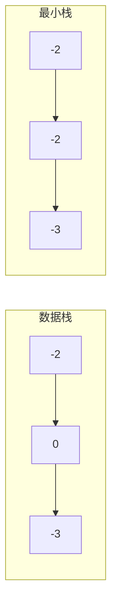

# Day 21：第三周复习

## 📅 学习目标

- [ ] 复习栈和队列的核心知识点
- [ ] 巩固Lambda表达式的各种用法
- [ ] 回顾EMC++ Item 31-34要点
- [ ] 完成LeetCode 155、150
- [ ] 总结本周算法思想

---

## 📖 本周知识回顾

### 数据结构：栈和队列

```mermaid
mindmap
  root((第三周))
    数据结构
      栈Stack
        LIFO后进先出
        入栈push
        出栈pop
        栈顶top
      队列Queue
        FIFO先进先出
        入队enqueue
        出队dequeue
        队首front
    算法
      单调栈
        找下一个更大/更小
        O(n)时间复杂度
      BFS
        队列实现
        层序遍历
        最短路径
```

### 栈的应用场景

| 应用 | 说明 |
|------|------|
| 括号匹配 | LC 20 |
| 表达式求值 | 中缀转后缀 |
| 函数调用 | 调用栈 |
| 撤销操作 | 编辑器 |
| 单调栈 | LC 739, 496, 84, 42 |

### 队列的应用场景

| 应用 | 说明 |
|------|------|
| BFS遍历 | LC 102, 107 |
| 任务调度 | 打印队列 |
| 消息队列 | 异步处理 |
| 优先队列 | LC 215, 347 |

### C++11特性：Lambda表达式

```cpp
// 基本语法
[capture](params) -> return_type { body }

// 捕获方式
[x]      // 值捕获
[&x]     // 引用捕获
[=]      // 全部值捕获（不推荐）
[&]      // 全部引用捕获（不推荐）
[=, &x]  // 混合捕获

// C++14泛型Lambda
auto add = [](auto a, auto b) { return a + b; };

// C++14初始化捕获
auto f = [p = std::move(ptr)]() { };
```

### EMC++ Item 31-34要点

| 条款 | 核心要点 |
|------|---------|
| Item 31 | 避免默认捕获，显式列出变量 |
| Item 32 | 使用初始化捕获实现移动语义 |
| Item 33 | 泛型Lambda使用auto&&和decltype |
| Item 34 | 优先Lambda而非std::bind |

---

## 🎯 LeetCode 刷题

### 讲解题：LC 155. 最小栈

#### 题目链接

[LeetCode 155](https://leetcode.cn/problems/min-stack/)

#### 题目描述

设计一个支持 push，pop，top 操作，并能在常数时间内检索到最小元素的栈。

#### 形象化理解

想象一个"智能书堆"，不仅能正常放书取书，还能随时告诉你当前最薄的书：

```
操作序列：
push(-2) → 栈:[-2], 最小:-2
push(0)  → 栈:[-2, 0], 最小:-2
push(-3) → 栈:[-2, 0, -3], 最小:-3
getMin() → -3
pop()    → 栈:[-2, 0], 最小:-2
top()    → 0
getMin() → -2
```

#### 解题思路

使用**辅助栈**同步记录每个状态下的最小值：



#### 代码实现

```cpp
class MinStack {
private:
    stack<int> dataStack;
    stack<int> minStack;
    
public:
    void push(int x) {
        dataStack.push(x);
        if (minStack.empty() || x <= minStack.top()) {
            minStack.push(x);
        } else {
            minStack.push(minStack.top());
        }
    }
    
    void pop() {
        dataStack.pop();
        minStack.pop();
    }
    
    int top() {
        return dataStack.top();
    }
    
    int getMin() {
        return minStack.top();
    }
};
```

---

### 实战题：LC 150. 逆波兰表达式求值

#### 题目链接

[LeetCode 150](https://leetcode.cn/problems/evaluate-reverse-polish-notation/)

#### 提示

1. 使用栈存储操作数
2. 遇到运算符时弹出两个操作数计算
3. 结果压回栈中
4. 注意操作数的顺序（先弹出的是右操作数）

#### 题目描述

根据逆波兰表示法（后缀表达式），求表达式的值。

#### 形象化理解

逆波兰表达式就是"操作数在前，运算符在后"：

```
中缀表达式: (2 + 3) * 4
后缀表达式: 2 3 + 4 *

计算过程：
  读入2 → 栈:[2]
  读入3 → 栈:[2, 3]
  读入+ → 弹出3和2，计算2+3=5，栈:[5]
  读入4 → 栈:[5, 4]
  读入* → 弹出4和5，计算5*4=20，栈:[20]
  结果: 20
```

#### 解题思路

使用栈计算：
1. 遇到数字 → 入栈
2. 遇到运算符 → 弹出两个操作数计算，结果入栈

#### 代码实现

```cpp
int evalRPN(vector<string>& tokens) {
    stack<int> stk;
    
    for (const string& token : tokens) {
        if (token == "+" || token == "-" || token == "*" || token == "/") {
            int b = stk.top(); stk.pop();
            int a = stk.top(); stk.pop();
            
            if (token == "+") stk.push(a + b);
            else if (token == "-") stk.push(a - b);
            else if (token == "*") stk.push(a * b);
            else stk.push(a / b);
        } else {
            stk.push(stoi(token));
        }
    }
    
    return stk.top();
}
```

---

## 🚀 运行代码

```bash
./build_and_run.sh
```

---

## 💡 本周总结

### 算法思想

1. **栈**：适合"最近的xxx"问题，如最近匹配、最近更大
2. **单调栈**：O(n)找下一个更大/更小元素
3. **队列**：适合"先来先服务"、层次遍历
4. **BFS**：最短路径、层级遍历的标准解法

### 编程技巧

1. **Lambda**：简洁的回调、自定义比较器
2. **显式捕获**：避免悬空引用和指针问题
3. **辅助栈/队列**：解决复杂问题

### 下周预告

第四周将学习：
- 哈希表数据结构
- 右值引用与移动语义
- 完美转发
- 字符串专题

---

## 📚 相关术语

| 术语 | 英文 | 定义 |
|------|------|------|
| 栈 | Stack | LIFO数据结构 |
| 队列 | Queue | FIFO数据结构 |
| 单调栈 | Monotonic Stack | 保持单调性的栈 |
| BFS | Breadth-First Search | 广度优先搜索 |
| Lambda | Lambda Expression | 匿名函数 |
| 闭包 | Closure | Lambda及其捕获的环境 |

---

## 🔗 参考资料

1. [Hello-Algo - 栈和队列](https://www.hello-algo.com/chapter_stack_and_queue/)
2. [cppreference - stack](https://en.cppreference.com/w/cpp/container/stack)
3. [cppreference - queue](https://en.cppreference.com/w/cpp/container/queue)
4. [Effective Modern C++ - Item 31-34](https://www.aristeia.com/EMC++.html)
